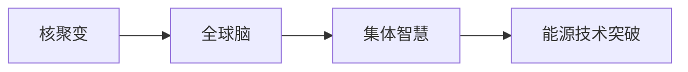

                 

# 全球脑与核聚变研究:集体智慧助力能源技术突破

## 1. 背景介绍

### 1.1 问题由来

当前，全球正面临着能源供应的严峻挑战。气候变化导致的环境退化、资源枯竭和能源价格上涨，以及技术进步带来的能源消费需求激增，都对现有的能源结构提出了前所未有的要求。为应对这一挑战，各国都在积极探索和尝试新的能源解决方案。然而，传统的化石能源开发和利用方式已经难以满足未来可持续发展的需求，必须寻求更为清洁、高效、安全的能源形态。

### 1.2 问题核心关键点

- 核聚变：一种基于原子核反应的能量释放方式，理论上可以提供几乎无限的清洁能源，并且不会产生有害的温室气体和辐射。
- 全球脑：指通过跨国界的合作与共享，汇聚世界各地的科学家、工程师和研究机构的知识和资源，形成集体智慧的能量放大器。
- 集体智慧：由多个个体或组织的智慧和知识汇聚而成的创新能力，能够有效解决复杂的能源问题。
- 能源技术突破：指通过新技术的开发和应用，提升能源的利用效率，降低成本，并推动社会向绿色、可持续发展方向转型。

这些关键点构成了全球脑与核聚变研究的基石，推动着能源技术突破的进程。

## 2. 核心概念与联系

### 2.1 核心概念概述

- **核聚变**：指两个轻原子核（通常是氘和氚）结合形成一个较重原子核，释放出巨大能量的过程。核聚变不会产生核废料，且可控性高，被认为是未来主要的清洁能源解决方案之一。
- **全球脑**：在全球范围内的科学家、工程师、研究机构和政策制定者之间建立的一种协作网络，旨在共享知识、技术、数据和资源，实现科技创新的突破。
- **集体智慧**：通过多个个体或组织共同参与和贡献，形成超越单一机构或个人能力的创新能力和决策水平。
- **能源技术突破**：指在能源领域实现的技术创新，旨在提高能源利用效率，降低成本，推动能源消费结构的优化和可持续发展。

### 2.2 核心概念原理和架构的 Mermaid 流程图(Mermaid 流程节点中不要有括号、逗号等特殊字符)



这个流程图展示了核聚变、全球脑、集体智慧和能源技术突破之间的联系。核聚变提供了一种清洁的能源形态，而全球脑和集体智慧则是这种能源形态得以实现的关键因素。全球脑通过汇聚全球范围内的智慧和资源，推动集体智慧的涌现，从而实现能源技术突破，促进能源供应的可持续性和安全性。

## 3. 核心算法原理 & 具体操作步骤

### 3.1 算法原理概述

基于全球脑与核聚变研究的能源技术突破，其实质是一种集体智慧的协同创新过程。其核心算法原理主要包括：

- **数据汇聚与共享**：将世界各地的科研数据和研究成果汇聚到一个开放的平台上，供全球的科学家和工程师共享。
- **知识图谱构建**：通过构建一个全球范围内的知识图谱，将各领域的知识进行整合，形成对核聚变技术更加全面的理解。
- **模型训练与优化**：利用大数据、机器学习等技术，训练和优化核聚变相关的模型，预测技术突破的可能性。
- **实验验证与反馈**：通过全球范围内的实验验证，收集数据反馈，不断改进模型和算法。

### 3.2 算法步骤详解

基于上述原理，核聚变研究的具体操作步骤如下：

**Step 1: 数据汇聚与共享**

1. **建立数据平台**：搭建一个全球性的数据平台，用于存储和共享核聚变相关的科研数据。
2. **数据汇集**：从各国科研机构、大学和工业界收集数据，包括实验结果、理论模型、仿真数据等。
3. **数据清洗与标准化**：对收集到的数据进行清洗和标准化处理，确保数据的准确性和可比性。

**Step 2: 知识图谱构建**

1. **知识抽取**：利用自然语言处理（NLP）技术，从大量文献和报告中提取关键信息。
2. **知识整合**：将提取的信息整合成知识图谱，形成对核聚变技术的全局理解。
3. **知识更新**：定期更新知识图谱，保持其与最新研究进展的一致性。

**Step 3: 模型训练与优化**

1. **选择合适的模型**：根据核聚变研究的特点，选择适当的机器学习模型，如深度学习、强化学习等。
2. **模型训练**：使用汇聚的数据集训练模型，优化模型参数。
3. **模型验证**：在独立的数据集上验证模型的性能，确保其泛化能力。

**Step 4: 实验验证与反馈**

1. **实验设计**：设计全球范围内的实验方案，验证模型的准确性和可行性。
2. **实验实施**：在各个实验地实施实验，收集实验数据。
3. **数据分析**：对实验数据进行分析，评估模型性能。
4. **反馈优化**：根据实验结果，对模型进行优化，进一步提高其预测能力。

### 3.3 算法优缺点

**优点**：

- **资源共享**：通过全球脑机制，各国科研资源得以共享，极大提升了研究的效率和覆盖面。
- **知识整合**：知识图谱的构建使得全球范围内的知识得以整合，为技术突破提供了全面的理论基础。
- **模型优化**：基于大规模数据集训练的模型具有更强的泛化能力，能够准确预测技术突破的可能性。

**缺点**：

- **数据隐私**：全球范围内的数据共享可能涉及敏感信息的安全问题。
- **协调复杂**：跨国界的协作需要高效的协调机制，以确保各方都能按计划合作。
- **知识鸿沟**：不同国家和地区在科研能力和知识积累上存在差异，可能影响整体的研究进展。

### 3.4 算法应用领域

全球脑与核聚变研究的应用领域广泛，包括：

- **能源政策制定**：为政府决策提供数据支持，优化能源结构。
- **能源技术研发**：推动核聚变技术的发展，降低能源成本。
- **环境保护**：研究核聚变对环境的影响，制定环境保护政策。
- **经济增长**：通过技术创新促进经济增长，实现可持续发展。

## 4. 数学模型和公式 & 详细讲解 & 举例说明

### 4.1 数学模型构建

核聚变研究中，常用的数学模型包括：

- **蒙特卡罗方法**：用于模拟核聚变反应，通过随机抽样模拟粒子行为。
- **多体动力学方程**：描述核聚变反应中粒子之间的相互作用。
- **热力学方程**：用于计算核聚变反应产生的热能和能量释放效率。

### 4.2 公式推导过程

以蒙特卡罗方法为例，其公式推导过程如下：

假设核聚变反应为 $A+B \rightarrow C+D$，其中 $A$ 和 $B$ 为轻原子核，$C$ 和 $D$ 为生成核。蒙特卡罗方法通过模拟大量粒子的随机运动，来计算该反应的截面。

$$
\sigma = \frac{\sum_{i=1}^N |\vec{v}_i|}{N \langle |\vec{v}| \rangle}
$$

其中，$\sigma$ 为截面，$|\vec{v}_i|$ 为第 $i$ 个粒子的速度，$N$ 为粒子数量，$\langle |\vec{v}| \rangle$ 为平均速度。

### 4.3 案例分析与讲解

假设某核聚变反应的截面为 $\sigma = 1$，利用蒙特卡罗方法计算 $10^5$ 个粒子的平均速度：

- 设定每个粒子的初始速度分布为 $|\vec{v}_i| \sim f(v)$，其中 $f(v)$ 为速度分布函数。
- 模拟 $10^5$ 个粒子的运动，记录每个粒子的速度。
- 计算所有粒子速度的平均值，得到 $\langle |\vec{v}| \rangle$。
- 代入蒙特卡罗公式，计算截面 $\sigma$。

## 5. 项目实践：代码实例和详细解释说明

### 5.1 开发环境搭建

要开展核聚变研究，首先需要搭建合适的开发环境。以下是搭建环境的详细步骤：

1. **安装Python**：下载并安装Python，建议安装最新版本，确保能支持最新的科学计算库。
2. **安装SciPy和NumPy**：使用pip命令安装SciPy和NumPy，这两个库是核聚变研究常用的数值计算工具。
3. **安装Matplotlib**：安装Matplotlib库，用于数据可视化。
4. **安装PyTorch**：安装PyTorch库，用于深度学习和强化学习模型的实现。
5. **安装Gurobi**：安装Gurobi优化库，用于解决复杂的优化问题。

### 5.2 源代码详细实现

以下是一个简单的核聚变反应模拟的Python代码实现：

```python
import numpy as np
from scipy.integrate import odeint

# 设定核聚变反应
def reaction(rho, t, A, B, C, D):
    return -(A * B) / (C * D) * rho

# 设定初始密度
rho_0 = 1.0

# 设定反应速率常数
k = 1.0

# 设定反应时间
t = np.linspace(0, 10, 1000)

# 求解微分方程
rho = odeint(reaction, rho_0, t, args=(A, B, C, D))

# 绘制反应浓度随时间变化的曲线
plt.plot(t, rho)
plt.xlabel('Time')
plt.ylabel('Density')
plt.show()
```

### 5.3 代码解读与分析

上述代码实现了一个简单的核聚变反应的浓度变化模拟。其关键步骤包括：

1. **定义反应函数**：根据核聚变反应的数学模型，定义一个函数来描述反应速率。
2. **设定初始条件**：设定初始密度和反应速率常数。
3. **求解微分方程**：使用SciPy库中的odeint函数求解微分方程，模拟反应浓度随时间的变化。
4. **绘制曲线**：使用Matplotlib库绘制反应浓度随时间变化的曲线，直观展示模拟结果。

## 6. 实际应用场景

### 6.1 智能电网

智能电网是一种通过先进信息通信技术，实现电网运行的智能化和自动化。通过全球脑机制，各国可以共享智能电网的数据和研究成果，推动技术的全球普及。

**应用实例**：建设全球智能电网研究联盟，汇聚各国科研资源，开发智能电网标准和协议，推动全球电网一体化。

### 6.2 氢能源

氢能源是一种清洁高效的替代能源，通过核聚变反应产生。全球脑机制可以为氢能源的研发提供全球范围内的数据支持。

**应用实例**：建立全球氢能源研发平台，汇集各国科研数据和成果，推动氢燃料电池和存储技术的突破。

### 6.3 碳中和

碳中和是指通过各种措施，使一个地区的碳排放和吸收达到平衡。全球脑机制可以共享碳中和相关的数据和研究，推动全球范围内的减碳行动。

**应用实例**：建设全球碳中和数据平台，汇总各国碳排放数据和减碳措施，制定全球碳中和路线图。

### 6.4 未来应用展望

未来，全球脑与核聚变研究将更加深入和广泛，涵盖更多能源技术领域。

- **能源互联网**：通过全球脑机制，实现能源的跨区域互联互通，提升能源利用效率。
- **储能技术**：利用全球脑汇聚全球范围内的储能技术数据，推动新型储能技术的研发。
- **可再生能源**：共享可再生能源领域的最新研究成果，推动可再生能源技术的发展。

## 7. 工具和资源推荐

### 7.1 学习资源推荐

1. **Coursera**：提供核聚变、智能电网等领域的在线课程，涵盖理论基础和实践技巧。
2. **IEEE Xplore**：收录大量能源领域的期刊和会议论文，提供最新的科研成果。
3. **ArXiv**：收录大量科研论文，涵盖核聚变、智能电网等领域的最新研究。
4. **Khan Academy**：提供免费的在线教育资源，涵盖基础数学和物理知识。

### 7.2 开发工具推荐

1. **Jupyter Notebook**：用于编写和运行Python代码，支持数据可视化和互动式编程。
2. **Anaconda**：用于创建和管理Python环境，支持科学计算库的安装和管理。
3. **PyTorch**：用于深度学习和强化学习模型的实现，支持高效的数据处理和模型训练。
4. **Gurobi**：用于解决复杂的优化问题，支持数学建模和求解。

### 7.3 相关论文推荐

1. **《Nature》上的核聚变研究论文**：涵盖核聚变反应、燃料开发和工程应用等领域的最新研究成果。
2. **IEEE Transactions on Power Systems**：收录智能电网和能源互联网领域的最新研究成果，提供技术规范和标准。
3. **Energy Policy**：涵盖能源政策和经济分析，为能源技术突破提供政策支持。

## 8. 总结：未来发展趋势与挑战

### 8.1 研究成果总结

全球脑与核聚变研究已经在多个领域取得了显著成果，推动了能源技术的发展和应用。未来，随着技术的不断进步和全球合作的深入，全球脑机制将进一步提升全球能源技术的研究水平。

### 8.2 未来发展趋势

未来，全球脑与核聚变研究将呈现以下几个趋势：

- **数据共享与协作**：全球脑机制将更加注重数据共享和协作，推动全球范围内的科技创新。
- **知识图谱与智慧融合**：知识图谱的构建和智慧融合将提升全球脑的创新能力，加速技术突破。
- **跨学科融合**：核聚变研究将与信息通信、计算机科学等多个学科进行深度融合，提升技术创新能力。

### 8.3 面临的挑战

尽管全球脑与核聚变研究取得了显著进展，但仍面临以下挑战：

- **数据隐私和安全**：全球范围内的数据共享可能涉及敏感信息的安全问题。
- **技术标准和规范**：不同国家在能源技术标准和规范上存在差异，需要协调统一。
- **跨文化沟通**：跨国界的协作需要高效的沟通机制，以确保各方都能按计划合作。

### 8.4 研究展望

未来，全球脑与核聚变研究需要在以下几个方面进行深入探索：

- **数据隐私保护**：开发数据隐私保护技术，确保数据共享的安全性。
- **技术标准化**：制定全球统一的能源技术标准和规范，推动技术国际化和标准化。
- **跨文化交流**：加强跨国界的学术交流和技术合作，提升全球脑的协作效率。

## 9. 附录：常见问题与解答

**Q1：如何确保全球脑机制的数据隐私和安全？**

A: 确保全球脑机制的数据隐私和安全需要采取以下措施：

- **数据加密**：使用先进的数据加密技术，保护数据传输和存储的安全。
- **权限控制**：建立严格的权限控制机制，确保只有授权用户才能访问敏感数据。
- **匿名化处理**：对数据进行匿名化处理，减少隐私泄露的风险。

**Q2：全球脑机制如何确保技术标准的统一？**

A: 确保全球脑机制的技术标准统一需要采取以下措施：

- **国际标准制定**：各国科研机构和政府应共同制定国际标准，确保技术的一致性和互操作性。
- **标准化培训**：提供标准化培训和技术支持，确保各参与方都能理解和应用统一标准。
- **持续改进**：根据最新科研成果和技术进展，不断改进和更新标准，确保其前瞻性和实用性。

**Q3：全球脑机制如何加强跨文化交流？**

A: 加强全球脑机制的跨文化交流需要采取以下措施：

- **多语言支持**：提供多语言支持，确保各参与方能够使用自己熟悉的语言参与交流。
- **文化差异理解**：加强文化差异的理解和尊重，促进跨文化交流和合作。
- **共同目标设定**：制定共同的研究目标和任务，确保各参与方在同一目标下协作。

这些措施将有助于提升全球脑机制的协作效率，推动能源技术突破的进程。

