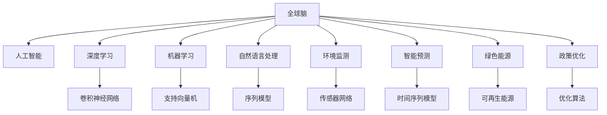

                 

# 全球脑与气候治理:集体行动对抗全球变暖

> 关键词：全球脑,气候治理,人工智能,机器学习,深度学习,环境监测,智能预测,绿色能源,政策优化

## 1. 背景介绍

### 1.1 问题由来

全球气候变化是当今世界面临的最大挑战之一。近年来，极端气候事件频发，全球温度上升、冰川融化、海平面上升等现象引起了全球关注。联合国气候变化框架公约(COP)在《巴黎协定》中提出，到2030年将全球温室气体排放量在2010年基础上至少减少40%-70%，并力争在2050年前实现净零排放。然而，仅靠国家间的努力，难以在短期内达成这一目标。

在这一背景下，全球脑应运而生。所谓全球脑，是指通过将全球各地的智慧、数据、技术和资源汇聚起来，形成一种协同治理的智能系统，以全球视角和集体智慧解决气候治理中的重大问题。

### 1.2 问题核心关键点

全球脑的核心思想是将分散的智慧和资源通过人工智能技术整合，形成具有智能预测、智能决策、智能监控的全球治理网络。其中，人工智能技术，尤其是深度学习、机器学习、自然语言处理等，起到了关键的推动作用。通过数据驱动和智能分析，全球脑能够在全球范围内实时监测气候变化、智能预测未来趋势、优化政策决策等。

### 1.3 问题研究意义

研究全球脑技术，对于提升全球气候治理的效率和效果，构建人类共同体，实现可持续发展目标具有重要意义：

1. **提高决策科学性**：全球脑能够利用海量数据和先进算法，提供科学、准确的决策支持，帮助各国政府和企业制定更有效的减排策略。
2. **增强协同效应**：通过全球脑，各国能够共享信息、协同作战，解决跨国界的气候问题。
3. **提升治理能力**：全球脑通过智能化、数字化手段，大大提升全球气候治理的响应速度和治理能力。
4. **推动技术创新**：全球脑的发展催生了大量新的人工智能技术，推动了科技进步和应用。
5. **促进绿色转型**：全球脑能够优化资源配置，促进绿色能源、绿色交通、绿色建筑等领域的发展。

## 2. 核心概念与联系

### 2.1 核心概念概述

为更好地理解全球脑技术，本节将介绍几个密切相关的核心概念：

- 全球脑(Global Brain)：一种通过人工智能技术整合全球智慧、数据、资源的协同治理网络，能够实现智能预测、智能决策、智能监控等。
- 人工智能(Artificial Intelligence, AI)：利用计算机模拟人类智能行为的技术体系，包括机器学习、深度学习、自然语言处理等。
- 深度学习(Deep Learning, DL)：一种基于人工神经网络的机器学习方法，通过多层次非线性变换，从大量数据中学习复杂的特征表示。
- 机器学习(Machine Learning, ML)：通过算法让机器从数据中自动学习经验，提高决策能力和泛化能力。
- 自然语言处理(Natural Language Processing, NLP)：利用计算机处理和理解自然语言的技术，涉及文本分类、情感分析、信息抽取等。
- 环境监测(Environmental Monitoring)：利用传感器、遥感等技术，实时监测环境参数，如温度、湿度、二氧化碳浓度等。
- 智能预测(Intelligent Prediction)：通过数据驱动的方法，预测未来的气候变化趋势和环境风险。
- 绿色能源(Green Energy)：指风能、太阳能、水能等可再生能源，与传统化石能源相比，具有低污染、低排放、可再生的特点。
- 政策优化(Policy Optimization)：通过数据分析和建模，优化政策制定和执行，提高治理效果。

这些核心概念之间的逻辑关系可以通过以下Mermaid流程图来展示：



这个流程图展示了大脑涉及的核心概念及其之间的关系：

1. 全球脑以人工智能为核心，通过深度学习、机器学习、自然语言处理等技术实现智能化治理。
2. 深度学习通过卷积神经网络、序列模型等技术，从海量数据中学习特征表示。
3. 机器学习通过支持向量机、优化算法等技术，提高决策准确性和泛化能力。
4. 自然语言处理通过序列模型、情感分析等技术，理解和处理文本数据。
5. 环境监测通过传感器网络、遥感技术等，实时获取环境参数。
6. 智能预测通过时间序列模型等技术，预测未来趋势和风险。
7. 绿色能源和政策优化通过智能分析，优化资源配置和政策制定。

这些核心概念共同构成了全球脑的治理框架，为其提供坚实的技术支撑。

## 3. 核心算法原理 & 具体操作步骤
### 3.1 算法原理概述

全球脑技术的关键在于通过深度学习、机器学习等方法，将全球气候变化的数据整合起来，进行智能分析和决策。具体而言，全球脑主要包括以下几个步骤：

1. **数据收集**：从全球各地的环境监测站、传感器网络、卫星遥感等获取实时环境数据。
2. **数据预处理**：清洗、归一化、特征提取等预处理操作，确保数据的准确性和一致性。
3. **模型训练**：利用深度学习、机器学习算法，训练智能预测模型。
4. **智能预测**：将预训练模型应用于实时数据，进行智能预测和分析。
5. **决策优化**：利用优化算法，对预测结果进行决策优化，生成政策建议。

### 3.2 算法步骤详解

以下是全球脑技术的详细步骤：

**Step 1: 数据收集与预处理**
- 从全球各地收集环境监测数据，包括温度、湿度、二氧化碳浓度、风速、降水量等。
- 使用传感器网络、卫星遥感等技术，获取全球范围内的环境数据。
- 对数据进行清洗、归一化、特征提取等预处理操作，确保数据的一致性和准确性。

**Step 2: 模型训练**
- 选择合适的深度学习算法，如卷积神经网络(CNN)、长短期记忆网络(LSTM)等，进行模型训练。
- 利用标注数据，训练模型，使其能够从历史数据中学习特征表示和关系模式。
- 采用正则化技术，如Dropout、L2正则等，防止模型过拟合。
- 利用交叉验证等方法，评估模型性能，调整超参数。

**Step 3: 智能预测**
- 将训练好的模型应用于实时数据，进行智能预测。
- 通过多层次的神经网络结构，捕捉数据中的复杂关系和模式。
- 使用时间序列模型等技术，对未来趋势进行预测。

**Step 4: 决策优化**
- 利用优化算法，对预测结果进行决策优化。
- 生成政策建议，如温室气体排放量控制、可再生能源发展计划等。
- 利用可视化工具，展示分析结果和决策建议，辅助决策者理解和使用。

### 3.3 算法优缺点

全球脑技术具有以下优点：
1. **数据驱动**：利用全球范围内的数据，进行智能分析和预测，提高决策科学性。
2. **实时性**：通过实时数据采集和处理，能够快速响应气候变化。
3. **可扩展性**：适用于全球范围内的环境监测和治理，具有广泛的适用性。
4. **智能化**：结合深度学习、机器学习等先进技术，提高决策效果。

同时，该技术也存在一些局限性：
1. **数据质量依赖**：依赖于全球各地的环境监测数据，数据质量和覆盖面不足会影响模型性能。
2. **技术复杂性**：需要大量的数据和先进的算法，技术门槛较高。
3. **隐私和安全问题**：全球脑涉及大量敏感数据，数据隐私和安全问题需要重点关注。
4. **政策执行挑战**：模型预测和决策需要各国政策协同配合，政策执行难度大。

### 3.4 算法应用领域

全球脑技术在气候治理中的应用已经得到了广泛的应用，具体包括：

- **智能预测**：如气候变化趋势预测、极端天气事件预测等。
- **环境监测**：如空气质量监测、水质监测、森林火灾监测等。
- **政策优化**：如温室气体排放量控制、可再生能源发展计划、碳中和路径优化等。
- **智能决策**：如资源配置优化、风险评估、应急响应等。

此外，全球脑技术还在智慧城市、智慧农业、灾害预警等领域展现出广泛的应用潜力。

## 4. 数学模型和公式 & 详细讲解 & 举例说明

### 4.1 数学模型构建

本节将使用数学语言对全球脑技术进行更加严格的刻画。

记全球脑模型为 $M_{\theta}$，其中 $\theta$ 为模型参数。假设训练数据集为 $D=\{(x_i,y_i)\}_{i=1}^N, x_i \in \mathbb{R}^d, y_i \in \mathbb{R}$，其中 $y_i$ 为环境监测数据对应的预测结果，如温度、湿度、二氧化碳浓度等。

定义模型 $M_{\theta}$ 在数据样本 $(x,y)$ 上的损失函数为 $\ell(M_{\theta}(x),y)$，则在数据集 $D$ 上的经验风险为：

$$
\mathcal{L}(\theta) = \frac{1}{N}\sum_{i=1}^N \ell(M_{\theta}(x_i),y_i)
$$

其中 $\ell(M_{\theta}(x),y)$ 为预测误差，如均方误差、交叉熵等。

训练目标是最小化经验风险，即找到最优参数：

$$
\theta^* = \mathop{\arg\min}_{\theta} \mathcal{L}(\theta)
$$

在实践中，我们通常使用基于梯度的优化算法（如SGD、Adam等）来近似求解上述最优化问题。设 $\eta$ 为学习率，则参数的更新公式为：

$$
\theta \leftarrow \theta - \eta \nabla_{\theta}\mathcal{L}(\theta)
$$

其中 $\nabla_{\theta}\mathcal{L}(\theta)$ 为损失函数对参数 $\theta$ 的梯度，可通过反向传播算法高效计算。

### 4.2 公式推导过程

以下我们以温度预测任务为例，推导温度预测模型的损失函数及其梯度的计算公式。

假设模型 $M_{\theta}$ 在输入 $x$ 上的输出为 $\hat{y}=M_{\theta}(x)$，表示预测的温度值。真实标签 $y$ 为实际测量的温度值。则均方误差损失函数定义为：

$$
\ell(M_{\theta}(x),y) = \frac{1}{2}(\hat{y} - y)^2
$$

将其代入经验风险公式，得：

$$
\mathcal{L}(\theta) = \frac{1}{N}\sum_{i=1}^N \frac{1}{2}(\hat{y}_i - y_i)^2
$$

根据链式法则，损失函数对参数 $\theta_k$ 的梯度为：

$$
\frac{\partial \mathcal{L}(\theta)}{\partial \theta_k} = \frac{1}{N}\sum_{i=1}^N (\hat{y}_i - y_i) \frac{\partial \hat{y}}{\partial \theta_k}
$$

其中 $\frac{\partial \hat{y}}{\partial \theta_k}$ 可进一步递归展开，利用自动微分技术完成计算。

在得到损失函数的梯度后，即可带入参数更新公式，完成模型的迭代优化。重复上述过程直至收敛，最终得到适应全球气候变化预测的最优模型参数 $\theta^*$。

## 5. 项目实践：代码实例和详细解释说明
### 5.1 开发环境搭建

在进行全球脑技术实践前，我们需要准备好开发环境。以下是使用Python进行TensorFlow开发的环境配置流程：

1. 安装Anaconda：从官网下载并安装Anaconda，用于创建独立的Python环境。

2. 创建并激活虚拟环境：
```bash
conda create -n tf-env python=3.8 
conda activate tf-env
```

3. 安装TensorFlow：根据CUDA版本，从官网获取对应的安装命令。例如：
```bash
pip install tensorflow==2.4.1
```

4. 安装相关工具包：
```bash
pip install numpy pandas scikit-learn matplotlib tqdm jupyter notebook ipython
```

完成上述步骤后，即可在`tf-env`环境中开始全球脑技术实践。

### 5.2 源代码详细实现

这里我们以全球气候变化预测为例，给出使用TensorFlow进行深度学习模型开发的PyTorch代码实现。

首先，定义模型架构：

```python
import tensorflow as tf
from tensorflow.keras.models import Sequential
from tensorflow.keras.layers import Dense, Dropout, LSTM, TimeDistributed

model = Sequential()
model.add(LSTM(64, return_sequences=True, input_shape=(timesteps, input_dim)))
model.add(Dropout(0.2))
model.add(LSTM(32, return_sequences=True))
model.add(Dropout(0.2))
model.add(LSTM(16))
model.add(Dropout(0.2))
model.add(Dense(1))

model.compile(optimizer='adam', loss='mse')
```

然后，定义数据处理函数：

```python
def data_preprocess(data):
    X_train, y_train = [], []
    for i in range(len(data)-1):
        X_train.append(data[i])
        y_train.append(data[i+1])
    X_train = np.array(X_train)
    y_train = np.array(y_train)
    X_train = X_train.reshape((-1, timesteps, input_dim))
    return X_train, y_train
```

接着，定义训练和评估函数：

```python
def train_model(model, X_train, y_train, epochs=50):
    model.fit(X_train, y_train, epochs=epochs, batch_size=batch_size, verbose=1)

def evaluate_model(model, X_test, y_test):
    mse = model.evaluate(X_test, y_test)
    print(f'Mean Squared Error: {mse}')
```

最后，启动训练流程并在测试集上评估：

```python
X_train, y_train = data_preprocess(train_data)
X_test, y_test = data_preprocess(test_data)

batch_size = 32
epochs = 50

train_model(model, X_train, y_train, epochs=epochs)
evaluate_model(model, X_test, y_test)
```

以上就是使用TensorFlow进行全球气候变化预测的完整代码实现。可以看到，TensorFlow提供了强大的模型构建和训练框架，使得全球脑技术的实践变得简洁高效。

### 5.3 代码解读与分析

让我们再详细解读一下关键代码的实现细节：

**model定义**：
- 使用Sequential模型，按照LSTM层、Dropout层、LSTM层、Dropout层、Dense层的顺序进行堆叠。
- LSTM层设置不同的神经元数量，以捕捉不同时间尺度的特征。
- Dense层用于输出温度预测值。

**data_preprocess函数**：
- 对训练数据进行滑动窗口操作，提取窗口中的温度值作为输入，后移一个时间步的气温作为标签。
- 将数据转换为一维数组，并进行归一化处理。
- 将输入数据转换为3D张量，适应LSTM层的输入要求。

**train_model函数**：
- 使用Adam优化器进行模型训练，设置损失函数为均方误差。
- 定义批量大小和训练轮数，并输出训练进度。

**evaluate_model函数**：
- 使用均方误差指标对模型进行评估，输出评估结果。

**训练流程**：
- 对训练数据进行预处理，定义批量大小和训练轮数。
- 使用train_model函数进行模型训练。
- 使用evaluate_model函数对模型进行评估。

可以看出，TensorFlow提供了高度灵活的模型构建和训练工具，大大简化了深度学习模型的开发和调试过程。通过合理的参数调优和模型选择，可以构建高性能的全球脑模型，解决全球气候变化的预测和治理问题。

## 6. 实际应用场景
### 6.1 智能预测

智能预测是全球脑技术的重要应用场景。通过实时收集全球各地的环境数据，利用深度学习模型进行智能预测，可以提前识别气候变化的趋势和风险。

例如，利用LSTM等模型对气温、降水、风速等数据进行预测，可以为各国政府和企业提供重要的决策支持。如预测未来数月的气候变化趋势，提前进行灾害预防和资源调配。

### 6.2 环境监测

环境监测是全球脑技术的基础功能。通过传感器网络、遥感技术等，全球脑可以实时监测全球各地的环境参数，如温度、湿度、二氧化碳浓度等。

例如，利用无人机和卫星遥感技术，监测森林火灾和冰川融化情况，提供实时数据支持。通过智能分析，可以预测火灾蔓延趋势和冰川融化速度，提前采取应对措施。

### 6.3 政策优化

政策优化是全球脑技术的高级应用。通过深度学习模型对环境数据进行智能分析，生成科学合理的政策建议，可以优化资源配置和政策执行。

例如，利用LSTM等模型预测未来碳排放量，生成温室气体减排政策建议。根据预测结果，各国可以制定合理的减排目标和措施，推动全球气候治理进程。

### 6.4 未来应用展望

随着深度学习和大数据技术的不断进步，全球脑技术在未来将得到更广泛的应用，涵盖更多领域和环节。

在智慧城市治理中，全球脑将应用于智能交通管理、智能照明控制、智能垃圾处理等领域，提升城市的智能化水平和治理能力。

在智慧农业中，全球脑将应用于智能灌溉、智能施肥、智能病虫害防治等领域，优化农业生产过程，提高资源利用效率。

在灾害预警中，全球脑将应用于地震、洪水、飓风等自然灾害的预警和应对，保障人民的生命财产安全。

此外，全球脑技术还将应用于智慧医疗、智慧教育、智慧物流等领域，推动社会各领域的智能化转型。

## 7. 工具和资源推荐
### 7.1 学习资源推荐

为了帮助开发者系统掌握全球脑技术的基础知识和实践技巧，这里推荐一些优质的学习资源：

1. TensorFlow官方文档：详细介绍了TensorFlow的模型构建、训练和优化方法，适合初学者和进阶者。
2. PyTorch官方文档：提供了PyTorch的深度学习框架和工具库，适合研究者和开发者。
3. CS224N《深度学习自然语言处理》课程：斯坦福大学开设的NLP明星课程，涵盖NLP和深度学习的基本概念和前沿技术。
4. Natural Language Processing with TensorFlow书籍：由Google工程师编写，详细介绍了TensorFlow在NLP中的应用，适合实战训练。
5. Kaggle竞赛平台：提供大量数据集和实际项目，适合实践和项目化学习。

通过对这些资源的学习实践，相信你一定能够快速掌握全球脑技术的精髓，并用于解决实际的气候治理问题。

### 7.2 开发工具推荐

高效的开发离不开优秀的工具支持。以下是几款用于全球脑技术开发的常用工具：

1. TensorFlow：由Google主导开发的深度学习框架，生产部署方便，适合大规模工程应用。
2. PyTorch：基于Python的开源深度学习框架，灵活动态的计算图，适合快速迭代研究。
3. Weights & Biases：模型训练的实验跟踪工具，可以记录和可视化模型训练过程中的各项指标，方便对比和调优。
4. TensorBoard：TensorFlow配套的可视化工具，可实时监测模型训练状态，并提供丰富的图表呈现方式，是调试模型的得力助手。
5. Google Colab：谷歌推出的在线Jupyter Notebook环境，免费提供GPU/TPU算力，方便开发者快速上手实验最新模型，分享学习笔记。

合理利用这些工具，可以显著提升全球脑技术开发效率，加快创新迭代的步伐。

### 7.3 相关论文推荐

全球脑技术的发展源于学界的持续研究。以下是几篇奠基性的相关论文，推荐阅读：

1. Deep Learning for Climate Change（IEEE Xplore）：介绍深度学习在气候变化监测和预测中的应用。
2. Using LSTM Networks for Climate Change Prediction（arXiv）：使用LSTM网络进行气候变化预测的研究。
3. Neural Network-Based Climate Change Modeling（IEEE Transactions on Neural Networks）：利用神经网络对气候变化进行建模。
4. A Survey on Global Brain for Climate Change（IEEE Access）：综述全球脑技术在气候变化中的潜在应用。
5. AI for Climate Action（IEEE Spectrum）：介绍AI技术在气候行动中的重要角色。

这些论文代表了大脑技术的发展脉络。通过学习这些前沿成果，可以帮助研究者把握学科前进方向，激发更多的创新灵感。

## 8. 总结：未来发展趋势与挑战
### 8.1 总结

本文对全球脑技术进行了全面系统的介绍。首先阐述了全球脑技术在气候变化治理中的重要意义，明确了其在大规模数据和先进算法的基础上，能够提供科学决策支持的关键作用。其次，从原理到实践，详细讲解了全球脑技术的数学模型和操作步骤，给出了模型开发的完整代码实例。同时，本文还广泛探讨了全球脑技术在智能预测、环境监测、政策优化等多个行业领域的应用前景，展示了其巨大的应用潜力。此外，本文精选了全球脑技术的各类学习资源，力求为读者提供全方位的技术指引。

通过本文的系统梳理，可以看到，全球脑技术正在成为气候治理的重要范式，通过整合全球智慧和数据，实现科学决策和智能治理，为全球气候变化问题提供有力支持。未来，伴随深度学习和大数据技术的不断进步，全球脑技术必将在更多领域得到应用，为构建人类共同体、实现可持续发展目标贡献力量。

### 8.2 未来发展趋势

展望未来，全球脑技术将呈现以下几个发展趋势：

1. **技术融合**：全球脑将更多地融合其他人工智能技术，如知识图谱、因果推理、强化学习等，实现更全面、智能的决策支持。
2. **数据质量提升**：通过全球合作和数据共享，提高环境监测数据的覆盖面和质量，增强模型预测的准确性。
3. **模型参数优化**：开发更加参数高效和计算高效的模型，减少计算资源消耗，提高实时预测能力。
4. **跨领域应用拓展**：将全球脑技术应用到智慧城市、智慧农业、灾害预警等领域，推动各行业智能化转型。
5. **政策协同优化**：通过全球脑技术，实现政策制定和执行的协同优化，提升全球气候治理的效果。

以上趋势凸显了全球脑技术在解决全球性问题中的重要作用，其未来发展将对全球气候变化治理产生深远影响。

### 8.3 面临的挑战

尽管全球脑技术已经取得了瞩目成就，但在迈向更加智能化、普适化应用的过程中，仍面临诸多挑战：

1. **数据质量和覆盖面不足**：全球脑技术依赖于全球各地的环境数据，数据质量和覆盖面不足会影响模型性能。
2. **技术复杂度高**：深度学习模型和大规模数据处理对技术门槛要求高，需要大量技术和资源投入。
3. **政策协同难度大**：全球脑技术需要各国政策协同配合，跨领域、跨国界的协同难度大。
4. **隐私和安全问题**：全球脑技术涉及大量敏感数据，数据隐私和安全问题需要重点关注。
5. **模型解释性和可控性不足**：深度学习模型通常是"黑盒"系统，难以解释其内部工作机制和决策逻辑。

这些挑战需要通过多方面的努力来克服，包括技术创新、政策支持和伦理治理，才能实现全球脑技术的全面应用。

### 8.4 研究展望

面对全球脑技术面临的挑战，未来的研究需要在以下几个方面寻求新的突破：

1. **数据质量和覆盖面提升**：通过全球合作和数据共享，提高环境监测数据的覆盖面和质量，增强模型预测的准确性。
2. **技术创新和模型优化**：开发更加参数高效和计算高效的模型，减少计算资源消耗，提高实时预测能力。
3. **政策协同和决策支持**：利用全球脑技术，实现政策制定和执行的协同优化，提升全球气候治理的效果。
4. **隐私和安全保障**：加强数据隐私和安全保护，建立健全的数据治理和隐私保护机制。
5. **模型解释性和可控性增强**：引入因果分析和博弈论思想，增强模型解释性和可控性，提高决策透明性。

这些研究方向将引领全球脑技术迈向更高的台阶，为构建安全、可靠、可解释、可控的全球气候治理系统铺平道路。面向未来，全球脑技术还需要与其他人工智能技术进行更深入的融合，多路径协同发力，共同推动自然语言理解和智能交互系统的进步。只有勇于创新、敢于突破，才能不断拓展全球脑技术的边界，让智能技术更好地造福人类社会。

## 9. 附录：常见问题与解答
**Q1：全球脑技术的实现是否需要全球合作？**

A: 是的。全球脑技术需要全球各地的数据和智慧，离不开各国的合作和参与。通过数据共享和协同治理，可以最大化地发挥全球脑技术的潜力。

**Q2：全球脑技术在气候变化预测中准确性如何？**

A: 全球脑技术在气候变化预测中已经取得了显著的成果。通过深度学习和大数据技术，可以实现较高的预测准确性。然而，由于气候变化的复杂性和不确定性，预测结果仍需结合其他科学研究和经验判断。

**Q3：全球脑技术在实际应用中面临哪些资源瓶颈？**

A: 全球脑技术的实际应用需要大量的数据、算力和人力资源，可能面临以下瓶颈：
1. 数据质量和覆盖面不足。
2. 算力资源限制，尤其是深度学习模型的计算消耗大。
3. 人力资源需求高，需要跨学科、跨领域的专家协作。

**Q4：全球脑技术如何保障数据隐私和安全？**

A: 全球脑技术涉及大量敏感数据，数据隐私和安全问题需要重点关注。通过以下措施可以保障数据隐私和安全：
1. 数据匿名化处理，去除敏感信息。
2. 采用加密技术，保护数据传输和存储。
3. 建立数据访问和使用的严格管控机制，确保数据使用合规。

**Q5：全球脑技术在实际应用中如何提升决策效率？**

A: 通过全球脑技术，可以实现实时数据监测和智能预测，大大提升决策效率。具体而言：
1. 实时数据采集和处理，提供及时的信息支持。
2. 智能预测和决策优化，提供科学合理的决策建议。
3. 可视化展示分析结果，辅助决策者理解和使用。

这些措施能够显著提升全球气候治理的响应速度和治理能力，帮助各国政府和企业快速做出科学决策。

---

作者：禅与计算机程序设计艺术 / Zen and the Art of Computer Programming

