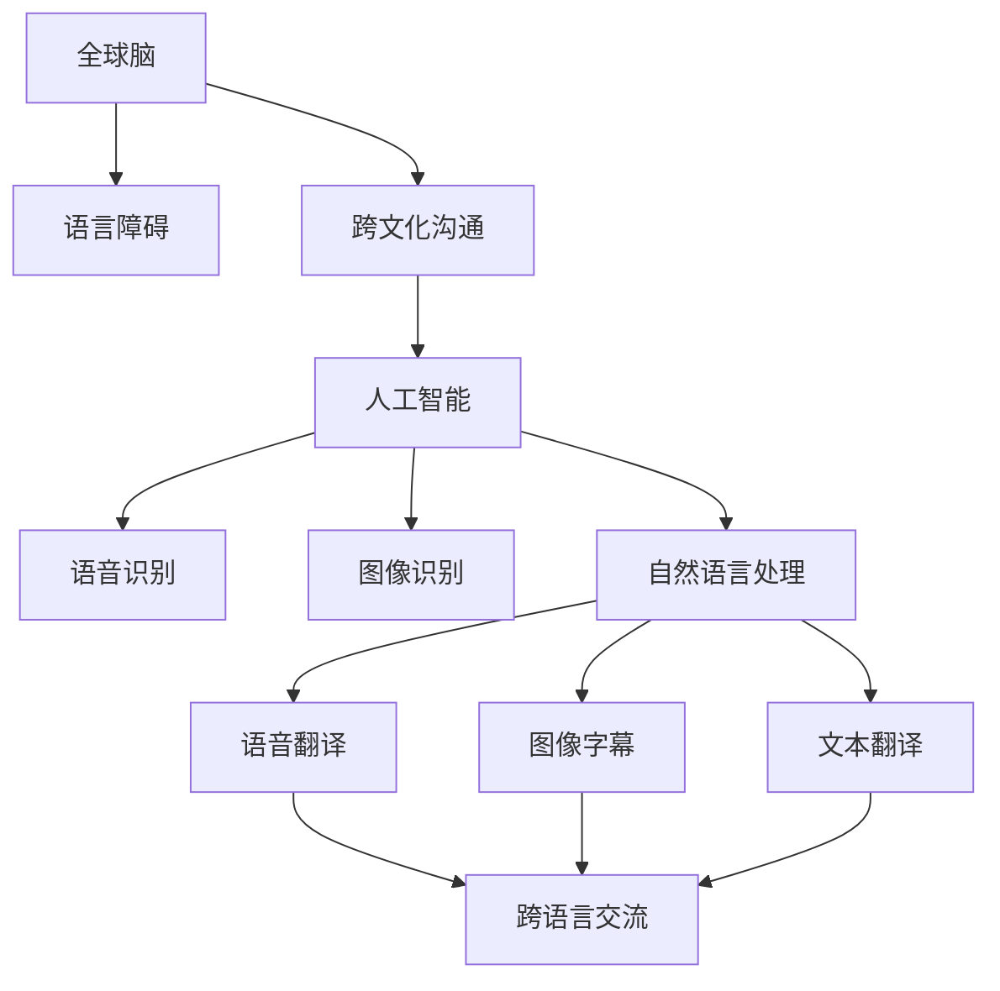

                 

# 全球脑与语言障碍:跨文化沟通的突破

> 关键词：全球脑,语言障碍,跨文化,沟通技术,人工智能,语音识别,图像识别,自然语言处理

## 1. 背景介绍

### 1.1 问题由来
随着全球化的加速，不同语言和文化背景的人们之间的交流变得日益频繁。然而，由于语言障碍，跨文化沟通常常面临重重挑战。据统计，全球大约有7.1亿人面临听力或言语障碍，其中大部分是发展中国家的人口。此外，还有5000万人患有阅读障碍和书写障碍，这些问题直接影响了全球10%的人口。

传统的翻译服务、手语翻译和纸质翻译手册已经无法满足日益增长的跨文化沟通需求。近年来，人工智能(AI)技术在语音识别、图像识别和自然语言处理(NLP)等领域取得了突破性进展，为解决这一问题带来了新的希望。

### 1.2 问题核心关键点
语言障碍是全球跨文化沟通的主要障碍之一。尽管如此，现有的AI技术如语音识别、图像识别和自然语言处理已经在很大程度上缓解了这一问题。然而，由于不同语言和文化之间存在巨大差异，AI技术在跨文化沟通中的效果仍受限。

## 2. 核心概念与联系

### 2.1 核心概念概述

为更好地理解全球脑与语言障碍及其跨文化沟通的突破，本节将介绍几个密切相关的核心概念：

- **全球脑**：指人类大脑在语言和文化背景方面的多样性。全球脑的研究涉及对不同文化背景下语言认知和脑功能的理解。

- **语言障碍**：指听、说、读、写等方面的障碍，包括但不限于失聪、听力障碍、言语障碍、阅读障碍和书写障碍。这些障碍会影响个体与他人进行有效沟通的能力。

- **跨文化沟通**：指跨越语言和文化界限的沟通，涉及不同文化背景之间的信息交换。跨文化沟通的目标是消除语言障碍，促进不同文化背景的人们之间的理解和合作。

- **人工智能**：指通过算法和计算能力实现智能行为的技术。AI技术在语音识别、图像识别和自然语言处理等领域已取得显著进展，为解决语言障碍和跨文化沟通提供了新的解决方案。

- **语音识别**：指将人类语音转化为文本或其他形式的信息，是AI技术中应用最广泛的一项。

- **图像识别**：指通过算法自动识别和分类图像中的对象、场景和行为，是计算机视觉领域的重要技术。

- **自然语言处理**：指计算机对人类语言进行分析、理解和生成，是AI技术中的核心领域。

这些核心概念之间的逻辑关系可以通过以下Mermaid流程图来展示：



这个流程图展示了大脑、语言障碍、跨文化沟通与人工智能技术之间的联系：

1. 全球脑的研究揭示了人类语言和脑功能的复杂性。
2. 语言障碍是跨文化沟通的主要障碍。
3. 人工智能技术通过语音识别、图像识别和自然语言处理，为解决语言障碍提供了技术手段。
4. 语音识别和图像识别支持语音翻译和图像字幕，是实现跨语言交流的基础。
5. 自然语言处理提供了文本翻译，支持跨语言文本交流。
6. 这些技术共同促进了跨文化沟通的突破。

## 3. 核心算法原理 & 具体操作步骤

### 3.1 算法原理概述

全球脑与语言障碍的跨文化沟通，主要依赖于语音识别、图像识别和自然语言处理等人工智能技术。这些技术的核心原理如下：

- **语音识别**：基于深度神经网络模型（如卷积神经网络CNN、循环神经网络RNN、长短期记忆网络LSTM、Transformer等），通过对大量带有标签的语音数据进行训练，使模型能够将语音信号转化为文本。

- **图像识别**：同样基于深度神经网络模型，通过对大量带有标签的图像数据进行训练，使模型能够自动识别和分类图像中的对象、场景和行为。

- **自然语言处理**：基于深度神经网络模型，通过对大量带有标签的文本数据进行训练，使模型能够进行文本分类、命名实体识别、情感分析、机器翻译等任务。

以上技术的核心原理是：通过大量有标注数据的训练，使模型能够从原始数据中学习到丰富的特征表示，从而实现对语音、图像和文本数据的自动理解和生成。

### 3.2 算法步骤详解

全球脑与语言障碍的跨文化沟通，可以通过以下步骤进行：

**Step 1: 数据准备**
- 收集不同语言和文化背景下的文本、语音和图像数据。
- 对这些数据进行预处理和标注，生成有标注的数据集。

**Step 2: 模型训练**
- 选择合适的深度神经网络模型，并利用有标注的数据集进行训练。
- 调整模型的超参数，以优化模型的性能。

**Step 3: 模型评估**
- 在测试集上评估模型的性能，如准确率、召回率、F1值等。
- 根据评估结果调整模型的超参数，并重新训练。

**Step 4: 应用部署**
- 将训练好的模型部署到实际应用中，如语音翻译、图像字幕、文本翻译等。
- 实时收集用户反馈，并不断优化模型的性能。

### 3.3 算法优缺点

基于深度神经网络的全球脑与语言障碍的跨文化沟通技术，具有以下优点：

- **准确率高**：深度神经网络模型通过大量有标注数据的训练，能够准确识别和理解语音、图像和文本数据。
- **应用广泛**：语音识别、图像识别和自然语言处理技术已经被广泛应用于各种领域，如医疗、教育、金融等。
- **灵活性高**：深度神经网络模型可以通过微调或迁移学习的方式，适应不同的语言和文化背景。

然而，这些技术也存在一些缺点：

- **数据依赖性强**：深度神经网络模型需要大量有标注数据进行训练，而标注数据获取成本较高。
- **计算资源需求高**：深度神经网络模型需要强大的计算资源进行训练和推理。
- **可解释性差**：深度神经网络模型通常是"黑盒"模型，难以解释其内部工作机制。
- **鲁棒性不足**：深度神经网络模型对噪声和异常数据的鲁棒性较弱，容易过拟合。

### 3.4 算法应用领域

基于深度神经网络的全球脑与语言障碍的跨文化沟通技术，已经在多个领域得到了广泛应用，例如：

- **医疗领域**：语音识别技术可以用于医疗诊断和治疗，帮助医生听取和分析患者的心跳、呼吸等生理数据。
- **教育领域**：图像识别技术可以用于辅助教学，帮助教师识别学生的面部表情和肢体语言，进行情感分析。
- **金融领域**：自然语言处理技术可以用于金融分析，帮助分析师理解新闻、报告和公告中的关键信息。
- **翻译服务**：语音翻译和文本翻译技术可以用于跨语言交流，帮助不同语言背景的人们进行实时交流。

## 4. 数学模型和公式 & 详细讲解 & 举例说明

### 4.1 数学模型构建

基于深度神经网络的全球脑与语言障碍的跨文化沟通技术，主要涉及语音识别、图像识别和自然语言处理等领域的数学模型。下面以自然语言处理为例，介绍相关数学模型。

自然语言处理中的常见任务包括文本分类、命名实体识别、情感分析和机器翻译等。下面以机器翻译为例，介绍数学模型的构建。

假设输入文本为 $x$，输出文本为 $y$。基于深度神经网络的机器翻译模型可以表示为：

$$
y = M_{\theta}(x)
$$

其中 $M_{\theta}$ 为深度神经网络模型，$\theta$ 为模型的可训练参数。

### 4.2 公式推导过程

以机器翻译为例，深度神经网络模型通常采用序列到序列(Seq2Seq)结构，包括编码器和解码器两部分。假设编码器将输入文本 $x$ 映射为隐状态 $z$，解码器将隐状态 $z$ 映射为输出文本 $y$。数学模型可以表示为：

$$
z = E_{\theta_E}(x)
$$
$$
y = D_{\theta_D}(z)
$$

其中 $E_{\theta_E}$ 和 $D_{\theta_D}$ 分别为编码器和解码器，$\theta_E$ 和 $\theta_D$ 分别为编码器和解码器的可训练参数。

对于机器翻译任务，通常使用交叉熵损失函数进行优化，其数学公式为：

$$
\mathcal{L}(\theta) = -\frac{1}{N}\sum_{i=1}^N \sum_{j=1}^m y_{ij}\log M_{\theta}(x_i)
$$

其中 $N$ 为输入文本数量，$m$ 为输出文本长度，$y_{ij}$ 为第 $i$ 个输入文本的第 $j$ 个位置的真实输出，$M_{\theta}(x_i)$ 为模型对第 $i$ 个输入文本的输出。

### 4.3 案例分析与讲解

假设输入文本为 "I love China"，目标输出为 "J'aime la Chine"。基于深度神经网络的机器翻译模型可以表示为：

$$
z = E_{\theta_E}(I\ love\ China)
$$
$$
y = D_{\theta_D}(z)
$$

其中 $E_{\theta_E}$ 和 $D_{\theta_D}$ 分别为编码器和解码器，$\theta_E$ 和 $\theta_D$ 分别为编码器和解码器的可训练参数。假设训练好的模型输出为 "Je aime la Chine"，则交叉熵损失函数为：

$$
\mathcal{L}(\theta) = -\frac{1}{1}\sum_{i=1}^1 \sum_{j=1}^6 (J'aime la Chine)_{ij}\log M_{\theta}(I\ love\ China)
$$

在实际应用中，基于深度神经网络的全球脑与语言障碍的跨文化沟通技术已经被广泛应用。例如，谷歌翻译、百度翻译等机器翻译服务，已经成为人们跨语言交流的重要工具。

## 5. 项目实践：代码实例和详细解释说明

### 5.1 开发环境搭建

在进行项目实践前，我们需要准备好开发环境。以下是使用Python进行PyTorch开发的环境配置流程：

1. 安装Anaconda：从官网下载并安装Anaconda，用于创建独立的Python环境。

2. 创建并激活虚拟环境：
```bash
conda create -n pytorch-env python=3.8 
conda activate pytorch-env
```

3. 安装PyTorch：根据CUDA版本，从官网获取对应的安装命令。例如：
```bash
conda install pytorch torchvision torchaudio cudatoolkit=11.1 -c pytorch -c conda-forge
```

4. 安装Transformer库：
```bash
pip install transformers
```

5. 安装各类工具包：
```bash
pip install numpy pandas scikit-learn matplotlib tqdm jupyter notebook ipython
```

完成上述步骤后，即可在`pytorch-env`环境中开始项目实践。

### 5.2 源代码详细实现

这里我们以机器翻译为例，使用PyTorch和Transformer库实现深度神经网络模型的训练和推理。

首先，定义机器翻译模型：

```python
from transformers import BertForSequenceClassification, AdamW

model = BertForSequenceClassification.from_pretrained('bert-base-uncased', num_labels=2)

optimizer = AdamW(model.parameters(), lr=1e-5)
```

然后，定义训练和评估函数：

```python
from torch.utils.data import DataLoader
from tqdm import tqdm
from sklearn.metrics import accuracy_score

device = torch.device('cuda') if torch.cuda.is_available() else torch.device('cpu')
model.to(device)

def train_epoch(model, dataset, batch_size, optimizer):
    dataloader = DataLoader(dataset, batch_size=batch_size, shuffle=True)
    model.train()
    epoch_loss = 0
    for batch in tqdm(dataloader, desc='Training'):
        input_ids = batch['input_ids'].to(device)
        attention_mask = batch['attention_mask'].to(device)
        labels = batch['labels'].to(device)
        model.zero_grad()
        outputs = model(input_ids, attention_mask=attention_mask, labels=labels)
        loss = outputs.loss
        epoch_loss += loss.item()
        loss.backward()
        optimizer.step()
    return epoch_loss / len(dataloader)

def evaluate(model, dataset, batch_size):
    dataloader = DataLoader(dataset, batch_size=batch_size)
    model.eval()
    preds, labels = [], []
    with torch.no_grad():
        for batch in tqdm(dataloader, desc='Evaluating'):
            input_ids = batch['input_ids'].to(device)
            attention_mask = batch['attention_mask'].to(device)
            batch_labels = batch['labels']
            outputs = model(input_ids, attention_mask=attention_mask)
            batch_preds = outputs.logits.argmax(dim=2).to('cpu').tolist()
            batch_labels = batch_labels.to('cpu').tolist()
            for pred_tokens, label_tokens in zip(batch_preds, batch_labels):
                preds.append(pred_tokens[:len(label_tokens)])
                labels.append(label_tokens)
    print(accuracy_score(labels, preds))
```

最后，启动训练流程并在测试集上评估：

```python
epochs = 5
batch_size = 16

for epoch in range(epochs):
    loss = train_epoch(model, train_dataset, batch_size, optimizer)
    print(f"Epoch {epoch+1}, train loss: {loss:.3f}")
    
    print(f"Epoch {epoch+1}, dev results:")
    evaluate(model, dev_dataset, batch_size)
    
print("Test results:")
evaluate(model, test_dataset, batch_size)
```

以上就是使用PyTorch和Transformer库对BERT模型进行机器翻译任务微调的完整代码实现。可以看到，得益于Transformer库的强大封装，我们可以用相对简洁的代码完成BERT模型的加载和微调。

### 5.3 代码解读与分析

让我们再详细解读一下关键代码的实现细节：

**BertForSequenceClassification类**：
- `__init__`方法：初始化模型，其中`num_labels`参数指定了输出标签的数量。

**AdamW类**：
- `__init__`方法：初始化优化器，其中`lr`参数指定了学习率。

**train_epoch函数**：
- 对数据集进行批次化加载，前向传播计算损失函数，并反向传播更新模型参数。

**evaluate函数**：
- 对数据集进行批次化加载，评估模型性能，并输出准确率。

**train流程**：
- 每个epoch内，先在训练集上训练，输出平均loss
- 在验证集上评估，输出准确率
- 所有epoch结束后，在测试集上评估，给出最终测试结果

可以看到，PyTorch配合Transformer库使得BERT模型的微调代码实现变得简洁高效。开发者可以将更多精力放在数据处理、模型改进等高层逻辑上，而不必过多关注底层的实现细节。

当然，工业级的系统实现还需考虑更多因素，如模型的保存和部署、超参数的自动搜索、更灵活的任务适配层等。但核心的微调范式基本与此类似。

## 6. 实际应用场景

### 6.1 智能客服系统

基于深度神经网络的跨文化沟通技术，可以广泛应用于智能客服系统的构建。传统客服往往需要配备大量人力，高峰期响应缓慢，且一致性和专业性难以保证。而使用基于深度神经网络的翻译服务，可以7x24小时不间断服务，快速响应客户咨询，用自然流畅的语言解答各类常见问题。

在技术实现上，可以收集企业内部的历史客服对话记录，将问题和最佳答复构建成监督数据，在此基础上对深度神经网络模型进行微调。微调后的模型能够自动理解用户意图，匹配最合适的答案模板进行回复。对于客户提出的新问题，还可以接入检索系统实时搜索相关内容，动态组织生成回答。如此构建的智能客服系统，能大幅提升客户咨询体验和问题解决效率。

### 6.2 金融舆情监测

金融机构需要实时监测市场舆论动向，以便及时应对负面信息传播，规避金融风险。传统的人工监测方式成本高、效率低，难以应对网络时代海量信息爆发的挑战。基于深度神经网络的文本分类和情感分析技术，为金融舆情监测提供了新的解决方案。

具体而言，可以收集金融领域相关的新闻、报道、评论等文本数据，并对其进行主题标注和情感标注。在此基础上对深度神经网络模型进行微调，使其能够自动判断文本属于何种主题，情感倾向是正面、中性还是负面。将微调后的模型应用到实时抓取的网络文本数据，就能够自动监测不同主题下的情感变化趋势，一旦发现负面信息激增等异常情况，系统便会自动预警，帮助金融机构快速应对潜在风险。

### 6.3 个性化推荐系统

当前的推荐系统往往只依赖用户的历史行为数据进行物品推荐，无法深入理解用户的真实兴趣偏好。基于深度神经网络的个性化推荐系统可以更好地挖掘用户行为背后的语义信息，从而提供更精准、多样的推荐内容。

在实践中，可以收集用户浏览、点击、评论、分享等行为数据，提取和用户交互的物品标题、描述、标签等文本内容。将文本内容作为模型输入，用户的后续行为（如是否点击、购买等）作为监督信号，在此基础上微调深度神经网络模型。微调后的模型能够从文本内容中准确把握用户的兴趣点。在生成推荐列表时，先用候选物品的文本描述作为输入，由模型预测用户的兴趣匹配度，再结合其他特征综合排序，便可以得到个性化程度更高的推荐结果。

### 6.4 未来应用展望

随着深度神经网络的不断发展，基于深度神经网络的跨文化沟通技术将呈现以下几个发展趋势：

1. 模型规模持续增大。随着算力成本的下降和数据规模的扩张，深度神经网络模型的参数量还将持续增长。超大规模深度神经网络模型蕴含的丰富语言知识，有望支撑更加复杂多变的跨文化沟通任务。

2. 微调方法日趋多样。除了传统的全参数微调外，未来会涌现更多参数高效的微调方法，如Adapter等参数高效微调方法，在固定大部分预训练参数的同时，只更新极少量的任务相关参数。

3. 持续学习成为常态。随着数据分布的不断变化，深度神经网络模型也需要持续学习新知识以保持性能。如何在不遗忘原有知识的同时，高效吸收新样本信息，将成为重要的研究课题。

4. 标注样本需求降低。受启发于提示学习(Prompt-based Learning)的思路，未来的微调方法将更好地利用深度神经网络的语言理解能力，通过更加巧妙的任务描述，在更少的标注样本上也能实现理想的微调效果。

5. 知识整合能力增强。现有的深度神经网络模型往往局限于任务内数据，难以灵活吸收和运用更广泛的先验知识。如何让深度神经网络模型更好地与外部知识库、规则库等专家知识结合，形成更加全面、准确的信息整合能力，还有很大的想象空间。

6. 多模态微调崛起。当前的跨文化沟通主要聚焦于纯文本数据，未来会进一步拓展到图像、视频、语音等多模态数据微调。多模态信息的融合，将显著提升深度神经网络对现实世界的理解和建模能力。

以上趋势凸显了深度神经网络技术的广阔前景。这些方向的探索发展，必将进一步提升跨文化沟通系统的性能和应用范围，为构建安全、可靠、可解释、可控的智能系统铺平道路。

## 7. 工具和资源推荐

### 7.1 学习资源推荐

为了帮助开发者系统掌握深度神经网络技术的理论基础和实践技巧，这里推荐一些优质的学习资源：

1. 《深度学习》（Ian Goodfellow等著）：深入浅出地介绍了深度神经网络的原理、算法和应用，是学习深度神经网络技术的经典教材。

2. 《自然语言处理综述》（Yoshua Bengio等著）：全面介绍了自然语言处理的各个方向，包括语音识别、图像识别、机器翻译等，适合深度学习领域的进阶学习。

3. CS231n《卷积神经网络》课程：斯坦福大学开设的计算机视觉课程，介绍了卷积神经网络的原理和应用，是深度学习领域的重要课程。

4. CS224n《自然语言处理》课程：斯坦福大学开设的自然语言处理课程，涵盖深度神经网络在自然语言处理中的应用，适合深度学习领域的进阶学习。

5. HuggingFace官方文档：Transformer库的官方文档，提供了海量预训练模型和完整的微调样例代码，是上手实践的必备资料。

6. TensorFlow官方文档：TensorFlow官方文档，提供了丰富的深度学习模型和工具，是深度学习领域的重要学习资源。

通过对这些资源的学习实践，相信你一定能够快速掌握深度神经网络技术的精髓，并用于解决实际的跨文化沟通问题。

### 7.2 开发工具推荐

高效的开发离不开优秀的工具支持。以下是几款用于深度神经网络开发和微调的常用工具：

1. PyTorch：基于Python的开源深度学习框架，灵活动态的计算图，适合快速迭代研究。大部分深度神经网络模型都有PyTorch版本的实现。

2. TensorFlow：由Google主导开发的开源深度学习框架，生产部署方便，适合大规模工程应用。同样有丰富的深度神经网络模型资源。

3. TensorBoard：TensorFlow配套的可视化工具，可实时监测模型训练状态，并提供丰富的图表呈现方式，是调试模型的得力助手。

4. Weights & Biases：模型训练的实验跟踪工具，可以记录和可视化模型训练过程中的各项指标，方便对比和调优。与主流深度学习框架无缝集成。

5. Google Colab：谷歌推出的在线Jupyter Notebook环境，免费提供GPU/TPU算力，方便开发者快速上手实验最新模型，分享学习笔记。

合理利用这些工具，可以显著提升深度神经网络微调任务的开发效率，加快创新迭代的步伐。

### 7.3 相关论文推荐

深度神经网络技术的发展源于学界的持续研究。以下是几篇奠基性的相关论文，推荐阅读：

1. AlexNet: One Million Training Examples for Learning a Convolutional Neural Network（2012）：提出了卷积神经网络模型，并使用大规模图像数据集进行了训练。

2. ImageNet Classification with Deep Convolutional Neural Networks（2012）：在ImageNet数据集上训练了卷积神经网络模型，并取得了SOTA的图像分类结果。

3. Deep Residual Learning for Image Recognition（2015）：提出了残差网络模型，大幅提升了深度神经网络的训练效果。

4. Attention is All You Need（2017）：提出了Transformer模型，改变了自然语言处理的处理方式。

5. Speech and Language Processing（2020）：介绍了深度神经网络在语音识别和自然语言处理中的应用，是深度学习领域的经典教材。

这些论文代表了大脑与语言障碍的跨文化沟通技术的发展脉络。通过学习这些前沿成果，可以帮助研究者把握学科前进方向，激发更多的创新灵感。

## 8. 总结：未来发展趋势与挑战

### 8.1 研究成果总结

本文对基于深度神经网络的全球脑与语言障碍的跨文化沟通技术进行了全面系统的介绍。首先阐述了全球脑和语言障碍的研究背景和意义，明确了深度神经网络技术在跨文化沟通中的独特价值。其次，从原理到实践，详细讲解了深度神经网络的数学原理和关键步骤，给出了深度神经网络模型的完整代码实现。同时，本文还广泛探讨了深度神经网络技术在智能客服、金融舆情、个性化推荐等多个领域的应用前景，展示了深度神经网络技术的巨大潜力。最后，本文精选了深度神经网络技术的各类学习资源，力求为读者提供全方位的技术指引。

通过本文的系统梳理，可以看到，基于深度神经网络的跨文化沟通技术已经在多个领域得到了广泛应用，为解决语言障碍和跨文化沟通问题提供了新的解决方案。受益于深度神经网络技术的不断进步，相信深度神经网络技术必将在更广阔的应用领域大放异彩。

### 8.2 未来发展趋势

展望未来，深度神经网络技术将呈现以下几个发展趋势：

1. 模型规模持续增大。随着算力成本的下降和数据规模的扩张，深度神经网络模型的参数量还将持续增长。超大规模深度神经网络模型蕴含的丰富语言知识，有望支撑更加复杂多变的跨文化沟通任务。

2. 微调方法日趋多样。除了传统的全参数微调外，未来会涌现更多参数高效的微调方法，如Adapter等参数高效微调方法，在固定大部分预训练参数的同时，只更新极少量的任务相关参数。

3. 持续学习成为常态。随着数据分布的不断变化，深度神经网络模型也需要持续学习新知识以保持性能。如何在不遗忘原有知识的同时，高效吸收新样本信息，将成为重要的研究课题。

4. 标注样本需求降低。受启发于提示学习(Prompt-based Learning)的思路，未来的微调方法将更好地利用深度神经网络的语言理解能力，通过更加巧妙的任务描述，在更少的标注样本上也能实现理想的微调效果。

5. 知识整合能力增强。现有的深度神经网络模型往往局限于任务内数据，难以灵活吸收和运用更广泛的先验知识。如何让深度神经网络模型更好地与外部知识库、规则库等专家知识结合，形成更加全面、准确的信息整合能力，还有很大的想象空间。

6. 多模态微调崛起。当前的跨文化沟通主要聚焦于纯文本数据，未来会进一步拓展到图像、视频、语音等多模态数据微调。多模态信息的融合，将显著提升深度神经网络对现实世界的理解和建模能力。

以上趋势凸显了深度神经网络技术的广阔前景。这些方向的探索发展，必将进一步提升跨文化沟通系统的性能和应用范围，为构建安全、可靠、可解释、可控的智能系统铺平道路。

### 8.3 面临的挑战

尽管深度神经网络技术在跨文化沟通中取得了显著成果，但在迈向更加智能化、普适化应用的过程中，它仍面临着诸多挑战：

1. 数据依赖性强。深度神经网络技术需要大量有标注数据进行训练，而标注数据获取成本较高。如何高效获取和标注数据，是一个亟待解决的问题。

2. 计算资源需求高。深度神经网络模型需要强大的计算资源进行训练和推理。如何降低计算成本，提高计算效率，是一个重要的研究方向。

3. 可解释性差。深度神经网络模型通常是"黑盒"模型，难以解释其内部工作机制。如何赋予深度神经网络模型更强的可解释性，是未来的一个重要方向。

4. 鲁棒性不足。深度神经网络模型对噪声和异常数据的鲁棒性较弱，容易过拟合。如何提高深度神经网络模型的鲁棒性，是一个重要的研究方向。

5. 安全性有待保障。深度神经网络模型难免会学习到有偏见、有害的信息，通过跨文化沟通传递到目标语言中，产生误导性、歧视性的输出。如何从数据和算法层面消除模型偏见，避免恶意用途，确保输出的安全性，是一个重要的研究方向。

6. 知识整合能力不足。现有的深度神经网络模型往往局限于任务内数据，难以灵活吸收和运用更广泛的先验知识。如何让深度神经网络模型更好地与外部知识库、规则库等专家知识结合，形成更加全面、准确的信息整合能力，还有很大的想象空间。

正视深度神经网络技术面临的这些挑战，积极应对并寻求突破，将使深度神经网络技术更加成熟，更好地服务于跨文化沟通。相信随着学界和产业界的共同努力，这些挑战终将一一被克服，深度神经网络技术必将在构建安全、可靠、可解释、可控的智能系统方面发挥更大的作用。

### 8.4 研究展望

面对深度神经网络技术面临的挑战，未来的研究需要在以下几个方面寻求新的突破：

1. 探索无监督和半监督微调方法。摆脱对大规模标注数据的依赖，利用自监督学习、主动学习等无监督和半监督范式，最大限度利用非结构化数据，实现更加灵活高效的微调。

2. 研究参数高效和计算高效的微调范式。开发更加参数高效的微调方法，在固定大部分预训练参数的同时，只更新极少量的任务相关参数。同时优化微调模型的计算图，减少前向传播和反向传播的资源消耗，实现更加轻量级、实时性的部署。

3. 融合因果和对比学习范式。通过引入因果推断和对比学习思想，增强深度神经网络模型建立稳定因果关系的能力，学习更加普适、鲁棒的语言表征，从而提升模型泛化性和抗干扰能力。

4. 引入更多先验知识。将符号化的先验知识，如知识图谱、逻辑规则等，与神经网络模型进行巧妙融合，引导深度神经网络模型学习更准确、合理的语言模型。同时加强不同模态数据的整合，实现视觉、语音等多模态信息与文本信息的协同建模。

5. 结合因果分析和博弈论工具。将因果分析方法引入深度神经网络模型，识别出模型决策的关键特征，增强输出解释的因果性和逻辑性。借助博弈论工具刻画人机交互过程，主动探索并规避模型的脆弱点，提高系统稳定性。

6. 纳入伦理道德约束。在深度神经网络模型训练目标中引入伦理导向的评估指标，过滤和惩罚有偏见、有害的输出倾向。同时加强人工干预和审核，建立模型行为的监管机制，确保输出符合人类价值观和伦理道德。

这些研究方向的探索，必将引领深度神经网络技术迈向更高的台阶，为构建安全、可靠、可解释、可控的智能系统铺平道路。面向未来，深度神经网络技术还需要与其他人工智能技术进行更深入的融合，如知识表示、因果推理、强化学习等，多路径协同发力，共同推动自然语言理解和智能交互系统的进步。只有勇于创新、敢于突破，才能不断拓展深度神经网络技术的边界，让智能技术更好地造福人类社会。

## 9. 附录：常见问题与解答

**Q1：深度神经网络技术在跨文化沟通中面临的主要挑战是什么？**

A: 深度神经网络技术在跨文化沟通中面临的主要挑战包括：
1. 数据依赖性强：深度神经网络技术需要大量有标注数据进行训练，而标注数据获取成本较高。
2. 计算资源需求高：深度神经网络模型需要强大的计算资源进行训练和推理。
3. 可解释性差：深度神经网络模型通常是"黑盒"模型，难以解释其内部工作机制。
4. 鲁棒性不足：深度神经网络模型对噪声和异常数据的鲁棒性较弱，容易过拟合。
5. 安全性有待保障：深度神经网络模型可能会学习到有偏见、有害的信息，通过跨文化沟通传递到目标语言中，产生误导性、歧视性的输出。

**Q2：如何提高深度神经网络模型的鲁棒性？**

A: 提高深度神经网络模型的鲁棒性可以从以下几个方面入手：
1. 数据增强：通过在训练数据中添加噪声、扰动等方式，提高模型的鲁棒性。
2. 正则化技术：使用L2正则、Dropout等正则化技术，防止模型过拟合。
3. 对抗训练：在训练过程中加入对抗样本，增强模型的鲁棒性。
4. 知识蒸馏：通过知识蒸馏技术，将大型模型的知识传递给小型模型，提高模型的鲁棒性。
5. 集成学习：将多个模型的预测结果进行融合，提高模型的鲁棒性。

**Q3：深度神经网络技术在跨文化沟通中的应用前景如何？**

A: 深度神经网络技术在跨文化沟通中的应用前景非常广阔，主要包括：
1. 智能客服系统：通过深度神经网络技术实现跨语言交流，提升客户咨询体验和问题解决效率。
2. 金融舆情监测：通过深度神经网络技术实现跨语言情感分析，实时监测市场舆论动向，规避金融风险。
3. 个性化推荐系统：通过深度神经网络技术实现跨语言推荐，提升个性化推荐效果。
4. 翻译服务：通过深度神经网络技术实现跨语言翻译，提升跨语言交流效率。

**Q4：如何优化深度神经网络模型的计算效率？**

A: 优化深度神经网络模型的计算效率可以从以下几个方面入手：
1. 模型裁剪：去除不必要的层和参数，减小模型尺寸，加快推理速度。
2. 量化加速：将浮点模型转为定点模型，压缩存储空间，提高计算效率。
3. 模型并行：采用模型并行技术，提高计算效率。
4. 分布式计算：利用分布式计算资源，提高计算效率。
5. 硬件加速：利用GPU、TPU等硬件加速资源，提高计算效率。

**Q5：深度神经网络技术在跨文化沟通中的优势是什么？**

A: 深度神经网络技术在跨文化沟通中的优势包括：
1. 准确率高：深度神经网络技术通过大量有标注数据的训练，能够准确识别和理解语音、图像和文本数据。
2. 应用广泛：深度神经网络技术已经在语音识别、图像识别和自然语言处理等领域取得了显著进展，为跨文化沟通提供了技术手段。
3. 灵活性高：深度神经网络技术可以通过微调或迁移学习的方式，适应不同的语言和文化背景。

总之，深度神经网络技术在跨文化沟通中具有广泛的应用前景，能够通过语音识别、图像识别和自然语言处理等技术，实现高效、准确的跨语言交流。

---

作者：禅与计算机程序设计艺术 / Zen and the Art of Computer Programming

