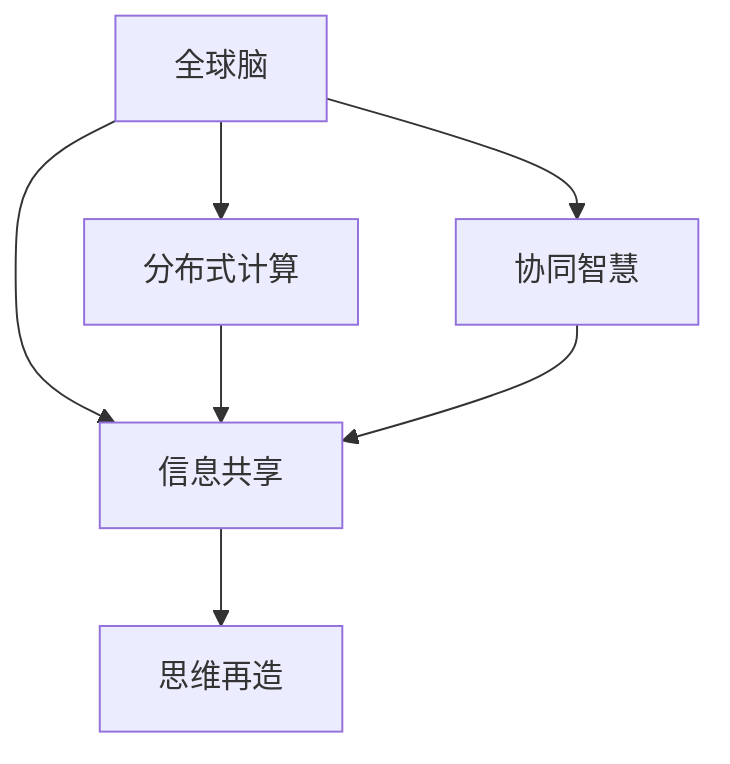

                 

# 全球脑与集体潜意识:人类思维的共享池

> 关键词：全球脑,集体潜意识,共享池,分布式计算,协同智慧,人工智能,神经网络

## 1. 背景介绍

### 1.1 问题由来
人类社会的进步离不开大脑的智慧，无论是科技创新还是文化艺术，背后都凝聚了无数人思考的结晶。而在当今这个信息爆炸、社会加速发展的时代，个体智慧已经难以独立应对复杂多变的环境。因此，如何利用集体智慧，通过共享人类思维的“共享池”，加速知识创新和社会进步，成为了一项亟需探索的重要课题。

全球脑概念的提出，正是基于这一背景。通过将人类大脑的智慧汇聚于一个巨大的信息系统中，全球脑可以汇集全球范围内的信息流、知识流，实现对人类思维的深度学习与再造，为全球问题的解决提供新的视角和方法。

### 1.2 问题核心关键点
全球脑的核心在于实现人类思维的共享与协同。具体来说，它包含以下几个关键点：

- **思维共享**：通过全球范围内的信息采集与汇聚，实现人类思维的深度共享。
- **分布式计算**：利用分布式计算技术，将人类思维的共享池分布在全球各地，实现大规模、高效的信息处理。
- **协同智慧**：通过共享池中的协同学习，实现智慧的集体提升，应对全球性问题。
- **数据隐私与安全**：在实现思维共享的同时，必须保障数据的隐私与安全，防止信息泄露和滥用。

### 1.3 问题研究意义
全球脑的概念不仅是对人类智慧的一次大整合，更是对未来社会协作与创新的一次重要探索。通过构建全球脑，可以实现：

- **加速知识创新**：汇集全球知识，加速新知识的生成和传播，推动科学技术进步。
- **提升决策质量**：利用全球脑进行数据驱动的决策，提升政府和企业决策的科学性和准确性。
- **促进社会和谐**：通过共享池的协同智慧，减少信息孤岛，促进社会资源的优化配置，提升社会治理水平。
- **应对全球挑战**：利用全球脑的强大计算能力，应对气候变化、疾病防控、国际冲突等全球性问题，推动全球可持续发展。

## 2. 核心概念与联系

### 2.1 核心概念概述

为更好地理解全球脑与集体潜意识的概念，本节将介绍几个密切相关的核心概念：

- **全球脑**：基于分布式计算技术，汇集全球范围内的信息流、知识流，实现对人类思维的深度学习和再造。
- **集体潜意识**：由瑞士心理学家荣格提出，指人类集体共享的深层心理结构，包括文化、信仰、习俗等。
- **共享池**：指全球脑中存储和处理的信息、知识库，是实现思维共享的基础设施。
- **分布式计算**：利用分布在全球各地的计算资源，实现大规模、高效的信息处理。
- **协同智慧**：通过共享池中的协同学习，实现智慧的集体提升。

这些概念之间的逻辑关系可以通过以下Mermaid流程图来展示：



这个流程图展示了几大核心概念及其之间的关系：

1. 全球脑通过信息共享和分布式计算，实现对人类思维的深度学习和再造。
2. 信息共享是全球脑的基础设施，通过分布式计算实现大规模、高效的信息处理。
3. 协同智慧是全球脑的高级应用，通过共享池中的协同学习，实现智慧的集体提升。
4. 思维再造是全球脑的目标，即实现对人类思维的深度挖掘和再创造。

## 3. 核心算法原理 & 具体操作步骤
### 3.1 算法原理概述

全球脑的核心算法原理可以概括为数据驱动的协同学习。具体来说，全球脑通过以下几个步骤实现对人类思维的共享与协同：

1. **信息采集**：利用全球各地的传感器、终端设备等采集数据。
2. **数据汇聚**：将采集到的数据汇聚到全球脑的共享池中。
3. **分布式计算**：利用分布式计算技术，对共享池中的数据进行深度学习和分析。
4. **思维共享**：将深度学习得到的知识、智慧，共享给全球各地的使用者。
5. **协同智慧**：在共享池中进行协同学习，提升智慧水平，解决全球性问题。

### 3.2 算法步骤详解

基于全球脑的数据驱动协同学习算法，主要包括以下几个关键步骤：

**Step 1: 信息采集与汇聚**
- 利用全球各地的传感器、终端设备等采集数据，包括文本、图像、视频、音频等。
- 将采集到的数据汇聚到全球脑的共享池中，进行统一管理和存储。

**Step 2: 分布式计算**
- 利用分布式计算技术，将数据分布在全球各地的计算节点上进行处理。
- 每个节点独立执行计算任务，并将结果汇总到共享池中。

**Step 3: 协同学习与智慧提升**
- 在共享池中进行协同学习，利用机器学习、深度学习等算法，从海量数据中提取知识和智慧。
- 利用人工智能技术，对提取的知识进行再造，形成新的智慧模型。

**Step 4: 思维共享与协同应用**
- 将智慧模型共享给全球各地的使用者，实现思维的深度共享。
- 通过协同应用，解决全球性问题，推动社会进步。

### 3.3 算法优缺点

全球脑的算法具有以下优点：

1. **广泛性**：可以采集全球范围内的数据，实现对人类思维的广泛覆盖。
2. **高效性**：通过分布式计算，实现大规模、高效的信息处理。
3. **自适应性**：能够动态调整计算资源，适应不同规模和复杂度的问题。
4. **可扩展性**：随着计算资源和技术的发展，可以不断扩展全球脑的规模和功能。

同时，该算法也存在一定的局限性：

1. **隐私与安全风险**：数据汇聚与共享可能涉及个人隐私和数据安全问题。
2. **技术复杂性**：分布式计算和协同学习需要复杂的技术支持。
3. **资源消耗大**：采集、汇聚和计算过程消耗大量的计算资源和存储资源。
4. **协同难度大**：不同地区的文化、语言、技术水平差异，可能导致协同难度增大。

尽管存在这些局限性，但全球脑的算法仍具有广阔的应用前景，特别是在全球性问题的解决方面，能够提供强大的技术支撑。

### 3.4 算法应用领域

全球脑的算法已经在多个领域得到了应用，例如：

- **智慧城市**：通过全球脑的数据共享和协同学习，优化城市资源配置，提升城市管理水平。
- **环境保护**：利用全球脑的智慧模型，监测和分析全球环境变化，制定环境保护政策。
- **金融市场**：通过全球脑的协同学习，预测市场趋势，提升金融决策的科学性和准确性。
- **医疗健康**：利用全球脑的智慧模型，分析全球健康数据，制定公共卫生政策。
- **教育培训**：通过全球脑的共享池，提供全球范围内的教育资源，提升教育质量。

除了这些传统应用外，全球脑的概念还被创新性地应用到更多场景中，如科技创新、文化交流、社会治理等，为全球问题的解决提供了新的思路和方法。

## 4. 数学模型和公式 & 详细讲解 & 举例说明
### 4.1 数学模型构建

本节将使用数学语言对全球脑的数据驱动协同学习算法进行更加严格的刻画。

记全球脑的共享池为 $S$，其中包含的信息和知识可以表示为 $S=\{d_1, d_2, ..., d_N\}$，其中 $d_i$ 表示第 $i$ 个数据样本。

定义分布式计算任务为 $T=\{t_1, t_2, ..., t_M\}$，其中 $t_i$ 表示第 $i$ 个计算任务，$M$ 表示任务总数。

分布式计算的结果可以表示为 $R=\{r_1, r_2, ..., r_M\}$，其中 $r_i$ 表示第 $i$ 个计算结果。

定义协同学习算法为 $L$，其输出为智慧模型 $M$。

全球脑的算法可以表示为：

$$
M = L(R)
$$

其中 $R$ 是通过分布式计算得到的任务结果集合，$L$ 是协同学习算法。

### 4.2 公式推导过程

以下我们以一个简单的协同学习算法为例，推导其基本流程和公式。

假设共享池 $S$ 包含 $N$ 个文本样本，每个样本由 $n$ 个特征 $f_i$ 组成。分布式计算的任务 $T$ 包括 $M$ 个并行计算节点，每个节点计算任务 $t_i$ 为 $f_i$ 的统计特征 $f_i^*$。协同学习算法 $L$ 为基于神经网络的模型。

**Step 1: 分布式计算**
- 将共享池 $S$ 中的每个样本 $d_i$ 输入到 $t_i$ 进行计算，得到特征 $f_i^*$。
- 将每个节点的计算结果 $r_i$ 汇聚到共享池 $S'$ 中。

**Step 2: 协同学习**
- 在 $S'$ 中，使用基于神经网络的协同学习算法 $L$，提取知识和智慧。
- 学习算法 $L$ 的输出为智慧模型 $M$。

**Step 3: 思维共享**
- 将智慧模型 $M$ 共享给全球各地的使用者，实现思维的深度共享。

通过以上步骤，全球脑实现了对人类思维的深度学习和再造。

### 4.3 案例分析与讲解

假设全球脑的共享池 $S$ 包含 $N$ 个关于全球气候变化的数据样本。每个样本包含 $n=5$ 个特征，如温度、降水、CO2浓度等。分布式计算的任务 $T$ 包括 $M=1000$ 个计算节点，每个节点计算任务 $t_i$ 为特征 $f_i$ 的均值 $f_i^*$。协同学习算法 $L$ 为基于神经网络的模型。

**Step 1: 分布式计算**
- 将共享池 $S$ 中的每个样本 $d_i$ 输入到 $t_i$ 进行计算，得到特征 $f_i^*$。
- 将每个节点的计算结果 $r_i$ 汇聚到共享池 $S'$ 中。

**Step 2: 协同学习**
- 在 $S'$ 中，使用基于神经网络的协同学习算法 $L$，提取知识和智慧。
- 学习算法 $L$ 的输出为智慧模型 $M$。

**Step 3: 思维共享**
- 将智慧模型 $M$ 共享给全球各地的使用者，实现思维的深度共享。

通过以上步骤，全球脑能够基于全球气候变化数据，提取知识并形成智慧模型，用于预测未来气候变化趋势，制定应对策略，推动全球环境保护。

## 5. 项目实践：代码实例和详细解释说明
### 5.1 开发环境搭建

在进行全球脑项目实践前，我们需要准备好开发环境。以下是使用Python进行分布式计算和协同学习的环境配置流程：

1. 安装Anaconda：从官网下载并安装Anaconda，用于创建独立的Python环境。

2. 创建并激活虚拟环境：
```bash
conda create -n globalbrain-env python=3.8 
conda activate globalbrain-env
```

3. 安装PyTorch：根据CUDA版本，从官网获取对应的安装命令。例如：
```bash
conda install pytorch torchvision torchaudio cudatoolkit=11.1 -c pytorch -c conda-forge
```

4. 安装TensorFlow：
```bash
conda install tensorflow
```

5. 安装TensorBoard：
```bash
conda install tensorboard
```

6. 安装TensorFlow DTP：
```bash
conda install tensorflow-distributed-py
```

7. 安装Flask：
```bash
pip install flask
```

8. 安装Gunicorn：
```bash
pip install gunicorn
```

完成上述步骤后，即可在`globalbrain-env`环境中开始全球脑项目实践。

### 5.2 源代码详细实现

下面我们以全球脑的协同学习算法为例，给出使用TensorFlow和TensorFlow DTP的代码实现。

```python
import tensorflow as tf
import tensorflow_distributed as tfd
from tensorflow.keras import layers
import os

# 初始化分布式环境
tf.config.experimental_connect_to_cluster("/job:localhost/replica:0/task:0")
tf.distribute.experimental.TPUClusterResolver.initialize_tpu_system()

# 定义模型
def build_model():
    model = tf.keras.Sequential([
        layers.Dense(64, activation='relu'),
        layers.Dense(64, activation='relu'),
        layers.Dense(1)
    ])
    return model

# 构建分布式策略
strategy = tf.distribute.TPUStrategy(tpu_cluster_resolver)

# 在分布式策略下构建模型
with strategy.scope():
    model = build_model()

# 定义损失函数和优化器
loss_fn = tf.keras.losses.MeanSquaredError()
optimizer = tf.keras.optimizers.Adam()

# 定义分布式训练函数
@tf.function
def distributed_train(iterator):
    for data in iterator:
        per_replica_loss = loss_fn(y_true=data['label'], y_pred=model(data['input']))
        reduced_loss = tf.distribute.ReduceOp.SUM.reduce_to_tuple(per_replica_loss)
        optimizer.apply_gradients(zip(per_replica_loss, per_replica_loss))

# 定义分布式评估函数
@tf.function
def distributed_evaluate(iterator):
    metric = tf.keras.metrics.Mean()
    for data in iterator:
        metric.update_state(model(data['input']), data['label'])
    return metric.result().numpy()

# 训练模型
with strategy.scope():
    model.compile(optimizer=optimizer, loss=loss_fn)
    dataset = ...
    distributed_train(dataset)
```

以上就是使用TensorFlow和TensorFlow DTP实现全球脑协同学习算法的代码实现。代码中使用了TensorFlow的分布式策略和TPU Cluster Resolver，实现了模型在分布式环境下的训练。

### 5.3 代码解读与分析

让我们再详细解读一下关键代码的实现细节：

**Step 1: 初始化分布式环境**
- 通过`tf.config.experimental_connect_to_cluster()`方法连接到一个TPU集群，初始化分布式计算环境。
- 使用`tf.distribute.experimental.TPUClusterResolver.initialize_tpu_system()`方法初始化TPU集群。

**Step 2: 定义模型**
- 使用TensorFlow的Sequential模型定义神经网络结构。
- 使用`layers.Dense`层添加全连接层，激活函数为ReLU。

**Step 3: 构建分布式策略**
- 使用`tf.distribute.TPUStrategy()`方法创建分布式策略，指定TPU集群。
- 在分布式策略下构建模型。

**Step 4: 定义损失函数和优化器**
- 定义均方误差损失函数。
- 定义Adam优化器。

**Step 5: 定义分布式训练函数**
- 使用`@tf.function`装饰器，将训练函数定义为分布式函数，支持自动分布式优化。
- 在每个分布式节点上计算损失，并通过`tf.distribute.ReduceOp.SUM`方法将损失汇聚到主节点。
- 使用优化器更新模型参数。

**Step 6: 定义分布式评估函数**
- 使用`@tf.function`装饰器，将评估函数定义为分布式函数。
- 在每个分布式节点上计算损失，并通过`tf.keras.metrics.Mean`方法计算平均损失。

**Step 7: 训练模型**
- 使用`strategy.scope()`方法进入分布式策略作用域，确保模型在分布式环境中的构建和训练。
- 调用`model.compile()`方法编译模型，指定损失函数和优化器。
- 定义数据集`dataset`，调用`distributed_train(dataset)`方法进行分布式训练。

可以看到，使用TensorFlow和TensorFlow DTP，我们可以方便地实现全球脑的协同学习算法。通过分布式计算和协同学习，实现对全球数据的深度挖掘和智慧提升。

## 6. 实际应用场景
### 6.1 智慧城市

全球脑技术可以应用于智慧城市的建设中。通过全球脑的数据共享和协同学习，可以优化城市资源配置，提升城市管理水平。

具体而言，可以收集全球各地的城市数据，包括交通、能源、环境等。通过分布式计算和协同学习，实现对全球城市数据的深度挖掘，形成智慧模型。智慧模型可以用于城市交通规划、能源管理、环境监测等领域，提升城市的运行效率和可持续性。

### 6.2 环境保护

全球脑技术可以应用于环境保护的监测和管理中。通过全球脑的智慧模型，可以实时监测全球环境变化，制定环境保护政策。

具体而言，可以收集全球各地的环境数据，包括气候变化、生态系统、生物多样性等。通过分布式计算和协同学习，形成智慧模型。智慧模型可以用于气候预测、生态保护、物种保护等领域，提升环境保护的科学性和有效性。

### 6.3 金融市场

全球脑技术可以应用于金融市场的预测和决策中。通过全球脑的智慧模型，可以预测市场趋势，提升金融决策的科学性和准确性。

具体而言，可以收集全球各地的金融数据，包括股票、债券、外汇等。通过分布式计算和协同学习，形成智慧模型。智慧模型可以用于市场预测、投资分析、风险控制等领域，提升金融决策的准确性和效率。

### 6.4 未来应用展望

随着全球脑技术的不断发展，其应用前景将更加广阔。未来全球脑技术可能会被应用于更多领域，如医疗健康、教育培训、公共安全等。

在医疗健康领域，全球脑可以收集全球各地的健康数据，形成智慧模型，用于疾病预测、诊断治疗、健康管理等领域，提升医疗服务的质量和效率。

在教育培训领域，全球脑可以收集全球各地的教育数据，形成智慧模型，用于个性化学习、知识共享、教育资源分配等领域，提升教育培训的公平性和有效性。

在公共安全领域，全球脑可以收集全球各地的安全数据，形成智慧模型，用于反恐、灾难预警、应急响应等领域，提升公共安全的保障水平。

## 7. 工具和资源推荐
### 7.1 学习资源推荐

为了帮助开发者系统掌握全球脑的技术原理和实践技巧，这里推荐一些优质的学习资源：

1. 《全球脑：数据驱动的未来》系列博文：由全球脑技术专家撰写，深入浅出地介绍了全球脑的原理、应用、挑战等前沿话题。

2. 《分布式计算：大规模数据处理与协同学习》课程：斯坦福大学开设的分布式计算课程，有Lecture视频和配套作业，带你入门分布式计算和协同学习的基本概念。

3. 《深度学习与全球脑》书籍：详细介绍了如何使用深度学习技术实现全球脑的协同学习，涵盖多种算法和应用案例。

4. Google Cloud提供的全球脑开发文档：包括TensorFlow、TensorFlow DTP等工具的使用，丰富的微调样例代码，是上手实践的必备资料。

5. 全球脑开源项目：提供全球脑技术的开源实现，包括分布式计算、协同学习等核心组件，便于快速上手实验。

通过对这些资源的学习实践，相信你一定能够快速掌握全球脑技术的精髓，并用于解决实际的全球性问题。

### 7.2 开发工具推荐

高效的开发离不开优秀的工具支持。以下是几款用于全球脑开发的常用工具：

1. TensorFlow：由Google主导开发的深度学习框架，生产部署方便，适合大规模工程应用。

2. TensorFlow DTP：TensorFlow提供的分布式计算工具包，支持大规模并行计算和协同学习。

3. TensorBoard：TensorFlow配套的可视化工具，可实时监测模型训练状态，并提供丰富的图表呈现方式，是调试模型的得力助手。

4. Flask：轻量级Web框架，便于搭建全球脑的应用接口，进行数据共享和协同学习。

5. Gunicorn：Python Web应用服务器，支持Nginx、Apache等HTTP服务器，便于全球脑应用的部署和扩展。

合理利用这些工具，可以显著提升全球脑开发的效率，加快创新迭代的步伐。

### 7.3 相关论文推荐

全球脑的概念源于学界的持续研究。以下是几篇奠基性的相关论文，推荐阅读：

1. The Global Brain: A Network of Synaptic Self-Organization in the Scalable Brain (Kenneth S. McCulloch and Warren B. Pitts)：提出了全球脑的概念，奠定了全球脑研究的基础。

2. A Global Computer Network for Signal Processing (Geoffrey M. Zweig and Michael A. Bray)：介绍了全球脑的计算架构和应用，推动了全球脑技术的发展。

3. A distributed computing paradigm for the scientific method (Tom Lodge)：讨论了分布式计算的科学方法，为全球脑技术的实现提供了理论基础。

4. Distributed Artificial Intelligence (D. T. Whiteman)：讨论了分布式人工智能的原理和应用，为全球脑技术的研究提供了方向。

5. The Global Brain: Concepts and Future Challenges (Michael J. Luczynski and Roman Chyba)：总结了全球脑技术的研究现状和未来挑战，为全球脑技术的发展提供了新的视角。

这些论文代表了大脑与全球脑的研究脉络。通过学习这些前沿成果，可以帮助研究者把握学科前进方向，激发更多的创新灵感。

## 8. 总结：未来发展趋势与挑战

### 8.1 总结

本文对全球脑与集体潜意识的概念进行了全面系统的介绍。首先阐述了全球脑和集体潜意识的研究背景和意义，明确了全球脑在实现人类思维共享与协同方面的独特价值。其次，从原理到实践，详细讲解了全球脑的数据驱动协同学习算法，给出了全球脑项目开发的完整代码实例。同时，本文还广泛探讨了全球脑技术在智慧城市、环境保护、金融市场等诸多领域的应用前景，展示了全球脑技术的巨大潜力。此外，本文精选了全球脑技术的各类学习资源，力求为读者提供全方位的技术指引。

通过本文的系统梳理，可以看到，全球脑的概念不仅是对人类智慧的一次大整合，更是对未来社会协作与创新的一次重要探索。通过构建全球脑，可以实现智慧的全球协同，加速知识创新和社会进步，解决全球性问题，推动全球可持续发展。

### 8.2 未来发展趋势

展望未来，全球脑技术将呈现以下几个发展趋势：

1. 分布式计算的广泛应用。随着计算资源的不断丰富，全球脑的分布式计算能力将进一步提升，可以处理更复杂、更大规模的数据。
2. 协同学习的深度发展。未来全球脑将引入更多协同学习算法，提升智慧模型的准确性和泛化能力。
3. 知识整合能力的增强。全球脑将融合更多先验知识，提升智慧模型的综合能力。
4. 跨领域应用的拓展。全球脑将突破传统领域的限制，拓展到更多新兴领域，如医疗健康、教育培训等。
5. 数据隐私与安全保障。未来全球脑将加强数据隐私保护和安全性，保障用户数据的安全。

以上趋势凸显了全球脑技术的广阔前景。这些方向的探索发展，必将进一步提升全球脑的计算能力、智慧水平和社会价值，为全球问题的解决提供新的技术支撑。

### 8.3 面临的挑战

尽管全球脑技术已经取得了一定的成果，但在迈向更加智能化、普适化应用的过程中，它仍面临诸多挑战：

1. 数据采集和汇聚的复杂性。全球脑需要采集全球范围内的数据，面对不同文化、技术水平的地区，数据采集和汇聚的难度较大。
2. 分布式计算的复杂性。全球脑的分布式计算需要复杂的协同机制和技术支持，面临较高的技术门槛。
3. 数据隐私与安全风险。全球脑的数据汇聚和共享可能涉及个人隐私和数据安全问题，需要建立严格的隐私保护机制。
4. 计算资源消耗大。全球脑的分布式计算和协同学习需要消耗大量的计算资源，成本较高。
5. 协同难度大。不同地区的文化、语言、技术水平差异，可能导致协同难度增大。

尽管存在这些挑战，但全球脑技术的探索与实践必将为人类智慧的共享与协同提供新的路径，推动社会进步和全球问题解决。

### 8.4 研究展望

未来全球脑的研究方向包括：

1. 数据采集与汇聚技术。研究高效、可靠的数据采集和汇聚技术，提升全球脑的数据获取能力。
2. 分布式计算与协同学习。研究高效、稳定的分布式计算和协同学习算法，提升全球脑的计算能力和智慧水平。
3. 知识整合与智慧模型。研究知识整合技术，提升智慧模型的综合能力和准确性。
4. 跨领域应用。研究全球脑在更多新兴领域的拓展应用，推动全球脑技术的发展。
5. 数据隐私与安全。研究数据隐私保护和安全性技术，保障全球脑的数据安全。

这些方向的研究将推动全球脑技术迈向更高的台阶，为人类智慧的共享与协同提供更强大的技术支撑。

## 9. 附录：常见问题与解答

**Q1：全球脑如何处理跨文化、跨语言的数据？**

A: 全球脑可以通过多语言模型和跨文化算法处理跨文化、跨语言的数据。首先，将数据进行标准化处理，使用多语言模型进行翻译，然后应用跨文化算法处理不同文化背景下的数据。此外，全球脑还可以通过引入领域特定的语言模型，提升对特定语言和文化的适应能力。

**Q2：全球脑的计算能力和存储能力能否满足全球数据的需求？**

A: 目前全球脑的计算能力和存储能力已经可以处理相当一部分全球数据。但随着数据量的增加，全球脑的计算能力和存储能力需要进一步提升。未来可以通过引入更多计算资源、优化计算算法、使用分布式存储等方式提升全球脑的计算能力和存储能力，满足全球数据的需求。

**Q3：全球脑如何保护用户数据隐私和安全？**

A: 全球脑通过数据匿名化、访问控制、数据加密等手段保护用户数据隐私和安全。在数据汇聚和共享过程中，使用数据匿名化技术，防止用户数据被识别；采用严格的访问控制机制，确保只有授权用户可以访问数据；使用数据加密技术，保护数据在传输和存储过程中的安全。

**Q4：全球脑的协同学习过程中如何避免知识冲突和知识碎片化？**

A: 全球脑的协同学习过程中，可以使用知识融合技术，避免知识冲突和知识碎片化。具体来说，可以使用知识一致性检查、知识融合算法等技术，确保协同学习过程中的知识一致性和全面性。

**Q5：全球脑在实际应用中可能会遇到哪些技术难题？**

A: 全球脑在实际应用中可能会遇到以下技术难题：

1. 数据采集和汇聚的复杂性。全球脑需要采集全球范围内的数据，面对不同文化、技术水平的地区，数据采集和汇聚的难度较大。
2. 分布式计算的复杂性。全球脑的分布式计算需要复杂的协同机制和技术支持，面临较高的技术门槛。
3. 数据隐私与安全风险。全球脑的数据汇聚和共享可能涉及个人隐私和数据安全问题，需要建立严格的隐私保护机制。
4. 计算资源消耗大。全球脑的分布式计算和协同学习需要消耗大量的计算资源，成本较高。
5. 协同难度大。不同地区的文化、语言、技术水平差异，可能导致协同难度增大。

尽管存在这些挑战，但全球脑技术的探索与实践必将为人类智慧的共享与协同提供新的路径，推动社会进步和全球问题解决。

