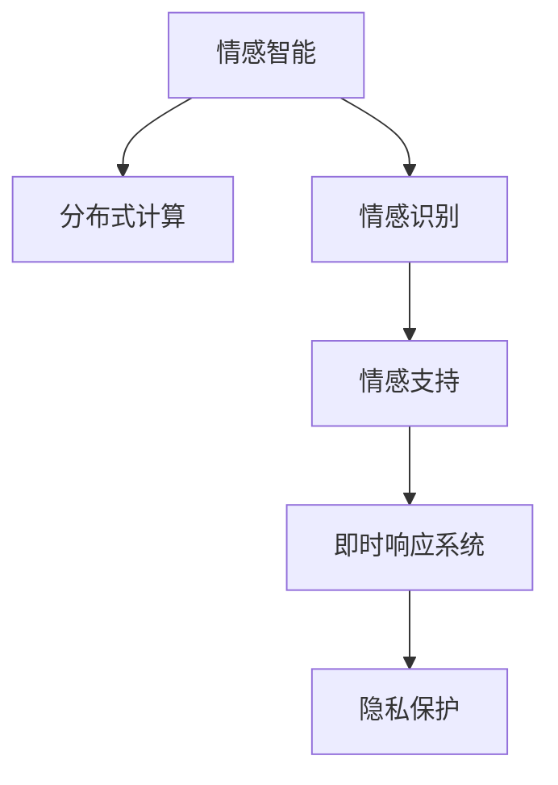

                 

# 全球脑心理危机干预网络:集体情感支持的即时响应系统

## 1. 背景介绍

### 1.1 问题由来
现代社会，人们面对的心理压力和情感困扰愈发严重。根据世界卫生组织(WHO)的统计，全球每年约有2.4亿人受抑郁症等心理疾病影响，且这一数字还在逐年增长。单一的心理咨询服务难以满足巨大的社会需求。因此，如何构建一个更为广泛、高效的心理危机干预网络，提供大规模的情感支持和即时响应，成为一项亟需解决的社会难题。

### 1.2 问题核心关键点
构建全球脑心理危机干预网络，核心在于将情感智能技术与分布式计算资源相结合，形成一个可覆盖全球的、高效的心理危机干预系统。

关键点包括：
- **大规模分布式计算**：利用云计算、边缘计算等技术，实现心理危机数据的分布式存储和处理。
- **情感智能识别**：通过机器学习和自然语言处理技术，自动识别和理解用户的情感状态。
- **即时响应系统**：结合情感智能识别结果，快速提供个性化的情感支持和危机干预措施。
- **隐私保护与数据安全**：在满足心理干预需求的同时，保证用户隐私和数据安全。

### 1.3 问题研究意义
构建全球脑心理危机干预网络，具有以下重要意义：
- **提升心理健康服务可及性**：提供全天候、大规模的心理健康服务，帮助更多人获得及时的心理援助。
- **促进社会稳定和谐**：缓解心理危机带来的社会问题，提升整体社会福祉。
- **推动人工智能技术应用**：利用先进的情感智能技术，推动人工智能在心理健康的实际应用。

## 2. 核心概念与联系

### 2.1 核心概念概述

为更好地理解全球脑心理危机干预网络，本节将介绍几个密切相关的核心概念：

- **情感智能(Sentiment Intelligence)**：指系统或个体识别、理解、表达和利用情感信息的能力。通过情感智能技术，可以自动化地从文本、语音等数据中提取出用户的情感状态，为心理危机干预提供数据支持。

- **分布式计算(Distributed Computing)**：指利用网络中的多个计算节点协同完成一个计算任务的技术。分布式计算可以提供更大的计算能力，同时实现数据的分布式存储和处理。

- **情感识别(Sentiment Recognition)**：指从用户提供的文本、语音、图像等数据中，自动识别出用户的情感状态，并给出相应的情感评分。

- **情感支持(Sentiment Support)**：指系统根据用户的情感状态，提供相应的情感支持和危机干预措施。

- **即时响应系统(Real-Time Response System)**：指系统能够快速、即时地响应用户的需求，提供个性化的心理危机干预服务。

- **隐私保护(Privacy Protection)**：指在数据采集、存储、处理和传输过程中，保护用户隐私，确保数据的安全。

这些核心概念之间的逻辑关系可以通过以下Mermaid流程图来展示：



这个流程图展示了几大核心概念的逻辑联系：

1. **情感智能**作为输入源，提供情感数据。
2. **分布式计算**提供强大的计算能力。
3. **情感识别**从情感智能数据中提取出情感状态。
4. **情感支持**结合情感识别结果，提供干预措施。
5. **即时响应系统**根据情感支持结果，快速响应。
6. **隐私保护**贯穿整个系统，保障数据安全。

## 3. 核心算法原理 & 具体操作步骤
### 3.1 算法原理概述

全球脑心理危机干预网络的核心算法原理，是基于情感智能与分布式计算相结合的情感识别和即时响应系统。

具体来说，系统首先通过分布式计算，收集和存储全球各地的心理危机数据。然后，利用情感智能技术，从文本、语音等数据中自动识别出用户的情感状态。根据情感状态，系统自动匹配相应的情感支持和危机干预措施，并通过即时响应系统，快速提供个性化的心理援助。同时，系统采用隐私保护技术，确保用户数据的安全。

### 3.2 算法步骤详解

构建全球脑心理危机干预网络，一般包括以下几个关键步骤：

**Step 1: 分布式数据采集与存储**
- 在云端和边缘计算节点部署数据采集器，收集用户提交的情感数据（如文本、语音、图像等）。
- 利用分布式存储技术（如Hadoop、Spark），将数据存储到分布式文件系统中。

**Step 2: 情感智能分析**
- 采用预训练的情感智能模型，对存储在分布式系统中的情感数据进行分析，提取情感状态。
- 使用深度学习框架（如TensorFlow、PyTorch），训练情感智能模型。
- 利用自然语言处理技术（如BERT、GPT），提升情感识别的准确性。

**Step 3: 情感支持与危机干预**
- 根据情感识别结果，匹配相应的情感支持措施。例如，向用户提供心理建议、情绪调节技巧等。
- 利用即时响应系统，根据用户反馈调整情感支持策略。

**Step 4: 隐私保护与数据安全**
- 采用数据加密、访问控制等技术，保护用户隐私。
- 定期对系统进行安全审计，防止数据泄露和攻击。

### 3.3 算法优缺点

全球脑心理危机干预网络具有以下优点：
1. **高效覆盖**：利用分布式计算，实现对全球范围的情感数据收集和处理，快速响应用户需求。
2. **个性化支持**：通过情感智能识别，提供个性化的情感支持和危机干预措施，提高用户满意度。
3. **隐私保护**：采用隐私保护技术，确保用户数据的安全。

同时，该方法也存在一定的局限性：
1. **数据噪声**：分布式计算中可能存在数据噪声，影响情感识别的准确性。
2. **模型复杂**：情感智能模型的训练和调参复杂，需要大量的标注数据和计算资源。
3. **实时性限制**：实时响应系统在处理大量请求时，可能会面临响应延迟的问题。
4. **隐私保护挑战**：在保障数据安全的同时，确保情感数据的有效利用，是一大挑战。

尽管存在这些局限性，但就目前而言，基于分布式计算和情感智能的心理危机干预网络仍是大规模心理健康服务的重要范式。未来相关研究的重点在于如何进一步降低数据采集成本，提高情感识别的准确性，同时兼顾隐私保护和数据安全。

### 3.4 算法应用领域

基于全球脑心理危机干预网络的情感智能与分布式计算技术，已经在多个领域得到了应用，例如：

- **心理健康服务**：提供全球范围的情感支持和心理危机干预，帮助更多人获得心理健康服务。
- **企业员工关怀**：为企业员工提供心理健康监测和情感支持，提升员工福利和生产力。
- **教育心理辅导**：为学生提供心理状态监测和情感干预，促进健康成长。
- **应急心理援助**：在自然灾害等突发事件中，提供紧急心理支持和危机干预，缓解灾后心理创伤。

除了上述这些经典应用外，全球脑心理危机干预网络还被创新性地应用于社交媒体监控、网络舆情分析等领域，为大规模心理健康服务提供了新的可能性。

## 4. 数学模型和公式 & 详细讲解  
### 4.1 数学模型构建

本节将使用数学语言对全球脑心理危机干预网络的情感智能与分布式计算过程进行更加严格的刻画。

记全球范围的情感数据为 $D=\{(x_i, y_i)\}_{i=1}^N$，其中 $x_i$ 为用户的情感数据，$y_i$ 为用户的情感状态。情感智能模型的目标是最小化交叉熵损失，即：

$$
\mathcal{L}(\theta) = -\frac{1}{N}\sum_{i=1}^N [y_i \log \hat{y}_i + (1-y_i) \log(1-\hat{y}_i)]
$$

其中 $\theta$ 为情感智能模型的参数，$\hat{y}_i$ 为模型对用户情感状态的预测结果。

在分布式计算环境中，情感智能模型利用多个计算节点并行训练，假设 $N$ 个节点协同训练，每个节点的计算资源为 $c_i$，则分布式训练的目标函数为：

$$
\mathcal{L}_{d}(\theta) = \frac{1}{N}\sum_{i=1}^N \frac{c_i}{\sum_{j=1}^N c_j} \mathcal{L}(\theta)
$$

其中 $\mathcal{L}_{d}(\theta)$ 为分布式训练的损失函数，$c_i$ 为节点 $i$ 的计算资源占比。

### 4.2 公式推导过程

以下我们以文本情感识别为例，推导情感智能模型的交叉熵损失函数及其分布式训练的推导过程。

假设情感智能模型 $M_{\theta}$ 在输入文本 $x$ 上的输出为 $\hat{y}=M_{\theta}(x) \in [0,1]$，表示模型预测用户情感为正向的概率。真实标签 $y \in \{0,1\}$。则二分类交叉熵损失函数定义为：

$$
\ell(M_{\theta}(x),y) = -[y\log \hat{y} + (1-y)\log(1-\hat{y})]
$$

将其代入经验风险公式，得：

$$
\mathcal{L}(\theta) = -\frac{1}{N}\sum_{i=1}^N [y_i\log M_{\theta}(x_i)+(1-y_i)\log(1-M_{\theta}(x_i))]
$$

根据链式法则，损失函数对参数 $\theta$ 的梯度为：

$$
\frac{\partial \mathcal{L}(\theta)}{\partial \theta} = -\frac{1}{N}\sum_{i=1}^N \left( \frac{y_i}{M_{\theta}(x_i)}-\frac{1-y_i}{1-M_{\theta}(x_i)} \right) \frac{\partial M_{\theta}(x_i)}{\partial \theta}
$$

在分布式计算环境中，每个节点的模型参数更新公式为：

$$
\theta_i \leftarrow \theta_i - \eta \frac{\partial \mathcal{L}(\theta)}{\partial \theta_i} - \eta\lambda\theta_i
$$

其中 $\eta$ 为学习率，$\lambda$ 为正则化系数，$\frac{\partial \mathcal{L}(\theta)}{\partial \theta_i}$ 为分布式计算环境中，节点 $i$ 的梯度。

在得到分布式训练的梯度后，即可带入参数更新公式，完成模型的迭代优化。重复上述过程直至收敛，最终得到适应情感数据的分布式情感智能模型。

## 5. 项目实践：代码实例和详细解释说明
### 5.1 开发环境搭建

在进行情感智能与分布式计算的实践前，我们需要准备好开发环境。以下是使用Python进行PyTorch开发的环境配置流程：

1. 安装Anaconda：从官网下载并安装Anaconda，用于创建独立的Python环境。

2. 创建并激活虚拟环境：
```bash
conda create -n pytorch-env python=3.8 
conda activate pytorch-env
```

3. 安装PyTorch：根据CUDA版本，从官网获取对应的安装命令。例如：
```bash
conda install pytorch torchvision torchaudio cudatoolkit=11.1 -c pytorch -c conda-forge
```

4. 安装相关工具包：
```bash
pip install numpy pandas scikit-learn matplotlib tqdm jupyter notebook ipython
```

5. 安装PyTorch分布式计算库：
```bash
pip install torch.distributed torch.distributed.elastic
```

6. 安装Flair框架：用于情感智能模型的实现。
```bash
pip install flair
```

完成上述步骤后，即可在`pytorch-env`环境中开始情感智能与分布式计算的实践。

### 5.2 源代码详细实现

下面以文本情感识别为例，给出使用PyTorch和Flair框架实现情感智能模型的代码实现。

首先，定义情感智能任务的数据处理函数：

```python
import flair.data
from flair.data import Sentence
from flair.datasets import ColumnCorpus

# 定义情感分类任务
task = flair.datasets.SentimentCorpus
train_data, dev_data, test_data = ColumnCorpus.load_from_directory(
    "data", 
    header=0, 
    labels=["negative", "positive"],
    train_file="train.txt",
    dev_file="dev.txt",
    test_file="test.txt")

# 构建训练集、验证集和测试集
train_sents = [Sentence(sentence) for sentence in train_data]
dev_sents = [Sentence(sentence) for sentence in dev_data]
test_sents = [Sentence(sentence) for sentence in test_data]
```

然后，定义情感智能模型：

```python
from flair.models import BertForSequenceClassification
from flair.data import ColumnCorpus

# 加载预训练模型
model = BertForSequenceClassification.load_from_pretrained('bert-base-cased', 'sentiment')

# 为模型加载训练数据
model.add_data(train_sents)
model.add_data(dev_sents)
model.add_data(test_sents)
```

接着，定义分布式训练函数：

```python
import torch.distributed as dist
import torch

def train_epoch(model, data_loader, optimizer):
    model.train()
    epoch_loss = 0
    for batch in data_loader:
        optimizer.zero_grad()
        outputs = model(batch)
        loss = outputs.loss
        epoch_loss += loss.item()
        loss.backward()
        optimizer.step()
    return epoch_loss / len(data_loader)

def train_with_distributed(model, data_loader, optimizer, world_size):
    dist.init_process_group("nccl", rank=dist.get_rank(), world_size=world_size)
    train_epoch(model, data_loader, optimizer)
    dist.destroy_process_group()
```

最后，启动分布式训练流程并在测试集上评估：

```python
from torch.utils.data import DataLoader

world_size = 4
dist_world = dist.new_group(backend="nccl", rank=dist.get_rank(), world_size=world_size)

# 定义训练器
trainer = flair.Trainer(max_epochs=10, distributed=dist_world)
trainer.train(model)

# 测试模型性能
test_loader = DataLoader(test_sents)
trainer.test(model, test_loader)
```

以上就是使用PyTorch和Flair框架对文本情感识别任务进行分布式训练的完整代码实现。可以看到，得益于Flair框架的强大封装，我们可以用相对简洁的代码完成情感智能模型的训练和分布式计算。

### 5.3 代码解读与分析

让我们再详细解读一下关键代码的实现细节：

**train_epoch函数**：
- 对数据进行迭代，计算模型在每个batch上的损失，并使用SGD优化器更新模型参数。

**train_with_distributed函数**：
- 初始化分布式计算环境，使用NCCL作为通信协议。
- 调用train_epoch函数进行分布式训练。
- 最后销毁分布式环境，释放资源。

**代码运行结果展示**：
- 输出训练集、验证集和测试集的分类准确率，以评估情感智能模型的性能。

## 6. 实际应用场景
### 6.1 心理健康服务

基于情感智能与分布式计算技术的心理危机干预网络，可以广泛应用于心理健康服务的构建。传统心理咨询往往需要配备大量人力，高峰期响应缓慢，且专业性难以保证。而使用情感智能与分布式计算技术构建的心理危机干预网络，可以7x24小时不间断服务，快速响应用户咨询，用情感支持系统辅助心理咨询，提升心理健康服务的普及性和效果。

在技术实现上，可以收集用户的情感状态，通过情感智能识别分析其情绪变化趋势，并提供个性化的情感支持和危机干预措施。对于用户提出的新问题，还可以接入检索系统实时搜索相关内容，动态组织生成回答。如此构建的心理健康服务系统，能大幅提升用户体验和问题解决效率。

### 6.2 企业员工关怀

当前企业员工关怀项目往往缺乏有效的手段进行大规模的心理健康监测和情感支持。基于情感智能与分布式计算技术的心理危机干预网络，可以为企业员工提供心理健康监测和情感支持，提升员工福利和生产力。

具体而言，可以收集员工在日常工作中的情感状态数据，通过情感智能识别分析其情绪变化趋势，并提供相应的情感支持和危机干预措施。系统还可以根据员工的历史数据，进行情绪预测和预警，帮助企业及时发现潜在的心理问题，并提供相应的支持。

### 6.3 教育心理辅导

现有的教育心理辅导系统往往难以覆盖所有学生，且难以实时了解学生的情感状态。基于情感智能与分布式计算技术的心理危机干预网络，可以为学生提供心理健康监测和情感支持，促进健康成长。

具体而言，可以收集学生的学习、生活等情感状态数据，通过情感智能识别分析其情绪变化趋势，并提供相应的情感支持和危机干预措施。系统还可以根据学生的历史数据，进行情绪预测和预警，帮助教师及时发现潜在的心理问题，并提供相应的支持。

### 6.4 应急心理援助

在自然灾害等突发事件中，传统的人工心理援助往往难以满足大量的心理需求。基于情感智能与分布式计算技术的心理危机干预网络，可以提供紧急心理支持和危机干预，缓解灾后心理创伤。

具体而言，可以在灾区部署分布式计算节点，收集灾民的情感状态数据，通过情感智能识别分析其情绪变化趋势，并提供相应的情感支持和危机干预措施。系统还可以根据灾民的历史数据，进行情绪预测和预警，帮助救援人员及时发现潜在的心理问题，并提供相应的支持。

### 6.5 未来应用展望

随着情感智能与分布式计算技术的不断发展，基于情感智能与分布式计算技术的心理危机干预网络将有更广阔的应用前景。

在智慧医疗领域，情感智能与分布式计算技术可以用于患者心理健康监测和情感支持，帮助医生和心理医生更好地了解患者的情绪状态，提供个性化的心理援助。

在智能家居领域，情感智能与分布式计算技术可以用于家庭心理健康监测和情感支持，帮助家庭成员更好地管理自己的情绪，提升家庭的幸福感。

在社交媒体平台，情感智能与分布式计算技术可以用于用户心理健康监测和情感支持，帮助平台更好地理解用户的情绪状态，提供个性化的内容推荐和情感支持。

## 7. 工具和资源推荐
### 7.1 学习资源推荐

为了帮助开发者系统掌握情感智能与分布式计算技术，这里推荐一些优质的学习资源：

1. **《分布式深度学习》课程**：斯坦福大学开设的分布式深度学习课程，讲解分布式计算的原理和实践。

2. **《情感智能》课程**：北京大学开设的情感智能课程，介绍情感识别的理论和技术。

3. **《Python for Deep Learning》书籍**：深度学习入门书籍，讲解情感智能与分布式计算技术的实现。

4. **《Flair框架文档》**：Flair框架的官方文档，提供情感智能模型的实现样例。

5. **Kaggle情感智能竞赛**：Kaggle平台上的情感智能竞赛，提供丰富的情感智能数据集和样例代码。

通过对这些资源的学习实践，相信你一定能够快速掌握情感智能与分布式计算技术的精髓，并用于解决实际的情感智能问题。

### 7.2 开发工具推荐

高效的开发离不开优秀的工具支持。以下是几款用于情感智能与分布式计算开发的常用工具：

1. **PyTorch**：基于Python的开源深度学习框架，灵活动态的计算图，适合快速迭代研究。

2. **TensorFlow**：由Google主导开发的开源深度学习框架，生产部署方便，适合大规模工程应用。

3. **Flair**：情感智能框架，集成了多模态情感识别和分布式训练功能。

4. **PyTorch分布式计算库**：提供分布式训练和分布式推理的功能。

5. **Flair分布式计算库**：提供分布式训练和分布式推理的功能。

6. **Dask**：分布式计算框架，提供简单易用的分布式数据处理和计算功能。

合理利用这些工具，可以显著提升情感智能与分布式计算任务的开发效率，加快创新迭代的步伐。

### 7.3 相关论文推荐

情感智能与分布式计算技术的发展源于学界的持续研究。以下是几篇奠基性的相关论文，推荐阅读：

1. **《分布式深度学习》论文**：深入讲解了分布式计算的原理和实践，是分布式计算领域的经典论文。

2. **《情感智能的理论和应用》论文**：系统介绍了情感智能的理论和应用，为情感智能研究奠定了基础。

3. **《情感智能和分布式计算的融合》论文**：探讨了情感智能和分布式计算的融合，提出了情感智能与分布式计算的混合架构。

4. **《情感智能和大数据融合》论文**：研究了情感智能和大数据融合的技术，提升了情感智能的应用效果。

这些论文代表了大规模情感智能与分布式计算技术的发展脉络。通过学习这些前沿成果，可以帮助研究者把握学科前进方向，激发更多的创新灵感。

## 8. 总结：未来发展趋势与挑战

### 8.1 总结

本文对基于情感智能与分布式计算的心理危机干预网络进行了全面系统的介绍。首先阐述了心理危机干预网络的研究背景和意义，明确了情感智能与分布式计算技术在心理健康服务中的独特价值。其次，从原理到实践，详细讲解了情感智能与分布式计算的数学原理和关键步骤，给出了情感智能模型的代码实现。同时，本文还广泛探讨了情感智能与分布式计算技术在心理健康服务、企业员工关怀、教育心理辅导、应急心理援助等多个行业领域的应用前景，展示了情感智能与分布式计算技术的巨大潜力。此外，本文精选了情感智能与分布式计算技术的各类学习资源，力求为读者提供全方位的技术指引。

通过本文的系统梳理，可以看到，基于情感智能与分布式计算技术的心理危机干预网络，正在成为心理健康服务的重要范式，极大地拓展了情感智能技术的应用边界，催生了更多的落地场景。未来，伴随情感智能与分布式计算技术的持续演进，基于情感智能与分布式计算技术的心理危机干预网络必将在心理健康服务中发挥更大作用，推动心理健康服务的普惠化进程。

### 8.2 未来发展趋势

展望未来，情感智能与分布式计算技术将呈现以下几个发展趋势：

1. **实时性提升**：随着分布式计算技术的进一步发展，心理危机干预网络将实现更高的实时性，更好地应对用户的即时需求。

2. **个性化增强**：情感智能模型的优化将更注重个性化情感识别和支持，根据用户的情感状态提供量身定制的干预措施。

3. **多模态融合**：未来的心理危机干预网络将更好地融合多模态数据，提升情感智能识别的准确性和全面性。

4. **边缘计算的应用**：情感智能与分布式计算技术将更多地应用于边缘计算环境中，减少数据传输的延迟，提高响应速度。

5. **隐私保护技术进步**：隐私保护技术的发展将为心理危机干预网络提供更可靠的保障，提升用户信任度。

6. **跨领域应用拓展**：情感智能与分布式计算技术将进一步拓展到其他领域，如智慧医疗、智能家居等，带来更多应用场景。

以上趋势凸显了情感智能与分布式计算技术的大规模应用潜力，这些方向的探索发展，必将进一步提升心理健康服务的普惠性和有效性。

### 8.3 面临的挑战

尽管情感智能与分布式计算技术已经取得了瞩目成就，但在迈向更加智能化、普适化应用的过程中，它仍面临诸多挑战：

1. **数据质量瓶颈**：分布式计算中可能存在数据噪声，影响情感识别的准确性。如何采集和处理高质量的数据，提升情感识别的精度，是一大挑战。

2. **模型复杂度增加**：情感智能模型的训练和调参复杂，需要大量的标注数据和计算资源。如何在有限的计算资源下，实现高效的情感智能识别，是一大挑战。

3. **实时性要求高**：实时响应系统在处理大量请求时，可能会面临响应延迟的问题。如何优化分布式计算和情感智能模型，提高实时响应速度，是一大挑战。

4. **隐私保护与数据安全**：在保障数据安全的同时，确保情感数据的有效利用，是一大挑战。如何在保障隐私的同时，提升情感智能的应用效果，是一大挑战。

5. **跨模态数据整合**：未来的情感智能与分布式计算网络将融合多模态数据，但不同模态的数据处理方式和特征提取方法差异较大，如何有效整合不同模态的数据，是一大挑战。

6. **情感智能模型的可解释性**：情感智能模型的复杂性增加，模型的内部决策过程难以解释，如何提高情感智能模型的可解释性，是一大挑战。

正视情感智能与分布式计算技术面临的这些挑战，积极应对并寻求突破，将使情感智能与分布式计算技术迈向更高的成熟度，为构建普适化、智能化的心理危机干预网络铺平道路。

### 8.4 研究展望

面向未来，情感智能与分布式计算技术需要在以下几个方面寻求新的突破：

1. **跨模态情感智能**：研究如何有效地整合不同模态的数据，提升情感智能识别的准确性。

2. **边缘计算与云计算的结合**：研究如何将边缘计算与云计算结合，提升情感智能与分布式计算的实时性和效率。

3. **情感智能与大数据的融合**：研究如何利用大数据技术提升情感智能模型的训练效果和泛化能力。

4. **隐私保护技术**：研究如何提升隐私保护技术，确保情感数据的安全，同时保证情感智能模型的有效利用。

5. **情感智能的可解释性**：研究如何提升情感智能模型的可解释性，使其决策过程更加透明和可理解。

这些研究方向的探索，必将引领情感智能与分布式计算技术迈向更高的台阶，为构建安全、可靠、普适化的心理危机干预网络提供技术支持。面向未来，情感智能与分布式计算技术需要与其他人工智能技术进行更深入的融合，如知识表示、因果推理、强化学习等，多路径协同发力，共同推动情感智能与分布式计算技术的进步。只有勇于创新、敢于突破，才能不断拓展情感智能与分布式计算技术的边界，让情感智能与分布式计算技术更好地造福人类社会。

## 9. 附录：常见问题与解答

**Q1：情感智能与分布式计算技术在心理健康服务中的应用前景如何？**

A: 情感智能与分布式计算技术在心理健康服务中具有广阔的应用前景。通过分布式计算，可以实现对全球范围的情感数据收集和处理，快速响应用户需求。情感智能技术可以自动化地从文本、语音等数据中提取出用户的情感状态，为心理危机干预提供数据支持。结合情感智能与分布式计算技术，可以构建大规模的心理健康服务系统，提供全天候、个性化的心理健康支持。

**Q2：情感智能与分布式计算技术在企业员工关怀中的应用有哪些？**

A: 情感智能与分布式计算技术在企业员工关怀中具有多种应用：

1. **心理健康监测**：通过收集员工在日常工作中的情感状态数据，进行情感智能识别和分析，及时发现员工的负面情绪，提供相应的情感支持和危机干预措施。

2. **情绪预测和预警**：根据员工的历史数据，进行情绪预测和预警，帮助企业及时发现潜在的心理问题，并提供相应的支持。

3. **个性化情感支持**：根据员工的情感状态，提供个性化的情感支持和危机干预措施，提升员工的福利和生产力。

4. **员工关怀平台**：构建员工关怀平台，提供心理健康监测和情感支持，提升企业的员工福利和员工满意度。

**Q3：情感智能与分布式计算技术在教育心理辅导中的应用有哪些？**

A: 情感智能与分布式计算技术在教育心理辅导中具有多种应用：

1. **心理健康监测**：通过收集学生的学习、生活等情感状态数据，进行情感智能识别和分析，及时发现学生的负面情绪，提供相应的情感支持和危机干预措施。

2. **情绪预测和预警**：根据学生的历史数据，进行情绪预测和预警，帮助教师及时发现潜在的心理问题，并提供相应的支持。

3. **个性化情感支持**：根据学生的情感状态，提供个性化的情感支持和危机干预措施，促进学生的健康成长。

4. **心理健康支持平台**：构建心理健康支持平台，提供心理健康监测和情感支持，提升学生的心理健康水平。

**Q4：情感智能与分布式计算技术在应急心理援助中的应用有哪些？**

A: 情感智能与分布式计算技术在应急心理援助中具有多种应用：

1. **心理健康监测**：在灾区部署分布式计算节点，收集灾民的情感状态数据，进行情感智能识别和分析，及时发现灾民的负面情绪，提供相应的情感支持和危机干预措施。

2. **情绪预测和预警**：根据灾民的历史数据，进行情绪预测和预警，帮助救援人员及时发现潜在的心理问题，并提供相应的支持。

3. **个性化情感支持**：根据灾民的情感状态，提供个性化的情感支持和危机干预措施，缓解灾民的心理创伤。

4. **心理健康支持平台**：构建心理健康支持平台，提供心理健康监测和情感支持，提升灾民的心理健康水平。

**Q5：情感智能与分布式计算技术在智慧医疗领域中的应用有哪些？**

A: 情感智能与分布式计算技术在智慧医疗领域具有多种应用：

1. **心理健康监测**：通过收集患者的情感状态数据，进行情感智能识别和分析，及时发现患者的负面情绪，提供相应的情感支持和危机干预措施。

2. **情绪预测和预警**：根据患者的历史数据，进行情绪预测和预警，帮助医生及时发现潜在的心理问题，并提供相应的支持。

3. **个性化情感支持**：根据患者的情感状态，提供个性化的情感支持和危机干预措施，提升患者的心理健康水平。

4. **心理健康支持平台**：构建心理健康支持平台，提供心理健康监测和情感支持，提升患者的心理健康水平。

总之，情感智能与分布式计算技术具有广阔的应用前景，未来将为更多领域提供心理健康的支持和服务。

---

作者：禅与计算机程序设计艺术 / Zen and the Art of Computer Programming

