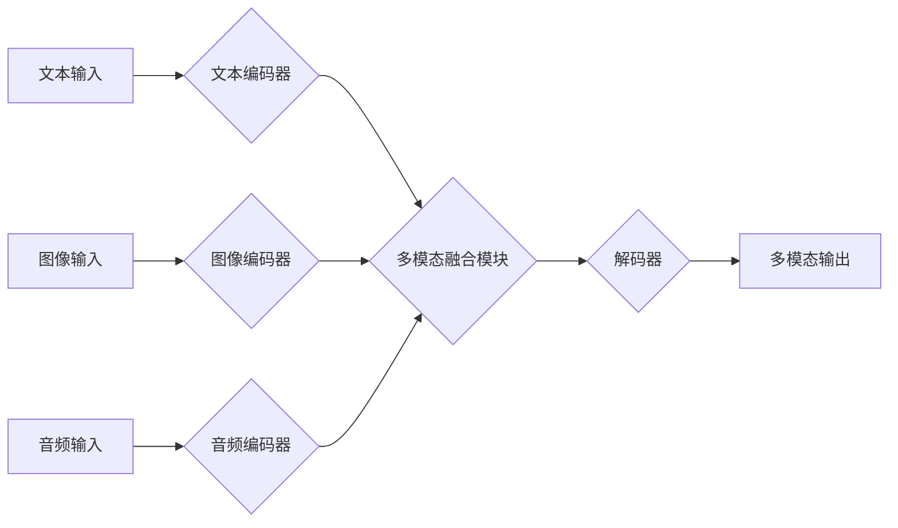

> 多模态大模型、自然语言处理、计算机视觉、音频处理、多模态融合、Transformer、BERT、GPT、视觉语言模型、应用场景

## 1. 背景介绍

近年来，人工智能（AI）技术取得了飞速发展，其中，大模型在自然语言处理（NLP）、计算机视觉（CV）等领域取得了突破性进展。然而，单模态模型在处理复杂、多方面信息时存在局限性。为了更好地理解和交互于真实世界，多模态大模型应运而生。

多模态大模型是指能够处理多种模态数据（如文本、图像、音频、视频等）并进行跨模态理解和生成的大型人工智能模型。它融合了不同模态的知识和信息，能够更全面地理解和表征世界，从而在更广泛的应用场景中发挥作用。

## 2. 核心概念与联系

多模态大模型的核心概念包括：

* **模态:** 指不同形式的信息表示，例如文本、图像、音频、视频等。
* **多模态融合:** 指将不同模态的数据进行有效地结合，提取其潜在的关联性和语义信息。
* **跨模态理解:** 指模型能够理解不同模态之间的关系，例如图像中的人物和文本中的描述相匹配。
* **跨模态生成:** 指模型能够根据不同模态的输入生成新的模态输出，例如根据文本描述生成图像。

**多模态大模型架构**



## 3. 核心算法原理 & 具体操作步骤

### 3.1  算法原理概述

多模态大模型的训练主要基于深度学习算法，其中Transformer模型及其变体在多模态领域取得了显著成果。Transformer模型通过自注意力机制学习不同模态之间的依赖关系，并通过多层编码器-解码器结构进行多模态信息融合和生成。

### 3.2  算法步骤详解

1. **数据预处理:** 将文本、图像、音频等数据进行预处理，例如文本分词、图像裁剪、音频降噪等。
2. **模态编码:** 使用不同的编码器对每个模态数据进行编码，例如使用BERT对文本进行编码，使用ResNet对图像进行编码。
3. **多模态融合:** 将不同模态的编码结果进行融合，例如使用注意力机制学习不同模态之间的权重，并将其融合为一个统一的表示。
4. **解码:** 使用解码器根据融合后的多模态表示生成目标输出，例如生成文本描述、图像、音频等。
5. **损失函数:** 使用交叉熵损失函数等对模型的输出进行评估，并根据评估结果进行模型训练。

### 3.3  算法优缺点

**优点:**

* 能够处理多种模态数据，并进行跨模态理解和生成。
* 能够学习不同模态之间的复杂关系，提高模型的理解能力。
* 在多个应用场景中取得了显著的性能提升。

**缺点:**

* 训练成本高，需要大量的计算资源和数据。
* 模型复杂度高，难以解释和调试。
* 跨模态融合的策略仍然存在挑战，需要进一步研究。

### 3.4  算法应用领域

多模态大模型在多个领域具有广泛的应用前景，例如：

* **图像字幕生成:** 根据图像生成文本描述。
* **视频理解:** 理解视频内容，例如识别人物、场景、事件等。
* **文本到图像生成:** 根据文本描述生成图像。
* **多模态问答:** 回答基于文本、图像、音频等多模态数据的问答。
* **机器人交互:** 帮助机器人理解和响应人类的多模态指令。

## 4. 数学模型和公式 & 详细讲解 & 举例说明

### 4.1  数学模型构建

多模态大模型的数学模型通常基于深度学习框架，例如TensorFlow或PyTorch。模型的结构通常包括编码器和解码器，编码器负责将不同模态的数据编码为特征向量，解码器则根据编码后的特征向量生成目标输出。

### 4.2  公式推导过程

Transformer模型的核心是自注意力机制，其计算公式如下：

$$
Attention(Q, K, V) = \frac{exp(Q \cdot K^T / \sqrt{d_k})}{exp(Q \cdot K^T / \sqrt{d_k})} \cdot V
$$

其中：

* $Q$：查询矩阵
* $K$：键矩阵
* $V$：值矩阵
* $d_k$：键向量的维度

自注意力机制能够学习不同词之间的依赖关系，并赋予每个词不同的权重，从而更好地理解句子语义。

### 4.3  案例分析与讲解

例如，在图像字幕生成任务中，模型会将图像编码为特征向量，并将文本编码器预训练的词嵌入作为查询向量。通过自注意力机制，模型可以学习图像中不同区域与文本词语之间的关系，并生成更准确的字幕描述。

## 5. 项目实践：代码实例和详细解释说明

### 5.1  开发环境搭建

* Python 3.7+
* TensorFlow 2.x 或 PyTorch 1.x
* CUDA 和 cuDNN

### 5.2  源代码详细实现

```python
# 使用 TensorFlow 2.x 实现简单的多模态融合模型

import tensorflow as tf

# 定义文本编码器
text_encoder = tf.keras.Sequential([
    tf.keras.layers.Embedding(vocab_size, embedding_dim),
    tf.keras.layers.LSTM(units)
])

# 定义图像编码器
image_encoder = tf.keras.Sequential([
    tf.keras.layers.Conv2D(filters=32, kernel_size=3, activation='relu'),
    tf.keras.layers.MaxPooling2D(pool_size=2),
    tf.keras.layers.Flatten()
])

# 定义多模态融合模块
def fuse_features(text_features, image_features):
    # 使用注意力机制融合文本和图像特征
    attention_weights = tf.keras.layers.Dense(1, activation='sigmoid')(
        tf.keras.layers.Concatenate()([text_features, image_features])
    )
    weighted_text_features = tf.multiply(text_features, attention_weights)
    fused_features = tf.keras.layers.Add()([weighted_text_features, image_features])
    return fused_features

# 定义解码器
decoder = tf.keras.Sequential([
    tf.keras.layers.Dense(units, activation='relu'),
    tf.keras.layers.Dense(vocab_size, activation='softmax')
])

# 定义模型
model = tf.keras.Model(
    inputs=[text_input, image_input],
    outputs=decoder(fuse_features(text_encoder(text_input), image_encoder(image_input)))
)

# 编译模型
model.compile(optimizer='adam', loss='sparse_categorical_crossentropy', metrics=['accuracy'])

# 训练模型
model.fit(
    x=[text_data, image_data],
    y=target_text,
    epochs=10
)
```

### 5.3  代码解读与分析

* 代码首先定义了文本编码器、图像编码器和解码器，分别负责对文本和图像数据进行编码和解码。
* 多模态融合模块使用注意力机制将文本和图像特征进行融合，并生成一个统一的表示。
* 最后，定义了完整的多模态模型，并使用Adam优化器和交叉熵损失函数进行训练。

### 5.4  运行结果展示

训练完成后，模型可以用于生成图像字幕、文本到图像生成等多模态任务。

## 6. 实际应用场景

### 6.1  图像字幕生成

多模态大模型可以根据图像生成文本描述，例如为图片添加字幕、生成产品描述等。

### 6.2  视频理解

多模态大模型可以理解视频内容，例如识别人物、场景、事件等，并进行视频摘要、视频搜索等应用。

### 6.3  文本到图像生成

多模态大模型可以根据文本描述生成图像，例如根据文字描述生成艺术作品、产品设计等。

### 6.4  未来应用展望

多模态大模型在未来将有更广泛的应用场景，例如：

* **增强现实（AR）和虚拟现实（VR）:** 为AR/VR体验提供更丰富的交互和内容。
* **医疗诊断:** 辅助医生进行疾病诊断，例如根据病理图像和患者病史生成诊断报告。
* **教育:** 提供更生动的学习体验，例如根据文本生成动画演示。

## 7. 工具和资源推荐

### 7.1  学习资源推荐

* **书籍:**
    * 《深度学习》
    * 《Transformer模型》
* **在线课程:**
    * Coursera: 深度学习
    * Udacity: 自然语言处理
* **博客和论坛:**
    * TensorFlow博客
    * PyTorch博客
    * Hugging Face社区

### 7.2  开发工具推荐

* **TensorFlow:** 开源深度学习框架
* **PyTorch:** 开源深度学习框架
* **Hugging Face Transformers:** 多模态预训练模型库

### 7.3  相关论文推荐

* 《Attention Is All You Need》
* 《BERT: Pre-training of Deep Bidirectional Transformers for Language Understanding》
* 《GPT-3: Language Models are Few-Shot Learners》

## 8. 总结：未来发展趋势与挑战

### 8.1  研究成果总结

多模态大模型在图像字幕生成、视频理解、文本到图像生成等领域取得了显著成果，展现了其强大的应用潜力。

### 8.2  未来发展趋势

* **模型规模和能力提升:** 未来多模态大模型将继续朝着更大规模、更强大的方向发展。
* **跨模态理解的深入研究:** 研究更有效的跨模态融合策略，提高模型的跨模态理解能力。
* **应用场景的拓展:** 多模态大模型将应用于更多领域，例如医疗、教育、娱乐等。

### 8.3  面临的挑战

* **数据获取和标注:** 多模态数据的获取和标注成本高，需要更有效的解决方案。
* **模型训练和推理效率:** 多模态大模型训练和推理效率低，需要优化模型结构和训练方法。
* **模型解释性和可解释性:** 多模态大模型的决策过程复杂，难以解释和理解，需要提高模型的可解释性。

### 8.4  研究展望

未来，多模态大模型的研究将继续深入，探索更有效的跨模态融合策略、更高效的训练方法和更强的应用能力，为人工智能的未来发展做出更大的贡献。

## 9. 附录：常见问题与解答

* **Q: 多模态大模型与单模态模型相比有什么优势？**

* **A:** 多模态大模型能够处理多种模态数据，并进行跨模态理解和生成，能够更好地理解和表征世界，从而在更广泛的应用场景中发挥作用。

* **Q: 如何训练多模态大模型？**

* **A:** 多模态大模型的训练通常基于深度学习算法，需要大量的计算资源和数据。训练过程包括数据预处理、模态编码、多模态融合、解码和损失函数计算等步骤。

* **Q: 多模态大模型有哪些应用场景？**

* **A:** 多模态大模型在图像字幕生成、视频理解、文本到图像生成、机器人交互等多个领域具有广泛的应用前景。


作者：禅与计算机程序设计艺术 / Zen and the Art