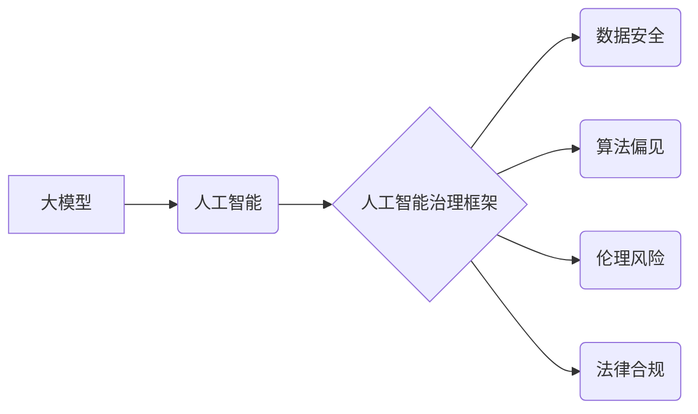

> 大模型、人工智能、治理框架、企业应用、伦理风险、数据安全、法律合规

## 1. 背景介绍

近年来，大模型技术蓬勃发展，其强大的泛化能力和应用潜力引发了各行各业的广泛关注。从自然语言处理到图像识别，从药物研发到金融预测，大模型正在深刻地改变着我们的生活和工作方式。然而，大模型的应用也带来了新的挑战，例如数据安全、算法偏见、伦理风险等。

企业在拥抱大模型技术的同时，也需要建立完善的人工智能治理框架，以确保大模型的应用安全、可控、可持续。

## 2. 核心概念与联系

**2.1 核心概念**

* **大模型 (Large Model):** 指参数量在百万级以上，甚至数亿、数十亿级别的深度学习模型。
* **人工智能 (Artificial Intelligence):** 指模拟人类智能行为的计算机系统，包括学习、推理、决策、感知等能力。
* **人工智能治理 (AI Governance):** 指对人工智能技术的开发、应用、管理和监督进行规范和控制的体系，旨在确保人工智能技术安全、可控、可持续发展。

**2.2 架构关系**



**2.3 核心联系**

大模型是人工智能技术的重要组成部分，其应用需要建立在完善的人工智能治理框架之上。人工智能治理框架旨在规范和控制大模型的开发、应用、管理和监督，以确保其安全、可控、可持续发展。

## 3. 核心算法原理 & 具体操作步骤

**3.1 算法原理概述**

大模型通常基于深度学习算法，例如 Transformer、BERT、GPT 等。这些算法通过大量的训练数据，学习语言的结构和语义关系，从而能够进行文本生成、翻译、问答等任务。

**3.2 算法步骤详解**

1. **数据收集和预处理:** 收集大量文本数据，并进行清洗、分词、标记等预处理操作。
2. **模型构建:** 选择合适的深度学习模型架构，并根据任务需求进行参数调整。
3. **模型训练:** 使用训练数据训练模型，通过反向传播算法不断优化模型参数。
4. **模型评估:** 使用测试数据评估模型性能，并根据评估结果进行模型调优。
5. **模型部署:** 将训练好的模型部署到生产环境中，用于实际应用。

**3.3 算法优缺点**

* **优点:** 强大的泛化能力、高精度、可处理复杂任务。
* **缺点:** 训练成本高、数据依赖性强、容易出现算法偏见。

**3.4 算法应用领域**

* 自然语言处理：文本生成、机器翻译、问答系统、情感分析等。
* 图像识别：图像分类、目标检测、图像分割等。
* 药物研发：药物发现、药物设计、药物安全性评估等。
* 金融预测：股票预测、信用风险评估、欺诈检测等。

## 4. 数学模型和公式 & 详细讲解 & 举例说明

**4.1 数学模型构建**

大模型的训练过程本质上是一个优化问题，目标是找到模型参数，使得模型在训练数据上的损失函数最小。常用的损失函数包括交叉熵损失、均方误差等。

**4.2 公式推导过程**

假设模型的输出为 $y$, 实际标签为 $t$, 则交叉熵损失函数可以表示为：

$$
L = -\sum_{i=1}^{N} t_i \log y_i
$$

其中，$N$ 为样本数量。

**4.3 案例分析与讲解**

例如，在文本生成任务中，模型的输出为一个单词序列，实际标签为对应的真实单词序列。我们可以使用交叉熵损失函数来衡量模型生成的文本与真实文本之间的差异。

## 5. 项目实践：代码实例和详细解释说明

**5.1 开发环境搭建**

* 操作系统：Linux
* Python 版本：3.7+
* 深度学习框架：TensorFlow 或 PyTorch

**5.2 源代码详细实现**

```python
import tensorflow as tf

# 定义模型结构
model = tf.keras.Sequential([
    tf.keras.layers.Embedding(input_dim=vocab_size, output_dim=embedding_dim),
    tf.keras.layers.LSTM(units=hidden_size),
    tf.keras.layers.Dense(units=vocab_size, activation='softmax')
])

# 编译模型
model.compile(optimizer='adam', loss='sparse_categorical_crossentropy', metrics=['accuracy'])

# 训练模型
model.fit(x_train, y_train, epochs=10)

# 评估模型
loss, accuracy = model.evaluate(x_test, y_test)
print('Loss:', loss)
print('Accuracy:', accuracy)
```

**5.3 代码解读与分析**

* 代码首先定义了模型结构，包括嵌入层、LSTM层和全连接层。
* 然后编译模型，指定优化器、损失函数和评价指标。
* 接着训练模型，使用训练数据进行训练。
* 最后评估模型，使用测试数据计算模型的损失和准确率。

**5.4 运行结果展示**

训练完成后，可以将模型应用于文本生成任务，例如生成诗歌、小说、新闻等。

## 6. 实际应用场景

**6.1 数据安全**

大模型可以用于识别和保护敏感数据，例如个人信息、财务信息等。

**6.2 算法偏见**

大模型的训练数据可能存在偏见，导致模型输出结果存在偏差。企业需要采取措施，例如数据清洗、模型调优等，来减轻算法偏见的影响。

**6.3 伦理风险**

大模型的应用可能带来伦理风险，例如深度伪造、隐私侵犯等。企业需要制定伦理规范，并建立相应的监督机制，来规避伦理风险。

**6.4 未来应用展望**

大模型将在更多领域得到应用，例如医疗、教育、金融等。

## 7. 工具和资源推荐

**7.1 学习资源推荐**

* 深度学习书籍：
    * 《深度学习》
    * 《动手学深度学习》
* 在线课程：
    * Coursera 深度学习课程
    * fast.ai 深度学习课程

**7.2 开发工具推荐**

* 深度学习框架：TensorFlow、PyTorch
* 数据处理工具：Pandas、NumPy
* 代码版本控制工具：Git

**7.3 相关论文推荐**

* 《Attention Is All You Need》
* 《BERT: Pre-training of Deep Bidirectional Transformers for Language Understanding》
* 《GPT-3: Language Models are Few-Shot Learners》

## 8. 总结：未来发展趋势与挑战

**8.1 研究成果总结**

近年来，大模型技术取得了显著进展，模型规模不断扩大，性能不断提升。

**8.2 未来发展趋势**

* 模型规模进一步扩大
* 模型训练效率提升
* 模型应用场景更加广泛

**8.3 面临的挑战**

* 数据安全和隐私保护
* 算法偏见和伦理风险
* 模型可解释性和可控性

**8.4 研究展望**

未来，需要进一步研究大模型的安全性、可控性和可解释性，以确保大模型技术安全、可持续发展。

## 9. 附录：常见问题与解答

**9.1 如何选择合适的深度学习框架？**

TensorFlow 和 PyTorch 是两个主流的深度学习框架，选择哪个框架取决于具体的应用场景和个人喜好。

**9.2 如何处理大规模训练数据？**

可以使用分布式训练技术，将训练任务分发到多个机器上进行并行训练。

**9.3 如何评估大模型的性能？**

可以使用准确率、召回率、F1-score 等指标来评估大模型的性能。

作者：禅与计算机程序设计艺术 / Zen and the Art of Computer Programming


<end_of_turn>