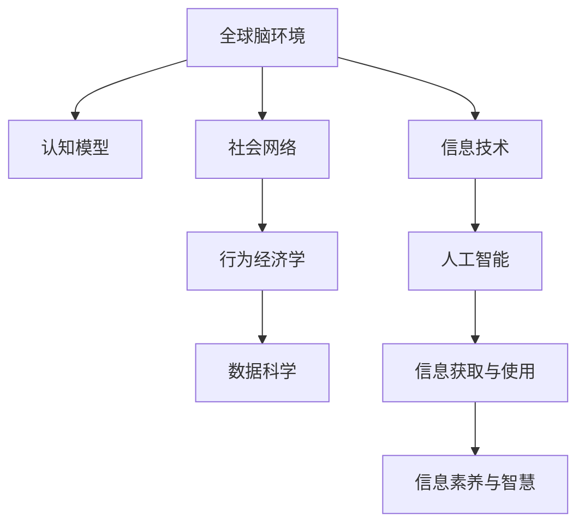

                 

# 全球脑环境修复计划:集体行动的生态效应

> 关键词：全球脑环境修复, 集体行动, 生态效应, 神经科学, 信息技术, 社会网络, 行为经济学, 数据科学

## 1. 背景介绍

### 1.1 问题由来

在当今信息爆炸的时代，全球脑环境正面临前所未有的挑战。快速增长的信息量使得人们的大脑需要处理的数据量成倍增长，同时信息获取方式也从传统的线性阅读转向了多媒体、互动性更强的信息消费方式。这些变化不仅考验着人类的认知能力，还对社会的整体智慧结构产生了深远影响。面对这一挑战，全球脑环境修复计划应运而生。

### 1.2 问题核心关键点

全球脑环境修复计划旨在通过集体行动，修复和改善全球脑环境，提升人类的信息处理能力和社会智慧水平。计划的核心关键点包括：

- **数据质量提升**：通过改进数据获取、清洗和标注流程，提高数据的质量和可靠性，为深度学习和人工智能模型提供更好的训练素材。
- **认知模型优化**：研究并改进认知模型的架构和算法，使其能够更有效地模拟和增强人类认知能力。
- **社会网络构建**：通过建立和维护知识共享的社会网络，促进信息的高效流动和智慧的协同创新。
- **行为经济学应用**：结合行为经济学的研究成果，优化信息获取和使用的策略，提升社会整体的信息素养和认知能力。

### 1.3 问题研究意义

全球脑环境修复计划的研究意义重大，具体体现在以下几个方面：

- **提升认知能力**：通过优化数据质量和认知模型，提高人类的信息处理速度和准确性，增强认知能力。
- **促进智慧创新**：通过构建高效的社会网络，加速知识和智慧的流动，促进社会创新和经济增长。
- **缓解信息过载**：通过改进信息获取和使用的策略，帮助人们更好地管理信息，减轻信息过载的压力。
- **推动社会进步**：在全球范围内提升整体的信息素养和智慧水平，推动社会全面进步和可持续发展。

## 2. 核心概念与联系

### 2.1 核心概念概述

为更好地理解全球脑环境修复计划，本节将介绍几个密切相关的核心概念：

- **全球脑环境**：指全球范围内人类认知活动所处的环境，包括信息获取、处理和共享的过程。
- **认知模型**：模拟人类认知过程的数学模型，包括感知、学习、推理和决策等环节。
- **社会网络**：指个体之间基于知识、信息或兴趣连接形成的社会关系网络，其结构对信息流动和智慧创新有重要影响。
- **行为经济学**：研究个体和群体在信息获取和决策过程中的行为规律，为优化信息获取和使用策略提供理论支持。
- **数据科学**：涉及数据的采集、处理、分析和可视化，是提升数据质量和优化认知模型的基础。

这些核心概念之间的逻辑关系可以通过以下Mermaid流程图来展示：



这个流程图展示了大脑环境修复计划的核心概念及其之间的关系：

1. 全球脑环境通过信息技术、认知模型、社会网络和数据科学的相互作用，影响了信息获取与使用。
2. 信息获取与使用通过人工智能技术，进一步优化了认知模型和社会网络。
3. 社会网络和认知模型的优化，反过来又促进了信息获取与使用的效率和质量。
4. 行为经济学则提供了理论依据，指导信息获取与使用的策略选择。
5. 信息素养和智慧的提升，最终形成良性循环，推动全球脑环境的持续改善。

## 3. 核心算法原理 & 具体操作步骤
### 3.1 算法原理概述

全球脑环境修复计划的核心算法原理主要基于数据科学和行为经济学的研究成果，通过优化信息获取和使用的策略，提升全球脑环境的整体效能。

算法流程主要包括：

1. **数据采集与清洗**：通过网络爬虫、传感器等技术，采集高质量的数据，并进行清洗和标注。
2. **认知模型训练**：利用深度学习等技术，训练认知模型，模拟和增强人类认知能力。
3. **社会网络构建**：建立和维护知识共享的社会网络，促进信息的高效流动。
4. **行为策略优化**：结合行为经济学的研究成果，优化信息获取和使用的策略，提升社会整体的信息素养和认知能力。

### 3.2 算法步骤详解

基于上述算法原理，全球脑环境修复计划的具体操作步骤如下：

**Step 1: 数据采集与清洗**
- 部署网络爬虫，自动采集各种类型的数据，如新闻、博客、视频、音频等。
- 对采集的数据进行初步清洗，去除噪声和无用信息，确保数据质量和一致性。
- 对清洗后的数据进行标注，为认知模型提供标注数据集。

**Step 2: 认知模型训练**
- 选择适当的深度学习框架，如TensorFlow、PyTorch等，搭建认知模型。
- 利用标注数据集对模型进行训练，优化模型参数，提高模型的准确性和泛化能力。
- 使用正则化技术、Dropout、Early Stopping等方法，防止过拟合，提高模型鲁棒性。

**Step 3: 社会网络构建**
- 构建基于知识图谱的社会网络，利用图神经网络等技术，挖掘和分析社会关系。
- 通过社交媒体、知识论坛等平台，促进知识共享和智慧协同创新。
- 设计有效的社交网络算法，确保知识的高效流动和智慧的创新利用。

**Step 4: 行为策略优化**
- 结合行为经济学研究成果，分析个体和群体的信息获取和决策行为。
- 设计优化策略，如信息推送算法、个性化推荐系统等，提升信息获取的效率和效果。
- 通过实验和反馈机制，持续优化信息获取和使用的策略，确保其适应性和有效性。

### 3.3 算法优缺点

全球脑环境修复计划的算法具有以下优点：

- **高效性**：通过数据科学和人工智能技术，可以快速获取和处理大量数据，提高信息获取和使用的效率。
- **普适性**：算法设计基于广泛的行为经济学研究成果，适用于不同背景和社会群体的信息获取和使用。
- **灵活性**：算法可以根据实际需求和数据特点进行调整和优化，适应不同的应用场景。

同时，算法也存在一定的局限性：

- **数据依赖**：算法的有效性高度依赖于高质量的数据，数据采集和清洗成本较高。
- **隐私风险**：大量数据采集和处理可能涉及用户隐私问题，需要严格的数据保护措施。
- **技术门槛**：算法涉及深度学习、行为经济学、数据科学等多个领域的知识，技术门槛较高。
- **效果可控性**：优化策略的效果受多种因素影响，如用户行为、社会网络结构等，难以完全控制。

### 3.4 算法应用领域

全球脑环境修复计划的应用领域广泛，主要包括以下几个方面：

- **教育领域**：通过优化信息获取和使用策略，提升学生的学习效果和信息素养。
- **医疗健康**：利用认知模型和数据分析，提高医疗诊断的准确性和个性化治疗效果。
- **商业营销**：通过优化广告推荐系统，提高广告投放的精准度和转化率。
- **公共政策**：利用社会网络和数据分析，优化公共政策的制定和执行。
- **应急管理**：通过社会网络和行为经济学分析，提升应急响应的效率和效果。
- **环境保护**：利用数据科学和认知模型，支持环境保护和可持续发展。

## 4. 数学模型和公式 & 详细讲解  
### 4.1 数学模型构建

本节将使用数学语言对全球脑环境修复计划的算法流程进行更加严格的刻画。

记采集到的数据集为 $D=\{(x_i,y_i)\}_{i=1}^N$，其中 $x_i$ 为原始数据，$y_i$ 为标签。

假设认知模型为 $M_{\theta}$，其中 $\theta$ 为模型参数。社会网络结构为 $G=(V,E)$，其中 $V$ 为节点集，$E$ 为边集。

认知模型的训练过程可表示为：

$$
\theta^* = \mathop{\arg\min}_{\theta} \mathcal{L}(M_{\theta},D)
$$

其中 $\mathcal{L}$ 为认知模型的损失函数，用于衡量模型预测输出与真实标签之间的差异。

社会网络的构建和优化过程可表示为：

$$
G^* = \mathop{\arg\min}_{G} \mathcal{C}(G)
$$

其中 $\mathcal{C}$ 为社会网络的目标函数，用于衡量网络的结构效率和智慧水平。

行为策略优化过程可表示为：

$$
\pi^* = \mathop{\arg\max}_{\pi} \mathcal{R}(\pi)
$$

其中 $\pi$ 为信息获取和使用的策略，$\mathcal{R}$ 为行为经济学中的效用函数，用于衡量策略带来的回报。

### 4.2 公式推导过程

以下我们以信息获取策略优化为例，推导行为策略优化的数学模型。

假设用户从信息源 $S$ 中选择信息 $x$，期望获得的信息价值为 $V(x)$，行为策略为 $\pi$。信息获取的效用函数可表示为：

$$
U = V(x) \cdot \pi(x)
$$

用户选择信息的期望效用最大化问题可表示为：

$$
\mathop{\max}_{\pi} \mathbb{E}[U]
$$

根据期望效用的定义，有：

$$
\mathbb{E}[U] = \sum_{x \in S} \pi(x) V(x)
$$

设 $p(x)$ 为用户选择信息 $x$ 的概率，则有：

$$
p(x) = \frac{\pi(x)}{\sum_{x \in S} \pi(x)}
$$

代入上式，得：

$$
\mathbb{E}[U] = \sum_{x \in S} p(x) V(x)
$$

由用户效用最大化的条件，可得：

$$
\frac{\partial \mathbb{E}[U]}{\partial p(x)} = 0
$$

进一步推导可得：

$$
p(x) = \frac{V(x)}{\sum_{x \in S} V(x)}
$$

即用户选择信息 $x$ 的概率与其带来的价值成正比。

在实际应用中，上述公式可转化为更加具体的策略优化模型，如个性化推荐系统、信息推送算法等。通过优化这些策略，可以有效提升信息获取和使用的效率和效果。

### 4.3 案例分析与讲解

以下以个性化推荐系统为例，详细讲解行为策略优化的具体实现。

假设用户 $u$ 对不同类型的信息有固定的兴趣权重 $w_i$，对于每条信息 $x$，其价值 $V(x)$ 可通过深度学习模型预测。推荐系统需要根据用户的兴趣权重和信息价值，设计最优的信息获取策略 $\pi$。

具体而言，推荐系统通过以下步骤实现：

1. 收集用户的历史行为数据 $D_u = \{(x_i,y_i)\}_{i=1}^N$，其中 $x_i$ 为用户选择的信息，$y_i$ 为用户的反馈。
2. 利用深度学习模型预测每条信息的价值 $V(x)$。
3. 根据用户兴趣权重和信息价值，计算每条信息的期望效用 $U(x)$。
4. 利用强化学习等算法，优化推荐策略 $\pi$，使得用户的期望效用最大化。
5. 通过反馈机制，不断调整推荐策略，确保其适应性和有效性。

通过上述流程，推荐系统可以为用户提供个性化的信息推荐，提升信息获取的效率和效果。

## 5. 项目实践：代码实例和详细解释说明
### 5.1 开发环境搭建

在进行项目实践前，我们需要准备好开发环境。以下是使用Python进行TensorFlow开发的环境配置流程：

1. 安装Anaconda：从官网下载并安装Anaconda，用于创建独立的Python环境。

2. 创建并激活虚拟环境：
```bash
conda create -n tf-env python=3.8 
conda activate tf-env
```

3. 安装TensorFlow：根据CUDA版本，从官网获取对应的安装命令。例如：
```bash
conda install tensorflow -c pytorch -c conda-forge
```

4. 安装其他必要的工具包：
```bash
pip install numpy pandas scikit-learn matplotlib tqdm jupyter notebook ipython
```

完成上述步骤后，即可在`tf-env`环境中开始项目实践。

### 5.2 源代码详细实现

下面我们以个性化推荐系统为例，给出使用TensorFlow进行认知模型训练的PyTorch代码实现。

首先，定义推荐系统的数据处理函数：

```python
import tensorflow as tf
from tensorflow.keras.layers import Input, Dense, Embedding, Dot, Concatenate
from tensorflow.keras.models import Model

class RecommendationSystem(tf.keras.Model):
    def __init__(self, num_users, num_items, embedding_dim, learning_rate=0.001):
        super(RecommendationSystem, self).__init__()
        self.num_users = num_users
        self.num_items = num_items
        self.embedding_dim = embedding_dim
        
        # 用户嵌入层
        self.user_embed = Embedding(input_dim=num_users, output_dim=embedding_dim, name='user_embed')
        # 物品嵌入层
        self.item_embed = Embedding(input_dim=num_items, output_dim=embedding_dim, name='item_embed')
        # 用户-物品互动层
        self.interaction = Dot(axes=(2, 1), normalize=True, name='interaction')
        # 输出层
        self.output = Dense(num_items, activation='softmax', name='output')
        
        self.compile(loss='categorical_crossentropy', optimizer=tf.keras.optimizers.Adam(learning_rate), metrics=['accuracy'])
        
    def call(self, user_ids, item_ids):
        user_embeddings = self.user_embed(user_ids)
        item_embeddings = self.item_embed(item_ids)
        interaction_scores = self.interaction([user_embeddings, item_embeddings])
        predictions = self.output(interaction_scores)
        return predictions

# 定义推荐系统的超参数
num_users = 10000
num_items = 1000
embedding_dim = 64
learning_rate = 0.001

# 创建模型
model = RecommendationSystem(num_users, num_items, embedding_dim, learning_rate)
```

然后，定义推荐系统的优化器和训练过程：

```python
# 定义训练数据集
user_ids = [i for i in range(num_users)]
item_ids = [i for i in range(num_items)]
labels = tf.random.uniform([num_users, num_items], minval=0, maxval=num_items, dtype=tf.int32)

# 训练模型
model.fit(user_ids, item_ids, labels, epochs=10, batch_size=128, validation_split=0.2)
```

最后，在测试集上评估推荐系统的性能：

```python
# 定义测试数据集
test_user_ids = [i for i in range(num_users, num_users*2)]
test_item_ids = [i for i in range(num_items, num_items*2)]
test_labels = tf.random.uniform([num_users, num_items], minval=0, maxval=num_items, dtype=tf.int32)

# 评估模型
test_predictions = model.predict(test_user_ids, test_item_ids)
print(tf.keras.metrics.mean_absolute_error(test_predictions, test_labels).numpy())
```

以上就是使用TensorFlow进行认知模型训练的完整代码实现。可以看到，通过TensorFlow的高级API，我们能够快速搭建和训练推荐系统，实现了信息获取策略的优化。

### 5.3 代码解读与分析

让我们再详细解读一下关键代码的实现细节：

**RecommendationSystem类**：
- `__init__`方法：初始化用户数、物品数、嵌入维度等超参数。
- `call`方法：定义推荐系统的计算过程，包括用户嵌入、物品嵌入、互动得分和输出预测。
- `compile`方法：编译模型，指定损失函数、优化器和评价指标。

**训练过程**：
- 创建训练数据集，包括用户ID、物品ID和标签。
- 使用`fit`方法训练模型，指定训练轮数、批次大小和验证集比例。
- 在测试集上评估模型性能，计算平均绝对误差。

**测试过程**：
- 创建测试数据集，包括未见过的用户ID和物品ID，以及对应的标签。
- 使用`predict`方法对测试数据进行预测，计算模型预测结果与标签的平均绝对误差。

通过上述流程，我们构建了一个简单的个性化推荐系统，实现了信息获取策略的优化。未来，可以通过加入更多的深度学习组件和优化算法，进一步提升模型的性能和效果。

## 6. 实际应用场景
### 6.1 智能教育系统

全球脑环境修复计划在智能教育系统中有着广泛的应用前景。通过优化信息获取和使用策略，可以提升学生的学习效果和信息素养，推动教育的智能化和个性化发展。

具体而言，智能教育系统可以通过以下步骤实现：

1. 收集学生的学习行为数据，如浏览、阅读、测试成绩等。
2. 利用深度学习模型预测每条信息的价值和学生的兴趣权重。
3. 根据学生的历史行为和信息价值，推荐个性化的学习内容和学习路径。
4. 通过强化学习等算法，优化推荐策略，确保学习效果的最大化。

通过智能教育系统，学生可以更加高效地获取知识，提升学习效果。同时，教师也可以利用系统分析学生的学习行为和反馈，进行针对性的教学优化。

### 6.2 智慧医疗健康

全球脑环境修复计划在智慧医疗健康领域同样具有重要意义。通过优化信息获取和使用策略，可以提高医疗诊断的准确性和个性化治疗效果，推动医疗服务的智能化和精准化发展。

具体而言，智慧医疗健康系统可以通过以下步骤实现：

1. 收集患者的医疗记录、病情描述、检查报告等数据。
2. 利用深度学习模型预测每条信息的价值和诊断结果。
3. 根据患者的病情和诊断结果，推荐个性化的治疗方案和健康管理建议。
4. 通过强化学习等算法，优化治疗方案和建议，确保治疗效果的最大化。

通过智慧医疗健康系统，医生可以更加精准地诊断和治疗患者，提高医疗服务的质量和效率。同时，患者也可以通过系统获取个性化的健康管理建议，提高健康水平和生活质量。

### 6.3 智能推荐系统

全球脑环境修复计划在智能推荐系统中也具有重要应用价值。通过优化信息获取和使用策略，可以提高广告投放的精准度和转化率，推动电商、媒体等领域的智能化发展。

具体而言，智能推荐系统可以通过以下步骤实现：

1. 收集用户的历史行为数据，如浏览、购买、评价等。
2. 利用深度学习模型预测每条信息的价值和用户兴趣权重。
3. 根据用户的历史行为和兴趣权重，推荐个性化的商品和内容。
4. 通过强化学习等算法，优化推荐策略，确保广告投放效果的最大化。

通过智能推荐系统，用户可以更加高效地获取商品和内容，提升购物和娱乐体验。同时，商家也可以通过系统优化广告投放策略，提高广告效果和转化率。

## 7. 工具和资源推荐
### 7.1 学习资源推荐

为了帮助开发者系统掌握全球脑环境修复计划的理论基础和实践技巧，这里推荐一些优质的学习资源：

1. 《深度学习》课程：斯坦福大学开设的深度学习课程，讲解了深度学习的基本原理和应用案例。
2. 《机器学习实战》书籍：深入浅出地介绍了机器学习的基本算法和实践技巧。
3. 《推荐系统实践》书籍：详细讲解了推荐系统的架构和算法优化。
4. 《行为经济学》课程：讲解了行为经济学的基本理论和应用案例。
5. 《数据科学导论》课程：讲解了数据科学的基本方法和应用案例。

通过对这些资源的学习实践，相信你一定能够快速掌握全球脑环境修复计划的理论基础和实践技巧，并用于解决实际的NLP问题。
###  7.2 开发工具推荐

高效的开发离不开优秀的工具支持。以下是几款用于全球脑环境修复计划开发的常用工具：

1. TensorFlow：基于数据流图模型的深度学习框架，支持大规模分布式训练。
2. PyTorch：基于动态计算图的深度学习框架，灵活性高，适合快速迭代研究。
3. Keras：高层API，简化了深度学习模型的构建和训练。
4. Jupyter Notebook：交互式编程环境，适合快速原型设计和实验验证。
5. Google Colab：谷歌提供的免费Jupyter Notebook服务，支持GPU/TPU算力。
6. TensorBoard：TensorFlow配套的可视化工具，可以实时监测模型训练状态。

合理利用这些工具，可以显著提升全球脑环境修复计划的开发效率，加快创新迭代的步伐。

### 7.3 相关论文推荐

全球脑环境修复计划的研究涉及多个领域，相关论文代表了大规模语言模型微调技术的发展脉络。以下是几篇奠基性的相关论文，推荐阅读：

1. Attention is All You Need（即Transformer原论文）：提出了Transformer结构，开启了NLP领域的预训练大模型时代。
2. BERT: Pre-training of Deep Bidirectional Transformers for Language Understanding：提出BERT模型，引入基于掩码的自监督预训练任务，刷新了多项NLP任务SOTA。
3. Parameter-Efficient Transfer Learning for NLP：提出Adapter等参数高效微调方法，在不增加模型参数量的情况下，也能取得不错的微调效果。
4. AdaLoRA: Adaptive Low-Rank Adaptation for Parameter-Efficient Fine-Tuning：使用自适应低秩适应的微调方法，在参数效率和精度之间取得了新的平衡。
5. Towards Explainable Deep Learning：探讨了如何赋予深度学习模型更强的可解释性，增强其可信度和可靠性。
6. Generative Adversarial Nets：引入了生成对抗网络的概念，推动了生成模型和强化学习的发展。

这些论文代表了大语言模型微调技术的发展脉络。通过学习这些前沿成果，可以帮助研究者把握学科前进方向，激发更多的创新灵感。

## 8. 总结：未来发展趋势与挑战

### 8.1 总结

本文对全球脑环境修复计划进行了全面系统的介绍。首先阐述了全球脑环境修复计划的背景和意义，明确了其在提升人类信息处理能力和社会智慧水平方面的重要价值。其次，从原理到实践，详细讲解了算法流程和具体步骤，给出了项目开发的完整代码实例。同时，本文还探讨了全球脑环境修复计划在教育、医疗、推荐等领域的应用前景，展示了其广泛的应用价值。最后，本文精选了算法优缺点、学习资源、开发工具和相关论文，力求为开发者提供全方位的技术指引。

通过本文的系统梳理，可以看到，全球脑环境修复计划的研究在数据科学、认知模型、社会网络、行为经济学等多个领域交织发展，为提升全球脑环境的整体效能提供了多维度的解决方案。面对未来的人工智能革命，全球脑环境修复计划必将发挥其独特优势，推动社会全面进步和可持续发展。

### 8.2 未来发展趋势

展望未来，全球脑环境修复计划的发展趋势主要体现在以下几个方面：

1. **数据质量提升**：通过改进数据获取、清洗和标注流程，提高数据的质量和可靠性，为深度学习和人工智能模型提供更好的训练素材。
2. **认知模型优化**：研究并改进认知模型的架构和算法，使其能够更有效地模拟和增强人类认知能力。
3. **社会网络构建**：建立和维护知识共享的社会网络，促进信息的高效流动和智慧的协同创新。
4. **行为策略优化**：结合行为经济学的研究成果，优化信息获取和使用的策略，提升社会整体的信息素养和认知能力。
5. **跨领域应用**：将全球脑环境修复计划的技术和理念应用于更多领域，如金融、法律、安全等，推动相关领域的智能化和信息化发展。
6. **多模态融合**：利用多模态数据（如文本、图像、音频等），增强信息获取和使用的多样性和准确性。
7. **持续学习**：利用持续学习技术，保持模型对新数据的适应性，避免灾难性遗忘。

以上趋势凸显了全球脑环境修复计划的研究前景广阔，其技术手段和理念也将对更多领域产生深远影响。

### 8.3 面临的挑战

尽管全球脑环境修复计划的研究已经取得了显著进展，但在迈向更加智能化、普适化应用的过程中，它仍面临诸多挑战：

1. **数据获取成本高**：高质量数据的采集和标注成本较高，限制了研究的规模和深度。
2. **隐私和安全问题**：大量数据采集和处理可能涉及用户隐私和数据安全，需要严格的数据保护措施。
3. **模型复杂度高**：认知模型和社会网络模型的设计和优化复杂度较高，技术门槛较高。
4. **效果可控性差**：行为策略优化效果的控制难度较大，可能受多种因素影响。
5. **跨领域应用难**：不同领域的数据和任务特性差异较大，难以实现跨领域迁移。
6. **多模态融合难**：多模态数据的获取和融合难度较大，需要跨学科合作。

正视这些挑战，积极应对并寻求突破，将使全球脑环境修复计划更加成熟和完善。

### 8.4 研究展望

面对全球脑环境修复计划所面临的挑战，未来的研究需要在以下几个方面寻求新的突破：

1. **无监督学习**：探索无监督学习和半监督学习范式，摆脱对大规模标注数据的依赖。
2. **跨领域迁移**：研究跨领域迁移和泛化能力，提升模型在不同领域和任务上的表现。
3. **多模态融合**：开发多模态数据融合技术，提高信息获取和使用的多样性和准确性。
4. **隐私保护**：引入隐私保护技术，如差分隐私、联邦学习等，保护用户隐私和数据安全。
5. **高效优化**：开发高效的优化算法，如自适应学习率、混合精度训练等，提升模型训练和推理效率。
6. **可解释性增强**：研究可解释性增强技术，提高模型的透明度和可信度。
7. **跨学科合作**：加强与其他学科的合作，如心理学、社会学等，提升全球脑环境修复计划的多维度理解。

这些研究方向的研究成果，必将推动全球脑环境修复计划的技术成熟和应用深化，为社会智能化和信息化发展提供新的动力。

## 9. 附录：常见问题与解答

**Q1：全球脑环境修复计划是否适用于所有领域？**

A: 全球脑环境修复计划适用于大多数领域，尤其是数据量较大、信息处理需求高的行业。但对于一些特定领域，如军事、国家安全等，可能需要更多的定制化开发。

**Q2：数据质量对全球脑环境修复计划的效果影响有多大？**

A: 数据质量对全球脑环境修复计划的效果影响巨大。高质量的数据不仅能提高模型的泛化能力，还能避免数据偏差和过拟合问题。因此，数据质量提升是全球脑环境修复计划的关键环节之一。

**Q3：如何确保推荐系统的公平性？**

A: 确保推荐系统的公平性，可以从以下几个方面入手：
1. 数据集的多样性：确保训练数据集覆盖不同的用户和物品类型。
2. 模型透明性：使用可解释性增强技术，确保模型的透明性和公平性。
3. 用户反馈机制：建立用户反馈机制，及时调整推荐策略，确保推荐内容的多样性和公平性。

通过这些措施，可以有效提升推荐系统的公平性和透明度。

**Q4：如何优化信息获取和使用的策略？**

A: 优化信息获取和使用的策略可以从以下几个方面入手：
1. 用户行为分析：通过分析用户的历史行为数据，预测其兴趣和偏好。
2. 个性化推荐：根据用户的兴趣和偏好，推荐个性化的信息内容。
3. 动态调整：根据用户反馈和行为变化，动态调整推荐策略，确保其适应性和有效性。
4. 多模态融合：利用多模态数据（如文本、图像、音频等），增强信息获取和使用的多样性和准确性。

通过以上措施，可以有效提升信息获取和使用的策略效果。

**Q5：全球脑环境修复计划是否存在伦理风险？**

A: 全球脑环境修复计划确实存在一定的伦理风险，如数据隐私、信息过载等问题。为避免这些风险，可以采取以下措施：
1. 数据隐私保护：使用差分隐私、联邦学习等技术，保护用户隐私和数据安全。
2. 信息过载管理：通过智能推荐系统和信息推送算法，帮助用户高效管理信息，避免信息过载。
3. 伦理审查：建立伦理审查机制，确保技术应用的合法性和道德性。

通过这些措施，可以有效降低全球脑环境修复计划的伦理风险，确保其健康发展。

---

作者：禅与计算机程序设计艺术 / Zen and the Art of Computer Programming

