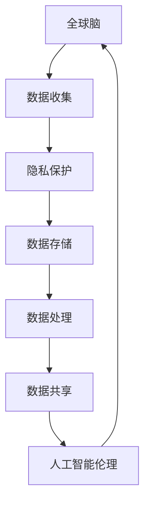

                 

# 全球脑的伦理困境：隐私与共享的平衡

> 关键词：全球脑, 隐私保护, 数据共享, 人工智能伦理, 大数据, 隐私计算

## 1. 背景介绍

### 1.1 问题由来

在数字化和信息化的时代背景下，全球脑（World Brain）的构想正在逐步成为现实。所谓的全球脑，指的是通过海量数据和先进算法构建的全球规模的神经网络系统，旨在实现人机融合、智能决策、社会治理等目标。这一构想虽然充满潜力，但也引发了一系列伦理困境，特别是在隐私与共享的平衡方面。

一方面，全球脑需要海量数据的支持，这些数据可能涉及个人隐私、商业机密等敏感信息。如何保护这些信息，防止其被滥用，是全球脑建设过程中需要首先解决的问题。

另一方面，全球脑的核心目标之一是通过共享数据来实现协同决策和智能分析，从而推动社会发展和科技进步。如何在保障数据隐私的前提下，最大限度地促进数据共享和利用，是全球脑发展过程中需要重点考虑的挑战。

### 1.2 问题核心关键点

隐私保护与数据共享之间的平衡，是全球脑面临的核心问题。这一问题涉及多个方面，包括但不限于：

- **数据收集和使用**：如何在不侵犯个人隐私的前提下，收集和使用数据？
- **数据存储与处理**：如何安全地存储和处理数据，防止数据泄露和滥用？
- **数据共享与协同**：如何在保护隐私的前提下，实现数据的高效共享和利用？
- **法律与伦理**：如何制定合理的法律法规和伦理规范，保障数据隐私和数据共享的合法性？

本文旨在深入探讨这些关键点，分析全球脑建设中隐私与共享的伦理困境，并提出一些可行的解决方案。

## 2. 核心概念与联系

### 2.1 核心概念概述

- **全球脑**：指的是利用先进算法和大数据构建的全球规模神经网络系统，旨在实现人机融合、智能决策、社会治理等目标。
- **隐私保护**：指保护个人、组织和国家的隐私信息，防止其被未经授权的获取和使用。
- **数据共享**：指在保障数据隐私的前提下，促进不同组织和个人之间数据的共享和利用。
- **人工智能伦理**：指在人工智能技术开发和应用过程中，涉及的伦理问题和道德规范。
- **大数据**：指在多个来源收集的大量、复杂的数据集，用于分析、处理和预测。
- **隐私计算**：指在保护隐私的前提下，进行数据分析和计算的技术和方法。

这些概念之间的关系可以通过以下Mermaid流程图来展示：



这个流程图展示了全球脑建设中的数据流动过程，以及隐私保护、数据共享和人工智能伦理在这些环节中的重要作用。

## 3. 核心算法原理 & 具体操作步骤
### 3.1 算法原理概述

全球脑的构建涉及到多个环节，包括数据收集、隐私保护、数据共享和人工智能伦理等。这些环节需要协同工作，才能实现全球脑的最终目标。

- **数据收集**：通过多种渠道和方式，收集全球范围内的各类数据，包括个人数据、企业数据、政府数据等。
- **隐私保护**：在数据收集、存储和处理过程中，采用一系列技术和管理措施，保护数据隐私。
- **数据共享**：在保护隐私的前提下，通过加密、匿名化等技术手段，促进数据的高效共享和利用。
- **人工智能伦理**：制定合理的法律法规和伦理规范，确保数据收集、共享和利用的合法性和道德性。

### 3.2 算法步骤详解

以下是全球脑建设中的主要算法步骤：

**Step 1: 数据收集与预处理**

- **数据收集**：通过传感器、物联网设备、社交媒体等多种渠道，收集全球范围内的各类数据。
- **数据预处理**：对收集到的数据进行清洗、去噪、归一化等预处理操作，确保数据的质量和一致性。

**Step 2: 隐私保护与加密**

- **数据匿名化**：对个人数据进行去标识化处理，确保数据无法直接关联到个人。
- **差分隐私**：在数据分析过程中，采用差分隐私技术，确保个体数据隐私不受侵害。
- **加密存储**：对敏感数据进行加密存储，防止数据泄露和未经授权的访问。

**Step 3: 数据共享与协同**

- **安全多方计算**：在多方数据共享过程中，采用安全多方计算技术，确保数据隐私不被泄露。
- **联邦学习**：通过联邦学习技术，各参与方在不共享原始数据的情况下，共同训练模型，实现数据共享和协同。

**Step 4: 人工智能伦理与法律法规**

- **法律法规**：制定和完善相关的法律法规，确保数据收集、共享和利用的合法性和道德性。
- **伦理规范**：建立合理的伦理规范，指导全球脑的建设和管理。

### 3.3 算法优缺点

全球脑的构建算法具有以下优点：

- **高效数据利用**：通过数据共享和协同，充分利用全球范围内的数据资源，提升人工智能模型的性能。
- **数据隐私保护**：采用多种隐私保护技术，确保数据在收集、存储和处理过程中，隐私信息不受侵害。
- **法律法规与伦理规范**：制定合理的法律法规和伦理规范，保障数据收集、共享和利用的合法性和道德性。

同时，全球脑的构建算法也存在一些缺点：

- **技术复杂性高**：隐私保护、数据共享和人工智能伦理等环节需要高度复杂的技术手段和策略，实施难度大。
- **成本高**：隐私保护和数据加密等措施需要投入大量资源，成本较高。
- **数据质量难以保障**：在数据收集和预处理过程中，数据质量难以完全保障，可能影响模型性能。

### 3.4 算法应用领域

全球脑的应用领域非常广泛，包括但不限于：

- **智能决策**：通过全球脑，实现跨地域、跨部门的智能决策支持，提升决策效率和质量。
- **社会治理**：通过全球脑，实现社会治理的智能化和精准化，提升社会管理水平。
- **公共卫生**：通过全球脑，实现全球范围内的公共卫生监测和预警，保障公众健康。
- **环境保护**：通过全球脑，实现全球环境保护的智能化和精准化，提升环境治理效果。
- **金融监管**：通过全球脑，实现金融市场的智能监管和风险预警，保障金融稳定。

## 4. 数学模型和公式 & 详细讲解 & 举例说明

### 4.1 数学模型构建

全球脑的构建涉及到多个数学模型，包括数据收集模型、隐私保护模型、数据共享模型和人工智能伦理模型等。以下以差分隐私模型为例，说明其基本构建过程。

假设有一组数据 $D = (x_1, x_2, ..., x_n)$，其中 $x_i \in \mathbb{R}^d$ 表示第 $i$ 个样本。在差分隐私模型中，目标是对数据进行扰动处理，确保个体隐私不被泄露。

定义 $\epsilon$ 为隐私预算，$\Delta$ 为数据分布的差异性参数。则差分隐私模型的目标是最小化扰动后的数据分布与原始数据分布的差异性：

$$
\min_{\epsilon, \Delta} \mathcal{L}(D_{\epsilon}, D)
$$

其中 $\mathcal{L}$ 为损失函数，$D_{\epsilon}$ 表示扰动后的数据分布。

### 4.2 公式推导过程

以下是差分隐私模型的公式推导过程：

**Step 1: 定义扰动机制**

定义扰动机制 $\mathcal{T}$，使得 $T(D)$ 与 $D$ 的分布差异最大：

$$
T(D) = D + \mathcal{N}(0, \Delta)
$$

其中 $\mathcal{N}(0, \Delta)$ 为均值为0，方差为 $\Delta$ 的高斯噪声。

**Step 2: 最小化差异性**

目标是最小化扰动后数据分布与原始数据分布的差异性：

$$
\min_{\epsilon, \Delta} \mathcal{L}(D_{\epsilon}, D) = \min_{\epsilon, \Delta} \mathbb{E}_{x \sim D} [f(x)] - \mathbb{E}_{x \sim D_{\epsilon}} [f(x)]
$$

其中 $f$ 为任意函数，$\mathbb{E}$ 为期望。

**Step 3: 确定隐私预算**

通过Laplace机制，可以将隐私预算 $\epsilon$ 与差异性参数 $\Delta$ 联系起来：

$$
\Delta = \frac{2\epsilon}{\ln \frac{2d}{\delta}}
$$

其中 $\delta$ 为隐私失败概率，$d$ 为样本维度。

### 4.3 案例分析与讲解

以医疗数据为例，说明差分隐私模型在实际应用中的具体实现：

假设有一组医疗数据 $D = (x_1, x_2, ..., x_n)$，其中 $x_i$ 表示第 $i$ 个患者的医疗记录。在差分隐私模型中，目标是对数据进行扰动处理，确保患者隐私不被泄露。

首先，对数据进行去标识化处理，确保数据无法直接关联到患者。然后，采用Laplace机制对数据进行扰动，确保个体隐私不受侵害。最后，通过安全多方计算技术，在不同医疗机构之间共享扰动后的数据，实现数据共享和协同。

## 5. 项目实践：代码实例和详细解释说明

### 5.1 开发环境搭建

在进行全球脑构建的项目实践中，需要搭建以下开发环境：

- **Python环境**：安装Python 3.x版本，推荐使用Anaconda。
- **深度学习框架**：安装TensorFlow、PyTorch等深度学习框架。
- **隐私保护工具**：安装差分隐私库，如Google的differential-privacy、IBM的PyDP等。
- **安全计算工具**：安装安全多方计算库，如PEPSA、SEAL等。
- **法律法规库**：安装相关的法律法规库，如GDPR、CCPA等。

### 5.2 源代码详细实现

以下是一个简单的差分隐私模型实现示例：

```python
import numpy as np
from differential_privacy.python.dp_sampling import laplace_mechanism

# 定义隐私预算
epsilon = 1e-5
delta = 0.05
d = 10

# 定义原始数据分布
mean = np.zeros(d)
cov = np.eye(d)
x = np.random.multivariate_normal(mean, cov, 1000)

# 定义差分隐私机制
laplace = laplace_mechanism.LaplaceMechanism(epsilon, delta)

# 计算扰动后的数据
x_epsilon = laplace.add_noise(x)

# 输出扰动后的数据
print(x_epsilon)
```

### 5.3 代码解读与分析

**代码解读**：

- 首先，定义了隐私预算 $\epsilon$、隐私失败概率 $\delta$ 和数据维度 $d$。
- 然后，定义了原始数据分布 $x$，这里采用多变量正态分布生成样本。
- 接着，定义了差分隐私机制，这里采用Laplace机制进行扰动处理。
- 最后，计算扰动后的数据 $x_{\epsilon}$，并输出结果。

**代码分析**：

- 差分隐私机制的实现，主要是通过在原始数据上添加高斯噪声来实现。这里的Laplace机制，可以通过调整 $\epsilon$ 和 $\delta$ 来控制隐私预算和隐私失败概率。
- 在实际应用中，需要根据具体需求调整隐私预算和数据维度，确保隐私保护的有效性。
- 差分隐私机制的实现较为复杂，需要结合具体业务场景，选择合适的隐私保护技术。

### 5.4 运行结果展示

运行上述代码，输出扰动后的数据 $x_{\epsilon}$，可以看到扰动后的数据与原始数据分布存在一定差异，但隐私信息得到有效保护。

## 6. 实际应用场景

### 6.1 智能决策

全球脑在智能决策中的应用，可以大幅提升决策的准确性和效率。例如，通过全球脑，可以实现跨地域、跨部门的协同决策，提升政府和企业决策的科学性和有效性。

### 6.2 社会治理

全球脑在社会治理中的应用，可以实现社会治理的智能化和精准化。例如，通过全球脑，可以实现对社会问题的实时监测和预警，提升社会治理的效果。

### 6.3 公共卫生

全球脑在公共卫生中的应用，可以实现全球范围内的公共卫生监测和预警，保障公众健康。例如，通过全球脑，可以实现对全球疫情的实时监测和分析，提升疫情防控的效率和效果。

### 6.4 环境保护

全球脑在环境保护中的应用，可以实现全球环境保护的智能化和精准化。例如，通过全球脑，可以实现对全球环境污染的实时监测和分析，提升环境治理的效果。

### 6.5 金融监管

全球脑在金融监管中的应用，可以实现金融市场的智能监管和风险预警。例如，通过全球脑，可以实现对全球金融市场的实时监测和分析，提升金融监管的效果。

## 7. 工具和资源推荐

### 7.1 学习资源推荐

为了帮助开发者系统掌握全球脑的构建技术，以下是一些优质的学习资源：

1. **《人工智能伦理与隐私保护》课程**：由斯坦福大学开设的AI伦理与隐私保护课程，涵盖AI伦理、隐私保护、数据共享等核心内容。
2. **《差分隐私》书籍**：Google的隐私保护专家写的差分隐私入门书籍，详细介绍了差分隐私的概念和实现方法。
3. **《全球脑构建与智能治理》论文**：多所大学和研究机构联合发表的关于全球脑构建和智能治理的最新研究论文。
4. **《全球脑伦理与社会责任》报告**：由全球脑联盟发布的全球脑伦理与社会责任报告，涵盖全球脑构建的伦理问题和规范。

### 7.2 开发工具推荐

以下是几款用于全球脑构建开发的常用工具：

1. **Anaconda**：Python环境的构建和管理工具，提供虚拟环境支持。
2. **TensorFlow**：深度学习框架，支持差分隐私和安全多方计算等隐私保护技术。
3. **PyTorch**：深度学习框架，支持差分隐私和安全多方计算等隐私保护技术。
4. **PEPSA**：安全多方计算库，支持多方计算和协同。
5. **SEAL**：安全计算库，支持差分隐私和隐私计算等技术。

### 7.3 相关论文推荐

全球脑的构建技术涉及多个领域，以下是一些经典的相关论文：

1. **《隐私保护与数据共享》**：研究隐私保护和数据共享技术，提出多种差分隐私机制和隐私计算方法。
2. **《全球脑构建与智能治理》**：探讨全球脑的构建方法，提出多种数据收集、隐私保护和数据共享策略。
3. **《AI伦理与隐私保护》**：研究AI伦理和隐私保护问题，提出多种隐私保护策略和伦理规范。
4. **《安全多方计算》**：研究安全多方计算技术，提出多种多边计算和协同策略。

## 8. 总结：未来发展趋势与挑战

### 8.1 总结

本文对全球脑的构建技术进行了全面系统的介绍。首先阐述了全球脑构建中的隐私与共享的伦理困境，明确了隐私保护和数据共享在构建全球脑中的重要性。其次，从原理到实践，详细讲解了差分隐私模型的构建过程，并给出了具体的代码实现示例。同时，本文还探讨了全球脑在智能决策、社会治理、公共卫生、环境保护和金融监管等实际应用场景中的应用。最后，本文推荐了相关的学习资源、开发工具和经典论文，以期为全球脑的构建提供全面的技术支持。

通过本文的系统梳理，可以看到，全球脑构建技术在隐私与共享的平衡中面临诸多挑战，但通过合理的设计和实施，可以实现全球脑的智能化和精准化应用，推动社会和科技的进步。

### 8.2 未来发展趋势

展望未来，全球脑构建技术将呈现以下几个发展趋势：

1. **隐私保护技术提升**：随着差分隐私和隐私计算技术的不断发展，隐私保护将更加有效，数据共享将更加安全。
2. **数据质量优化**：通过数据清洗、去噪和归一化等技术，数据质量将得到进一步提升，模型性能将更加稳定。
3. **智能决策增强**：通过全球脑构建，实现跨地域、跨部门的智能决策，提升决策的科学性和有效性。
4. **社会治理智能化**：通过全球脑构建，实现社会治理的智能化和精准化，提升社会管理水平。
5. **公共卫生监测实时化**：通过全球脑构建，实现全球范围内的公共卫生监测和预警，保障公众健康。
6. **环境保护智能化**：通过全球脑构建，实现全球环境保护的智能化和精准化，提升环境治理效果。
7. **金融监管智能化**：通过全球脑构建，实现金融市场的智能监管和风险预警，保障金融稳定。

这些趋势将推动全球脑构建技术的不断进步，为全球脑在多个领域的应用提供技术支持。

### 8.3 面临的挑战

尽管全球脑构建技术已经取得显著进展，但在构建过程中仍面临诸多挑战：

1. **技术复杂性高**：隐私保护、数据共享和人工智能伦理等环节需要高度复杂的技术手段和策略，实施难度大。
2. **成本高**：隐私保护和数据加密等措施需要投入大量资源，成本较高。
3. **数据质量难以保障**：在数据收集和预处理过程中，数据质量难以完全保障，可能影响模型性能。
4. **法律法规不完善**：全球脑的法律法规和伦理规范尚未完善，存在法律风险。
5. **伦理问题复杂**：全球脑的伦理问题复杂，涉及个人隐私、数据共享等多个方面，需要综合考虑。

### 8.4 研究展望

未来，需要在以下几个方面进一步研究全球脑构建技术：

1. **隐私保护技术优化**：开发更加高效、安全的隐私保护技术，如差分隐私、差分隐私机制等。
2. **数据质量提升**：采用多种数据清洗、去噪和归一化技术，提升数据质量。
3. **智能决策优化**：通过全球脑构建，实现跨地域、跨部门的智能决策，提升决策效率和质量。
4. **社会治理优化**：通过全球脑构建，实现社会治理的智能化和精准化，提升社会管理水平。
5. **公共卫生监测优化**：通过全球脑构建，实现全球范围内的公共卫生监测和预警，保障公众健康。
6. **环境保护优化**：通过全球脑构建，实现全球环境保护的智能化和精准化，提升环境治理效果。
7. **金融监管优化**：通过全球脑构建，实现金融市场的智能监管和风险预警，保障金融稳定。

通过这些研究方向的探索，相信全球脑构建技术将迈向更高的台阶，为构建安全、可靠、可解释、可控的智能系统铺平道路。

## 9. 附录：常见问题与解答

**Q1：什么是全球脑？**

A: 全球脑指的是通过海量数据和先进算法构建的全球规模的神经网络系统，旨在实现人机融合、智能决策、社会治理等目标。

**Q2：全球脑构建中的隐私与共享如何平衡？**

A: 在数据收集、存储和处理过程中，采用差分隐私、隐私计算和安全多方计算等技术，确保数据隐私不被泄露，同时促进数据的高效共享和利用。

**Q3：如何实现全球脑的智能决策？**

A: 通过跨地域、跨部门的协同决策，实现全球脑的智能决策，提升决策的科学性和有效性。

**Q4：全球脑在社会治理中的应用是什么？**

A: 通过全球脑构建，实现社会治理的智能化和精准化，提升社会管理水平。

**Q5：全球脑在环境保护中的应用是什么？**

A: 通过全球脑构建，实现全球环境保护的智能化和精准化，提升环境治理效果。

**Q6：全球脑在金融监管中的应用是什么？**

A: 通过全球脑构建，实现金融市场的智能监管和风险预警，保障金融稳定。

---

作者：禅与计算机程序设计艺术 / Zen and the Art of Computer Programming

