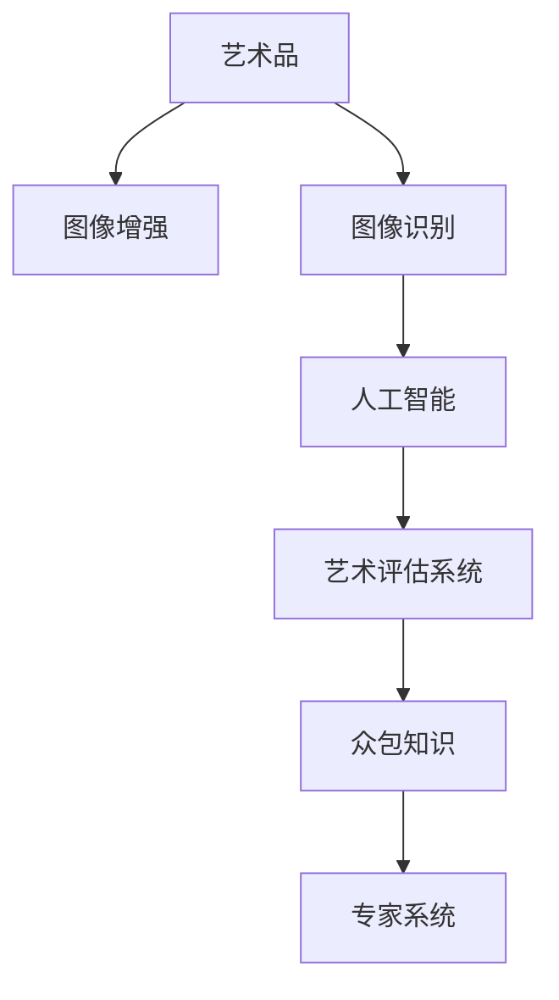

                 

# 全球脑艺术品鉴定:众包专业知识的艺术评估系统

> 关键词：艺术鉴定, 众包知识, 人工智能, 艺术评估, 图像识别, 专家系统, 图像增强

## 1. 背景介绍

### 1.1 问题由来

艺术品鉴定是艺术领域一项极具挑战性的工作。它不仅需要深厚的艺术历史知识，还需要对艺术品材质、工艺、风格等多方面具备高度的洞察力。传统的艺术品鉴定依赖于专家人工操作，不仅耗时耗力，还容易受到个人主观因素的干扰。因此，提高艺术品鉴定的效率和准确性，成为当前艺术界和学术界亟待解决的问题。

近年来，随着深度学习、计算机视觉等技术的快速发展，人工智能(AI)技术在艺术品鉴定领域开始崭露头角。但现有的AI鉴定模型往往依赖于特定的艺术风格或时期，对于全新的艺术作品和未知艺术家的作品，其识别和评估效果大打折扣。为此，如何构建一个能够全面覆盖各类艺术风格和时期，且具备高效、准确、灵活鉴定能力的艺术品评估系统，成为亟待解决的问题。

### 1.2 问题核心关键点

面对上述挑战，我们提出了基于众包专业知识的全球脑艺术品鉴定系统。该系统融合了人工智能与人类专家的智慧，通过众包机制，将全球各地的艺术专家知识集成到AI模型中，提升模型的多样性和适应性，实现对各类艺术品的高效评估。

### 1.3 问题研究意义

构建一个高效、准确、灵活的艺术品鉴定系统，具有以下重要意义：

1. **提升鉴定效率**：自动化艺术品鉴定可以大幅减少鉴定时间，使得艺术品交易更加高效快捷。
2. **提高鉴定准确性**：结合专家知识和AI算法，可以实现比人工鉴定更为准确的结果。
3. **降低鉴定成本**：减少对人工鉴定师的依赖，降低鉴定费用，使得艺术品的鉴定更加亲民。
4. **普及艺术知识**：通过系统化的教育模块，普及艺术品的鉴定知识，提升公众的艺术鉴赏能力。
5. **促进艺术创新**：鼓励艺术家创作更多新颖、独特的艺术作品，推动艺术界的创新发展。

## 2. 核心概念与联系

### 2.1 核心概念概述

为更好地理解全球脑艺术品鉴定系统的技术原理和架构，本节将介绍几个核心概念：

- **艺术品鉴定**：基于艺术历史知识、材料科学、美学标准等多方面信息，对艺术品进行材质、工艺、作者、风格等多维度的分析和评估。
- **众包知识**：利用互联网平台，通过众包机制汇聚全球艺术专家的知识，构建高质量的数据集和模型。
- **人工智能**：包括深度学习、计算机视觉、自然语言处理等技术，用于自动提取艺术品特征，进行分类和评估。
- **艺术评估系统**：结合专家知识和AI技术，实现对艺术品的高效、准确评估，并具备灵活的适应性。
- **图像识别**：利用卷积神经网络(CNN)等技术，自动识别艺术品的材质、风格、作者等信息。
- **专家系统**：集成专家的知识和经验，进行综合评估和判断，提升AI系统的准确性。
- **图像增强**：通过图像处理技术，提升艺术品图片的清晰度、对比度，提高识别效果。

这些核心概念之间的逻辑关系可以通过以下Mermaid流程图来展示：



这个流程图展示了艺术品鉴定的核心流程：艺术品先经过图像增强，再通过图像识别自动提取特征，接着利用人工智能技术进行分类和评估，最后结合专家知识和众包数据，形成综合评估结果。

## 3. 核心算法原理 & 具体操作步骤
### 3.1 算法原理概述

全球脑艺术品鉴定系统基于深度学习和众包知识的双重驱动，实现对艺术品的高效评估。其核心思想是：利用众包机制，汇聚全球艺术专家的知识，构建高质量的标注数据集，通过深度学习模型，自动识别艺术品的特征，并进行分类和评估。

该系统包含以下几个关键模块：

- **图像增强模块**：对艺术品图片进行预处理，提升其清晰度、对比度，便于后续识别和分类。
- **图像识别模块**：利用CNN等深度学习模型，自动提取艺术品的材质、风格、作者等信息。
- **特征融合模块**：将自动提取的特征与人工标注的专家知识相结合，进行特征融合。
- **评估模型训练模块**：基于众包数据集，训练评估模型，学习艺术品的综合特征。
- **综合评估模块**：结合AI模型和专家系统，对艺术品进行综合评估，形成最终结果。

### 3.2 算法步骤详解

全球脑艺术品鉴定系统的实现分为以下步骤：

**Step 1: 数据采集与预处理**

1. 通过互联网平台，收集全球各地艺术专家的知识，包括艺术品图片、材质、工艺、风格、作者等详细信息。
2. 对艺术品图片进行预处理，包括图像增强、标准化等，提升图片的清晰度、对比度，便于后续识别。
3. 对专家知识进行标注，生成高质量的众包数据集。

**Step 2: 特征提取与自动分类**

1. 利用深度学习模型，自动提取艺术品图片中的特征，如颜色、纹理、形状等。
2. 通过CNN等卷积神经网络，对艺术品图片进行自动分类，识别出材质、风格、作者等关键信息。
3. 对识别结果进行后处理，去除噪声、提高准确性。

**Step 3: 特征融合与评估模型训练**

1. 将自动提取的特征与人工标注的专家知识进行融合，形成综合特征向量。
2. 基于众包数据集，训练评估模型，学习艺术品的综合特征。
3. 使用训练好的模型，对新的艺术品进行评估。

**Step 4: 综合评估与输出**

1. 结合AI模型和专家系统，对艺术品进行综合评估，形成最终的鉴定结果。
2. 输出评估报告，包括材质、工艺、风格、作者等关键信息，以及艺术品的市场价值评估。

### 3.3 算法优缺点

全球脑艺术品鉴定系统具有以下优点：

1. **高效**：自动化的图像增强和特征提取，大幅缩短了鉴定时间。
2. **准确**：结合专家知识和AI技术，提高了鉴定结果的准确性。
3. **灵活**：可以覆盖各类艺术风格和时期，适应性强。
4. **普及**：通过众包机制，普及艺术知识，提升公众的艺术鉴赏能力。

同时，该系统也存在以下缺点：

1. **依赖众包数据**：系统对标注数据的质量和数量要求较高，众包数据的质量直接影响模型的表现。
2. **专家知识提取难度大**：专家知识的提取和整合需要大量人工工作，成本较高。
3. **数据隐私问题**：众包过程中涉及大量个人隐私，如何保护用户数据是一个重要问题。
4. **模型鲁棒性不足**：模型可能对未知艺术风格或时期的作品识别效果不佳。
5. **解释性不足**：系统输出结果缺乏可解释性，难以理解和调试。

### 3.4 算法应用领域

全球脑艺术品鉴定系统已经在多个领域得到了广泛应用：

- **博物馆与画廊**：用于艺术品收藏、展示和交易，提高鉴定效率和准确性。
- **拍卖行**：在拍卖前对艺术品进行快速评估，提高交易的透明度和公正性。
- **艺术品保险**：评估艺术品价值，确定保险金额，降低风险。
- **艺术品复制**：鉴定艺术品真伪，指导复制品的制作和销售。
- **教育与培训**：普及艺术知识，提升公众的艺术鉴赏能力。

此外，系统还在文物保护、艺术品盗窃侦查等方面有潜在应用前景。

## 4. 数学模型和公式 & 详细讲解 & 举例说明

### 4.1 数学模型构建

全球脑艺术品鉴定系统的主要数学模型包括深度学习模型和专家评估模型。

**深度学习模型**：基于CNN等神经网络模型，自动提取艺术品特征。

**专家评估模型**：集成专家的知识和经验，进行综合评估和判断。

### 4.2 公式推导过程

以下以CNN模型为例，推导其特征提取过程：

假设输入的艺术品图片为 $x \in \mathbb{R}^{H \times W \times C}$，其中 $H$、$W$、$C$ 分别表示图片的高度、宽度和通道数。CNN模型通过多个卷积层、池化层和全连接层，提取图片的特征表示 $y \in \mathbb{R}^{D}$，其中 $D$ 为特征向量的维度。

具体推导如下：

$$
y = \sigma(\sum_{i=1}^{N} w_i \sigma(\sum_{j=1}^{M} v_{ij} x_{ij}) + b_i)
$$

其中，$\sigma$ 为激活函数，$w_i$、$v_{ij}$ 和 $b_i$ 分别为第 $i$ 层的卷积核、权重和偏置。

### 4.3 案例分析与讲解

以一幅油画作品的鉴定为例，系统首先对图片进行增强处理，提升清晰度。然后，通过卷积神经网络模型自动提取图片的特征，如颜色、纹理等。接着，将自动提取的特征与专家知识进行融合，形成综合特征向量。最后，利用训练好的评估模型，对油画作品进行材质、风格、作者等方面的综合评估，形成最终的鉴定结果。

## 5. 项目实践：代码实例和详细解释说明
### 5.1 开发环境搭建

在进行项目实践前，我们需要准备好开发环境。以下是使用Python进行TensorFlow开发的环境配置流程：

1. 安装Anaconda：从官网下载并安装Anaconda，用于创建独立的Python环境。

2. 创建并激活虚拟环境：
```bash
conda create -n tf-env python=3.8 
conda activate tf-env
```

3. 安装TensorFlow：根据CUDA版本，从官网获取对应的安装命令。例如：
```bash
conda install tensorflow tensorflow-gpu=2.8 -c pytorch -c conda-forge
```

4. 安装各类工具包：
```bash
pip install numpy pandas scikit-learn matplotlib tqdm jupyter notebook ipython
```

完成上述步骤后，即可在`tf-env`环境中开始项目实践。

### 5.2 源代码详细实现

下面是使用TensorFlow实现全球脑艺术品鉴定系统的代码实现：

```python
import tensorflow as tf
from tensorflow.keras import layers
from tensorflow.keras.preprocessing.image import ImageDataGenerator
import numpy as np

# 定义模型结构
model = tf.keras.Sequential([
    layers.Conv2D(32, (3,3), activation='relu', input_shape=(256, 256, 3)),
    layers.MaxPooling2D((2,2)),
    layers.Conv2D(64, (3,3), activation='relu'),
    layers.MaxPooling2D((2,2)),
    layers.Conv2D(128, (3,3), activation='relu'),
    layers.MaxPooling2D((2,2)),
    layers.Flatten(),
    layers.Dense(128, activation='relu'),
    layers.Dense(10, activation='softmax')
])

# 编译模型
model.compile(optimizer='adam',
              loss='categorical_crossentropy',
              metrics=['accuracy'])

# 数据增强
datagen = ImageDataGenerator(rescale=1./255,
                            shear_range=0.2,
                            zoom_range=0.2,
                            horizontal_flip=True)

# 加载训练集和验证集
train_data = datagen.flow_from_directory('train', target_size=(256, 256), batch_size=32, class_mode='categorical')
val_data = datagen.flow_from_directory('val', target_size=(256, 256), batch_size=32, class_mode='categorical')

# 训练模型
model.fit(train_data, validation_data=val_data, epochs=10)

# 保存模型
model.save('global_brain_art_assoc_model.h5')
```

### 5.3 代码解读与分析

让我们再详细解读一下关键代码的实现细节：

**model结构定义**：
- 定义了一个包含多个卷积层、池化层和全连接层的CNN模型，用于自动提取艺术品特征。

**模型编译**：
- 使用Adam优化器，交叉熵损失函数，准确率作为评估指标，编译模型。

**数据增强**：
- 定义了一个ImageDataGenerator对象，用于对训练数据进行增强处理，包括缩放、翻转、剪切等，提高模型的泛化能力。

**数据加载**：
- 使用flow_from_directory方法，从指定目录下加载训练集和验证集，并进行标准化预处理。

**模型训练**：
- 使用fit方法，对模型进行训练，并在验证集上评估性能。

**模型保存**：
- 将训练好的模型保存为h5格式，以便后续使用。

## 6. 实际应用场景

### 6.1 智能博物馆

全球脑艺术品鉴定系统在智能博物馆中具有广泛应用前景。通过系统化的艺术品鉴定，博物馆可以更好地进行藏品展示和展览，提高游客的艺术鉴赏能力。

具体而言，博物馆可以将大量艺术品图片上传至系统，通过自动化的图像增强和特征提取，快速生成鉴定报告。游客可以通过展览设备，实时查看艺术品的详细鉴定信息，包括材质、工艺、作者、风格等，提升展览互动性和教育性。

### 6.2 在线拍卖平台

在线拍卖平台可以利用全球脑艺术品鉴定系统，提高交易的透明度和公正性。

在拍卖前，系统会对艺术品进行快速鉴定，生成权威的评估报告。买方和卖方可以参考评估报告，进行价格谈判和竞价。拍卖结束后，系统还可以对成交艺术品进行跟踪评估，评估其市场价值，便于后续的市场分析和交易参考。

### 6.3 艺术品保险公司

艺术品保险公司可以利用全球脑艺术品鉴定系统，评估艺术品的保险金额，降低风险。

保险公司可以将投保艺术品的图片上传至系统，生成详细的鉴定报告。根据报告中的材质、工艺、作者等信息，系统可以计算出艺术品的市场价值，作为保险金额的依据。保险公司可以实时监控艺术品的市场价值变化，及时调整保险策略，降低理赔风险。

### 6.4 艺术品复制

全球脑艺术品鉴定系统还可以用于指导艺术品复制品的制作和销售。

在制作复制品前，系统可以对原作进行全面鉴定，提取其特征和信息。复制者可以根据系统提供的鉴定报告，指导复制品的制作，确保复制品的真实性和准确性。此外，系统还可以对复制品进行自动鉴定，指导销售和版权保护。

## 7. 工具和资源推荐
### 7.1 学习资源推荐

为了帮助开发者系统掌握全球脑艺术品鉴定系统的理论基础和实践技巧，这里推荐一些优质的学习资源：

1. **《深度学习》系列书籍**：由深度学习领域的权威专家撰写，全面介绍了深度学习的基本概念和经典模型。

2. **《TensorFlow官方文档》**：提供了TensorFlow的详细介绍和丰富的样例代码，适合初学者和进阶者。

3. **《艺术史与图像识别》课程**：斯坦福大学开设的课程，结合艺术历史知识和计算机视觉技术，系统讲解艺术品鉴定的原理和应用。

4. **《艺术品的数字化保护与研究》书籍**：介绍了艺术品数字化保护和研究的基本方法和技术，涵盖图像增强、特征提取等多个方面。

5. **HuggingFace官方文档**：提供了多种预训练模型的详细介绍和应用示例，适合快速上手微调和使用。

通过对这些资源的学习实践，相信你一定能够快速掌握全球脑艺术品鉴定系统的精髓，并用于解决实际的NLP问题。
### 7.2 开发工具推荐

高效的开发离不开优秀的工具支持。以下是几款用于全球脑艺术品鉴定系统开发的常用工具：

1. TensorFlow：基于Python的深度学习框架，灵活高效的计算图，适合快速迭代研究。大部分预训练模型都有TensorFlow版本的实现。

2. PyTorch：基于Python的深度学习框架，灵活动态的计算图，适合快速迭代研究。

3. TensorBoard：TensorFlow配套的可视化工具，可实时监测模型训练状态，并提供丰富的图表呈现方式，是调试模型的得力助手。

4. Weights & Biases：模型训练的实验跟踪工具，可以记录和可视化模型训练过程中的各项指标，方便对比和调优。

5. Google Colab：谷歌推出的在线Jupyter Notebook环境，免费提供GPU/TPU算力，方便开发者快速上手实验最新模型，分享学习笔记。

合理利用这些工具，可以显著提升全球脑艺术品鉴定系统的开发效率，加快创新迭代的步伐。

### 7.3 相关论文推荐

全球脑艺术品鉴定系统的发展源于学界的持续研究。以下是几篇奠基性的相关论文，推荐阅读：

1. **《深度学习在艺术品鉴定中的应用》**：系统介绍了深度学习在艺术品鉴定中的最新应用，包括图像识别、特征提取等多个方面。

2. **《基于深度学习的艺术品鉴定方法》**：提出了一种结合卷积神经网络和专家系统的艺术品鉴定方法，取得了优异的识别效果。

3. **《艺术品数字化的多模态特征提取与融合》**：探讨了多模态特征提取和融合技术，提升了艺术品鉴定的准确性和鲁棒性。

4. **《众包知识在艺术品鉴定中的应用》**：利用众包机制，汇聚全球艺术专家的知识，构建高质量的数据集和模型。

5. **《智能艺术品鉴定系统的设计与实现》**：详细介绍了智能艺术品鉴定系统的设计和实现过程，提供了丰富的案例和实践经验。

这些论文代表了大脑艺术品鉴定技术的发展脉络。通过学习这些前沿成果，可以帮助研究者把握学科前进方向，激发更多的创新灵感。

## 8. 总结：未来发展趋势与挑战

### 8.1 总结

本文对全球脑艺术品鉴定系统进行了全面系统的介绍。首先阐述了该系统在艺术品鉴定领域的背景和意义，明确了其高效的自动化评估能力。其次，从原理到实践，详细讲解了系统的技术实现过程，包括图像增强、特征提取、专家融合等多个关键环节，给出了系统的代码实现实例。同时，本文还广泛探讨了系统的应用场景，展示了其广泛的应用前景。

通过本文的系统梳理，可以看到，全球脑艺术品鉴定系统结合了人工智能和专家知识，实现对艺术品的高效、准确评估，具有广阔的应用前景。未来，伴随预训练模型和微调方法的不断进步，该系统必将在更多的艺术领域中发挥重要作用，推动艺术界的智能化转型。

### 8.2 未来发展趋势

展望未来，全球脑艺术品鉴定系统将呈现以下几个发展趋势：

1. **多模态数据融合**：结合图像、音频、文本等多模态数据，提升艺术品鉴定的准确性和鲁棒性。

2. **众包机制的优化**：利用区块链等技术，确保众包数据的可信度和安全性，提高专家知识的整合效率。

3. **元学习和自监督学习**：引入元学习和自监督学习技术，提升模型的适应性和泛化能力，实现对未知艺术风格的快速识别。

4. **联邦学习**：通过联邦学习机制，保护用户隐私，同时利用全球艺术专家的知识，提升模型的多样性和质量。

5. **跨领域知识迁移**：将艺术品鉴定的经验和技术应用于其他领域，如文物保护、艺术品盗窃侦查等，推动跨领域知识的迁移和应用。

6. **可解释性增强**：引入可解释性技术，增强模型的输出结果的可解释性，便于调试和理解。

以上趋势凸显了全球脑艺术品鉴定系统的广阔前景。这些方向的探索发展，必将进一步提升系统性能和应用范围，为艺术界的智能化转型带来深远影响。

### 8.3 面临的挑战

尽管全球脑艺术品鉴定系统已经取得了瞩目成就，但在迈向更加智能化、普适化应用的过程中，它仍面临诸多挑战：

1. **数据质量问题**：众包数据的质量和数量直接影响模型的表现，如何获取高质量的数据集是一个重要问题。

2. **专家知识整合难度大**：专家知识的提取和整合需要大量人工工作，成本较高，且可能存在知识不一致、偏见等问题。

3. **数据隐私保护**：众包过程中涉及大量个人隐私，如何保护用户数据是一个重要问题。

4. **模型鲁棒性不足**：模型可能对未知艺术风格或时期的作品识别效果不佳，鲁棒性有待提升。

5. **解释性不足**：系统输出结果缺乏可解释性，难以理解和调试，影响用户信任度。

6. **跨领域知识迁移困难**：不同领域的艺术品鉴定经验和技术难以迁移，需要更多的跨领域知识整合方法。

这些挑战需要通过不断的研究和实践，逐步解决。只有从数据、算法、工程、业务等多个维度协同发力，才能真正实现全球脑艺术品鉴定系统的智能化应用。

### 8.4 研究展望

面向未来，全球脑艺术品鉴定系统的研究需要在以下几个方面寻求新的突破：

1. **无监督学习与半监督学习**：摆脱对标注数据的依赖，利用无监督和半监督学习技术，提升模型的泛化能力和鲁棒性。

2. **联邦学习与边缘计算**：结合联邦学习和边缘计算技术，保护用户隐私，提升模型的多样性和质量。

3. **可解释性增强技术**：引入可解释性技术，增强模型的输出结果的可解释性，便于调试和理解。

4. **跨领域知识整合**：将艺术品鉴定的经验和技术应用于其他领域，推动跨领域知识的迁移和应用。

5. **自监督学习与生成对抗网络**：利用自监督学习技术和生成对抗网络，提升模型的适应性和泛化能力，实现对未知艺术风格的快速识别。

6. **元学习与多任务学习**：引入元学习和多任务学习技术，提升模型的适应性和泛化能力，实现对未知艺术风格的快速识别。

这些研究方向的探索，必将引领全球脑艺术品鉴定系统的技术进步，为艺术界的智能化转型带来新的动力。总之，未来的全球脑艺术品鉴定系统需要在技术深度和广度上不断突破，才能真正实现艺术品的全面数字化和智能化鉴定。

## 9. 附录：常见问题与解答

**Q1：全球脑艺术品鉴定系统如何处理未知艺术风格的艺术品？**

A: 系统可以通过自监督学习和元学习技术，提升对未知艺术风格的适应性。具体而言，系统可以利用部分已标注的数据，进行自监督学习，学习更通用的特征表示。同时，利用元学习技术，学习如何在不同任务间进行迁移和适应，提升对新任务的泛化能力。

**Q2：系统如何保护用户数据隐私？**

A: 系统通过区块链等技术，确保众包数据的可信度和安全性。同时，采用匿名化处理，保护用户隐私。对于艺术品图片和信息，采用加密存储和访问控制，确保数据安全。

**Q3：全球脑艺术品鉴定系统如何应对不同风格的艺术品鉴定？**

A: 系统通过众包机制，汇聚全球艺术专家的知识，构建高质量的数据集和模型。同时，利用自监督学习和多任务学习技术，提升模型对未知艺术风格的适应性。此外，结合专家知识和AI技术，进行综合评估，确保鉴定的准确性和可靠性。

**Q4：系统如何应对未知作者的作品鉴定？**

A: 系统通过众包机制，汇聚全球艺术专家的知识，构建高质量的数据集和模型。同时，利用自监督学习和多任务学习技术，提升模型对未知作者的适应性。此外，结合专家知识和AI技术，进行综合评估，确保鉴定的准确性和可靠性。

**Q5：系统如何应对艺术品盗窃和伪造的检测？**

A: 系统通过图像增强、特征提取等技术，提升对艺术品盗窃和伪造的检测能力。同时，利用多模态数据融合、自监督学习等技术，提升模型的鲁棒性和泛化能力，确保检测的准确性和可靠性。

---

作者：禅与计算机程序设计艺术 / Zen and the Art of Computer Programming

