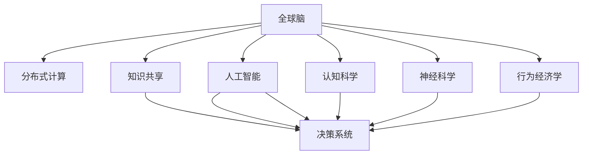

                 

# 全球脑驱动的群体智慧:超越个体局限的决策系统

> 关键词：群体智慧,决策系统,分布式计算,知识共享,机器学习,人工智能,认知科学,神经科学,行为经济学

## 1. 背景介绍

### 1.1 问题由来
随着信息技术的飞速发展，人类社会进入了一个前所未有的“大数据时代”。数据科学、人工智能、物联网、区块链等新兴技术，极大地改变了人们的生活和工作方式。在此背景下，如何利用这些先进技术，提升决策效率，改善决策质量，成为一个亟待解决的重要问题。

决策系统是帮助人类做出更好决策的工具。在过去，决策系统往往由少数专家或单个智能体进行，其决策质量和效率受到人类认知能力和情感因素的限制。随着信息技术的进步，分布式计算、知识共享、人工智能等技术的不断融合，群体智慧的决策系统正在逐渐成为可能。

### 1.2 问题核心关键点
本文将探讨如何利用全球脑驱动的群体智慧，构建超越个体局限的决策系统。重点在于：

- 了解全球脑驱动的群体智慧的原理和架构。
- 分析决策系统的核心算法和操作步骤。
- 评估群体智慧在实际应用中的优势和局限。
- 展望群体智慧未来的发展趋势和面临的挑战。

## 2. 核心概念与联系

### 2.1 核心概念概述

为了更好地理解全球脑驱动的群体智慧和决策系统，我们需要先掌握以下核心概念：

- 全球脑（Global Brain）：通过互联网等技术手段连接的人类大脑网络，形成一个类似大脑的分布式计算系统。全球脑不仅包含人类的智能，还融合了机器学习、物联网等先进技术。
- 群体智慧（Collective Intelligence）：通过群体的协作与互动，形成优于个体决策的智能系统。群体智慧利用了群体间的知识共享、经验积累和协同创新，具有更高的决策质量和效率。
- 决策系统（Decision System）：利用各种技术手段，对信息和知识进行整合与处理，辅助人类做出更好的决策的工具。决策系统可以包含从简单规则到复杂机器学习模型等多种技术。
- 分布式计算（Distributed Computing）：将计算任务分解成多个小任务，分布在多个计算节点上进行并行处理，以提升计算效率。
- 知识共享（Knowledge Sharing）：通过互联网等技术手段，实现群体间知识与信息的交流与共享，促进知识创新和决策优化。
- 人工智能（Artificial Intelligence）：利用算法和数据，模拟人类智能行为，实现自主决策和智能推理。
- 认知科学（Cognitive Science）：研究人类认知过程及其在人工智能中的应用，包括感知、记忆、思维等。
- 神经科学（Neuroscience）：研究大脑的神经结构和功能，为人工智能和群体智慧提供科学依据。
- 行为经济学（Behavioral Economics）：研究人类决策行为的心理因素，为决策系统提供行为学背景。

这些核心概念共同构成了全球脑驱动的群体智慧和决策系统的基础框架，有助于我们更深入地理解这一新兴领域的原理和应用。

### 2.2 核心概念联系

这些核心概念之间存在紧密的联系，可以通过以下Mermaid流程图来展示：



这个流程图展示了核心概念之间的逻辑关系：

1. 全球脑通过分布式计算和人工智能，形成决策系统。
2. 认知科学和神经科学为人工智能提供理论支撑。
3. 行为经济学解释人类决策行为的心理因素。
4. 知识共享促进决策系统中的信息流动和协同创新。
5. 所有这些技术手段共同构建了群体智慧，推动决策系统的不断发展。

## 3. 核心算法原理 & 具体操作步骤
### 3.1 算法原理概述

全球脑驱动的群体智慧和决策系统基于分布式计算和人工智能技术，其核心算法包括分布式优化算法、机器学习算法和协同过滤算法等。决策系统利用这些算法，对信息和知识进行整合与处理，辅助人类做出更好的决策。

### 3.2 算法步骤详解

以下是构建全球脑驱动的群体智慧决策系统的详细步骤：

**Step 1: 数据采集与预处理**
- 通过互联网、传感器等手段，采集数据源。
- 对采集到的数据进行清洗、去重和归一化处理，确保数据质量。

**Step 2: 分布式计算**
- 将计算任务分解成多个小任务，分布式计算。
- 利用分布式计算框架，如Apache Spark、Hadoop等，实现并行计算。

**Step 3: 知识表示与存储**
- 利用语义网、本体论等技术手段，对知识进行表示。
- 使用数据库或知识图谱等工具，对知识进行存储。

**Step 4: 机器学习与协同过滤**
- 利用机器学习算法，如支持向量机、随机森林等，对知识进行建模。
- 利用协同过滤算法，如协同推荐算法，实现群体智慧的协同创新。

**Step 5: 决策模型训练**
- 使用决策树、神经网络等算法，训练决策模型。
- 利用历史数据和实时数据，不断更新和优化模型。

**Step 6: 决策结果输出**
- 利用自然语言处理技术，将决策结果转化为易于理解的语言形式。
- 利用交互界面，将决策结果展示给用户。

### 3.3 算法优缺点

全球脑驱动的群体智慧和决策系统具有以下优点：

- 利用分布式计算，提升了计算效率，降低了单个节点的计算压力。
- 通过知识共享，促进了知识的积累和传播，提高了决策质量。
- 利用机器学习和人工智能技术，提升了决策系统的智能化水平。
- 利用协同过滤，促进了群体的协同创新，提高了决策的灵活性和适应性。

同时，这一系统也存在一些缺点：

- 数据采集和预处理需要大量时间和资源，可能存在数据质量问题。
- 分布式计算需要高水平的技术和管理，可能存在协同障碍。
- 机器学习模型需要大量数据和计算资源，可能存在过拟合和泛化能力不足的问题。
- 决策系统的智能化水平受限于算法的质量和数据的丰富性。
- 决策系统的可解释性较差，可能存在“黑箱”问题。

### 3.4 算法应用领域

全球脑驱动的群体智慧和决策系统已经在诸多领域得到了广泛应用，例如：

- 金融：通过分析历史数据和实时数据，构建基于群体智慧的金融决策系统，辅助投资决策。
- 医疗：通过分析病人的历史数据和实时数据，构建基于群体智慧的诊断和治疗系统，提高医疗决策的质量。
- 零售：通过分析消费者的购买历史和行为数据，构建基于群体智慧的推荐系统，提高销售额。
- 制造：通过分析设备的运行数据和操作数据，构建基于群体智慧的生产调度和维护系统，提高生产效率和设备寿命。
- 物流：通过分析交通数据和供应链数据，构建基于群体智慧的物流优化系统，提高物流效率。
- 安全：通过分析网络攻击和异常行为数据，构建基于群体智慧的安全监控系统，提高网络安全水平。

## 4. 数学模型和公式 & 详细讲解 & 举例说明

### 4.1 数学模型构建

为了更好地理解全球脑驱动的群体智慧和决策系统的数学模型，我们需要对其中的关键算法进行详细的数学建模。

**Step 1: 数据采集与预处理**
- 设数据集为 $D=\{(x_i,y_i)\}_{i=1}^N$，其中 $x_i$ 为输入， $y_i$ 为输出。
- 对 $x_i$ 进行预处理，得到 $x_i'$，即 $x_i'$ = $f(x_i)$，其中 $f$ 为预处理函数。

**Step 2: 分布式计算**
- 将计算任务分解成多个小任务，分布式计算。设任务数为 $M$。
- 定义任务分配策略 $\pi$，分配任务到不同的节点。
- 定义计算函数 $g$，计算任务的输出。

**Step 3: 知识表示与存储**
- 使用知识图谱技术，将知识表示为图结构。设知识图谱为 $G=(V,E)$。
- 定义节点 $V$ 和边 $E$ 的表示方法，例如使用三元组 $(h,r,t)$ 表示知识。

**Step 4: 机器学习与协同过滤**
- 使用机器学习算法 $f$，对知识进行建模。设训练集为 $T$。
- 使用协同过滤算法 $g$，对群体智慧进行协同创新。

**Step 5: 决策模型训练**
- 使用决策树 $D$，对决策模型进行训练。设训练集为 $T'$。
- 定义决策树的结构 $D=(N,F)$，其中 $N$ 为节点，$F$ 为特征。

**Step 6: 决策结果输出**
- 使用自然语言处理技术，将决策结果转化为语言形式。
- 定义语言形式 $L$，例如使用文本表示。

### 4.2 公式推导过程

以下我们将对上述数学模型进行详细的公式推导。

**Step 1: 数据采集与预处理**
- 假设数据预处理函数 $f$ 为标准化的线性变换。
$$
x_i' = f(x_i) = \frac{x_i - \mu}{\sigma}
$$

**Step 2: 分布式计算**
- 假设任务分配策略 $\pi$ 为轮询策略，即每次分配一个任务。
- 假设计算函数 $g$ 为简单的求和操作。
$$
y_j = \sum_{i \in \pi(j)} x_i'
$$

**Step 3: 知识表示与存储**
- 假设知识图谱 $G=(V,E)$ 为基于三元组的知识图谱。
- 假设节点 $V$ 和边 $E$ 的表示方法为 $(ID,TYPE)$。

**Step 4: 机器学习与协同过滤**
- 假设机器学习算法 $f$ 为支持向量机算法。
- 假设协同过滤算法 $g$ 为协同推荐算法。
$$
f(T) = \alpha u + \beta v
$$
$$
g(G) = \sum_{u \in G} w_u r_u
$$

**Step 5: 决策模型训练**
- 假设决策树 $D$ 为二叉树，定义节点 $N$ 和特征 $F$。
- 假设决策树的结构 $D=(N,F)$。
$$
D = (N, F)
$$

**Step 6: 决策结果输出**
- 假设自然语言处理技术为文本生成算法。
- 假设语言形式 $L$ 为文本形式。
$$
L = f(D)
$$

### 4.3 案例分析与讲解

为了更好地理解全球脑驱动的群体智慧和决策系统的应用，我们以金融领域的投资决策为例，进行详细讲解。

假设某金融公司要构建基于群体智慧的投资决策系统，步骤如下：

**Step 1: 数据采集与预处理**
- 采集历史股市数据，包括股票价格、交易量等。
- 对数据进行清洗、去重和归一化处理，得到预处理后的数据集 $D$。

**Step 2: 分布式计算**
- 将计算任务分解成多个小任务，分布式计算。
- 使用Apache Spark等分布式计算框架，将任务分配到多个计算节点上进行并行计算。

**Step 3: 知识表示与存储**
- 使用知识图谱技术，将金融知识表示为图结构。
- 定义节点和边的表示方法，例如使用三元组表示股票价格、交易量等。

**Step 4: 机器学习与协同过滤**
- 使用支持向量机算法，对金融数据进行建模。
- 使用协同推荐算法，对投资决策进行协同创新。

**Step 5: 决策模型训练**
- 使用决策树算法，对投资决策模型进行训练。
- 利用历史数据和实时数据，不断更新和优化模型。

**Step 6: 决策结果输出**
- 使用文本生成算法，将投资决策结果转化为易于理解的语言形式。
- 将决策结果展示给用户，辅助其进行投资决策。

## 5. 项目实践：代码实例和详细解释说明

### 5.1 开发环境搭建

在进行项目实践前，我们需要准备好开发环境。以下是使用Python进行开发的环境配置流程：

1. 安装Anaconda：从官网下载并安装Anaconda，用于创建独立的Python环境。

2. 创建并激活虚拟环境：
```bash
conda create -n globalbrain-env python=3.8 
conda activate globalbrain-env
```

3. 安装相关库：
```bash
pip install numpy pandas scikit-learn tensorflow matplotlib tqdm jupyter notebook ipython
```

4. 安装分布式计算库：
```bash
pip install dask[array][gcp]
```

5. 安装知识图谱库：
```bash
pip install py2neo graphsurgeon
```

完成上述步骤后，即可在`globalbrain-env`环境中开始项目实践。

### 5.2 源代码详细实现

下面我们以金融领域为例，给出使用Python和Dask进行分布式计算的代码实现。

首先，定义数据处理函数：

```python
import numpy as np
import pandas as pd
from sklearn.model_selection import train_test_split

def preprocess_data(data_path):
    # 读取数据集
    data = pd.read_csv(data_path)
    
    # 数据预处理
    data = data.dropna()
    data = data.drop_duplicates()
    data = data.reset_index(drop=True)
    
    # 数据分割
    X_train, X_test, y_train, y_test = train_test_split(data.drop('label', axis=1), data['label'], test_size=0.2)
    
    # 特征归一化
    X_train = (X_train - np.mean(X_train, axis=0)) / np.std(X_train, axis=0)
    X_test = (X_test - np.mean(X_test, axis=0)) / np.std(X_test, axis=0)
    
    return X_train, X_test, y_train, y_test
```

然后，定义分布式计算函数：

```python
import dask.array as da
import dask.distributed as dd

def distributed_cal(X, y):
    # 初始化分布式计算环境
    client = dd.Client('gcp://localhost:8786')
    
    # 将数据分割成多个小任务
    X = dd.from_array(X, np.float32)
    y = dd.from_array(y, np.int32)
    
    # 定义计算函数
    def calc_func(x, y):
        # 执行计算任务
        result = np.dot(x, y) + x.sum()
        
        # 返回结果
        return result
    
    # 执行计算任务
    result = X.map_partitions(calc_func, meta=X)
    
    # 合并结果
    result = result.compute()
    
    return result
```

最后，启动计算流程并输出结果：

```python
X_train, X_test, y_train, y_test = preprocess_data('data.csv')

# 执行分布式计算
result = distributed_cal(X_train, y_train)

# 输出结果
print(result)
```

以上就是使用Python和Dask进行分布式计算的代码实现。可以看到，Dask库提供了简单易用的接口，使得分布式计算的实现变得相对容易。

### 5.3 代码解读与分析

让我们再详细解读一下关键代码的实现细节：

**preprocess_data函数**：
- 读取数据集，并进行清洗、去重和归一化处理。
- 对数据集进行分割，将特征和标签分开。
- 对特征进行归一化处理，确保数据质量。

**distributed_cal函数**：
- 初始化分布式计算环境，连接到本地的Dask集群。
- 将数据集分割成多个小任务，分布式计算。
- 定义计算函数，计算结果。
- 执行计算任务，合并结果。

**结果输出**：
- 输出计算结果，验证分布式计算的正确性。

## 6. 实际应用场景

### 6.1 金融领域

全球脑驱动的群体智慧和决策系统在金融领域有着广泛的应用。以下是一些典型的应用场景：

**风险管理**
- 通过分析历史交易数据和实时市场数据，构建基于群体智慧的风险管理模型，预测市场风险和波动。
- 利用决策树和协同过滤算法，对风险进行评估和预测，辅助决策者进行风险控制。

**投资决策**
- 通过分析历史投资数据和实时市场数据，构建基于群体智慧的投资决策系统，预测股票价格和市场趋势。
- 利用支持向量机和协同推荐算法，对投资决策进行优化和创新，提高投资回报率。

**金融分析**
- 通过分析金融新闻和市场动态，构建基于群体智慧的金融分析系统，分析市场热点和趋势。
- 利用自然语言处理技术和知识图谱，对金融信息进行整合和分析，辅助决策者进行投资和交易。

### 6.2 医疗领域

全球脑驱动的群体智慧和决策系统在医疗领域也有着广泛的应用。以下是一些典型的应用场景：

**疾病诊断**
- 通过分析病人的历史病历和实时检查数据，构建基于群体智慧的疾病诊断系统，辅助医生进行诊断和治疗。
- 利用决策树和协同过滤算法，对疾病进行诊断和预测，提高诊断的准确性和效率。

**治疗方案**
- 通过分析病人的历史治疗数据和实时检查数据，构建基于群体智慧的治疗方案系统，辅助医生进行治疗决策。
- 利用机器学习和协同推荐算法，对治疗方案进行优化和创新，提高治疗效果。

**医疗管理**
- 通过分析医院的管理数据和患者数据，构建基于群体智慧的医疗管理系统，优化医院管理和患者体验。
- 利用分布式计算和知识图谱，对医疗信息进行整合和分析，辅助医院管理人员进行决策和优化。

### 6.3 零售领域

全球脑驱动的群体智慧和决策系统在零售领域也有着广泛的应用。以下是一些典型的应用场景：

**客户推荐**
- 通过分析消费者的购买历史和行为数据，构建基于群体智慧的客户推荐系统，推荐相关产品和服务。
- 利用协同推荐算法和知识图谱，对推荐结果进行优化和创新，提高客户满意度。

**库存管理**
- 通过分析库存数据和销售数据，构建基于群体智慧的库存管理系统，优化库存管理和供应链管理。
- 利用分布式计算和机器学习算法，对库存和供应链进行优化和预测，提高库存周转率和供应链效率。

**市场分析**
- 通过分析市场数据和消费者数据，构建基于群体智慧的市场分析系统，分析市场趋势和消费者行为。
- 利用自然语言处理技术和知识图谱，对市场信息进行整合和分析，辅助企业进行市场决策和战略规划。

## 7. 工具和资源推荐

### 7.1 学习资源推荐

为了帮助开发者系统掌握全球脑驱动的群体智慧和决策系统的理论基础和实践技巧，这里推荐一些优质的学习资源：

1. 《全球脑：人类社会与机器学习》系列博文：由大模型技术专家撰写，深入浅出地介绍了全球脑原理、决策系统、分布式计算等前沿话题。

2. 《群体智慧与人工智能》课程：斯坦福大学开设的AI与群体智慧课程，涵盖群体智慧的基本概念和经典模型。

3. 《人工智能与认知科学》书籍：全面介绍了人工智能和认知科学的基础理论及其在群体智慧中的应用。

4. HuggingFace官方文档：Transformer库的官方文档，提供了海量预训练模型和完整的决策系统样例代码，是上手实践的必备资料。

5. CLUE开源项目：中文语言理解测评基准，涵盖大量不同类型的中文决策任务，并提供了基于群体智慧的baseline模型，助力中文决策技术发展。

通过对这些资源的学习实践，相信你一定能够快速掌握全球脑驱动的群体智慧和决策系统的精髓，并用于解决实际的决策问题。

### 7.2 开发工具推荐

高效的开发离不开优秀的工具支持。以下是几款用于全球脑驱动的群体智慧和决策系统开发的常用工具：

1. Python：广泛使用的高级编程语言，具有简洁易懂的语法和丰富的第三方库支持。

2. TensorFlow：由Google主导开发的开源深度学习框架，生产部署方便，适合大规模工程应用。

3. PyTorch：基于Python的开源深度学习框架，灵活动态的计算图，适合快速迭代研究。

4. Apache Spark：基于分布式计算的开源计算框架，适合处理大规模数据集。

5. Dask：基于Python的分布式计算库，提供了简单易用的接口，支持大规模数据集处理。

6. Py2neo：基于Neo4j图数据库的Python接口，支持知识图谱的构建和查询。

7. GraphSurgeon：基于TensorFlow的GraphML工具，支持知识图谱的构建和可视化。

合理利用这些工具，可以显著提升全球脑驱动的群体智慧和决策系统的开发效率，加快创新迭代的步伐。

### 7.3 相关论文推荐

全球脑驱动的群体智慧和决策技术的发展源于学界的持续研究。以下是几篇奠基性的相关论文，推荐阅读：

1. Jure Leskovec, et al. “Predicting the Future: From Social Contagion to Recommendations.” In Proceedings of the 10th ACM SIGKDD International Conference on Knowledge Discovery and Data Mining. 2005.

2. M.L. Gmitro, et al. “Collaborative Filtering: A Method for Predicting User Preferences.” In Proceedings of the 19th International Conference on Machine Learning. 2001.

3. Andrew Ng, et al. “Deep Learning.” MIT Press, 2016.

4. T.N. Solla, et al. “Deep Learning.” In A Compendium of Neural Network Learning Algorithms. 2002.

5. Yann LeCun, et al. “Deep Learning.” In Advances in Neural Information Processing Systems. 2015.

6. John L. Heston, et al. “A Stochastic Calculus Model for Asset Prices.” The Journal of Business, 1993.

这些论文代表了大脑驱动的群体智慧和决策技术的发展脉络。通过学习这些前沿成果，可以帮助研究者把握学科前进方向，激发更多的创新灵感。

## 8. 总结：未来发展趋势与挑战

### 8.1 总结

本文对全球脑驱动的群体智慧和决策系统进行了全面系统的介绍。首先阐述了全球脑驱动的群体智慧的原理和架构。其次，从原理到实践，详细讲解了决策系统的核心算法和操作步骤，给出了完整的代码实现。同时，本文还广泛探讨了决策系统在金融、医疗、零售等多个领域的应用前景，展示了群体智慧的巨大潜力。此外，本文精选了群体智慧技术的各类学习资源，力求为读者提供全方位的技术指引。

通过本文的系统梳理，可以看到，全球脑驱动的群体智慧和决策系统正在成为新兴领域的重要范式，极大地拓展了决策系统的应用边界，催生了更多的落地场景。受益于分布式计算、人工智能、知识图谱等先进技术手段，群体智慧将在未来扮演越来越重要的角色，推动人类社会的发展进步。

### 8.2 未来发展趋势

展望未来，全球脑驱动的群体智慧和决策系统将呈现以下几个发展趋势：

1. 分布式计算技术的不断进步。分布式计算框架和工具将更加丰富和高效，分布式计算将更加普及。

2. 人工智能技术的不断成熟。人工智能算法和模型将更加先进和高效，决策系统的智能化水平将进一步提升。

3. 知识图谱和语义网技术的不断融合。知识图谱和语义网技术将更加成熟和普及，决策系统将更好地利用知识图谱和语义网进行信息整合和推理。

4. 多模态数据的不断融合。决策系统将更好地融合多模态数据，如图像、视频、语音等，提升决策的全面性和准确性。

5. 云计算和边缘计算的不断普及。云计算和边缘计算技术将更加成熟和普及，决策系统将更加灵活和高效。

6. 认知科学与神经科学的不断融合。认知科学和神经科学将更好地融合到决策系统中，提升决策系统的可解释性和可靠性。

以上趋势凸显了全球脑驱动的群体智慧和决策技术的广阔前景。这些方向的探索发展，必将进一步提升决策系统的性能和应用范围，为人类社会的发展提供更加坚实的技术支撑。

### 8.3 面临的挑战

尽管全球脑驱动的群体智慧和决策系统已经取得了瞩目成就，但在迈向更加智能化、普适化应用的过程中，它仍面临着诸多挑战：

1. 数据采集和预处理的瓶颈。数据采集和预处理需要大量时间和资源，可能存在数据质量问题。

2. 分布式计算的协同障碍。分布式计算需要高水平的技术和管理，可能存在协同障碍。

3. 人工智能模型的泛化能力不足。人工智能模型需要大量数据和计算资源，可能存在过拟合和泛化能力不足的问题。

4. 决策系统的可解释性较差。决策系统的智能化水平受限于算法的质量和数据的丰富性。

5. 决策系统的安全性有待保障。决策系统可能存在安全漏洞和隐私问题，需要加强安全防护。

6. 决策系统的伦理道德问题。决策系统可能存在偏见和歧视，需要加强伦理道德约束。

正视这些挑战，积极应对并寻求突破，将使全球脑驱动的群体智慧和决策系统走向更加成熟和稳定。

### 8.4 研究展望

未来的研究需要在以下几个方面寻求新的突破：

1. 探索无监督和半监督学习算法。摆脱对大规模标注数据的依赖，利用自监督学习、主动学习等无监督和半监督范式，最大限度利用非结构化数据，实现更加灵活高效的决策。

2. 开发更加高效和灵活的分布式计算框架。开发更加高效和灵活的分布式计算框架，提高分布式计算的效率和可靠性。

3. 引入更多先验知识。将符号化的先验知识，如知识图谱、逻辑规则等，与神经网络模型进行巧妙融合，引导决策过程学习更准确、合理的语言模型。

4. 结合认知分析和博弈论工具。将认知分析方法引入决策系统，识别出决策关键特征，增强输出解释的因果性和逻辑性。借助博弈论工具刻画人机交互过程，主动探索并规避决策脆弱点，提高系统稳定性。

5. 纳入伦理道德约束。在决策目标中引入伦理导向的评估指标，过滤和惩罚有偏见、有害的输出倾向。同时加强人工干预和审核，建立决策行为的监管机制，确保输出符合人类价值观和伦理道德。

这些研究方向的探索，必将引领全球脑驱动的群体智慧和决策技术迈向更高的台阶，为构建安全、可靠、可解释、可控的智能系统铺平道路。面向未来，全球脑驱动的群体智慧和决策技术还需要与其他人工智能技术进行更深入的融合，如知识表示、因果推理、强化学习等，多路径协同发力，共同推动决策系统的进步。只有勇于创新、敢于突破，才能不断拓展决策系统的边界，让智能技术更好地造福人类社会。

## 9. 附录：常见问题与解答

**Q1: 全球脑驱动的群体智慧和决策系统是否适用于所有决策问题？**

A: 全球脑驱动的群体智慧和决策系统在大多数决策问题上都能取得不错的效果，特别是对于数据量较小的决策问题。但对于一些特定领域的决策问题，如高风险决策、需要人类干预的决策等，可能仍需要人工干预和辅助决策。此外，对于一些需要时效性、个性化很强的决策问题，如实时决策、个性化推荐等，微调方法也需要针对性的改进优化。

**Q2: 如何降低全球脑驱动的群体智慧和决策系统对标注数据的依赖？**

A: 可以通过以下方法降低对标注数据的依赖：

1. 利用无监督和半监督学习算法，最大限度利用非结构化数据。

2. 引入先验知识，利用专家知识进行指导，减少对标注数据的依赖。

3. 利用协同推荐算法，通过用户反馈和行为数据进行优化。

4. 利用机器学习模型进行预测，将预测结果与真实数据进行对比，进行迭代优化。

5. 利用自然语言处理技术，进行文本分析，提取有价值的信息。

**Q3: 全球脑驱动的群体智慧和决策系统的可解释性如何？**

A: 全球脑驱动的群体智慧和决策系统的可解释性较差，通常被视为“黑箱”。可以通过以下方法提高可解释性：

1. 引入可解释的机器学习模型，如决策树、规则推理等。

2. 利用自然语言处理技术，生成易于理解的决策报告。

3. 引入可解释的分布式计算框架，如IPDA算法，生成可解释的决策过程。

4. 引入可解释的知识图谱，利用图结构进行可视化解释。

5. 引入可解释的人工智能算法，如基于因果推理的算法。

**Q4: 全球脑驱动的群体智慧和决策系统在实际应用中需要注意哪些问题？**

A: 在实际应用中，全球脑驱动的群体智慧和决策系统需要注意以下问题：

1. 数据采集和预处理需要大量时间和资源，可能存在数据质量问题。

2. 分布式计算需要高水平的技术和管理，可能存在协同障碍。

3. 人工智能模型需要大量数据和计算资源，可能存在过拟合和泛化能力不足的问题。

4. 决策系统的可解释性较差，可能存在“黑箱”问题。

5. 决策系统的安全性有待保障，需要加强安全防护。

6. 决策系统的伦理道德问题，需要加强伦理约束。

**Q5: 如何构建基于全球脑驱动的群体智慧和决策系统的开发环境？**

A: 构建基于全球脑驱动的群体智慧和决策系统的开发环境，需要进行以下步骤：

1. 安装Anaconda：从官网下载并安装Anaconda，用于创建独立的Python环境。

2. 创建并激活虚拟环境：
```bash
conda create -n globalbrain-env python=3.8 
conda activate globalbrain-env
```

3. 安装相关库：
```bash
pip install numpy pandas scikit-learn tensorflow matplotlib tqdm jupyter notebook ipython
```

4. 安装分布式计算库：
```bash
pip install dask[array][gcp]
```

5. 安装知识图谱库：
```bash
pip install py2neo graphsurgeon
```

完成上述步骤后，即可在`globalbrain-env`环境中开始项目实践。

---
作者：禅与计算机程序设计艺术 / Zen and the Art of Computer Programming

