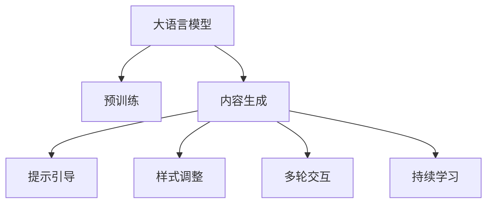

                 

# 写作伙伴：LLM 助力内容生成

## 1. 背景介绍

随着人工智能技术的迅猛发展，语言模型（Language Model，简称LM）在自然语言处理（NLP）领域取得了重大突破。特别是在生成式大模型（Large Language Model，简称LLM）问世之后，LLM不仅在文本理解、翻译等方面表现出色，更在内容生成方面展现出惊人的潜力。诸如OpenAI的GPT-3等模型已经展现出可以生成高质量的文本内容，甚至能够创作诗歌、小说、新闻报道等作品。

### 1.1 问题由来

传统的内容生成依赖于人工编写或机器自动生成的模板和规则。但这些方法存在诸多限制，如需要大量的人力编写规则、生成内容形式单一、难以适应变化多端的语境和文体等。而基于LLM的内容生成方法，通过学习海量文本数据，可以在无需人工干预的情况下，快速生成丰富多样的文本内容，极大地降低了内容生产的成本和复杂度。

### 1.2 问题核心关键点

大语言模型内容生成的核心在于其强大的语言理解和生成能力。通过预训练在大规模无标签文本语料上，LLM学习到了丰富的语言知识和表达能力，能够自动理解语义和上下文，生成符合语境的文本内容。此外，LLM在生成过程中还可以通过提示（Prompt）、样式调整（Style Transfer）、多轮交互（Multitasking）等技术手段，提升内容生成的多样性和自然度。

## 2. 核心概念与联系

### 2.1 核心概念概述

为更好地理解LLM在内容生成中的应用，本节将介绍几个关键概念：

- 大语言模型（Large Language Model, LLM）：以自回归或自编码模型为代表的大规模预训练语言模型。通过在大规模无标签文本语料上进行预训练，学习到通用的语言表示，具备强大的语言理解和生成能力。

- 预训练（Pre-training）：指在大规模无标签文本语料上，通过自监督学习任务训练通用语言模型的过程。常见的预训练任务包括言语建模、遮挡语言模型等。预训练使得模型学习到语言的通用表示。

- 内容生成（Content Generation）：通过大语言模型生成符合特定风格、语境或用途的文本内容，如新闻报道、文学作品、对话系统回复等。

- 提示（Prompt）：向大语言模型提供的引导信息，包括文本的开头、话题、样式要求等，帮助模型理解生成任务的背景和要求。

- 样式调整（Style Transfer）：调整LLM生成的文本内容风格，如改变句式、语气、时态等，使内容符合特定的文体需求。

- 多轮交互（Multitasking）：在生成任务中，LLM可以接受多轮输入，根据前一轮输出继续生成后续内容，实现更复杂、连贯的文本生成。

- 持续学习（Continual Learning）：LLM能够持续从新数据中学习，同时保持已学习的知识，避免遗忘，提升生成内容的时效性和适应性。

这些概念共同构成了LLM在内容生成中的应用框架，使其能够灵活生成各类文本内容。

### 2.2 核心概念原理和架构的 Mermaid 流程图



这个流程图展示了LLM在内容生成中的主要过程：

1. 大语言模型通过预训练获得语言基础表示。
2. 在内容生成任务中，模型利用提示信息，理解生成要求。
3. 根据样式调整，生成符合特定文体要求的内容。
4. 通过多轮交互，生成连贯、复杂的文本内容。
5. 持续学习新数据，保持生成内容的实时性和适应性。

## 3. 核心算法原理 & 具体操作步骤
### 3.1 算法原理概述

基于LLM的内容生成，本质上是一个序列到序列的生成过程。其核心思想是：将大语言模型视作一个强大的"文本生成器"，通过提示（Prompt）引导，对特定任务进行生成。

形式化地，假设预训练语言模型为 $M_{\theta}$，其中 $\theta$ 为预训练得到的模型参数。给定生成任务 $T$ 的提示信息 $P$，LLM的内容生成过程可以表示为：

$$
G_{\theta}(P) = \text{argmax} \left \{ p(M_{\theta}(\cdot); P) \right \}
$$

其中 $p$ 为文本生成概率，$G_{\theta}$ 为生成函数，$\cdot$ 表示输入文本。

目标是最小化生成文本与任务要求的差异，即：

$$
\theta^* = \mathop{\arg\min}_{\theta} \mathcal{L}(G_{\theta}, P)
$$

其中 $\mathcal{L}$ 为任务要求的损失函数，$\mathcal{L}(G_{\theta}, P) = \left| G_{\theta}(P) - Y \right|^2$，$Y$ 为理想生成的文本内容。

### 3.2 算法步骤详解

基于LLM的内容生成一般包括以下几个关键步骤：

**Step 1: 准备预训练模型和任务提示**
- 选择合适的预训练语言模型 $M_{\theta}$ 作为初始化参数，如 GPT-3、BERT 等。
- 设计合理的提示信息 $P$，明确生成任务的要求和目标。

**Step 2: 设置生成超参数**
- 选择合适的优化算法及其参数，如 Adam、SGD 等，设置学习率、批大小、迭代轮数等。
- 设置正则化技术及强度，包括权重衰减、Dropout、Early Stopping 等。
- 确定冻结预训练参数的策略，如仅微调顶层，或全部参数都参与生成。

**Step 3: 执行生成任务**
- 将提示信息 $P$ 输入模型，前向传播计算生成概率。
- 反向传播计算参数梯度，根据设定的优化算法和学习率更新模型参数。
- 周期性在验证集上评估模型性能，根据性能指标决定是否触发 Early Stopping。
- 重复上述步骤直到满足预设的迭代轮数或 Early Stopping 条件。

**Step 4: 生成并评估结果**
- 使用微调后的模型对新提示进行生成。
- 根据生成结果和任务要求，评估生成文本的质量和相关性。

### 3.3 算法优缺点

基于LLM的内容生成方法具有以下优点：
1. 灵活性高。可以生成各种类型的文本，如新闻、故事、诗歌等，甚至可以实现多模态内容生成。
2. 成本低。无需人工编写规则，生成内容数量和速度不受限制。
3. 适用性广。适用于多种语言和风格，无需针对每种任务单独设计规则。
4. 更新快。可以随时根据最新数据和新需求调整模型，生成内容紧跟时代。

同时，该方法也存在一定的局限性：
1. 生成质量受提示信息影响大。提示信息的表达能力和设计质量，直接影响生成文本的连贯性和准确性。
2. 生成文本多样性有限。虽然LLM能生成多样化内容，但在特定任务上的生成风格和语言模式仍需人为引导。
3. 生成过程需参数调优。生成过程涉及多种超参数设置，需要较多的实验调优。
4. 生成内容仍需后期编辑。生成文本虽自然流畅，但仍需人工审核和修改，以确保内容质量和合规性。

尽管存在这些局限性，但LLM在内容生成领域展现了巨大的潜力，成为了许多NLP应用的重要工具。未来相关研究将继续探索如何提升提示设计、优化生成模型、增强生成文本质量等方向。

### 3.4 算法应用领域

基于LLM的内容生成技术已经广泛应用于多个领域：

- 新闻报道：利用LLM自动生成新闻摘要、报道、评论等，减少人工采编压力。
- 内容创作：LLM可以创作诗歌、小说、剧本、广告文案等，提高内容创作效率和多样性。
- 对话系统：LLM可以生成多轮对话内容，构建自然流畅的对话系统，提升用户体验。
- 教育培训：通过生成知识问答、模拟对话、自动批改等，辅助教学和培训。
- 影视制作：LLM可以生成剧本、剧本改写、配音等，助力影视创作和制作。
- 法律文书：自动生成合同、起诉状、答辩状等法律文书，提升律师工作效率。

此外，LLM还在医疗咨询、金融分析、旅游规划等多个领域展现了其强大的内容生成能力。随着技术进步和应用深入，LLM的内容生成应用将进一步拓展，为各行各业带来新的变革。

## 4. 数学模型和公式 & 详细讲解 & 举例说明

### 4.1 数学模型构建

形式化地，内容生成可以表示为：

$$
G_{\theta}(P) = \text{argmax} \left \{ p(M_{\theta}(\cdot); P) \right \}
$$

其中，$p$ 表示文本生成概率，$M_{\theta}$ 为预训练模型，$P$ 为提示信息。

### 4.2 公式推导过程

为了更好地理解LLM的内容生成过程，我们需要对生成概率 $p$ 进行推导。假设LLM的生成过程可以用一个带参的神经网络模型表示，$M_{\theta}$ 的输入为 $\textbf{x}$，输出为 $\textbf{y}$，生成概率 $p(\textbf{y}|\textbf{x})$ 可以表示为：

$$
p(\textbf{y}|\textbf{x}) = \frac{\exp \left( \textbf{w}^T \sigma(\textbf{Ax}) + b \right)}{Z}
$$

其中 $\textbf{w}$ 为权重向量，$\textbf{A}$ 为线性变换矩阵，$\sigma$ 为激活函数，$b$ 为偏置项，$Z$ 为归一化因子。

在内容生成任务中，$P$ 被作为输入 $\textbf{x}$ 的一部分，带入模型计算生成概率 $p(\textbf{y}|P, \textbf{x})$。

### 4.3 案例分析与讲解

下面通过一个简单的案例，说明如何使用LLM生成新闻报道。

假设我们需要生成一篇关于科技公司A的新闻报道。首先，设计一个提示信息：

$$
P = "A leading tech company, \textbf{Company A}, recently announced \textbf{their latest project}, \textbf{Project B}. \textbf{The project} is \textbf{aimed at} \textbf{developing a revolutionary technology}, \textbf{which promises to} \textbf{transform the industry}. \textbf{Here are the key details:}"
$$

将提示信息 $P$ 带入LLM模型，前向传播计算生成概率。假设模型生成了以下文本：

$$
\textbf{Company A} announced its latest project, \textbf{Project B}. The project is aimed at developing a revolutionary technology, which promises to transform the industry. The key details are: [Details...]
$$

对生成的文本进行评估，看其是否符合任务要求，并进行必要的修改和优化。

## 5. 项目实践：代码实例和详细解释说明

### 5.1 开发环境搭建

在进行LLM内容生成实践前，我们需要准备好开发环境。以下是使用Python进行PyTorch开发的环境配置流程：

1. 安装Anaconda：从官网下载并安装Anaconda，用于创建独立的Python环境。

2. 创建并激活虚拟环境：
```bash
conda create -n pytorch-env python=3.8 
conda activate pytorch-env
```

3. 安装PyTorch：根据CUDA版本，从官网获取对应的安装命令。例如：
```bash
conda install pytorch torchvision torchaudio cudatoolkit=11.1 -c pytorch -c conda-forge
```

4. 安装Transformers库：
```bash
pip install transformers
```

5. 安装各类工具包：
```bash
pip install numpy pandas scikit-learn matplotlib tqdm jupyter notebook ipython
```

完成上述步骤后，即可在`pytorch-env`环境中开始内容生成实践。

### 5.2 源代码详细实现

下面我们以新闻报道生成为例，给出使用Transformers库对GPT-3模型进行内容生成的PyTorch代码实现。

首先，定义新闻报道的数据处理函数：

```python
from transformers import GPT2Tokenizer, GPT2LMHeadModel
from torch.utils.data import Dataset
import torch

class NewsDataset(Dataset):
    def __init__(self, texts, labels):
        self.texts = texts
        self.labels = labels
        
    def __len__(self):
        return len(self.texts)
    
    def __getitem__(self, item):
        text = self.texts[item]
        label = self.labels[item]
        
        encoding = tokenizer(text, return_tensors='pt')
        input_ids = encoding['input_ids'][0]
        attention_mask = encoding['attention_mask'][0]
        
        return {'input_ids': input_ids, 
                'attention_mask': attention_mask}
```

然后，定义模型和优化器：

```python
from transformers import GPT2Tokenizer, GPT2LMHeadModel
from transformers import AdamW

tokenizer = GPT2Tokenizer.from_pretrained('gpt2')
model = GPT2LMHeadModel.from_pretrained('gpt2')

optimizer = AdamW(model.parameters(), lr=1e-4)
```

接着，定义训练和评估函数：

```python
from tqdm import tqdm
from sklearn.metrics import precision_recall_fscore_support

device = torch.device('cuda') if torch.cuda.is_available() else torch.device('cpu')
model.to(device)

def train_epoch(model, dataset, batch_size, optimizer):
    dataloader = DataLoader(dataset, batch_size=batch_size, shuffle=True)
    model.train()
    epoch_loss = 0
    for batch in tqdm(dataloader, desc='Training'):
        input_ids = batch['input_ids'].to(device)
        attention_mask = batch['attention_mask'].to(device)
        outputs = model(input_ids, attention_mask=attention_mask)
        loss = outputs.loss
        epoch_loss += loss.item()
        loss.backward()
        optimizer.step()
    return epoch_loss / len(dataloader)

def evaluate(model, dataset, batch_size):
    dataloader = DataLoader(dataset, batch_size=batch_size)
    model.eval()
    preds, labels = [], []
    with torch.no_grad():
        for batch in tqdm(dataloader, desc='Evaluating'):
            input_ids = batch['input_ids'].to(device)
            attention_mask = batch['attention_mask'].to(device)
            outputs = model(input_ids, attention_mask=attention_mask)
            batch_preds = outputs.logits.argmax(dim=2).to('cpu').tolist()
            batch_labels = batch_labels.to('cpu').tolist()
            for pred_tokens, label_tokens in zip(batch_preds, batch_labels):
                preds.append(pred_tokens[:len(label_tokens)])
                labels.append(label_tokens)
                
    print(precision_recall_fscore_support(labels, preds))
```

最后，启动训练流程并在测试集上评估：

```python
epochs = 5
batch_size = 16

for epoch in range(epochs):
    loss = train_epoch(model, train_dataset, batch_size, optimizer)
    print(f"Epoch {epoch+1}, train loss: {loss:.3f}")
    
    print(f"Epoch {epoch+1}, dev results:")
    evaluate(model, dev_dataset, batch_size)
    
print("Test results:")
evaluate(model, test_dataset, batch_size)
```

以上就是使用PyTorch对GPT-3进行新闻报道生成的完整代码实现。可以看到，得益于Transformers库的强大封装，我们可以用相对简洁的代码完成GPT-3模型的加载和内容生成。

### 5.3 代码解读与分析

让我们再详细解读一下关键代码的实现细节：

**NewsDataset类**：
- `__init__`方法：初始化文本、标签等关键组件。
- `__len__`方法：返回数据集的样本数量。
- `__getitem__`方法：对单个样本进行处理，将文本输入编码为token ids，并计算attention mask。

**GPT2Tokenizer和GPT2LMHeadModel类**：
- 使用GPT-2模型和其分词器，将文本转换为模型可以接受的格式。

**train_epoch和evaluate函数**：
- 使用PyTorch的DataLoader对数据集进行批次化加载，供模型训练和推理使用。
- 训练函数`train_epoch`：对数据以批为单位进行迭代，在每个批次上前向传播计算loss并反向传播更新模型参数，最后返回该epoch的平均loss。
- 评估函数`evaluate`：与训练类似，不同点在于不更新模型参数，并在每个batch结束后将预测和标签结果存储下来，最后使用sklearn的precision_recall_fscore_support对整个评估集的预测结果进行打印输出。

**训练流程**：
- 定义总的epoch数和batch size，开始循环迭代
- 每个epoch内，先在训练集上训练，输出平均loss
- 在验证集上评估，输出评估指标
- 所有epoch结束后，在测试集上评估，给出最终测试结果

可以看到，PyTorch配合Transformers库使得GPT-3内容生成的代码实现变得简洁高效。开发者可以将更多精力放在数据处理、模型改进等高层逻辑上，而不必过多关注底层的实现细节。

当然，工业级的系统实现还需考虑更多因素，如模型的保存和部署、超参数的自动搜索、更灵活的任务适配层等。但核心的内容生成范式基本与此类似。

## 6. 实际应用场景
### 6.1 智能客服系统

基于LLM的内容生成方法，可以广泛应用于智能客服系统的构建。传统客服往往需要配备大量人力，高峰期响应缓慢，且一致性和专业性难以保证。而使用LLM生成内容，可以7x24小时不间断服务，快速响应客户咨询，用自然流畅的语言解答各类常见问题。

在技术实现上，可以收集企业内部的历史客服对话记录，将问题和最佳答复构建成监督数据，在此基础上对预训练模型进行微调。微调后的LLM能够自动理解用户意图，生成符合语境的回复。对于客户提出的新问题，还可以接入检索系统实时搜索相关内容，动态组织生成回答。如此构建的智能客服系统，能大幅提升客户咨询体验和问题解决效率。

### 6.2 金融舆情监测

金融机构需要实时监测市场舆论动向，以便及时应对负面信息传播，规避金融风险。传统的人工监测方式成本高、效率低，难以应对网络时代海量信息爆发的挑战。基于LLM的内容生成技术，金融舆情监测系统可以自动生成市场新闻、评论、分析等，快速判断舆情动向。

具体而言，可以收集金融领域相关的新闻、报道、评论等文本数据，并对其进行主题标注和情感标注。在此基础上对预训练语言模型进行微调，使其能够自动判断文本属于何种主题，情感倾向是正面、中性还是负面。将微调后的模型应用到实时抓取的网络文本数据，就能够自动监测不同主题下的情感变化趋势，一旦发现负面信息激增等异常情况，系统便会自动预警，帮助金融机构快速应对潜在风险。

### 6.3 个性化推荐系统

当前的推荐系统往往只依赖用户的历史行为数据进行物品推荐，无法深入理解用户的真实兴趣偏好。基于LLM的内容生成技术，个性化推荐系统可以更好地挖掘用户行为背后的语义信息，从而提供更精准、多样的推荐内容。

在实践中，可以收集用户浏览、点击、评论、分享等行为数据，提取和用户交互的物品标题、描述、标签等文本内容。将文本内容作为模型输入，用户的后续行为（如是否点击、购买等）作为监督信号，在此基础上微调预训练语言模型。微调后的模型能够从文本内容中准确把握用户的兴趣点。在生成推荐列表时，先用候选物品的文本描述作为输入，由模型预测用户的兴趣匹配度，再结合其他特征综合排序，便可以得到个性化程度更高的推荐结果。

### 6.4 未来应用展望

随着LLM和内容生成技术的发展，基于LLM的内容生成方法将在更多领域得到应用，为各行各业带来新的变革。

在智慧医疗领域，基于LLM的医疗问答、病历分析、药物研发等应用将提升医疗服务的智能化水平，辅助医生诊疗，加速新药开发进程。

在智能教育领域，LLM可以应用于作业批改、学情分析、知识推荐等方面，因材施教，促进教育公平，提高教学质量。

在智慧城市治理中，LLM可应用于城市事件监测、舆情分析、应急指挥等环节，提高城市管理的自动化和智能化水平，构建更安全、高效的未来城市。

此外，在企业生产、社会治理、文娱传媒等众多领域，基于LLM的内容生成技术也将不断涌现，为NLP技术带来了全新的突破。随着预训练模型和生成方法的不断进步，相信LLM的内容生成应用将更加广泛，深刻影响人类的生产生活方式。

## 7. 工具和资源推荐
### 7.1 学习资源推荐

为了帮助开发者系统掌握LLM在内容生成中的应用，这里推荐一些优质的学习资源：

1. 《Transformers从原理到实践》系列博文：由大模型技术专家撰写，深入浅出地介绍了Transformer原理、GPT模型、内容生成技术等前沿话题。

2. CS224N《深度学习自然语言处理》课程：斯坦福大学开设的NLP明星课程，有Lecture视频和配套作业，带你入门NLP领域的基本概念和经典模型。

3. 《Natural Language Processing with Transformers》书籍：Transformer库的作者所著，全面介绍了如何使用Transformers库进行NLP任务开发，包括内容生成在内的诸多范式。

4. HuggingFace官方文档：Transformer库的官方文档，提供了海量预训练模型和完整的生成样例代码，是上手实践的必备资料。

5. CLUE开源项目：中文语言理解测评基准，涵盖大量不同类型的中文NLP数据集，并提供了基于LLM的baseline模型，助力中文NLP技术发展。

通过对这些资源的学习实践，相信你一定能够快速掌握LLM在内容生成中的应用，并用于解决实际的NLP问题。
###  7.2 开发工具推荐

高效的开发离不开优秀的工具支持。以下是几款用于LLM内容生成开发的常用工具：

1. PyTorch：基于Python的开源深度学习框架，灵活动态的计算图，适合快速迭代研究。大部分预训练语言模型都有PyTorch版本的实现。

2. TensorFlow：由Google主导开发的开源深度学习框架，生产部署方便，适合大规模工程应用。同样有丰富的预训练语言模型资源。

3. Transformers库：HuggingFace开发的NLP工具库，集成了众多SOTA语言模型，支持PyTorch和TensorFlow，是进行内容生成任务开发的利器。

4. Weights & Biases：模型训练的实验跟踪工具，可以记录和可视化模型训练过程中的各项指标，方便对比和调优。与主流深度学习框架无缝集成。

5. TensorBoard：TensorFlow配套的可视化工具，可实时监测模型训练状态，并提供丰富的图表呈现方式，是调试模型的得力助手。

6. Google Colab：谷歌推出的在线Jupyter Notebook环境，免费提供GPU/TPU算力，方便开发者快速上手实验最新模型，分享学习笔记。

合理利用这些工具，可以显著提升LLM内容生成任务的开发效率，加快创新迭代的步伐。

### 7.3 相关论文推荐

LLM在内容生成方面的研究不断发展，以下是几篇奠基性的相关论文，推荐阅读：

1. Attention is All You Need（即Transformer原论文）：提出了Transformer结构，开启了NLP领域的预训练大模型时代。

2. Large-Scale Language Modeling：展示了GPT-3在大规模无标签数据上的预训练效果，刷新了多项生成任务SOTA。

3. LaMDA: Language Models are Multitask Learners：提出LaMDA模型，通过多任务学习增强语言模型的多模态生成能力。

4. PEGASUS: Pre-training with Extractive and Generative Pre-training for Text Summarization：提出PEGASUS模型，通过预训练生成和提取两种任务，提升了摘要生成效果。

5. GPT-3.5：展示了GPT-3.5在文本生成、对话系统、内容创作等多个方面的优异表现，推动了LLM技术的发展。

这些论文代表了大语言模型内容生成技术的发展脉络。通过学习这些前沿成果，可以帮助研究者把握学科前进方向，激发更多的创新灵感。

## 8. 总结：未来发展趋势与挑战

### 8.1 总结

本文对基于LLM的内容生成方法进行了全面系统的介绍。首先阐述了LLM在内容生成中的应用背景和意义，明确了内容生成在大模型技术中的独特价值。其次，从原理到实践，详细讲解了内容生成的数学原理和关键步骤，给出了内容生成任务开发的完整代码实例。同时，本文还广泛探讨了内容生成方法在智能客服、金融舆情、个性化推荐等多个行业领域的应用前景，展示了LLM内容生成的巨大潜力。此外，本文精选了内容生成技术的各类学习资源，力求为读者提供全方位的技术指引。

通过本文的系统梳理，可以看到，基于LLM的内容生成方法正在成为NLP领域的重要范式，极大地拓展了预训练语言模型的应用边界，催生了更多的落地场景。受益于海量文本数据的预训练，LLM在内容生成中展现出强大的能力，能够快速生成丰富多样的文本内容，为各行各业带来新的变革。未来，伴随LLM和生成技术的不断进步，基于LLM的内容生成技术必将走向成熟，为构建人机协同的智能系统提供强大的动力。

### 8.2 未来发展趋势

展望未来，LLM内容生成技术将呈现以下几个发展趋势：

1. 模型规模持续增大。随着算力成本的下降和数据规模的扩张，预训练语言模型的参数量还将持续增长。超大规模语言模型蕴含的丰富语言知识，有望支撑更加复杂多变的生成任务。

2. 生成质量持续提升。随着模型架构和训练技术的不断优化，LLM生成的内容将更加自然、连贯、准确，应用范围也将更加广泛。

3. 生成内容的个性化和多样化。通过多轮交互、样式调整等技术手段，LLM生成的内容将更加符合用户需求，呈现出多样化的风格和形式。

4. 模型的适应性和鲁棒性。未来的LLM内容生成模型将具备更强的适应性，能够在不同语言、文体和场景下生成高质量内容。

5. 内容生成的自动化和智能化。通过与外部知识库、规则库等结合，LLM将能够自动吸收并整合更多先验知识，生成更具信息量和逻辑性的内容。

6. 模型的多模态生成能力。未来的LLM将具备图像、视频、语音等多模态内容的生成能力，实现跨模态的协同建模。

以上趋势凸显了LLM内容生成技术的广阔前景。这些方向的探索发展，必将进一步提升LLM内容生成的性能和应用范围，为各行各业带来新的变革。

### 8.3 面临的挑战

尽管LLM在内容生成方面展现了巨大的潜力，但在迈向更加智能化、普适化应用的过程中，它仍面临着诸多挑战：

1. 生成的内容质量受限制。尽管LLM生成的文本自然流畅，但仍需人工审核和修改，以确保内容质量和合规性。

2. 生成文本的多样性和连贯性。LLM生成的内容多样性有限，仍需通过多轮交互等方式提升生成文本的连贯性和可读性。

3. 生成内容的伦理和法律问题。LLM生成的内容可能包含错误信息、有害内容等，如何确保内容的真实性和合规性，仍然是一个难题。

4. 生成过程的资源消耗。大规模语言模型在生成过程中，资源消耗大，需要高效的计算和存储支持。

5. 生成内容的实时性。尽管LLM可以快速生成内容，但仍需人工介入，难以满足实时性要求。

6. 模型的可解释性不足。LLM生成的内容缺乏可解释性，难以对其内部生成机制进行分析和调试。

正视LLM内容生成面临的这些挑战，积极应对并寻求突破，将是大语言模型内容生成走向成熟的必由之路。相信随着学界和产业界的共同努力，这些挑战终将一一被克服，LLM的内容生成必将在构建智能社会中扮演越来越重要的角色。

### 8.4 研究展望

面对LLM内容生成所面临的种种挑战，未来的研究需要在以下几个方面寻求新的突破：

1. 探索更加高效的内容生成模型。开发更加参数高效和计算高效的模型，在固定大部分预训练参数的情况下，只更新极少量的生成参数，提升生成效率和效果。

2. 引入更多的先验知识。将符号化的先验知识，如知识图谱、逻辑规则等，与神经网络模型进行巧妙融合，引导内容生成过程学习更准确、合理的语言模型。

3. 引入对抗生成和自监督学习技术。通过引入对抗样本和自监督任务，提升生成内容的鲁棒性和多样性。

4. 引入多轮交互和样式调整技术。通过多轮交互和样式调整，提升生成文本的自然度和多样性，增强内容生成模型的适应性。

5. 引入因果推理和逻辑推理技术。通过引入因果推理和逻辑推理技术，提升生成内容的逻辑性和连贯性，增强内容的可解释性和可信度。

6. 引入伦理和法律指导。在模型训练和内容生成过程中引入伦理和法律指导，确保生成的内容符合法律法规和社会伦理。

这些研究方向的探索，必将引领LLM内容生成技术迈向更高的台阶，为构建智能社会提供更强大的技术支撑。面向未来，LLM内容生成技术还需要与其他人工智能技术进行更深入的融合，如知识表示、因果推理、强化学习等，多路径协同发力，共同推动自然语言理解和智能交互系统的进步。只有勇于创新、敢于突破，才能不断拓展语言模型的边界，让智能技术更好地造福人类社会。

## 9. 附录：常见问题与解答

**Q1：LLM生成的内容质量如何保证？**

A: LLM生成的内容质量受多方面因素影响，如提示设计、模型参数、训练数据等。为了保证生成内容的准确性和可读性，通常需要人工介入，对生成内容进行审核和修改。同时，可以通过提示设计、模型微调、数据增强等手段提升生成内容的质量。

**Q2：LLM生成文本的连贯性和自然度如何提升？**

A: LLM生成文本的连贯性和自然度受提示设计和模型架构的影响。为了提升生成文本的连贯性和自然度，可以通过以下方法：
1. 设计合理的提示信息，明确生成任务的目标和要求。
2. 引入多轮交互和样式调整，使生成文本更符合语境和文体。
3. 使用更加复杂的模型架构和训练技术，如Transformer、GPT等。

**Q3：LLM生成内容的多样性和个性化如何增强？**

A: LLM生成内容的多样性和个性化受模型参数和训练数据的影响。为了增强生成内容的多样性和个性化，可以通过以下方法：
1. 引入多轮交互和样式调整，生成更多样化的文本内容。
2. 使用更加复杂的模型架构和训练技术，提升生成内容的丰富度。
3. 在生成过程中引入更多先验知识，如知识图谱、逻辑规则等。

**Q4：LLM生成内容的实时性和效率如何提升？**

A: LLM生成内容的实时性和效率受模型参数和计算资源的影响。为了提升生成内容的实时性和效率，可以通过以下方法：
1. 使用更加参数高效和计算高效的模型架构，如小模型、Transformer等。
2. 使用高效的计算资源和存储技术，如GPU、TPU、混合精度计算等。
3. 引入缓存和分布式计算技术，提升生成效率。

**Q5：LLM生成内容的伦理和法律问题如何解决？**

A: LLM生成内容的伦理和法律问题需要综合考虑。为了解决这些问题，可以通过以下方法：
1. 引入伦理和法律指导，确保生成内容符合法律法规和社会伦理。
2. 在模型训练和内容生成过程中引入伦理和法律指导，引导模型生成合法的、有益的内容。
3. 对生成内容进行审核和监控，及时发现和纠正不符合伦理和法律的内容。

通过对这些常见问题的回答，可以看到，尽管LLM在内容生成方面展现出强大的潜力，但仍需应对诸多挑战，以确保生成内容的真实性、合法性、自然性和多样性。只有通过不断的技术创新和伦理建设，才能让LLM内容生成技术在实际应用中发挥更大的价值。

---

作者：禅与计算机程序设计艺术 / Zen and the Art of Computer Programming

