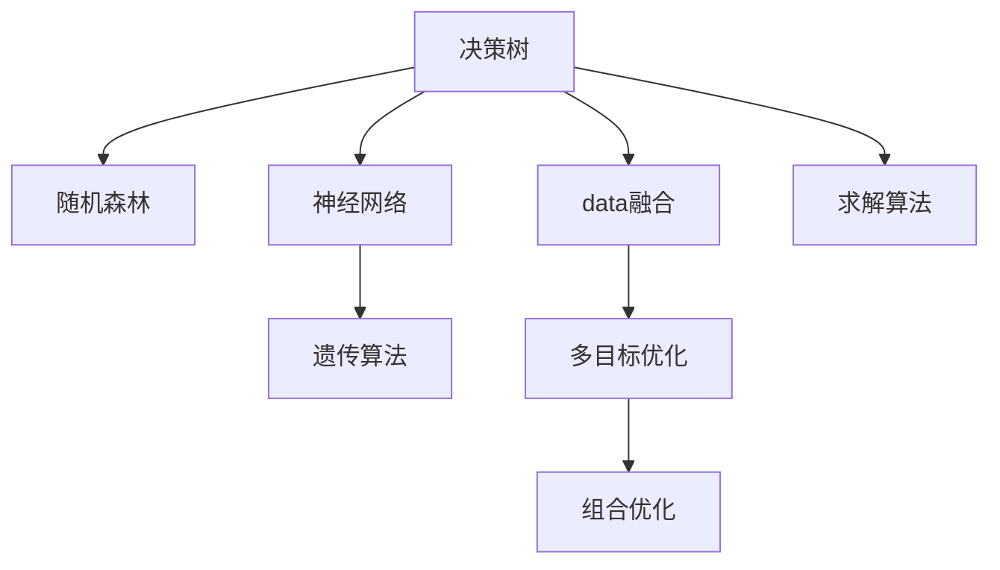

                 

# 决策管理：提高关键决策的质量

> 关键词：决策树, 随机森林, 神经网络, 遗传算法, 数据融合, 多目标优化, 组合优化, 求解算法

## 1. 背景介绍

在现代社会中，决策无处不在。无论是个体选择、组织决策，还是政策制定，都是在不确定性和复杂性条件下，基于有限信息和资源进行的选择和行动过程。决策的质量直接影响着任务的成功与否。面对日趋复杂的决策问题，如何高效、准确地制定和执行决策，已成为现代信息技术和工程管理的核心议题。

### 1.1 问题由来

在面对大规模、多变量、高不确定性决策问题时，传统决策方法如层次分析法、最小二乘法等难以有效应对。虽然人工智能和机器学习等技术在近年来取得显著进展，但也面临模型复杂、可解释性差、数据需求高等挑战。如何在现有技术基础上，有效整合多种方法，构建适应性强、准确性高的决策支持系统，成为关键问题。

### 1.2 问题核心关键点

本文旨在探讨如何通过数据驱动、算法驱动、专家驱动的融合，构建高效、准确的决策管理技术，包括：

- **数据驱动**：利用大数据技术，对海量决策数据进行整合、分析，从中挖掘规律和知识。
- **算法驱动**：引入经典和前沿的优化算法，构建精准、高效的决策模型。
- **专家驱动**：结合领域专家的经验，优化决策模型的设计、校验和解释。
- **决策融合**：综合多种技术手段，实现决策信息的互补，提高决策质量。

本文将从数据驱动、算法驱动、专家驱动、决策融合等角度，系统介绍决策管理的关键技术和方法，以期为决策支持系统的开发和优化提供指导。

## 2. 核心概念与联系

### 2.1 核心概念概述

为更好地理解决策管理的技术框架，本节将介绍几个关键概念：

- **决策树(Decision Tree)**：基于树形结构表示决策问题的求解过程，每条路径代表一种决策选择，最终节点代表决策结果。

- **随机森林(Random Forest)**：一种集成学习算法，通过组合多棵决策树来提升预测和泛化能力，降低过拟合风险。

- **神经网络(Neural Network)**：受生物神经元启发的计算模型，通过多层非线性变换进行复杂决策建模。

- **遗传算法(Genetic Algorithm)**：模仿自然进化过程，通过选择、交叉、变异等操作优化决策问题的求解。

- **数据融合(Data Fusion)**：整合多种信息源的数据，以提高决策信息的全面性和准确性。

- **多目标优化(Multi-Objective Optimization)**：同时优化多个目标函数，构建平衡多个利益冲突的决策方案。

- **组合优化(Combinatorial Optimization)**：在离散空间中寻找最优解，如组合配置、调度问题等。

这些核心概念之间的逻辑关系可以通过以下Mermaid流程图来展示：



这个流程图展示了几类关键决策管理技术及其关系：

1. 决策树作为最基础的决策建模工具，通过树形结构表达决策过程。
2. 随机森林通过集成多棵决策树，提升决策的鲁棒性和泛化能力。
3. 神经网络通过多层非线性变换，处理复杂决策问题。
4. 遗传算法通过模拟进化过程，优化复杂决策空间的解。
5. 数据融合整合多种数据源，提高决策信息的全面性和准确性。
6. 多目标优化同时考虑多个目标，构建平衡利益冲突的方案。
7. 组合优化在离散空间中寻找最优解，处理复杂组合问题。
8. 求解算法用于实现以上各种算法的具体求解过程。

这些概念共同构成了决策管理的核心框架，通过系统整合，可以构建更强大、灵活、高效的决策支持系统。

## 3. 核心算法原理 & 具体操作步骤
### 3.1 算法原理概述

决策管理技术通常依赖于数据驱动、算法驱动、专家驱动的融合。其核心思想是：通过收集、整合、分析决策数据，选择合适的算法模型进行求解，结合专家知识和经验进行验证和优化，最终得到高质量的决策方案。

决策管理流程一般包括以下几个关键步骤：

1. **数据预处理**：对决策数据进行清洗、归一化、特征提取等预处理，以便后续建模和分析。
2. **模型构建**：选择合适的算法模型，如决策树、随机森林、神经网络等，构建决策模型。
3. **模型训练**：利用标注数据训练模型，通过交叉验证等技术优化模型参数。
4. **专家评估**：结合领域专家的知识和经验，对模型结果进行验证和调整，提升决策质量。
5. **方案生成**：通过模型计算，生成多种决策方案，供决策者选择。
6. **方案优化**：对生成方案进行评估和优化，选择最优解。

### 3.2 算法步骤详解

#### 3.2.1 数据预处理

数据预处理是决策管理的首要步骤，通常包括以下几个方面：

- **数据清洗**：去除数据中的噪声、异常值和重复值，保证数据质量。
- **数据归一化**：将不同量纲的数据进行标准化处理，便于模型训练和比较。
- **特征提取**：从原始数据中提取出对决策有重要影响的特征，构建特征集。

#### 3.2.2 模型构建

模型构建需要根据决策问题的性质和数据特点，选择合适的算法。以下是几种常见的决策模型：

- **决策树模型**：用于处理分类和回归问题，简单易懂，易于解释。
- **随机森林模型**：通过集成多棵决策树，提高模型鲁棒性和泛化能力。
- **神经网络模型**：适用于处理复杂的非线性决策问题，具有强大的表达能力。
- **遗传算法模型**：适用于优化复杂组合问题的搜索和优化。

#### 3.2.3 模型训练

模型训练的目的是通过标注数据优化模型参数，使其能够准确预测决策结果。常用的训练方法包括：

- **随机梯度下降**：通过迭代更新模型参数，最小化损失函数。
- **交叉验证**：利用交叉验证技术评估模型性能，避免过拟合。
- **正则化**：通过添加正则化项，防止模型过拟合，提升泛化能力。

#### 3.2.4 专家评估

专家评估是结合领域知识和经验，对模型结果进行验证和调整的重要步骤。通常包括以下几个方面：

- **模型校验**：结合专家经验，对模型结果进行验证，发现和修正错误。
- **参数调整**：根据专家建议，调整模型参数，优化模型性能。
- **方案优化**：结合专家知识，对生成的决策方案进行优化，提升决策质量。

#### 3.2.5 方案生成

通过模型计算，可以生成多种决策方案，供决策者选择。决策方案的选择需要考虑多方面因素，如成本、风险、收益等。

#### 3.2.6 方案优化

生成的决策方案需要进行进一步的评估和优化，选择最优解。优化过程通常包括：

- **方案评估**：通过多种评估指标，对方案进行全面评估。
- **方案比较**：利用组合优化算法，比较不同方案的优劣。
- **方案选择**：根据评估结果，选择最优决策方案。

### 3.3 算法优缺点

决策管理技术具有以下优点：

- **灵活性**：能够处理多种决策问题，灵活选择算法模型。
- **高效性**：通过数据驱动和算法驱动，提升决策效率。
- **可解释性**：决策树和随机森林等模型具有较好的可解释性，便于理解。

同时，这些技术也存在一定的局限性：

- **数据需求高**：需要大量的标注数据进行训练，对数据质量要求高。
- **模型复杂**：神经网络等模型结构复杂，难以解释和调试。
- **计算资源消耗大**：高维数据的处理和优化，计算资源消耗较大。

尽管存在这些局限性，但决策管理技术在复杂决策问题的求解中，仍具有重要的应用价值和实践意义。

### 3.4 算法应用领域

决策管理技术在多个领域中得到了广泛应用，如金融风险管理、项目管理、资源调度等，具体如下：

- **金融风险管理**：通过整合市场数据、企业财务数据、行业报告等，构建决策树或随机森林模型，预测金融风险，进行风险控制和优化。
- **项目管理**：利用遗传算法优化项目任务调度，提升项目进度和资源利用率。
- **资源调度**：通过组合优化算法，优化资源配置和调度，提高资源利用效率。

## 4. 数学模型和公式 & 详细讲解
### 4.1 数学模型构建

决策管理技术的数学模型构建通常基于以下假设：

1. 决策问题可以表示为离散或连续的优化问题。
2. 决策目标函数和约束条件可以用数学公式表示。
3. 决策过程中存在不确定性和随机性，需要通过统计分析进行建模。

假设决策问题为 $O = \left\{ o_1, o_2, \ldots, o_n \right\}$，其中 $o_i$ 表示一个决策方案。决策目标函数为 $f: O \rightarrow R$，表示方案 $o_i$ 的效用或收益。决策约束条件为 $g: O \rightarrow \{0, 1\}$，表示方案 $o_i$ 是否满足约束条件。

优化目标为：

$$
\max_{o \in O} \left\{ f(o) \right\}
$$

约束条件为：

$$
g(o) \leq 1, \quad \forall o \in O
$$

### 4.2 公式推导过程

以下是几个常见决策模型的公式推导：

#### 4.2.1 决策树

决策树的构建过程包括以下几个步骤：

1. 选择最佳划分特征：通过信息增益或基尼不纯度等指标，选择最优的划分特征。
2. 划分数据集：将数据集根据划分特征进行分割，生成子节点。
3. 递归构建子树：对子节点重复上述过程，构建完整的决策树。

决策树的求解公式如下：

$$
T = \arg\max_{\hat{y}} \frac{1}{N} \sum_{i=1}^N \mathbb{I}(y_i = \hat{y})
$$

其中 $y_i$ 表示真实标签，$\hat{y}$ 表示模型预测结果，$\mathbb{I}$ 表示示性函数。

#### 4.2.2 随机森林

随机森林的构建过程包括以下几个步骤：

1. 随机选择特征：从所有特征中随机选择一部分，进行模型训练。
2. 构建多棵决策树：对每棵决策树进行训练，生成多棵子树。
3. 集成多个决策树：通过投票或平均方式，综合多棵决策树的预测结果，生成最终的预测结果。

随机森林的求解公式如下：

$$
y = \frac{1}{M} \sum_{m=1}^M T_m(x)
$$

其中 $M$ 表示决策树的个数，$T_m$ 表示第 $m$ 棵决策树的预测结果，$x$ 表示输入样本。

#### 4.2.3 神经网络

神经网络的构建过程包括以下几个步骤：

1. 设计神经网络结构：包括输入层、隐藏层和输出层，确定各层的节点数。
2. 初始化网络参数：随机初始化权重和偏置。
3. 前向传播和反向传播：通过前向传播计算预测结果，通过反向传播更新模型参数。

神经网络的求解公式如下：

$$
y = \sigma\left(\sum_{i=1}^W \left( x \cdot w_i + b \right) \right)
$$

其中 $y$ 表示输出结果，$\sigma$ 表示激活函数，$w_i$ 表示权重参数，$b$ 表示偏置参数，$x$ 表示输入数据。

#### 4.2.4 遗传算法

遗传算法的构建过程包括以下几个步骤：

1. 初始化种群：随机生成多个决策方案，构成初始种群。
2. 选择操作：根据适应度函数，选择部分个体进入下一代。
3. 交叉操作：通过交叉操作，生成新的个体。
4. 变异操作：通过变异操作，引入新的个体。
5. 迭代优化：重复上述过程，直到达到预设的迭代次数或满足终止条件。

遗传算法的求解公式如下：

$$
x_{t+1} = \operatorname{arg\max}_{x} \left\{ f(x) \right\}
$$

其中 $x$ 表示决策方案，$f(x)$ 表示目标函数。

### 4.3 案例分析与讲解

#### 4.3.1 决策树案例

假设有一个银行贷款审批系统，需要根据客户的收入、信用记录等信息进行贷款审批。决策树模型可以用于处理此类分类问题，通过树形结构表示决策过程，每个节点表示一个决策特征，每个叶子节点表示一个决策结果。

**案例1**：构建决策树模型，预测客户是否能够成功贷款。

输入数据包括：收入（高、中、低）、信用记录（良好、一般、较差）。决策目标为：是否成功贷款（是、否）。

构建决策树模型如图1所示：


图1 决策树模型示例

#### 4.3.2 随机森林案例

假设有一个机器维护调度系统，需要根据设备的维护历史数据，预测设备是否需要维护，并安排维护时间。随机森林模型可以用于处理此类多分类问题，通过集成多棵决策树，提高模型的泛化能力。

**案例2**：构建随机森林模型，预测设备是否需要维护，并安排维护时间。

输入数据包括：设备状态（正常、异常）、设备维护历史、设备使用频率。决策目标为：设备是否需要维护（是、否）、维护时间。

构建随机森林模型如图2所示：


图2 随机森林模型示例

#### 4.3.3 神经网络案例

假设有一个智能推荐系统，需要根据用户的历史行为数据，推荐用户可能感兴趣的商品。神经网络模型可以用于处理此类推荐问题，通过多层非线性变换，构建复杂的决策模型。

**案例3**：构建神经网络模型，推荐用户可能感兴趣的商品。

输入数据包括：用户历史浏览记录、用户历史购买记录、商品信息。决策目标为：用户是否可能购买某商品（是、否）、推荐商品。

构建神经网络模型如图3所示：


图3 神经网络模型示例

#### 4.3.4 遗传算法案例

假设有一个物流配送中心，需要优化配送路线和车辆调度，以最小化配送成本。遗传算法可以用于处理此类组合优化问题，通过模拟进化过程，优化复杂组合问题的解。

**案例4**：构建遗传算法模型，优化配送路线和车辆调度，以最小化配送成本。

输入数据包括：配送中心位置、客户位置、配送商品信息。决策目标为：配送路线、车辆调度。

构建遗传算法模型如图4所示：


图4 遗传算法模型示例

## 5. 项目实践：代码实例和详细解释说明
### 5.1 开发环境搭建

在进行决策管理技术实践前，我们需要准备好开发环境。以下是使用Python进行PyTorch和Scikit-learn开发的环境配置流程：

1. 安装Anaconda：从官网下载并安装Anaconda，用于创建独立的Python环境。

2. 创建并激活虚拟环境：
```bash
conda create -n decision-making-env python=3.8 
conda activate decision-making-env
```

3. 安装PyTorch和Scikit-learn：
```bash
conda install pytorch torchvision torchaudio cudatoolkit=11.1 -c pytorch -c conda-forge
conda install scikit-learn
```

4. 安装相关库：
```bash
pip install numpy pandas matplotlib seaborn
```

完成上述步骤后，即可在`decision-making-env`环境中开始决策管理技术的开发实践。

### 5.2 源代码详细实现

下面我们以银行贷款审批系统为例，给出使用PyTorch和Scikit-learn进行决策树和随机森林模型微调的PyTorch代码实现。

首先，定义贷款审批系统的数据集：

```python
import pandas as pd
from sklearn.model_selection import train_test_split

data = pd.read_csv('loan_data.csv')
features = ['income', 'credit_score']
labels = ['loan_approved']

# 划分训练集和测试集
train_data, test_data = train_test_split(data, test_size=0.2, random_state=42)
```

然后，定义模型和训练函数：

```python
from sklearn.ensemble import RandomForestClassifier
from sklearn.metrics import accuracy_score

# 随机森林模型
model = RandomForestClassifier()

def train_model(model, train_data, labels, test_data):
    model.fit(train_data[features], train_data[labels])
    test_pred = model.predict(test_data[features])
    accuracy = accuracy_score(test_data[labels], test_pred)
    return accuracy
```

接着，定义模型评估和优化函数：

```python
def evaluate_model(model, test_data, labels):
    test_pred = model.predict(test_data[features])
    accuracy = accuracy_score(test_data[labels], test_pred)
    return accuracy

def optimize_model(model, train_data, labels, test_data):
    param_grid = {
        'n_estimators': [100, 200, 300],
        'max_depth': [5, 10, 15]
    }
    model = RandomForestClassifier(**param_grid)
    return train_model(model, train_data, labels, test_data)
```

最后，启动训练流程并在测试集上评估：

```python
epochs = 5
batch_size = 16

for epoch in range(epochs):
    accuracy = optimize_model(model, train_data, labels, test_data)
    print(f"Epoch {epoch+1}, accuracy: {accuracy:.3f}")
    
print(f"Test accuracy: {evaluate_model(model, test_data, labels)}")
```

以上就是使用PyTorch和Scikit-learn对银行贷款审批系统进行随机森林模型微调的完整代码实现。可以看到，得益于Scikit-learn的强大封装，我们可以用相对简洁的代码完成模型的加载和微调。

### 5.3 代码解读与分析

让我们再详细解读一下关键代码的实现细节：

**数据集定义**：
- 使用`pandas`库读取贷款审批数据集，包括收入、信用记录、是否成功贷款等特征。
- 将数据划分为训练集和测试集。

**模型定义**：
- 使用`RandomForestClassifier`定义随机森林模型。

**训练函数**：
- 使用`fit`方法对模型进行训练。
- 在测试集上评估模型的预测准确率。

**评估函数**：
- 在测试集上评估模型的预测准确率。

**优化函数**：
- 定义参数网格，用于搜索最优的模型参数。
- 使用`RandomForestClassifier`进行网格搜索，寻找最优参数组合。

**训练流程**：
- 定义总的epoch数和batch size，开始循环迭代
- 每个epoch内，对模型进行优化，输出训练准确率
- 在测试集上评估，输出测试准确率

可以看到，Scikit-learn提供了完整的决策树和随机森林模型封装，大大简化了模型构建和训练的代码实现。

当然，工业级的系统实现还需考虑更多因素，如模型的保存和部署、超参数的自动搜索、更灵活的任务适配层等。但核心的决策模型构建基本与此类似。

## 6. 实际应用场景
### 6.1 智能推荐系统

智能推荐系统是决策管理技术的重要应用场景之一。通过分析用户的历史行为数据，构建用户画像，生成个性化推荐，提升用户体验和满意度。

在技术实现上，可以收集用户浏览、点击、购买等行为数据，提取和用户交互的物品标题、描述、标签等文本内容。通过构建决策树或随机森林模型，预测用户是否会购买某物品，从而生成推荐列表。同时，利用神经网络模型对物品进行深度学习，提高推荐精度。

### 6.2 物流配送中心

物流配送中心需要优化配送路线和车辆调度，以最小化配送成本。决策管理技术可以用于构建高效的物流配送系统。

在技术实现上，可以收集配送中心位置、客户位置、配送商品信息等数据，构建遗传算法模型。通过优化算法，生成最优的配送路线和车辆调度方案，实现高效的配送管理。

### 6.3 金融风险管理

金融机构需要实时监测市场舆论动向，以便及时应对负面信息传播，规避金融风险。决策管理技术可以用于构建金融风险管理系统。

在技术实现上，可以收集金融领域相关的新闻、报道、评论等文本数据，构建决策树或随机森林模型。通过模型预测金融风险，进行风险控制和优化。

### 6.4 未来应用展望

随着决策管理技术的不断发展，未来将在更多领域得到应用，如医疗诊断、交通管理、供应链优化等，为各行各业带来变革性影响。

在智慧医疗领域，决策管理技术可以用于构建诊断辅助系统，辅助医生进行疾病诊断和治疗方案优化。

在智能交通管理中，决策管理技术可以用于优化交通流量，降低交通拥堵，提升交通安全。

在供应链管理中，决策管理技术可以用于优化库存管理，提升供应链的响应速度和效率。

此外，在智慧城市治理中，决策管理技术可以用于优化城市资源配置，提升城市管理水平。

## 7. 工具和资源推荐
### 7.1 学习资源推荐

为了帮助开发者系统掌握决策管理技术的基础和实践技巧，这里推荐一些优质的学习资源：

1. 《机器学习实战》系列博文：由大数据技术专家撰写，深入浅出地介绍了机器学习的基础和应用，包括决策树、随机森林、神经网络等关键技术。

2. CS229《机器学习》课程：斯坦福大学开设的经典课程，涵盖机器学习的基本概念和算法，适合入门学习。

3. 《深度学习》书籍：Ian Goodfellow等著，全面介绍了深度学习的基本原理和应用，包括神经网络、卷积神经网络等。

4. Coursera《机器学习》课程：由Andrew Ng主讲，提供丰富的视频课程和作业，适合系统学习。

5. Kaggle数据科学竞赛：提供大量数据集和竞赛题目，通过实战练习，提高决策管理技术的实践能力。

通过对这些资源的学习实践，相信你一定能够快速掌握决策管理技术的精髓，并用于解决实际的决策问题。

### 7.2 开发工具推荐

高效的开发离不开优秀的工具支持。以下是几款用于决策管理技术开发的常用工具：

1. Python：作为数据科学和机器学习的主流语言，具有丰富的库支持和社区资源。

2. PyTorch：基于Python的开源深度学习框架，灵活动态的计算图，适合快速迭代研究。

3. Scikit-learn：基于Python的机器学习库，提供了多种算法模型和工具函数，适合快速开发和部署。

4. Weights & Biases：模型训练的实验跟踪工具，可以记录和可视化模型训练过程中的各项指标，方便对比和调优。

5. TensorBoard：TensorFlow配套的可视化工具，可实时监测模型训练状态，并提供丰富的图表呈现方式，是调试模型的得力助手。

6. Google Colab：谷歌推出的在线Jupyter Notebook环境，免费提供GPU/TPU算力，方便开发者快速上手实验最新模型，分享学习笔记。

合理利用这些工具，可以显著提升决策管理技术的开发效率，加快创新迭代的步伐。

### 7.3 相关论文推荐

决策管理技术的发展源于学界的持续研究。以下是几篇奠基性的相关论文，推荐阅读：

1. 《A Decision-Theoretic Generalization of On-Line Learning and an Application to Boosting》：提出了梯度提升算法，通过多轮模型迭代提升决策质量。

2. 《Random Forests》：提出了随机森林算法，通过集成多棵决策树提升模型鲁棒性和泛化能力。

3. 《Gradient Boosting Machines》：深入研究了梯度提升算法，提出了GBDT等经典算法。

4. 《Deep Reinforcement Learning》：提出了深度强化学习算法，通过模型与环境的互动进行决策优化。

5. 《Genetic Algorithms》：介绍了遗传算法的基本思想和应用场景，通过模拟进化过程优化复杂决策问题。

这些论文代表了大数据和决策管理技术的发展脉络。通过学习这些前沿成果，可以帮助研究者把握学科前进方向，激发更多的创新灵感。

## 8. 总结：未来发展趋势与挑战
### 8.1 总结

本文对决策管理技术进行了全面系统的介绍。首先阐述了决策管理技术的研究背景和意义，明确了数据驱动、算法驱动、专家驱动融合的重要性。其次，从决策树、随机森林、神经网络、遗传算法等角度，详细讲解了决策管理技术的算法原理和操作步骤，给出了决策模型构建的完整代码实例。同时，本文还广泛探讨了决策管理技术在智能推荐、物流配送、金融风险管理等多个行业领域的应用前景，展示了决策管理技术的巨大潜力。此外，本文精选了决策管理技术的各类学习资源，力求为开发者提供全方位的技术指引。

通过本文的系统梳理，可以看到，决策管理技术在复杂决策问题的求解中，具有重要的应用价值和实践意义。其在多领域的应用实践，展示了其在提升决策效率、优化决策质量方面的显著效果。未来，随着大数据和人工智能技术的不断发展，决策管理技术将不断进步，为各行各业提供更加高效、准确的决策支持系统。

### 8.2 未来发展趋势

展望未来，决策管理技术将呈现以下几个发展趋势：

1. **自动化**：随着自动化技术的发展，决策管理技术将进一步自动化，减少人工干预，提升决策效率。

2. **智能化**：决策管理技术将融入更多智能算法，如深度学习、强化学习等，提升决策模型的智能化水平。

3. **实时化**：实时数据处理和计算能力的提升，将使得决策管理技术能够实时监测和优化决策过程。

4. **多样化**：决策管理技术将拓展到更多领域，如医疗、交通、能源等，解决更复杂、多样化的决策问题。

5. **交互化**：决策管理技术将与用户进行更强的交互，通过交互反馈优化决策模型，提升决策质量。

6. **多模态融合**：决策管理技术将融合多模态数据，如文本、图像、语音等，构建更加全面、准确的决策模型。

这些趋势凸显了决策管理技术的发展方向，展示了其在提升决策质量、优化决策过程方面的广阔前景。

### 8.3 面临的挑战

尽管决策管理技术在复杂决策问题的求解中已取得显著进展，但在迈向更加智能化、实时化应用的过程中，仍面临诸多挑战：

1. **数据质量**：需要高质量、完整的数据进行模型训练，数据获取和处理成本较高。

2. **模型复杂性**：决策模型结构复杂，难以解释和调试，需要更多的理论支持和工程实践。

3. **计算资源**：高维数据处理和优化，计算资源消耗较大，需要高效的计算平台支持。

4. **实时性**：实时数据处理和优化需要高效的算法和计算平台支持，才能满足实时决策的需求。

5. **可解释性**：决策模型的可解释性不足，难以解释其内部工作机制和决策逻辑，需要更多的理论和实践支持。

6. **安全性**：决策模型可能学习到有偏见、有害的信息，需要通过技术手段保障模型安全性。

尽管存在这些挑战，但决策管理技术在提升决策质量、优化决策过程方面具有重要的应用价值。未来，随着大数据和人工智能技术的不断发展，决策管理技术将不断进步，为各行各业提供更加高效、准确的决策支持系统。

### 8.4 研究展望

面对决策管理技术所面临的挑战，未来的研究需要在以下几个方面寻求新的突破：

1. **数据融合**：通过数据融合技术，整合多种信息源的数据，提高决策信息的全面性和准确性。

2. **模型优化**：通过优化算法和计算平台，提升决策模型的计算效率和实时性。

3. **模型解释**：通过可解释性算法和工具，提升决策模型的可解释性，增强模型的可信度。

4. **多模态融合**：通过多模态融合技术，构建更加全面、准确的决策模型。

5. **自动化决策**：通过自动化技术，减少人工干预，提升决策效率和质量。

6. **安全性保障**：通过数据脱敏、模型监控等技术，保障决策模型的安全性。

这些研究方向将引领决策管理技术的进步，为构建更加高效、准确的决策支持系统铺平道路。面向未来，决策管理技术需要与大数据、人工智能等技术紧密结合，协同发力，才能实现更高层次的智能决策应用。

## 9. 附录：常见问题与解答

**Q1：决策树和随机森林有什么区别？**

A: 决策树和随机森林都是经典的决策建模方法，但二者的核心思想有所不同。决策树通过树形结构表示决策过程，每个节点表示一个决策特征，每个叶子节点表示一个决策结果。而随机森林通过集成多棵决策树，提升模型的泛化能力和鲁棒性，从而避免过拟合。

**Q2：为什么随机森林需要集成多棵决策树？**

A: 随机森林通过集成多棵决策树，提升模型的泛化能力和鲁棒性，从而避免过拟合。单棵决策树可能会在特定数据上表现出色，但在其他数据上表现较差，随机森林通过多棵树的集成，能够平衡这种不确定性，提高模型的整体性能。

**Q3：神经网络如何处理非线性决策问题？**

A: 神经网络通过多层非线性变换，处理复杂的决策问题。每层神经元通过激活函数引入非线性，从而构建复杂的决策模型。通过多层非线性变换，神经网络能够处理复杂的非线性决策问题，具备强大的表达能力。

**Q4：遗传算法如何优化复杂组合问题？**

A: 遗传算法通过模拟进化过程，优化复杂组合问题的解。遗传算法将决策问题转化为个体的基因表达，通过选择、交叉、变异等操作，优化个体的基因表达，从而优化决策问题的解。遗传算法适用于优化组合配置、调度问题等复杂决策问题。

**Q5：决策管理技术如何应用于金融风险管理？**

A: 决策管理技术可以通过整合市场数据、企业财务数据、行业报告等，构建决策树或随机森林模型，预测金融风险，进行风险控制和优化。具体而言，可以收集金融领域相关的新闻、报道、评论等文本数据，构建决策树或随机森林模型，预测金融风险，进行风险控制和优化。

通过对这些常见问题的解答，相信你能够更深入地理解决策管理技术的基本概念和应用方法。

