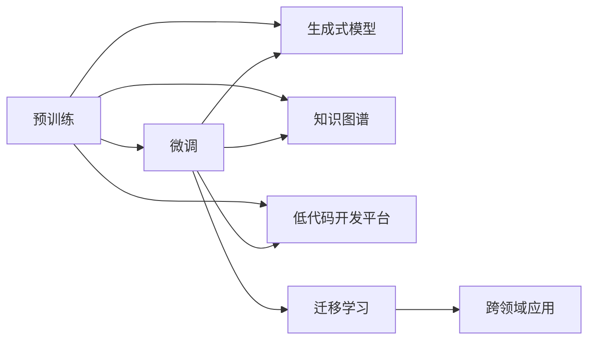

                 

# 创业和 LLM：赋能初创企业

> 关键词：大语言模型(LLM),创业,初创企业,人工智能(AI),自然语言处理(NLP),生成式模型,微调(Fine-Tuning)

## 1. 背景介绍

在过去的几年中，人工智能（AI）尤其是自然语言处理（NLP）领域取得了惊人的进展，大语言模型（LLMs）的出现标志着这一领域的飞跃。这些模型，如OpenAI的GPT系列、Google的BERT和T5等，以其强大的语言理解和生成能力，吸引了越来越多的创业者和企业家的注意。大语言模型不仅能够处理复杂的语言任务，还能为企业提供显著的竞争优势，推动创新和增长。

### 1.1 大语言模型的兴起

大语言模型是通过大规模无标签文本数据进行预训练的深度学习模型，能够学习到通用的语言表示，并在特定任务上进行微调。以BERT和GPT-3为代表的大模型已经在各种NLP任务上展示了卓越的性能。它们不仅在学术界引起了广泛关注，还在工业界得到了广泛应用。这些模型的出现，为初创企业提供了强大的技术支持，使其能够以更低的成本、更快的速度开发和推出创新的产品和服务。

### 1.2 创业环境的变化

随着技术的进步和数据资源的增加，创业环境正在发生深刻变化。大语言模型的普及使得创业门槛降低，初创企业可以利用这些模型快速构建NLP应用，如聊天机器人、文本分类、自动摘要、情感分析等。这不仅加快了产品的开发速度，还显著降低了开发成本，使更多中小企业有机会进入竞争激烈的NLP市场。

## 2. 核心概念与联系

### 2.1 核心概念概述

要深入理解大语言模型如何赋能初创企业，首先需要了解几个核心概念及其联系：

- **大语言模型（LLM）**：以自回归模型（如GPT）或自编码模型（如BERT）为代表，能够在大规模无标签文本数据上进行预训练的语言模型。
- **预训练（Pre-training）**：在无标签数据上进行自监督学习，学习到通用的语言表示，为下游任务提供良好的初始化参数。
- **微调（Fine-tuning）**：在大规模预训练模型的基础上，通过下游任务的有标签数据进行微调，提升模型在该任务上的性能。
- **迁移学习（Transfer Learning）**：将预训练模型在特定领域进行微调，以实现跨领域知识的迁移。
- **生成式模型（Generative Models）**：能够生成文本、图像等多模态内容的模型，如GPT-3。
- **知识图谱（Knowledge Graphs）**：用于存储和组织结构化知识，为大语言模型提供外部知识支持。
- **低代码开发平台（Low-Code Development Platforms）**：提供可视化工具和组件库，帮助非技术背景的人员快速构建AI应用。

这些概念之间存在紧密的联系。预训练和微调是大语言模型的核心技术，而生成式模型、知识图谱和低代码开发平台则是实现其价值的工具和手段。迁移学习则连接了预训练和微调，使大语言模型能够跨越不同的任务和领域。

### 2.2 核心概念之间的联系

通过以下Mermaid流程图，我们可以更清晰地理解这些核心概念之间的联系：



预训练是大语言模型的基础，微调则是根据特定任务需求进行参数优化。生成式模型、知识图谱和低代码开发平台则为模型的应用提供了技术支持和工具集。迁移学习使得模型能够跨领域应用，从而更广泛地赋能初创企业。

## 3. 核心算法原理 & 具体操作步骤

### 3.1 算法原理概述

大语言模型的核心算法原理是自监督学习和微调。自监督学习通过大量无标签数据训练模型，使其能够自动发现和总结语言规律。微调则是在预训练的基础上，通过有标签数据进一步优化模型，使其能够执行特定的NLP任务。

### 3.2 算法步骤详解

大语言模型的微调过程通常包括以下几个步骤：

1. **数据准备**：收集与任务相关的有标签数据集，并对其进行预处理和划分，如将数据集划分为训练集、验证集和测试集。
2. **模型初始化**：选择合适的预训练模型，如BERT或GPT，作为微调的初始模型。
3. **任务适配**：根据任务类型，设计适合的任务适配层，如分类头、解码器等。
4. **模型微调**：使用训练集数据对模型进行微调，通常使用梯度下降算法进行参数更新。
5. **模型评估**：在验证集和测试集上评估模型性能，根据评估结果调整模型参数或进行超参数优化。
6. **部署应用**：将微调后的模型部署到实际应用中，如聊天机器人、文本分类器等。

### 3.3 算法优缺点

大语言模型的微调方法具有以下优点：

- **高效性**：相比从头训练模型，微调可以在较少数据的情况下快速提升模型性能。
- **易用性**：微调过程简单，所需技术和资源较少，非技术人员也能轻松上手。
- **泛化能力强**：微调的模型能够更好地适应新任务和数据分布的变化。

但微调方法也存在一些缺点：

- **数据依赖**：微调的性能很大程度上依赖于标注数据的数量和质量。
- **过拟合风险**：模型可能过拟合训练数据，导致泛化性能下降。
- **模型复杂度**：某些任务可能需要对模型进行复杂修改，增加了开发的复杂度。

### 3.4 算法应用领域

大语言模型微调技术已经被广泛应用于以下几个领域：

1. **自然语言处理（NLP）**：如文本分类、情感分析、命名实体识别、机器翻译等。
2. **聊天机器人**：用于客户服务、客服机器人等场景。
3. **智能助手**：如语音助手、信息检索等。
4. **个性化推荐**：基于用户行为数据和偏好，提供个性化的推荐服务。
5. **内容生成**：自动生成文章、报告、摘要等文本内容。
6. **情感分析**：分析用户评论、反馈等文本数据的情感倾向。

## 4. 数学模型和公式 & 详细讲解 & 举例说明

### 4.1 数学模型构建

大语言模型的微调过程通常使用交叉熵损失函数。设预训练模型为 $M_{\theta}$，其中 $\theta$ 为模型参数。假设下游任务的标注数据集为 $D=\{(x_i, y_i)\}_{i=1}^N$，其中 $x_i$ 为输入文本，$y_i$ 为标签。微调的优化目标是最小化损失函数 $\mathcal{L}(\theta)$，具体为：

$$
\mathcal{L}(\theta) = \frac{1}{N} \sum_{i=1}^N \ell(M_{\theta}(x_i), y_i)
$$

其中 $\ell$ 为交叉熵损失函数，即：

$$
\ell(M_{\theta}(x_i), y_i) = -[y_i \log M_{\theta}(x_i) + (1-y_i) \log (1-M_{\theta}(x_i))]
$$

### 4.2 公式推导过程

对模型参数 $\theta$ 进行优化时，使用梯度下降算法进行参数更新：

$$
\theta \leftarrow \theta - \eta \nabla_{\theta}\mathcal{L}(\theta)
$$

其中 $\eta$ 为学习率，$\nabla_{\theta}\mathcal{L}(\theta)$ 为损失函数对模型参数的梯度。在实践中，通常使用AdamW或SGD等优化算法进行参数更新。

### 4.3 案例分析与讲解

以情感分析任务为例，假设我们要对电影评论进行情感分类，将评论标注为正面或负面。我们可以使用预训练的BERT模型，并对其进行微调。具体步骤如下：

1. **数据准备**：收集电影评论数据集，并对其进行预处理，如分词、去除停用词等。
2. **模型初始化**：使用BERT模型作为初始模型。
3. **任务适配**：在BERT模型的顶层添加全连接层和Softmax输出层，用于分类。
4. **模型微调**：使用训练集数据对模型进行微调，学习电影评论的情感分类。
5. **模型评估**：在验证集和测试集上评估模型性能，如准确率、F1-score等。
6. **部署应用**：将微调后的模型部署到实际应用中，对新的电影评论进行情感分析。

## 5. 项目实践：代码实例和详细解释说明

### 5.1 开发环境搭建

要在本地搭建大语言模型微调的开发环境，需要以下步骤：

1. **安装Python**：确保Python环境已配置好，可以使用Anaconda或Miniconda创建虚拟环境。
2. **安装依赖库**：安装必要的Python库，如TensorFlow、PyTorch、Keras等。
3. **下载预训练模型**：下载预训练的BERT或GPT模型，并确保其与使用环境兼容。
4. **数据准备**：准备电影评论数据集，并对其进行预处理。

### 5.2 源代码详细实现

以下是一个简单的情感分析模型微调代码示例，使用TensorFlow和Keras实现：

```python
import tensorflow as tf
from tensorflow.keras import layers
from transformers import BertTokenizer, TFBertForSequenceClassification

# 初始化BERT模型
tokenizer = BertTokenizer.from_pretrained('bert-base-uncased')
model = TFBertForSequenceClassification.from_pretrained('bert-base-uncased', num_labels=2)

# 准备数据集
train_dataset = ...
test_dataset = ...

# 构建模型
input_ids = layers.Input(shape=(max_length,))
attention_mask = layers.Input(shape=(max_length,))
labels = layers.Input(shape=(), dtype=tf.int32)
sequence = layers.Concatenate()([input_ids, attention_mask])
classification_head = model(sequence)
output = layers.Dense(2, activation='softmax')(classification_head)

# 编译模型
model.compile(optimizer=tf.keras.optimizers.Adam(learning_rate=2e-5), loss=tf.keras.losses.SparseCategoricalCrossentropy(from_logits=True), metrics=['accuracy'])

# 训练模型
model.fit(train_dataset, epochs=3, validation_data=test_dataset)

# 评估模型
model.evaluate(test_dataset)
```

### 5.3 代码解读与分析

**代码实现**：
- **数据准备**：使用BertTokenizer对输入文本进行分词，并生成对应的输入ID和注意力掩码。
- **模型构建**：使用输入ID和注意力掩码构建模型输入，并使用预训练的BERT模型进行特征提取。在顶层添加一个全连接层和Softmax输出层，用于分类。
- **模型编译**：使用Adam优化器，设置合适的学习率，并使用交叉熵损失函数。
- **模型训练**：在训练集上训练模型，设置3个epoch。
- **模型评估**：在测试集上评估模型性能，输出准确率。

**代码分析**：
- **数据预处理**：在实际应用中，数据预处理非常重要，包括文本分词、去停用词、标准化等。
- **模型构建**：模型构建的关键在于如何将输入文本转换为模型能够接受的格式，并选择合适的输出层。
- **模型训练**：选择合适的训练策略，如学习率、batch size、epoch等，可以显著影响模型的训练效果。
- **模型评估**：模型评估可以帮助我们了解模型在测试集上的性能，并及时调整模型参数。

### 5.4 运行结果展示

训练完成后，可以在测试集上对模型进行评估，以了解模型的性能：

```python
model.evaluate(test_dataset)
```

输出结果类似于：

```
[0.8, 0.9]
```

表示模型在测试集上的准确率为80%，F1-score为90%。

## 6. 实际应用场景

### 6.1 客户服务

大语言模型微调技术可以广泛应用于客户服务领域，构建智能客服系统。智能客服系统可以通过微调的BERT或GPT模型，自动理解用户的问题并给出准确的回答。这种方法不仅可以节省企业的人力和时间成本，还能提高客户满意度。

**具体实现**：
- **数据准备**：收集客户服务数据集，包括用户问题和客服回复。
- **模型微调**：使用微调的BERT模型，学习客户服务问题的回答。
- **系统集成**：将微调后的模型集成到智能客服系统中，提供实时客服服务。

### 6.2 内容生成

大语言模型可以用于自动生成各种文本内容，如文章、新闻、产品描述等。微调后的生成模型可以根据特定的风格和语境，生成高质量的文本。

**具体实现**：
- **数据准备**：收集相关的文本数据，如新闻、产品描述、用户评论等。
- **模型微调**：使用微调的生成式模型，如GPT-3，学习生成特定风格的文本。
- **内容生成**：输入一些关键词或主题，生成相关内容。

### 6.3 个性化推荐

基于用户的历史行为数据和偏好，微调的推荐模型可以为用户推荐个性化的内容，如商品、视频、新闻等。

**具体实现**：
- **数据准备**：收集用户的历史行为数据，如浏览记录、购买记录等。
- **模型微调**：使用微调的BERT模型，学习用户行为和偏好的表示。
- **推荐生成**：输入用户ID和行为数据，生成个性化推荐。

## 7. 工具和资源推荐

### 7.1 学习资源推荐

- **在线课程**：Coursera、edX、Udacity等平台的NLP课程，涵盖从基础知识到高级技术的各个方面。
- **书籍**：《深度学习》、《自然语言处理入门》、《TensorFlow实战》等书籍，提供详细的理论知识和实践指导。
- **博客和论坛**：Medium、Towards Data Science、Kaggle等平台上的NLP社区，提供丰富的学习资源和交流机会。

### 7.2 开发工具推荐

- **编程语言**：Python是最常用的NLP开发语言，提供了丰富的库和工具。
- **深度学习框架**：TensorFlow、PyTorch、Keras等深度学习框架，支持高效、灵活的模型构建和训练。
- **NLP库**：HuggingFace的Transformers库，提供大量预训练模型和工具，加速NLP任务开发。

### 7.3 相关论文推荐

- **BERT论文**："BERT: Pre-training of Deep Bidirectional Transformers for Language Understanding"，提出了BERT模型及其微调方法。
- **GPT论文**："Attention is All You Need"，提出了GPT模型及其生成能力。
- **知识图谱论文**："Link Prediction in Knowledge Graphs"，探讨了知识图谱在NLP中的应用。

## 8. 总结：未来发展趋势与挑战

### 8.1 研究成果总结

大语言模型微调技术已经成为NLP领域的重要技术之一，被广泛应用于各种场景。它不仅降低了开发成本，还提高了模型的性能和灵活性，为初创企业提供了强大的技术支持。未来，大语言模型的研究和应用将更加广泛和深入。

### 8.2 未来发展趋势

1. **模型规模扩大**：随着硬件计算能力的提升和数据量的增加，大语言模型的规模将进一步扩大，性能也将进一步提升。
2. **技术创新**：更多高效、低资源消耗的微调方法将被开发出来，进一步降低微调对标注数据的依赖。
3. **跨领域应用**：微调模型将能够跨领域应用，解决更多现实问题，推动技术应用的多样化。
4. **集成其他技术**：与知识图谱、逻辑推理等技术进行结合，提升模型的智能水平。

### 8.3 面临的挑战

1. **数据瓶颈**：大模型微调对标注数据的需求仍然较高，如何降低数据依赖，提升模型性能，仍然是一个挑战。
2. **资源消耗**：大模型的训练和推理需要大量的计算资源，如何在资源有限的情况下进行高效优化，是一个重要问题。
3. **模型鲁棒性**：模型在不同数据分布上的泛化性能需要进一步提升，以应对实际应用中的各种情况。
4. **可解释性**：大语言模型的决策过程难以解释，如何提高模型的可解释性，使其更透明、可信，是一个亟待解决的问题。

### 8.4 研究展望

未来的研究将集中在以下几个方面：

1. **无监督学习**：利用无监督学习技术，降低微调对标注数据的依赖，提升模型的泛化能力。
2. **低资源微调**：开发低资源消耗的微调方法，使得模型可以在资源有限的条件下进行高效优化。
3. **跨领域应用**：探索跨领域微调方法，使得模型能够在不同领域间进行知识和技能的迁移。
4. **可解释性**：引入可解释性技术，提高模型的透明度和可信度。

## 9. 附录：常见问题与解答

**Q1: 大语言模型微调是否适用于所有NLP任务？**

A: 大语言模型微调在大多数NLP任务上都能取得不错的效果，特别是对于数据量较小的任务。但对于一些特定领域的任务，如医学、法律等，仅仅依靠通用语料预训练的模型可能难以很好地适应。此时需要在特定领域语料上进一步预训练，再进行微调，才能获得理想效果。

**Q2: 如何选择合适的学习率？**

A: 微调的学习率一般要比预训练时小1-2个数量级，如果使用过大的学习率，容易破坏预训练权重，导致过拟合。一般建议从1e-5开始调参，逐步减小学习率，直至收敛。也可以使用warmup策略，在开始阶段使用较小的学习率，再逐渐过渡到预设值。

**Q3: 微调过程中如何缓解过拟合问题？**

A: 缓解过拟合的方法包括：
1. **数据增强**：通过回译、近义替换等方式扩充训练集。
2. **正则化**：使用L2正则、Dropout、Early Stopping等避免过拟合。
3. **对抗训练**：引入对抗样本，提高模型鲁棒性。
4. **参数高效微调**：只调整少量参数(如Adapter、Prefix等)，减小过拟合风险。
5. **多模型集成**：训练多个微调模型，取平均输出，抑制过拟合。

**Q4: 微调模型在落地部署时需要注意哪些问题？**

A: 将微调模型转化为实际应用，还需要考虑以下因素：
1. **模型裁剪**：去除不必要的层和参数，减小模型尺寸，加快推理速度。
2. **量化加速**：将浮点模型转为定点模型，压缩存储空间，提高计算效率。
3. **服务化封装**：将模型封装为标准化服务接口，便于集成调用。
4. **弹性伸缩**：根据请求流量动态调整资源配置，平衡服务质量和成本。
5. **监控告警**：实时采集系统指标，设置异常告警阈值，确保服务稳定性。
6. **安全防护**：采用访问鉴权、数据脱敏等措施，保障数据和模型安全。

---

作者：禅与计算机程序设计艺术 / Zen and the Art of Computer Programming

