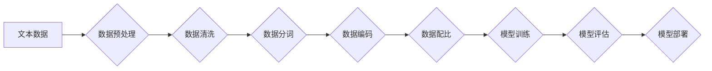

> 大语言模型，数据配比，训练策略，模型性能，文本生成，自然语言处理

## 1. 背景介绍

大语言模型（Large Language Model，LLM）近年来在自然语言处理（NLP）领域取得了显著进展，展现出强大的文本生成、翻译、问答和代码生成能力。这些模型通常基于Transformer架构，并通过海量文本数据进行预训练，从而学习到丰富的语言知识和模式。然而，模型的性能很大程度上取决于训练数据的质量和配比。

数据配比是指在训练数据集中不同类型数据的比例分配。对于LLM来说，数据配比的优化至关重要，因为它直接影响模型的泛化能力、鲁棒性和安全性。

## 2. 核心概念与联系

**2.1 数据类型**

LLM训练数据通常包含多种类型的数据，例如：

* **文本数据:** 包括书籍、文章、代码、对话等各种文本形式。
* **代码数据:** 包括不同编程语言的代码片段和注释。
* **结构化数据:** 包括数据库、表格等结构化数据，可以提供模型对现实世界知识的理解。

**2.2 数据配比策略**

不同的数据配比策略会对模型性能产生不同的影响。常见的策略包括：

* **均匀配比:** 所有数据类型在训练集中具有相同的比例。
* **类别平衡:** 针对特定任务，调整不同数据类型的比例，以平衡训练数据的类别分布。
* **渐进式配比:** 在训练过程中逐步增加特定数据类型的比例，例如在预训练阶段使用更多文本数据，在微调阶段使用更多代码数据。

**2.3 数据配比与模型性能**

数据配比与模型性能之间的关系非常复杂，需要根据具体的任务和模型架构进行调整。

* **过多的特定类型数据:** 可能导致模型过拟合，在特定任务上表现良好，但在其他任务上表现欠佳。
* **缺乏特定类型数据:** 可能导致模型无法学习到相关的知识和模式，从而降低模型性能。

**2.4 数据配比与模型安全性**

数据配比也与模型的安全性密切相关。如果训练数据中存在偏见或错误信息，模型可能会学习到这些偏见，从而产生不公平或有害的输出。

**Mermaid 流程图**



## 3. 核心算法原理 & 具体操作步骤

### 3.1 算法原理概述

数据配比的优化是一个迭代的过程，通常需要结合模型的性能评估结果进行调整。常用的算法包括：

* **交叉验证:** 将训练数据随机分成多个子集，每次使用其中一个子集作为验证集，其他子集作为训练集，重复多次，最终选择最佳的数据配比。
* **梯度下降:** 使用梯度下降算法优化数据配比参数，目标是最大化模型的性能指标。

### 3.2 算法步骤详解

1. **数据预处理:** 对原始数据进行清洗、分词、编码等预处理操作，使其适合模型训练。
2. **数据配比:** 根据预先设定的策略，将数据按照不同类型进行分配。
3. **模型训练:** 使用训练数据训练模型，并记录模型的性能指标。
4. **模型评估:** 使用验证集评估模型的性能，并根据评估结果调整数据配比。
5. **迭代优化:** 重复步骤3和4，直到模型性能达到预期的水平。

### 3.3 算法优缺点

**优点:**

* 可以有效地提高模型的性能。
* 可以帮助模型学习到更丰富的知识和模式。

**缺点:**

* 需要大量的计算资源和时间。
* 需要对数据进行深入的分析和理解。

### 3.4 算法应用领域

数据配比的优化技术广泛应用于各种NLP任务，例如：

* 文本分类
* 情感分析
* 机器翻译
* 文本生成

## 4. 数学模型和公式 & 详细讲解 & 举例说明

### 4.1 数学模型构建

数据配比可以看作是一个优化问题，目标是找到最佳的数据分配方案，以最大化模型的性能指标。

假设我们有N个数据点，分为M个类别，每个类别有n_i个数据点(i=1,2,...,M)。数据配比的目标函数可以定义为：

$$
f(p) = \sum_{i=1}^{M} p_i \cdot g_i
$$

其中：

* $p_i$ 是类别i的数据比例。
* $g_i$ 是类别i的性能指标。

### 4.2 公式推导过程

为了找到最佳的数据配比，我们需要对目标函数进行优化。可以使用梯度下降算法来求解最优解。

梯度下降算法的更新公式为：

$$
p_i = p_i - \alpha \cdot \frac{\partial f(p)}{\partial p_i}
$$

其中：

* $\alpha$ 是学习率。
* $\frac{\partial f(p)}{\partial p_i}$ 是目标函数对$p_i$的偏导数。

### 4.3 案例分析与讲解

假设我们有一个文本分类任务，需要将文本分为正负两类。我们可以使用交叉验证方法来评估不同数据配比的性能。

例如，我们可以将训练数据分成80%和20%两部分，分别作为训练集和验证集。然后，我们可以尝试不同的数据配比，例如：

* 80%正样本，20%负样本
* 70%正样本，30%负样本
* 60%正样本，40%负样本

通过比较不同数据配比下模型在验证集上的性能，我们可以选择最佳的数据配比。

## 5. 项目实践：代码实例和详细解释说明

### 5.1 开发环境搭建

* Python 3.7+
* TensorFlow 2.0+
* PyTorch 1.0+
* NLTK
* SpaCy

### 5.2 源代码详细实现

```python
import numpy as np
from sklearn.model_selection import train_test_split

# 假设我们有以下数据
X = np.array([
    ['This is a positive sentence.', 'This is a negative sentence.'],
    ['This is another positive sentence.', 'This is another negative sentence.'],
    # ...
])
y = np.array([1, 0, 1, 0, ...])

# 将数据分成训练集和验证集
X_train, X_val, y_train, y_val = train_test_split(X, y, test_size=0.2, random_state=42)

# 调整数据配比
# 例如，增加正样本的比例
X_train_pos = X_train[y_train == 1]
X_train_neg = X_train[y_train == 0]
X_train_pos_aug = np.concatenate((X_train_pos, X_train_pos[:len(X_train_neg)]))
X_train = np.concatenate((X_train_pos_aug, X_train_neg))
y_train = np.concatenate((np.ones(len(X_train_pos_aug)), np.zeros(len(X_train_neg))))

# ... 训练模型 ...
```

### 5.3 代码解读与分析

* 使用`train_test_split`函数将数据分成训练集和验证集。
* 通过调整`X_train`和`y_train`的组成，改变了训练数据的配比。
* 训练模型并评估其性能。

### 5.4 运行结果展示

通过观察模型在验证集上的性能指标，例如准确率、召回率、F1-score等，可以评估数据配比的优化效果。

## 6. 实际应用场景

### 6.1 文本分类

在文本分类任务中，数据配比可以帮助模型更好地学习到不同类别的特征，从而提高分类准确率。例如，在垃圾邮件分类任务中，可以增加垃圾邮件的比例，以帮助模型更好地识别垃圾邮件。

### 6.2 情感分析

在情感分析任务中，数据配比可以帮助模型更好地理解不同情感的表达方式，从而提高情感分类的准确率。例如，在电影评论分析任务中，可以增加正面和负面评论的比例，以帮助模型更好地识别不同情感的表达。

### 6.3 机器翻译

在机器翻译任务中，数据配比可以帮助模型更好地学习到不同语言之间的对应关系，从而提高翻译质量。例如，在中英翻译任务中，可以增加中英文文本的比例，以帮助模型更好地学习到中英之间的对应关系。

### 6.4 未来应用展望

随着大语言模型的不断发展，数据配比的优化技术将发挥越来越重要的作用。未来，数据配比的优化将更加智能化、自动化，并与其他技术，例如迁移学习、联邦学习等相结合，进一步提升大语言模型的性能和应用范围。

## 7. 工具和资源推荐

### 7.1 学习资源推荐

* **书籍:**
    * 《深度学习》 by Ian Goodfellow, Yoshua Bengio, and Aaron Courville
    * 《自然语言处理》 by Dan Jurafsky and James H. Martin
* **在线课程:**
    * Coursera: Natural Language Processing Specialization
    * edX: Deep Learning

### 7.2 开发工具推荐

* **TensorFlow:** https://www.tensorflow.org/
* **PyTorch:** https://pytorch.org/
* **Hugging Face Transformers:** https://huggingface.co/transformers/

### 7.3 相关论文推荐

* **BERT: Pre-training of Deep Bidirectional Transformers for Language Understanding**
* **GPT-3: Language Models are Few-Shot Learners**
* **T5: Text-to-Text Transfer Transformer**

## 8. 总结：未来发展趋势与挑战

### 8.1 研究成果总结

近年来，大语言模型在自然语言处理领域取得了显著进展，数据配比的优化技术也得到了广泛应用。

### 8.2 未来发展趋势

* **自动化数据配比:** 利用机器学习算法自动优化数据配比，提高效率和准确性。
* **个性化数据配比:** 根据用户的需求和应用场景，定制化数据配比方案。
* **跨模态数据配比:** 将文本数据与其他模态数据（例如图像、音频）进行融合，构建更丰富的训练数据。

### 8.3 面临的挑战

* **数据标注成本:** 高质量的数据标注成本高昂，难以满足大规模模型训练的需求。
* **数据偏见:** 训练数据可能存在偏见，导致模型输出不公平或有害的结果。
* **模型可解释性:** 大语言模型的决策过程复杂，难以解释，这限制了模型的应用场景。

### 8.4 研究展望

未来，数据配比的优化技术将继续发展，并与其他人工智能技术相结合，推动大语言模型的进一步发展，使其在更多领域发挥作用。

## 9. 附录：常见问题与解答

**Q1: 如何选择合适的训练数据配比？**

**A1:** 选择合适的训练数据配比需要根据具体的任务和模型架构进行调整。可以参考已有研究成果，并通过交叉验证等方法进行实验验证。

**Q2: 如何解决数据标注成本高的问题？**

**A2:** 可以探索自动化数据标注技术，例如使用机器学习算法进行数据标注。

**Q3: 如何避免模型输出数据偏见？**

**A3:** 在数据收集和预处理阶段，需要注意避免数据偏见。可以使用数据清洗、数据平衡等技术来缓解数据偏见的影响。


作者：禅与计算机程序设计艺术 / Zen and the Art of Computer Programming 
<end_of_turn>