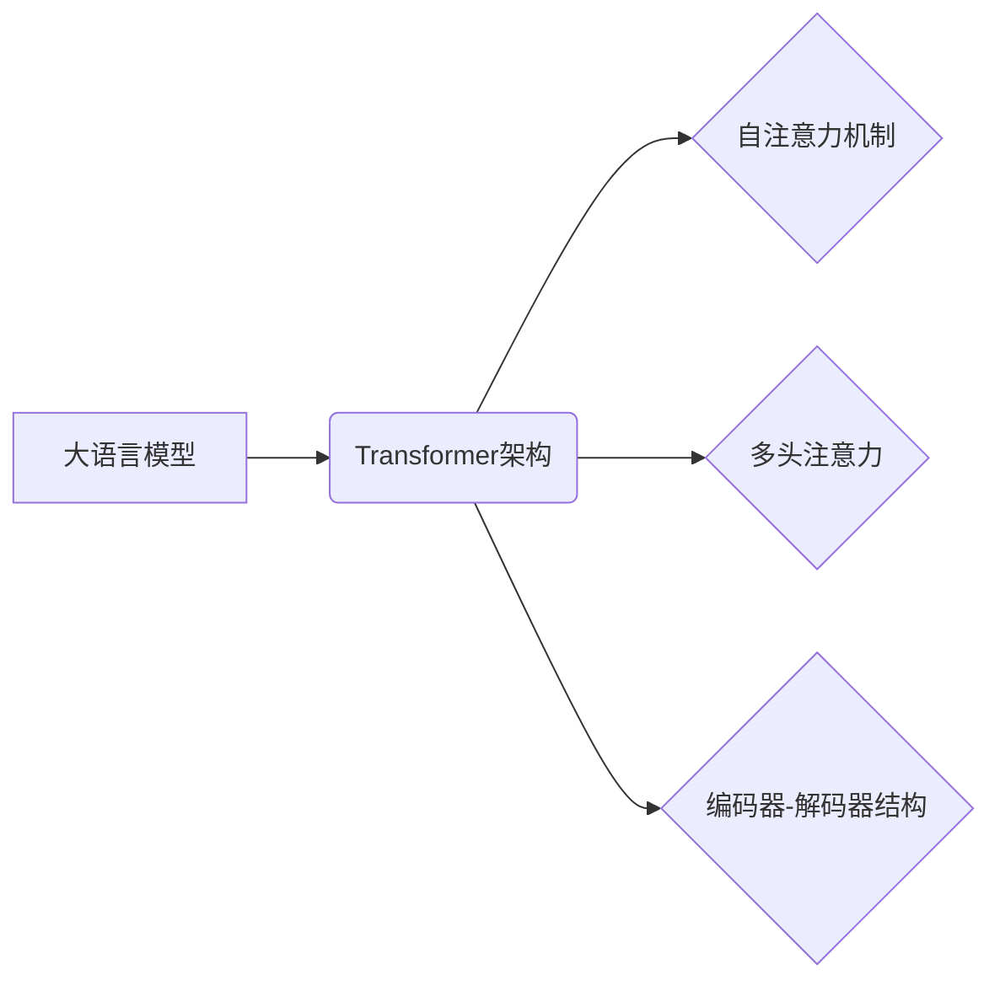

> 大语言模型，Transformer，自然语言处理，深度学习，BERT，GPT，语言理解，文本生成

## 1. 背景介绍

近年来，深度学习技术取得了飞速发展，尤其是在自然语言处理（NLP）领域取得了突破性进展。大语言模型（LLM）作为深度学习在NLP领域的代表性成果，展现出强大的文本理解和生成能力，在机器翻译、文本摘要、对话系统等领域取得了令人瞩目的成就。

传统的NLP模型主要依赖于手工设计的特征工程和规则化方法，难以捕捉语言的复杂性和语义关系。而LLM则通过训练海量文本数据，学习语言的潜在结构和规律，从而实现更准确、更自然的文本处理。

## 2. 核心概念与联系

**2.1  大语言模型（LLM）**

大语言模型是指在海量文本数据上训练的深度学习模型，能够理解和生成人类语言。其核心特点是：

* **规模庞大：** LLM通常拥有数十亿甚至数千亿个参数，参数数量与模型的能力密切相关。
* **文本理解能力强：** LLM能够理解文本的语义、语法和上下文关系，并进行文本分类、情感分析、问答等任务。
* **文本生成能力强：** LLM能够根据给定的文本提示生成流畅、连贯的文本，例如文章写作、对话生成、诗歌创作等。

**2.2  Transformer**

Transformer是一种新型的深度学习架构，专门设计用于处理序列数据，例如文本。其核心特点是：

* **自注意力机制：** Transformer通过自注意力机制，能够捕捉文本中不同词语之间的关系，理解上下文信息。
* **多头注意力：** Transformer使用多头注意力机制，可以从不同的角度捕捉文本信息，提高模型的表达能力。
* **编码器-解码器结构：** Transformer由编码器和解码器两部分组成，编码器负责对输入文本进行编码，解码器负责根据编码结果生成输出文本。

**2.3  核心概念联系**

LLM通常基于Transformer架构进行构建，例如BERT、GPT等模型。Transformer的强大能力使得LLM能够学习到更深层次的语言表示，从而实现更精细的文本理解和生成。



## 3. 核心算法原理 & 具体操作步骤

### 3.1  算法原理概述

Transformer的核心算法是自注意力机制，它能够捕捉文本中不同词语之间的关系，理解上下文信息。

自注意力机制通过计算每个词语与所有其他词语之间的“注意力权重”，来确定每个词语对其他词语的影响程度。注意力权重越高，表示两个词语之间的关系越密切。

### 3.2  算法步骤详解

1. **计算词嵌入：** 将每个词语映射到一个低维向量空间中，称为词嵌入。
2. **计算注意力权重：** 对于每个词语，计算它与所有其他词语之间的注意力权重。
3. **加权求和：** 根据注意力权重，对所有词语的嵌入进行加权求和，得到每个词语的上下文表示。
4. **多头注意力：** 使用多个自注意力头，分别计算不同角度的注意力权重，并将其拼接起来，得到更丰富的上下文表示。

### 3.3  算法优缺点

**优点：**

* 能够捕捉长距离依赖关系：自注意力机制能够捕捉文本中任意两个词语之间的关系，不受距离限制。
* 并行计算能力强：自注意力机制可以并行计算，提高训练效率。

**缺点：**

* 计算复杂度高：自注意力机制的计算量较大，训练成本较高。
* 容易过拟合：模型参数过多，容易过拟合训练数据。

### 3.4  算法应用领域

自注意力机制广泛应用于NLP领域，例如：

* 机器翻译
* 文本摘要
* 问答系统
* 对话系统
* 情感分析

## 4. 数学模型和公式 & 详细讲解 & 举例说明

### 4.1  数学模型构建

**4.1.1  词嵌入**

词嵌入将每个词语映射到一个低维向量空间中，例如词向量维度为128。

**4.1.2  注意力权重计算**

注意力权重计算公式如下：

$$
\text{Attention}(Q, K, V) = \text{softmax}\left(\frac{Q K^T}{\sqrt{d_k}}\right) V
$$

其中：

* $Q$：查询矩阵
* $K$：键矩阵
* $V$：值矩阵
* $d_k$：键向量的维度
* $\text{softmax}$：softmax函数

**4.1.3  多头注意力**

多头注意力机制使用多个自注意力头，分别计算不同角度的注意力权重，并将其拼接起来。

### 4.2  公式推导过程

注意力权重计算公式的推导过程如下：

1. 计算查询向量 $Q$ 与键向量 $K$ 的点积，得到一个得分矩阵。
2. 对得分矩阵进行归一化，得到注意力权重矩阵。
3. 将注意力权重矩阵与值向量 $V$ 进行加权求和，得到每个词语的上下文表示。

### 4.3  案例分析与讲解

假设我们有一个句子：“我爱学习编程”。

1. 将每个词语映射到词嵌入空间中。
2. 计算每个词语与所有其他词语之间的注意力权重。
3. 根据注意力权重，对所有词语的嵌入进行加权求和，得到每个词语的上下文表示。

例如，对于词语“学习”，其与“编程”的注意力权重较高，因为这两个词语在语义上相关。

## 5. 项目实践：代码实例和详细解释说明

### 5.1  开发环境搭建

* Python 3.7+
* PyTorch 1.7+
* CUDA 10.2+

### 5.2  源代码详细实现

```python
import torch
import torch.nn as nn

class Transformer(nn.Module):
    def __init__(self, vocab_size, embedding_dim, num_heads, num_layers):
        super(Transformer, self).__init__()
        self.embedding = nn.Embedding(vocab_size, embedding_dim)
        self.transformer_layers = nn.ModuleList([
            nn.TransformerEncoderLayer(embedding_dim, num_heads)
            for _ in range(num_layers)
        ])
        self.linear = nn.Linear(embedding_dim, vocab_size)

    def forward(self, x):
        x = self.embedding(x)
        for layer in self.transformer_layers:
            x = layer(x)
        x = self.linear(x)
        return x
```

### 5.3  代码解读与分析

* `__init__` 方法：初始化模型参数，包括词嵌入层、Transformer编码器层和线性输出层。
* `forward` 方法：定义模型的正向传播过程，将输入序列经过词嵌入层、Transformer编码器层和线性输出层，最终得到输出序列。

### 5.4  运行结果展示

训练模型后，可以将模型应用于文本生成、机器翻译等任务，并评估模型的性能。

## 6. 实际应用场景

### 6.1  机器翻译

LLM可以用于机器翻译，例如将英文文本翻译成中文。

### 6.2  文本摘要

LLM可以用于文本摘要，例如将长篇文章总结成简短的摘要。

### 6.3  对话系统

LLM可以用于构建对话系统，例如聊天机器人。

### 6.4  未来应用展望

LLM在未来将有更广泛的应用场景，例如：

* 代码生成
* 创意写作
* 个性化教育

## 7. 工具和资源推荐

### 7.1  学习资源推荐

* **书籍:**
    * 《深度学习》
    * 《自然语言处理》
* **在线课程:**
    * Coursera: 自然语言处理
    * Udacity: 深度学习

### 7.2  开发工具推荐

* **PyTorch:** 深度学习框架
* **TensorFlow:** 深度学习框架
* **HuggingFace:** 预训练模型库

### 7.3  相关论文推荐

* **BERT: Pre-training of Deep Bidirectional Transformers for Language Understanding**
* **GPT: Generative Pre-trained Transformer**
* **Attention Is All You Need**

## 8. 总结：未来发展趋势与挑战

### 8.1  研究成果总结

LLM取得了显著的进展，在文本理解和生成方面展现出强大的能力。

### 8.2  未来发展趋势

* 模型规模进一步扩大
* 训练数据质量提升
* 算法效率提高
* 多模态LLM发展

### 8.3  面临的挑战

* 训练成本高
* 容易过拟合
* 缺乏可解释性
* 伦理问题

### 8.4  研究展望

未来研究将重点关注：

* 更高效的训练方法
* 更鲁棒的模型
* 更强的可解释性
* 伦理规范的制定

## 9. 附录：常见问题与解答

### 9.1  什么是LLM？

LLM是指在海量文本数据上训练的深度学习模型，能够理解和生成人类语言。

### 9.2  Transformer是什么？

Transformer是一种新型的深度学习架构，专门设计用于处理序列数据，例如文本。

### 9.3  LLM的应用场景有哪些？

LLM的应用场景包括机器翻译、文本摘要、对话系统、情感分析等。

### 9.4  LLM的未来发展趋势是什么？

LLM的未来发展趋势包括模型规模扩大、训练数据质量提升、算法效率提高、多模态LLM发展等。


作者：禅与计算机程序设计艺术 / Zen and the Art of Computer Programming 
<end_of_turn>