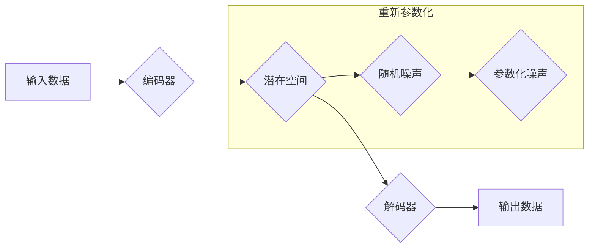

> 大语言模型，重新参数化，变分自编码器，概率图模型，神经网络，深度学习

## 1. 背景介绍

大语言模型（Large Language Models，LLMs）近年来在自然语言处理领域取得了显著进展，展现出强大的文本生成、翻译、摘要和问答能力。这些模型通常基于Transformer架构，拥有数十亿甚至千亿参数，通过海量文本数据进行训练，学习语言的复杂模式和结构。然而，训练和部署如此庞大的模型也带来了巨大的挑战，包括计算资源消耗、模型参数存储和推理效率等。

重新参数化技术（Reparameterization Trick）作为一种有效的技巧，在训练变分自编码器（Variational Autoencoders，VAEs）和生成对抗网络（Generative Adversarial Networks，GANs）等深度学习模型中得到了广泛应用。它通过巧妙地将随机噪声与模型参数分离，使得模型训练更加稳定，并能够有效地进行梯度更新。

## 2. 核心概念与联系

### 2.1  核心概念

* **大语言模型 (LLMs):** 拥有大量参数的深度学习模型，能够理解和生成人类语言。
* **重新参数化 (Reparameterization):**  一种技巧，将随机噪声与模型参数分离，使得模型训练更加稳定。
* **变分自编码器 (VAEs):** 一种生成模型，通过学习数据的潜在表示来生成新的数据样本。
* **概率图模型 (Probabilistic Graphical Models):** 用于表示随机变量之间的依赖关系的图模型。

### 2.2  核心架构



## 3. 核心算法原理 & 具体操作步骤

### 3.1  算法原理概述

重新参数化技巧的核心思想是将随机噪声与模型参数分离，从而使得模型训练更加稳定。传统的训练方法中，随机噪声直接被添加到模型的输出中，导致梯度更新不稳定。而重新参数化技巧则将随机噪声作为输入，通过一个参数化的函数将其映射到模型的输出空间，从而使得梯度更新更加稳定。

### 3.2  算法步骤详解

1. **输入数据:** 将输入数据输入到编码器中。
2. **编码:** 编码器将输入数据映射到一个潜在空间中。
3. **重新参数化:** 在潜在空间中，将随机噪声作为输入，通过一个参数化的函数将其映射到模型的输出空间。
4. **解码:** 解码器将重新参数化的潜在空间向量解码成输出数据。
5. **损失函数:** 计算模型输出与真实数据的差异，并使用梯度下降算法更新模型参数。

### 3.3  算法优缺点

**优点:**

* 训练更加稳定，能够有效地进行梯度更新。
* 可以使用变分推理方法进行训练，从而获得更精确的模型。

**缺点:**

* 需要额外的参数来控制随机噪声的分布。
* 对于某些类型的模型，重新参数化技巧可能不适用。

### 3.4  算法应用领域

* **生成模型:** VAEs、GANs
* **图像识别:** 图像分类、目标检测
* **自然语言处理:** 文本生成、机器翻译

## 4. 数学模型和公式 & 详细讲解 & 举例说明

### 4.1  数学模型构建

假设我们有一个输入数据 $x$，目标是学习一个潜在空间 $z$ 的分布 $p(z)$，并通过解码器 $g(z)$ 生成输出数据 $\hat{x}$。

* 编码器 $f(x)$ 将输入数据 $x$ 映射到潜在空间 $z$。
* 解码器 $g(z)$ 将潜在空间 $z$ 映射到输出空间 $\hat{x}$。

### 4.2  公式推导过程

* **编码器:** $z = f(x)$
* **解码器:** $\hat{x} = g(z)$

为了学习潜在空间 $z$ 的分布 $p(z)$，我们使用变分自编码器框架，并引入一个辅助分布 $q(z|x)$ 来近似 $p(z)$。

* **目标函数:** $L(x) = KL(q(z|x) || p(z)) + E_{z \sim q(z|x)}[D(x, g(z))]$

其中:

* $KL(q(z|x) || p(z))$ 是 $q(z|x)$ 和 $p(z)$ 之间的KL散度。
* $D(x, g(z))$ 是输入数据 $x$ 和解码器输出 $\hat{x}$ 之间的损失函数。

### 4.3  案例分析与讲解

假设我们使用一个简单的线性编码器和解码器，并将输入数据 $x$ 映射到一个一维潜在空间 $z$。

* **编码器:** $z = Wx + b$
* **解码器:** $\hat{x} = W'z + b'$

其中 $W$、$W'$、$b$ 和 $b'$ 是模型参数。

通过优化目标函数 $L(x)$，我们可以学习到编码器和解码器参数，从而实现对输入数据的压缩和重建。

## 5. 项目实践：代码实例和详细解释说明

### 5.1  开发环境搭建

* Python 3.7+
* TensorFlow 2.0+
* PyTorch 1.0+

### 5.2  源代码详细实现

```python
import tensorflow as tf

# 定义编码器
class Encoder(tf.keras.Model):
    def __init__(self, latent_dim):
        super(Encoder, self).__init__()
        self.dense1 = tf.keras.layers.Dense(128, activation='relu')
        self.dense2 = tf.keras.layers.Dense(latent_dim)

    def call(self, x):
        x = self.dense1(x)
        z = self.dense2(x)
        return z

# 定义解码器
class Decoder(tf.keras.Model):
    def __init__(self, latent_dim):
        super(Decoder, self).__init__()
        self.dense1 = tf.keras.layers.Dense(128, activation='relu')
        self.dense2 = tf.keras.layers.Dense(input_shape.shape[-1])

    def call(self, z):
        x = self.dense1(z)
        x = self.dense2(x)
        return x

# 实例化编码器和解码器
encoder = Encoder(latent_dim=10)
decoder = Decoder(latent_dim=10)

# 定义损失函数
def loss_function(x, x_recon):
    return tf.reduce_mean(tf.square(x - x_recon))

# 定义优化器
optimizer = tf.keras.optimizers.Adam(learning_rate=0.001)

# 训练循环
for epoch in range(100):
    for x in dataset:
        with tf.GradientTape() as tape:
            z = encoder(x)
            x_recon = decoder(z)
            loss = loss_function(x, x_recon)
        gradients = tape.gradient(loss, encoder.trainable_variables + decoder.trainable_variables)
        optimizer.apply_gradients(zip(gradients, encoder.trainable_variables + decoder.trainable_variables))
    print(f'Epoch {epoch+1}, Loss: {loss.numpy()}')
```

### 5.3  代码解读与分析

* **编码器和解码器:** 代码中定义了编码器和解码器模型，分别负责将输入数据映射到潜在空间和从潜在空间映射回输出空间。
* **损失函数:** 使用均方误差作为损失函数，衡量输入数据和解码器输出之间的差异。
* **优化器:** 使用Adam优化器来更新模型参数。
* **训练循环:** 训练循环中，将输入数据输入到编码器中，得到潜在空间向量，然后将潜在空间向量输入到解码器中，得到输出数据。计算损失函数并更新模型参数。

### 5.4  运行结果展示

训练完成后，可以将新的输入数据输入到模型中，得到相应的输出数据。

## 6. 实际应用场景

### 6.1  文本生成

* **故事创作:** 使用LLMs生成不同风格的故事。
* **对话系统:** 开发更自然、更流畅的对话系统。
* **代码生成:** 根据自然语言描述自动生成代码。

### 6.2  机器翻译

* **跨语言文本翻译:** 将文本从一种语言翻译成另一种语言。
* **多语言对话:** 支持多语言的对话系统。

### 6.3  文本摘要

* **新闻摘要:** 自动生成新闻文章的摘要。
* **会议记录:** 自动生成会议记录的摘要。

### 6.4  未来应用展望

* **个性化教育:** 根据学生的学习进度和风格定制个性化的学习内容。
* **医疗诊断:** 辅助医生进行疾病诊断和治疗方案制定。
* **科学研究:** 加速科学研究的进展，例如药物研发和材料科学。

## 7. 工具和资源推荐

### 7.1  学习资源推荐

* **书籍:**
    * 《深度学习》
    * 《自然语言处理》
* **在线课程:**
    * Coursera: 深度学习
    * Udacity: 自然语言处理
* **博客:**
    * The Gradient
    * Towards Data Science

### 7.2  开发工具推荐

* **TensorFlow:** 开源深度学习框架
* **PyTorch:** 开源深度学习框架
* **Hugging Face Transformers:** 预训练语言模型库

### 7.3  相关论文推荐

* **Attention Is All You Need:** https://arxiv.org/abs/1706.03762
* **BERT: Pre-training of Deep Bidirectional Transformers for Language Understanding:** https://arxiv.org/abs/1810.04805
* **GPT-3: Language Models are Few-Shot Learners:** https://arxiv.org/abs/2005.14165

## 8. 总结：未来发展趋势与挑战

### 8.1  研究成果总结

近年来，大语言模型在自然语言处理领域取得了显著进展，展现出强大的文本生成、翻译、摘要和问答能力。重新参数化技术在训练这些模型中发挥了重要作用，使得模型训练更加稳定，并能够有效地进行梯度更新。

### 8.2  未来发展趋势

* **模型规模:** 随着计算资源的不断发展，大语言模型的规模将继续扩大，从而提升模型的性能。
* **多模态学习:** 将文本与其他模态数据（例如图像、音频）相结合，开发更强大的多模态大语言模型。
* **可解释性:** 研究大语言模型的决策过程，提高模型的可解释性和透明度。

### 8.3  面临的挑战

* **计算资源:** 训练大型语言模型需要大量的计算资源，这对于资源有限的机构和个人来说是一个挑战。
* **数据获取:** 大语言模型需要海量文本数据进行训练，获取高质量的训练数据是一个挑战。
* **伦理问题:** 大语言模型可能被用于生成虚假信息、传播偏见和侵犯隐私，需要认真考虑其伦理问题。

### 8.4  研究展望

未来，大语言模型将继续朝着更强大、更智能的方向发展，并在更多领域发挥重要作用。研究者将继续探索新的模型架构、训练方法和应用场景，推动大语言模型技术的发展。

## 9. 附录：常见问题与解答

* **Q: 重新参数化技巧有什么优势？**

* **A:** 重新参数化技巧可以使得模型训练更加稳定，并能够有效地进行梯度更新。

*