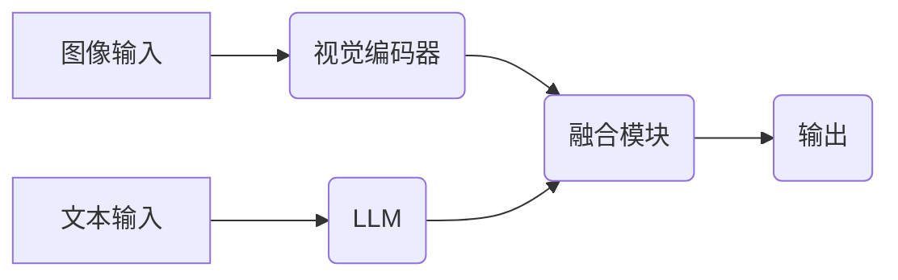

> 大语言模型、视觉增强、语言建模、Transformer、视觉理解、多模态学习、图像 captioning

## 1. 背景介绍

近年来，深度学习技术取得了飞速发展，特别是大语言模型（Large Language Models，LLMs）的出现，为自然语言处理（NLP）领域带来了革命性的变革。LLMs，如GPT-3、BERT、LaMDA等，通过训练海量文本数据，能够理解和生成人类语言，并在文本生成、机器翻译、问答系统等任务中表现出惊人的能力。

然而，LLMs主要依赖于文本信息，缺乏对视觉信息的理解和处理能力。而视觉信息是人类感知世界的重要来源，在许多应用场景中，文本和视觉信息是相互关联的。例如，在图像描述、视频理解、跨模态检索等任务中，融合视觉信息可以显著提升模型的性能。

因此，视觉增强语言建模（Vision-Enhanced Language Modeling）成为一个重要的研究方向。该领域旨在通过融合视觉信息，提升LLMs的理解和生成能力，使其能够更好地处理文本和视觉混合的任务。

## 2. 核心概念与联系

**2.1 核心概念**

* **大语言模型 (LLM):** 训练于海量文本数据的大型神经网络模型，能够理解和生成人类语言。
* **视觉增强 (Vision Enhancement):** 利用视觉信息来提升LLMs的性能，使其能够更好地理解和处理文本和视觉混合的任务。
* **语言建模 (Language Modeling):** 预测下一个词的概率，用于文本生成、机器翻译等任务。
* **多模态学习 (Multimodal Learning):** 学习多种模态数据（如文本、图像、音频等）之间的关系，提升模型的泛化能力。

**2.2 架构关系**



**2.3 核心联系**

视觉增强语言建模的核心是将视觉信息与文本信息融合，提升LLMs的理解和生成能力。

* **视觉编码器:** 将图像转换为可供LLM理解的特征向量。
* **融合模块:** 将文本特征和视觉特征融合，形成综合的表示。
* **输出层:** 根据融合后的表示，生成文本输出。

## 3. 核心算法原理 & 具体操作步骤

### 3.1 算法原理概述

视觉增强语言建模主要采用以下两种核心算法：

* **自编码器 (Autoencoder):** 将图像编码成低维特征向量，然后解码成重建图像。通过训练自编码器，可以学习到图像的本质特征。
* **Transformer:** 是一种基于注意力机制的神经网络架构，能够处理序列数据，并学习长距离依赖关系。

### 3.2 算法步骤详解

**3.2.1 自编码器**

1. **编码器:** 将图像输入到编码器中，通过多层卷积神经网络 (CNN) 提取图像特征。
2. **解码器:** 将编码器输出的特征向量输入到解码器中，通过反卷积神经网络 (Deconvolutional Neural Network) 重建图像。
3. **损失函数:** 使用均方误差 (MSE) 或其他损失函数，计算重建图像与原始图像之间的差异。
4. **训练:** 通过反向传播算法，更新编码器和解码器的参数，使重建图像与原始图像尽可能接近。

**3.2.2 Transformer**

1. **图像编码:** 将图像输入到视觉编码器中，提取图像特征。
2. **文本编码:** 将文本输入到文本编码器中，提取文本特征。
3. **融合:** 将图像特征和文本特征融合，形成综合的表示。
4. **解码:** 使用解码器生成文本输出。
5. **损失函数:** 使用交叉熵损失函数或其他损失函数，计算生成文本与真实文本之间的差异。
6. **训练:** 通过反向传播算法，更新模型参数，使生成文本与真实文本尽可能接近。

### 3.3 算法优缺点

**3.3.1 自编码器**

* **优点:** 能够学习到图像的本质特征，并进行图像重建。
* **缺点:** 训练复杂，需要大量的训练数据。

**3.3.2 Transformer**

* **优点:** 能够处理长距离依赖关系，并学习复杂的文本和视觉关系。
* **缺点:** 训练成本高，参数量大。

### 3.4 算法应用领域

* **图像描述:** 自动生成图像的文字描述。
* **视频理解:** 理解视频内容，并生成文本摘要。
* **跨模态检索:** 根据文本查询，检索相关的图像或视频。
* **机器人视觉:** 帮助机器人理解和交互视觉信息。

## 4. 数学模型和公式 & 详细讲解 & 举例说明

### 4.1 数学模型构建

视觉增强语言建模的数学模型通常基于以下几个核心模块：

* **视觉编码器:** 使用CNN提取图像特征，可以表示为：

$$
\mathbf{v} = f_{\theta_v}(\mathbf{I})
$$

其中，$\mathbf{I}$ 是输入图像，$f_{\theta_v}$ 是视觉编码器，$\theta_v$ 是编码器的参数，$\mathbf{v}$ 是图像特征向量。

* **文本编码器:** 使用Transformer提取文本特征，可以表示为：

$$
\mathbf{t} = f_{\theta_t}(\mathbf{w})
$$

其中，$\mathbf{w}$ 是输入文本，$f_{\theta_t}$ 是文本编码器，$\theta_t$ 是编码器的参数，$\mathbf{t}$ 是文本特征向量。

* **融合模块:** 将视觉特征和文本特征融合，可以采用多种方法，例如：

$$
\mathbf{h} = \mathbf{v} \oplus \mathbf{t}
$$

其中，$\oplus$ 表示融合操作，$\mathbf{h}$ 是融合后的特征向量。

* **输出层:** 根据融合后的特征向量生成文本输出，可以表示为：

$$
\mathbf{y} = f_{\theta_o}(\mathbf{h})
$$

其中，$f_{\theta_o}$ 是输出层，$\theta_o$ 是输出层的参数，$\mathbf{y}$ 是生成文本。

### 4.2 公式推导过程

具体的公式推导过程取决于具体的模型架构和任务。例如，图像描述任务中，输出层通常是一个语言模型，其目标是最大化生成文本与真实描述之间的概率。

### 4.3 案例分析与讲解

例如，在图像描述任务中，可以使用预训练的视觉编码器和语言模型，并训练一个融合模块来生成图像描述。

## 5. 项目实践：代码实例和详细解释说明

### 5.1 开发环境搭建

* Python 3.7+
* PyTorch 1.7+
* CUDA 10.2+

### 5.2 源代码详细实现

```python
import torch
import torch.nn as nn

class VisionEncoder(nn.Module):
    def __init__(self):
        super(VisionEncoder, self).__init__()
        # ... (定义视觉编码器网络结构)

    def forward(self, x):
        # ... (定义视觉编码器前向传播过程)

class TextEncoder(nn.Module):
    def __init__(self):
        super(TextEncoder, self).__init__()
        # ... (定义文本编码器网络结构)

    def forward(self, x):
        # ... (定义文本编码器前向传播过程)

class FusionModule(nn.Module):
    def __init__(self):
        super(FusionModule, self).__init__()
        # ... (定义融合模块网络结构)

    def forward(self, v, t):
        # ... (定义融合模块前向传播过程)

class ImageCaptioningModel(nn.Module):
    def __init__(self):
        super(ImageCaptioningModel, self).__init__()
        self.vision_encoder = VisionEncoder()
        self.text_encoder = TextEncoder()
        self.fusion_module = FusionModule()
        self.output_layer = nn.Linear(512, vocab_size)

    def forward(self, image, text):
        v = self.vision_encoder(image)
        t = self.text_encoder(text)
        h = self.fusion_module(v, t)
        y = self.output_layer(h)
        return y
```

### 5.3 代码解读与分析

* **VisionEncoder:** 负责提取图像特征。
* **TextEncoder:** 负责提取文本特征。
* **FusionModule:** 将视觉特征和文本特征融合。
* **OutputLayer:** 根据融合后的特征向量生成文本输出。

### 5.4 运行结果展示

运行代码后，模型可以生成图像描述。

## 6. 实际应用场景

### 6.1 图像描述

自动生成图像的文字描述，例如为盲人生成图像描述，为搜索引擎提供图像标签。

### 6.2 视频理解

理解视频内容，并生成文本摘要，例如自动生成视频字幕，为视频内容进行分类和检索。

### 6.3 跨模态检索

根据文本查询，检索相关的图像或视频，例如根据关键词搜索图片，根据电影情节搜索相关视频。

### 6.4 未来应用展望

* **增强现实 (AR) 和虚拟现实 (VR):** 为AR/VR体验提供更丰富的交互和内容。
* **智能家居:** 帮助智能家居设备更好地理解用户需求。
* **医疗保健:** 辅助医生诊断疾病，并提供个性化的治疗方案。

## 7. 工具和资源推荐

### 7.1 学习资源推荐

* **书籍:**
    * Deep Learning
    * Speech and Language Processing
* **课程:**
    * Stanford CS231n: Convolutional Neural Networks for Visual Recognition
    * MIT 6.S191: Introduction to Deep Learning

### 7.2 开发工具推荐

* **PyTorch:** 深度学习框架
* **TensorFlow:** 深度学习框架
* **OpenCV:** 图像处理库

### 7.3 相关论文推荐

* **Attention Is All You Need:** https://arxiv.org/abs/1706.03762
* **BERT: Pre-training of Deep Bidirectional Transformers for Language Understanding:** https://arxiv.org/abs/1810.04805
* **Vision Transformer (ViT):** https://arxiv.org/abs/2010.11929

## 8. 总结：未来发展趋势与挑战

### 8.1 研究成果总结

视觉增强语言建模取得了显著进展，在图像描述、视频理解等任务中取得了优异的性能。

### 8.2 未来发展趋势

* **更强大的模型:** 开发更强大的视觉和语言模型，提升模型的性能和泛化能力。
* **跨模态知识融合:** 探索更有效的跨模态知识融合方法，提升模型对多模态信息的理解能力。
* **场景理解:** 将视觉增强语言建模应用于更复杂的场景理解任务，例如机器人导航、自动驾驶等。

### 8.3 面临的挑战

* **数据标注:** 跨模态数据标注成本高，缺乏高质量的标注数据。
* **模型训练:** 训练大型视觉增强语言模型需要大量的计算资源。
* **解释性:** 视觉增强语言模型的决策过程难以解释，缺乏可解释性。

### 8.4 研究展望

未来，视觉增强语言建模将继续是一个重要的研究方向，有望在人工智能领域带来革命性的变革。


## 9. 附录：常见问题与解答

**9.1 如何选择合适的视觉编码器和文本编码器？**

选择合适的视觉编码器和文本编码器取决于具体的应用场景和任务需求。

**9.2 如何解决跨模态数据标注问题？**

可以使用数据增强技术、主动学习等方法来解决跨模态数据标注问题。

**9.3 如何评估视觉增强语言