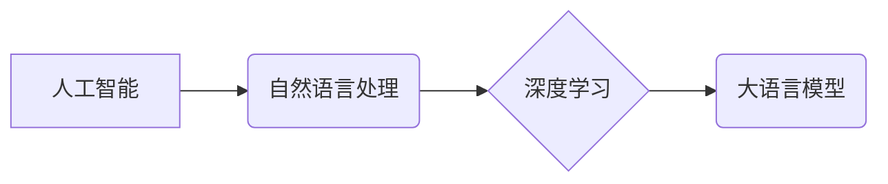

> 大语言模型、人工智能、深度学习、自然语言处理、Transformer、BERT、GPT、LaMDA、应用场景、未来趋势

## 1. 背景介绍

人工智能（AI）作为一项颠覆性技术，近年来取得了令人瞩目的进展。其中，大语言模型（LLM）作为AI领域的新星，凭借其强大的文本生成、理解和翻译能力，迅速引起了广泛关注。从早期基于规则的自然语言处理（NLP）系统到如今的基于深度学习的LLM，人工智能在处理语言方面取得了飞跃式进步。

LLM的出现标志着人工智能进入了一个新的时代。它们能够理解和生成人类语言，并完成各种复杂的任务，例如：

* **文本生成:** 写作故事、诗歌、文章、代码等。
* **文本摘要:** 提取文本的关键信息，生成简洁的摘要。
* **机器翻译:** 将文本从一种语言翻译成另一种语言。
* **问答系统:** 回答用户提出的问题，提供相关信息。
* **对话系统:** 与用户进行自然流畅的对话，提供个性化服务。

LLM的应用前景广阔，它将深刻地改变我们的生活方式，并推动各个行业的发展。

## 2. 核心概念与联系

**2.1 自然语言处理 (NLP)**

NLP是人工智能的一个分支，旨在使计算机能够理解、处理和生成人类语言。NLP的任务包括：

* **文本分类:** 将文本归类到预定义的类别中。
* **情感分析:** 分析文本表达的情感倾向。
* **命名实体识别:** 从文本中识别出实体，例如人名、地名、组织名等。
* **文本相似度计算:** 计算两个文本之间的相似度。

**2.2 深度学习 (Deep Learning)**

深度学习是机器学习的一种高级形式，它利用多层神经网络来学习数据中的复杂模式。深度学习在NLP领域取得了突破性进展，例如：

* **词嵌入:** 将单词映射到向量空间，捕捉单词之间的语义关系。
* **循环神经网络 (RNN):** 处理序列数据，例如文本，并学习文本中的上下文信息。
* **Transformer:** 了一种新型的网络架构，能够有效地处理长文本序列，并取得了优异的性能。

**2.3 大语言模型 (LLM)**

LLM是一种基于深度学习的强大语言模型，它被训练在海量文本数据上，能够理解和生成人类语言。LLM的特点包括：

* **规模庞大:** LLM通常拥有数十亿甚至数千亿个参数。
* **多任务学习:** LLM能够执行多种NLP任务，例如文本生成、翻译、问答等。
* **零样本学习:** LLM能够在没有特定任务训练数据的情况下，通过少量示例学习新的任务。

**2.4  核心概念关系图**



## 3. 核心算法原理 & 具体操作步骤

### 3.1  算法原理概述

LLM的核心算法是基于Transformer架构的深度神经网络。Transformer网络利用注意力机制来捕捉文本中的长距离依赖关系，并通过多头注意力机制和编码器-解码器结构来实现高效的文本处理。

### 3.2  算法步骤详解

1. **词嵌入:** 将输入文本中的每个单词映射到一个向量空间，捕捉单词的语义信息。
2. **编码器:** 将词嵌入序列输入到编码器中，编码器通过多层Transformer模块，学习文本的上下文信息和语义表示。
3. **解码器:** 将编码器的输出作为输入，解码器通过多层Transformer模块，生成目标文本序列。
4. **损失函数:** 使用交叉熵损失函数来衡量模型的预测结果与真实文本之间的差异。
5. **反向传播:** 使用梯度下降算法来更新模型参数，降低损失函数的值。

### 3.3  算法优缺点

**优点:**

* **强大的文本理解和生成能力:** Transformer架构能够有效地捕捉文本中的长距离依赖关系，从而实现更准确的文本理解和生成。
* **多任务学习能力:** LLM能够在多种NLP任务上取得优异的性能，例如文本生成、翻译、问答等。
* **零样本学习能力:** LLM能够在没有特定任务训练数据的情况下，通过少量示例学习新的任务。

**缺点:**

* **训练成本高:** LLM的规模庞大，训练需要大量的计算资源和时间。
* **数据依赖性强:** LLM的性能取决于训练数据的质量和数量。
* **可解释性差:** LLM的决策过程较为复杂，难以解释其生成的文本背后的逻辑。

### 3.4  算法应用领域

LLM在各个领域都有广泛的应用，例如：

* **自然语言理解:** 文本分类、情感分析、问答系统、机器翻译等。
* **文本生成:** 写作故事、诗歌、文章、代码等。
* **对话系统:** 与用户进行自然流畅的对话，提供个性化服务。
* **教育:** 自动生成学习材料、提供个性化辅导等。
* **医疗:** 分析病历、辅助诊断等。

## 4. 数学模型和公式 & 详细讲解 & 举例说明

### 4.1  数学模型构建

LLM的数学模型主要基于概率论和统计学。其核心思想是学习一个概率分布，该分布能够描述文本序列的生成概率。

**4.1.1  条件概率:**

LLM学习文本序列的条件概率分布，即给定前文的情况下，预测下一个词的概率。

$$P(w_t | w_{1:t-1})$$

其中，$w_t$ 是第t个词，$w_{1:t-1}$ 是前t-1个词组成的序列。

**4.1.2  语言模型:**

LLM可以看作是一个语言模型，其目标是最大化给定训练数据的似然概率。

$$L = \prod_{i=1}^{N} P(w_i | w_{1:i-1})$$

其中，N 是训练数据的长度。

### 4.2  公式推导过程

LLM的训练过程通常使用梯度下降算法，通过反向传播来更新模型参数。

**4.2.1  梯度下降:**

$$ \theta = \theta - \alpha \nabla L(\theta) $$

其中，$\theta$ 是模型参数，$\alpha$ 是学习率，$\nabla L(\theta)$ 是损失函数的梯度。

**4.2.2  反向传播:**

反向传播算法用于计算梯度，它通过链式法则将损失函数的梯度传播到模型参数。

### 4.3  案例分析与讲解

**4.3.1  文本生成:**

给定一个文本开头，例如“今天天气真好”，LLM可以根据训练数据预测下一个词，例如“阳光”。

**4.3.2  机器翻译:**

LLM可以学习英语和中文之间的语义关系，将英语文本翻译成中文。

## 5. 项目实践：代码实例和详细解释说明

### 5.1  开发环境搭建

* **操作系统:** Linux/macOS
* **编程语言:** Python
* **深度学习框架:** TensorFlow/PyTorch
* **其他工具:** Git、Jupyter Notebook

### 5.2  源代码详细实现

```python
# 使用 TensorFlow 实现一个简单的文本生成模型

import tensorflow as tf

# 定义模型结构
model = tf.keras.Sequential([
    tf.keras.layers.Embedding(input_dim=vocab_size, output_dim=embedding_dim),
    tf.keras.layers.LSTM(units=lstm_units),
    tf.keras.layers.Dense(units=vocab_size, activation='softmax')
])

# 编译模型
model.compile(optimizer='adam', loss='sparse_categorical_crossentropy', metrics=['accuracy'])

# 训练模型
model.fit(x_train, y_train, epochs=epochs)

# 生成文本
def generate_text(seed_text, num_words):
    for _ in range(num_words):
        # 将种子文本转换为词向量
        encoded_text = model.layers[0].embeddings.get_weights()[0][vocab_to_index[seed_text[-1]]]
        # 使用 LSTM 生成下一个词
        prediction = model.predict(tf.expand_dims(encoded_text, axis=0))
        # 选择概率最高的词
        predicted_index = tf.argmax(prediction[0]).numpy()
        # 将词转换为文本
        predicted_word = index_to_vocab[predicted_index]
        # 添加到种子文本
        seed_text += ' ' + predicted_word
    return seed_text
```

### 5.3  代码解读与分析

* **模型结构:** 代码中定义了一个简单的文本生成模型，它包含嵌入层、LSTM层和全连接层。
* **训练过程:** 模型使用Adam优化器和交叉熵损失函数进行训练。
* **文本生成:** `generate_text`函数使用模型生成文本，它将种子文本转换为词向量，并使用LSTM层生成下一个词。

### 5.4  运行结果展示

运行代码后，可以生成一些基于训练数据的文本。

## 6. 实际应用场景

### 6.1  聊天机器人

LLM可以用于构建更智能的聊天机器人，能够进行自然流畅的对话，并提供更个性化的服务。

### 6.2  文本摘要

LLM可以自动生成文本摘要，提取文本的关键信息，节省用户的时间和精力。

### 6.3  机器翻译

LLM可以实现更准确的机器翻译，突破语言障碍，促进跨文化交流。

### 6.4  未来应用展望

LLM的应用前景广阔，未来将应用于更多领域，例如：

* **教育:** 个性化学习、自动生成学习材料。
* **医疗:** 分析病历、辅助诊断、提供医疗建议。
* **法律:** 分析法律文件、预测案件结果。
* **艺术创作:** 生成诗歌、小说、音乐等。

## 7. 工具和资源推荐

### 7.1  学习资源推荐

* **书籍:**
    * 《深度学习》
    * 《自然语言处理》
    * 《Transformer模型》
* **在线课程:**
    * Coursera: 深度学习
    * edX: 自然语言处理
    * fast.ai: 深度学习

### 7.2  开发工具推荐

* **深度学习框架:** TensorFlow, PyTorch
* **文本处理工具:** NLTK, SpaCy
* **代码编辑器:** VS Code, Sublime Text

### 7.3  相关论文推荐

* **Attention Is All You Need:** https://arxiv.org/abs/1706.03762
* **BERT: Pre-training of Deep Bidirectional Transformers for Language Understanding:** https://arxiv.org/abs/1810.04805
* **GPT-3: Language Models are Few-Shot Learners:** https://arxiv.org/abs/2005.14165

## 8. 总结：未来发展趋势与挑战

### 8.1  研究成果总结

LLM在文本理解和生成方面取得了显著的进展，其应用场景不断扩展，对人工智能发展具有重要意义。

### 8.2  未来发展趋势

* **模型规模更大:** 随着计算资源的提升，LLM的规模将进一步扩大，性能将得到进一步提升。
* **多模态学习:** LLM将与其他模态数据，例如图像、音频、视频等进行融合，实现更全面的理解和生成。
* **可解释性增强:** 研究人员将致力于提高LLM的可解释性，使其决策过程更加透明。

### 8.3  面临的挑战

* **数据安全和隐私:** LLM的训练需要大量数据，如何保证数据安全和隐私是一个重要挑战。
* **伦理问题:** LLM的应用可能带来一些伦理问题，例如信息操纵、偏见放大等，需要引起重视。
* **可访问性:** 如何让LLM技术更易于普及和使用，是一个