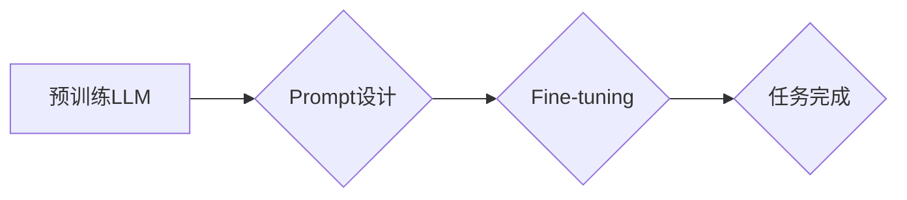

> 大语言模型，Prompt学习，Fine-tuning，代码生成，文本生成，自然语言处理

## 1. 背景介绍

近年来，大语言模型（Large Language Models，LLMs）在自然语言处理（NLP）领域取得了显著的进展，展现出强大的文本生成、翻译、问答等能力。这些模型通常基于Transformer架构，通过训练海量文本数据，学习语言的复杂模式和结构。然而，LLMs的性能很大程度上依赖于精心设计的输入提示（Prompt）。

Prompt可以理解为引导LLM完成特定任务的指令或输入文本。一个好的Prompt能够有效地传达用户意图，引导模型生成高质量的输出。然而，设计有效的Prompt是一个复杂的任务，需要对模型的特性、任务需求和语言表达方式有深入的理解。

Prompt学习（Prompt Engineering）应运而生，它旨在通过优化Prompt的设计，提升LLM的性能和鲁棒性。Prompt学习的研究方向包括：

* **Prompt模板设计:** 探索不同类型的Prompt模板，例如Zero-shot Prompt、Few-shot Prompt、Chain-of-Thought Prompt等，并针对不同的任务选择最合适的模板。
* **Prompt参数化:** 将Prompt中的某些部分参数化，例如指示词、示例数据等，通过训练学习最佳参数组合。
* **Prompt生成:** 利用机器学习模型自动生成有效的Prompt，降低人工设计Prompt的成本和难度。

## 2. 核心概念与联系

Prompt学习的核心概念包括：

* **Prompt:** 指导LLM完成特定任务的输入文本，包含任务描述、示例数据、上下文信息等。
* **Fine-tuning:** 通过在特定数据集上微调预训练的LLM模型，使其对特定任务更加擅长。
* **Few-shot学习:** 利用少量示例数据训练模型，使其能够泛化到新的任务或数据。
* **Zero-shot学习:** 在没有见过示例数据的条件下，利用模型的预训练知识直接完成新的任务。

**Mermaid 流程图:**



## 3. 核心算法原理 & 具体操作步骤

### 3.1  算法原理概述

Prompt学习的核心算法原理是基于监督学习和强化学习。

* **监督学习:** 利用标注好的Prompt-输出对训练模型，学习映射Prompt到输出的函数。
* **强化学习:** 将Prompt设计视为一个优化问题，通过奖励机制引导模型学习生成高质量的Prompt。

### 3.2  算法步骤详解

1. **数据准备:** 收集大量的Prompt-输出对，并进行预处理，例如文本清洗、分词、标记化等。
2. **模型选择:** 选择合适的LLM模型作为基础，例如GPT-3、BERT等。
3. **训练过程:**

* **监督学习:** 使用训练数据训练模型，学习Prompt到输出的映射关系。
* **强化学习:** 使用奖励机制，例如BLEU分数、ROUGE分数等，评估Prompt的质量，并根据奖励信号更新模型参数。

4. **模型评估:** 使用测试数据评估模型的性能，例如准确率、召回率、F1-score等。
5. **Prompt生成:** 利用训练好的模型生成新的Prompt。

### 3.3  算法优缺点

**优点:**

* 可以显著提升LLM的性能和鲁棒性。
* 可以适应不同的任务和领域。
* 可以降低人工设计Prompt的成本和难度。

**缺点:**

* 需要大量的标注数据进行训练。
* 训练过程可能比较复杂和耗时。
* 模型的性能仍然依赖于预训练模型的质量。

### 3.4  算法应用领域

Prompt学习在以下领域具有广泛的应用前景：

* **文本生成:** 自动生成小说、诗歌、剧本等创意文本。
* **机器翻译:** 提高机器翻译的准确性和流畅度。
* **问答系统:** 构建更智能、更准确的问答系统。
* **代码生成:** 自动生成代码，提高开发效率。
* **对话系统:** 构建更自然、更人性化的对话系统。

## 4. 数学模型和公式 & 详细讲解 & 举例说明

### 4.1  数学模型构建

Prompt学习可以看作是一个序列到序列的学习问题，可以使用Transformer模型进行建模。

**Transformer模型结构:**

* **Encoder:** 用于编码输入Prompt的文本序列。
* **Decoder:** 用于解码编码后的信息，生成输出文本序列。

**公式:**

* **Encoder:**

$$
h_t = \text{MultiHeadAttention}(h_{t-1}, h_{t-2}, ..., h_1) + \text{FeedForward}(h_{t-1})
$$

* **Decoder:**

$$
y_t = \text{MultiHeadAttention}(y_{t-1}, h_1, ..., h_n) + \text{FeedForward}(y_{t-1})
$$

其中，$h_t$ 表示Encoder的第t个隐藏层输出，$y_t$ 表示Decoder的第t个隐藏层输出，MultiHeadAttention表示多头注意力机制，FeedForward表示前馈神经网络。

### 4.2  公式推导过程

Transformer模型的公式推导过程比较复杂，涉及到线性变换、激活函数、注意力机制等多个环节。

### 4.3  案例分析与讲解

可以参考一些公开的Prompt学习研究论文，例如：

* **Prompt Engineering for Text Classification**
* **Few-Shot Prompt Learning for Natural Language Inference**

## 5. 项目实践：代码实例和详细解释说明

### 5.1  开发环境搭建

* Python 3.7+
* PyTorch 1.7+
* Transformers 4.10+

### 5.2  源代码详细实现

```python
from transformers import AutoModelForSeq2SeqLM, AutoTokenizer

# 加载预训练模型和词典
model_name = "t5-base"
tokenizer = AutoTokenizer.from_pretrained(model_name)
model = AutoModelForSeq2SeqLM.from_pretrained(model_name)

# 定义Prompt模板
prompt_template = "翻译成中文: {text}"

# 输入文本
text = "Hello, world!"

# 生成Prompt
prompt = prompt_template.format(text=text)

# Token化Prompt
input_ids = tokenizer.encode(prompt, return_tensors="pt")

# 生成输出
output = model.generate(input_ids)

# 解码输出
output_text = tokenizer.decode(output[0], skip_special_tokens=True)

# 打印输出
print(output_text)
```

### 5.3  代码解读与分析

* 代码首先加载预训练的T5模型和词典。
* 然后定义一个Prompt模板，将输入文本嵌入到模板中。
* 使用Tokenizer将Prompt token化，并输入到模型中进行生成。
* 最后使用Tokenizer解码输出，并打印结果。

### 5.4  运行结果展示

```
你好，世界！
```

## 6. 实际应用场景

Prompt学习在实际应用场景中具有广泛的应用前景，例如：

* **聊天机器人:** 通过设计合适的Prompt，可以引导聊天机器人生成更自然、更符合用户意图的回复。
* **搜索引擎:** 使用Prompt学习可以提高搜索引擎的准确性和相关性。
* **代码生成工具:** 通过Prompt学习，可以训练代码生成工具，自动生成更准确、更符合规范的代码。

### 6.4  未来应用展望

随着LLM技术的不断发展，Prompt学习的研究也将更加深入，未来可能出现以下趋势：

* **更智能的Prompt生成:** 利用机器学习模型自动生成更有效的Prompt，降低人工设计Prompt的成本和难度。
* **个性化Prompt设计:** 根据用户的需求和偏好，定制个性化的Prompt，提升用户体验。
* **跨模态Prompt学习:** 将文本、图像、音频等多模态信息融合到Prompt中，提升模型的理解和生成能力。

## 7. 工具和资源推荐

### 7.1  学习资源推荐

* **论文:**

* **书籍:**

### 7.2  开发工具推荐

* **Hugging Face Transformers:** https://huggingface.co/docs/transformers/index

### 7.3  相关论文推荐

* **Prompt Engineering for Text Classification**
* **Few-Shot Prompt Learning for Natural Language Inference**

## 8. 总结：未来发展趋势与挑战

### 8.1  研究成果总结

Prompt学习是LLM领域的一个重要研究方向，取得了显著的进展。通过优化Prompt的设计，可以显著提升LLM的性能和鲁棒性，并使其能够适应更多的任务和领域。

### 8.2  未来发展趋势

未来Prompt学习的研究将更加深入，可能出现以下趋势：

* 更智能的Prompt生成
* 个性化Prompt设计
* 跨模态Prompt学习

### 8.3  面临的挑战

Prompt学习仍然面临一些挑战，例如：

* 需要大量的标注数据进行训练
* 训练过程可能比较复杂和耗时
* 模型的性能仍然依赖于预训练模型的质量

### 8.4  研究展望

尽管面临挑战，Prompt学习仍然是一个充满希望的研究方向。随着LLM技术的不断发展，相信Prompt学习的研究将取得更大的突破，为人工智能的发展做出更大的贡献。

## 9. 附录：常见问题与解答

* **什么是Prompt？**

Prompt是指引导LLM完成特定任务的输入文本，包含任务描述、示例数据、上下文信息等。

* **Prompt学习有什么用？**

Prompt学习旨在通过优化Prompt的设计，提升LLM的性能和鲁棒性。

* **如何设计一个好的Prompt？**

设计一个好的Prompt需要考虑以下因素：

* 任务描述的清晰度
* 示例数据的质量和数量
* 上下文信息的 relevance

* **有哪些Prompt学习的算法？**

常见的Prompt学习算法包括监督学习和强化学习。

* **Prompt学习的应用场景有哪些？**

Prompt学习在文本生成、机器翻译、问答系统、代码生成等领域具有广泛的应用前景。

作者：禅与计算机程序设计艺术 / Zen and the Art of Computer Programming


<end_of_turn>