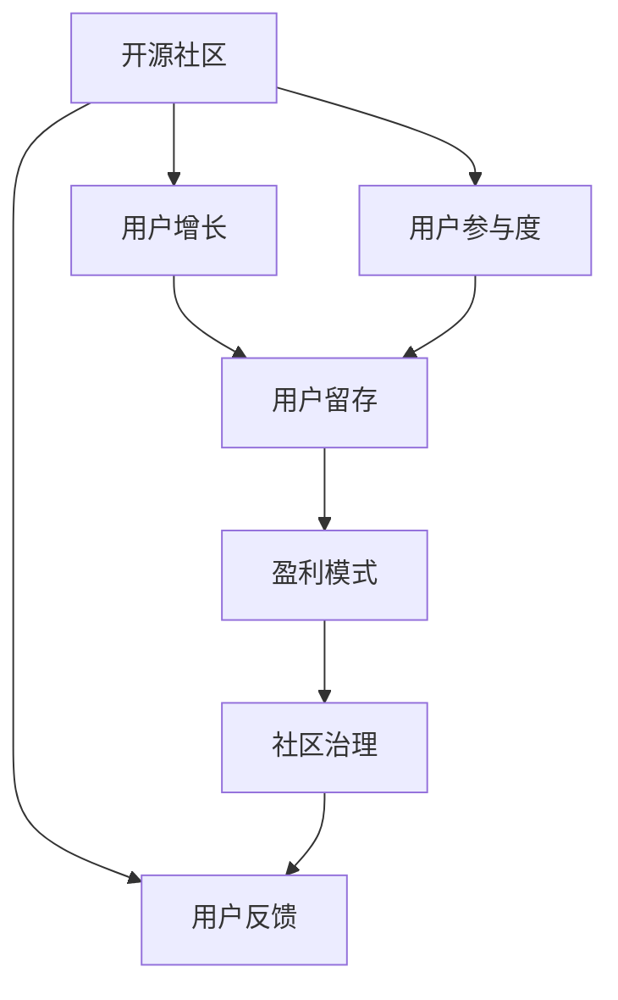
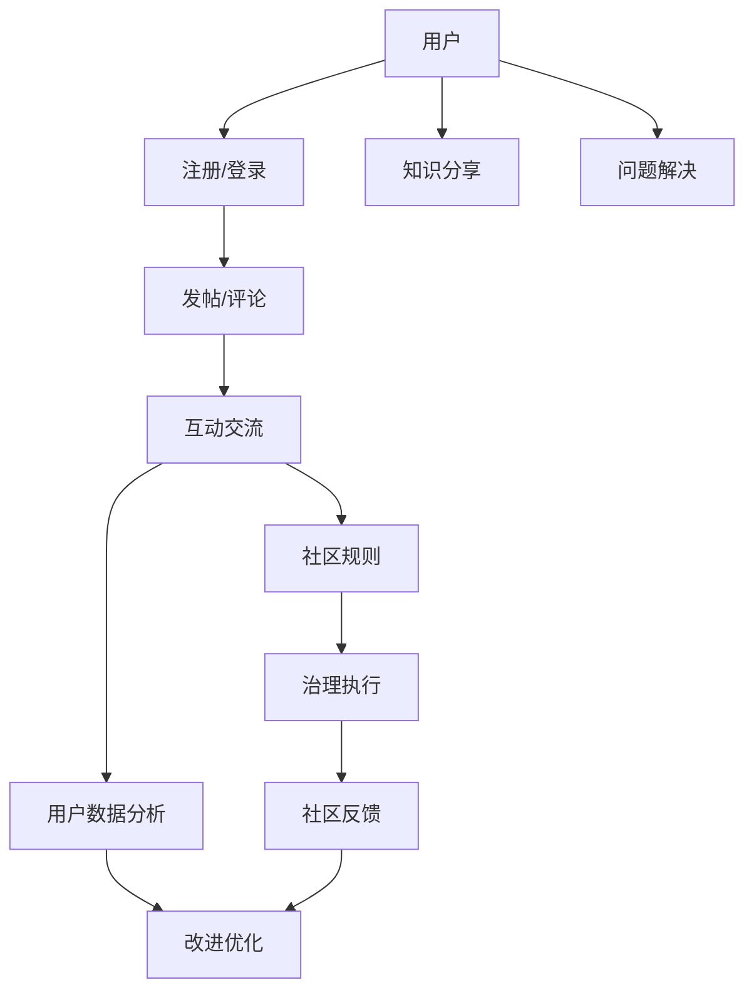

                 

# 创建开源项目的在线论坛：社区参与和盈利模式

> 关键词：开源社区, 论坛平台, 社区参与, 盈利模式, 用户增长, 用户留存, 用户体验, 广告收入, 付费订阅, 生态系统

## 1. 背景介绍

随着开源社区的日益壮大，在线论坛平台成为了连接开发者和社区成员、交流技术、合作项目的重要渠道。然而，优秀的在线论坛平台不仅需要提供优质的内容和便捷的交互方式，还需要构建一个健康的社区生态，以促进社区参与和可持续发展。本文将从社区参与和盈利模式两个维度，探讨如何创建和维护一个成功的开源项目在线论坛。

## 2. 核心概念与联系

### 2.1 核心概念概述

在线论坛平台是一个以内容为中心的社交网络，通过帖子、评论、点赞、投票等交互方式，实现信息共享和社区交流。它不仅是开发者分享知识和经验的平台，也是开发者社区的聚集地。构建一个成功的在线论坛平台需要考虑以下几个核心概念：

- **开源社区**：基于开源理念和协作精神构建的开发者社区，以共享知识和资源为核心价值。
- **用户参与度**：用户积极参与论坛活动，如发帖、回复、投票、评论等，是论坛活跃度的重要指标。
- **用户增长**：通过有效的推广策略和用户体验优化，吸引更多用户注册和使用。
- **用户留存**：通过持续提供优质内容和互动体验，减少用户流失，提升用户粘性。
- **盈利模式**：论坛平台通过用户增长的积累，通过广告、付费订阅、会员服务等实现商业变现。
- **社区治理**：通过制定合理的社区规则和维护机制，保障论坛的健康发展和用户权益。

这些概念之间的联系可以通过以下Mermaid流程图来展示：



### 2.2 核心概念原理和架构的 Mermaid 流程图



此图展示了论坛平台的基本架构和用户参与流程，包括用户注册登录、发帖评论、互动交流、知识分享、问题解决等关键环节。同时，社区规则和治理执行机制保障了论坛的健康发展，而用户数据分析和反馈机制则促进了平台的持续改进。

## 3. 核心算法原理 & 具体操作步骤

### 3.1 算法原理概述

创建一个成功的在线论坛平台需要综合考虑社区参与和盈利模式的平衡。算法原理和操作步骤主要包括以下几个方面：

- **社区推荐算法**：根据用户行为和兴趣，推荐相关帖子和用户，提高用户参与度和留存率。
- **内容过滤算法**：过滤低质量内容和垃圾信息，保障论坛内容的质量和相关性。
- **用户激励机制**：通过积分、徽章、特权等激励措施，鼓励用户积极参与论坛活动。
- **广告定位算法**：精准定位合适的广告，提高广告转化率和用户体验。

### 3.2 算法步骤详解

#### 3.2.1 社区推荐算法

1. **用户画像构建**：收集用户的历史行为数据（如发帖、评论、点赞等），构建用户兴趣画像。
2. **内容相似度计算**：计算帖子或用户之间的相似度，找出相关内容。
3. **协同过滤**：基于用户画像和内容相似度，推荐相关帖子和用户。

#### 3.2.2 内容过滤算法

1. **内容质量评估**：通过用户投票、专家评审等方式，评估帖子质量。
2. **垃圾信息过滤**：使用关键词过滤、机器学习等方法，过滤掉垃圾信息和低质量内容。
3. **内容推荐优化**：根据用户反馈和参与度，不断优化推荐算法，提高内容相关性。

#### 3.2.3 用户激励机制

1. **积分系统**：根据用户参与度（如发帖、评论、点赞等）给予积分奖励。
2. **徽章制度**：用户达到特定目标（如积分、发帖数等），获得相应徽章。
3. **特权服务**：高级用户享受专属服务（如提前发布、专业支持等）。

#### 3.2.4 广告定位算法

1. **用户行为分析**：分析用户兴趣和行为，构建用户画像。
2. **广告匹配**：将广告与用户画像进行匹配，找到潜在受众。
3. **效果评估**：跟踪广告效果，优化广告投放策略。

### 3.3 算法优缺点

#### 3.3.1 社区推荐算法

**优点**：
- 提高用户参与度和留存率。
- 通过精准推荐，增加用户粘性。

**缺点**：
- 对推荐算法要求高，需要持续优化。
- 可能会产生信息茧房，导致用户兴趣固化。

#### 3.3.2 内容过滤算法

**优点**：
- 保障论坛内容质量，提高用户体验。
- 减少垃圾信息，提升社区互动质量。

**缺点**：
- 过滤力度过大可能误删优质内容。
- 需要持续监测和调整过滤策略。

#### 3.3.3 用户激励机制

**优点**：
- 提升用户参与度，增加论坛活跃度。
- 激励机制多样化，满足不同用户需求。

**缺点**：
- 过度激励可能导致用户行为异化。
- 激励效果需定期评估和调整。

#### 3.3.4 广告定位算法

**优点**：
- 精准定位用户，提高广告效果。
- 增加平台收入，支持社区发展。

**缺点**：
- 过度商业化可能影响用户体验。
- 需要平衡广告量和用户体验。

### 3.4 算法应用领域

这些算法和策略不仅适用于在线论坛平台，还广泛应用于社交网络、电商、新闻媒体等多个领域。例如，社交网络平台通过推荐算法提升用户粘性，电商网站通过精准广告增加用户转化，新闻媒体通过内容过滤和推荐，提高用户阅读量和互动率。

## 4. 数学模型和公式 & 详细讲解 & 举例说明

### 4.1 数学模型构建

我们以社区推荐算法为例，构建数学模型。假设论坛平台上有 $N$ 个用户 $u_1, u_2, ..., u_N$ 和 $M$ 个帖子 $p_1, p_2, ..., p_M$，其中 $u_i$ 对 $p_j$ 进行了 $s_{ij}$ 次互动（如点赞、评论等）。社区推荐算法旨在找到与用户 $u_i$ 兴趣最相关的帖子 $p_j$。

### 4.2 公式推导过程

**用户-帖子相似度计算**：

$$
\text{similarity}(u_i, p_j) = \sum_{k=1}^{K} w_k \cdot a_{ik} \cdot b_{kj}
$$

其中 $w_k$ 是第 $k$ 个特征的权重，$a_{ik}$ 和 $b_{kj}$ 分别为用户 $u_i$ 和帖子 $p_j$ 在特征 $k$ 上的值。

**推荐排序**：

$$
\text{rank}(p_j|u_i) = \frac{\text{similarity}(u_i, p_j)}{\sum_{k=1}^{M} \text{similarity}(u_i, p_k)}
$$

推荐排序越高，表示帖子 $p_j$ 与用户 $u_i$ 越相关，越可能被推荐。

### 4.3 案例分析与讲解

假设论坛上用户 $u_1$ 对帖子 $p_1$、$p_2$、$p_3$ 进行了互动，帖子 $p_1$ 和 $p_2$ 的内容质量高且相关性高。根据相似度计算公式，我们得到：

$$
\text{similarity}(u_1, p_1) = \sum_{k=1}^{K} w_k \cdot a_{11} \cdot b_{1k}, \quad \text{similarity}(u_1, p_2) = \sum_{k=1}^{K} w_k \cdot a_{12} \cdot b_{2k}, \quad \text{similarity}(u_1, p_3) = \sum_{k=1}^{K} w_k \cdot a_{13} \cdot b_{3k}
$$

通过上述相似度计算，论坛平台能够推荐与用户 $u_1$ 兴趣最相关的帖子 $p_1$ 和 $p_2$，同时过滤掉低质量帖子 $p_3$。

## 5. 项目实践：代码实例和详细解释说明

### 5.1 开发环境搭建

以下是使用Python和Flask框架搭建在线论坛平台的开发环境。

```bash
# 安装Flask
pip install flask

# 安装Flask-SQLAlchemy扩展
pip install flask-sqlalchemy

# 安装Flask-WTF扩展
pip install flask-wtf

# 安装Flask-Login扩展
pip install flask-login

# 安装Flask-Mail扩展
pip install flask-mail
```

### 5.2 源代码详细实现

#### 5.2.1 用户注册与登录

```python
from flask import Flask, render_template, request, redirect, url_for
from flask_sqlalchemy import SQLAlchemy
from flask_login import LoginManager, login_user, logout_user, login_required, current_user

app = Flask(__name__)
app.config['SECRET_KEY'] = 'your-secret-key'
app.config['SQLALCHEMY_DATABASE_URI'] = 'sqlite:////tmp/test.db'
db = SQLAlchemy(app)
login_manager = LoginManager()
login_manager.init_app(app)

# 定义用户模型
class User(db.Model):
    id = db.Column(db.Integer, primary_key=True)
    username = db.Column(db.String(80), unique=True, nullable=False)
    password = db.Column(db.String(120), nullable=False)

@login_manager.user_loader
def load_user(user_id):
    return User.query.get(int(user_id))

@app.route('/')
def index():
    if current_user.is_authenticated:
        return redirect(url_for('dashboard'))
    return render_template('index.html')

@app.route('/login', methods=['GET', 'POST'])
def login():
    if current_user.is_authenticated:
        return redirect(url_for('dashboard'))
    if request.method == 'POST':
        user = User.query.filter_by(username=request.form['username']).first()
        if user and user.password == request.form['password']:
            login_user(user)
            return redirect(url_for('dashboard'))
    return render_template('login.html')

@app.route('/logout')
@login_required
def logout():
    logout_user()
    return redirect(url_for('index'))

@app.route('/dashboard')
@login_required
def dashboard():
    return render_template('dashboard.html')
```

#### 5.2.2 发帖与评论

```python
from flask_login import current_user
from datetime import datetime

@app.route('/post', methods=['GET', 'POST'])
@login_required
def post():
    if request.method == 'POST':
        title = request.form['title']
        content = request.form['content']
        post = Post(title=title, content=content, author=current_user)
        db.session.add(post)
        db.session.commit()
        return redirect(url_for('dashboard'))
    return render_template('post.html')

@app.route('/post/<int:post_id>')
@login_required
def post_detail(post_id):
    post = Post.query.get_or_404(post_id)
    return render_template('post_detail.html', post=post)

@app.route('/post/<int:post_id>/comment', methods=['POST'])
@login_required
def post_comment(post_id):
    post = Post.query.get_or_404(post_id)
    comment = Comment(content=request.form['content'], author=current_user, post_id=post_id)
    db.session.add(comment)
    db.session.commit()
    return redirect(url_for('post_detail', post_id=post.id))
```

### 5.3 代码解读与分析

**用户注册与登录**

- 使用了Flask的SQLAlchemy扩展，实现用户模型和数据库交互。
- 使用Flask-Login扩展，实现用户认证和会话管理。

**发帖与评论**

- 在登录状态下，用户可以发布帖子或评论。
- 帖子内容存入数据库，并通过模板展示。

### 5.4 运行结果展示

运行上述代码后，你可以在本地搭建一个简单的论坛平台。通过注册、登录、发帖和评论，你可以体验到基本的功能。后续可以继续完善用户激励机制、内容过滤、推荐算法等功能，实现更完整的论坛平台。

## 6. 实际应用场景

### 6.1 智能客服系统

在线论坛平台可以与智能客服系统集成，帮助客户快速解决问题。客户可以在论坛上发布问题，智能客服系统通过推荐算法，找到相关的解决方案或人工客服，提供精准的答复。论坛平台还可以记录客户的反馈，帮助客服系统持续改进。

### 6.2 在线教育平台

在线论坛平台可以成为在线教育平台的重要组成部分，用于知识分享和互动讨论。学生和教师可以在论坛上发布问题、分享经验、讨论课程内容，促进学习交流。

### 6.3 企业内部论坛

企业内部论坛可以通过推荐算法和用户激励机制，提高员工参与度和信息共享。员工可以在论坛上讨论工作问题、分享经验、组织协作，提升团队协作效率。

### 6.4 未来应用展望

未来，在线论坛平台的应用场景将更加多样化，如智能健康、金融咨询、社交娱乐等。通过持续优化算法和用户体验，论坛平台将成为连接用户和服务的桥梁，提升用户满意度和平台价值。

## 7. 工具和资源推荐

### 7.1 学习资源推荐

- **《Flask Web开发实战》**：全面介绍Flask框架的使用，适合初学者入门。
- **《Python网络编程》**：讲解Python在网络编程中的应用，涵盖Socket编程、HTTP协议等基础内容。
- **《机器学习实战》**：介绍机器学习算法和应用，适合理解论坛推荐算法。

### 7.2 开发工具推荐

- **Visual Studio Code**：轻量级且功能强大的代码编辑器，支持多种编程语言和插件。
- **PyCharm**：专业的Python IDE，提供代码调试、版本控制等丰富功能。
- **Jupyter Notebook**：支持Python和其他科学计算语言的交互式编程，适合数据科学和机器学习任务。

### 7.3 相关论文推荐

- **《推荐系统》**：介绍推荐系统的原理和算法，适合理解论坛推荐算法。
- **《社区交互数据挖掘》**：研究社区用户行为和互动模式，适合理解论坛用户激励机制。
- **《论坛数据挖掘与分析》**：研究论坛数据挖掘和分析方法，适合理解论坛用户分析和数据驱动决策。

## 8. 总结：未来发展趋势与挑战

### 8.1 总结

本文从社区参与和盈利模式两个维度，探讨了如何创建和维护一个成功的开源项目在线论坛。通过详细的算法原理和操作步骤，介绍了社区推荐、内容过滤、用户激励等关键技术，并给出了具体的代码实例。同时，本文还探讨了论坛平台在智能客服、在线教育、企业内部等实际应用场景中的潜力。

通过本文的系统梳理，可以看到，在线论坛平台不仅需要提供优质的内容和便捷的交互方式，还需要构建一个健康的社区生态，以促进社区参与和可持续发展。未来的研究需要在社区推荐、用户激励、内容过滤等方面寻求新的突破，以构建更健康、更活跃的论坛平台。

### 8.2 未来发展趋势

未来在线论坛平台的发展趋势将包括以下几个方面：

1. **智能推荐系统**：利用机器学习和深度学习技术，提高推荐算法的效果和精准度。
2. **多模态交互**：结合文字、图片、视频等多种模态，丰富论坛交互方式，提升用户体验。
3. **情感分析**：通过情感分析技术，理解用户情感和情绪，提供个性化服务。
4. **用户画像构建**：通过深度学习技术，构建更准确的用户画像，提升推荐效果和用户体验。
5. **跨平台集成**：将论坛平台与其他社交网络、应用程序等集成，提供更全面的用户服务。

### 8.3 面临的挑战

尽管在线论坛平台具有广阔的应用前景，但在发展过程中仍面临诸多挑战：

1. **用户数据隐私**：论坛平台需要妥善处理用户数据，保障用户隐私和数据安全。
2. **算法公平性**：推荐算法需要避免算法偏见，确保公平性和透明性。
3. **内容真实性**：论坛平台需要防止虚假信息和垃圾信息的传播，保障内容真实性。
4. **社区管理**：论坛平台需要制定合理的社区规则，防止网络暴力和恶意行为。
5. **盈利模式多元化**：除了广告和付费订阅，论坛平台还需探索更多盈利模式，确保可持续发展。

### 8.4 研究展望

未来的研究需要在以下几个方面寻求新的突破：

1. **数据驱动决策**：利用大数据和机器学习技术，提升社区管理和用户推荐的精准度。
2. **跨平台协作**：与其他平台和系统进行协作，提供更全面的用户服务。
3. **算法透明性和公平性**：建立透明的算法体系，确保算法的公平性和透明性。
4. **用户隐私保护**：采取技术和管理手段，保障用户数据隐私和数据安全。
5. **社区治理机制**：制定合理的社区规则和治理机制，保障论坛的健康发展和用户权益。

总之，未来的研究需要结合技术、社区管理和商业变现，共同推动在线论坛平台的发展，构建健康、活跃、可持续的社区生态。

## 9. 附录：常见问题与解答

**Q1：如何选择合适的推荐算法？**

A: 选择合适的推荐算法需要考虑数据特性、用户需求和系统性能。通常情况下，可以使用基于协同过滤、基于内容的推荐和混合推荐等算法，根据具体场景选择。

**Q2：如何提高论坛的用户参与度？**

A: 提高论坛的用户参与度需要综合考虑用户激励、内容质量、社区氛围等因素。可以通过积分系统、徽章制度、主题活动等方式，激励用户积极参与。

**Q3：如何平衡广告和用户体验？**

A: 平衡广告和用户体验需要考虑广告频率、广告内容、广告展示位置等因素。可以通过精准定位广告、避免过度商业化、提供个性化广告等方式，提升广告效果，同时保障用户体验。

**Q4：如何防范虚假信息和垃圾信息？**

A: 防范虚假信息和垃圾信息需要建立严格的内容审核机制。可以使用关键词过滤、用户举报、专家审核等方式，过滤掉低质量内容和垃圾信息，保障论坛内容质量。

**Q5：如何保障论坛平台的数据安全？**

A: 保障论坛平台的数据安全需要采取技术和管理手段。可以使用数据加密、访问控制、备份恢复等技术手段，保障数据安全。同时，制定严格的数据管理政策和操作流程，保障数据安全和隐私。

本文探讨了如何创建和维护一个成功的在线论坛平台，通过详细的算法原理和操作步骤，介绍了社区推荐、内容过滤、用户激励等关键技术，并给出了具体的代码实例。同时，本文还探讨了论坛平台在智能客服、在线教育、企业内部等实际应用场景中的潜力。未来，在线论坛平台的发展将结合技术、社区管理和商业变现，共同推动论坛平台的健康发展，构建健康、活跃、可持续的社区生态。

