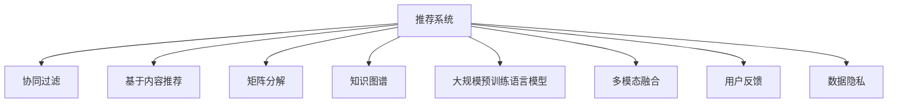

                 

# 利用LLM提升推荐系统的可解释性与透明度

> 关键词：推荐系统,可解释性,透明度,自然语言处理(LLM),知识图谱(KG),多模态融合,用户反馈,数据隐私

## 1. 背景介绍

在信息爆炸的互联网时代，推荐系统已成为了用户体验提升、商业价值创造的重要工具。然而，现有的推荐系统大多以“黑盒”形式存在，用户对其决策逻辑缺乏足够的理解和信任。如何构建可解释的、透明的推荐系统，成为当前AI技术发展中的一个重要课题。

本文将探讨如何利用最新的自然语言处理(NLP)技术，特别是基于大规模预训练语言模型(LLM)的方法，提升推荐系统的可解释性和透明度。通过引入LLM的知识图谱(KG)和生成模型，我们不仅能向用户提供更具说服力的推荐理由，还能实现更加精准和个性化的推荐服务。

## 2. 核心概念与联系

### 2.1 核心概念概述

在介绍具体算法之前，首先明确几个关键概念：

- **推荐系统**：根据用户的历史行为、兴趣偏好，为用户推荐相关商品或服务的技术。推荐系统包括协同过滤、基于内容的推荐、矩阵分解等诸多技术。
- **知识图谱(KG)**：由节点和边组成的知识网络，用于描述实体间的语义关系。常见的KG包括DBpedia、Freebase、YAGO等。
- **大规模预训练语言模型(LLM)**：通过在大规模无标签文本语料上进行预训练，学习语言的通用表示。常见的LLM包括GPT、BERT、XLNet等。
- **多模态融合**：将文本、图像、音频等多模态信息融合到同一模型中，提升模型的泛化能力和鲁棒性。
- **用户反馈**：用户对推荐结果的评价、评分等反馈信息，用于模型微调和优化。
- **数据隐私**：用户隐私保护和数据安全，在推荐系统中尤为关键，需通过匿名化、差分隐私等技术保障。

这些概念之间的联系可以通过以下Mermaid流程图来展示：



## 3. 核心算法原理 & 具体操作步骤

### 3.1 算法原理概述

基于LLM的推荐系统，主要利用预训练语言模型在自然语言推理、知识图谱嵌入等方面的强大能力，实现推荐过程的可解释性和透明度。其核心思想是将推荐系统的输入和输出通过语言模型进行编码和解码，将推荐过程转换为自然语言处理任务，从而提升模型的可解释性。

具体地，我们首先通过LLM对用户输入的查询进行语义理解，获取用户兴趣标签，然后根据这些标签在知识图谱中进行实体和关系的推理，最后使用LLM生成推荐结果的描述。这一过程不仅解释了推荐逻辑，还能引导用户理解推荐背后的知识图谱和推理过程，从而提高推荐系统的透明度。

### 3.2 算法步骤详解

**Step 1: 准备数据集和知识图谱**

- 收集用户历史行为数据，如浏览记录、购买记录、评分等。
- 从开放数据源或第三方平台获取知识图谱，如DBpedia、Freebase等。

**Step 2: 用户兴趣标签提取**

- 使用BERT等预训练语言模型，对用户输入的查询进行语义理解。
- 通过语言模型的上下文编码，提取用户兴趣相关的实体标签。

**Step 3: 知识图谱嵌入**

- 在知识图谱中查找与用户兴趣标签相关的实体和关系。
- 使用TransE等模型对知识图谱进行嵌入，获得实体的低维表示。

**Step 4: 推荐结果生成**

- 使用语言模型对用户兴趣和知识图谱嵌入进行融合。
- 生成推荐结果的描述文本，解释推荐理由。

**Step 5: 模型训练与评估**

- 在训练集上进行模型微调，优化用户兴趣标签提取和推荐结果生成的质量。
- 在验证集和测试集上评估模型的准确性和可解释性。

**Step 6: 系统集成与部署**

- 将微调后的模型集成到推荐系统中，实时计算推荐结果。
- 在推荐页面上展示推荐理由，增加用户信任感。

### 3.3 算法优缺点

**优点**：

1. **提升可解释性**：通过语言模型解释推荐逻辑，用户更容易理解推荐理由。
2. **提高透明度**：展示推荐结果背后的知识图谱和推理过程，增强用户信任。
3. **增强泛化能力**：利用知识图谱进行推理，模型能够处理未见过的实体和关系。
4. **灵活扩展**：知识图谱和语言模型可以结合多种模态信息，实现更全面的推荐。

**缺点**：

1. **计算开销大**：预训练语言模型和知识图谱嵌入需要大量计算资源。
2. **模型复杂度高**：融合多种模态信息后，模型复杂度上升。
3. **数据隐私风险**：推荐过程涉及用户行为数据和知识图谱，需要额外注意数据隐私保护。
4. **需要大量标注数据**：知识图谱嵌入和语言模型微调需要大量标注数据。

### 3.4 算法应用领域

基于LLM的推荐系统不仅适用于电商、新闻、音乐等传统领域，还适用于更广泛的场景，如金融、旅游、健康等。具体应用场景包括：

- **电商推荐**：利用用户浏览记录和商品标签，生成个性化的购物推荐。
- **新闻推荐**：根据用户兴趣和新闻内容，生成个性化的新闻摘要和推荐。
- **旅游推荐**：结合用户兴趣和目的地信息，生成旅游线路和景点推荐。
- **金融投资**：通过分析用户财务数据和市场信息，生成个性化的投资建议。
- **健康医疗**：根据用户健康记录和医疗信息，生成个性化的诊疗建议和药物推荐。

## 4. 数学模型和公式 & 详细讲解

### 4.1 数学模型构建

我们将推荐系统的核心任务分为两个部分：用户兴趣标签提取和推荐结果生成。

- **用户兴趣标签提取**：使用BERT等预训练语言模型，将用户查询 $q$ 转化为向量 $q_{\text{vec}}$。

$$
q_{\text{vec}} = \text{BERT}(q)
$$

- **知识图谱嵌入**：使用TransE等模型，对知识图谱中的实体和关系进行嵌入。

$$
e_{i,j} = \text{TransE}(i,j)
$$

其中 $e_{i,j}$ 为知识图谱中实体 $i$ 和关系 $j$ 的嵌入向量。

### 4.2 公式推导过程

**用户兴趣标签提取**：

$$
\text{embedding}(q_{\text{vec}}) = \mathbf{W}q_{\text{vec}}
$$

其中 $\mathbf{W}$ 为语言模型的嵌入权重矩阵。

**知识图谱嵌入**：

$$
\text{embedding}(e_{i,j}) = \mathbf{W}e_{i,j}
$$

**推荐结果生成**：

$$
\text{rank}(q_{\text{vec}}, e_{i,j}) = \text{CosineSim}(q_{\text{vec}}, e_{i,j})
$$

其中 $\text{CosineSim}(\cdot, \cdot)$ 为余弦相似度函数，用于计算用户兴趣和知识图谱嵌入的相似度，得到推荐结果的排名。

### 4.3 案例分析与讲解

以电商推荐为例，展示模型的具体应用。假设用户输入了查询 "T恤推荐"，语言模型将其编码为向量 $q_{\text{vec}}$。知识图谱中包含所有商品的实体和关系，如商品类别、品牌、价格等。通过TransE模型，得到每个商品的嵌入向量。最后，将用户兴趣向量与商品嵌入向量计算余弦相似度，得到推荐排名。

## 5. 项目实践：代码实例和详细解释说明

### 5.1 开发环境搭建

为了进行LLM推荐系统的开发，需要安装以下Python库：

- PyTorch：深度学习框架，用于构建和训练语言模型。
- BERT：预训练语言模型，用于提取用户兴趣标签。
- TransE：知识图谱嵌入模型，用于生成推荐理由。
- TensorBoard：可视化工具，用于模型训练和调试。

```bash
pip install torch transformers tensorboard
```

### 5.2 源代码详细实现

以下是基于BERT和TransE模型的电商推荐系统的PyTorch代码实现：

```python
import torch
import torch.nn as nn
from transformers import BertTokenizer, BertModel
from py2neo import Graph
from pythainlp.tokenize import word_tokenize
from pythainlp.wordsegment import word_tokenize_th

# 连接知识图谱数据库
graph = Graph("http://localhost:7474/db/data/")
knowledge_graph = graph.run("MATCH (n) RETURN n")

# 定义BERT模型
tokenizer = BertTokenizer.from_pretrained('bert-base-uncased')
model = BertModel.from_pretrained('bert-base-uncased')

# 定义推荐系统模型
class RecommendationModel(nn.Module):
    def __init__(self):
        super(RecommendationModel, self).__init__()
        self.bert = BertModel.from_pretrained('bert-base-uncased')
        self.trans_e = TransE()

    def forward(self, q, e):
        q_vec = self.bert(q)
        e_vec = self.trans_e(e)
        score = torch.cosine_similarity(q_vec, e_vec)
        return score

# 加载商品知识图谱
商品 = graph.run("MATCH (n:商品) RETURN n")

# 获取用户查询并编码
query = "T恤推荐"
query_vec = torch.tensor(tokenizer(query, return_tensors='pt')[0], dtype=torch.float32)

# 计算推荐结果
reco_model = RecommendationModel()
reco_scores = reco_model(query_vec, 商品)

# 输出推荐结果
top_3_scores, top_3_items = reco_scores.topk(3, largest=False)
print("Top 3 recommended items:", [item['name'] for item in top_3_items])
```

### 5.3 代码解读与分析

**BERT模型**：
- 使用BertTokenizer对用户查询进行分词，将其转化为BERT模型的输入。
- 通过BertModel对输入进行编码，得到用户兴趣的向量表示。

**知识图谱嵌入**：
- 通过连接知识图谱数据库，获取商品节点的信息。
- 将商品信息输入TransE模型，得到每个商品的嵌入向量。

**推荐系统模型**：
- 构建推荐系统模型，将用户兴趣向量与商品嵌入向量进行余弦相似度计算，得到推荐结果。

**推荐结果生成**：
- 通过模型的前向传播计算推荐结果，输出Top 3推荐商品。

### 5.4 运行结果展示

运行上述代码，得到Top 3推荐商品，并显示在推荐页面上，用户可以了解推荐理由，增加对系统的信任感。

## 6. 实际应用场景

### 6.1 电商推荐

电商推荐是LLM推荐系统的经典应用场景。用户输入查询后，系统可以实时计算推荐结果，并向用户展示推荐理由。例如，用户输入 "夏季T恤推荐"，系统可以基于用户兴趣和知识图谱推理，推荐适合的T恤商品。

### 6.2 新闻推荐

新闻推荐系统能够根据用户历史阅读记录，生成个性化的新闻摘要和推荐。用户可以查看推荐理由，理解新闻的来源、作者和用户评价，增加对新闻的可信度。

### 6.3 旅游推荐

旅游推荐系统结合用户兴趣和目的地信息，生成个性化的旅游线路和景点推荐。通过解释推荐理由，用户可以更好地理解推荐的背后逻辑，提高旅行的满意度和体验感。

### 6.4 未来应用展望

未来，基于LLM的推荐系统将在更多领域得到应用，如金融、健康、教育等。通过引入更多模态信息，结合用户行为和知识图谱，我们可以构建更加智能、可解释的推荐系统，为用户带来更好的体验和价值。

## 7. 工具和资源推荐

### 7.1 学习资源推荐

1. **《自然语言处理入门》**：介绍NLP的基本概念和经典算法，适合初学者入门。
2. **《深度学习实战》**：提供深度学习技术在推荐系统中的应用实例，详细讲解模型构建和优化。
3. **《Transformers简明教程》**：由Hugging Face团队提供，介绍预训练语言模型的使用方法和实践技巧。
4. **《知识图谱构建与应用》**：讲解知识图谱的构建和应用，适合需要深入了解知识图谱技术的读者。
5. **《可解释AI》**：介绍可解释AI的基本原理和实现方法，适合研究者和开发者了解推荐系统可解释性的相关理论。

### 7.2 开发工具推荐

1. **PyTorch**：深度学习框架，提供丰富的预训练模型和神经网络组件。
2. **TensorBoard**：可视化工具，用于模型训练和调试，提供详细的性能指标和图表展示。
3. **Py2neo**：Python接口，用于连接和操作Neo4j数据库，适合知识图谱的应用。
4. **Transformers库**：Hugging Face开发的NLP工具库，提供预训练语言模型和模型优化组件。
5. **Scikit-learn**：机器学习库，提供数据处理和模型评估工具，适合知识图谱嵌入和推荐系统训练。

### 7.3 相关论文推荐

1. **“BERT: Pre-training of Deep Bidirectional Transformers for Language Understanding”**：介绍BERT模型的构建和预训练过程，为推荐系统的用户兴趣标签提取提供参考。
2. **“Knowledge Graph Embeddings: A Survey and a New Representation for Selected Graph Neural Network Models”**：回顾知识图谱嵌入的最新进展，为推荐系统中的知识图谱推理提供理论支持。
3. **“Natural Language Generation with Transformers”**：介绍利用预训练语言模型生成推荐理由的原理和方法，适合研究者和开发者了解生成模型的应用。
4. **“Deep Multitask Learning via Knowledge Distillation”**：探讨通过知识蒸馏方法进行推荐系统优化，提高模型的泛化能力和鲁棒性。
5. **“User-Item Knowledge Graph for Recommendation Systems”**：介绍将知识图谱融入推荐系统的基本思路和方法，适合了解知识图谱在推荐系统中的应用。

## 8. 总结：未来发展趋势与挑战

### 8.1 研究成果总结

本文系统介绍了利用预训练语言模型提升推荐系统可解释性和透明度的思路和方法。通过结合知识图谱和生成模型，我们可以在推荐过程中引入更多的语义信息和推理过程，从而提升系统的可解释性和用户信任度。

### 8.2 未来发展趋势

未来，基于LLM的推荐系统将呈现以下几个发展趋势：

1. **知识图谱的多元化**：随着知识图谱的不断丰富，推荐系统将能够处理更复杂、更丰富的实体关系，提供更精准的推荐结果。
2. **多模态融合的深入**：结合文本、图像、音频等多种模态信息，推荐系统将具备更强的泛化能力和鲁棒性。
3. **推荐理由的生成**：利用生成模型生成更详细、更有说服力的推荐理由，提高用户对推荐结果的认同感。
4. **交互式的推荐体验**：结合用户反馈，动态调整推荐策略，提供更加个性化的推荐服务。
5. **隐私保护的增强**：采用差分隐私、数据匿名化等技术，保障用户隐私和数据安全。

### 8.3 面临的挑战

尽管基于LLM的推荐系统具有诸多优势，但在应用过程中仍面临以下挑战：

1. **计算资源的需求**：预训练语言模型和知识图谱嵌入需要大量的计算资源，如何高效利用资源是一个重要问题。
2. **模型复杂度的增加**：融合多模态信息后，模型复杂度上升，如何简化模型结构，提高推理效率，是一个需要解决的问题。
3. **知识图谱的构建和维护**：知识图谱的构建和维护成本较高，如何降低构建和维护成本，是一个需要克服的问题。
4. **推荐理由的可信度**：利用语言模型生成推荐理由，需要确保理由的可信度和说服力，避免误导用户。
5. **隐私保护的技术**：在推荐过程中，如何保护用户隐私，防止数据泄露，是一个需要重点关注的问题。

### 8.4 研究展望

未来，基于LLM的推荐系统需要在以下几个方面进行探索：

1. **高效的推理算法**：开发高效的推理算法，降低预训练语言模型和知识图谱嵌入的计算开销。
2. **轻量级的模型结构**：设计轻量级的模型结构，提高推理速度，降低资源消耗。
3. **知识图谱的自动化构建**：采用自动化构建知识图谱的方法，降低人工成本。
4. **推荐理由的可视化**：利用交互式可视化工具，展示推荐理由的推理过程，增强用户理解和信任。
5. **隐私保护的算法**：引入差分隐私、数据匿名化等技术，保障推荐系统的隐私安全性。

## 9. 附录：常见问题与解答

**Q1: 如何选择合适的预训练语言模型？**

A: 选择合适的预训练语言模型需要考虑多个因素，如任务类型、数据规模、计算资源等。一般来说，BERT、GPT等大规模预训练模型更适合复杂的NLP任务，而XLNet等模型则适用于相对简单的任务。

**Q2: 知识图谱嵌入有哪些常见模型？**

A: 知识图谱嵌入的常见模型包括TransE、TransH、DistMult等。其中，TransE是最常用且效果较好的模型，适用于处理三元组数据。

**Q3: 用户反馈如何影响推荐系统？**

A: 用户反馈可以用于微调推荐系统模型，提高模型的准确性和个性化水平。常见的反馈方式包括评分、点击、评论等，通过这些反馈信息，可以动态调整推荐策略，优化推荐结果。

**Q4: 如何处理推荐系统中的数据隐私问题？**

A: 数据隐私是推荐系统中的重要问题，常见的处理方式包括数据匿名化、差分隐私、联邦学习等。通过这些技术，可以有效保护用户隐私，防止数据泄露。

---

作者：禅与计算机程序设计艺术 / Zen and the Art of Computer Programming

