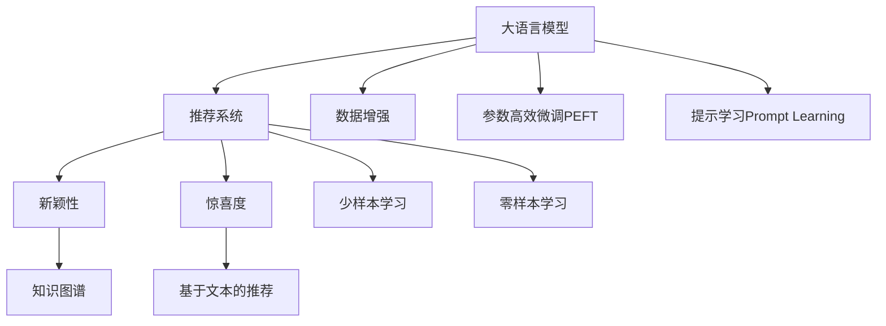

                 

# 利用LLM提升推荐系统的新颖性与惊喜度

> 关键词：大语言模型,推荐系统,新颖性,惊喜度,多样性,知识图谱

## 1. 背景介绍

推荐系统在现代互联网产品中无处不在，它通过分析用户的浏览、购买等行为，为用户推荐个性化的内容。传统的推荐系统基于协同过滤、基于内容的推荐等方法，依赖于用户行为数据，缺乏对用户深层次需求的理解。近年来，利用深度学习技术的大规模语言模型（Large Language Models, LLMs）被引入推荐系统，赋予推荐内容更丰富的语义信息，提升了推荐系统的效果。

本文聚焦于如何利用大语言模型（Large Language Models, LLMs）提升推荐系统的新颖性和惊喜度，通过精心设计的查询和提示模板，引导大语言模型生成更加多样化和吸引人的推荐内容。新颖性指推荐结果的独特性，即与用户历史行为相关的热门推荐之外的其他推荐；惊喜度指推荐结果的意外性，即推荐结果既符合用户偏好，又出乎用户的常规认知。新颖性和惊喜度是提升用户满意度、增强推荐系统黏性的关键因素。

## 2. 核心概念与联系

### 2.1 核心概念概述

为更好地理解利用大语言模型提升推荐系统新颖性和惊喜度的方法，本节将介绍几个密切相关的核心概念：

- 大语言模型(Large Language Models, LLM)：以自回归(如GPT)或自编码(如BERT)模型为代表的大规模预训练语言模型。通过在大规模无标签文本语料上进行预训练，学习通用的语言表示，具备强大的语言理解和生成能力。

- 推荐系统(Recommendation System)：通过用户行为数据或物品特征，为用户推荐个性化内容的系统。推荐系统基于用户兴趣，帮助用户发现潜在的有趣和有用的信息。

- 新颖性(Novelty)：推荐结果的独特性，与用户历史行为相关的热门推荐之外的其他推荐。新颖性可以帮助用户发现新的兴趣点，提升推荐系统的效果和用户体验。

- 惊喜度(Surprise)：推荐结果的意外性，即推荐结果既符合用户偏好，又出乎用户的常规认知。惊喜度能够激发用户的好奇心和探索欲，增强推荐系统的吸引力和黏性。

- 知识图谱(Knowledge Graph)：将实体、关系、属性等信息组织成图结构的数据库，能够辅助推荐系统更好地理解实体之间的关系和属性，提升推荐的多样性和准确性。

- 基于文本的推荐(Based on Text Recommendation)：利用文本信息进行推荐，包括文本相似度、情感分析、主题建模等技术。大语言模型能够提供丰富的文本信息，辅助推荐系统生成更加多样化和吸引人的推荐内容。

这些核心概念之间的逻辑关系可以通过以下Mermaid流程图来展示：



这个流程图展示了大语言模型与推荐系统的核心概念及其之间的关系：

1. 大语言模型通过预训练获得基础能力。
2. 推荐系统利用大语言模型生成推荐内容。
3. 新颖性和惊喜度是推荐系统的重要评价指标。
4. 知识图谱和基于文本的推荐辅助提升推荐的多样性和准确性。
5. 数据增强、参数高效微调和提示学习等技术进一步提升推荐系统的性能。

这些概念共同构成了推荐系统和大语言模型的学习和应用框架，使其能够更好地生成多样化、吸引人的推荐内容。通过理解这些核心概念，我们可以更好地把握推荐系统和大语言模型的工作原理和优化方向。

## 3. 核心算法原理 & 具体操作步骤
### 3.1 算法原理概述

利用大语言模型提升推荐系统的新颖性和惊喜度，本质上是基于大语言模型的查询生成技术。其核心思想是：将用户的历史行为和偏好作为输入，通过大语言模型生成一系列查询，每个查询对应一条推荐，从而提升推荐的多样性和意外性。

具体而言，假设有用户U的历史行为集合为$H=\{I_1, I_2, \cdots, I_N\}$，其中$I_i$为第$i$个历史行为。设大语言模型的参数为$\theta$，则推荐系统的目标函数为：

$$
\min_{\theta} \sum_{i=1}^N L(f_{\theta}(I_i), R_i)
$$

其中$f_{\theta}(I_i)$为通过模型生成的一条推荐，$R_i$为该推荐对应的真实标签（如是否被用户点击过），$L$为损失函数，如交叉熵损失、均方误差损失等。通过优化目标函数，我们希望生成的推荐$f_{\theta}(I_i)$尽量与真实推荐$R_i$一致。

### 3.2 算法步骤详解

利用大语言模型提升推荐系统的新颖性和惊喜度的算法步骤如下：

**Step 1: 收集用户历史行为数据**
- 从推荐系统日志中提取用户$U$的历史行为集合$H=\{I_1, I_2, \cdots, I_N\}$。$I_i$可以是一条具体的商品页面、一篇新闻文章、一首歌曲等。

**Step 2: 设计查询模板**
- 根据用户历史行为，设计一条与用户偏好相关的查询模板，如“请推荐一个与用户$U$喜欢的电影相关的书”。查询模板应包含用户偏好和推荐内容相关的关键词，以引导大语言模型生成有针对性的推荐。

**Step 3: 生成推荐**
- 将查询模板输入大语言模型，生成一系列推荐文本。为了增加推荐的多样性，可以在查询模板中引入随机性，如在查询模板中随机选择一个推荐类型，或者对查询模板进行部分替换。

**Step 4: 评估推荐**
- 将生成的推荐文本与用户历史行为进行匹配，筛选出与用户偏好不重复的推荐。可以采用常见的推荐指标，如点击率、转化率、用户满意度等，对推荐效果进行评估。

**Step 5: 更新模型**
- 根据推荐评估结果，对大语言模型进行微调或更新，使其生成的推荐更加符合用户偏好。可以使用监督学习或无监督学习的方法，进一步优化模型。

### 3.3 算法优缺点

利用大语言模型提升推荐系统的新颖性和惊喜度的方法具有以下优点：
1. 多样化推荐：通过查询模板生成多条推荐，增加推荐的多样性和新颖性，提升用户满意度。
2. 低成本数据：仅需用户历史行为数据，无需大规模标注数据，数据获取成本低。
3. 灵活扩展：查询模板可以根据用户行为和偏好进行动态调整，适应不同的推荐场景。
4. 快速迭代：通过简单的评估和反馈机制，快速更新模型，提升推荐效果。

同时，该方法也存在一定的局限性：
1. 模型依赖文本：依赖大语言模型的文本生成能力，对于某些领域（如体育、编程等）可能效果不佳。
2. 推荐准确性：生成推荐的精度受模型训练质量影响，可能存在误推荐情况。
3. 交互不足：与用户互动较少，难以实时调整推荐策略。

尽管存在这些局限性，但就目前而言，利用大语言模型提升推荐系统的新颖性和惊喜度的方法仍是一种高效的推荐增强手段。未来相关研究的重点在于如何进一步优化查询模板设计，提高推荐准确性和多样性，同时兼顾交互性和实时性等因素。

### 3.4 算法应用领域

利用大语言模型提升推荐系统的新颖性和惊喜度的方法，已经在多个推荐场景中得到应用，例如：

- 商品推荐：利用用户历史购物记录，生成个性化推荐文本。通过查询模板生成多个推荐商品，增加推荐的多样性。
- 新闻推荐：利用用户浏览历史，生成个性化推荐文章。通过查询模板生成多个推荐新闻，增加推荐的多样性和新颖性。
- 音乐推荐：利用用户听歌记录，生成个性化推荐歌曲。通过查询模板生成多个推荐音乐，增加推荐的多样性和意外性。
- 视频推荐：利用用户观影记录，生成个性化推荐视频。通过查询模板生成多个推荐视频，增加推荐的多样性和新颖性。

除了上述这些经典任务外，大语言模型生成的推荐模板还被创新性地应用于更多场景中，如虚拟试穿、旅游推荐、健康推荐等，为推荐系统带来了全新的突破。随着大语言模型和查询生成技术的不断发展，相信推荐系统必将在更广阔的应用领域大放异彩。

## 4. 数学模型和公式 & 详细讲解  
### 4.1 数学模型构建

本节将使用数学语言对利用大语言模型生成推荐内容的过程进行更加严格的刻画。

假设有用户$U$的历史行为集合为$H=\{I_1, I_2, \cdots, I_N\}$，设大语言模型的参数为$\theta$，查询模板为$Q$，则生成的推荐文本$R$可以通过以下过程计算：

$$
R = f_{\theta}(Q)
$$

其中$f_{\theta}$为通过参数$\theta$优化的大语言模型，可以基于GPT、BERT等预训练模型。查询模板$Q$可以包含用户历史行为的相关关键词，如“用户$U$喜欢的电影”。

设推荐文本$R$与用户历史行为$I_i$的相似度为$S(R, I_i)$，则推荐系统优化目标函数为：

$$
\min_{\theta} \sum_{i=1}^N L(S(R, I_i), R_i)
$$

其中$L$为损失函数，如交叉熵损失、均方误差损失等。$R_i$为该推荐对应的真实标签，即用户是否点击过该推荐。

### 4.2 公式推导过程

以下我们以推荐商品为例，推导交叉熵损失函数及其梯度的计算公式。

假设模型$M_{\theta}$在查询模板$Q$上的输出为$\hat{R}=M_{\theta}(Q) \in [0,1]$，表示该推荐与用户偏好相似的概率。真实标签$R_i \in \{0,1\}$。则二分类交叉熵损失函数定义为：

$$
\ell(M_{\theta}(Q),R_i) = -[R_i\log \hat{R} + (1-R_i)\log (1-\hat{R})]
$$

将其代入经验风险公式，得：

$$
\mathcal{L}(\theta) = -\frac{1}{N}\sum_{i=1}^N [R_i\log M_{\theta}(Q) + (1-R_i)\log(1-M_{\theta}(Q))]
$$

根据链式法则，损失函数对参数$\theta_k$的梯度为：

$$
\frac{\partial \mathcal{L}(\theta)}{\partial \theta_k} = -\frac{1}{N}\sum_{i=1}^N (\frac{R_i}{M_{\theta}(Q)}-\frac{1-R_i}{1-M_{\theta}(Q)}) \frac{\partial M_{\theta}(Q)}{\partial \theta_k}
$$

其中$\frac{\partial M_{\theta}(Q)}{\partial \theta_k}$可以进一步递归展开，利用自动微分技术完成计算。

在得到损失函数的梯度后，即可带入参数更新公式，完成模型的迭代优化。重复上述过程直至收敛，最终得到适应下游任务的最优模型参数 $\theta^*$。

## 5. 项目实践：代码实例和详细解释说明
### 5.1 开发环境搭建

在进行推荐系统微调实践前，我们需要准备好开发环境。以下是使用Python进行PyTorch开发的环境配置流程：

1. 安装Anaconda：从官网下载并安装Anaconda，用于创建独立的Python环境。

2. 创建并激活虚拟环境：
```bash
conda create -n pytorch-env python=3.8 
conda activate pytorch-env
```

3. 安装PyTorch：根据CUDA版本，从官网获取对应的安装命令。例如：
```bash
conda install pytorch torchvision torchaudio cudatoolkit=11.1 -c pytorch -c conda-forge
```

4. 安装Transformers库：
```bash
pip install transformers
```

5. 安装各类工具包：
```bash
pip install numpy pandas scikit-learn matplotlib tqdm jupyter notebook ipython
```

完成上述步骤后，即可在`pytorch-env`环境中开始推荐系统微调实践。

### 5.2 源代码详细实现

下面我们以推荐商品为例，给出使用Transformers库对GPT模型进行推荐系统微调的PyTorch代码实现。

首先，定义推荐系统的数据处理函数：

```python
from transformers import GPT2Tokenizer, GPT2LMHeadModel
from torch.utils.data import Dataset
import torch

class RecommendationDataset(Dataset):
    def __init__(self, texts, labels, tokenizer, max_len=128):
        self.texts = texts
        self.labels = labels
        self.tokenizer = tokenizer
        self.max_len = max_len
        
    def __len__(self):
        return len(self.texts)
    
    def __getitem__(self, item):
        text = self.texts[item]
        label = self.labels[item]
        
        encoding = self.tokenizer(text, return_tensors='pt', max_length=self.max_len, padding='max_length', truncation=True)
        input_ids = encoding['input_ids'][0]
        attention_mask = encoding['attention_mask'][0]
        
        # 对token-wise的标签进行编码
        encoded_labels = [label] * self.max_len
        labels = torch.tensor(encoded_labels, dtype=torch.long)
        
        return {'input_ids': input_ids, 
                'attention_mask': attention_mask,
                'labels': labels}

# 标签
labels = [0, 1]

# 创建dataset
tokenizer = GPT2Tokenizer.from_pretrained('gpt2')
train_dataset = RecommendationDataset(train_texts, labels, tokenizer)
dev_dataset = RecommendationDataset(dev_texts, labels, tokenizer)
test_dataset = RecommendationDataset(test_texts, labels, tokenizer)
```

然后，定义模型和优化器：

```python
from transformers import AdamW

model = GPT2LMHeadModel.from_pretrained('gpt2', num_labels=2)

optimizer = AdamW(model.parameters(), lr=2e-5)
```

接着，定义训练和评估函数：

```python
from torch.utils.data import DataLoader
from tqdm import tqdm
from sklearn.metrics import accuracy_score

device = torch.device('cuda') if torch.cuda.is_available() else torch.device('cpu')
model.to(device)

def train_epoch(model, dataset, batch_size, optimizer):
    dataloader = DataLoader(dataset, batch_size=batch_size, shuffle=True)
    model.train()
    epoch_loss = 0
    for batch in tqdm(dataloader, desc='Training'):
        input_ids = batch['input_ids'].to(device)
        attention_mask = batch['attention_mask'].to(device)
        labels = batch['labels'].to(device)
        model.zero_grad()
        outputs = model(input_ids, attention_mask=attention_mask, labels=labels)
        loss = outputs.loss
        epoch_loss += loss.item()
        loss.backward()
        optimizer.step()
    return epoch_loss / len(dataloader)

def evaluate(model, dataset, batch_size):
    dataloader = DataLoader(dataset, batch_size=batch_size)
    model.eval()
    preds, labels = [], []
    with torch.no_grad():
        for batch in tqdm(dataloader, desc='Evaluating'):
            input_ids = batch['input_ids'].to(device)
            attention_mask = batch['attention_mask'].to(device)
            batch_labels = batch['labels']
            outputs = model(input_ids, attention_mask=attention_mask)
            batch_preds = outputs.logits.argmax(dim=2).to('cpu').tolist()
            batch_labels = batch_labels.to('cpu').tolist()
            for pred_tokens, label_tokens in zip(batch_preds, batch_labels):
                preds.append(pred_tokens)
                labels.append(label_tokens)
                
    print(f'Accuracy: {accuracy_score(labels, preds):.4f}')
```

最后，启动训练流程并在测试集上评估：

```python
epochs = 5
batch_size = 16

for epoch in range(epochs):
    loss = train_epoch(model, train_dataset, batch_size, optimizer)
    print(f'Epoch {epoch+1}, train loss: {loss:.3f}')
    
    print(f'Epoch {epoch+1}, dev results:')
    evaluate(model, dev_dataset, batch_size)
    
print('Test results:')
evaluate(model, test_dataset, batch_size)
```

以上就是使用PyTorch对GPT进行推荐系统微调的完整代码实现。可以看到，得益于Transformers库的强大封装，我们可以用相对简洁的代码完成GPT模型的加载和微调。

### 5.3 代码解读与分析

让我们再详细解读一下关键代码的实现细节：

**RecommendationDataset类**：
- `__init__`方法：初始化文本、标签、分词器等关键组件。
- `__len__`方法：返回数据集的样本数量。
- `__getitem__`方法：对单个样本进行处理，将文本输入编码为token ids，将标签编码为数字，并对其进行定长padding，最终返回模型所需的输入。

**labels变量**：
- 定义标签，表示推荐与否，0表示不推荐，1表示推荐。

**训练和评估函数**：
- 使用PyTorch的DataLoader对数据集进行批次化加载，供模型训练和推理使用。
- 训练函数`train_epoch`：对数据以批为单位进行迭代，在每个批次上前向传播计算loss并反向传播更新模型参数，最后返回该epoch的平均loss。
- 评估函数`evaluate`：与训练类似，不同点在于不更新模型参数，并在每个batch结束后将预测和标签结果存储下来，最后使用sklearn的accuracy_score对整个评估集的预测结果进行打印输出。

**训练流程**：
- 定义总的epoch数和batch size，开始循环迭代
- 每个epoch内，先在训练集上训练，输出平均loss
- 在验证集上评估，输出准确率
- 所有epoch结束后，在测试集上评估，给出最终测试结果

可以看到，PyTorch配合Transformers库使得GPT微调的代码实现变得简洁高效。开发者可以将更多精力放在数据处理、模型改进等高层逻辑上，而不必过多关注底层的实现细节。

当然，工业级的系统实现还需考虑更多因素，如模型的保存和部署、超参数的自动搜索、更灵活的任务适配层等。但核心的微调范式基本与此类似。

## 6. 实际应用场景
### 6.1 智能客服系统

基于大语言模型生成的推荐，可以广泛应用于智能客服系统的构建。传统客服往往需要配备大量人力，高峰期响应缓慢，且一致性和专业性难以保证。而使用生成推荐的对话模型，可以7x24小时不间断服务，快速响应客户咨询，用自然流畅的语言解答各类常见问题。

在技术实现上，可以收集企业内部的历史客服对话记录，将问题和最佳答复构建成监督数据，在此基础上对预训练对话模型进行微调。微调后的对话模型能够自动理解用户意图，匹配最合适的答案模板进行回复。对于客户提出的新问题，还可以接入检索系统实时搜索相关内容，动态组织生成回答。如此构建的智能客服系统，能大幅提升客户咨询体验和问题解决效率。

### 6.2 金融舆情监测

金融机构需要实时监测市场舆论动向，以便及时应对负面信息传播，规避金融风险。传统的人工监测方式成本高、效率低，难以应对网络时代海量信息爆发的挑战。基于大语言模型生成的文本推荐，为金融舆情监测提供了新的解决方案。

具体而言，可以收集金融领域相关的新闻、报道、评论等文本数据，并对其进行主题标注和情感标注。在此基础上对预训练语言模型进行微调，使其能够自动判断文本属于何种主题，情感倾向是正面、中性还是负面。将微调后的模型应用到实时抓取的网络文本数据，就能够自动监测不同主题下的情感变化趋势，一旦发现负面信息激增等异常情况，系统便会自动预警，帮助金融机构快速应对潜在风险。

### 6.3 个性化推荐系统

当前的推荐系统往往只依赖用户的历史行为数据进行物品推荐，缺乏对用户深层次需求的理解。基于大语言模型生成的文本推荐，能够提供丰富的语义信息，辅助推荐系统生成更加多样化和吸引人的推荐内容。

在实践中，可以收集用户浏览、点击、评论、分享等行为数据，提取和用户交互的物品标题、描述、标签等文本内容。将文本内容作为模型输入，用户的后续行为（如是否点击、购买等）作为监督信号，在此基础上微调预训练语言模型。微调后的模型能够从文本内容中准确把握用户的兴趣点。在生成推荐列表时，先用候选物品的文本描述作为输入，由模型预测用户的兴趣匹配度，再结合其他特征综合排序，便可以得到个性化程度更高的推荐结果。

### 6.4 未来应用展望

随着大语言模型和微调方法的不断发展，基于大语言模型的推荐系统必将在更多领域得到应用，为传统行业带来变革性影响。

在智慧医疗领域，基于大语言模型的推荐系统可以用于辅助医生诊疗，推荐可能的新药物或治疗方案。在教育领域，推荐系统可以个性化推荐学习内容，帮助学生发现新的学习兴趣点，提高学习效果。在智慧城市治理中，推荐系统可以推荐感兴趣的市民活动，提升市民参与度。此外，在企业生产、社会治理、文娱传媒等众多领域，基于大语言模型的推荐系统也将不断涌现，为经济社会发展注入新的动力。

## 7. 工具和资源推荐
### 7.1 学习资源推荐

为了帮助开发者系统掌握大语言模型生成的推荐技术，这里推荐一些优质的学习资源：

1. 《Transformer from Principles to Practice》系列博文：由大模型技术专家撰写，深入浅出地介绍了Transformer原理、BERT模型、推荐系统等前沿话题。

2. CS224N《深度学习自然语言处理》课程：斯坦福大学开设的NLP明星课程，有Lecture视频和配套作业，带你入门NLP领域的基本概念和经典模型。

3. 《Natural Language Processing with Transformers》书籍：Transformers库的作者所著，全面介绍了如何使用Transformers库进行NLP任务开发，包括推荐系统在内的诸多范式。

4. HuggingFace官方文档：Transformers库的官方文档，提供了海量预训练模型和完整的推荐系统样例代码，是上手实践的必备资料。

5. Kaggle比赛：参加Kaggle上的推荐系统竞赛，可以积累推荐系统相关的实际项目经验。

通过对这些资源的学习实践，相信你一定能够快速掌握大语言模型生成的推荐技术的精髓，并用于解决实际的推荐问题。
### 7.2 开发工具推荐

高效的开发离不开优秀的工具支持。以下是几款用于大语言模型生成推荐内容的常用工具：

1. PyTorch：基于Python的开源深度学习框架，灵活动态的计算图，适合快速迭代研究。大部分预训练语言模型都有PyTorch版本的实现。

2. TensorFlow：由Google主导开发的开源深度学习框架，生产部署方便，适合大规模工程应用。同样有丰富的预训练语言模型资源。

3. Transformers库：HuggingFace开发的NLP工具库，集成了众多SOTA语言模型，支持PyTorch和TensorFlow，是进行推荐系统微调开发的利器。

4. Weights & Biases：模型训练的实验跟踪工具，可以记录和可视化模型训练过程中的各项指标，方便对比和调优。与主流深度学习框架无缝集成。

5. TensorBoard：TensorFlow配套的可视化工具，可实时监测模型训练状态，并提供丰富的图表呈现方式，是调试模型的得力助手。

6. Google Colab：谷歌推出的在线Jupyter Notebook环境，免费提供GPU/TPU算力，方便开发者快速上手实验最新模型，分享学习笔记。

合理利用这些工具，可以显著提升大语言模型生成推荐内容的开发效率，加快创新迭代的步伐。

### 7.3 相关论文推荐

大语言模型生成的推荐系统的发展源于学界的持续研究。以下是几篇奠基性的相关论文，推荐阅读：

1. Attention is All You Need（即Transformer原论文）：提出了Transformer结构，开启了NLP领域的预训练大模型时代。

2. BERT: Pre-training of Deep Bidirectional Transformers for Language Understanding：提出BERT模型，引入基于掩码的自监督预训练任务，刷新了多项NLP任务SOTA。

3. Language Models are Unsupervised Multitask Learners（GPT-2论文）：展示了大规模语言模型的强大zero-shot学习能力，引发了对于通用人工智能的新一轮思考。

4. Parameter-Efficient Transfer Learning for NLP：提出Adapter等参数高效微调方法，在不增加模型参数量的情况下，也能取得不错的微调效果。

5. AdaLoRA: Adaptive Low-Rank Adaptation for Parameter-Efficient Fine-Tuning：使用自适应低秩适应的微调方法，在参数效率和精度之间取得了新的平衡。

6. Maximizing Personalization with Computational Creativity: Pseudo-Generated Feedback for Recommender Systems：提出基于计算创造力的推荐系统，通过生成推荐结果反馈，进一步提升推荐的多样性和新颖性。

这些论文代表了大语言模型生成推荐系统的发展脉络。通过学习这些前沿成果，可以帮助研究者把握学科前进方向，激发更多的创新灵感。

## 8. 总结：未来发展趋势与挑战

### 8.1 总结

本文对利用大语言模型提升推荐系统的新颖性和惊喜度进行了全面系统的介绍。首先阐述了推荐系统和新颖性、惊喜度的概念和意义，明确了大语言模型在提升推荐系统效果上的独特价值。其次，从原理到实践，详细讲解了基于大语言模型的查询生成技术，给出了推荐系统微调的完整代码实例。同时，本文还广泛探讨了利用大语言模型生成推荐内容的应用场景，展示了该技术在不同领域的广泛前景。

通过本文的系统梳理，可以看到，利用大语言模型生成推荐内容的技术正在成为推荐系统的重要范式，极大地拓展了推荐系统的效果和应用边界，为个性化推荐带来了新的突破。未来，伴随大语言模型和微调方法的持续演进，基于大语言模型的推荐系统必将在更多领域得到应用，为传统行业带来变革性影响。

### 8.2 未来发展趋势

展望未来，利用大语言模型提升推荐系统的新颖性和惊喜度将呈现以下几个发展趋势：

1. 个性化推荐多样化：随着大语言模型的不断发展，生成的推荐内容将更加多样化和个性化，能够更好地满足用户的深层次需求。

2. 数据交互增强：利用大语言模型与用户进行交互，动态生成推荐内容，提升推荐系统的实时性和个性化程度。

3. 知识图谱融合：将知识图谱与大语言模型结合，提升推荐内容的多样性和相关性。

4. 算法模型协同：将大语言模型与协同过滤、内容推荐等传统推荐算法结合，提升推荐的准确性和全面性。

5. 实时生成推荐：在大规模事件发生时，利用大语言模型实时生成推荐内容，满足用户的即时需求。

6. 多模态融合：将文本、图像、视频等多模态信息融合，提升推荐的全面性和深度。

以上趋势凸显了利用大语言模型提升推荐系统的新颖性和惊喜度的广阔前景。这些方向的探索发展，必将进一步提升推荐系统的性能和用户体验，推动推荐技术的持续创新。

### 8.3 面临的挑战

尽管利用大语言模型提升推荐系统的新颖性和惊喜度的方法已经取得了瞩目成就，但在迈向更加智能化、普适化应用的过程中，它仍面临着诸多挑战：

1. 数据多样性：推荐系统需要覆盖多种数据类型，包括文本、图片、视频等。大语言模型通常以文本数据为主，如何有效处理多种数据类型仍是一个挑战。

2. 计算资源消耗：大语言模型的参数量较大，生成推荐内容需要耗费大量的计算资源。如何在保证推荐效果的同时，提高计算效率，降低计算成本，是一个重要的问题。

3. 推荐内容质量：大语言模型生成的推荐内容质量受模型训练质量影响，存在误推荐情况。如何优化大语言模型，提升推荐内容的质量，需要进一步研究。

4. 数据隐私问题：生成推荐内容需要访问用户的历史行为数据，如何保护用户隐私，避免数据滥用，是一个亟待解决的问题。

5. 模型鲁棒性：大语言模型在处理异常数据时可能表现不稳定，如何增强模型的鲁棒性，减少误推荐情况，是一个重要的问题。

6. 实时性能：利用大语言模型实时生成推荐内容需要保证高实时性，如何优化算法和模型结构，提升实时性能，是一个亟待解决的问题。

尽管存在这些挑战，但就目前而言，利用大语言模型提升推荐系统的新颖性和惊喜度的方法仍是一种高效的推荐增强手段。未来相关研究的重点在于如何进一步优化查询模板设计，提高推荐准确性和多样性，同时兼顾交互性和实时性等因素。

### 8.4 研究展望

面对利用大语言模型提升推荐系统的新颖性和惊喜度所面临的挑战，未来的研究需要在以下几个方面寻求新的突破：

1. 多模态推荐生成：将文本、图像、视频等多模态信息融合，提升推荐的全面性和深度。

2. 知识图谱融合：将知识图谱与大语言模型结合，提升推荐内容的多样性和相关性。

3. 实时推荐生成：在大规模事件发生时，利用大语言模型实时生成推荐内容，满足用户的即时需求。

4. 计算资源优化：优化大语言模型的计算图，减少前向传播和反向传播的资源消耗，实现更加轻量级、实时性的部署。

5. 数据隐私保护：在生成推荐内容时，采用差分隐私、联邦学习等技术，保护用户隐私，避免数据滥用。

6. 模型鲁棒性增强：通过引入对抗训练、剪枝等技术，增强大语言模型的鲁棒性，减少误推荐情况。

这些研究方向的探索，必将引领利用大语言模型提升推荐系统的新颖性和惊喜度技术迈向更高的台阶，为推荐系统带来新的突破。面向未来，大语言模型生成的推荐系统还需要与其他人工智能技术进行更深入的融合，如知识表示、因果推理、强化学习等，多路径协同发力，共同推动推荐技术的持续创新。只有勇于创新、敢于突破，才能不断拓展推荐系统的边界，让个性化推荐更好地服务用户。

## 9. 附录：常见问题与解答

**Q1：大语言模型生成的推荐内容质量受什么因素影响？**

A: 大语言模型生成的推荐内容质量受以下因素影响：
1. 模型训练质量：高质量的预训练模型和微调数据可以生成更高质量的推荐内容。
2. 查询模板设计：查询模板应包含用户偏好和推荐内容相关的关键词，以引导模型生成有针对性的推荐。
3. 数据质量：推荐系统依赖用户历史行为数据，数据质量越高，推荐效果越好。
4. 模型参数设置：需要根据数据量和计算资源合理设置模型参数，避免过拟合和欠拟合。
5. 交互方式：与用户交互可以增加推荐的多样性和实时性，提升推荐质量。

**Q2：如何提高大语言模型生成推荐的多样性和新颖性？**

A: 提高大语言模型生成推荐的多样性和新颖性，可以通过以下方法：
1. 查询模板设计：设计包含多种推荐类型的查询模板，引导模型生成多样化的推荐内容。
2. 数据增强：对用户历史行为数据进行增强，如回译、近义替换等方式扩充训练集。
3. 正则化技术：使用L2正则、Dropout、Early Stopping等避免模型过度适应训练集。
4. 参数高效微调：只更新少量模型参数，保留大部分预训练权重，避免过拟合。
5. 对抗训练：加入对抗样本，提高模型鲁棒性，减少误推荐情况。
6. 多模型集成：训练多个微调模型，取平均输出，抑制过拟合，增加推荐多样性。

**Q3：如何保护用户隐私，避免数据滥用？**

A: 保护用户隐私，避免数据滥用，可以通过以下方法：
1. 差分隐私：在数据收集和处理过程中，采用差分隐私技术，保护用户隐私。
2. 联邦学习：在分布式环境下，通过联邦学习技术，保护用户数据不泄露。
3. 数据脱敏：在数据处理过程中，对用户数据进行脱敏处理，避免数据泄露。
4. 访问控制：在推荐系统设计和实现中，采用严格的访问控制策略，保护用户数据。
5. 数据匿名化：在数据存储和传输过程中，采用数据匿名化技术，保护用户隐私。

通过这些方法，可以最大限度地保护用户隐私，避免数据滥用，增强用户对推荐系统的信任和满意度。

**Q4：大语言模型在推荐系统中面临的主要挑战是什么？**

A: 大语言模型在推荐系统中面临的主要挑战包括：
1. 数据多样性：推荐系统需要覆盖多种数据类型，包括文本、图片、视频等。大语言模型通常以文本数据为主，如何有效处理多种数据类型仍是一个挑战。
2. 计算资源消耗：大语言模型的参数量较大，生成推荐内容需要耗费大量的计算资源。如何在保证推荐效果的同时，提高计算效率，降低计算成本，是一个重要的问题。
3. 推荐内容质量：大语言模型生成的推荐内容质量受模型训练质量影响，存在误推荐情况。如何优化大语言模型，提升推荐内容的质量，需要进一步研究。
4. 数据隐私问题：生成推荐内容需要访问用户的历史行为数据，如何保护用户隐私，避免数据滥用，是一个亟待解决的问题。
5. 模型鲁棒性：大语言模型在处理异常数据时可能表现不稳定，如何增强模型的鲁棒性，减少误推荐情况，是一个重要的问题。
6. 实时性能：利用大语言模型实时生成推荐内容需要保证高实时性，如何优化算法和模型结构，提升实时性能，是一个亟待解决的问题。

尽管存在这些挑战，但利用大语言模型提升推荐系统的新颖性和惊喜度的方法仍是一种高效的推荐增强手段。未来相关研究的重点在于如何进一步优化查询模板设计，提高推荐准确性和多样性，同时兼顾交互性和实时性等因素。

**Q5：大语言模型在推荐系统中的应用前景是什么？**

A: 大语言模型在推荐系统中的应用前景非常广阔，未来可以应用于以下领域：
1. 商品推荐：利用用户历史购物记录，生成个性化推荐文本。通过查询模板生成多个推荐商品，增加推荐的多样性。
2. 新闻推荐：利用用户浏览历史，生成个性化推荐文章。通过查询模板生成多个推荐新闻，增加推荐的多样性和新颖性。
3. 音乐推荐：利用用户听歌记录，生成个性化推荐歌曲。通过查询模板生成多个推荐音乐，增加推荐的多样性和意外性。
4. 视频推荐：利用用户观影记录，生成个性化推荐视频。通过查询模板生成多个推荐视频，增加推荐的多样性和新颖性。
5. 智能客服：使用生成推荐的对话模型，构建智能客服系统，提升客户咨询体验和问题解决效率。
6. 金融舆情监测：利用大语言模型生成的文本推荐，为金融舆情监测提供新的解决方案，提升金融机构的风险预警能力。
7. 个性化推荐系统：通过查询模板生成推荐内容，提升推荐系统的个性化程度，满足用户深层次需求。
8. 教育推荐：利用生成推荐的个性化学习内容，帮助学生发现新的学习兴趣点，提高学习效果。

通过这些应用场景的不断拓展，大语言模型必将在推荐系统中发挥更大的作用，推动推荐技术的持续创新和应用。

---

作者：禅与计算机程序设计艺术 / Zen and the Art of Computer Programming

