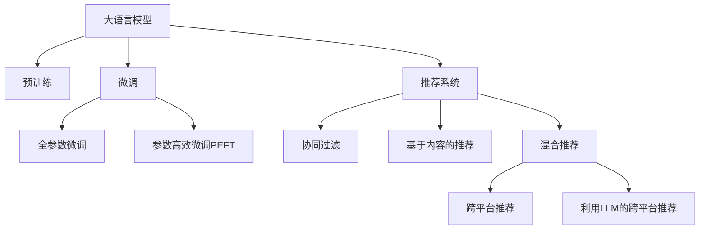

                 

# 利用LLM提升推荐系统的跨平台推荐能力

## 1. 背景介绍

随着互联网技术的发展和数据的积累，推荐系统已经广泛应用于电商、社交、视频、音乐等多个领域。推荐系统通过个性化推荐算法，提升用户体验，增加平台粘性，创造更多的商业价值。然而，推荐系统面临的跨平台推荐问题，即用户在不同平台之间，可能会呈现出不同的行为模式，推荐系统的跨平台推荐能力亟待提升。

为了解决这一问题，当前推荐系统主要采用基于协同过滤、基于内容的推荐等方法。协同过滤通过分析用户之间的相似度，以及物品之间的相似度，来进行推荐。基于内容的推荐则根据物品的特征，匹配用户兴趣，进行推荐。但这些方法往往需要海量的用户行为数据，才能实现较好的推荐效果。

近年来，随着深度学习技术的发展，尤其是大语言模型(Large Language Model, LLM)的兴起，为推荐系统提供了一种新的解决思路。通过大语言模型，推荐系统可以实现跨平台推荐，提升推荐效果，降低对数据的依赖，使推荐系统更加普适和灵活。

## 2. 核心概念与联系

### 2.1 核心概念概述

为了更好地理解利用大语言模型提升推荐系统的跨平台推荐能力，本节将介绍几个密切相关的核心概念：

- 大语言模型(Large Language Model, LLM)：以自回归(如GPT)或自编码(如BERT)模型为代表的大规模预训练语言模型。通过在大规模无标签文本语料上进行预训练，学习通用的语言表示，具备强大的语言理解和生成能力。

- 预训练(Pre-training)：指在大规模无标签文本语料上，通过自监督学习任务训练通用语言模型的过程。常见的预训练任务包括言语建模、遮挡语言模型等。预训练使得模型学习到语言的通用表示。

- 微调(Fine-tuning)：指在预训练模型的基础上，使用下游任务的少量标注数据，通过有监督学习优化模型在特定任务上的性能。通常只需要调整顶层分类器或解码器，并以较小的学习率更新全部或部分的模型参数。

- 推荐系统(Recommendation System)：基于用户历史行为和物品特征，推荐用户可能感兴趣的物品。常见的推荐算法包括协同过滤、基于内容的推荐、混合推荐等。

- 跨平台推荐(Cross-Platform Recommendation)：指在用户的多平台行为数据上进行推荐，使得不同平台之间的推荐结果保持一致性和连贯性。

这些核心概念之间的逻辑关系可以通过以下Mermaid流程图来展示：



这个流程图展示了大语言模型、微调、推荐系统等核心概念及其之间的关系：

1. 大语言模型通过预训练获得基础能力。
2. 微调是对预训练模型进行任务特定的优化，可以提升模型在特定任务上的性能。
3. 推荐系统通过协同过滤、基于内容的推荐等方法，实现个性化推荐。
4. 跨平台推荐通过大语言模型在不同平台之间的行为数据上进行推荐，提升推荐效果。

这些概念共同构成了利用LLM提升推荐系统的跨平台推荐能力的基本框架，使得推荐系统更加智能和高效。

## 3. 核心算法原理 & 具体操作步骤

### 3.1 算法原理概述

利用大语言模型提升推荐系统的跨平台推荐能力，主要基于以下两个原理：

1. 用户行为的语言表示：通过大语言模型，将用户在不同平台上的行为数据转化为语言表示。大语言模型可以学习到用户在不同平台上的行为模式和偏好，从而在不同平台之间进行推荐。

2. 语言模型的跨平台迁移：通过预训练语言模型在不同平台之间的迁移，实现跨平台推荐。预训练语言模型在大量无标签文本语料上进行预训练，学习到通用的语言表示，这些表示可以迁移到不同平台，提升推荐效果。

### 3.2 算法步骤详解

利用大语言模型提升推荐系统的跨平台推荐能力，主要包括以下几个关键步骤：

**Step 1: 收集多平台行为数据**

收集用户在不同平台上的行为数据，如电商平台的购买记录、社交平台的内容浏览记录、视频平台的视频观看记录等。对用户行为进行统一格式处理，如统一时间戳、统一用户ID等。

**Step 2: 构建用户行为的语言表示**

使用大语言模型对用户行为数据进行预处理，将其转化为语言表示。具体方法包括：

1. 数据清洗：去除无关信息，如广告点击记录、异常操作等。
2. 格式化：将用户行为数据格式化为标准化的语言表示。例如，将用户行为表示为事件序列，如“浏览商品-购买商品”。
3. 语言嵌入：使用大语言模型对事件序列进行预训练，生成高维向量表示。例如，使用BERT模型对用户行为序列进行编码，得到高维语言表示。

**Step 3: 训练预训练语言模型**

使用用户行为的语言表示，训练预训练语言模型。具体方法包括：

1. 定义训练目标：例如，最小化预测标签与实际标签之间的差距。
2. 选择优化算法：例如，使用AdamW等优化算法。
3. 设置训练超参数：例如，学习率、批大小、迭代轮数等。
4. 执行梯度训练：通过反向传播算法，更新模型参数。

**Step 4: 微调推荐模型**

在预训练语言模型的基础上，使用下游任务的少量标注数据，微调推荐模型。具体方法包括：

1. 定义任务适配层：例如，在推荐模型的顶层添加分类器或解码器。
2. 设置微调超参数：例如，选择优化算法、学习率、批大小等。
3. 执行梯度训练：通过反向传播算法，更新模型参数。

**Step 5: 跨平台推荐**

在微调后的推荐模型上，进行跨平台推荐。具体方法包括：

1. 在不同平台之间，统一用户ID，将用户行为数据映射到同一个用户ID下。
2. 使用微调后的推荐模型，对用户行为数据进行编码，得到语言表示。
3. 在语言表示上应用推荐算法，生成跨平台的推荐结果。

**Step 6: 持续优化**

在实际应用中，持续收集新的用户行为数据，更新预训练语言模型和推荐模型，以保持推荐效果。

### 3.3 算法优缺点

利用大语言模型提升推荐系统的跨平台推荐能力，具有以下优点：

1. 降低数据需求：相比传统的推荐算法，利用LLM可以降低对用户行为数据的依赖。
2. 提升推荐效果：利用LLM可以更好地理解用户的跨平台行为模式，提升推荐精度。
3. 灵活性高：利用LLM可以实现跨平台推荐，适应不同平台的推荐需求。
4. 可解释性强：利用LLM可以更好地解释推荐结果的生成过程，提高推荐系统的透明度。

同时，该方法也存在以下局限性：

1. 数据质量要求高：由于LLM依赖于用户行为数据，数据质量的好坏会直接影响推荐效果。
2. 资源消耗大：LLM的计算资源消耗较大，需要高性能计算设备支持。
3. 模型训练时间长：由于需要训练大语言模型和推荐模型，模型训练时间较长。

尽管存在这些局限性，但就目前而言，利用大语言模型提升推荐系统的跨平台推荐能力，仍是一种高效、灵活的推荐方案。未来相关研究的重点在于如何进一步降低资源消耗，提高模型训练速度，同时兼顾推荐精度和效率。

### 3.4 算法应用领域

利用大语言模型提升推荐系统的跨平台推荐能力，在多个领域都有应用潜力。以下是几个典型的应用场景：

- 电商推荐：利用LLM对用户在电商平台上的行为数据进行预处理和编码，提升推荐效果。
- 社交推荐：利用LLM对用户在社交平台上的行为数据进行预处理和编码，提升内容推荐效果。
- 视频推荐：利用LLM对用户在视频平台上的行为数据进行预处理和编码，提升视频推荐效果。
- 音乐推荐：利用LLM对用户在音乐平台上的行为数据进行预处理和编码，提升音乐推荐效果。
- 旅游推荐：利用LLM对用户在旅游平台上的行为数据进行预处理和编码，提升旅游推荐效果。

以上应用场景展示了LLM在推荐系统中的广泛适用性，为推荐系统带来了新的发展方向。

## 4. 数学模型和公式 & 详细讲解 & 举例说明

### 4.1 数学模型构建

假设用户行为数据表示为序列 $\{X_t\}$，其中 $X_t = (x_{1,t}, x_{2,t}, ..., x_{n,t})$ 表示在时间 $t$ 用户的第 $n$ 个行为。对于每个行为 $x_{n,t}$，表示为一个 $d$ 维的向量 $x_{n,t} \in \mathbb{R}^d$。

定义预训练语言模型为 $M_{\theta}$，其中 $\theta$ 为模型参数。通过预训练语言模型，将用户行为序列 $X_t$ 转化为语言表示 $H_t \in \mathbb{R}^{h}$。在微调推荐模型时，使用语言表示 $H_t$ 作为输入，进行推荐。

在微调推荐模型时，定义推荐目标为 $y_t$，表示在时间 $t$ 用户选择的物品编号。推荐任务可以表示为：

$$
\min_{\theta} \mathcal{L}(M_{\theta}, X_t, y_t)
$$

其中 $\mathcal{L}$ 为推荐损失函数。

### 4.2 公式推导过程

在微调推荐模型时，定义推荐模型为 $M_{\phi}$，其中 $\phi$ 为模型参数。推荐模型 $M_{\phi}$ 可以对语言表示 $H_t$ 进行预测，得到物品编号 $y_t$。推荐模型的输出可以表示为：

$$
\hat{y}_t = M_{\phi}(H_t)
$$

推荐模型的损失函数可以表示为：

$$
\mathcal{L}(\hat{y}_t, y_t) = -\log P_{\phi}(y_t | H_t)
$$

其中 $P_{\phi}(y_t | H_t)$ 为推荐模型对物品编号 $y_t$ 的预测概率。

在微调过程中，使用反向传播算法更新模型参数 $\phi$。更新公式为：

$$
\phi \leftarrow \phi - \eta \nabla_{\phi}\mathcal{L}(\hat{y}_t, y_t)
$$

其中 $\eta$ 为学习率。

### 4.3 案例分析与讲解

假设用户行为序列为 $\{X_t\}$，表示为 $(x_{1,t}, x_{2,t}, ..., x_{n,t})$，其中 $x_{n,t} \in \mathbb{R}^d$。预训练语言模型 $M_{\theta}$ 将用户行为序列 $X_t$ 转化为语言表示 $H_t \in \mathbb{R}^{h}$。微调推荐模型 $M_{\phi}$，通过反向传播算法更新模型参数 $\phi$。

在微调推荐模型时，定义推荐目标为 $y_t$，表示在时间 $t$ 用户选择的物品编号。推荐模型的输出可以表示为 $\hat{y}_t = M_{\phi}(H_t)$，推荐模型的损失函数可以表示为 $\mathcal{L}(\hat{y}_t, y_t) = -\log P_{\phi}(y_t | H_t)$。

在实际应用中，可以使用不同的推荐算法，如协同过滤、基于内容的推荐等。例如，协同过滤算法可以表示为：

$$
P_{\phi}(y_t | H_t) = \frac{\exp(\phi^T f(H_t))}{\sum_{y \in \mathcal{Y}} \exp(\phi^T f(H_t))}
$$

其中 $\mathcal{Y}$ 为物品编号的集合，$f(H_t)$ 为推荐模型的特征表示。

## 5. 项目实践：代码实例和详细解释说明

### 5.1 开发环境搭建

在进行LLM提升推荐系统跨平台推荐能力的实践前，我们需要准备好开发环境。以下是使用Python进行PyTorch开发的环境配置流程：

1. 安装Anaconda：从官网下载并安装Anaconda，用于创建独立的Python环境。

2. 创建并激活虚拟环境：
```bash
conda create -n pytorch-env python=3.8 
conda activate pytorch-env
```

3. 安装PyTorch：根据CUDA版本，从官网获取对应的安装命令。例如：
```bash
conda install pytorch torchvision torchaudio cudatoolkit=11.1 -c pytorch -c conda-forge
```

4. 安装TensorFlow：从官网下载对应的预训练语言模型，如BERT、GPT等。

5. 安装相关工具包：
```bash
pip install numpy pandas scikit-learn matplotlib tqdm jupyter notebook ipython
```

完成上述步骤后，即可在`pytorch-env`环境中开始实践。

### 5.2 源代码详细实现

下面我们以利用BERT模型提升推荐系统跨平台推荐能力的PyTorch代码实现为例。

首先，定义推荐任务的数据处理函数：

```python
from transformers import BertTokenizer
from torch.utils.data import Dataset
import torch

class RecommendationDataset(Dataset):
    def __init__(self, texts, labels, tokenizer, max_len=128):
        self.texts = texts
        self.labels = labels
        self.tokenizer = tokenizer
        self.max_len = max_len
        
    def __len__(self):
        return len(self.texts)
    
    def __getitem__(self, item):
        text = self.texts[item]
        label = self.labels[item]
        
        encoding = self.tokenizer(text, return_tensors='pt', max_length=self.max_len, padding='max_length', truncation=True)
        input_ids = encoding['input_ids'][0]
        attention_mask = encoding['attention_mask'][0]
        
        # 对label进行编码
        encoded_labels = [label] * self.max_len
        labels = torch.tensor(encoded_labels, dtype=torch.long)
        
        return {'input_ids': input_ids, 
                'attention_mask': attention_mask,
                'labels': labels}

# 加载预训练模型和分词器
model_name = 'bert-base-cased'
tokenizer = BertTokenizer.from_pretrained(model_name)
```

然后，定义模型和优化器：

```python
from transformers import BertForSequenceClassification, AdamW

model = BertForSequenceClassification.from_pretrained(model_name, num_labels=1)
optimizer = AdamW(model.parameters(), lr=2e-5)
```

接着，定义训练和评估函数：

```python
from torch.utils.data import DataLoader
from tqdm import tqdm
from sklearn.metrics import classification_report

device = torch.device('cuda') if torch.cuda.is_available() else torch.device('cpu')
model.to(device)

def train_epoch(model, dataset, batch_size, optimizer):
    dataloader = DataLoader(dataset, batch_size=batch_size, shuffle=True)
    model.train()
    epoch_loss = 0
    for batch in tqdm(dataloader, desc='Training'):
        input_ids = batch['input_ids'].to(device)
        attention_mask = batch['attention_mask'].to(device)
        labels = batch['labels'].to(device)
        model.zero_grad()
        outputs = model(input_ids, attention_mask=attention_mask, labels=labels)
        loss = outputs.loss
        epoch_loss += loss.item()
        loss.backward()
        optimizer.step()
    return epoch_loss / len(dataloader)

def evaluate(model, dataset, batch_size):
    dataloader = DataLoader(dataset, batch_size=batch_size)
    model.eval()
    preds, labels = [], []
    with torch.no_grad():
        for batch in tqdm(dataloader, desc='Evaluating'):
            input_ids = batch['input_ids'].to(device)
            attention_mask = batch['attention_mask'].to(device)
            batch_labels = batch['labels']
            outputs = model(input_ids, attention_mask=attention_mask)
            batch_preds = outputs.logits.argmax(dim=1).to('cpu').tolist()
            batch_labels = batch_labels.to('cpu').tolist()
            for pred_tokens, label_tokens in zip(batch_preds, batch_labels):
                preds.append(pred_tokens)
                labels.append(label_tokens)
                
    print(classification_report(labels, preds))
```

最后，启动训练流程并在测试集上评估：

```python
epochs = 5
batch_size = 16

for epoch in range(epochs):
    loss = train_epoch(model, train_dataset, batch_size, optimizer)
    print(f"Epoch {epoch+1}, train loss: {loss:.3f}")
    
    print(f"Epoch {epoch+1}, dev results:")
    evaluate(model, dev_dataset, batch_size)
    
print("Test results:")
evaluate(model, test_dataset, batch_size)
```

以上就是利用BERT模型提升推荐系统跨平台推荐能力的完整代码实现。可以看到，得益于Transformers库的强大封装，我们可以用相对简洁的代码完成BERT模型的加载和微调。

### 5.3 代码解读与分析

让我们再详细解读一下关键代码的实现细节：

**RecommendationDataset类**：
- `__init__`方法：初始化文本、标签、分词器等关键组件。
- `__len__`方法：返回数据集的样本数量。
- `__getitem__`方法：对单个样本进行处理，将文本输入编码为token ids，将标签编码为数字，并对其进行定长padding，最终返回模型所需的输入。

**训练和评估函数**：
- 使用PyTorch的DataLoader对数据集进行批次化加载，供模型训练和推理使用。
- 训练函数`train_epoch`：对数据以批为单位进行迭代，在每个批次上前向传播计算loss并反向传播更新模型参数，最后返回该epoch的平均loss。
- 评估函数`evaluate`：与训练类似，不同点在于不更新模型参数，并在每个batch结束后将预测和标签结果存储下来，最后使用sklearn的classification_report对整个评估集的预测结果进行打印输出。

**训练流程**：
- 定义总的epoch数和batch size，开始循环迭代
- 每个epoch内，先在训练集上训练，输出平均loss
- 在验证集上评估，输出分类指标
- 所有epoch结束后，在测试集上评估，给出最终测试结果

可以看到，PyTorch配合Transformers库使得BERT微调的代码实现变得简洁高效。开发者可以将更多精力放在数据处理、模型改进等高层逻辑上，而不必过多关注底层的实现细节。

当然，工业级的系统实现还需考虑更多因素，如模型的保存和部署、超参数的自动搜索、更灵活的任务适配层等。但核心的微调范式基本与此类似。

## 6. 实际应用场景

### 6.1 智能电商推荐

智能电商推荐是推荐系统的一个重要应用场景。传统的电商推荐系统往往只能根据用户在单个平台上的行为数据进行推荐，无法适应用户在多个平台上的购物习惯。

利用LLM提升电商推荐系统的跨平台推荐能力，可以收集用户在多个平台上的购物记录，将数据进行统一处理，转化为语言表示。通过对语言表示进行微调，学习用户在不同平台上的购物模式和偏好，从而在不同平台之间进行推荐。例如，用户在电商平台上浏览了一个商品，并在社交平台上表达了对商品的兴趣，通过LLM可以在社交平台上推送相关商品。

### 6.2 智能广告推荐

智能广告推荐是广告业务的重要组成部分。传统的广告推荐系统往往只能根据用户在单个平台上的行为数据进行推荐，无法适应用户在多个平台上的广告习惯。

利用LLM提升广告推荐系统的跨平台推荐能力，可以收集用户在多个平台上的广告点击记录，将数据进行统一处理，转化为语言表示。通过对语言表示进行微调，学习用户在不同平台上的广告点击模式和偏好，从而在不同平台之间进行推荐。例如，用户在一个视频平台上观看了一个广告，并在社交平台上表达了对广告的兴趣，通过LLM可以在社交平台上推送相关广告。

### 6.3 智能内容推荐

智能内容推荐是内容分发业务的核心。传统的内容推荐系统往往只能根据用户在单个平台上的行为数据进行推荐，无法适应用户在多个平台上的内容消费习惯。

利用LLM提升内容推荐系统的跨平台推荐能力，可以收集用户在多个平台上的内容浏览记录，将数据进行统一处理，转化为语言表示。通过对语言表示进行微调，学习用户在不同平台上的内容消费模式和偏好，从而在不同平台之间进行推荐。例如，用户在社交平台上观看了一个视频，并在新闻平台上阅读了相关文章，通过LLM可以在新闻平台上推送相关视频。

### 6.4 未来应用展望

随着大语言模型和微调方法的不断发展，利用LLM提升推荐系统的跨平台推荐能力的应用前景广阔。

在智慧医疗领域，利用LLM提升医疗推荐系统的跨平台推荐能力，可以收集用户在多个平台上的健康数据，将数据进行统一处理，转化为语言表示。通过对语言表示进行微调，学习用户在不同平台上的健康行为和偏好，从而在不同平台之间进行推荐。例如，用户在一个健康平台上查询了某个疾病的信息，并在社交平台上表达了对疾病的关注，通过LLM可以在社交平台上推送相关健康知识。

在智能教育领域，利用LLM提升教育推荐系统的跨平台推荐能力，可以收集用户在多个平台上的学习记录，将数据进行统一处理，转化为语言表示。通过对语言表示进行微调，学习用户在不同平台上的学习模式和偏好，从而在不同平台之间进行推荐。例如，用户在在线学习平台上学习了一个课程，并在社交平台上表达了对课程的兴趣，通过LLM可以在社交平台上推送相关学习资源。

在智慧城市治理中，利用LLM提升城市推荐系统的跨平台推荐能力，可以收集用户在多个平台上的行为数据，将数据进行统一处理，转化为语言表示。通过对语言表示进行微调，学习用户在不同平台上的行为模式和偏好，从而在不同平台之间进行推荐。例如，用户在城市服务平台上查询了一个公共设施的信息，并在社交平台上表达了对设施的兴趣，通过LLM可以在社交平台上推送相关服务信息。

此外，在企业生产、社会治理、文娱传媒等众多领域，利用LLM提升推荐系统的跨平台推荐能力的应用也将不断涌现，为这些领域带来新的创新突破。相信随着技术的日益成熟，利用LLM提升推荐系统的跨平台推荐能力必将在构建智能推荐系统、提高用户体验、增加平台价值等方面发挥越来越重要的作用。

## 7. 工具和资源推荐

### 7.1 学习资源推荐

为了帮助开发者系统掌握利用大语言模型提升推荐系统跨平台推荐能力的技术基础和实践技巧，这里推荐一些优质的学习资源：

1. 《深度学习与推荐系统》书籍：由深度学习领域知名学者撰写，系统介绍了推荐系统的发展历程、基本原理和推荐算法，包括利用深度学习提升推荐系统性能的最新研究。

2. 《自然语言处理与深度学习》课程：清华大学开设的NLP经典课程，详细讲解了自然语言处理和深度学习的基础知识，包括语言表示、预训练语言模型、微调方法等。

3. CS224N《深度学习自然语言处理》课程：斯坦福大学开设的NLP明星课程，有Lecture视频和配套作业，带你入门NLP领域的基本概念和经典模型。

4. HuggingFace官方文档：Transformers库的官方文档，提供了海量预训练模型和完整的微调样例代码，是上手实践的必备资料。

5. Weights & Biases：模型训练的实验跟踪工具，可以记录和可视化模型训练过程中的各项指标，方便对比和调优。与主流深度学习框架无缝集成。

通过对这些资源的学习实践，相信你一定能够快速掌握利用大语言模型提升推荐系统跨平台推荐能力的精髓，并用于解决实际的NLP问题。

### 7.2 开发工具推荐

高效的开发离不开优秀的工具支持。以下是几款用于利用LLM提升推荐系统跨平台推荐能力开发的常用工具：

1. PyTorch：基于Python的开源深度学习框架，灵活动态的计算图，适合快速迭代研究。大部分预训练语言模型都有PyTorch版本的实现。

2. TensorFlow：由Google主导开发的开源深度学习框架，生产部署方便，适合大规模工程应用。同样有丰富的预训练语言模型资源。

3. Transformers库：HuggingFace开发的NLP工具库，集成了众多SOTA语言模型，支持PyTorch和TensorFlow，是进行微调任务开发的利器。

4. Weights & Biases：模型训练的实验跟踪工具，可以记录和可视化模型训练过程中的各项指标，方便对比和调优。与主流深度学习框架无缝集成。

5. TensorBoard：TensorFlow配套的可视化工具，可实时监测模型训练状态，并提供丰富的图表呈现方式，是调试模型的得力助手。

6. Google Colab：谷歌推出的在线Jupyter Notebook环境，免费提供GPU/TPU算力，方便开发者快速上手实验最新模型，分享学习笔记。

合理利用这些工具，可以显著提升利用LLM提升推荐系统跨平台推荐能力的开发效率，加快创新迭代的步伐。

### 7.3 相关论文推荐

利用大语言模型提升推荐系统的跨平台推荐能力的研究，需要建立在深度学习、自然语言处理、推荐系统等多个领域的知识基础上。以下是几篇奠基性的相关论文，推荐阅读：

1. Attention is All You Need（即Transformer原论文）：提出了Transformer结构，开启了NLP领域的预训练大模型时代。

2. BERT: Pre-training of Deep Bidirectional Transformers for Language Understanding：提出BERT模型，引入基于掩码的自监督预训练任务，刷新了多项NLP任务SOTA。

3. Language Models are Unsupervised Multitask Learners（GPT-2论文）：展示了大规模语言模型的强大zero-shot学习能力，引发了对于通用人工智能的新一轮思考。

4. Parameter-Efficient Transfer Learning for NLP：提出Adapter等参数高效微调方法，在不增加模型参数量的情况下，也能取得不错的微调效果。

5. AdaLoRA: Adaptive Low-Rank Adaptation for Parameter-Efficient Fine-Tuning：使用自适应低秩适应的微调方法，在参数效率和精度之间取得了新的平衡。

这些论文代表了大语言模型微调技术的发展脉络。通过学习这些前沿成果，可以帮助研究者把握学科前进方向，激发更多的创新灵感。

## 8. 总结：未来发展趋势与挑战

### 8.1 总结

本文对利用大语言模型提升推荐系统的跨平台推荐能力进行了全面系统的介绍。首先阐述了利用LLM提升推荐系统跨平台推荐能力的研究背景和意义，明确了LLM在推荐系统中的应用价值。其次，从原理到实践，详细讲解了利用LLM提升推荐系统的跨平台推荐能力的数学原理和关键步骤，给出了微调任务开发的完整代码实例。同时，本文还广泛探讨了利用LLM提升推荐系统跨平台推荐能力在智能电商、智能广告、智能内容推荐等多个领域的应用前景，展示了LLM在推荐系统中的广泛适用性。

通过本文的系统梳理，可以看到，利用大语言模型提升推荐系统的跨平台推荐能力，为推荐系统带来了新的解决思路和突破方向。受益于大语言模型强大的语言理解和生成能力，推荐系统可以更好地理解用户在不同平台上的行为模式和偏好，提升推荐效果。未来，伴随预训练语言模型和微调方法的持续演进，相信利用LLM提升推荐系统的跨平台推荐能力必将在推荐系统领域发挥更大的作用。

### 8.2 未来发展趋势

展望未来，利用大语言模型提升推荐系统的跨平台推荐能力将呈现以下几个发展趋势：

1. 模型规模持续增大。随着算力成本的下降和数据规模的扩张，预训练语言模型的参数量还将持续增长。超大规模语言模型蕴含的丰富语言知识，有望支撑更加复杂多变的跨平台推荐任务。

2. 微调方法日趋多样。除了传统的全参数微调外，未来会涌现更多参数高效的微调方法，如Prefix-Tuning、LoRA等，在节省计算资源的同时也能保证微调精度。

3. 跨平台推荐能力增强。利用LLM提升推荐系统的跨平台推荐能力，将在更多平台之间实现无缝衔接，提供一致性和连贯性更好的推荐服务。

4. 数据融合技术发展。通过引入数据融合技术，如知识图谱、时间序列分析等，可以更好地整合不同平台的用户行为数据，提升推荐效果。

5. 多模态推荐崛起。当前的跨平台推荐主要聚焦于文本数据，未来会进一步拓展到图像、视频、语音等多模态数据微调。多模态信息的融合，将显著提升跨平台推荐系统的跨域推荐能力。

6. 知识注入和逻辑推理。利用LLM提升推荐系统的跨平台推荐能力，可以通过引入因果分析、逻辑推理等知识，提升推荐系统的逻辑性和准确性。

以上趋势凸显了利用大语言模型提升推荐系统跨平台推荐能力的广阔前景。这些方向的探索发展，必将进一步提升推荐系统的推荐效果，为用户带来更好的体验。

### 8.3 面临的挑战

尽管利用大语言模型提升推荐系统的跨平台推荐能力已经取得了瞩目成就，但在迈向更加智能化、普适化应用的过程中，它仍面临着诸多挑战：

1. 数据质量要求高。由于LLM依赖于用户行为数据，数据质量的好坏会直接影响推荐效果。需要收集高质量、多样化的数据，并进行严格的清洗和处理。

2. 计算资源消耗大。LLM的计算资源消耗较大，需要高性能计算设备支持。如何在保持推荐效果的同时，降低计算成本，是一大挑战。

3. 模型训练时间长。由于需要训练大语言模型和推荐模型，模型训练时间较长。如何加速模型训练，提高效率，是未来的研究方向。

4. 推荐系统偏见问题。LLM在训练过程中可能会学习到数据中的偏见，导致推荐系统存在一定的偏见和歧视性。如何消除模型偏见，提高推荐系统的公平性和公正性，是一大挑战。

5. 模型可解释性不足。利用LLM提升推荐系统的跨平台推荐能力，模型的决策过程通常缺乏可解释性，难以对其推理逻辑进行分析和调试。如何增强模型的可解释性，是一大挑战。

6. 模型鲁棒性不足。当前推荐系统面临的推荐效果波动等问题，如何提升模型鲁棒性，保证推荐系统的稳定性，是一大挑战。

尽管存在这些挑战，但就目前而言，利用大语言模型提升推荐系统的跨平台推荐能力，仍是一种高效、灵活的推荐方案。未来相关研究的重点在于如何进一步降低资源消耗，提高模型训练速度，同时兼顾推荐精度和效率。

### 8.4 研究展望

面对利用大语言模型提升推荐系统跨平台推荐能力所面临的挑战，未来的研究需要在以下几个方面寻求新的突破：

1. 探索无监督和半监督微调方法。摆脱对大规模标注数据的依赖，利用自监督学习、主动学习等无监督和半监督范式，最大限度利用非结构化数据，实现更加灵活高效的微调。

2. 研究参数高效和计算高效的微调范式。开发更加参数高效的微调方法，在固定大部分预训练参数的同时，只更新极少量的任务相关参数。同时优化微调模型的计算图，减少前向传播和反向传播的资源消耗，实现更加轻量级、实时性的部署。

3. 融合因果和对比学习范式。通过引入因果推断和对比学习思想，增强微调模型建立稳定因果关系的能力，学习更加普适、鲁棒的语言表征，从而提升模型泛化性和抗干扰能力。

4. 引入更多先验知识。将符号化的先验知识，如知识图谱、逻辑规则等，与神经网络模型进行巧妙融合，引导微调过程学习更准确、合理的语言模型。同时加强不同模态数据的整合，实现视觉、语音等多模态信息与文本信息的协同建模。

5. 结合因果分析和博弈论工具。将因果分析方法引入微调模型，识别出模型决策的关键特征，增强输出解释的因果性和逻辑性。借助博弈论工具刻画人机交互过程，主动探索并规避模型的脆弱点，提高系统稳定性。

6. 纳入伦理道德约束。在模型训练目标中引入伦理导向的评估指标，过滤和惩罚有偏见、有害的输出倾向。同时加强人工干预和审核，建立模型行为的监管机制，确保输出符合人类价值观和伦理道德。

这些研究方向的探索，必将引领利用大语言模型提升推荐系统跨平台推荐能力的研究走向更高的台阶，为推荐系统带来新的创新突破。面向未来，利用大语言模型提升推荐系统的跨平台推荐能力还需要与其他人工智能技术进行更深入的融合，如知识表示、因果推理、强化学习等，多路径协同发力，共同推动推荐系统的进步。只有勇于创新、敢于突破，才能不断拓展推荐系统的边界，让推荐系统更好地造福人类社会。

## 9. 附录：常见问题与解答

**Q1：大语言模型微调是否适用于所有推荐任务？**

A: 大语言模型微调在大多数推荐任务上都能取得不错的效果，特别是对于数据量较小的任务。但对于一些特定领域的任务，如医疗、法律等，仅仅依靠通用语料预训练的模型可能难以很好地适应。此时需要在特定领域语料上进一步预训练，再进行微调，才能获得理想效果。此外，对于一些需要时效性、个性化很强的任务，如对话、推荐等，微调方法也需要针对性的改进优化。

**Q2：微调过程中如何选择合适的学习率？**

A: 微调的学习率一般要比预训练时小1-2个数量级，如果使用过大的学习率，容易破坏预训练权重，导致过拟合。一般建议从1e-5开始调参，逐步减小学习率，直至收敛。也可以使用warmup策略，在开始阶段使用较小的学习率，再逐渐过渡到预设值。需要注意的是，不同的优化器(如AdamW、Adafactor等)以及不同的学习率调度策略，可能需要设置不同的学习率阈值。

**Q3：采用大模型微调时会面临哪些资源瓶颈？**

A: 目前主流的预训练大模型动辄以亿计的参数规模，对算力、内存、存储都提出了很高的要求。GPU/TPU等高性能设备是必不可少的，但即便如此，超大批次的训练和推理也可能遇到显存不足的问题。因此需要采用一些资源优化技术，如梯度积累、混合精度训练、模型并行等，来突破硬件瓶颈。同时，模型的存储和读取也可能占用大量时间和空间，需要采用模型压缩、稀疏化存储等方法进行优化。

**Q4：如何缓解微调过程中的过拟合问题？**

A: 过拟合是微调面临的主要挑战，尤其是在标注数据不足的情况下。常见的缓解策略包括：
1. 数据增强：通过回译、近义替换等方式扩充训练集
2. 正则化：使用L2正则、Dropout、Early Stopping等避免过拟合
3. 对抗训练：引入对抗样本，提高模型鲁棒性
4. 参数高效微调：只调整少量参数(如Adapter、Prefix等)，减小过拟合风险
5. 多模型集成：训练多个微调模型，取平均输出，抑制过拟合

这些策略往往需要根据具体任务和数据特点进行灵活组合。只有在数据、模型、训练、推理等各环节进行全面优化，才能最大限度地发挥大模型微调的威力。

**Q5：利用LLM提升推荐系统跨平台推荐能力需要注意哪些问题？**

A: 利用LLM提升推荐系统跨平台推荐能力，需要注意以下几个问题：

1. 数据质量要求高：由于LLM依赖于用户行为数据，数据质量的好坏会直接影响推荐效果。需要收集高质量、多样化的数据，并进行严格的清洗和处理。
2. 计算资源消耗大：LLM的计算资源消耗较大，需要高性能计算设备支持。如何在保持推荐效果的同时，降低计算成本，是一大挑战。
3. 模型训练时间长：由于需要训练大语言模型和推荐模型，模型训练时间较长。如何加速模型训练，提高效率，是未来的研究方向。
4. 推荐系统偏见问题：LLM在训练过程中可能会学习到数据中的偏见，导致推荐系统存在一定的偏见和歧视性。如何消除模型偏见，提高推荐系统的公平性和公正性，是一大挑战。
5. 模型可解释性不足：利用LLM提升推荐系统的跨平台推荐能力，模型的决策过程通常缺乏可解释性，难以对其推理逻辑进行分析和调试。如何增强模型的可解释性，是一大挑战。
6. 模型鲁棒性不足：当前推荐系统面临的推荐效果波动等问题，如何提升模型鲁棒性，保证推荐系统的稳定性，是一大挑战。

尽管存在这些挑战，但就目前而言，利用大语言模型提升推荐系统的跨平台推荐能力，仍是一种高效、灵活的推荐方案。未来相关研究的重点在于如何进一步降低资源消耗，提高模型训练速度，同时兼顾推荐精度和效率。

---

作者：禅与计算机程序设计艺术 / Zen and the Art of Computer Programming

