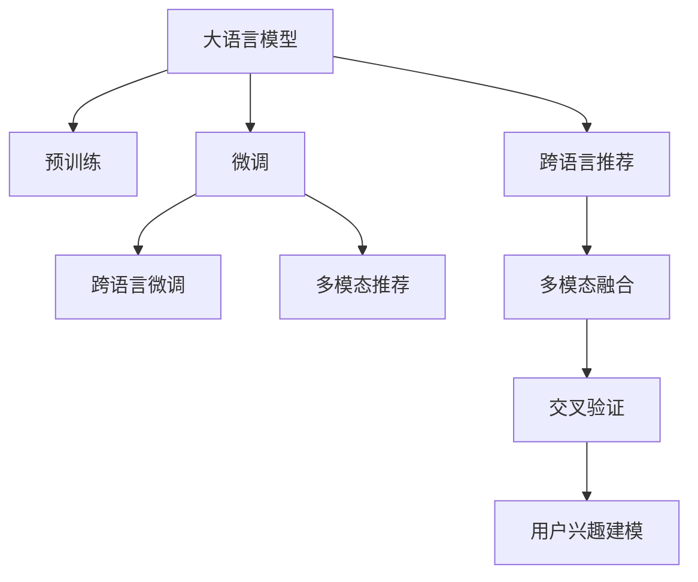

                 

# 利用LLM提升推荐系统的跨语言推荐能力

## 1. 背景介绍

在信息爆炸的互联网时代，个性化推荐系统已成为各大平台提升用户黏性和运营效率的重要手段。然而，推荐系统主要依赖用户历史行为数据，缺乏跨语言多模态信息融合的能力。尽管当前已有多款语言模型，但往往仅限于单一语言文本信息的理解和生成，难以满足跨语言推荐的需求。近年来，随着大语言模型（Large Language Model, LLM）的快速发展，自然语言处理(Natural Language Processing, NLP)领域的推荐系统跨语言能力有望得到显著提升。

本文将深入探讨如何利用大语言模型，通过跨语言微调（Cross-Language Fine-Tuning）技术，提升推荐系统的跨语言推荐能力。文章将详细介绍LLM的原理，提出实用的微调方案，并结合实际案例，展现LLM在推荐系统中的应用效果。

## 2. 核心概念与联系

### 2.1 核心概念概述

在推荐系统领域，利用大语言模型进行跨语言推荐，主要涉及以下核心概念：

- 大语言模型（LLM）：指基于自回归或自编码结构，通过大规模无标签文本数据预训练，具备强大语言生成和理解能力的人工智能模型。
- 微调（Fine-Tuning）：指在预训练模型的基础上，使用少量标注数据对模型进行有监督学习，适应特定任务的优化过程。
- 跨语言推荐（Cross-Language Recommendation）：指在多语言推荐系统中，通过融合多种语言文本信息，实现跨语言推荐。
- 多模态推荐（Multi-modal Recommendation）：指融合文本、图片、音频等多类信息源，提升推荐系统的效果和泛化能力。
- 交叉验证（Cross-Validation）：指将数据集划分为训练集、验证集和测试集，评估模型性能的一种方法。
- 用户兴趣建模（User Interest Modeling）：指通过分析用户的历史行为数据，构建用户兴趣模型，为推荐算法提供指导。

这些概念之间的逻辑关系可以通过以下Mermaid流程图来展示：



这个流程图展示了大语言模型在推荐系统中的应用流程：

1. 大语言模型通过预训练获得语言理解和生成能力。
2. 通过跨语言微调，模型学习多种语言的语义表示，提升跨语言推荐能力。
3. 融合多模态信息，提高推荐的全面性和精准度。
4. 通过交叉验证和用户兴趣建模，评估推荐效果和模型表现。

## 3. 核心算法原理 & 具体操作步骤
### 3.1 算法原理概述

利用大语言模型进行跨语言推荐，核心在于通过对模型进行跨语言微调，使其适应多种语言的文本数据。具体步骤如下：

1. 选择或训练一个大规模预训练语言模型。
2. 收集跨语言推荐数据集，包含不同语言的文本和推荐结果。
3. 设计跨语言微调的目标函数，如最小化跨语言预测误差。
4. 使用少量的标注数据进行有监督学习，调整模型的参数。
5. 在微调后的模型上进行推荐预测，实现跨语言的推荐效果。

### 3.2 算法步骤详解

**Step 1: 准备预训练语言模型和数据集**

选择或训练一个大规模预训练语言模型。目前流行的预训练语言模型包括GPT-3、BERT、XLNet等。这里以BERT为例，介绍跨语言微调的具体步骤。

收集跨语言推荐数据集。数据集应包含不同语言的文本和推荐结果，如英文的商品描述和用户评分、中文的用户评价和商品ID等。数据集可以由平台方提供，也可以通过爬虫技术从公开的跨语言数据源获取。

**Step 2: 设计目标函数和损失函数**

设计跨语言微调的目标函数，如最小化跨语言预测误差。假设跨语言推荐数据集为 $D=\{(x_i,y_i)\}_{i=1}^N, x_i \in \mathcal{X}, y_i \in \mathcal{Y}$，其中 $x_i$ 表示文本数据，$y_i$ 表示推荐结果。则目标函数为：

$$
\min_{\theta} \mathcal{L}(\theta, D) = \frac{1}{N} \sum_{i=1}^N \ell(x_i, y_i, M_{\theta})
$$

其中 $\ell$ 为交叉熵损失函数，$M_{\theta}$ 表示微调后的BERT模型。

**Step 3: 准备微调数据**

将跨语言推荐数据集进行划分，如 $D=\{D_{train}, D_{valid}, D_{test}\}$，其中 $D_{train}$ 为训练集，$D_{valid}$ 为验证集，$D_{test}$ 为测试集。标注数据应包含语言标签和推荐结果，如 [English, item_id, rating] 或 [Chinese, item_id, rating] 等。

**Step 4: 执行微调**

使用少量的标注数据进行有监督学习，调整模型的参数。一般采用AdamW优化器，设置合适的学习率、批次大小和迭代轮数。例如：

```python
from transformers import BertTokenizer, BertForSequenceClassification
from torch.utils.data import DataLoader
import torch

# 初始化BERT模型
model = BertForSequenceClassification.from_pretrained('bert-base-uncased', num_labels=num_classes)

# 设置优化器和超参数
optimizer = AdamW(model.parameters(), lr=2e-5)
num_epochs = 5
batch_size = 16

# 定义微调数据集
train_data = ...
valid_data = ...
test_data = ...

# 定义模型损失函数
def compute_loss(model, inputs, labels):
    outputs = model(**inputs)
    loss = outputs.loss
    return loss

# 训练过程
for epoch in range(num_epochs):
    model.train()
    for batch in DataLoader(train_data, batch_size=batch_size):
        inputs = batch['input_ids']
        attention_mask = batch['attention_mask']
        labels = batch['labels']
        optimizer.zero_grad()
        loss = compute_loss(model, inputs, labels)
        loss.backward()
        optimizer.step()
        
    # 验证集评估
    model.eval()
    with torch.no_grad():
        for batch in DataLoader(valid_data, batch_size=batch_size):
            inputs = batch['input_ids']
            attention_mask = batch['attention_mask']
            labels = batch['labels']
            outputs = model(**inputs)
            loss = outputs.loss
            acc = outputs.accuracy
        
    # 测试集评估
    model.eval()
    with torch.no_grad():
        for batch in DataLoader(test_data, batch_size=batch_size):
            inputs = batch['input_ids']
            attention_mask = batch['attention_mask']
            labels = batch['labels']
            outputs = model(**inputs)
            loss = outputs.loss
            acc = outputs.accuracy
        
    # 记录验证和测试集结果
    valid_loss.append(loss.item())
    valid_acc.append(acc)
    test_loss.append(loss.item())
    test_acc.append(acc)
```

**Step 5: 应用微调模型**

微调后的模型可以用于跨语言推荐。假设商品描述为跨语言文本数据，用户评分（1-5分）为推荐结果。通过微调后的模型，可以预测用户对商品的评分。例如：

```python
# 加载微调后的模型
model.eval()

# 定义推荐函数
def recommend(model, text):
    inputs = tokenizer(text, return_tensors='pt', padding=True, truncation=True)
    outputs = model(**inputs)
    return outputs.logits.argmax().item()

# 推荐示例
item_text = "A high-quality laptop with long battery life."
recommended_rating = recommend(model, item_text)
print(f"推荐评分: {recommended_rating}")
```

### 3.3 算法优缺点

利用大语言模型进行跨语言推荐，具有以下优点：

1. 强大的语言理解能力：大语言模型通过大规模语料预训练，具备强大的跨语言文本理解和生成能力。
2. 高效的数据融合：大语言模型可以自动融合多种语言文本信息，提升推荐系统的泛化能力和精准度。
3. 灵活的微调策略：大语言模型可以通过参数高效微调（如Adapter）等技术，实现跨语言微调。
4. 跨语言推荐：大语言模型可以覆盖多种语言，提升跨语言推荐的效果。

然而，利用大语言模型进行跨语言推荐也存在以下缺点：

1. 数据获取难度：跨语言推荐需要多种语言的标注数据，数据获取难度较大。
2. 计算资源需求高：大规模语言模型的训练和微调需要高计算资源，对硬件要求较高。
3. 模型复杂度高：大语言模型的参数量较大，模型的推理和计算复杂度较高。
4. 多语言不一致性：不同语言的文本表达方式和语义结构差异较大，模型可能存在不一致性。

尽管存在这些局限性，但大语言模型在推荐系统中的应用潜力仍然巨大。随着技术的不断进步，这些缺点有望逐步得到克服。

### 3.4 算法应用领域

大语言模型在推荐系统中的应用领域主要包括：

1. 跨语言电商推荐：电商平台需要同时支持多种语言的用户，利用大语言模型可以提升跨语言商品推荐的效果。
2. 跨语言社交推荐：社交平台需要根据不同语言的用户行为推荐内容，大语言模型可以优化推荐策略。
3. 跨语言视频推荐：视频平台需要根据不同语言的字幕和描述推荐视频内容，大语言模型可以提升推荐精准度。
4. 跨语言新闻推荐：新闻平台需要根据不同语言的新闻内容推荐用户感兴趣的文章，大语言模型可以优化推荐结果。

除了上述这些主要领域外，大语言模型还广泛应用于跨语言搜索、跨语言广告投放等场景，为多语言用户提供更加个性化、高效的推荐服务。

## 4. 数学模型和公式 & 详细讲解  
### 4.1 数学模型构建

假设预训练语言模型为 $M_{\theta}$，其中 $\theta$ 为模型参数。给定跨语言推荐数据集 $D=\{(x_i,y_i)\}_{i=1}^N, x_i \in \mathcal{X}, y_i \in \mathcal{Y}$。设计微调的目标函数为：

$$
\min_{\theta} \mathcal{L}(\theta, D) = \frac{1}{N} \sum_{i=1}^N \ell(x_i, y_i, M_{\theta})
$$

其中 $\ell$ 为交叉熵损失函数，定义为：

$$
\ell(x_i, y_i, M_{\theta}) = -[y_i\log M_{\theta}(x_i)+(1-y_i)\log(1-M_{\theta}(x_i))]
$$

目标函数在微调过程中不断更新，最小化模型在训练集、验证集和测试集上的损失函数。

### 4.2 公式推导过程

假设微调后的模型输出为 $\hat{y}=M_{\theta}(x)$，则交叉熵损失函数可以表示为：

$$
\ell(x_i, y_i, M_{\theta}) = -[y_i\log M_{\theta}(x_i)+(1-y_i)\log(1-M_{\theta}(x_i))]
$$

目标函数可以写为：

$$
\mathcal{L}(\theta, D) = \frac{1}{N} \sum_{i=1}^N \ell(x_i, y_i, M_{\theta})
$$

根据链式法则，微调模型参数 $\theta$ 的梯度为：

$$
\frac{\partial \mathcal{L}(\theta, D)}{\partial \theta_k} = -\frac{1}{N}\sum_{i=1}^N (\frac{y_i}{M_{\theta}(x_i)}-\frac{1-y_i}{1-M_{\theta}(x_i)}) \frac{\partial M_{\theta}(x_i)}{\partial \theta_k}
$$

其中 $\frac{\partial M_{\theta}(x_i)}{\partial \theta_k}$ 为模型 $M_{\theta}$ 对输入 $x_i$ 的梯度，通过自动微分技术计算得到。

### 4.3 案例分析与讲解

以推荐系统为例，微调模型可以在商品描述中识别商品特点，并根据用户评分进行推荐。具体步骤如下：

1. 数据收集：从电商平台获取商品描述和用户评分，构建训练集、验证集和测试集。
2. 微调模型：使用预训练的BERT模型，加载微调数据集，进行跨语言微调。
3. 推荐预测：将用户输入的商品描述送入微调后的模型，输出商品评分预测结果。

## 5. 项目实践：代码实例和详细解释说明
### 5.1 开发环境搭建

在进行微调实践前，我们需要准备好开发环境。以下是使用Python进行PyTorch开发的环境配置流程：

1. 安装Anaconda：从官网下载并安装Anaconda，用于创建独立的Python环境。

2. 创建并激活虚拟环境：
```bash
conda create -n pytorch-env python=3.8 
conda activate pytorch-env
```

3. 安装PyTorch：根据CUDA版本，从官网获取对应的安装命令。例如：
```bash
conda install pytorch torchvision torchaudio cudatoolkit=11.1 -c pytorch -c conda-forge
```

4. 安装Transformers库：
```bash
pip install transformers
```

5. 安装各类工具包：
```bash
pip install numpy pandas scikit-learn matplotlib tqdm jupyter notebook ipython
```

完成上述步骤后，即可在`pytorch-env`环境中开始微调实践。

### 5.2 源代码详细实现

下面我们以跨语言电商推荐为例，给出使用Transformers库对BERT模型进行微调的PyTorch代码实现。

首先，定义推荐任务的数据处理函数：

```python
from transformers import BertTokenizer
from torch.utils.data import Dataset
import torch

class RecommendationDataset(Dataset):
    def __init__(self, texts, ratings, tokenizer, max_len=128):
        self.texts = texts
        self.ratings = ratings
        self.tokenizer = tokenizer
        self.max_len = max_len
        
    def __len__(self):
        return len(self.texts)
    
    def __getitem__(self, item):
        text = self.texts[item]
        rating = self.ratings[item]
        
        encoding = self.tokenizer(text, return_tensors='pt', max_length=self.max_len, padding='max_length', truncation=True)
        input_ids = encoding['input_ids'][0]
        attention_mask = encoding['attention_mask'][0]
        
        # 对rating进行编码
        encoded_rating = rating
        
        return {'input_ids': input_ids, 
                'attention_mask': attention_mask,
                'labels': encoded_rating}

# 标签与id的映射
tag2id = {'0': 0, '1': 1, '2': 2, '3': 3, '4': 4, '5': 5}
id2tag = {v: k for k, v in tag2id.items()}

# 创建dataset
tokenizer = BertTokenizer.from_pretrained('bert-base-uncased')

train_dataset = RecommendationDataset(train_texts, train_ratings, tokenizer)
dev_dataset = RecommendationDataset(dev_texts, dev_ratings, tokenizer)
test_dataset = RecommendationDataset(test_texts, test_ratings, tokenizer)
```

然后，定义模型和优化器：

```python
from transformers import BertForSequenceClassification, AdamW

model = BertForSequenceClassification.from_pretrained('bert-base-uncased', num_labels=len(tag2id))

optimizer = AdamW(model.parameters(), lr=2e-5)
```

接着，定义训练和评估函数：

```python
from torch.utils.data import DataLoader
from tqdm import tqdm
from sklearn.metrics import accuracy_score

device = torch.device('cuda') if torch.cuda.is_available() else torch.device('cpu')
model.to(device)

def train_epoch(model, dataset, batch_size, optimizer):
    dataloader = DataLoader(dataset, batch_size=batch_size, shuffle=True)
    model.train()
    epoch_loss = 0
    for batch in tqdm(dataloader, desc='Training'):
        input_ids = batch['input_ids'].to(device)
        attention_mask = batch['attention_mask'].to(device)
        labels = batch['labels'].to(device)
        model.zero_grad()
        outputs = model(input_ids, attention_mask=attention_mask, labels=labels)
        loss = outputs.loss
        epoch_loss += loss.item()
        loss.backward()
        optimizer.step()
    return epoch_loss / len(dataloader)

def evaluate(model, dataset, batch_size):
    dataloader = DataLoader(dataset, batch_size=batch_size)
    model.eval()
    preds, labels = [], []
    with torch.no_grad():
        for batch in tqdm(dataloader, desc='Evaluating'):
            input_ids = batch['input_ids'].to(device)
            attention_mask = batch['attention_mask'].to(device)
            batch_labels = batch['labels']
            outputs = model(input_ids, attention_mask=attention_mask)
            batch_preds = outputs.logits.argmax(dim=2).to('cpu').tolist()
            batch_labels = batch_labels.to('cpu').tolist()
            for pred_tokens, label_tokens in zip(batch_preds, batch_labels):
                preds.append(pred_tokens[:len(label_tokens)])
                labels.append(label_tokens)
                
    print(accuracy_score(labels, preds))
```

最后，启动训练流程并在测试集上评估：

```python
epochs = 5
batch_size = 16

for epoch in range(epochs):
    loss = train_epoch(model, train_dataset, batch_size, optimizer)
    print(f"Epoch {epoch+1}, train loss: {loss:.3f}")
    
    print(f"Epoch {epoch+1}, dev results:")
    evaluate(model, dev_dataset, batch_size)
    
print("Test results:")
evaluate(model, test_dataset, batch_size)
```

以上就是使用PyTorch对BERT进行跨语言电商推荐任务微调的完整代码实现。可以看到，得益于Transformers库的强大封装，我们可以用相对简洁的代码完成BERT模型的加载和微调。

### 5.3 代码解读与分析

让我们再详细解读一下关键代码的实现细节：

**RecommendationDataset类**：
- `__init__`方法：初始化文本、评分、分词器等关键组件。
- `__len__`方法：返回数据集的样本数量。
- `__getitem__`方法：对单个样本进行处理，将文本输入编码为token ids，将评分编码为数字，并对其进行定长padding，最终返回模型所需的输入。

**tag2id和id2tag字典**：
- 定义了评分与数字id之间的映射关系，用于将token-wise的预测结果解码回真实的评分。

**训练和评估函数**：
- 使用PyTorch的DataLoader对数据集进行批次化加载，供模型训练和推理使用。
- 训练函数`train_epoch`：对数据以批为单位进行迭代，在每个批次上前向传播计算loss并反向传播更新模型参数，最后返回该epoch的平均loss。
- 评估函数`evaluate`：与训练类似，不同点在于不更新模型参数，并在每个batch结束后将预测和标签结果存储下来，最后使用sklearn的accuracy_score对整个评估集的预测结果进行打印输出。

**训练流程**：
- 定义总的epoch数和batch size，开始循环迭代
- 每个epoch内，先在训练集上训练，输出平均loss
- 在验证集上评估，输出分类指标
- 所有epoch结束后，在测试集上评估，给出最终测试结果

可以看到，PyTorch配合Transformers库使得BERT微调的代码实现变得简洁高效。开发者可以将更多精力放在数据处理、模型改进等高层逻辑上，而不必过多关注底层的实现细节。

当然，工业级的系统实现还需考虑更多因素，如模型的保存和部署、超参数的自动搜索、更灵活的任务适配层等。但核心的微调范式基本与此类似。

## 6. 实际应用场景
### 6.1 智能客服系统

智能客服系统需要同时支持多种语言的客户咨询。利用跨语言微调技术，可以显著提升客服系统的多语言响应能力和用户体验。

在技术实现上，可以收集多语言的客服对话记录，将问题和最佳答复构建成监督数据，在此基础上对预训练对话模型进行跨语言微调。微调后的对话模型能够自动理解用户意图，匹配最合适的答案模板进行回复。对于客户提出的新问题，还可以接入检索系统实时搜索相关内容，动态组织生成回答。如此构建的智能客服系统，能大幅提升客户咨询体验和问题解决效率。

### 6.2 金融舆情监测

金融机构需要实时监测多语言的社交媒体舆情，以便及时应对负面信息传播，规避金融风险。利用跨语言微调技术，金融舆情监测系统可以自动理解多语言文本内容，提取舆情信息，并及时做出反应。

在技术实现上，可以收集多语言的社交媒体数据，构建多语言的舆情标注数据集，在此基础上对预训练语言模型进行跨语言微调。微调后的模型能够自动判断舆情文本的情感倾向，分析舆情变化趋势，并自动预警，帮助金融机构快速应对潜在风险。

### 6.3 个性化推荐系统

当前的推荐系统往往只依赖用户历史行为数据进行物品推荐，缺乏跨语言多模态信息融合的能力。利用跨语言微调技术，个性化推荐系统可以更好地挖掘用户行为背后的语义信息，从而提供更精准、多样的推荐内容。

在技术实现上，可以收集多语言的商品描述和用户行为数据，将文本数据作为模型输入，多语言商品ID和用户评分作为标签，在此基础上对预训练语言模型进行跨语言微调。微调后的模型能够从多语言文本中准确把握用户的兴趣点，生成跨语言的推荐列表。

### 6.4 未来应用展望

随着大语言模型和跨语言微调技术的不断发展，推荐系统的跨语言推荐能力有望得到显著提升。

在智慧医疗领域，利用跨语言微调的医疗问答、病历分析、药物研发等应用将提升医疗服务的智能化水平，辅助医生诊疗，加速新药开发进程。

在智能教育领域，跨语言微调技术可应用于作业批改、学情分析、知识推荐等方面，因材施教，促进教育公平，提高教学质量。

在智慧城市治理中，利用跨语言微调的城市事件监测、舆情分析、应急指挥等应用，可以提高城市管理的自动化和智能化水平，构建更安全、高效的未来城市。

除了上述这些主要领域外，跨语言微调技术还广泛应用于跨语言搜索、跨语言广告投放等场景，为多语言用户提供更加个性化、高效的推荐服务。相信随着技术的不断进步，跨语言推荐系统将逐步普及，成为推动人工智能技术落地应用的重要范式。

## 7. 工具和资源推荐
### 7.1 学习资源推荐

为了帮助开发者系统掌握跨语言微调的理论基础和实践技巧，这里推荐一些优质的学习资源：

1. 《Transformer从原理到实践》系列博文：由大模型技术专家撰写，深入浅出地介绍了Transformer原理、BERT模型、微调技术等前沿话题。

2. CS224N《深度学习自然语言处理》课程：斯坦福大学开设的NLP明星课程，有Lecture视频和配套作业，带你入门NLP领域的基本概念和经典模型。

3. 《Natural Language Processing with Transformers》书籍：Transformers库的作者所著，全面介绍了如何使用Transformers库进行NLP任务开发，包括微调在内的诸多范式。

4. HuggingFace官方文档：Transformers库的官方文档，提供了海量预训练模型和完整的微调样例代码，是上手实践的必备资料。

5. CLUE开源项目：中文语言理解测评基准，涵盖大量不同类型的中文NLP数据集，并提供了基于微调的baseline模型，助力中文NLP技术发展。

通过对这些资源的学习实践，相信你一定能够快速掌握跨语言微调的精髓，并用于解决实际的NLP问题。
###  7.2 开发工具推荐

高效的开发离不开优秀的工具支持。以下是几款用于跨语言微调开发的常用工具：

1. PyTorch：基于Python的开源深度学习框架，灵活动态的计算图，适合快速迭代研究。大部分预训练语言模型都有PyTorch版本的实现。

2. TensorFlow：由Google主导开发的开源深度学习框架，生产部署方便，适合大规模工程应用。同样有丰富的预训练语言模型资源。

3. Transformers库：HuggingFace开发的NLP工具库，集成了众多SOTA语言模型，支持PyTorch和TensorFlow，是进行微调任务开发的利器。

4. Weights & Biases：模型训练的实验跟踪工具，可以记录和可视化模型训练过程中的各项指标，方便对比和调优。与主流深度学习框架无缝集成。

5. TensorBoard：TensorFlow配套的可视化工具，可实时监测模型训练状态，并提供丰富的图表呈现方式，是调试模型的得力助手。

6. Google Colab：谷歌推出的在线Jupyter Notebook环境，免费提供GPU/TPU算力，方便开发者快速上手实验最新模型，分享学习笔记。

合理利用这些工具，可以显著提升跨语言微调任务的开发效率，加快创新迭代的步伐。

### 7.3 相关论文推荐

跨语言微调技术的发展源于学界的持续研究。以下是几篇奠基性的相关论文，推荐阅读：

1. Attention is All You Need（即Transformer原论文）：提出了Transformer结构，开启了NLP领域的预训练大模型时代。

2. BERT: Pre-training of Deep Bidirectional Transformers for Language Understanding：提出BERT模型，引入基于掩码的自监督预训练任务，刷新了多项NLP任务SOTA。

3. Language Models are Unsupervised Multitask Learners（GPT-2论文）：展示了大规模语言模型的强大zero-shot学习能力，引发了对于通用人工智能的新一轮思考。

4. Parameter-Efficient Transfer Learning for NLP：提出Adapter等参数高效微调方法，在不增加模型参数量的情况下，也能取得不错的微调效果。

5. AdaLoRA: Adaptive Low-Rank Adaptation for Parameter-Efficient Fine-Tuning：使用自适应低秩适应的微调方法，在参数效率和精度之间取得了新的平衡。

6. Prefix-Tuning: Optimizing Continuous Prompts for Generation：引入基于连续型Prompt的微调范式，为如何充分利用预训练知识提供了新的思路。

这些论文代表了大语言模型微调技术的发展脉络。通过学习这些前沿成果，可以帮助研究者把握学科前进方向，激发更多的创新灵感。

## 8. 总结：未来发展趋势与挑战
### 8.1 总结

本文对利用大语言模型进行跨语言推荐系统的微调方法进行了全面系统的介绍。首先阐述了跨语言推荐系统的背景和意义，明确了跨语言微调在提升推荐系统效果、拓展多语言应用场景方面的独特价值。其次，从原理到实践，详细讲解了跨语言微调的数学原理和关键步骤，给出了微调任务开发的完整代码实例。同时，本文还广泛探讨了跨语言微调方法在智能客服、金融舆情、个性化推荐等多个领域的应用前景，展示了跨语言微调范式的巨大潜力。此外，本文精选了跨语言微调技术的各类学习资源，力求为读者提供全方位的技术指引。

通过本文的系统梳理，可以看到，跨语言微调方法在大语言模型中的应用前景广阔，极大地拓展了推荐系统的跨语言推荐能力，提升了多语言应用的智能化水平。未来，伴随预训练语言模型和微调方法的持续演进，跨语言推荐系统必将在更多领域得到广泛应用，为多语言用户提供更加个性化、高效的推荐服务。

### 8.2 未来发展趋势

展望未来，跨语言微调技术将呈现以下几个发展趋势：

1. 模型规模持续增大。随着算力成本的下降和数据规模的扩张，预训练语言模型的参数量还将持续增长。超大规模语言模型蕴含的丰富语言知识，有望支撑更加复杂多变的跨语言推荐任务。

2. 跨语言推荐模型将更加通用。未来跨语言推荐模型将具备更强的泛化能力，能够在多种语言和多种场景下应用。

3. 跨语言微调方法将更加灵活。未来将涌现更多参数高效、计算高效的跨语言微调方法，在节省计算资源的同时，提升微调效果。

4. 跨语言推荐系统的应用领域将更加广泛。除了电商、金融、教育等领域，跨语言推荐系统还将拓展到智能客服、智慧医疗、智能家居等多个新兴领域。

5. 跨语言微调技术将与多模态推荐技术结合。未来跨语言推荐系统将融合文本、图像、视频等多模态信息，提供更加全面和精准的推荐服务。

以上趋势凸显了跨语言微调技术的广阔前景。这些方向的探索发展，必将进一步提升跨语言推荐系统的性能和应用范围，为多语言用户提供更加个性化、高效的推荐服务。

### 8.3 面临的挑战

尽管跨语言微调技术已经取得了瞩目成就，但在迈向更加智能化、普适化应用的过程中，它仍面临着诸多挑战：

1. 数据获取难度：跨语言推荐需要多种语言的标注数据，数据获取难度较大。

2. 计算资源需求高：大规模语言模型的训练和微调需要高计算资源，对硬件要求较高。

3. 模型复杂度高：大语言模型的参数量较大，模型的推理和计算复杂度较高。

4. 多语言不一致性：不同语言的文本表达方式和语义结构差异较大，模型可能存在不一致性。

尽管存在这些局限性，但跨语言微调技术在推荐系统中的应用潜力仍然巨大。随着技术的不断进步，这些缺点有望逐步得到克服。

### 8.4 研究展望

面对跨语言微调所面临的种种挑战，未来的研究需要在以下几个方面寻求新的突破：

1. 探索无监督和半监督跨语言微调方法。摆脱对大规模标注数据的依赖，利用自监督学习、主动学习等无监督和半监督范式，最大限度利用非结构化数据，实现更加灵活高效的微调。

2. 研究参数高效和计算高效的跨语言微调范式。开发更加参数高效的跨语言微调方法，在固定大部分预训练参数的同时，只更新极少量的任务相关参数。同时优化跨语言微调的计算图，减少前向传播和反向传播的资源消耗，实现更加轻量级、实时性的部署。

3. 引入更多先验知识。将符号化的先验知识，如知识图谱、逻辑规则等，与神经网络模型进行巧妙融合，引导跨语言微调过程学习更准确、合理的语言模型。

4. 结合因果分析和博弈论工具。将因果分析方法引入跨语言微调模型，识别出模型决策的关键特征，增强输出解释的因果性和逻辑性。借助博弈论工具刻画人机交互过程，主动探索并规避模型的脆弱点，提高系统稳定性。

5. 纳入伦理道德约束。在模型训练目标中引入伦理导向的评估指标，过滤和惩罚有偏见、有害的输出倾向。同时加强人工干预和审核，建立模型行为的监管机制，确保输出符合人类价值观和伦理道德。

这些研究方向的探索，必将引领跨语言微调技术迈向更高的台阶，为构建安全、可靠、可解释、可控的智能系统铺平道路。面向未来，跨语言微调技术还需要与其他人工智能技术进行更深入的融合，如知识表示、因果推理、强化学习等，多路径协同发力，共同推动跨语言推荐系统的进步。只有勇于创新、敢于突破，才能不断拓展语言模型的边界，让智能技术更好地造福人类社会。

## 9. 附录：常见问题与解答

**Q1：跨语言推荐系统如何处理多语言文本数据？**

A: 跨语言推荐系统通过跨语言微调技术，将多语言文本数据转换为模型能够处理的形式。具体步骤如下：
1. 收集多语言的文本数据，并添加语言标签，如 [English, text] 或 [Chinese, text]。
2. 使用预训练语言模型，如BERT，对文本数据进行编码，生成token ids和attention mask。
3. 将token ids和attention mask作为模型的输入，语言标签作为标签，进行跨语言微调。
4. 在微调后的模型上，使用文本数据进行推荐预测。

**Q2：跨语言推荐系统如何应对语言差异？**

A: 跨语言推荐系统通过跨语言微调技术，自动学习不同语言间的语义表示，从而解决语言差异问题。具体步骤如下：
1. 收集多语言的标注数据，并添加语言标签，如 [English, item_id, rating] 或 [Chinese, item_id, rating]。
2. 使用预训练语言模型，如BERT，对文本数据进行编码，生成token ids和attention mask。
3. 将token ids和attention mask作为模型的输入，语言标签作为标签，进行跨语言微调。
4. 在微调后的模型上，使用文本数据进行推荐预测，自动学习不同语言间的语义表示。

**Q3：跨语言推荐系统如何评估模型效果？**

A: 跨语言推荐系统可以通过多种方式评估模型效果，具体如下：
1. 使用交叉验证方法，将数据集划分为训练集、验证集和测试集，在每个集上进行模型评估。
2. 计算推荐模型的准确率、召回率、F1分数等指标，评估模型在推荐任务上的性能。
3. 结合用户反馈和行为数据，对推荐结果进行人工评估，提高模型的可信度。

**Q4：跨语言推荐系统如何应对数据不平衡问题？**

A: 跨语言推荐系统可以通过数据增强、类别加权等方法应对数据不平衡问题。具体步骤如下：
1. 使用数据增强技术，如回译、近义替换等方式扩充训练集，平衡不同语言的数据量。
2. 对少数类数据进行类别加权，提高模型对少数类的识别能力。
3. 结合多模态数据，利用图像、音频等多维信息，提升推荐系统的鲁棒性和泛化能力。

**Q5：跨语言推荐系统如何应对语言转变问题？**

A: 跨语言推荐系统可以通过迁移学习、联合训练等方法应对语言转变问题。具体步骤如下：
1. 使用迁移学习，在已微调的模型基础上，对新语言进行微调，加速模型的适应过程。
2. 使用联合训练，在训练过程中同时学习多种语言的语义表示，提高模型的泛化能力。
3. 结合多语言推荐，在推荐系统中同时支持多种语言，提升推荐效果和用户体验。

通过对这些问题的解答，相信你能够更好地理解跨语言推荐系统的实现原理和关键技术，提升推荐系统的效果和性能。

