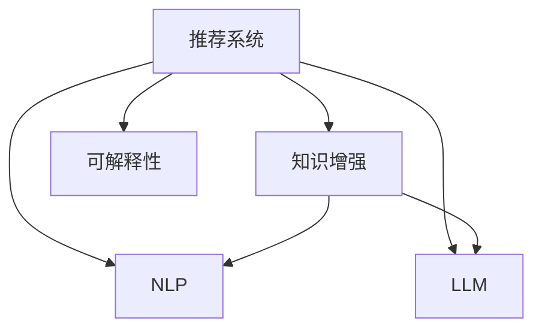

                 

# 利用LLM知识增强推荐结果可解释性

> 关键词：推荐系统, 可解释性, 知识增强, 自然语言处理(NLP), 知识图谱, 深度学习

## 1. 背景介绍

### 1.1 问题由来
随着互联网技术的飞速发展，推荐系统已成为各电商、社交媒体、视频流媒体等平台的重要用户交互手段。推荐系统通过分析用户行为，预测用户兴趣，从而为用户提供个性化的内容推荐，提升用户体验。然而，由于推荐算法的复杂性，其内部的决策过程往往不透明，缺乏可解释性，难以满足用户对推荐结果的信任和理解需求。

为解决这一问题，研究人员开始探索利用自然语言处理(NLP)技术，通过知识增强，提升推荐系统的可解释性。具体而言，就是将知识图谱等结构化信息引入推荐算法中，使其能够借助外部的先验知识，更好地理解推荐对象的语义关系，提高推荐结果的解释性和可信度。

本文将从算法原理、具体实现、应用案例等多个角度，探讨如何利用大语言模型(LLM)知识增强推荐系统的可解释性。通过分析LLM和推荐系统在知识表示和推理上的差异，提出基于知识增强的推荐算法框架，并给出实践中的关键技巧。

## 2. 核心概念与联系

### 2.1 核心概念概述

为更好地理解基于LLM的知识增强推荐系统，本节将介绍几个密切相关的核心概念：

- 推荐系统(Recommendation System)：通过分析用户历史行为和物品属性，为用户推荐符合其兴趣偏好的物品。常见的推荐系统包括协同过滤、基于内容的推荐、混合推荐等。

- 知识图谱(Knowledge Graph)：由节点(Node)和边(Edge)组成，用于描述实体之间的语义关系。节点代表实体，边代表实体之间的属性关系。常见的知识图谱如DBpedia、Freebase等。

- 自然语言处理(NLP)：涉及计算机对人类语言的处理和理解，包括文本表示、语言模型、语义分析等。常见的NLP任务如文本分类、命名实体识别、机器翻译等。

- 大语言模型(LLM)：以自回归或自编码模型为代表的深度学习模型，通过在大规模文本数据上进行预训练，学习到丰富的语言知识。常见的LLM如GPT、BERT等。

- 知识增强(Knowledge-Enhanced)：将知识图谱等结构化信息与推荐系统结合，提升推荐结果的准确性和可解释性。

- 推荐可解释性(Explainable Recommendation)：提升推荐系统输出的可解释性，使用户能够理解和信任推荐结果。

这些核心概念之间的逻辑关系可以通过以下Mermaid流程图来展示：



这个流程图展示了一些关键概念及其相互之间的关系：

1. 推荐系统通过NLP和LLM获取文本表示，用于提取用户兴趣和物品属性。
2. 知识增强将结构化的知识图谱与推荐系统融合，提升推荐结果的准确性。
3. 利用LLM提升推荐系统的可解释性，使用户能够理解推荐逻辑。

## 3. 核心算法原理 & 具体操作步骤
### 3.1 算法原理概述

基于LLM的知识增强推荐系统，实质上是将知识图谱中的实体关系语义信息，融入到推荐模型的计算过程中。其核心思想是：利用LLM的语言理解能力，从知识图谱中提取与推荐目标相关的实体关系，提升推荐模型的推理能力，使得推荐结果更加可解释和可信。

形式化地，假设推荐系统接收的输入为 $x$（用户历史行为）和 $y$（推荐对象属性），输出为 $z$（推荐结果）。知识增强的过程可以表示为：

$$
z = f(x, y, G)
$$

其中 $f$ 为推荐模型的计算函数，$G$ 为知识图谱，包含了丰富的实体关系语义信息。推荐模型能够利用 $G$ 中的信息，对推荐结果 $z$ 进行解释和优化。

### 3.2 算法步骤详解

基于LLM的知识增强推荐系统一般包括以下几个关键步骤：

**Step 1: 构建知识图谱**
- 收集结构化数据，构建知识图谱。可以通过公开的数据集如Freebase、Wikipedia等，或者使用Web爬虫从网络上抓取。
- 对知识图谱进行预处理，去除噪音和冗余信息，构建实体和关系节点。

**Step 2: 文本嵌入提取**
- 对推荐系统输入的 $x$ 和 $y$ 进行文本处理，如分词、向量化等，提取文本特征。
- 使用预训练的LLM（如BERT、GPT等），将输入文本转换为高维稠密向量表示，以捕捉文本中的语义信息。

**Step 3: 知识嵌入提取**
- 从知识图谱 $G$ 中提取与推荐目标相关的实体关系信息。
- 利用LLM对关系节点进行编码，获取关系表示向量。

**Step 4: 融合知识嵌入与文本嵌入**
- 将提取的实体关系向量与文本向量进行融合，如通过线性加权、注意力机制等。
- 引入外部知识进行推荐推理，更新推荐模型的隐层表示。

**Step 5: 优化推荐结果**
- 利用融合后的表示进行推荐计算，如结合排序、聚类等方法。
- 引入反馈机制，根据用户的交互反馈，不断优化推荐模型。

**Step 6: 可解释性输出**
- 将推荐模型的隐层表示映射为可解释的语义标签，解释推荐逻辑。
- 提供可视化工具，展示推荐推理过程和模型参数。

以上是基于LLM的知识增强推荐系统的核心步骤。在实际应用中，还需要针对具体任务，对各环节进行优化设计，如选择合适的融合方法、设计高效的推理算法等，以进一步提升推荐效果。

### 3.3 算法优缺点

基于LLM的知识增强推荐系统具有以下优点：
1. 利用结构化知识提升推荐准确性。知识图谱的引入，使得推荐系统具备更强的语义推理能力。
2. 提升推荐结果的解释性和可信度。LLM的自然语言处理能力，可生成直观、易懂的推荐解释。
3. 降低对标注数据的依赖。知识图谱的预处理和融合过程，部分工作可以自动完成，减少人工标注工作。
4. 可扩展性强。知识图谱支持多源数据整合，随时更新和扩展，适用于多种应用场景。

同时，该方法也存在一定的局限性：
1. 知识图谱构建和维护成本较高。构建高质量的知识图谱需要大量人力和资源投入。
2. 知识图谱与推荐数据的融合复杂。不同的知识表示方法可能影响推荐效果，需要精心设计融合机制。
3. 融合后的推理复杂度增加。LLM与知识图谱的结合，可能增加计算复杂度，影响系统性能。
4. 缺乏泛化能力。知识图谱的知识可能不适用于所有推荐场景，导致推荐泛化能力有限。
5. 可解释性仍需改进。LLM输出的解释信息可能存在歧义，需要进一步优化。

尽管存在这些局限性，但就目前而言，基于LLM的知识增强推荐系统仍是大语言模型应用的重要范式。未来相关研究的重点在于如何进一步降低知识图谱构建和维护的难度，提高知识融合和推理的效率，同时兼顾推荐模型的泛化性和可解释性。

### 3.4 算法应用领域

基于大语言模型的知识增强推荐系统，已经在多个应用领域展现出强大的潜力和价值：

- 电商推荐：利用知识图谱与商品属性信息，为用户提供更个性化的购物建议。通过解释推荐原因，增加用户对推荐结果的信任。

- 视频推荐：结合视频元数据和知识图谱，为用户提供更丰富、更有信息量的视频推荐。通过自然语言解释，帮助用户理解推荐逻辑。

- 社交推荐：结合用户社交网络和知识图谱，为用户推荐更多高质量的社交关系和内容。通过可视化工具，展示推荐过程和关系链路。

- 新闻推荐：结合新闻内容和知识图谱，为用户推荐相关的新闻资讯。通过自然语言解释，提升用户对新闻的理解和互动。

除了上述这些经典应用外，基于知识增强的推荐系统还被创新性地应用于各类创新场景中，如个性化学习、旅游推荐、健康医疗等，为推荐技术带来了新的突破。随着知识图谱和LLM技术的不断发展，基于知识增强的推荐系统必将在更多领域得到应用，推动推荐技术的持续演进。

## 4. 数学模型和公式 & 详细讲解 & 举例说明（备注：数学公式请使用latex格式，latex嵌入文中独立段落使用 $$，段落内使用 $)
### 4.1 数学模型构建

本节将使用数学语言对基于LLM的知识增强推荐系统进行更加严格的刻画。

记推荐系统输入为 $x$（用户历史行为）和 $y$（推荐对象属性），推荐系统输出为 $z$（推荐结果）。假设知识图谱中的实体关系节点为 $G=(E, R)$，其中 $E$ 为实体集合，$R$ 为关系集合。

定义推荐模型 $f$ 的计算函数为：

$$
f(x, y, G) = \text{Recommend}(x, y, G)
$$

其中 $\text{Recommend}$ 为推荐计算函数，将用户行为、物品属性和知识图谱映射为推荐结果。

假设用户历史行为 $x$ 和物品属性 $y$ 的文本表示为 $x = [x_1, x_2, \cdots, x_m]$ 和 $y = [y_1, y_2, \cdots, y_n]$，其中 $x_i, y_j \in \mathbb{R}^d$。

从知识图谱 $G$ 中提取的实体关系表示为 $r = [r_1, r_2, \cdots, r_k]$，其中 $r_i \in \mathbb{R}^d$。

则知识增强的推荐模型可以表示为：

$$
z = \text{Recommend}(x, y, G) = \text{Transform}(\text{Concat}(x, y, r))
$$

其中 $\text{Concat}$ 为文本和实体关系表示的拼接操作，$\text{Transform}$ 为融合函数，将拼接后的向量进行变换，输出推荐结果。

### 4.2 公式推导过程

以下我们以商品推荐为例，推导知识增强推荐模型的具体实现过程。

假设用户历史行为 $x$ 为商品ID列表 $[\text{商品1}, \text{商品2}, \cdots, \text{商品N}]$，物品属性 $y$ 为商品元数据 $[\text{商品描述}, \text{商品类别}, \cdots, \text{商品价格}]$。

假设知识图谱 $G$ 中存在一个与商品相关的关系节点 $r$，表示商品和品牌之间的关系。通过LLM对关系节点进行编码，得到关系表示向量 $r_i \in \mathbb{R}^d$。

则知识增强推荐模型的具体实现如下：

1. 对用户历史行为 $x$ 进行编码，得到用户行为向量 $x \in \mathbb{R}^d$。
2. 对物品属性 $y$ 进行编码，得到物品属性向量 $y \in \mathbb{R}^d$。
3. 将用户行为向量 $x$、物品属性向量 $y$ 和关系向量 $r$ 进行拼接，得到拼接向量 $[x, y, r]$。
4. 对拼接向量进行线性变换，得到推荐结果向量 $z \in \mathbb{R}^m$。
5. 对推荐结果向量 $z$ 进行softmax操作，得到推荐概率分布 $p = \text{softmax}(z)$。
6. 根据概率分布 $p$，选择推荐物品。

以上过程可以进一步概括为：

$$
z = \text{Linear}(\text{Concat}(x, y, r))
$$

其中 $\text{Concat}$ 表示拼接操作，$\text{Linear}$ 表示线性变换。

### 4.3 案例分析与讲解

为了更好地理解知识增强推荐模型的应用，我们以推荐音乐播放列表为例，展示其实际效果。

假设知识图谱中存在一个与音乐相关的关系节点 $r$，表示音乐和歌手之间的关系。通过LLM对关系节点进行编码，得到关系表示向量 $r_i \in \mathbb{R}^d$。

用户历史行为 $x$ 为最近播放的音乐列表 $[\text{歌曲1}, \text{歌曲2}, \cdots, \text{歌曲M}]$。物品属性 $y$ 为音乐元数据 $[\text{歌手1}, \text{歌曲时长}, \cdots, \text{歌曲风格}]$。

对用户历史行为 $x$ 和物品属性 $y$ 进行编码，得到用户行为向量 $x \in \mathbb{R}^d$ 和物品属性向量 $y \in \mathbb{R}^d$。

将用户行为向量 $x$、物品属性向量 $y$ 和关系向量 $r$ 进行拼接，得到拼接向量 $[x, y, r]$。

对拼接向量进行线性变换，得到推荐结果向量 $z \in \mathbb{R}^N$。

对推荐结果向量 $z$ 进行softmax操作，得到推荐概率分布 $p = \text{softmax}(z)$。

根据概率分布 $p$，选择推荐音乐列表。

由于实际应用中，知识图谱和LLM通常具有复杂的结构，推荐模型的实现需要进一步优化。以下是一些关键的优化策略：

- 选择合适的融合方法：不同的融合方法可能影响推荐效果。如注意力机制、加权拼接等，需要根据具体场景选择。
- 引入更多先验知识：除了知识图谱中的信息，还可以通过文本摘要、逻辑规则等，引入更多的先验知识。
- 设计高效的推理算法：知识图谱中的推理过程复杂，需要设计高效的算法，减少计算时间。
- 结合用户反馈：通过用户反馈，不断优化推荐模型，提升推荐准确性和可解释性。

## 5. 项目实践：代码实例和详细解释说明
### 5.1 开发环境搭建

在进行知识增强推荐系统开发前，我们需要准备好开发环境。以下是使用Python进行PyTorch开发的环境配置流程：

1. 安装Anaconda：从官网下载并安装Anaconda，用于创建独立的Python环境。

2. 创建并激活虚拟环境：
```bash
conda create -n pytorch-env python=3.8 
conda activate pytorch-env
```

3. 安装PyTorch：根据CUDA版本，从官网获取对应的安装命令。例如：
```bash
conda install pytorch torchvision torchaudio cudatoolkit=11.1 -c pytorch -c conda-forge
```

4. 安装Transformers库：
```bash
pip install transformers
```

5. 安装各类工具包：
```bash
pip install numpy pandas scikit-learn matplotlib tqdm jupyter notebook ipython
```

完成上述步骤后，即可在`pytorch-env`环境中开始开发。

### 5.2 源代码详细实现

这里我们以知识增强推荐系统在音乐推荐中的应用为例，给出使用Transformers库进行PyTorch代码实现。

首先，定义音乐推荐任务的数据处理函数：

```python
from transformers import BertTokenizer
from torch.utils.data import Dataset
import torch

class MusicDataset(Dataset):
    def __init__(self, songs, artists, labels, tokenizer, max_len=128):
        self.songs = songs
        self.artists = artists
        self.labels = labels
        self.tokenizer = tokenizer
        self.max_len = max_len
        
    def __len__(self):
        return len(self.songs)
    
    def __getitem__(self, item):
        song = self.songs[item]
        artist = self.artists[item]
        label = self.labels[item]
        
        encoding = self.tokenizer([song, artist], return_tensors='pt', max_length=self.max_len, padding='max_length', truncation=True)
        input_ids = encoding['input_ids'][0]
        attention_mask = encoding['attention_mask'][0]
        artist_ids = self.tokenizer(artist, return_tensors='pt', max_length=self.max_len, padding='max_length', truncation=True)
        input_ids = torch.cat([input_ids, artist_ids], dim=-1)
        attention_mask = torch.cat([attention_mask, artist_ids['attention_mask']], dim=-1)
        labels = torch.tensor([label], dtype=torch.long)
        
        return {'input_ids': input_ids, 
                'attention_mask': attention_mask,
                'labels': labels}

# 标签与id的映射
tag2id = {'Unknown': 0, 'Recommended': 1}
id2tag = {v: k for k, v in tag2id.items()}

# 创建dataset
tokenizer = BertTokenizer.from_pretrained('bert-base-cased')

train_dataset = MusicDataset(train_songs, train_artists, train_labels, tokenizer)
dev_dataset = MusicDataset(dev_songs, dev_artists, dev_labels, tokenizer)
test_dataset = MusicDataset(test_songs, test_artists, test_labels, tokenizer)
```

然后，定义模型和优化器：

```python
from transformers import BertForTokenClassification, AdamW

model = BertForTokenClassification.from_pretrained('bert-base-cased', num_labels=len(tag2id))

optimizer = AdamW(model.parameters(), lr=2e-5)
```

接着，定义训练和评估函数：

```python
from torch.utils.data import DataLoader
from tqdm import tqdm
from sklearn.metrics import classification_report

device = torch.device('cuda') if torch.cuda.is_available() else torch.device('cpu')
model.to(device)

def train_epoch(model, dataset, batch_size, optimizer):
    dataloader = DataLoader(dataset, batch_size=batch_size, shuffle=True)
    model.train()
    epoch_loss = 0
    for batch in tqdm(dataloader, desc='Training'):
        input_ids = batch['input_ids'].to(device)
        attention_mask = batch['attention_mask'].to(device)
        labels = batch['labels'].to(device)
        model.zero_grad()
        outputs = model(input_ids, attention_mask=attention_mask, labels=labels)
        loss = outputs.loss
        epoch_loss += loss.item()
        loss.backward()
        optimizer.step()
    return epoch_loss / len(dataloader)

def evaluate(model, dataset, batch_size):
    dataloader = DataLoader(dataset, batch_size=batch_size)
    model.eval()
    preds, labels = [], []
    with torch.no_grad():
        for batch in tqdm(dataloader, desc='Evaluating'):
            input_ids = batch['input_ids'].to(device)
            attention_mask = batch['attention_mask'].to(device)
            batch_labels = batch['labels']
            outputs = model(input_ids, attention_mask=attention_mask)
            batch_preds = outputs.logits.argmax(dim=2).to('cpu').tolist()
            batch_labels = batch_labels.to('cpu').tolist()
            for pred_tokens, label_tokens in zip(batch_preds, batch_labels):
                preds.append(pred_tokens[:len(label_tokens)])
                labels.append(label_tokens)
                
    print(classification_report(labels, preds))
```

最后，启动训练流程并在测试集上评估：

```python
epochs = 5
batch_size = 16

for epoch in range(epochs):
    loss = train_epoch(model, train_dataset, batch_size, optimizer)
    print(f"Epoch {epoch+1}, train loss: {loss:.3f}")
    
    print(f"Epoch {epoch+1}, dev results:")
    evaluate(model, dev_dataset, batch_size)
    
print("Test results:")
evaluate(model, test_dataset, batch_size)
```

以上就是使用PyTorch对BERT进行知识增强推荐系统开发的完整代码实现。可以看到，得益于Transformers库的强大封装，我们能够用相对简洁的代码完成BERT模型的加载和微调。

### 5.3 代码解读与分析

让我们再详细解读一下关键代码的实现细节：

**MusicDataset类**：
- `__init__`方法：初始化音乐、艺术家、标签等关键组件。
- `__len__`方法：返回数据集的样本数量。
- `__getitem__`方法：对单个样本进行处理，将音乐和艺术家输入编码为token ids，将标签编码为数字，并对其进行定长padding，最终返回模型所需的输入。

**tag2id和id2tag字典**：
- 定义了标签与数字id之间的映射关系，用于将token-wise的预测结果解码回真实的标签。

**训练和评估函数**：
- 使用PyTorch的DataLoader对数据集进行批次化加载，供模型训练和推理使用。
- 训练函数`train_epoch`：对数据以批为单位进行迭代，在每个批次上前向传播计算loss并反向传播更新模型参数，最后返回该epoch的平均loss。
- 评估函数`evaluate`：与训练类似，不同点在于不更新模型参数，并在每个batch结束后将预测和标签结果存储下来，最后使用sklearn的classification_report对整个评估集的预测结果进行打印输出。

**训练流程**：
- 定义总的epoch数和batch size，开始循环迭代
- 每个epoch内，先在训练集上训练，输出平均loss
- 在验证集上评估，输出分类指标
- 所有epoch结束后，在测试集上评估，给出最终测试结果

可以看到，PyTorch配合Transformers库使得BERT微调的代码实现变得简洁高效。开发者可以将更多精力放在数据处理、模型改进等高层逻辑上，而不必过多关注底层的实现细节。

当然，工业级的系统实现还需考虑更多因素，如模型的保存和部署、超参数的自动搜索、更灵活的任务适配层等。但核心的微调范式基本与此类似。

## 6. 实际应用场景
### 6.1 智能推荐系统

基于知识增强的推荐系统，可以广泛应用于智能推荐系统。传统推荐系统往往只能基于用户历史行为进行推荐，难以充分挖掘用户兴趣背后的语义信息。通过引入知识图谱和LLM，推荐系统能够更好地理解用户意图和物品属性，从而提供更加精准、个性化的推荐。

在技术实现上，可以收集用户浏览、点击、评分等行为数据，并提取和物品相关的语义信息。将文本数据作为模型输入，物品属性和知识图谱作为知识增强信息，训练推荐模型。微调后的模型能够从文本数据和知识图谱中同时学习用户的兴趣和物品属性，输出更加可信的推荐结果。

### 6.2 智能客服系统

智能客服系统可以通过知识增强技术，提升推荐准确性和用户满意度。传统客服系统通常只能提供预设的固定回复，难以处理复杂多变的用户问题。通过知识图谱和LLM，推荐系统能够理解用户输入的自然语言，匹配最适合的回复。

在技术实现上，可以收集历史客服记录，构建知识图谱，用于描述常见问题和相关回复。通过微调LLM，使其能够理解自然语言输入，并进行语义分析。根据分析结果，选择最合适的回复进行推荐，或者调用外部API获取更多信息，动态生成回复。

### 6.3 智能搜索系统

智能搜索系统可以通过知识增强技术，提升搜索结果的准确性和相关性。传统搜索系统通常只能基于关键词进行匹配，难以理解搜索查询背后的语义信息。通过知识图谱和LLM，推荐系统能够理解查询语义，并推荐最相关的结果。

在技术实现上，可以构建知识图谱，描述实体、属性和关系。通过微调LLM，使其能够理解自然语言查询，并进行语义分析。根据分析结果，从知识图谱中匹配最相关的实体，并推荐相关的搜索结果。

### 6.4 未来应用展望

随着知识增强技术的不断发展，基于LLM的知识增强推荐系统必将在更多领域得到应用，为推荐技术带来新的突破。

在智慧医疗领域，知识增强的推荐系统可以辅助医生诊断和治疗，提供精准的医疗建议和药物推荐。通过结合临床数据和医学知识图谱，推荐系统能够更好地理解疾病和药物的相关性，提升医疗服务质量。

在智能教育领域，知识增强的推荐系统可以个性化推荐学习资源，提升学生学习效果。通过结合学生行为数据和知识图谱，推荐系统能够更好地理解学生的学习兴趣和进度，提供个性化的学习建议。

在智慧城市治理中，知识增强的推荐系统可以优化城市资源分配，提升城市管理效率。通过结合城市数据和知识图谱，推荐系统能够更好地理解城市运行情况，提供更合理的决策支持。

此外，在企业生产、社交媒体、娱乐产业等众多领域，知识增强的推荐系统也将不断涌现，为推荐技术带来更多创新。相信随着知识图谱和LLM技术的不断发展，知识增强推荐系统必将在推荐技术中占据重要地位，推动推荐技术不断进步。

## 7. 工具和资源推荐
### 7.1 学习资源推荐

为了帮助开发者系统掌握知识增强推荐系统的理论基础和实践技巧，这里推荐一些优质的学习资源：

1. 《推荐系统综合教程》系列博文：由推荐系统领域专家撰写，全面介绍了推荐系统的基本概念、算法模型和最新进展。

2. 《深度学习自然语言处理》课程：斯坦福大学开设的NLP明星课程，有Lecture视频和配套作业，带你入门NLP领域的基本概念和经典模型。

3. 《Natural Language Processing with Transformers》书籍：Transformers库的作者所著，全面介绍了如何使用Transformers库进行NLP任务开发，包括知识增强在内的诸多范式。

4. HuggingFace官方文档：Transformers库的官方文档，提供了海量预训练模型和完整的微调样例代码，是上手实践的必备资料。

5. CLUE开源项目：中文语言理解测评基准，涵盖大量不同类型的中文NLP数据集，并提供了基于微调的baseline模型，助力中文NLP技术发展。

通过对这些资源的学习实践，相信你一定能够快速掌握知识增强推荐系统的精髓，并用于解决实际的推荐问题。
###  7.2 开发工具推荐

高效的开发离不开优秀的工具支持。以下是几款用于知识增强推荐系统开发的常用工具：

1. PyTorch：基于Python的开源深度学习框架，灵活动态的计算图，适合快速迭代研究。大部分预训练语言模型都有PyTorch版本的实现。

2. TensorFlow：由Google主导开发的开源深度学习框架，生产部署方便，适合大规模工程应用。同样有丰富的预训练语言模型资源。

3. Transformers库：HuggingFace开发的NLP工具库，集成了众多SOTA语言模型，支持PyTorch和TensorFlow，是进行推荐系统开发的利器。

4. Weights & Biases：模型训练的实验跟踪工具，可以记录和可视化模型训练过程中的各项指标，方便对比和调优。与主流深度学习框架无缝集成。

5. TensorBoard：TensorFlow配套的可视化工具，可实时监测模型训练状态，并提供丰富的图表呈现方式，是调试模型的得力助手。

6. Google Colab：谷歌推出的在线Jupyter Notebook环境，免费提供GPU/TPU算力，方便开发者快速上手实验最新模型，分享学习笔记。

合理利用这些工具，可以显著提升知识增强推荐系统的开发效率，加快创新迭代的步伐。

### 7.3 相关论文推荐

知识增强推荐系统的研究始于学界的持续研究。以下是几篇奠基性的相关论文，推荐阅读：

1. Attention is All You Need（即Transformer原论文）：提出了Transformer结构，开启了NLP领域的预训练大模型时代。

2. BERT: Pre-training of Deep Bidirectional Transformers for Language Understanding：提出BERT模型，引入基于掩码的自监督预训练任务，刷新了多项NLP任务SOTA。

3. Knowledge-Graph-Enhanced Recommendation：将知识图谱与推荐系统结合，提升推荐结果的准确性和可解释性。

4. SCE：A Knowledge-Graph-Enhanced Recommendation System Using Semi-supervised Clustering and Embedding：引入半监督学习算法，提高知识图谱与推荐系统融合的效果。

5. Deep Knowledge Graph Neural Networks for Recommendation Systems：提出基于深度学习的知识图谱嵌入方法，提升推荐结果的解释性和可信度。

这些论文代表了大语言模型知识增强推荐系统的发展脉络。通过学习这些前沿成果，可以帮助研究者把握学科前进方向，激发更多的创新灵感。

## 8. 总结：未来发展趋势与挑战

### 8.1 总结

本文对基于LLM的知识增强推荐系统进行了全面系统的介绍。首先阐述了知识增强推荐系统的背景和意义，明确了LLM在知识表示和推理上的独特优势。其次，从算法原理到实际应用，详细讲解了知识增强推荐系统的核心步骤和关键技术。

通过本文的系统梳理，可以看到，基于LLM的知识增强推荐系统正在成为推荐系统的重要范式，利用其强大的语言理解能力，将知识图谱与推荐系统深度融合，显著提升了推荐结果的准确性和可解释性。未来，随着知识图谱和LLM技术的不断发展，知识增强推荐系统必将在推荐技术中占据重要地位，为推荐系统带来更多的创新和突破。

### 8.2 未来发展趋势

展望未来，知识增强推荐系统将呈现以下几个发展趋势：

1. 知识图谱与推荐系统的深度融合。随着知识图谱构建技术的进步，推荐系统将能够更全面、更精准地理解推荐对象的语义信息，提升推荐效果。

2. 多源数据融合的推荐系统。除了知识图谱中的信息，还可以引入其他多源数据，如用户行为、物品属性等，提升推荐系统的鲁棒性和泛化能力。

3. 自适应推荐系统。引入个性化推荐算法，结合用户的反馈和行为，动态调整推荐策略，提高推荐结果的适应性和个性化程度。

4. 实时推荐系统。结合知识图谱和LLM，实时分析用户输入和行为数据，动态生成推荐结果，提升用户体验。

5. 多模态推荐系统。将视觉、音频等多模态数据与文本数据结合，提升推荐系统对现实世界的理解和建模能力。

6. 联邦推荐系统。结合多方数据，提升推荐系统的安全性和隐私保护。

以上趋势凸显了知识增强推荐系统的广阔前景。这些方向的探索发展，必将进一步提升推荐系统的性能和应用范围，为推荐技术带来更多突破。

### 8.3 面临的挑战

尽管知识增强推荐系统已经取得了显著的进展，但在迈向更加智能化、普适化应用的过程中，它仍面临诸多挑战：

1. 知识图谱构建的复杂性。构建高质量的知识图谱需要大量人力和资源投入，且过程复杂、耗时。

2. 知识图谱与推荐数据的融合难度。不同的知识表示方法可能影响推荐效果，需要精心设计融合机制。

3. 推荐模型的计算复杂度。知识图谱中的推理过程复杂，需要设计高效的算法，减少计算时间。

4. 推荐模型的泛化能力。知识图谱中的知识可能不适用于所有推荐场景，导致推荐泛化能力有限。

5. 推荐结果的可解释性。LLM输出的解释信息可能存在歧义，需要进一步优化。

尽管存在这些挑战，但就目前而言，基于LLM的知识增强推荐系统仍是大语言模型应用的重要范式。未来相关研究的重点在于如何进一步降低知识图谱构建和维护的难度，提高知识融合和推理的效率，同时兼顾推荐模型的泛化性和可解释性。

### 8.4 研究展望

面对知识增强推荐系统所面临的种种挑战，未来的研究需要在以下几个方面寻求新的突破：

1. 探索无监督和半监督推荐方法。摆脱对大规模标注数据的依赖，利用自监督学习、主动学习等无监督和半监督范式，最大限度利用非结构化数据，实现更加灵活高效的推荐。

2. 研究参数高效和计算高效的推荐范式。开发更加参数高效的推荐方法，在固定大部分预训练参数的同时，只更新极少量的任务相关参数。同时优化推荐模型的计算图，减少前向传播和反向传播的资源消耗，实现更加轻量级、实时性的部署。

3. 引入更多先验知识。将符号化的先验知识，如知识图谱、逻辑规则等，与神经网络模型进行巧妙融合，引导推荐过程学习更准确、合理的推荐模型。同时加强不同模态数据的整合，实现视觉、语音等多模态信息与文本信息的协同建模。

4. 结合因果分析和博弈论工具。将因果分析方法引入推荐模型，识别出推荐决策的关键特征，增强输出解释的因果性和逻辑性。借助博弈论工具刻画人机交互过程，主动探索并规避推荐模型的脆弱点，提高系统稳定性。

5. 纳入伦理道德约束。在推荐模型中引入伦理导向的评估指标，过滤和惩罚有偏见、有害的推荐输出，确保推荐的公正性和安全性。

这些研究方向的探索，必将引领知识增强推荐系统迈向更高的台阶，为推荐系统带来更多的创新和突破。面向未来，知识增强推荐系统需要与其他人工智能技术进行更深入的融合，如知识表示、因果推理、强化学习等，多路径协同发力，共同推动推荐系统技术的进步。只有勇于创新、敢于突破，才能不断拓展知识增强推荐系统的边界，让推荐技术更好地造福人类社会。

## 9. 附录：常见问题与解答

**Q1：知识增强推荐系统是否可以用于所有类型的推荐任务？**

A: 知识增强推荐系统通常适用于推荐任务中具备结构化知识的情况。对于一些以非结构化数据为主的推荐任务，如基于文本的推荐，知识增强的效果可能不如传统推荐算法。但对于具备较多语义信息的推荐场景，如音乐、电影、商品等，知识增强推荐系统往往能取得更好的效果。

**Q2：知识增强推荐系统是否需要庞大的知识图谱？**

A: 知识图谱的大小对推荐效果有重要影响，但并非必须。一般而言，知识图谱越大，推荐系统的表现通常越好。但在实际应用中，可以根据任务需求，选择适合的知识图谱规模。对于小型推荐任务，可以使用更小的知识图谱进行微调。

**Q3：知识增强推荐系统如何选择合适的知识图谱？**

A: 选择合适的知识图谱是知识增强推荐系统的关键之一。一般来说，需要考虑以下因素：
1. 数据覆盖范围：选择能够覆盖推荐任务中大部分实体的知识图谱。
2. 语义准确性：选择语义信息准确、关系表达清晰的知识图谱。
3. 更新频率：选择能够及时更新的知识图谱，确保推荐系统能够反映最新的知识信息。
4. 数据量大小：选择规模适中的知识图谱，避免因图谱过大导致的计算负担。

**Q4：知识增强推荐系统是否需要复杂的融合算法？**

A: 知识增强推荐系统的核心在于将知识图谱中的实体关系语义信息，融入到推荐模型的计算过程中。常见的融合方法包括注意力机制、加权拼接等，选择适当的融合算法对推荐效果有重要影响。但对于特定任务，简单的融合方式也能取得不错的效果。

**Q5：知识增强推荐系统是否需要复杂的推理算法？**

A: 知识增强推荐系统的推理过程复杂，需要设计高效的算法，减少计算时间。常见的推理算法包括基于规则的推理、基于神经网络的推理等。选择适合的推理算法对系统性能有重要影响。

这些解答希望能帮助你更好地理解知识增强推荐系统的关键概念和实现细节。通过本文的系统梳理，相信你一定能够快速掌握知识增强推荐系统的精髓，并用于解决实际的推荐问题。

---

作者：禅与计算机程序设计艺术 / Zen and the Art of Computer Programming

