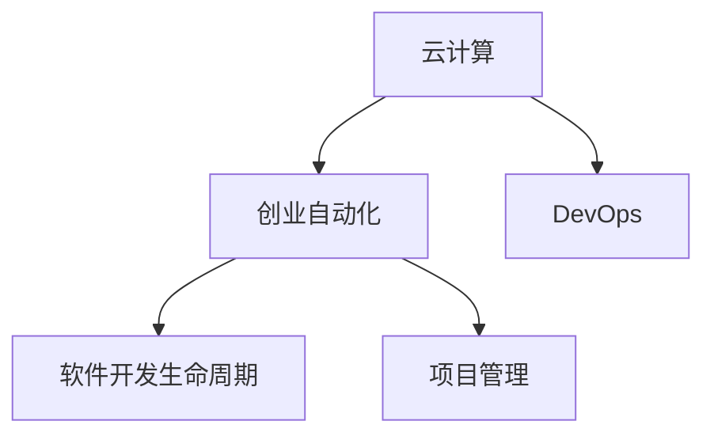

                 

# 利用云计算实现创业自动化

> 关键词：云计算, 创业自动化, 创业系统, 自动化流程, 云计算架构, 创业平台, 软件开发生命周期, 项目管理

## 1. 背景介绍

### 1.1 问题由来
在当今快速发展的商业环境中，创业者需要迅速响应市场需求，以获得竞争优势。传统的人工操作模式，如手工编写代码、手动测试、重复性任务等，已经无法满足企业快速迭代的需求。利用云计算的强大计算能力、灵活的部署方式以及丰富的开发工具，能够显著提升创业企业的开发效率，加速产品上市。

然而，云计算的普及并不意味着所有的创业项目都能从中受益。许多创业公司往往缺乏对云计算的深入理解，导致他们在部署和使用云计算过程中遇到各种挑战，比如资源浪费、成本过高、技术难度大等问题。因此，本文旨在帮助创业者充分利用云计算，通过自动化的流程和技术手段，提高企业的创新速度和市场响应能力，从而在竞争激烈的市场中脱颖而出。

### 1.2 问题核心关键点
本文将介绍如何利用云计算实现创业自动化，包括选择合适的云服务、设计自动化的业务流程、使用DevOps工具等关键技术，以及如何克服在实施过程中可能遇到的挑战。

## 2. 核心概念与联系

### 2.1 核心概念概述

为了更好地理解利用云计算实现创业自动化的概念，下面将介绍几个关键概念：

- **云计算(Cloud Computing)**：通过互联网提供动态可伸缩的虚拟资源，支持企业以服务的形式使用软硬件资源。
- **创业自动化(Business Automation)**：利用自动化技术提高业务流程的效率和灵活性，减少人工干预，降低成本。
- **DevOps(Development & Operations)**：结合软件开发(Software Development)和系统运维(Operations)，实现更高效的软件开发和运维。
- **软件开发生命周期(Software Development Lifecycle, SDLC)**：从需求分析到软件发布，软件开发的各个阶段及其相应的活动。
- **项目管理(Project Management)**：规划、执行、监控、控制项目，确保项目目标的实现。

这些概念之间的联系可以通过以下Mermaid流程图来展示：



这个流程图展示出各个概念之间的逻辑关系：

1. 云计算是实现创业自动化的基础。
2. DevOps是利用云计算实现创业自动化的技术手段。
3. 软件开发生命周期和项目管理是创业自动化的实施过程。

## 3. 核心算法原理 & 具体操作步骤

### 3.1 算法原理概述

利用云计算实现创业自动化，本质上是通过自动化技术将复杂的业务流程转移到云端，利用云平台的弹性资源和丰富工具，快速响应市场需求。核心算法原理包括：

1. **弹性资源管理**：根据业务需求动态调整资源分配，避免资源浪费。
2. **容器化部署**：通过Docker等容器化技术，实现软件包的快速部署和滚动更新。
3. **微服务架构**：将应用拆分为多个独立服务的微服务，提高系统的灵活性和扩展性。
4. **CI/CD集成**：将代码提交、构建、测试、部署等开发流程自动化，提高开发效率。
5. **自动化监控和告警**：实时监控系统运行状态，设置告警规则，保障系统稳定运行。

### 3.2 算法步骤详解

基于云计算的创业自动化流程一般包括以下几个关键步骤：

**Step 1: 需求分析与规划**
- 分析创业项目的具体需求，确定云计算的应用场景。
- 制定详细的项目规划，包括技术架构、资源分配、风险管理等。

**Step 2: 云平台选择与配置**
- 选择适合的云服务提供商，如AWS、Azure、Google Cloud等。
- 配置云环境，包括虚拟机、存储、网络等基础设施资源。
- 搭建DevOps工具链，如Jenkins、GitLab CI/CD等。

**Step 3: 系统设计**
- 设计微服务架构，将应用拆分为多个独立服务。
- 设计数据库方案，选择关系型或NoSQL数据库，满足不同业务需求。
- 设计API接口，定义服务之间的数据交换方式。

**Step 4: 系统开发与部署**
- 开发并测试各个微服务，确保功能的正确性。
- 使用容器化技术将服务打包为Docker镜像，便于部署和扩展。
- 部署服务到云平台，进行自动化配置和扩展。

**Step 5: 持续集成与持续部署(CI/CD)**
- 集成开发工具和测试工具，实现代码的自动化构建和测试。
- 配置CI/CD流程，自动化执行构建、测试、部署等步骤。
- 监控CI/CD流程，及时发现和解决流程中的问题。

**Step 6: 系统监控与运维**
- 设计自动化监控系统，实时监测系统性能和状态。
- 设置告警规则，及时发现异常情况，并采取相应措施。
- 定期进行系统备份和数据恢复，保障数据安全。

### 3.3 算法优缺点

基于云计算的创业自动化有以下优点：

1. **高效灵活**：利用云平台的弹性资源，可以快速响应市场需求，提高企业竞争力。
2. **成本低廉**：按需支付，避免传统服务器的高昂维护成本。
3. **开发效率高**：自动化流程减少了人工干预，提高了开发效率。
4. **扩展性强**：云平台支持水平扩展，可以快速增加系统容量。

同时，该方法也存在以下缺点：

1. **复杂度较高**：涉及云平台配置、DevOps工具配置、系统设计等多方面技术。
2. **安全风险**：云平台环境复杂，可能存在安全漏洞，需要严格的安全管理措施。
3. **依赖服务提供商**：云平台服务依赖于第三方，可能存在服务中断的风险。
4. **数据隐私问题**：云平台服务可能涉及数据传输和存储，存在隐私泄露的风险。

尽管存在这些缺点，但就目前而言，利用云计算实现创业自动化已经成为了企业发展的趋势。未来相关研究的重点在于如何进一步简化云平台的使用复杂度，降低安全风险，同时兼顾开发效率和数据隐私等问题。

### 3.4 算法应用领域

基于云计算的创业自动化技术在各行各业都有广泛的应用，例如：

- **电商企业**：利用自动化流程实现快速迭代，提升用户购物体验。
- **金融科技(Fintech)**：通过微服务架构提高金融产品的灵活性和扩展性。
- **医疗健康**：利用自动化系统提高医疗服务的效率和质量。
- **教育培训**：通过自动化流程优化在线教育平台的用户体验。
- **旅游服务**：实现旅游预订、行程安排等服务的自动化，提升用户体验。

除了上述这些行业外，基于云计算的创业自动化还将在更多领域得到应用，为企业的发展提供更强大的技术支持。

## 4. 数学模型和公式 & 详细讲解  
### 4.1 数学模型构建

在利用云计算实现创业自动化的过程中，可以使用数学模型来描述自动化流程和资源管理策略。例如，可以使用排队论模型来描述云平台的资源调度过程，使用线性规划模型来优化资源分配和成本控制。

### 4.2 公式推导过程

这里以排队论模型为例，推导云平台资源调度的数学模型。假设云平台上有N个虚拟机，每个虚拟机需要处理的任务数服从泊松分布，任务到达率为$\lambda$，任务处理时间为$T$，单位时间内的服务强度为$\mu$。

根据M/M/1排队模型，可以得到每个虚拟机处理的平均任务数为：

$$
\frac{\lambda T}{1 - \mu}
$$

为了确保每个虚拟机都能高效运行，需要根据平均任务数和处理时间，动态调整资源分配，优化服务强度，从而实现高效的资源管理。

### 4.3 案例分析与讲解

假设某电商企业利用云计算平台进行商品上架和推荐系统的开发。通过分析用户行为数据，企业发现每天有500个上架请求和200个推荐请求。每个请求的处理时间为1秒，每个虚拟机的服务强度为2次/秒。使用排队论模型可以计算出，为了保证服务质量，至少需要3个虚拟机来处理这些请求。

在实际部署中，企业可以将推荐系统独立部署为一个微服务，使用容器化技术进行打包和部署，并设置CI/CD流程自动处理代码变更和测试。通过实时监控系统性能和设置告警规则，企业可以及时发现系统异常，确保推荐系统的高效运行。

## 5. 项目实践：代码实例和详细解释说明
### 5.1 开发环境搭建

在进行云计算创业自动化项目实践前，需要先搭建好开发环境。以下是使用Python和Docker进行云计算项目开发的完整环境配置流程：

1. 安装Docker和Docker Compose。
2. 安装相关开发工具，如Jenkins、GitLab CI/CD、Prometheus等。
3. 配置Docker环境，包括虚拟机、存储、网络等基础设施资源。

完成上述步骤后，即可在Docker环境中进行云计算项目开发。

### 5.2 源代码详细实现

这里以电商企业利用云计算平台实现推荐系统的自动化流程为例，给出完整的代码实现：

**推荐系统微服务实现**

```python
class RecommendationService:
    def __init__(self, db):
        self.db = db
    
    def recommend_items(self, user_id):
        # 从数据库中获取用户的历史购买记录
        history = self.db.get_user_history(user_id)
        # 根据用户购买历史推荐商品
        recommended_items = self.db.get_recommendations(history)
        return recommended_items
```

**Dockerfile配置**

```dockerfile
FROM python:3.9-slim
COPY . /app
WORKDIR /app
RUN pip install -r requirements.txt
EXPOSE 8080
CMD ["python", "main.py"]
```

**Jenkins配置**

```yaml
pipeline:
  agent none
  stages:
    - stage: 'Build'
      steps:
        - docker build -t my-recommendation .
        - docker push my-recommendation:latest
    - stage: 'Test'
      steps:
        - docker run -d -p 8080:8080 my-recommendation:latest
        - curl -X GET 'http://localhost:8080/recommend'
```

**CI/CD流程集成**

1. 将Jenkins与GitLab CI/CD集成，实现代码自动构建和测试。
2. 将构建好的Docker镜像自动推送到容器镜像仓库。
3. 将自动部署到云平台，进行自动化配置和扩展。

### 5.3 代码解读与分析

在上述代码实现中，推荐系统微服务通过数据库获取用户历史购买记录，根据记录推荐商品。使用Dockerfile将服务打包为Docker镜像，便于部署和扩展。Jenkins配置自动化流程，实现代码构建、测试和部署。

通过Jenkins和CI/CD工具链，可以实现自动化开发流程，减少人工干预，提高开发效率。同时，使用Docker技术可以将微服务独立部署，实现高可用性和易扩展性。

### 5.4 运行结果展示

在运行Jenkins pipeline后，可以实时查看推荐系统的构建和部署情况。使用Prometheus等监控工具，可以实时监测系统性能和状态。通过设置告警规则，可以及时发现异常情况，保障系统稳定运行。

## 6. 实际应用场景

### 6.1 智能制造

基于云计算的创业自动化在智能制造领域也有广泛应用。传统制造企业需要处理大量的生产数据，使用云计算平台可以实现数据的实时采集和分析，优化生产流程，提高生产效率。例如，某智能制造企业通过云计算平台实时监控生产设备状态，自动调整生产参数，实现了生产线的智能化改造。

### 6.2 智慧城市

智慧城市项目通过云计算平台可以实现数据的集中管理和分析，提升城市管理的智能化水平。例如，某智慧城市项目通过云计算平台实时监控交通流量，自动调整信号灯控制，缓解交通拥堵。同时，通过云计算平台实现了垃圾回收、能源管理等城市服务的自动化。

### 6.3 医疗健康

医疗健康领域通过云计算平台可以实现数据的集中管理和分析，提升医疗服务的智能化水平。例如，某智慧医疗平台通过云计算平台实时监测患者健康数据，自动调整治疗方案，提高了诊疗效率和患者满意度。

### 6.4 未来应用展望

随着云计算技术的不断发展和普及，基于云计算的创业自动化将在更多领域得到应用。未来，云计算平台将提供更丰富的资源和工具，帮助企业快速迭代，实现数字化转型升级。

在智慧农业、智能家居、智能交通等新兴领域，云计算平台也将发挥重要作用。利用云计算的强大计算能力和灵活的部署方式，可以提升各类场景的智能化水平，实现更加高效、便捷的用户体验。

## 7. 工具和资源推荐
### 7.1 学习资源推荐

为了帮助创业者系统掌握云计算和创业自动化的理论基础和实践技巧，这里推荐一些优质的学习资源：

1. **《云计算基础》**：介绍云计算的基本概念、技术架构和应用场景，适合初学者入门。
2. **《DevOps实践指南》**：涵盖DevOps工具链、流程设计、最佳实践等内容，适合有一定基础的学习者。
3. **《软件开发生命周期管理》**：介绍软件开发生命周期的各个阶段及其管理方法，适合软件开发团队参考。
4. **《项目管理实践》**：涵盖项目管理的基础知识、工具和方法，适合项目经理和团队成员学习。
5. **《OpenStack入门教程》**：介绍OpenStack云平台的基础知识和实践技巧，适合云平台开发者参考。

通过对这些资源的学习实践，相信你一定能够快速掌握云计算和创业自动化的精髓，并用于解决实际的创业问题。

### 7.2 开发工具推荐

高效的开发离不开优秀的工具支持。以下是几款用于云计算创业自动化开发的常用工具：

1. **Jenkins**：开源的自动化构建工具，支持多种插件和插件库，适用于DevOps流程自动化。
2. **GitLab CI/CD**：基于GitLab的企业级CI/CD平台，支持代码提交、构建、测试、部署等全流程自动化。
3. **Prometheus**：开源监控系统，支持实时监控和告警，适用于云平台环境。
4. **Docker Compose**：容器编排工具，支持多容器应用的管理和部署，适用于微服务架构的部署。
5. **Kubernetes**：容器编排工具，支持自动化扩展和弹性伸缩，适用于云平台的高可用性部署。

合理利用这些工具，可以显著提升云计算创业自动化的开发效率，加快创新迭代的步伐。

### 7.3 相关论文推荐

云计算和创业自动化的发展源于学界的持续研究。以下是几篇奠基性的相关论文，推荐阅读：

1. **《Cloud Computing: Concepts, Technology, and Architecture》**：全面介绍云计算的基本概念、技术架构和应用场景，适合初学者入门。
2. **《DevOps: Practices and Technology》**：介绍DevOps工具链、流程设计、最佳实践等内容，适合有一定基础的学习者。
3. **《Software Development Lifecycle Management》**：介绍软件开发生命周期的各个阶段及其管理方法，适合软件开发团队参考。
4. **《Project Management for Dummies》**：涵盖项目管理的基础知识、工具和方法，适合项目经理和团队成员学习。
5. **《Cloud Management Techniques》**：介绍云平台的管理技术、最佳实践等内容，适合云平台开发者参考。

这些论文代表了大规模云计算和创业自动化的发展脉络。通过学习这些前沿成果，可以帮助研究者把握学科前进方向，激发更多的创新灵感。

## 8. 总结：未来发展趋势与挑战

### 8.1 总结

本文对利用云计算实现创业自动化的理论基础和实践技巧进行了全面系统的介绍。首先阐述了云计算和创业自动化的研究背景和意义，明确了创业自动化在提升企业创新速度和市场响应能力方面的独特价值。其次，从原理到实践，详细讲解了云计算架构、DevOps流程、微服务架构等核心技术，并给出了具体的代码实现和案例分析。

通过本文的系统梳理，可以看到，利用云计算实现创业自动化技术已经在多个行业领域得到应用，为企业的快速迭代和数字化转型提供了强有力的支持。未来，伴随云计算技术的不断发展和普及，基于云计算的创业自动化必将在更多领域得到应用，进一步提升企业的创新能力和市场竞争力。

### 8.2 未来发展趋势

展望未来，利用云计算实现创业自动化技术将呈现以下几个发展趋势：

1. **智能化程度提升**：随着AI技术的不断发展，利用AI算法进行业务预测和优化，提升企业的智能化水平。
2. **自动化程度提升**：利用自动化技术实现更多业务流程的自动化，减少人工干预，提高效率。
3. **云平台服务丰富化**：云平台提供的资源和服务将更加丰富，支持更多类型的业务应用。
4. **跨云平台协作**：实现多云平台之间的数据和应用协作，提升业务灵活性和扩展性。
5. **安全性加强**：加强云平台的安全管理，保障业务数据和应用的安全。

以上趋势凸显了利用云计算实现创业自动化的广阔前景。这些方向的探索发展，必将进一步提升企业的创新能力和市场竞争力。

### 8.3 面临的挑战

尽管利用云计算实现创业自动化技术已经取得了瞩目成就，但在迈向更加智能化、普适化应用的过程中，它仍面临着诸多挑战：

1. **技术复杂度**：云计算技术涉及多个方面，包括资源管理、DevOps流程、安全管理等，需要全面掌握。
2. **成本问题**：云平台服务可能存在高昂的付费，需要精细化的成本控制。
3. **数据隐私**：云计算平台可能涉及用户数据隐私，需要严格的数据保护措施。
4. **技术风险**：云计算平台可能存在服务中断、数据丢失等风险，需要建立健全的灾备机制。
5. **数据迁移问题**：企业可能需要迁移现有的应用数据到云平台，面临数据迁移和适配的挑战。

尽管存在这些挑战，但通过合理规划和管理，企业可以充分利用云计算的优势，实现快速迭代和数字化转型升级。

### 8.4 研究展望

面对利用云计算实现创业自动化所面临的挑战，未来的研究需要在以下几个方面寻求新的突破：

1. **智能化技术应用**：利用AI算法进行业务预测和优化，提升企业的智能化水平。
2. **成本优化策略**：制定精细化的成本控制策略，降低云平台服务的付费成本。
3. **数据隐私保护**：建立健全的数据保护机制，确保用户数据隐私安全。
4. **容错和灾备**：建立健全的灾备机制，保障业务的连续性和安全性。
5. **数据迁移技术**：研究高效的数据迁移和适配技术，实现现有应用向云平台的无缝迁移。

这些研究方向的探索，必将引领利用云计算实现创业自动化技术迈向更高的台阶，为企业的发展提供更强大的技术支持。

## 9. 附录：常见问题与解答

**Q1: 如何选择合适的云服务提供商？**

A: 选择云服务提供商需要综合考虑以下几个因素：
1. 服务质量：选择服务质量高、稳定性好的云服务提供商。
2. 成本：比较不同云服务商的价格和收费模式，选择性价比高的服务。
3. 功能和服务：比较云服务商提供的功能和服务，选择能够满足企业需求的服务。
4. 技术支持：选择技术支持良好的云服务提供商，确保问题能够及时解决。

**Q2: 如何优化云平台的资源管理？**

A: 优化云平台的资源管理需要综合考虑以下几个因素：
1. 弹性资源管理：根据业务需求动态调整资源分配，避免资源浪费。
2. 自动扩展：根据业务负载自动调整资源规模，提高系统性能和稳定性。
3. 成本优化：根据使用情况优化资源分配，降低云平台付费成本。
4. 监控和告警：实时监控系统性能和状态，及时发现异常情况，保障系统稳定运行。

**Q3: 如何构建高效的DevOps流程？**

A: 构建高效的DevOps流程需要综合考虑以下几个因素：
1. 自动化流程：利用自动化工具实现代码提交、构建、测试、部署等全流程自动化。
2. 持续集成：定期集成代码变更，快速发现和修复问题。
3. 持续部署：实现快速部署，缩短产品上市时间。
4. 持续监控：实时监控系统性能和状态，及时发现和解决问题。

**Q4: 如何保障云平台的安全性？**

A: 保障云平台的安全性需要综合考虑以下几个因素：
1. 数据加密：使用数据加密技术保障数据传输和存储的安全。
2. 访问控制：设置严格的访问控制策略，保障数据和应用的安全。
3. 安全监控：实时监控系统安全状态，及时发现和防范安全威胁。
4. 灾备机制：建立健全的灾备机制，保障业务的连续性和安全性。

**Q5: 如何实现多云平台协作？**

A: 实现多云平台协作需要综合考虑以下几个因素：
1. 数据同步：实现不同云平台之间的数据同步和共享。
2. 跨平台管理：使用跨平台管理工具，统一管理和调度资源。
3. 应用适配：研究应用适配技术，实现应用在不同云平台之间的无缝迁移。

通过上述问题与解答的全面介绍，相信读者可以更好地理解利用云计算实现创业自动化的相关技术和实践方法，为企业的快速迭代和数字化转型提供有力的支持。

---

作者：禅与计算机程序设计艺术 / Zen and the Art of Computer Programming

