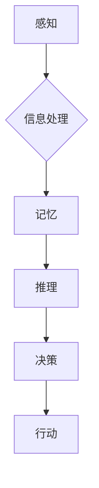

> 人类计算、认知科学、人工智能、神经网络、机器学习、深度学习、生物启发式、计算模型、思维模拟

## 1. 背景介绍

人类思维，作为人类最核心的能力之一，一直以来都是哲学、心理学和认知科学研究的焦点。随着人工智能技术的飞速发展，我们开始尝试用计算机科学的方法来理解和模拟人类思维。

人类计算的概念，即利用计算机技术来模拟和实现人类的认知过程，近年来逐渐成为一个热门的研究领域。它试图揭示人类思维的本质，并将其应用于人工智能的开发，从而构建更智能、更接近人类的机器。

## 2. 核心概念与联系

**2.1 人类计算的本质**

人类计算的核心在于模拟人类认知过程中的关键要素，包括感知、记忆、推理、决策等。

**2.2 人类计算与人工智能的关系**

人工智能是模拟和实现人类智能的科学，而人类计算则是人工智能的一个重要分支。

**2.3 人类计算的挑战**

模拟人类思维面临着巨大的挑战，包括：

* **复杂性:** 人类思维的复杂性难以用简单的数学模型来描述。
* **非确定性:** 人类思维具有高度的非确定性，难以用精确的算法来预测。
* **意识问题:** 人类思维是否仅仅是信息处理的结果，还是存在着意识这一不可分割的要素，仍然是一个未解之谜。

**2.4 人类计算的未来**

尽管面临着诸多挑战，但人类计算仍然是一个充满希望的领域。随着计算机科学和认知科学的不断发展，我们相信未来能够构建出更接近人类的智能机器。

**Mermaid 流程图**



## 3. 核心算法原理 & 具体操作步骤

**3.1 算法原理概述**

人类计算的核心算法原理是基于神经网络的模拟。神经网络是一种模仿大脑神经元结构和功能的计算模型。

**3.2 算法步骤详解**

1. **构建神经网络:** 根据需要模拟的人类认知功能，构建相应的网络结构，包括输入层、隐藏层和输出层。
2. **设定权重:** 每个神经元之间都有连接权重，这些权重决定了信息在网络中的传递方式。
3. **训练神经网络:** 使用训练数据，通过反向传播算法调整神经网络的权重，使网络能够准确地完成指定任务。
4. **测试神经网络:** 使用测试数据评估神经网络的性能，并根据结果进行进一步的调整和优化。

**3.3 算法优缺点**

**优点:**

* **强大的学习能力:** 神经网络能够从大量数据中学习，并自动提取特征。
* **非线性处理能力:** 神经网络能够处理复杂的非线性关系。
* **并行计算能力:** 神经网络的计算过程可以并行化，提高计算效率。

**缺点:**

* **训练数据依赖性:** 神经网络的性能取决于训练数据的质量和数量。
* **黑盒效应:** 神经网络的内部工作机制难以理解，难以解释其决策结果。
* **计算资源消耗:** 训练大型神经网络需要大量的计算资源。

**3.4 算法应用领域**

* **图像识别:** 人脸识别、物体检测、图像分类
* **自然语言处理:** 机器翻译、文本摘要、情感分析
* **语音识别:** 语音转文本、语音助手
* **医疗诊断:** 病症预测、图像分析
* **金融预测:** 股票预测、风险评估

## 4. 数学模型和公式 & 详细讲解 & 举例说明

**4.1 数学模型构建**

神经网络的数学模型基于线性变换和非线性激活函数。

**4.2 公式推导过程**

* **线性变换:** 每个神经元接收来自多个输入神经元的信号，并对其进行加权求和。
* **激活函数:** 激活函数将加权求和的结果转换为输出信号，引入非线性特性。

**4.3 案例分析与讲解**

**Sigmoid 函数**

$$
\sigma(x) = \frac{1}{1 + e^{-x}}
$$

Sigmoid 函数是一种常用的激活函数，其输出值在0到1之间，常用于二分类问题。

**举例说明:**

假设一个神经元接收两个输入信号，权重分别为0.5和0.3，输入信号分别为2和1。则该神经元的输出信号为：

$$
\sigma(0.5 \times 2 + 0.3 \times 1) = \sigma(1.3)
$$

**4.4 其他数学模型**

除了Sigmoid函数，还有其他常用的激活函数，例如ReLU函数、tanh函数等。

## 5. 项目实践：代码实例和详细解释说明

**5.1 开发环境搭建**

* Python 3.x
* TensorFlow 或 PyTorch

**5.2 源代码详细实现**

```python
import tensorflow as tf

# 定义神经网络模型
model = tf.keras.models.Sequential([
    tf.keras.layers.Dense(128, activation='relu', input_shape=(784,)),
    tf.keras.layers.Dense(10, activation='softmax')
])

# 编译模型
model.compile(optimizer='adam',
              loss='sparse_categorical_crossentropy',
              metrics=['accuracy'])

# 训练模型
model.fit(x_train, y_train, epochs=10)

# 评估模型
loss, accuracy = model.evaluate(x_test, y_test)
print('Test loss:', loss)
print('Test accuracy:', accuracy)
```

**5.3 代码解读与分析**

* **定义神经网络模型:** 使用`tf.keras.models.Sequential`构建一个简单的多层感知机模型。
* **编译模型:** 使用`adam`优化器、`sparse_categorical_crossentropy`损失函数和`accuracy`指标编译模型。
* **训练模型:** 使用训练数据`x_train`和`y_train`训练模型，设置训练轮数为10。
* **评估模型:** 使用测试数据`x_test`和`y_test`评估模型的性能，打印测试损失和准确率。

**5.4 运行结果展示**

训练完成后，模型将输出测试损失和准确率。

## 6. 实际应用场景

**6.1 图像识别**

* **人脸识别:** 用于身份验证、安全监控等场景。
* **物体检测:** 用于自动驾驶、机器人视觉等场景。
* **图像分类:** 用于医学影像诊断、产品分类等场景。

**6.2 自然语言处理**

* **机器翻译:** 将一种语言翻译成另一种语言。
* **文本摘要:** 自动生成文本的简要摘要。
* **情感分析:** 分析文本中的情感倾向。

**6.3 语音识别**

* **语音转文本:** 将语音转换为文本。
* **语音助手:** 用于语音控制设备、提供信息查询等功能。

**6.4 其他应用场景**

* **医疗诊断:** 辅助医生进行疾病诊断。
* **金融预测:** 预测股票价格、风险评估等。
* **个性化推荐:** 根据用户的喜好推荐产品或服务。

**6.5 未来应用展望**

随着人工智能技术的不断发展，人类计算将在更多领域得到应用，例如：

* **智能教育:** 提供个性化学习方案。
* **智能医疗:** 辅助医生进行诊断和治疗。
* **智能制造:** 自动化生产流程。

## 7. 工具和资源推荐

**7.1 学习资源推荐**

* **书籍:**
    * 《深度学习》
    * 《神经网络与深度学习》
    * 《机器学习》
* **在线课程:**
    * Coursera
    * edX
    * Udacity

**7.2 开发工具推荐**

* **TensorFlow:** 开源深度学习框架。
* **PyTorch:** 开源深度学习框架。
* **Keras:** 高级深度学习API。

**7.3 相关论文推荐**

* **《ImageNet Classification with Deep Convolutional Neural Networks》**
* **《Attention Is All You Need》**
* **《BERT: Pre-training of Deep Bidirectional Transformers for Language Understanding》**

## 8. 总结：未来发展趋势与挑战

**8.1 研究成果总结**

近年来，人类计算取得了显著进展，在图像识别、自然语言处理等领域取得了突破性成果。

**8.2 未来发展趋势**

* **模型规模和复杂度提升:** 训练更大规模、更复杂的神经网络模型。
* **算法创新:** 开发新的算法和模型架构，提高模型性能和效率。
* **跨模态学习:** 融合不同模态的数据，例如文本、图像、音频等，实现更全面的理解。
* **可解释性增强:** 提高模型的透明度和可解释性，帮助人类理解模型的决策过程。

**8.3 面临的挑战**

* **数据获取和标注:** 训练高质量的人类计算模型需要大量的数据和标注。
* **计算资源限制:** 训练大型神经网络模型需要大量的计算资源。
* **伦理问题:** 人类计算的应用可能引发伦理问题，例如算法偏见、隐私泄露等。

**8.4 研究展望**

未来，人类计算将继续朝着更智能、更安全、更可解释的方向发展，为人类社会带来更多福祉。

## 9. 附录：常见问题与解答

**9.1 什么是激活函数？**

激活函数是神经网络中一个重要的组成部分，它决定了神经元的输出信号。

**9.2 什么是反向传播算法？**

反向传播算法是一种用于训练神经网络的算法，它通过调整神经网络的权重来最小化模型的损失函数。

**9.3 人类计算与通用人工智能的关系？**

通用人工智能是指能够执行任何人类能够执行的任务的智能机器。人类计算是实现通用人工智能的一种重要途径。


作者：禅与计算机程序设计艺术 / Zen and the Art of Computer Programming 
<end_of_turn>