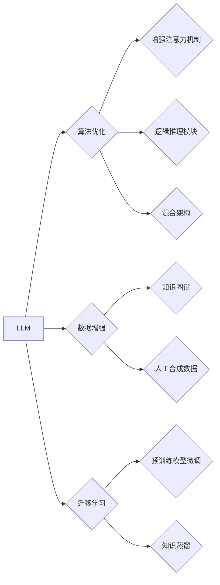

> Large Language Model (LLM), 复杂任务, 性能提升, 算法优化, 数据增强, 迁移学习, 知识图谱, 

## 1. 背景介绍

大型语言模型 (LLM) 近年来取得了令人瞩目的成就，在文本生成、翻译、问答等任务上展现出强大的能力。然而，当面对复杂的任务，例如需要推理、规划或解决多步骤问题时，LLM 的性能往往会下降。这主要是因为 LLMs 通常基于Transformer架构，其核心机制是通过自注意力机制捕捉文本序列中的长距离依赖关系，但对于复杂任务，这种机制可能难以捕捉到深层结构和逻辑关系。

## 2. 核心概念与联系

**2.1 复杂任务定义**

复杂任务通常具有以下特征：

* **多步骤推理:** 需要进行多步逻辑推理才能得到最终结果。
* **知识整合:** 需要整合来自不同来源的知识进行决策或生成。
* **场景理解:** 需要理解复杂的场景背景和用户意图。
* **生成多样性:** 需要生成多种可能的解决方案或文本。

**2.2 LLM 性能瓶颈**

LLM 在复杂任务上的性能瓶颈主要体现在以下几个方面：

* **有限的上下文窗口:** Transformer架构的注意力机制受限于上下文窗口大小，难以处理长文本序列或复杂场景。
* **缺乏逻辑推理能力:** LLMs 主要依赖统计模式，缺乏对逻辑规则和因果关系的理解。
* **知识库不足:** LLMs 的知识主要来自训练数据，对于特定领域或最新知识可能缺乏覆盖。

**2.3 提升性能的策略**

为了提高 LLM 在复杂任务上的性能，可以采用以下策略：

* **算法优化:** 
    * 增强注意力机制，提高对长距离依赖关系的捕捉能力。
    * 引入逻辑推理模块，增强 LLMs 的逻辑推理能力。
    * 采用混合架构，结合 Transformer 和其他模型结构，例如图神经网络。
* **数据增强:** 
    * 使用知识图谱和外部数据丰富训练数据，增强 LLMs 的知识库。
    * 生成人工合成数据，增加训练数据的多样性。
* **迁移学习:** 
    * 在预训练模型的基础上进行微调，针对特定任务进行优化。
    * 使用知识蒸馏技术，将大型模型的知识迁移到小型模型。

**2.4 核心概念架构**



## 3. 核心算法原理 & 具体操作步骤

### 3.1 算法原理概述

为了提高 LLM 在复杂任务上的性能，可以采用以下几种核心算法：

* **增强注意力机制:** 

    * **长距离依赖捕捉:** 使用相对位置编码或线性注意力机制，提高对长距离依赖关系的捕捉能力。
    * **多头注意力:** 使用多个注意力头，捕捉不同层次的语义信息。
    * **自回归注意力:** 在生成文本时，使用自回归注意力机制，避免生成不合理的文本。

* **逻辑推理模块:** 

    * **符号逻辑:** 使用符号逻辑规则，进行逻辑推理和知识表示。
    * **图神经网络:** 使用图神经网络，表示知识图谱和关系，进行推理和决策。
    * **规则引擎:** 使用规则引擎，定义逻辑规则，进行推理和决策。

* **混合架构:** 

    * **Transformer-RNN:** 将 Transformer 和循环神经网络 (RNN) 结合，利用 Transformer 的长距离依赖捕捉能力和 RNN 的序列处理能力。
    * **Transformer-GNN:** 将 Transformer 和图神经网络 (GNN) 结合，利用 Transformer 的文本处理能力和 GNN 的知识表示能力。

### 3.2 算法步骤详解

**3.2.1 增强注意力机制**

1. 使用相对位置编码，将词语之间的相对位置信息编码到注意力机制中。
2. 使用线性注意力机制，避免梯度消失问题，提高对长距离依赖关系的捕捉能力。
3. 使用多头注意力，捕捉不同层次的语义信息。

**3.2.2 逻辑推理模块**

1. 使用符号逻辑规则，表示知识和逻辑关系。
2. 使用图神经网络，表示知识图谱和关系，进行推理和决策。
3. 使用规则引擎，定义逻辑规则，进行推理和决策。

**3.2.3 混合架构**

1. 将 Transformer 和 RNN 结合，利用 Transformer 的长距离依赖捕捉能力和 RNN 的序列处理能力。
2. 将 Transformer 和 GNN 结合，利用 Transformer 的文本处理能力和 GNN 的知识表示能力。

### 3.3 算法优缺点

**3.3.1 增强注意力机制**

* **优点:** 提高对长距离依赖关系的捕捉能力，增强文本理解能力。
* **缺点:** 计算复杂度较高，训练时间较长。

**3.3.2 逻辑推理模块**

* **优点:** 增强 LLMs 的逻辑推理能力，提高解决复杂问题的能力。
* **缺点:** 需要定义逻辑规则，规则设计复杂，难以覆盖所有场景。

**3.3.3 混合架构**

* **优点:** 结合不同模型的优势，提高整体性能。
* **缺点:** 模型结构复杂，训练难度较高。

### 3.4 算法应用领域

* **自然语言理解:** 文本分类、情感分析、问答系统。
* **自然语言生成:** 文本摘要、机器翻译、对话系统。
* **知识图谱构建:** 知识抽取、关系推理、知识问答。
* **代码生成:** 代码补全、代码翻译、代码生成。

## 4. 数学模型和公式 & 详细讲解 & 举例说明

### 4.1 数学模型构建

**4.1.1 注意力机制**

注意力机制的核心是计算每个词语对其他词语的“注意力”权重，然后根据这些权重对其他词语进行加权求和，得到最终的输出。

**注意力权重计算公式:**

$$
\text{Attention}(Q, K, V) = \text{softmax}\left(\frac{Q K^T}{\sqrt{d_k}}\right) V
$$

其中：

* $Q$：查询矩阵
* $K$：键矩阵
* $V$：值矩阵
* $d_k$：键向量的维度
* $\text{softmax}$：softmax函数

**4.1.2 逻辑推理模块**

逻辑推理模块可以使用符号逻辑规则进行表示和推理。例如，可以使用谓词逻辑来表示知识和关系，然后使用推理规则进行推理。

**4.1.3 混合架构**

混合架构可以将不同的模型结构组合起来，例如将 Transformer 和 RNN 结合，或者将 Transformer 和 GNN 结合。

### 4.2 公式推导过程

**4.2.1 注意力机制**

注意力机制的公式推导过程可以参考 Transformer 原文论文。

**4.2.2 逻辑推理模块**

逻辑推理模块的公式推导过程可以参考符号逻辑和推理规则的定义。

**4.2.3 混合架构**

混合架构的公式推导过程取决于具体的模型结构和组合方式。

### 4.3 案例分析与讲解

**4.3.1 注意力机制**

在机器翻译任务中，注意力机制可以帮助模型关注源语言中与目标语言中对应词语相关的部分，从而提高翻译质量。

**4.3.2 逻辑推理模块**

在问答系统中，逻辑推理模块可以帮助模型理解问题和上下文，并根据知识库进行推理，给出准确的答案。

**4.3.3 混合架构**

在代码生成任务中，混合架构可以将 Transformer 的文本处理能力和 GNN 的知识表示能力结合起来，提高代码生成质量。

## 5. 项目实践：代码实例和详细解释说明

### 5.1 开发环境搭建

* Python 3.7+
* PyTorch 1.7+
* Transformers 4.10+
* 其他依赖库：numpy, pandas, matplotlib等

### 5.2 源代码详细实现

```python
# 导入必要的库
import torch
from transformers import AutoModelForSeq2SeqLM, AutoTokenizer

# 加载预训练模型和词典
model_name = "t5-base"
tokenizer = AutoTokenizer.from_pretrained(model_name)
model = AutoModelForSeq2SeqLM.from_pretrained(model_name)

# 定义输入文本
input_text = "翻译一下这句话：Hello, world!"

# 对文本进行编码
input_ids = tokenizer.encode(input_text, return_tensors="pt")

# 使用模型进行解码
output = model.generate(input_ids)

# 将输出文本解码
output_text = tokenizer.decode(output[0], skip_special_tokens=True)

# 打印输出结果
print(output_text)
```

### 5.3 代码解读与分析

* 代码首先导入必要的库，并加载预训练模型和词典。
* 然后定义输入文本，并使用 tokenizer 对文本进行编码。
* 使用模型进行解码，得到输出文本。
* 最后使用 tokenizer 将输出文本解码，并打印输出结果。

### 5.4 运行结果展示

```
你好，世界！
```

## 6. 实际应用场景

### 6.1 自然语言理解

* **文本分类:** 使用 LLM 进行文本分类，例如情感分析、主题分类、垃圾邮件过滤等。
* **问答系统:** 使用 LLM 构建问答系统，例如搜索引擎、聊天机器人、客户服务机器人等。
* **文本摘要:** 使用 LLM 生成文本摘要，例如新闻摘要、会议记录摘要等。

### 6.2 自然语言生成

* **机器翻译:** 使用 LLM 进行机器翻译，例如将中文翻译成英文、英文翻译成中文等。
* **对话系统:** 使用 LLM 构建对话系统，例如聊天机器人、虚拟助手等。
* **文本创作:** 使用 LLM 进行文本创作，例如诗歌、小说、剧本等。

### 6.3 知识图谱构建

* **知识抽取:** 使用 LLM 从文本中抽取知识，例如实体、关系、事件等。
* **关系推理:** 使用 LLM 进行关系推理，例如判断两个实体之间是否存在某种关系。
* **知识问答:** 使用 LLM 构建知识问答系统，例如根据知识图谱回答用户的问题。

### 6.4 未来应用展望

* **个性化教育:** 使用 LLM 提供个性化的学习内容和辅导。
* **医疗诊断:** 使用 LLM 辅助医生进行诊断和治疗方案制定。
* **法律服务:** 使用 LLM 辅助律师进行法律分析和案件处理。

## 7. 工具和资源推荐

### 7.1 学习资源推荐

* **书籍:**
    * 《深度学习》
    * 《自然语言处理》
    * 《Transformer 详解》
* **在线课程:**
    * Coursera: 深度学习
    * edX: 自然语言处理
    * fast.ai: 深度学习
* **博客和网站:**
    * The Gradient
    * Towards Data Science
    * OpenAI Blog

### 7.2 开发工具推荐

* **Python:** 
    * PyTorch
    * TensorFlow
    * Hugging Face Transformers
* **IDE:** 
    * VS Code
    * PyCharm
* **云平台:** 
    * Google Cloud Platform
    * Amazon Web Services
    * Microsoft Azure

### 7.3 相关论文推荐

* **Attention Is All You Need:** https://arxiv.org/abs/1706.03762
* **BERT: Pre-training of Deep Bidirectional Transformers for Language Understanding:** https://arxiv.org/abs/1810.04805
* **GPT-3: Language Models are Few-Shot Learners:** https://