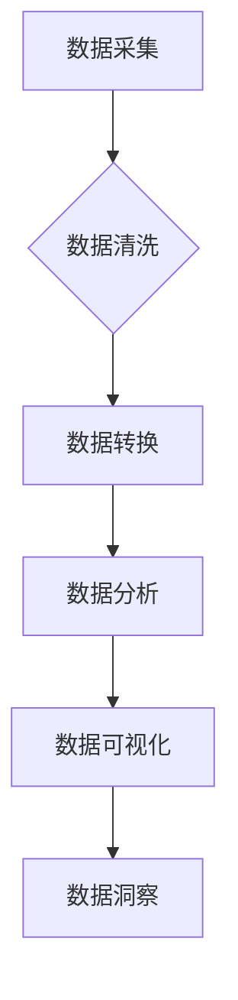

> 数据，数据分析，机器学习，深度学习，大数据，数据可视化，数据科学

## 1. 背景介绍

在当今数字时代，数据已成为一种无处不在的资源，它蕴藏着巨大的价值，为我们提供前所未有的洞察力和决策能力。从商业运营到科学研究，从医疗保健到金融服务，数据在各个领域发挥着越来越重要的作用。

然而，数据本身并无价值，只有通过有效的收集、存储、分析和利用，才能将其转化为有意义的知识和洞察力。因此，掌握数据分析、机器学习、深度学习等技术，成为21世纪最关键的技能之一。

## 2. 核心概念与联系

**数据**是指任何可以被记录、存储和处理的信息，它可以是结构化的、半结构化的或非结构化的。

**数据分析**是指通过收集、清理、转换和模型数据，以发现模式、趋势和洞察力。

**机器学习**是一种人工智能技术，它允许计算机从数据中学习，并根据学习到的知识做出预测或决策。

**深度学习**是一种机器学习的子集，它使用多层神经网络来模拟人类大脑的学习过程。

**大数据**是指海量、高速度、高多样性的数据，它需要特殊的技术和工具进行处理和分析。

**数据可视化**是指将数据以图形、图表等形式呈现出来，以帮助人们更好地理解和分析数据。

**数据科学**是一个跨学科领域，它结合了统计学、计算机科学、领域知识等，旨在从数据中提取有价值的知识和洞察力。

**数据流程图:**



## 3. 核心算法原理 & 具体操作步骤

### 3.1  算法原理概述

机器学习算法的核心原理是通过训练模型来学习数据中的模式和规律。训练模型的过程通常包括以下步骤：

1. **数据准备:** 收集、清洗、转换数据，使其适合模型训练。
2. **模型选择:** 根据具体任务选择合适的机器学习算法。
3. **模型训练:** 使用训练数据训练模型，调整模型参数，使其能够准确地预测或分类数据。
4. **模型评估:** 使用测试数据评估模型的性能，并根据评估结果进行模型调优。
5. **模型部署:** 将训练好的模型部署到实际应用场景中，用于预测或分类新的数据。

### 3.2  算法步骤详解

以下是一些常用的机器学习算法的具体操作步骤：

**线性回归:**

1. 将特征数据和目标变量数据输入模型。
2. 计算模型参数，使预测值与实际值之间的误差最小化。
3. 使用训练好的模型预测新的数据。

**逻辑回归:**

1. 将特征数据输入模型。
2. 计算模型参数，使预测结果与实际标签之间的误差最小化。
3. 使用训练好的模型预测新的数据标签。

**决策树:**

1. 根据特征数据构建决策树，每个节点代表一个特征，每个分支代表一个特征值。
2. 将数据沿着决策树分支，最终到达叶子节点，叶子节点代表预测结果。

**支持向量机:**

1. 在特征空间中找到一个超平面，将不同类别的数据点分开。
2. 使用训练好的超平面预测新的数据类别。

### 3.3  算法优缺点

不同的机器学习算法具有不同的优缺点，需要根据具体任务选择合适的算法。

**线性回归:**

* 优点: 简单易懂，计算速度快。
* 缺点: 只能处理线性关系，对异常值敏感。

**逻辑回归:**

* 优点: 可以处理分类问题，对异常值比较鲁棒。
* 缺点: 只能处理线性可分的数据。

**决策树:**

* 优点: 可以处理非线性关系，易于理解和解释。
* 缺点: 容易过拟合，对数据特征的顺序敏感。

**支持向量机:**

* 优点: 可以处理高维数据，对噪声数据鲁棒性强。
* 缺点: 计算复杂度高，参数选择困难。

### 3.4  算法应用领域

机器学习算法广泛应用于各个领域，例如：

* **商业:** 客户关系管理、精准营销、欺诈检测
* **医疗保健:** 疾病诊断、药物研发、患者风险评估
* **金融:** 风险管理、信用评分、投资决策
* **交通:** 自驾车、交通流量预测、路线规划
* **教育:** 个性化学习、学生成绩预测

## 4. 数学模型和公式 & 详细讲解 & 举例说明

### 4.1  数学模型构建

机器学习算法通常基于数学模型，这些模型通过公式和参数来描述数据之间的关系。例如，线性回归模型的数学模型如下：

$$y = w_0 + w_1x_1 + w_2x_2 + ... + w_nx_n$$

其中：

* $y$ 是目标变量
* $x_1, x_2, ..., x_n$ 是特征变量
* $w_0, w_1, w_2, ..., w_n$ 是模型参数

### 4.2  公式推导过程

机器学习算法的训练过程通常涉及优化模型参数，使模型预测结果与实际值之间的误差最小化。常用的优化算法包括梯度下降法、随机梯度下降法等。

梯度下降法的核心思想是通过迭代更新模型参数，沿着误差梯度的负方向移动，最终找到最小误差的模型参数。

### 4.3  案例分析与讲解

假设我们有一个线性回归模型，用于预测房价。特征变量包括房屋面积、房间数量、地理位置等。

我们可以使用梯度下降法训练模型，并通过观察模型参数的变化，了解哪些特征对房价影响最大。

## 5. 项目实践：代码实例和详细解释说明

### 5.1  开发环境搭建

为了实现机器学习项目，我们需要搭建一个开发环境，包括以下软件：

* Python 编程语言
* NumPy 数值计算库
* Pandas 数据处理库
* Scikit-learn 机器学习库
* Matplotlib 数据可视化库

### 5.2  源代码详细实现

以下是一个使用Scikit-learn库实现线性回归的代码示例：

```python
import numpy as np
from sklearn.linear_model import LinearRegression
from sklearn.model_selection import train_test_split

# 生成示例数据
X = np.array([[1, 2], [3, 4], [5, 6], [7, 8]])
y = np.array([3, 7, 11, 15])

# 将数据分成训练集和测试集
X_train, X_test, y_train, y_test = train_test_split(X, y, test_size=0.2)

# 创建线性回归模型
model = LinearRegression()

# 训练模型
model.fit(X_train, y_train)

# 使用模型预测测试集数据
y_pred = model.predict(X_test)

# 打印预测结果
print(y_pred)
```

### 5.3  代码解读与分析

这段代码首先生成了一些示例数据，然后将数据分成训练集和测试集。接着，创建了一个线性回归模型，并使用训练集数据训练模型。最后，使用训练好的模型预测测试集数据，并打印预测结果。

### 5.4  运行结果展示

运行这段代码后，会输出测试集数据的预测结果。

## 6. 实际应用场景

### 6.1  电商推荐系统

电商平台可以使用机器学习算法分析用户的购买历史、浏览记录等数据，推荐用户可能感兴趣的商品。

### 6.2  个性化广告

广告平台可以使用机器学习算法分析用户的兴趣爱好、行为特征等数据，推送个性化的广告，提高广告点击率和转化率。

### 6.3  医疗诊断辅助系统

医疗机构可以使用机器学习算法分析患者的病历、检查结果等数据，辅助医生进行疾病诊断，提高诊断准确率。

### 6.4  未来应用展望

随着数据量的不断增长和机器学习算法的不断发展，数据将在未来发挥更加重要的作用。

## 7. 工具和资源推荐

### 7.1  学习资源推荐

* **书籍:**
    * 《Python机器学习》
    * 《机器学习实战》
    * 《深度学习》
* **在线课程:**
    * Coursera
    * edX
    * Udacity

### 7.2  开发工具推荐

* **Python:** 
    * Jupyter Notebook
    * PyCharm
* **机器学习库:**
    * Scikit-learn
    * TensorFlow
    * PyTorch

### 7.3  相关论文推荐

* **机器学习经典论文:**
    * 《Support Vector Machines》
    * 《A Probabilistic Approach to Automatic Document Understanding》
    * 《Deep Learning》

## 8. 总结：未来发展趋势与挑战

### 8.1  研究成果总结

近年来，机器学习领域取得了显著的进展，在图像识别、自然语言处理、语音识别等领域取得了突破性成果。

### 8.2  未来发展趋势

未来，机器学习将朝着以下方向发展：

* **更强大的算法:** 研究更强大的机器学习算法，例如深度学习、强化学习等。
* **更广泛的应用:** 将机器学习应用到更多领域，例如医疗保健、教育、金融等。
* **更智能的系统:** 开发更智能的机器学习系统，能够自主学习和决策。

### 8.3  面临的挑战

机器学习也面临一些挑战，例如：

* **数据质量:** 机器学习算法对数据质量要求很高，需要高质量的数据才能训练出准确的模型。
* **算法解释性:** 许多机器学习算法是黑箱模型，难以解释其决策过程。
* **伦理问题:** 机器学习算法可能会带来一些伦理问题，例如算法偏见、隐私泄露等。

### 8.4  研究展望

未来，我们需要继续研究更强大的机器学习算法，并解决机器学习面临的挑战，才能更好地利用数据，推动社会进步。

## 9. 附录：常见问题与解答

### 9.1  什么是机器学习？

机器学习是一种人工智能技术，它允许计算机从数据中学习，并根据学习到的知识做出预测或决策。

### 9.2  机器学习算法有哪些？

常见的机器学习算法包括线性回归、逻辑回归、决策树、支持向量机、神经网络等。

### 9.3  如何选择合适的机器学习算法？

选择合适的机器学习算法需要根据具体任务和数据特点进行选择。

### 9.4  如何评估机器学习模型的性能？

常用的机器学习模型性能评估指标包括准确率、召回率、F1-score、AUC等。

### 9.5  机器学习有哪些应用场景？

机器学习广泛应用于各个领域，例如商业、医疗保健、金融、交通等。


作者：禅与计算机程序设计艺术 / Zen and the Art of Computer Programming 
<end_of_turn>