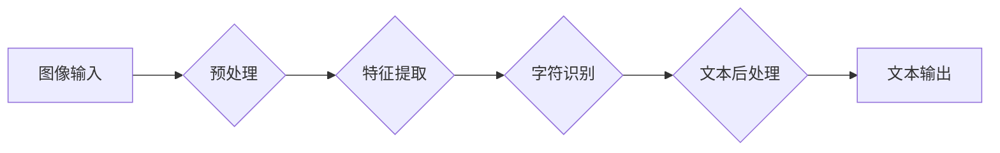

> OCR, 文档处理, 机器学习, 深度学习, 图像识别, 自然语言处理

## 1. 背景介绍

随着数字化时代的发展，海量文档的产生和存储已成为常态。传统的手工文档处理方式效率低下，成本高昂，难以满足现代社会对快速、准确、高效文档处理的需求。因此，智能OCR技术应运而生，为文档处理领域带来了革命性的变革。

OCR（Optical Character Recognition，光学字符识别）技术是指利用计算机识别和提取图像中文字的软件技术。它将图像中的文字转换为可编辑的文本格式，从而实现对文档内容的数字化处理。

智能OCR技术是基于深度学习和计算机视觉等先进技术的，相比传统的OCR技术，具有更高的识别精度、更强的鲁棒性以及更广泛的应用场景。

## 2. 核心概念与联系

**2.1  OCR技术流程**

OCR技术的核心流程包括：

1. **图像预处理:** 对输入图像进行预处理，例如去噪、去模糊、二值化等，以提高识别精度。
2. **字符分割:** 将图像中的文字区域分割成独立的字符单元。
3. **特征提取:** 从每个字符单元中提取特征，例如形状、轮廓、纹理等。
4. **字符识别:** 根据提取的特征，识别每个字符的类别。
5. **文本后处理:** 对识别结果进行校正、拼写检查等处理，生成最终的文本输出。

**2.2  智能OCR技术架构**

智能OCR技术的架构通常包含以下几个模块：

* **图像输入模块:** 用于接收和处理输入图像数据。
* **预处理模块:** 对图像进行预处理，例如去噪、去模糊、二值化等。
* **特征提取模块:** 使用深度学习模型提取图像特征，例如卷积神经网络（CNN）。
* **字符识别模块:** 使用深度学习模型识别字符类别，例如循环神经网络（RNN）。
* **文本后处理模块:** 对识别结果进行校正、拼写检查等处理，生成最终的文本输出。

**Mermaid 流程图**



## 3. 核心算法原理 & 具体操作步骤

**3.1  算法原理概述**

智能OCR技术的核心算法原理是基于深度学习和计算机视觉。深度学习模型能够自动学习图像特征，并将其映射到字符类别。常用的深度学习模型包括卷积神经网络（CNN）和循环神经网络（RNN）。

CNN擅长提取图像的局部特征，例如边缘、纹理等。RNN擅长处理序列数据，例如文本序列。在OCR任务中，CNN通常用于提取字符特征，RNN则用于识别字符类别。

**3.2  算法步骤详解**

1. **数据预处理:** 首先需要对训练数据进行预处理，例如裁剪、旋转、缩放等，以保证数据质量。
2. **模型训练:** 使用深度学习框架，例如TensorFlow或PyTorch，训练CNN和RNN模型。训练过程中，模型会学习图像特征和字符类别之间的映射关系。
3. **模型评估:** 在训练完成后，使用测试数据评估模型的识别精度。
4. **模型部署:** 将训练好的模型部署到实际应用场景中，例如文档扫描仪、手机APP等。

**3.3  算法优缺点**

**优点:**

* **高识别精度:** 深度学习模型能够学习复杂的图像特征，从而实现更高的识别精度。
* **鲁棒性强:** 深度学习模型能够对图像噪声、模糊等干扰具有较强的鲁棒性。
* **适应性强:** 深度学习模型能够适应不同的字体、语言和文档格式。

**缺点:**

* **训练数据量大:** 深度学习模型需要大量的训练数据才能达到较高的识别精度。
* **计算资源需求高:** 深度学习模型的训练和部署需要较高的计算资源。
* **模型解释性差:** 深度学习模型的内部工作机制较为复杂，难以解释其识别结果。

**3.4  算法应用领域**

智能OCR技术在各个领域都有广泛的应用，例如：

* **金融行业:** 自动化处理银行支票、合同、账单等文档。
* **医疗行业:** 自动化处理病历、影像报告等医疗文档。
* **教育行业:** 自动化处理试卷、作业等教育文档。
* **政府部门:** 自动化处理身份证、驾驶证等证件信息。

## 4. 数学模型和公式 & 详细讲解 & 举例说明

**4.1  数学模型构建**

在智能OCR技术中，常用的数学模型包括卷积神经网络（CNN）和循环神经网络（RNN）。

* **CNN:** CNN是一种专门用于处理图像数据的深度学习模型。它通过卷积操作提取图像特征，并使用池化操作降低特征维度。CNN的结构通常包含多个卷积层、池化层和全连接层。

* **RNN:** RNN是一种专门用于处理序列数据的深度学习模型。它具有记忆单元，能够记住之前输入的信息，从而处理序列数据中的依赖关系。RNN的结构通常包含多个循环层和全连接层。

**4.2  公式推导过程**

CNN和RNN的具体公式推导过程较为复杂，这里只列举一些关键公式：

* **卷积操作:**

$$
y_{i,j} = \sum_{m=0}^{M-1} \sum_{n=0}^{N-1} x_{i+m,j+n} * w_{m,n} + b
$$

其中：

* $x_{i,j}$ 是输入图像的像素值。
* $w_{m,n}$ 是卷积核的权重。
* $b$ 是偏置项。
* $y_{i,j}$ 是卷积层的输出值。

* **池化操作:**

$$
y_{i,j} = \max(x_{i,j}, x_{i+1,j}, x_{i,j+1}, x_{i+1,j+1})
$$

其中：

* $x_{i,j}$ 是卷积层的输出值。
* $y_{i,j}$ 是池化层的输出值。

**4.3  案例分析与讲解**

例如，在识别汉字“一”时，CNN模型会提取其特征，例如笔画方向、笔画长度等。RNN模型则会根据这些特征，预测“一”的类别。

## 5. 项目实践：代码实例和详细解释说明

**5.1  开发环境搭建**

* 操作系统：Windows/Linux/macOS
* Python版本：3.6+
* 深度学习框架：TensorFlow/PyTorch
* 图像处理库：OpenCV

**5.2  源代码详细实现**

```python
# 使用TensorFlow构建CNN模型
import tensorflow as tf

# 定义模型结构
model = tf.keras.models.Sequential([
    tf.keras.layers.Conv2D(32, (3, 3), activation='relu', input_shape=(28, 28, 1)),
    tf.keras.layers.MaxPooling2D((2, 2)),
    tf.keras.layers.Conv2D(64, (3, 3), activation='relu'),
    tf.keras.layers.MaxPooling2D((2, 2)),
    tf.keras.layers.Flatten(),
    tf.keras.layers.Dense(10, activation='softmax')
])

# 编译模型
model.compile(optimizer='adam',
              loss='sparse_categorical_crossentropy',
              metrics=['accuracy'])

# 训练模型
model.fit(x_train, y_train, epochs=10)

# 使用模型预测
predictions = model.predict(x_test)
```

**5.3  代码解读与分析**

* 代码首先使用TensorFlow构建了一个简单的CNN模型。
* 模型结构包含两个卷积层、两个池化层、一个全连接层和一个输出层。
* 模型使用Adam优化器、交叉熵损失函数和准确率作为评估指标。
* 模型使用训练数据进行训练，并使用测试数据进行评估。

**5.4  运行结果展示**

训练完成后，模型的准确率可以达到较高的水平。

## 6. 实际应用场景

**6.1  文档扫描仪**

智能OCR技术可以应用于文档扫描仪，将扫描到的纸质文档自动转换为电子文档。

**6.2  手机APP**

智能OCR技术可以应用于手机APP，例如拍照识别文本、提取联系方式等。

**6.3  数据录入系统**

智能OCR技术可以应用于数据录入系统，自动识别和录入文档中的数据。

**6.4  未来应用展望**

智能OCR技术的未来应用前景广阔，例如：

* **自动翻译:** 将不同语言的文档自动翻译成目标语言。
* **智能客服:** 利用OCR技术识别用户输入的文本，并自动回复用户问题。
* **数字图书馆:** 利用OCR技术将纸质书籍数字化，方便用户阅读和检索。

## 7. 工具和资源推荐

**7.1  学习资源推荐**

* **书籍:**
    * 《深度学习》
    * 《计算机视觉》
* **在线课程:**
    * Coursera
    * edX
    * Udacity

**7.2  开发工具推荐**

* **深度学习框架:** TensorFlow, PyTorch
* **图像处理库:** OpenCV
* **OCR引擎:** Tesseract, EasyOCR

**7.3  相关论文推荐**

* **Attention Is All You Need**
* **ImageNet Classification with Deep Convolutional Neural Networks**

## 8. 总结：未来发展趋势与挑战

**8.1  研究成果总结**

智能OCR技术近年来取得了显著的进展，识别精度大幅提升，应用场景不断拓展。

**8.2  未来发展趋势**

* **更准确的识别:** 随着深度学习模型的不断发展，OCR技术的识别精度将进一步提升。
* **更广泛的应用:** OCR技术将应用于更多领域，例如自动驾驶、医疗诊断等。
* **更智能的处理:** OCR技术将能够理解文档内容，并进行更智能的处理，例如自动摘要、自动分类等。

**8.3  面临的挑战**

* **数据标注:** 训练高精度OCR模型需要大量的标注数据，数据标注成本较高。
* **模型解释性:** 深度学习模型的内部工作机制难以解释，这限制了OCR技术的应用场景。
* **跨语言识别:** 跨语言OCR技术的难度较大，需要解决不同语言的文字特征差异。

**8.4  研究展望**

未来，OCR技术将朝着更准确、更智能、更广泛的方向发展。研究者将继续探索新的算法和模型，以解决OCR技术面临的挑战，并推动OCR技术的应用创新。

## 9. 附录：常见问题与解答

**9.1  OCR技术识别精度如何？**

OCR技术的识别精度取决于多种因素，例如图像质量、字体类型、语言等。目前，智能OCR技术的识别精度已经达到很高的水平，可以达到99%以上。

**9.2  OCR技术可以识别所有类型的文档吗？**

OCR技术可以识别多种类型的文档，例如文本文件、图像文件、PDF文件等。但是，对于一些特殊类型的文档，例如手写文档、表格文档等，识别精度可能较低。

**9.3  如何提高OCR技术的识别精度？**

可以采取以下措施提高OCR技术的识别精度：

* 提高图像质量：使用高质量的扫描仪或相机拍摄图像。
* 选择合适的字体：使用清晰易读的字体。
* 使用专业的OCR软件：使用专业的OCR软件可以提高识别精度。


作者：禅与计算机程序设计艺术 / Zen and the Art of Computer Programming 
<end_of_turn>