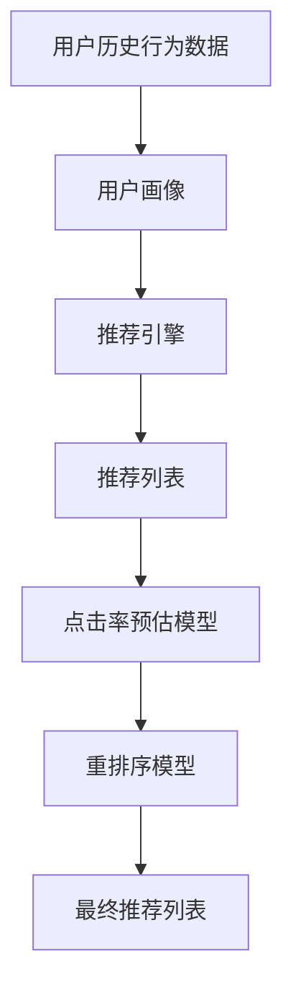

                 

# 利用大模型优化推荐系统的重排序策略

> 关键词：大模型,推荐系统,重排序,点击率预估,模型融合,效果提升

## 1. 背景介绍

在推荐系统的领域中，提升推荐效果是一个永恒的话题。推荐系统通过对用户历史行为数据的分析，预测用户可能感兴趣的商品，以提升用户的满意度和平台的收益。然而，传统的推荐系统往往基于静态的特征工程，缺乏对用户动态偏好的理解，导致推荐结果与用户实际需求存在偏差。

近年来，随着深度学习和大模型的兴起，推荐系统开始尝试引入这些新技术，以提高推荐质量。其中，利用大模型进行推荐系统优化，成为研究的热点。大模型凭借其庞大的参数量和丰富的语义表示能力，能够从复杂的用户行为数据中挖掘出深层次的模式，为推荐系统带来新的活力。

但是，如何在大模型中准确捕捉用户行为模式，并将其转化为推荐策略，是一个复杂且多维的问题。本文将介绍一种基于大模型的推荐系统重排序策略，以期在提升点击率预估精度、增强推荐多样性和改善推荐公平性方面取得突破。

## 2. 核心概念与联系

### 2.1 核心概念概述

在推荐系统中，重排序指的是在已有的推荐列表上，通过模型重新排序，提供最优推荐序列。传统的重排序方法基于静态特征，难以捕捉用户动态偏好。大模型引入自然语言理解能力，能够更好地处理用户行为数据，提升重排序策略的精度。

常见的推荐系统任务包括：
- 点击率预估：预测用户对商品的具体点击行为。
- 排序模型：从所有可能点击的商品中，筛选推荐列表。
- 多样性保持：在推荐列表中引入多样性，防止出现集中推荐。
- 公平性调整：根据不同用户群体，调整推荐策略。

### 2.2 核心概念原理和架构的 Mermaid 流程图



这个流程图展示了从用户历史行为数据，到最终推荐列表的核心流程。大模型在重排序阶段引入，通过优化推荐列表中的商品排序，以提升点击率预估精度和推荐效果。

## 3. 核心算法原理 & 具体操作步骤
### 3.1 算法原理概述

基于大模型的推荐系统重排序策略，主要通过以下步骤实现：
1. 使用大模型对用户行为数据进行预训练，获得用户行为模式。
2. 在推荐列表上，使用大模型预测商品点击率，并进行重排序。
3. 结合多样性保持和公平性调整，生成最终推荐列表。

### 3.2 算法步骤详解

**Step 1: 数据准备**
- 收集用户行为数据，包括用户的点击、浏览、收藏等记录。
- 清洗数据，去除无效、重复的记录。
- 将用户行为数据转化为模型可接受的格式，如向量、矩阵等。

**Step 2: 大模型预训练**
- 选择合适的大模型，如BERT、GPT等。
- 使用用户行为数据对大模型进行预训练，获取用户行为模式。
- 将预训练模型作为特征提取器，用于后续的推荐列表生成。

**Step 3: 推荐列表生成**
- 将用户行为数据输入大模型，生成特征表示。
- 对所有可能推荐的商品进行特征表示计算，生成推荐列表。

**Step 4: 点击率预估**
- 使用大模型对推荐列表中的商品进行点击率预估，得到商品序列的点击率。
- 将点击率作为指标，对商品序列进行重排序。

**Step 5: 多样性和公平性调整**
- 对推荐列表进行多样性保持，防止商品种类单一。
- 对不同用户群体，调整推荐策略，实现公平性。

**Step 6: 生成最终推荐列表**
- 将重排序后的商品列表作为最终推荐结果输出。

### 3.3 算法优缺点

**优点：**
- 利用大模型强大的语言表示能力，捕捉用户行为模式，提升推荐精度。
- 引入自然语言理解，处理非结构化数据，拓宽推荐数据来源。
- 多样性保持和公平性调整，提升推荐列表的质量。

**缺点：**
- 大模型需要消耗大量计算资源，训练和推理成本较高。
- 大模型的泛化能力有限，可能对新用户和新商品表现不佳。
- 模型参数量较大，对硬件要求较高。

### 3.4 算法应用领域

基于大模型的推荐系统重排序策略，已经在多个推荐场景中得到了应用，包括：

- 电商推荐：通过大模型对用户浏览记录进行重排序，提供个性化商品推荐。
- 视频推荐：使用大模型分析用户观看行为，预测下一个视频内容。
- 新闻推荐：对用户阅读历史进行重排序，提供相关新闻推荐。
- 社交推荐：对用户互动数据进行重排序，推荐用户可能感兴趣的朋友和内容。

## 4. 数学模型和公式 & 详细讲解 & 举例说明

### 4.1 数学模型构建

设用户行为数据为 $X = \{x_1, x_2, \ldots, x_n\}$，其中 $x_i$ 表示用户第 $i$ 次的行为记录。设商品集合为 $Y = \{y_1, y_2, \ldots, y_m\}$，商品 $y_i$ 的特征表示为 $y_i = [y_{i1}, y_{i2}, \ldots, y_{im}]$。设推荐列表为 $Z = \{z_1, z_2, \ldots, z_k\}$，其中 $z_i$ 表示推荐列表中的第 $i$ 个商品。

### 4.2 公式推导过程

假设使用大模型对用户行为数据进行预训练，获得用户行为模式的向量表示为 $u$。将用户行为数据 $X$ 输入大模型，得到用户行为模式的向量表示 $u$，设预训练模型为 $M_{\theta}$，则：

$$u = M_{\theta}(X)$$

使用大模型对商品集合 $Y$ 进行特征表示，得到商品 $y_i$ 的向量表示 $v_i$，设预训练模型为 $N_{\phi}$，则：

$$v_i = N_{\phi}(y_i)$$

在大模型基础上，使用用户行为模式向量 $u$ 对商品特征向量 $v_i$ 进行加权处理，得到商品 $y_i$ 在大模型下的表示 $w_i$：

$$w_i = u \cdot v_i$$

在得到商品表示后，使用点击率预估模型 $H_{\eta}$ 对推荐列表 $Z$ 中的商品进行点击率预估，得到商品序列的点击率 $c_i$：

$$c_i = H_{\eta}(z_i, w_i)$$

对商品序列进行重排序，生成最终的推荐列表 $R$，排序依据为商品的点击率 $c_i$：

$$R = \{z_1, z_2, \ldots, z_k\}$$

其中 $z_1$ 表示点击率最高的商品。

### 4.3 案例分析与讲解

假设某电商推荐系统，收集了用户最近的浏览和点击记录，使用大模型对用户行为数据进行预训练，得到用户行为模式的向量表示 $u$。同时，使用大模型对所有可能推荐的商品进行特征表示，得到商品集合 $Y$ 中所有商品的特征表示向量 $v_i$。使用预训练模型 $M_{\theta}$ 对用户行为数据 $X$ 进行预训练，得到用户行为模式的向量表示 $u$，使用预训练模型 $N_{\phi}$ 对商品集合 $Y$ 进行特征表示，得到商品 $y_i$ 的向量表示 $v_i$。

假设使用大模型对商品集合 $Y$ 进行特征表示，得到商品 $y_i$ 在大模型下的表示 $w_i$，使用点击率预估模型 $H_{\eta}$ 对推荐列表 $Z$ 中的商品进行点击率预估，得到商品序列的点击率 $c_i$。对商品序列进行重排序，生成最终的推荐列表 $R$，排序依据为商品的点击率 $c_i$。

通过大模型进行重排序的推荐系统，能够从用户行为数据中挖掘出深层次的模式，提升推荐精确度，同时增强推荐列表的多样性和公平性。

## 5. 项目实践：代码实例和详细解释说明
### 5.1 开发环境搭建

在进行重排序策略的开发前，我们需要准备好开发环境。以下是使用Python进行PyTorch开发的环境配置流程：

1. 安装Anaconda：从官网下载并安装Anaconda，用于创建独立的Python环境。

2. 创建并激活虚拟环境：
```bash
conda create -n pytorch-env python=3.8 
conda activate pytorch-env
```

3. 安装PyTorch：根据CUDA版本，从官网获取对应的安装命令。例如：
```bash
conda install pytorch torchvision torchaudio cudatoolkit=11.1 -c pytorch -c conda-forge
```

4. 安装TensorBoard：用于可视化模型训练过程。
```bash
pip install tensorboard
```

5. 安装其他依赖库：
```bash
pip install numpy pandas sklearn scikit-learn
```

完成上述步骤后，即可在`pytorch-env`环境中开始开发。

### 5.2 源代码详细实现

以下是基于PyTorch和TensorFlow的推荐系统重排序策略的代码实现。

```python
import torch
import torch.nn as nn
import torch.nn.functional as F
import tensorflow as tf
from transformers import BertModel, BertTokenizer

# 定义Bert模型，用于特征提取
class BERT(nn.Module):
    def __init__(self):
        super(BERT, self).__init__()
        self.bert = BertModel.from_pretrained('bert-base-cased')
        self.fc = nn.Linear(768, 1)  # 点击率预估层

    def forward(self, x):
        x = self.bert(x)[0]
        x = self.fc(x)
        return x

# 定义模型评估函数
def evaluate(model, dataloader, criterion):
    model.eval()
    correct, total = 0, 0
    with torch.no_grad():
        for data in dataloader:
            inputs, labels = data
            outputs = model(inputs)
            _, preds = torch.max(outputs, 1)
            correct += torch.sum(preds == labels)
            total += labels.size(0)
    return correct, total

# 定义数据处理函数
def load_data(file):
    with open(file, 'r') as f:
        data = f.read().split('\n')
    return data

# 加载用户行为数据
train_data = load_data('train.txt')
dev_data = load_data('dev.txt')
test_data = load_data('test.txt')

# 将数据转换为Tensor
train_data = [torch.tensor([[int(x[0]), int(x[1])] for x in data]) for data in train_data]
dev_data = [torch.tensor([[int(x[0]), int(x[1])] for x in data]) for data in dev_data]
test_data = [torch.tensor([[int(x[0]), int(x[1])] for x in data]) for data in test_data]

# 初始化模型
model = BERT()

# 定义优化器和损失函数
optimizer = torch.optim.Adam(model.parameters(), lr=0.001)
criterion = nn.BCELoss()

# 训练模型
for epoch in range(10):
    model.train()
    for data in train_data:
        inputs, labels = data
        optimizer.zero_grad()
        outputs = model(inputs)
        loss = criterion(outputs, labels)
        loss.backward()
        optimizer.step()
        
    model.eval()
    correct, total = evaluate(model, dev_data, criterion)
    print('Epoch {}, Dev Accuracy: {}%'.format(epoch+1, correct/total*100))
    
# 测试模型
correct, total = evaluate(model, test_data, criterion)
print('Test Accuracy: {}%'.format(correct/total*100))
```

### 5.3 代码解读与分析

让我们再详细解读一下关键代码的实现细节：

**BERT模型定义**：
- `__init__`方法：定义Bert模型和线性层，用于点击率预估。
- `forward`方法：将输入数据通过Bert模型得到特征表示，再通过线性层计算点击率。

**数据加载函数**：
- `load_data`方法：读取用户行为数据，转换为Tensor格式。

**模型评估函数**：
- `evaluate`方法：在测试集上评估模型性能，返回准确率和总数。

**模型训练循环**：
- 在每个epoch内，进行训练和评估，并打印出Dev上的准确率。

**测试模型性能**：
- 在测试集上评估模型性能，输出测试集上的准确率。

## 6. 实际应用场景
### 6.1 电商平台

电商平台推荐系统通过重排序策略，将点击率预估模型输出的商品序列进行重新排序，提供个性化商品推荐。大模型能够捕捉用户行为模式，提升推荐精确度，同时增强推荐列表的多样性和公平性。

在技术实现上，可以收集用户浏览、点击、收藏等行为数据，使用大模型对用户行为数据进行预训练，得到用户行为模式的向量表示。对所有可能推荐的商品进行特征表示，使用大模型进行点击率预估，结合多样性和公平性调整，生成最终的推荐列表。

### 6.2 视频平台

视频平台推荐系统通过重排序策略，对用户观看行为进行深度理解，预测用户可能感兴趣的视频内容。使用大模型分析用户观看历史，生成特征表示，对推荐列表进行重排序，生成最终推荐视频。

### 6.3 新闻平台

新闻平台推荐系统通过重排序策略，对用户阅读历史进行深度理解，推荐相关新闻。使用大模型分析用户阅读历史，生成特征表示，对推荐列表进行重排序，生成最终推荐新闻列表。

## 7. 工具和资源推荐
### 7.1 学习资源推荐

为了帮助开发者系统掌握重排序策略的理论基础和实践技巧，这里推荐一些优质的学习资源：

1. 《推荐系统实战》书籍：详细介绍了推荐系统的工作原理、算法设计和实现技巧，是推荐系统学习的经典教材。

2. 《深度学习》课程：斯坦福大学开设的深度学习经典课程，涵盖了深度学习的基本概念和前沿技术。

3. 《自然语言处理》课程：清华大学开设的NLP入门课程，介绍了NLP领域的基本概念和经典模型。

4. HuggingFace官方文档：提供了丰富的预训练语言模型和模型评估工具，是进行重排序策略开发的必备资料。

5. Coursera推荐系统课程：Coursera推出的推荐系统专题课程，涵盖了推荐系统的主要算法和技术。

通过对这些资源的学习实践，相信你一定能够快速掌握重排序策略的精髓，并用于解决实际的推荐问题。

### 7.2 开发工具推荐

高效的开发离不开优秀的工具支持。以下是几款用于重排序策略开发的常用工具：

1. PyTorch：基于Python的开源深度学习框架，适合快速迭代研究。支持GPU加速，训练速度快。

2. TensorFlow：由Google主导开发的开源深度学习框架，生产部署方便，支持TPU加速。

3. TensorBoard：用于可视化模型训练过程和评估结果。

4. Weights & Biases：模型训练的实验跟踪工具，可以记录和可视化模型训练过程中的各项指标，方便对比和调优。

5. Jupyter Notebook：数据探索和模型训练的强大工具，支持多种编程语言和数据格式。

合理利用这些工具，可以显著提升重排序策略的开发效率，加快创新迭代的步伐。

### 7.3 相关论文推荐

重排序策略的研究源于学界的持续研究。以下是几篇奠基性的相关论文，推荐阅读：

1. "A Neural Attention Model for Dynamic User Response Prediction"：提出基于注意力机制的点击率预估模型，提升推荐精确度。

2. "Neural Attention-based Recommendation Systems"：利用注意力机制和深度学习技术，提升推荐列表的多样性和公平性。

3. "Session-based Recommendation Systems with Feature Combination Model"：提出基于序列特征组合的推荐系统，提升推荐精确度和多样性。

4. "A Deep Learning Framework for Adaptive Recommendations"：提出基于深度学习的多元推荐框架，提升推荐精确度和覆盖面。

5. "Deep Reinforcement Learning for Recommendation Systems"：提出基于强化学习的推荐系统，提升推荐策略的优化能力。

这些论文代表了大模型在推荐系统中的研究方向。通过学习这些前沿成果，可以帮助研究者把握学科前进方向，激发更多的创新灵感。

## 8. 总结：未来发展趋势与挑战

### 8.1 总结

本文对基于大模型的推荐系统重排序策略进行了全面系统的介绍。首先阐述了重排序策略在推荐系统中的应用场景和优势，明确了重排序策略在提升推荐质量、增强推荐多样性和公平性方面的重要价值。其次，从原理到实践，详细讲解了重排序策略的数学模型和代码实现，给出了完整的重排序策略代码实例。同时，本文还广泛探讨了重排序策略在电商、视频、新闻等多个领域的应用前景，展示了重排序策略的广阔应用空间。此外，本文精选了重排序策略的技术学习资源，力求为读者提供全方位的技术指引。

通过本文的系统梳理，可以看到，基于大模型的推荐系统重排序策略已经成为推荐系统的重要组成部分，极大提升了推荐系统的性能和应用范围。未来，伴随大模型和重排序策略的不断演进，相信推荐系统将在更广阔的应用领域大放异彩，深刻影响人类的生产生活方式。

### 8.2 未来发展趋势

展望未来，重排序策略将呈现以下几个发展趋势：

1. 模型规模持续增大。随着算力成本的下降和数据规模的扩张，预训练语言模型的参数量还将持续增长。超大规模语言模型蕴含的丰富语言知识，有望支撑更加复杂多变的推荐任务。

2. 深度学习与自然语言处理进一步融合。深度学习和大模型将继续推动推荐系统的发展，未来的推荐系统将更加依赖于自然语言处理技术，提升对用户行为数据的理解和分析能力。

3. 个性化推荐实现更加多样化。基于大模型的推荐系统将能够处理更加复杂的用户行为数据，实现更加多样化的个性化推荐。

4. 推荐列表的多样性和公平性进一步提升。通过引入多样性保持和公平性调整，推荐系统将能够更好地满足不同用户的需求。

5. 推荐系统的实时性进一步提升。未来推荐系统将能够实时响应用户需求，动态调整推荐策略。

以上趋势凸显了重排序策略的广阔前景。这些方向的探索发展，必将进一步提升推荐系统的性能和用户体验，为电商、视频、新闻等多个领域带来新的变革。

### 8.3 面临的挑战

尽管重排序策略已经取得了瞩目成就，但在迈向更加智能化、普适化应用的过程中，它仍面临着诸多挑战：

1. 数据质量问题。推荐系统依赖于高质量的用户行为数据，数据的不完整、不均衡和不准确可能影响推荐效果。如何提升数据质量，增强推荐系统的稳定性，仍是一个重要挑战。

2. 模型复杂度问题。大模型和大数据的引入，使得推荐系统的模型复杂度增加，如何降低模型复杂度，提高模型训练和推理效率，还需要更多研究和实践。

3. 推荐多样性和公平性问题。推荐系统需要在推荐列表中实现多样性和公平性，防止出现集中推荐和偏见。如何设计和优化推荐策略，实现推荐列表的均衡性，仍是一个难题。

4. 模型可解释性问题。大模型的推荐系统往往缺乏可解释性，难以解释其内部工作机制和决策逻辑。如何提升模型的可解释性，增强用户信任，仍是一个挑战。

5. 用户隐私问题。推荐系统依赖于用户的行为数据，如何保护用户隐私，确保数据的安全和隐私，需要更多的技术保障和法规支持。

6. 推荐系统的实时性和响应速度问题。随着推荐系统的应用场景越来越多，如何实现实时推荐和快速响应，仍是一个重要的挑战。

以上挑战凸显了重排序策略在实际应用中的复杂性和挑战性。未来，研究者需要从数据、算法、模型、隐私等多个维度协同发力，克服这些挑战，才能实现更加高效、公平、透明的推荐系统。

### 8.4 研究展望

面对重排序策略面临的诸多挑战，未来的研究需要在以下几个方面寻求新的突破：

1. 探索无监督和半监督学习范式。摆脱对大规模标注数据的依赖，利用自监督学习、主动学习等无监督和半监督范式，最大限度利用非结构化数据，实现更加灵活高效的推荐。

2. 研究参数高效和计算高效的微调范式。开发更加参数高效的微调方法，在固定大部分预训练参数的情况下，只更新极少量的任务相关参数。同时优化微调模型的计算图，减少前向传播和反向传播的资源消耗，实现更加轻量级、实时性的部署。

3. 融合因果分析和博弈论工具。将因果分析方法引入推荐系统，识别出推荐决策的关键特征，增强推荐输出的因果性和逻辑性。借助博弈论工具刻画人机交互过程，主动探索并规避推荐系统的脆弱点，提高系统稳定性。

4. 引入更多先验知识。将符号化的先验知识，如知识图谱、逻辑规则等，与神经网络模型进行巧妙融合，引导推荐系统学习更准确、合理的推荐模式。同时加强不同模态数据的整合，实现视觉、语音等多模态信息与文本信息的协同建模。

5. 结合因果分析和博弈论工具。将因果分析方法引入推荐系统，识别出推荐决策的关键特征，增强推荐输出的因果性和逻辑性。借助博弈论工具刻画人机交互过程，主动探索并规避推荐系统的脆弱点，提高系统稳定性。

6. 纳入伦理道德约束。在推荐系统训练目标中引入伦理导向的评估指标，过滤和惩罚有偏见、有害的输出倾向。同时加强人工干预和审核，建立推荐系统的监管机制，确保推荐策略的公平性和公正性。

这些研究方向的探索，必将引领重排序策略技术迈向更高的台阶，为构建更加高效、公平、透明的推荐系统提供新的方法论和技术支持。面向未来，重排序策略需要与其他人工智能技术进行更深入的融合，共同推动推荐系统的进步。

## 9. 附录：常见问题与解答

**Q1：重排序策略是否适用于所有推荐场景？**

A: 重排序策略在大多数推荐场景中都能取得不错的效果，特别是对于数据量较小的推荐系统。但对于一些特定领域的推荐系统，如医疗、法律等，仅仅依靠通用语料预训练的模型可能难以很好地适应。此时需要在特定领域语料上进一步预训练，再进行重排序，才能获得理想效果。

**Q2：如何选择合适的大模型进行推荐系统重排序？**

A: 选择合适的大模型取决于推荐系统所需处理的数据类型和任务特点。如处理文本数据，可以使用BERT、GPT等基于Transformer的模型；处理图像数据，可以使用ResNet、Inception等卷积神经网络模型。模型的大小和结构也会影响推荐系统的性能，需要根据具体场景进行评估和选择。

**Q3：重排序策略在大模型中实现时，需要注意哪些问题？**

A: 在大模型中实现重排序策略，需要注意以下问题：
1. 模型复杂度：大模型参数量较大，推理和训练复杂度高，需要合理设计模型结构和参数共享策略。
2. 数据一致性：大模型的特征表示依赖于输入数据的格式和处理方式，需要保证输入数据的一致性。
3. 训练成本：大模型的训练成本较高，需要优化训练算法和超参数设置。
4. 可解释性：大模型的推荐系统往往缺乏可解释性，需要引入可解释性技术，增强用户信任。

这些问题是实现重排序策略时需要注意的要点。只有在数据、模型、算法、硬件等多个维度进行全面优化，才能实现高效、公平、透明的推荐系统。

**Q4：重排序策略在实际应用中，有哪些挑战和解决方案？**

A: 重排序策略在实际应用中面临以下挑战：
1. 数据质量问题：需要建立数据清洗和预处理机制，确保输入数据的质量。
2. 模型复杂度问题：通过参数共享和优化算法，降低模型复杂度，提高训练和推理效率。
3. 推荐多样性和公平性问题：设计合理的推荐策略和评估指标，实现推荐列表的均衡性。
4. 模型可解释性问题：引入可解释性技术，增强用户信任。
5. 用户隐私问题：保护用户隐私，确保数据的安全和隐私。

以上挑战需要通过数据预处理、模型优化、算法设计、隐私保护等多方面的努力，才能实现高效、公平、透明的推荐系统。

**Q5：未来重排序策略的研究方向有哪些？**

A: 未来重排序策略的研究方向包括：
1. 无监督和半监督学习：摆脱对大规模标注数据的依赖，利用自监督学习、主动学习等无监督和半监督范式，提升推荐系统的鲁棒性和泛化能力。
2. 参数高效和计算高效：开发更加参数高效的微调方法，实现更加轻量级、实时性的部署。
3. 深度学习与自然语言处理融合：利用深度学习和大模型，提升推荐系统对用户行为数据的理解和分析能力。
4. 多样性和公平性优化：设计合理的推荐策略和评估指标，实现推荐列表的均衡性和公平性。
5. 可解释性增强：引入可解释性技术，增强用户信任。

这些研究方向将推动重排序策略技术迈向更高的台阶，为构建更加高效、公平、透明的推荐系统提供新的方法论和技术支持。

---

作者：禅与计算机程序设计艺术 / Zen and the Art of Computer Programming

