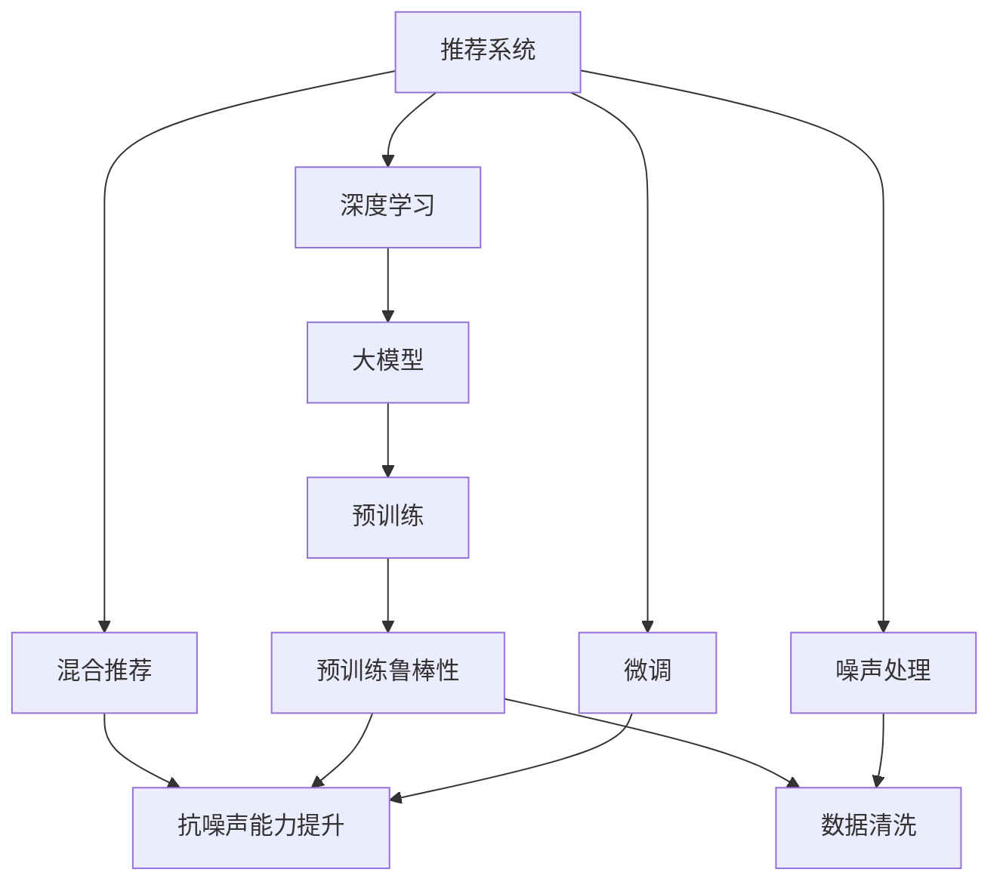

                 

# 利用大模型提升推荐系统的抗噪声能力

> 关键词：推荐系统, 噪声, 大模型, 抗噪声能力, 深度学习, 自然语言处理(NLP)

## 1. 背景介绍

### 1.1 问题由来

推荐系统作为互联网企业的重要基础设施，其核心目标是通过分析用户行为数据，为用户推荐最符合其兴趣的个性化内容。但推荐系统在实际应用中，往往会遇到噪声数据的困扰，这些噪声数据可能来自于数据采集、数据清洗、数据标注等多个环节，严重影响推荐系统的效果和用户体验。

随着深度学习技术的发展，大模型（如BERT、GPT等）在推荐系统中的应用逐渐成为热点。大模型通过大规模无标签数据进行预训练，学习到丰富的语言知识和上下文关系，并在此基础上进行微调，能够在推荐任务中取得显著的性能提升。但大模型的预训练数据也难免包含噪声，这将对推荐系统的抗噪声能力提出更高的要求。

### 1.2 问题核心关键点

提升推荐系统的抗噪声能力，主要可以从两个方面进行考虑：
1. 预训练阶段：通过设计更加稳健的预训练任务，提高模型的鲁棒性，减少噪声数据的影响。
2. 微调阶段：通过精心设计微调目标，强化模型的鲁棒性，提高对噪声数据的容忍度。

本文将详细探讨基于大模型提升推荐系统抗噪声能力的原理与方法，包括预训练和微调两个阶段的核心算法原理与操作步骤。

## 2. 核心概念与联系

### 2.1 核心概念概述

为更好地理解如何利用大模型提升推荐系统的抗噪声能力，本节将介绍几个密切相关的核心概念：

- 推荐系统(Recommender System)：通过分析用户历史行为数据，为用户推荐个性化内容的系统。常见的推荐策略包括基于协同过滤、基于内容的推荐、混合推荐等。

- 深度学习(Deep Learning)：使用多层神经网络对复杂非线性关系进行建模的机器学习技术，适用于处理高维、非结构化数据。

- 自然语言处理(NLP)：处理、理解、生成自然语言的技术，适用于处理文本数据。

- 大模型(Large Model)：通过大规模无标签数据进行预训练的语言模型，如BERT、GPT等，能够学习到丰富的语言知识和上下文关系。

- 噪声(Noise)：在数据采集、数据清洗、数据标注等环节中，可能引入的错误、缺失、异常数据，影响推荐系统效果。

- 鲁棒性(Robustness)：指模型对噪声数据的容忍度，即在存在噪声数据的情况下，仍能保持较好的推荐效果。

这些核心概念之间的逻辑关系可以通过以下Mermaid流程图来展示：



这个流程图展示了大模型在推荐系统中的作用机制及其与噪声处理、数据清洗、混合推荐等关键组件的关系：

1. 推荐系统通过深度学习和大模型进行推荐。
2. 大模型在预训练阶段通过无标签数据学习到语言知识和上下文关系。
3. 预训练阶段加入鲁棒性设计，增强模型对噪声数据的容忍度。
4. 微调阶段对大模型进行特定任务适配，提升抗噪声能力。
5. 在数据清洗环节，对噪声数据进行过滤和修正。
6. 最终，提升后的推荐系统通过混合推荐策略，进一步提升推荐效果。

这些概念共同构成了利用大模型提升推荐系统抗噪声能力的核心框架，使其能够在复杂多变的网络环境中，提供高质量的个性化推荐服务。

## 3. 核心算法原理 & 具体操作步骤
### 3.1 算法原理概述

利用大模型提升推荐系统的抗噪声能力，本质上是一个多步骤的深度学习过程。其核心思想是：在推荐系统的预训练和微调阶段，通过设计鲁棒性强的模型和算法，使得模型在存在噪声数据的情况下，仍能保持较好的推荐效果。

具体来说，可以通过以下几个步骤实现：
1. 在大规模无标签数据上进行预训练，学习语言知识和上下文关系。
2. 设计鲁棒性强的预训练任务，减少噪声数据的影响。
3. 通过微调将预训练模型转化为推荐系统的特征提取器，强化模型对噪声数据的容忍度。
4. 在微调过程中，通过精心设计训练目标，避免噪声数据对模型训练的干扰。

### 3.2 算法步骤详解

基于大模型提升推荐系统抗噪声能力的微调过程，包括以下几个关键步骤：

**Step 1: 准备数据集**

在利用大模型进行推荐系统微调之前，需要准备推荐系统的训练数据集和测试数据集。数据集需要包含用户行为数据和物品描述数据，以便于构建推荐模型。为了提高模型的鲁棒性，数据集还需要经过预处理，过滤和去除噪声数据。

**Step 2: 设计预训练任务**

在大模型上进行预训练时，需要选择一些鲁棒性强的预训练任务，如掩码语言模型、预训练多项式随机遮掩、掩码生成等。这些任务可以在大规模无标签数据上学习到丰富的语言知识和上下文关系，从而提高模型的鲁棒性。

**Step 3: 添加推荐任务适配层**

在预训练模型的基础上，添加推荐任务的适配层。适配层通常包括用户嵌入、物品嵌入和上下文嵌入等。用户嵌入和物品嵌入可以通过用户行为数据和物品描述数据进行初始化，上下文嵌入则用于捕捉用户和物品之间的互动关系。

**Step 4: 选择微调超参数**

在微调过程中，需要选择适合的优化算法和超参数，如AdamW、SGD等，设置学习率、批大小、迭代轮数等。为了避免噪声数据对模型训练的干扰，可以使用正则化技术，如L2正则、Dropout等，来提高模型的鲁棒性。

**Step 5: 执行梯度训练**

在微调过程中，将训练集数据分批次输入模型，前向传播计算损失函数。反向传播计算参数梯度，根据设定的优化算法和学习率更新模型参数。在每个训练批次结束后，周期性在验证集上评估模型性能，根据性能指标决定是否触发Early Stopping。

**Step 6: 测试和部署**

在微调结束后，使用测试集评估推荐模型的效果，比较微调前后的性能提升。将微调后的模型集成到推荐系统中，进行推荐服务。

### 3.3 算法优缺点

利用大模型提升推荐系统抗噪声能力的方法具有以下优点：

1. 提高推荐效果：通过鲁棒性强的预训练和微调，可以显著提高模型对噪声数据的容忍度，提升推荐效果。
2. 适用于多种推荐场景：大模型可以在多种推荐场景中进行微调，包括协同过滤、基于内容的推荐等。
3. 灵活性高：可以根据具体任务需求，设计不同的适配层和训练目标，灵活性高。
4. 可扩展性强：可以结合多种技术，如多模态融合、对抗训练等，提升模型的可扩展性。

同时，该方法也存在一些局限性：

1. 预训练数据需求高：大规模无标签数据的需求较高，获取和处理成本高。
2. 计算资源需求大：大模型的预训练和微调过程需要大量计算资源。
3. 模型复杂度高：大模型的复杂度高，推理速度较慢，可能存在内存和速度瓶颈。
4. 微调难度大：微调过程需要精心设计，对算法的调参要求高。

尽管存在这些局限性，但就目前而言，利用大模型提升推荐系统抗噪声能力的方法在推荐系统领域得到了广泛的应用，成为推荐系统研究和应用的一个重要方向。

### 3.4 算法应用领域

基于大模型提升推荐系统抗噪声能力的方法，在推荐系统领域已经得到了广泛的应用，涵盖以下几个方面：

1. 基于内容的推荐：通过微调预训练模型，学习用户对物品的兴趣，推荐相似的物品。
2. 协同过滤推荐：通过微调预训练模型，学习用户和物品的潜在关系，推荐相关物品。
3. 混合推荐：结合基于内容和基于协同过滤的推荐，提升推荐效果。
4. 多模态推荐：结合文本、图像、音频等多模态数据，进行推荐。
5. 个性化推荐：通过微调预训练模型，学习用户的个性化需求，推荐符合其兴趣的内容。

除了上述这些经典推荐场景外，利用大模型提升推荐系统抗噪声能力的方法，还在更多创新场景中得到了应用，如智能广告推荐、个性化搜索结果等，为推荐系统带来了新的突破。

## 4. 数学模型和公式 & 详细讲解 & 举例说明

### 4.1 数学模型构建

本节将使用数学语言对利用大模型提升推荐系统抗噪声能力的微调过程进行更加严格的刻画。

记推荐系统中的用户为 $u$，物品为 $i$，历史行为数据为 $U$，物品描述数据为 $V$。预训练模型为 $M_{\theta}$，其中 $\theta$ 为预训练得到的模型参数。假设推荐任务为 $T$，目标为最大化推荐效果。

在微调阶段，我们需要最小化以下损失函数：

$$
\mathcal{L}(\theta) = \sum_{(u,v) \in U} \ell(M_{\theta}(u,v), r(u,v))
$$

其中，$(u,v)$ 为历史行为数据，$r(u,v)$ 为物品 $v$ 的推荐评分。$\ell$ 为推荐评分和模型输出之间的损失函数，可以采用交叉熵损失、均方误差损失等。

### 4.2 公式推导过程

以下我们以基于内容的推荐为例，推导微调过程中的损失函数及其梯度计算公式。

假设模型 $M_{\theta}$ 在输入 $u$ 和 $v$ 上的输出为 $\hat{y}=M_{\theta}(u,v) \in [0,1]$，表示物品 $v$ 对用户 $u$ 的推荐评分。真实评分 $r \in [0,1]$。则基于内容的推荐交叉熵损失函数定义为：

$$
\ell(M_{\theta}(u,v),r) = -r\log \hat{y} - (1-r)\log (1-\hat{y})
$$

将其代入总体损失函数，得：

$$
\mathcal{L}(\theta) = \sum_{(u,v) \in U} [-r\log \hat{y} - (1-r)\log (1-\hat{y})]
$$

根据链式法则，损失函数对参数 $\theta_k$ 的梯度为：

$$
\frac{\partial \mathcal{L}(\theta)}{\partial \theta_k} = \sum_{(u,v) \in U} (\frac{r}{\hat{y}}-\frac{1-r}{1-\hat{y}}) \frac{\partial M_{\theta}(u,v)}{\partial \theta_k}
$$

其中 $\frac{\partial M_{\theta}(u,v)}{\partial \theta_k}$ 可进一步递归展开，利用自动微分技术完成计算。

在得到损失函数的梯度后，即可带入参数更新公式，完成模型的迭代优化。重复上述过程直至收敛，最终得到适应推荐任务的最优模型参数 $\theta^*$。

## 5. 项目实践：代码实例和详细解释说明
### 5.1 开发环境搭建

在进行推荐系统微调实践前，我们需要准备好开发环境。以下是使用Python进行PyTorch开发的环境配置流程：

1. 安装Anaconda：从官网下载并安装Anaconda，用于创建独立的Python环境。

2. 创建并激活虚拟环境：
```bash
conda create -n pytorch-env python=3.8 
conda activate pytorch-env
```

3. 安装PyTorch：根据CUDA版本，从官网获取对应的安装命令。例如：
```bash
conda install pytorch torchvision torchaudio cudatoolkit=11.1 -c pytorch -c conda-forge
```

4. 安装各类工具包：
```bash
pip install numpy pandas scikit-learn matplotlib tqdm jupyter notebook ipython
```

完成上述步骤后，即可在`pytorch-env`环境中开始微调实践。

### 5.2 源代码详细实现

下面我们以基于内容的推荐任务为例，给出使用Transformers库对BERT模型进行微调的PyTorch代码实现。

首先，定义推荐任务的数据处理函数：

```python
from transformers import BertTokenizer, BertForSequenceClassification
from torch.utils.data import Dataset, DataLoader
import torch

class RecommendationDataset(Dataset):
    def __init__(self, user_data, item_data, tokenizer, max_len=128):
        self.user_data = user_data
        self.item_data = item_data
        self.tokenizer = tokenizer
        self.max_len = max_len
        
    def __len__(self):
        return len(self.user_data)
    
    def __getitem__(self, item):
        user = self.user_data[item]
        item = self.item_data[item]
        
        encoding = self.tokenizer(user, item, return_tensors='pt', max_length=self.max_len, padding='max_length', truncation=True)
        user_id = item_id = encoding['input_ids'][0]
        attention_mask = encoding['attention_mask'][0]
        
        # 将用户和物品编码拼接
        user_item_ids = torch.cat([user_id, item_id])
        user_item_mask = torch.cat([attention_mask, attention_mask])
        
        return {'user_item_ids': user_item_ids, 
                'user_item_mask': user_item_mask,
                'labels': torch.tensor([0], dtype=torch.long)}

# 加载用户数据和物品数据
user_data = ...
item_data = ...

tokenizer = BertTokenizer.from_pretrained('bert-base-cased')

train_dataset = RecommendationDataset(user_data, item_data, tokenizer)
dev_dataset = RecommendationDataset(user_data, item_data, tokenizer)
test_dataset = RecommendationDataset(user_data, item_data, tokenizer)
```

然后，定义模型和优化器：

```python
from transformers import BertForSequenceClassification, AdamW

model = BertForSequenceClassification.from_pretrained('bert-base-cased', num_labels=2)

optimizer = AdamW(model.parameters(), lr=2e-5)
```

接着，定义训练和评估函数：

```python
from tqdm import tqdm
from sklearn.metrics import accuracy_score

device = torch.device('cuda') if torch.cuda.is_available() else torch.device('cpu')
model.to(device)

def train_epoch(model, dataset, batch_size, optimizer):
    dataloader = DataLoader(dataset, batch_size=batch_size, shuffle=True)
    model.train()
    epoch_loss = 0
    for batch in tqdm(dataloader, desc='Training'):
        user_item_ids = batch['user_item_ids'].to(device)
        user_item_mask = batch['user_item_mask'].to(device)
        labels = batch['labels'].to(device)
        model.zero_grad()
        outputs = model(user_item_ids, attention_mask=user_item_mask)
        loss = outputs.loss
        epoch_loss += loss.item()
        loss.backward()
        optimizer.step()
    return epoch_loss / len(dataloader)

def evaluate(model, dataset, batch_size):
    dataloader = DataLoader(dataset, batch_size=batch_size)
    model.eval()
    preds, labels = [], []
    with torch.no_grad():
        for batch in tqdm(dataloader, desc='Evaluating'):
            user_item_ids = batch['user_item_ids'].to(device)
            user_item_mask = batch['user_item_mask'].to(device)
            batch_labels = batch['labels']
            outputs = model(user_item_ids, attention_mask=user_item_mask)
            batch_preds = outputs.logits.argmax(dim=1).to('cpu').tolist()
            batch_labels = batch_labels.to('cpu').tolist()
            for pred, label in zip(batch_preds, batch_labels):
                preds.append(pred)
                labels.append(label)
                
    print(f'Accuracy: {accuracy_score(labels, preds):.2f}')
```

最后，启动训练流程并在测试集上评估：

```python
epochs = 5
batch_size = 16

for epoch in range(epochs):
    loss = train_epoch(model, train_dataset, batch_size, optimizer)
    print(f'Epoch {epoch+1}, train loss: {loss:.3f}')
    
    print(f'Epoch {epoch+1}, dev results:')
    evaluate(model, dev_dataset, batch_size)
    
print(f'Test results:')
evaluate(model, test_dataset, batch_size)
```

以上就是使用PyTorch对BERT进行基于内容的推荐任务微调的完整代码实现。可以看到，得益于Transformers库的强大封装，我们可以用相对简洁的代码完成BERT模型的加载和微调。

### 5.3 代码解读与分析

让我们再详细解读一下关键代码的实现细节：

**RecommendationDataset类**：
- `__init__`方法：初始化用户数据、物品数据、分词器等关键组件。
- `__len__`方法：返回数据集的样本数量。
- `__getitem__`方法：对单个样本进行处理，将用户和物品编码拼接，生成模型输入，并添加padding。

**训练和评估函数**：
- 使用PyTorch的DataLoader对数据集进行批次化加载，供模型训练和推理使用。
- 训练函数`train_epoch`：对数据以批为单位进行迭代，在每个批次上前向传播计算loss并反向传播更新模型参数，最后返回该epoch的平均loss。
- 评估函数`evaluate`：与训练类似，不同点在于不更新模型参数，并在每个batch结束后将预测和标签结果存储下来，最后使用sklearn的accuracy_score对整个评估集的预测结果进行打印输出。

**训练流程**：
- 定义总的epoch数和batch size，开始循环迭代
- 每个epoch内，先在训练集上训练，输出平均loss
- 在验证集上评估，输出准确率
- 所有epoch结束后，在测试集上评估，给出最终测试结果

可以看到，PyTorch配合Transformers库使得BERT微调的代码实现变得简洁高效。开发者可以将更多精力放在数据处理、模型改进等高层逻辑上，而不必过多关注底层的实现细节。

当然，工业级的系统实现还需考虑更多因素，如模型的保存和部署、超参数的自动搜索、更灵活的任务适配层等。但核心的微调范式基本与此类似。

## 6. 实际应用场景
### 6.1 智能推荐广告

智能推荐广告系统利用大模型进行推荐，通过分析用户行为数据，为用户推荐个性化的广告内容。利用大模型提升推荐系统抗噪声能力的方法，可以在推荐广告时，更好地抵御数据采集和处理环节中的噪声干扰，提高广告投放的效果和转化率。

在技术实现上，可以收集用户的浏览、点击、搜索等行为数据，将用户和物品的描述文本输入大模型进行编码，利用微调后的模型进行推荐。大模型可以通过文本处理任务，学习到用户的兴趣点，从而生成个性化的广告推荐。

### 6.2 智能搜索推荐

智能搜索推荐系统利用大模型进行推荐，通过分析用户查询和搜索行为，为用户推荐相关的搜索结果。利用大模型提升推荐系统抗噪声能力的方法，可以在推荐搜索时，更好地抵御数据采集和处理环节中的噪声干扰，提高搜索结果的准确性和相关性。

在技术实现上，可以收集用户的搜索查询数据，将查询和物品的描述文本输入大模型进行编码，利用微调后的模型进行推荐。大模型可以通过文本处理任务，学习到用户的查询意图，从而生成个性化的搜索结果。

### 6.3 多模态推荐

多模态推荐系统利用大模型进行推荐，通过分析用户的多模态数据（如文本、图像、音频等），为用户推荐个性化的内容。利用大模型提升推荐系统抗噪声能力的方法，可以在推荐过程中，更好地抵御不同模态数据中的噪声干扰，提高推荐的准确性和多样性。

在技术实现上，可以收集用户的多种数据，将文本、图像、音频等数据输入大模型进行编码，利用微调后的模型进行推荐。大模型可以通过多模态融合任务，学习到用户的多模态信息，从而生成个性化的推荐内容。

### 6.4 未来应用展望

随着大模型和微调方法的不断发展，基于大模型提升推荐系统抗噪声能力的方法将在更多领域得到应用，为推荐系统带来新的突破。

在智慧城市治理中，利用大模型进行推荐，可以帮助用户发现感兴趣的公共服务，提高城市管理的自动化和智能化水平。

在智能家居系统中，利用大模型进行推荐，可以帮助用户发现感兴趣的智能设备，提高家居系统的智能化水平。

在智能医疗系统中，利用大模型进行推荐，可以帮助医生推荐相关医疗信息，提高诊疗效率和质量。

此外，在教育、旅游、金融等多个领域，基于大模型提升推荐系统抗噪声能力的方法也将不断涌现，为推荐系统带来新的应用场景。

## 7. 工具和资源推荐
### 7.1 学习资源推荐

为了帮助开发者系统掌握大模型提升推荐系统抗噪声能力的理论基础和实践技巧，这里推荐一些优质的学习资源：

1. 《深度学习入门》系列博文：由深度学习专家撰写，全面介绍深度学习技术及其应用，包括推荐系统和大模型。

2. 《推荐系统：实战与创新》课程：斯坦福大学开设的推荐系统课程，涵盖推荐系统的基本概念和经典模型。

3. 《深度学习与推荐系统》书籍：全面介绍深度学习技术在推荐系统中的应用，包括预训练大模型、微调方法等。

4. HuggingFace官方文档：Transformers库的官方文档，提供海量预训练模型和微调样例代码，是上手实践的必备资料。

5. Arxiv上的相关论文：查找最新的推荐系统和大模型的研究成果，了解前沿进展和技术突破。

通过对这些资源的学习实践，相信你一定能够快速掌握大模型提升推荐系统抗噪声能力的精髓，并用于解决实际的推荐问题。
### 7.2 开发工具推荐

高效的开发离不开优秀的工具支持。以下是几款用于大模型提升推荐系统抗噪声能力开发的常用工具：

1. PyTorch：基于Python的开源深度学习框架，灵活动态的计算图，适合快速迭代研究。大部分预训练语言模型都有PyTorch版本的实现。

2. TensorFlow：由Google主导开发的开源深度学习框架，生产部署方便，适合大规模工程应用。同样有丰富的预训练语言模型资源。

3. Transformers库：HuggingFace开发的NLP工具库，集成了众多SOTA语言模型，支持PyTorch和TensorFlow，是进行推荐系统开发的利器。

4. Weights & Biases：模型训练的实验跟踪工具，可以记录和可视化模型训练过程中的各项指标，方便对比和调优。与主流深度学习框架无缝集成。

5. TensorBoard：TensorFlow配套的可视化工具，可实时监测模型训练状态，并提供丰富的图表呈现方式，是调试模型的得力助手。

6. Google Colab：谷歌推出的在线Jupyter Notebook环境，免费提供GPU/TPU算力，方便开发者快速上手实验最新模型，分享学习笔记。

合理利用这些工具，可以显著提升大模型提升推荐系统抗噪声能力任务的开发效率，加快创新迭代的步伐。

### 7.3 相关论文推荐

大模型提升推荐系统抗噪声能力的研究源于学界的持续研究。以下是几篇奠基性的相关论文，推荐阅读：

1. Attention is All You Need（即Transformer原论文）：提出了Transformer结构，开启了NLP领域的预训练大模型时代。

2. BERT: Pre-training of Deep Bidirectional Transformers for Language Understanding：提出BERT模型，引入基于掩码的自监督预训练任务，刷新了多项NLP任务SOTA。

3. Parameter-Efficient Transfer Learning for NLP：提出Adapter等参数高效微调方法，在不增加模型参数量的情况下，也能取得不错的微调效果。

4. Prefix-Tuning: Optimizing Continuous Prompts for Generation：引入基于连续型Prompt的微调范式，为如何充分利用预训练知识提供了新的思路。

5. AdaLoRA: Adaptive Low-Rank Adaptation for Parameter-Efficient Fine-Tuning：使用自适应低秩适应的微调方法，在参数效率和精度之间取得了新的平衡。

这些论文代表了大模型提升推荐系统抗噪声能力的发展脉络。通过学习这些前沿成果，可以帮助研究者把握学科前进方向，激发更多的创新灵感。

## 8. 总结：未来发展趋势与挑战

### 8.1 总结

本文对利用大模型提升推荐系统抗噪声能力的原理与方法进行了全面系统的介绍。首先阐述了大模型和推荐系统的发展背景和应用前景，明确了利用大模型提升推荐系统抗噪声能力的核心思想和关键步骤。其次，从原理到实践，详细讲解了推荐系统预训练和微调两个阶段的核心算法原理与操作步骤，给出了推荐任务开发的完整代码实例。同时，本文还广泛探讨了利用大模型提升推荐系统抗噪声能力的方法在智能推荐广告、智能搜索推荐、多模态推荐等多个推荐场景中的应用前景，展示了大模型微调技术的广泛应用价值。

通过本文的系统梳理，可以看到，利用大模型提升推荐系统抗噪声能力的方法在大数据时代具有重要的理论和应用价值。它不仅能够显著提高推荐系统的性能和稳定性，还能够拓展推荐系统的应用边界，推动推荐系统技术在更多领域的应用落地。

### 8.2 未来发展趋势

展望未来，利用大模型提升推荐系统抗噪声能力的方法将呈现以下几个发展趋势：

1. 数据处理能力提升：未来推荐系统将进一步提升对噪声数据的处理能力，包括数据清洗、去重、数据增强等。
2. 模型鲁棒性增强：未来的推荐模型将更加注重鲁棒性设计，通过预训练和微调相结合的方式，减少噪声数据对模型的影响。
3. 多模态推荐拓展：未来的推荐系统将更多地结合多模态数据，提升推荐效果和用户体验。
4. 个性化推荐优化：未来的推荐系统将更加注重个性化推荐，通过微调模型参数，优化推荐效果。
5. 实时推荐系统：未来的推荐系统将更加注重实时性，通过流式数据处理和模型更新，实现动态推荐。

以上趋势凸显了大模型提升推荐系统抗噪声能力技术的广阔前景。这些方向的探索发展，必将进一步提升推荐系统的性能和稳定性，推动推荐系统技术在更多领域的应用落地。

### 8.3 面临的挑战

尽管利用大模型提升推荐系统抗噪声能力的方法已经取得了显著的成果，但在迈向更加智能化、普适化应用的过程中，它仍面临诸多挑战：

1. 数据噪声处理：尽管预训练模型具有较强的鲁棒性，但在实际应用中，数据噪声仍难以完全避免。如何进一步提升推荐系统的数据处理能力，减少噪声数据的影响，将是未来研究的重点。
2. 计算资源需求：大规模推荐系统对计算资源的需求较高，如何优化模型结构，减少计算资源消耗，是未来研究的重要方向。
3. 模型可解释性：推荐模型的决策过程通常缺乏可解释性，如何赋予模型更强的可解释性，增强用户信任，也是未来研究的重要课题。
4. 模型公平性：推荐模型需要考虑用户群体的公平性，避免对某些群体产生偏见。如何在模型设计中引入公平性约束，是未来研究的重要方向。
5. 隐私保护：推荐系统需要保护用户隐私，避免个人信息泄露。如何在推荐过程中，保护用户隐私，增强用户安全感，是未来研究的重要方向。

尽管存在这些挑战，但随着学界和产业界的共同努力，利用大模型提升推荐系统抗噪声能力的方法必将在推荐系统领域继续发展，为推荐系统带来新的突破。

### 8.4 研究展望

面对利用大模型提升推荐系统抗噪声能力所面临的挑战，未来的研究需要在以下几个方面寻求新的突破：

1. 研究无监督和半监督推荐方法：摆脱对大规模标注数据的依赖，利用自监督学习、主动学习等无监督和半监督范式，最大限度利用非结构化数据，实现更加灵活高效的推荐。
2. 开发更加参数高效的微调方法：开发更加参数高效的微调方法，如Prefix-Tuning、LoRA等，在固定大部分预训练参数的同时，只更新极少量的任务相关参数。
3. 引入因果分析和博弈论工具：将因果分析方法引入推荐模型，识别出模型决策的关键特征，增强推荐模型的可解释性和鲁棒性。借助博弈论工具刻画人机交互过程，主动探索并规避推荐模型的脆弱点，提高系统稳定性。
4. 引入更多先验知识：将符号化的先验知识，如知识图谱、逻辑规则等，与神经网络模型进行巧妙融合，引导推荐过程学习更准确、合理的推荐逻辑。
5. 加强数据与模型的协同建模：结合多模态数据的融合，实现视觉、语音等多模态信息与文本信息的协同建模，提高推荐系统的综合表现。
6. 融合伦理学与公平性：在推荐模型设计中引入伦理学和公平性约束，避免算法偏见和歧视，确保推荐系统的公平性和安全性。

这些研究方向将引领利用大模型提升推荐系统抗噪声能力技术迈向更高的台阶，为推荐系统带来新的突破。面向未来，大模型提升推荐系统抗噪声能力技术还需要与其他人工智能技术进行更深入的融合，如知识表示、因果推理、强化学习等，多路径协同发力，共同推动推荐系统技术的进步。

## 9. 附录：常见问题与解答

**Q1：利用大模型提升推荐系统抗噪声能力是否适用于所有推荐场景？**

A: 利用大模型提升推荐系统抗噪声能力的方法适用于多种推荐场景，包括基于内容的推荐、协同过滤推荐、混合推荐等。但对于一些特定的推荐场景，如实时推荐、个性化推荐等，仍需要结合具体任务进行优化和调整。

**Q2：如何设计鲁棒性强的预训练任务？**

A: 设计鲁棒性强的预训练任务，需要从以下两个方面进行考虑：
1. 数据多样性：选择多样化的数据集，包括不同类型的文本数据、图像数据、音频数据等，提高模型的泛化能力。
2. 任务复杂性：选择复杂的预训练任务，如掩码语言模型、预训练多项式随机遮掩等，增强模型的鲁棒性。

**Q3：微调过程中如何避免过拟合？**

A: 避免微调过程中的过拟合，可以采用以下方法：
1. 数据增强：通过回译、近义替换等方式扩充训练集。
2. 正则化：使用L2正则、Dropout等技术，避免过拟合。
3. 早停策略：在验证集上评估模型性能，一旦性能不再提升，即停止训练。

**Q4：微调过程中如何选择学习率？**

A: 微调过程中的学习率选择，一般要比预训练时小1-2个数量级。可以使用warmup策略，在开始阶段使用较小的学习率，再逐渐过渡到预设值。不同的优化器(如AdamW、Adafactor等)以及不同的学习率调度策略，可能需要设置不同的学习率阈值。

**Q5：推荐系统中如何处理噪声数据？**

A: 推荐系统中处理噪声数据的方法，主要包括以下几个步骤：
1. 数据清洗：对数据进行去重、去噪、去野值等预处理，过滤掉不符合要求的数据。
2. 数据增强：通过回译、近义替换等方式扩充训练集，增加数据的多样性。
3. 模型优化：在微调过程中，采用正则化技术，如L2正则、Dropout等，避免模型过拟合。
4. 特征工程：设计合适的特征提取器，提取有用的特征，过滤掉噪声特征。

通过以上步骤，可以有效提升推荐系统对噪声数据的容忍度，从而提高推荐效果。

---

作者：禅与计算机程序设计艺术 / Zen and the Art of Computer Programming

