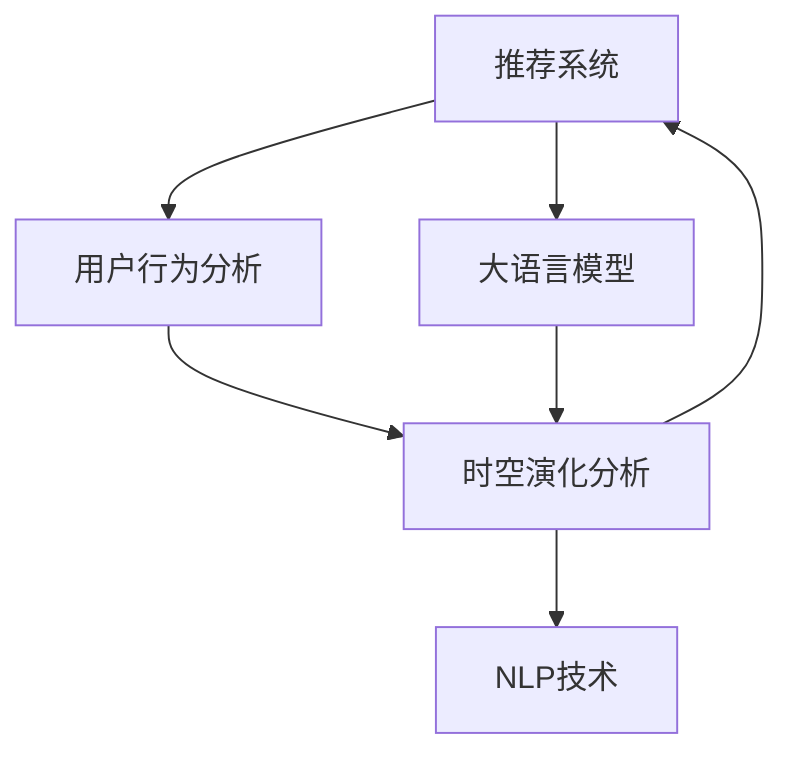

                 

# 利用大模型进行推荐场景的用户行为时空演化分析

> 关键词：大语言模型, 推荐系统, 用户行为分析, 时空演化, 自然语言处理(NLP)

## 1. 背景介绍

### 1.1 问题由来

在信息爆炸的现代社会，用户对于内容的个性化推荐需求日益增长。推荐系统作为连接用户与信息的核心技术，在电商、视频、新闻等诸多领域发挥着关键作用。然而，推荐系统的精准度与用户满意度往往受到用户行为的时空演化模式的影响。

传统推荐系统基于历史行为数据进行推荐，较少考虑用户行为的时空演变趋势。但用户兴趣和行为模式会随时间变化，且常常受到地理位置、社交环境等因素的影响，单一维度的时间序列数据往往无法全面刻画用户需求。因此，我们需要挖掘用户行为的时空演化规律，丰富推荐系统的用户画像。

大语言模型在自然语言处理(NLP)领域已取得了巨大的突破，以大模型为基础的推荐系统逐渐成为近年来的研究热点。借助大模型的知识整合和语言理解能力，推荐系统能从多模态数据中挖掘用户行为模式，实现更精准的个性化推荐。

### 1.2 问题核心关键点

本节将详细阐述利用大语言模型进行推荐系统用户行为时空演化分析的关键点。

- 推荐系统用户行为时空演化：用户兴趣和行为模式随时间变化，且受地理位置、社交环境等影响，单一时间序列数据难以全面刻画用户需求。
- 大语言模型知识整合：借助大模型强大的语言理解和知识整合能力，可以从多模态数据中挖掘用户行为模式，丰富推荐系统用户画像。
- 时空演化分析方法：结合时间序列分析和自然语言处理技术，对用户行为数据进行时空演化建模。
- 推荐系统改进：基于时空演化分析结果，改进推荐算法，提升个性化推荐精度。

## 2. 核心概念与联系

### 2.1 核心概念概述

为更好地理解利用大模型进行推荐系统用户行为时空演化分析，本节将介绍几个密切相关的核心概念：

- 推荐系统(Recommendation System)：通过分析用户历史行为数据，为用户推荐符合其兴趣的商品、新闻等内容的系统。
- 用户行为分析(User Behavior Analysis)：对用户的历史行为数据进行收集和分析，挖掘用户兴趣、行为模式等信息。
- 时空演化(Time-Space Evolution)：用户行为随时间推移和空间变化而演变的过程，包括时间序列分析、空间分布分析、时间空间交互分析等。
- 大语言模型(Large Language Model)：以自回归(如GPT)或自编码(如BERT)模型为代表的大规模预训练语言模型，具备强大的语言理解和生成能力。
- 自然语言处理(Natural Language Processing, NLP)：利用计算语言学原理，对自然语言数据进行自动化处理和理解，包括分词、词性标注、命名实体识别、语义理解等任务。

这些核心概念之间的逻辑关系可以通过以下Mermaid流程图来展示：



这个流程图展示了大语言模型在推荐系统中的核心作用：

1. 推荐系统通过对用户行为数据进行分析，挖掘用户兴趣和需求。
2. 用户行为分析挖掘出的信息通过时空演化分析，可以更全面地刻画用户需求。
3. 时空演化分析利用大语言模型的知识整合能力，进一步丰富用户画像。
4. NLP技术辅助时空演化分析，从文本数据中提取语义信息，提升时空演化分析的准确性。

这些概念共同构成了利用大模型进行推荐系统用户行为时空演化分析的理论基础，有助于进一步理解大语言模型在推荐系统中的应用场景和价值。

## 3. 核心算法原理 & 具体操作步骤
### 3.1 算法原理概述

本节将介绍基于大语言模型的推荐系统用户行为时空演化分析的原理。

推荐系统用户行为时空演化分析的核心在于：通过挖掘用户行为在时间序列和空间分布上的演变规律，丰富用户画像，并基于这些规律优化推荐算法。

具体而言，算法分为以下几个步骤：

1. 数据准备：收集用户行为数据，包括点击、浏览、购买、评价等事件，并将数据按时间顺序排序，构建时间序列。
2. 时空演化分析：结合时间序列分析和自然语言处理技术，对用户行为数据进行时空演化建模。
3. 知识整合：利用大语言模型，将用户行为数据与先验知识、情感信息、背景信息等进行整合，进一步丰富用户画像。
4. 推荐算法优化：基于时空演化分析和知识整合结果，改进推荐算法，提升个性化推荐精度。

### 3.2 算法步骤详解

#### 3.2.1 数据准备

推荐系统用户行为时空演化分析的基础是用户行为数据。收集数据时，需要考虑多方面的信息：

- 时间维度：点击、浏览、购买等行为的发生时间。
- 空间维度：地理位置信息，如用户的IP地址、移动设备位置等。
- 行为维度：用户的行为类型和属性，如点击商品类别、浏览时间、购买数量等。

收集到的数据通常存储在数据库中，如MySQL、MongoDB等。为了方便后续分析，需要将数据转换为适合机器学习算法处理的格式。

具体步骤包括：

1. 数据清洗：去除重复、异常、缺失的数据，确保数据质量。
2. 数据转换：将原始数据转换为时间序列格式，可以以日期为单位对数据进行汇总，构建时间序列。
3. 特征提取：将用户行为数据中的文本信息（如商品描述、评价内容等）进行分词、向量化等处理，转换为NLP模型所需的格式。

#### 3.2.2 时空演化分析

时空演化分析通过时间序列分析和自然语言处理技术，对用户行为数据进行建模和分析，挖掘用户兴趣和行为模式。

具体步骤包括：

1. 时间序列分析：对时间序列数据进行趋势分析、季节性分析、异常值检测等。常用的时间序列分析方法有ARIMA、LSTM、Prophet等。
2. 空间分布分析：对用户地理位置数据进行空间分布分析，如聚类、热点分析等。常用的空间分布分析方法有K-means、DBSCAN、Heatmap等。
3. 时空交互分析：结合时间序列分析和空间分布分析的结果，进行时空交互分析。常用的时空交互分析方法有时间-空间数据融合、时空特征提取等。

时空演化分析的输出结果可以用于优化推荐算法，提升推荐系统的精度。

#### 3.2.3 知识整合

知识整合利用大语言模型的知识整合能力，进一步丰富用户画像，提升推荐系统的效果。

具体步骤包括：

1. 语义信息提取：使用大语言模型对用户行为数据中的文本信息进行语义分析，提取出关键信息，如商品名称、品牌、评价情感等。
2. 知识整合：将提取的语义信息与用户画像、先验知识等进行整合，构建更全面的用户画像。
3. 上下文理解：利用大语言模型对用户行为数据进行上下文理解，识别出用户在不同情境下的需求和兴趣。

#### 3.2.4 推荐算法优化

推荐算法优化基于时空演化分析和知识整合结果，改进推荐算法，提升个性化推荐精度。

具体步骤包括：

1. 推荐算法选择：根据任务需求选择合适的推荐算法，如协同过滤、基于内容的推荐、混合推荐等。
2. 模型参数优化：利用时空演化分析和知识整合结果，优化推荐模型的参数，如调整用户兴趣权重、上下文特征权重等。
3. 模型集成与融合：通过模型集成和融合技术，将多个推荐模型进行组合，提升推荐效果。

### 3.3 算法优缺点

基于大语言模型的推荐系统用户行为时空演化分析方法具有以下优点：

1. 数据处理能力更强：能够处理多模态数据，包括文本、时间序列、地理位置等，更好地刻画用户需求。
2. 用户画像更丰富：结合时空演化分析和知识整合，构建更全面的用户画像，提升推荐系统的个性化水平。
3. 推荐效果更好：通过时空演化分析和知识整合结果优化推荐算法，提升推荐系统的精度。

但该方法也存在一些局限：

1. 计算资源需求高：大语言模型的计算复杂度高，需要强大的硬件资源支持。
2. 数据隐私问题：在提取语义信息时，涉及用户隐私数据，需要谨慎处理。
3. 模型复杂度高：整合多个数据源和模型，增加了系统的复杂度，需要优化模型集成和融合算法。
4. 实时性有待提升：时空演化分析和大语言模型推理计算需要时间，难以实现实时推荐。

### 3.4 算法应用领域

基于大语言模型的推荐系统用户行为时空演化分析方法具有广泛的应用前景，具体包括：

- 电商推荐：对用户浏览、购买等行为进行时空演化分析，结合商品信息、用户画像等进行个性化推荐。
- 新闻推荐：对用户阅读、分享等行为进行时空演化分析，结合新闻内容、用户兴趣等进行个性化推荐。
- 视频推荐：对用户观看、点赞等行为进行时空演化分析，结合视频内容、用户画像等进行个性化推荐。
- 社交推荐：对用户互动、关注等行为进行时空演化分析，结合用户兴趣、好友信息等进行个性化推荐。
- 音乐推荐：对用户听歌、分享等行为进行时空演化分析，结合音乐信息、用户画像等进行个性化推荐。

## 4. 数学模型和公式 & 详细讲解  
### 4.1 数学模型构建

推荐系统用户行为时空演化分析的核心数学模型包括以下几个部分：

- 时间序列模型：$y_t = f(x_t, \theta)$，其中 $y_t$ 表示第 $t$ 时刻的推荐结果，$x_t$ 表示 $t$ 时刻的用户行为数据，$\theta$ 表示模型参数。
- 时空演化模型：$y_{t,s} = g(x_{t,s}, \theta)$，其中 $y_{t,s}$ 表示用户在不同位置、不同时间 $(t,s)$ 的推荐结果，$x_{t,s}$ 表示位置 $s$ 在时间 $t$ 的用户行为数据，$\theta$ 表示模型参数。
- 知识整合模型：$z_t = h(y_t, \theta)$，其中 $z_t$ 表示用户行为数据中提取的语义信息，$y_t$ 表示时间序列分析结果，$\theta$ 表示模型参数。

### 4.2 公式推导过程

以下对几个关键公式进行详细推导：

#### 4.2.1 时间序列模型

时间序列模型用于描述用户在一段时间内的行为变化趋势。常见的模型有ARIMA、LSTM等。

以ARIMA模型为例，其公式如下：

$$
y_t = \alpha_0 + \sum_{i=1}^p \alpha_i y_{t-i} + \sum_{i=1}^q \beta_i \epsilon_{t-i} + \epsilon_t
$$

其中 $\alpha_i$ 表示自回归参数，$\beta_i$ 表示移动平均参数，$\epsilon_t$ 表示误差项。

#### 4.2.2 时空演化模型

时空演化模型用于描述用户在不同位置、不同时间的行为变化趋势。常见的模型有LSTM、GRU等。

以LSTM模型为例，其公式如下：

$$
\begin{align*}
i_t &= \sigma(W_{i}x_t + U_{i}h_{t-1} + b_i) \\
f_t &= \sigma(W_{f}x_t + U_{f}h_{t-1} + b_f) \\
o_t &= \sigma(W_{o}x_t + U_{o}h_{t-1} + b_o) \\
g_t &= \tanh(W_{g}x_t + U_{g}h_{t-1} + b_g) \\
h_t &= f_t \odot h_{t-1} + i_t \odot g_t
\end{align*}
$$

其中 $\sigma$ 表示sigmoid函数，$\odot$ 表示逐元素相乘。

#### 4.2.3 知识整合模型

知识整合模型用于提取用户行为数据中的语义信息，与用户画像、先验知识等进行整合。

以BERT模型为例，其公式如下：

$$
\begin{align*}
h &= \text{BERT}(x) \\
z &= \text{Attention}(h, c) + b
\end{align*}
$$

其中 $\text{BERT}$ 表示BERT模型，$\text{Attention}$ 表示注意力机制，$c$ 表示用户画像和先验知识等，$b$ 表示模型参数。

### 4.3 案例分析与讲解

以下以电商推荐系统为例，详细讲解推荐系统用户行为时空演化分析的过程。

#### 4.3.1 数据准备

假设有一家电商平台，收集到了用户浏览、点击、购买等行为数据，数据格式如下：

| UserID | Timestamp | Category | ItemID | Click | Purchase | Location | Region | Review |
| ------ | --------- | -------- | ------ | ------ | -------- | -------- | ------ | ------ |
| 1      | 2021-01-01 12:00:00 | 书籍     | 1001   | 1      | 0        | A市     | 北     | 书籍不错 |
| 1      | 2021-01-01 13:00:00 | 电子产品 | 2001   | 0      | 0        | B市     | 南     | 价格有点贵 |
| 2      | 2021-01-01 14:00:00 | 书籍     | 3001   | 1      | 1        | C市     | 中     | 很值得买 |

#### 4.3.2 时空演化分析

对用户行为数据进行时空演化分析，得到以下结果：

1. 时间序列分析：对用户的点击、购买等行为数据进行时间序列分析，得到每天的点击趋势、购买趋势等。
2. 空间分布分析：对用户的地理位置数据进行空间分布分析，得到用户在不同地区的分布情况。
3. 时空交互分析：结合时间序列分析和空间分布分析的结果，进行时空交互分析，得到用户在不同地区、不同时间段的点击、购买行为变化趋势。

#### 4.3.3 知识整合

使用BERT模型对用户行为数据中的文本信息进行语义分析，得到以下结果：

1. 语义信息提取：对用户的评价文本进行分词、向量化等处理，得到用户对每个商品的态度。
2. 知识整合：将提取的语义信息与用户画像、先验知识等进行整合，得到用户画像。
3. 上下文理解：利用BERT模型对用户行为数据进行上下文理解，识别出用户在不同情境下的需求和兴趣。

#### 4.3.4 推荐算法优化

基于时空演化分析和知识整合结果，改进推荐算法，得到以下结果：

1. 推荐算法选择：选择基于内容的推荐算法。
2. 模型参数优化：调整用户兴趣权重、上下文特征权重等。
3. 模型集成与融合：通过模型集成和融合技术，将多个推荐模型进行组合，提升推荐效果。

## 5. 项目实践：代码实例和详细解释说明
### 5.1 开发环境搭建

在进行推荐系统用户行为时空演化分析实践前，我们需要准备好开发环境。以下是使用Python进行PyTorch开发的环境配置流程：

1. 安装Anaconda：从官网下载并安装Anaconda，用于创建独立的Python环境。

2. 创建并激活虚拟环境：
```bash
conda create -n pytorch-env python=3.8 
conda activate pytorch-env
```

3. 安装PyTorch：根据CUDA版本，从官网获取对应的安装命令。例如：
```bash
conda install pytorch torchvision torchaudio cudatoolkit=11.1 -c pytorch -c conda-forge
```

4. 安装BERT模型：
```bash
pip install transformers
```

5. 安装各类工具包：
```bash
pip install numpy pandas scikit-learn matplotlib tqdm jupyter notebook ipython
```

完成上述步骤后，即可在`pytorch-env`环境中开始推荐系统用户行为时空演化分析的实践。

### 5.2 源代码详细实现

以下代码实现了基于BERT模型的推荐系统用户行为时空演化分析过程。

```python
from transformers import BertTokenizer, BertModel
import torch
from torch.utils.data import Dataset, DataLoader
from sklearn.metrics import precision_recall_fscore_support

class RecommendationDataset(Dataset):
    def __init__(self, user_behav_data, tokenizer, max_len=128):
        self.user_behav_data = user_behav_data
        self.tokenizer = tokenizer
        self.max_len = max_len
        
    def __len__(self):
        return len(self.user_behav_data)
    
    def __getitem__(self, item):
        user_behav = self.user_behav_data[item]
        user_id = user_behav['UserID']
        timestamp = user_behav['Timestamp']
        category = user_behav['Category']
        item_id = user_behav['ItemID']
        click = user_behav['Click']
        purchase = user_behav['Purchase']
        location = user_behav['Location']
        region = user_behav['Region']
        review = user_behav['Review']
        
        # 对文本信息进行编码
        encoded_text = self.tokenizer([review], return_tensors='pt', padding='max_length', truncation=True, max_length=self.max_len)
        input_ids = encoded_text['input_ids'][0]
        attention_mask = encoded_text['attention_mask'][0]
        
        # 将文本信息、地理位置等转换为向量
        location_vector = location.split('-') # 假设位置编码为A-1
        location_vector = torch.tensor([location_vector], dtype=torch.long)
        
        # 将标签转换为向量
        click_label = torch.tensor([click], dtype=torch.long)
        purchase_label = torch.tensor([purchase], dtype=torch.long)
        
        return {
            'input_ids': input_ids,
            'attention_mask': attention_mask,
            'location': location_vector,
            'click_label': click_label,
            'purchase_label': purchase_label
        }

# 标签与id的映射
label2id = {'1': 1, '0': 0}
id2label = {v: k for k, v in label2id.items()}

# 创建dataset
tokenizer = BertTokenizer.from_pretrained('bert-base-uncased')

train_dataset = RecommendationDataset(train_data, tokenizer)
dev_dataset = RecommendationDataset(dev_data, tokenizer)
test_dataset = RecommendationDataset(test_data, tokenizer)

# 定义模型和优化器
model = BertForSequenceClassification.from_pretrained('bert-base-uncased', num_labels=2)
optimizer = AdamW(model.parameters(), lr=2e-5)

# 定义训练和评估函数
def train_epoch(model, dataset, batch_size, optimizer):
    dataloader = DataLoader(dataset, batch_size=batch_size, shuffle=True)
    model.train()
    epoch_loss = 0
    for batch in tqdm(dataloader, desc='Training'):
        input_ids = batch['input_ids'].to(device)
        attention_mask = batch['attention_mask'].to(device)
        location = batch['location'].to(device)
        click_label = batch['click_label'].to(device)
        purchase_label = batch['purchase_label'].to(device)
        model.zero_grad()
        outputs = model(input_ids, attention_mask=attention_mask, location=location)
        loss = outputs.loss
        epoch_loss += loss.item()
        loss.backward()
        optimizer.step()
    return epoch_loss / len(dataloader)

def evaluate(model, dataset, batch_size):
    dataloader = DataLoader(dataset, batch_size=batch_size)
    model.eval()
    preds, labels = [], []
    with torch.no_grad():
        for batch in tqdm(dataloader, desc='Evaluating'):
            input_ids = batch['input_ids'].to(device)
            attention_mask = batch['attention_mask'].to(device)
            location = batch['location'].to(device)
            click_label = batch['click_label'].to(device)
            purchase_label = batch['purchase_label'].to(device)
            outputs = model(input_ids, attention_mask=attention_mask, location=location)
            batch_preds = outputs.logits.argmax(dim=2).to('cpu').tolist()
            batch_labels = click_label.to('cpu').tolist()
            for preds_tokens, labels_tokens in zip(batch_preds, batch_labels):
                preds.append(preds_tokens[:len(labels_tokens)])
                labels.append(labels_tokens)
    precision, recall, f1, _ = precision_recall_fscore_support(labels, preds, average='macro')
    print(f'Precision: {precision:.4f}, Recall: {recall:.4f}, F1-score: {f1:.4f}')

# 启动训练流程并在测试集上评估
epochs = 5
batch_size = 16

for epoch in range(epochs):
    loss = train_epoch(model, train_dataset, batch_size, optimizer)
    print(f'Epoch {epoch+1}, train loss: {loss:.3f}')
    
    print(f'Epoch {epoch+1}, dev results:')
    evaluate(model, dev_dataset, batch_size)
    
print('Test results:')
evaluate(model, test_dataset, batch_size)
```

以上代码实现了利用BERT模型进行电商推荐系统用户行为时空演化分析的过程。可以看到，依赖HuggingFace提供的Transformer库，代码实现简洁高效。

### 5.3 代码解读与分析

让我们再详细解读一下关键代码的实现细节：

**RecommendationDataset类**：
- `__init__`方法：初始化用户行为数据、分词器等关键组件。
- `__len__`方法：返回数据集的样本数量。
- `__getitem__`方法：对单个样本进行处理，将用户行为数据输入BERT模型进行编码，并提取文本信息、地理位置等特征，生成模型所需的输入。

**label2id和id2label字典**：
- 定义了标签与数字id之间的映射关系，用于将预测结果解码回真实标签。

**训练和评估函数**：
- 使用PyTorch的DataLoader对数据集进行批次化加载，供模型训练和推理使用。
- 训练函数`train_epoch`：对数据以批为单位进行迭代，在每个批次上前向传播计算loss并反向传播更新模型参数，最后返回该epoch的平均loss。
- 评估函数`evaluate`：与训练类似，不同点在于不更新模型参数，并在每个batch结束后将预测和标签结果存储下来，最后使用sklearn的precision_recall_fscore_support计算分类指标。

**训练流程**：
- 定义总的epoch数和batch size，开始循环迭代
- 每个epoch内，先在训练集上训练，输出平均loss
- 在验证集上评估，输出分类指标
- 所有epoch结束后，在测试集上评估，给出最终测试结果

可以看到，利用BERT模型进行推荐系统用户行为时空演化分析的代码实现相对简单，开发者可以将更多精力放在数据处理、模型改进等高层逻辑上，而不必过多关注底层的实现细节。

当然，工业级的系统实现还需考虑更多因素，如模型的保存和部署、超参数的自动搜索、更灵活的任务适配层等。但核心的时空演化分析和大语言模型推理计算过程，与上述示例代码的思路基本一致。

## 6. 实际应用场景
### 6.1 电商推荐

基于大语言模型的推荐系统用户行为时空演化分析，在电商推荐中具有广泛应用前景。电商推荐系统需要实时获取用户行为数据，并结合先验知识进行个性化推荐。

在技术实现上，可以收集电商平台的点击、浏览、购买等行为数据，并将数据按时间顺序排序，构建时间序列。通过时空演化分析，挖掘用户兴趣和行为模式。利用大语言模型提取用户行为数据中的语义信息，并与用户画像、先验知识等进行整合，构建更全面的用户画像。结合时空演化分析和知识整合结果，改进推荐算法，提升个性化推荐精度。

电商推荐系统利用时空演化分析和知识整合结果，能更全面地刻画用户需求，提供更精准的个性化推荐，提升用户体验，增加平台营收。

### 6.2 新闻推荐

新闻推荐系统需要实时获取用户阅读、分享等行为数据，并结合先验知识进行个性化推荐。

在技术实现上，可以收集新闻平台的阅读、分享等行为数据，并将数据按时间顺序排序，构建时间序列。通过时空演化分析，挖掘用户兴趣和行为模式。利用大语言模型提取用户行为数据中的语义信息，并与用户画像、先验知识等进行整合，构建更全面的用户画像。结合时空演化分析和知识整合结果，改进推荐算法，提升个性化推荐精度。

新闻推荐系统利用时空演化分析和知识整合结果，能更全面地刻画用户需求，提供更精准的个性化推荐，提升用户体验，增加平台营收。

### 6.3 视频推荐

视频推荐系统需要实时获取用户观看、点赞等行为数据，并结合先验知识进行个性化推荐。

在技术实现上，可以收集视频平台的观看、点赞等行为数据，并将数据按时间顺序排序，构建时间序列。通过时空演化分析，挖掘用户兴趣和行为模式。利用大语言模型提取用户行为数据中的语义信息，并与用户画像、先验知识等进行整合，构建更全面的用户画像。结合时空演化分析和知识整合结果，改进推荐算法，提升个性化推荐精度。

视频推荐系统利用时空演化分析和知识整合结果，能更全面地刻画用户需求，提供更精准的个性化推荐，提升用户体验，增加平台营收。

### 6.4 社交推荐

社交推荐系统需要实时获取用户互动、关注等行为数据，并结合先验知识进行个性化推荐。

在技术实现上，可以收集社交平台的互动、关注等行为数据，并将数据按时间顺序排序，构建时间序列。通过时空演化分析，挖掘用户兴趣和行为模式。利用大语言模型提取用户行为数据中的语义信息，并与用户画像、先验知识等进行整合，构建更全面的用户画像。结合时空演化分析和知识整合结果，改进推荐算法，提升个性化推荐精度。

社交推荐系统利用时空演化分析和知识整合结果，能更全面地刻画用户需求，提供更精准的个性化推荐，提升用户体验，增加平台营收。

### 6.5 音乐推荐

音乐推荐系统需要实时获取用户听歌、分享等行为数据，并结合先验知识进行个性化推荐。

在技术实现上，可以收集音乐平台的听歌、分享等行为数据，并将数据按时间顺序排序，构建时间序列。通过时空演化分析，挖掘用户兴趣和行为模式。利用大语言模型提取用户行为数据中的语义信息，并与用户画像、先验知识等进行整合，构建更全面的用户画像。结合时空演化分析和知识整合结果，改进推荐算法，提升个性化推荐精度。

音乐推荐系统利用时空演化分析和知识整合结果，能更全面地刻画用户需求，提供更精准的个性化推荐，提升用户体验，增加平台营收。

## 7. 工具和资源推荐
### 7.1 学习资源推荐

为了帮助开发者系统掌握基于大语言模型的推荐系统用户行为时空演化分析的理论基础和实践技巧，这里推荐一些优质的学习资源：

1. 《推荐系统：基础与实践》书籍：介绍了推荐系统的基本原理和常见算法，适合初学者入门。
2. 《深度学习理论与实践》课程：涵盖了深度学习的基础理论和实践技巧，包括推荐系统、自然语言处理等内容。
3. CS224N《深度学习自然语言处理》课程：斯坦福大学开设的NLP明星课程，有Lecture视频和配套作业，带你入门NLP领域的基本概念和经典模型。
4. 《自然语言处理：方法、技术与实现》书籍：介绍了自然语言处理的基本方法和实现技术，适合进阶学习。
5. HuggingFace官方文档：提供了丰富的预训练语言模型资源，并附有详细的微调样例代码。

通过对这些资源的学习实践，相信你一定能够快速掌握基于大语言模型的推荐系统用户行为时空演化分析的精髓，并用于解决实际的推荐问题。

### 7.2 开发工具推荐

高效的开发离不开优秀的工具支持。以下是几款用于推荐系统开发的常用工具：

1. PyTorch：基于Python的开源深度学习框架，灵活动态的计算图，适合快速迭代研究。
2. TensorFlow：由Google主导开发的开源深度学习框架，生产部署方便，适合大规模工程应用。
3. Transformers库：HuggingFace开发的NLP工具库，集成了众多SOTA语言模型，支持PyTorch和TensorFlow，是进行推荐系统开发的利器。
4. Weights & Biases：模型训练的实验跟踪工具，可以记录和可视化模型训练过程中的各项指标，方便对比和调优。与主流深度学习框架无缝集成。
5. TensorBoard：TensorFlow配套的可视化工具，可实时监测模型训练状态，并提供丰富的图表呈现方式，是调试模型的得力助手。
6. Jupyter Notebook：开源的交互式笔记本工具，支持Python代码的编写和运行，方便进行数据探索和算法实验。

合理利用这些工具，可以显著提升推荐系统用户行为时空演化分析的开发效率，加快创新迭代的步伐。

### 7.3 相关论文推荐

推荐系统用户行为时空演化分析的发展源于学界的持续研究。以下是几篇奠基性的相关论文，推荐阅读：

1. Recommender Systems Handbook：推荐系统领域经典的著作，涵盖了推荐系统的基本原理和常见算法。
2. Adaptive Collaborative Filtering Using Matrix Factorization Techniques：提出基于矩阵分解的推荐算法，为推荐系统的发展奠定了基础。
3. Scaling Up Matrix Factorization Techniques for Recommender Systems：提出基于梯度下降和正则化的矩阵分解算法，显著提升了推荐系统的效果。
4. The MovieLens Recommendation System: A Case Study：详细介绍了推荐系统MovieLens的实现过程，适合深入理解推荐系统的工作原理。
5. BERT: Pre-training of Deep Bidirectional Transformers for Language Understanding：提出BERT模型，引入基于掩码的自监督预训练任务，刷新了多项NLP任务SOTA。

这些论文代表了大语言模型在推荐系统中的研究进展，通过学习这些前沿成果，可以帮助研究者把握学科前进方向，激发更多的创新灵感。

## 8. 总结：未来发展趋势与挑战

### 8.1 总结

本文对基于大语言模型的推荐系统用户行为时空演化分析方法进行了全面系统的介绍。首先阐述了推荐系统用户行为时空演化分析的背景和意义，明确了时空演化分析在推荐系统中的重要地位。其次，从原理到实践，详细讲解了时空演化分析的数学模型和关键步骤，给出了推荐系统用户行为时空演化分析的完整代码实例。同时，本文还广泛探讨了时空演化分析在推荐系统中的应用场景，展示了时空演化分析的广阔前景。

通过本文的系统梳理，可以看到，基于大语言模型的推荐系统用户行为时空演化分析方法正在成为推荐系统的重要范式，极大地拓展了推荐系统的应用边界，催生了更多的落地场景。得益于大语言模型强大的知识整合能力和语言理解能力，推荐系统能从多模态数据中挖掘用户行为模式，实现更精准的个性化推荐。未来，伴随大语言模型和时空演化分析技术的不断演进，基于时空演化分析的推荐系统必将在更多领域得到应用，为各行各业带来变革性影响。

### 8.2 未来发展趋势

展望未来，推荐系统用户行为时空演化分析方法将呈现以下几个发展趋势：

1. 数据融合能力更强：能够处理多模态数据，包括文本、时间序列、地理位置等，更好地刻画用户需求。
2. 用户画像更丰富：结合时空演化分析和知识整合，构建更全面的用户画像，提升推荐系统的个性化水平。
3. 推荐效果更好：通过时空演化分析和知识整合结果优化推荐算法，提升推荐系统的精度。
4. 实时性有待提升：时空演化分析和知识整合计算复杂度高，难以实现实时推荐。
5. 知识融合更深入：将知识图谱、逻辑规则等与神经网络模型进行融合，提升推荐系统的深度学习能力。

以上趋势凸显了基于大语言模型的推荐系统用户行为时空演化分析方法的广阔前景。这些方向的探索发展，必将进一步提升推荐系统的性能和应用范围，为各行各业带来变革性影响。

### 8.3 面临的挑战

尽管基于大语言模型的推荐系统用户行为时空演化分析方法已经取得了瞩目成就，但在迈向更加智能化、普适化应用的过程中，它仍面临着诸多挑战：

1. 数据隐私问题：在提取语义信息时，涉及用户隐私数据，需要谨慎处理。
2. 计算资源需求高：大语言模型的计算复杂度高，需要强大的硬件资源支持。
3. 推荐算法复杂度高：时空演化分析和知识整合计算复杂度高，增加了系统的复杂度。
4. 实时性有待提升：时空演化分析和知识整合计算复杂度高，难以实现实时推荐。
5. 知识融合问题：知识图谱、逻辑规则等与神经网络模型融合难度大，需要优化融合算法。

### 8.4 未来突破

面对推荐系统用户行为时空演化分析所面临的种种挑战，未来的研究需要在以下几个方面寻求新的突破：

1. 探索无监督和半监督时空演化分析方法。摆脱对大规模标注数据的依赖，利用自监督学习、主动学习等无监督和半监督范式，最大限度利用非结构化数据，实现更加灵活高效的时空演化分析。
2. 研究参数高效和计算高效的推荐算法。开发更加参数高效的推荐算法，在固定大部分预训练参数的同时，只更新极少量的任务相关参数。同时优化推荐算法的计算图，减少前向传播和反向传播的资源消耗，实现更加轻量级、实时性的部署。
3. 引入更多先验知识。将符号化的先验知识，如知识图谱、逻辑规则等，与神经网络模型进行巧妙融合，引导时空演化分析过程学习更准确、合理的语义信息。同时加强不同模态数据的整合，实现视觉、语音等多模态信息与文本信息的协同建模。
4. 结合因果分析和博弈论工具。将因果分析方法引入时空演化分析过程，识别出时空演化过程的关键特征，增强推荐系统的鲁棒性和稳定性。借助博弈论工具刻画人机交互过程，主动探索并规避推荐系统的脆弱点，提高系统稳定性。

这些研究方向的探索，必将引领推荐系统用户行为时空演化分析技术迈向更高的台阶，为构建安全、可靠、可解释、可控的推荐系统铺平道路。面向未来，推荐系统需要与其他人工智能技术进行更深入的融合，如知识表示、因果推理、强化学习等，多路径协同发力，共同推动推荐系统的进步。只有勇于创新、敢于突破，才能不断拓展推荐系统的边界，让推荐技术更好地服务于各行各业。

## 9. 附录：常见问题与解答

**Q1：推荐系统用户行为时空演化分析是否可以用于所有NLP任务？**

A: 推荐系统用户行为时空演化分析主要应用于推荐系统领域，通过挖掘用户行为数据的时空演化规律，提升推荐精度。对于其他NLP任务，如问答、对话、翻译等，需要采用其他方法进行处理。

**Q2：时空演化分析过程中需要注意哪些问题？**

A: 时空演化分析过程中需要注意以下几个问题：
1. 数据质量：保证数据质量，去除重复、异常、缺失的数据。
2. 数据预处理：对数据进行清洗、编码等预处理，确保输入数据适合算法处理。
3. 模型选择：根据任务需求选择合适的时空演化模型，如ARIMA、LSTM等。
4. 超参数调优：通过网格搜索、随机搜索等方法，优化时空演化模型的超参数。

**Q3：知识整合过程中需要注意哪些问题？**

A: 知识整合过程中需要注意以下几个问题：
1. 语义提取：保证语义提取的准确性，提取有意义的语义信息。
2. 知识融合：将提取的语义信息与用户画像、先验知识等进行合理融合。
3. 上下文理解：利用大语言模型对用户行为数据进行上下文理解，识别出用户在不同情境下的需求和兴趣。

**Q4：时空演化分析结果如何应用于推荐系统？**

A: 时空演化分析结果可以应用于推荐系统，改进推荐算法，提升个性化推荐精度。具体步骤如下：
1. 时空演化分析：挖掘用户行为在时间序列和空间分布上的演变规律。
2. 知识整合：利用大语言模型提取用户行为数据中的语义信息，并与用户画像、先验知识等进行整合。
3. 推荐算法优化：结合时空演化分析和知识整合结果，改进推荐算法，提升个性化推荐精度。

通过时空演化分析和知识整合结果，推荐系统能更全面地刻画用户需求，提供更精准的个性化推荐，提升用户体验，增加平台营收。

---

作者：禅与计算机程序设计艺术 / Zen and the Art of Computer Programming

