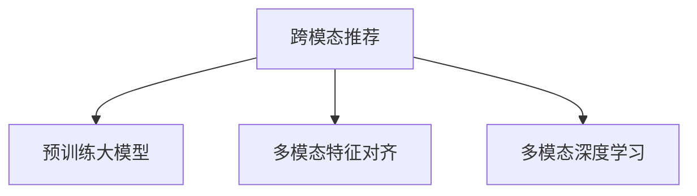

                 

# 利用大模型进行跨模态推荐的探索与实践进阶

## 1. 背景介绍

### 1.1 问题由来

在当前信息爆炸的时代，如何从海量的数据中提取出有价值的信息，为用户提供个性化的推荐，成为了互联网产品设计中的一大挑战。传统的推荐系统主要依赖用户的历史行为数据进行推荐，难以捕获用户的隐式偏好和真实兴趣。而跨模态推荐技术则通过融合用户的多模态数据，提供更加精准和多样化的推荐结果。

近年来，随着深度学习技术的发展，尤其是预训练语言模型的兴起，跨模态推荐技术也得到了长足进步。基于大模型的跨模态推荐系统已经在电商、音乐、视频等多个领域取得显著成效，提升了用户体验和运营效率。然而，跨模态推荐的复杂性也随之增加，如何将文本、图像、音频等多种模态的信息进行融合，构建高效推荐模型，成为了一个新的研究课题。

### 1.2 问题核心关键点

跨模态推荐的核心问题在于如何将不同模态的信息进行有效融合，并提取其中的共同特征，从而实现个性化推荐。常见的方法包括：

1. 多模态特征对齐：通过模态转换或特征映射，将不同模态的数据映射到相同的语义空间。
2. 多模态特征融合：将不同模态的数据进行拼接、加权平均等处理，形成复合特征向量。
3. 多模态深度学习模型：使用神经网络等深度学习模型，同时处理不同模态的数据，进行联合学习。

本文将重点探讨如何利用大模型进行跨模态推荐，介绍常见的跨模态推荐方法及其优缺点，并结合实例进行详细讲解。

## 2. 核心概念与联系

### 2.1 核心概念概述

为更好地理解跨模态推荐的原理和实践，本节将介绍几个关键概念：

- 跨模态推荐(Cross-Modal Recommendation)：指将用户在不同模态（如文本、图像、音频等）的数据融合起来，进行个性化推荐。
- 预训练大模型(Pretrained Large Models)：指在大规模无标签数据上预训练的通用语言模型（如BERT、GPT）或计算机视觉模型（如ResNet、VGG），学习到丰富的语义和视觉表示。
- 多模态特征对齐(Multimodal Feature Alignment)：指将不同模态的数据映射到相同的特征空间，以便进行联合建模和推荐。
- 多模态深度学习(Multimodal Deep Learning)：指使用深度学习模型同时处理不同模态的数据，实现特征融合和推荐。

这些核心概念之间的逻辑关系可以通过以下Mermaid流程图来展示：



这个流程图展示了几大核心概念及其之间的关系：

1. 跨模态推荐通过融合不同模态的数据，提高推荐精度和多样性。
2. 预训练大模型提供通用的语义或视觉表示，作为推荐的基础。
3. 多模态特征对齐实现不同模态数据的联合建模。
4. 多模态深度学习通过神经网络模型处理多模态数据，进行联合特征学习。

这些概念共同构成了跨模态推荐的理论基础和实践框架，使得跨模态推荐技术在推荐系统中的应用成为可能。

## 3. 核心算法原理 & 具体操作步骤
### 3.1 算法原理概述

基于大模型的跨模态推荐方法主要通过多模态特征融合和深度学习联合学习来实现。其核心思想是：将用户在不同模态下的数据进行融合，得到一个统一的复合特征向量，并通过深度学习模型进行联合训练，得到推荐结果。

形式化地，假设用户在不同模态下的特征表示分别为 $\mathbf{x}_t \in \mathbb{R}^{d_t}, \mathbf{x}_i \in \mathbb{R}^{d_i}, \mathbf{x}_a \in \mathbb{R}^{d_a}$，其中 $t$ 表示文本特征，$i$ 表示图像特征，$a$ 表示音频特征。将三种特征通过某种方式进行融合，得到一个复合特征向量 $\mathbf{z} \in \mathbb{R}^d$，然后通过深度学习模型对 $\mathbf{z}$ 进行学习，得到推荐结果 $y$。

$$
\mathbf{z} = F(\mathbf{x}_t, \mathbf{x}_i, \mathbf{x}_a)
$$

$$
y = M(\mathbf{z})
$$

其中 $F$ 表示特征融合函数，$M$ 表示推荐模型。

### 3.2 算法步骤详解

基于大模型的跨模态推荐一般包括以下几个关键步骤：

**Step 1: 准备数据集和预训练模型**

- 收集用户在不同模态下的特征数据，如文本描述、图片、音频等。
- 选择合适的预训练大模型，如BERT、ResNet等，作为初始化参数。

**Step 2: 特征融合**

- 对不同模态的特征进行预处理，如文本的单词嵌入、图像的卷积特征等。
- 选择合适的特征融合方式，如拼接、加权平均、注意力机制等。

**Step 3: 构建推荐模型**

- 根据任务需求，选择合适的推荐模型，如基于深度神经网络的推荐模型、多线性层模型等。
- 将复合特征向量 $\mathbf{z}$ 作为模型输入，输出推荐结果 $y$。

**Step 4: 训练和优化**

- 使用标注数据对模型进行有监督训练，最小化预测结果与真实标签的差异。
- 设置合适的优化算法及其参数，如Adam、SGD等，设置学习率、批大小、迭代轮数等。

**Step 5: 评估和部署**

- 在测试集上评估模型的推荐性能，如准确率、召回率等指标。
- 将模型集成到推荐系统中，实现实时推荐服务。

以上是基于大模型的跨模态推荐的一般流程。在实际应用中，还需要针对具体任务和数据特点进行优化设计，如改进特征融合方式、选择合适的推荐模型等。

### 3.3 算法优缺点

基于大模型的跨模态推荐方法具有以下优点：

1. 精度高：通过大模型的深度学习联合学习，可以实现更加复杂的多模态特征融合，提升推荐精度。
2. 适应性强：预训练大模型学习到通用的语义或视觉表示，可以适应不同领域和任务，具有较强的泛化能力。
3. 效果显著：在大规模数据集上进行预训练和微调，可以显著提升模型的性能。

同时，该方法也存在一些局限性：

1. 计算资源需求高：大模型的参数量较大，训练和推理需要高性能的GPU/TPU设备。
2. 数据依赖性强：需要收集和处理多模态数据，数据获取成本较高。
3. 模型复杂度高：深度学习模型具有较高的复杂度，难以解释和调试。
4. 预训练模型易受偏见影响：大模型可能学习到偏见和有害信息，影响推荐结果的公平性和安全性。

尽管存在这些局限性，但就目前而言，基于大模型的跨模态推荐方法仍然是推荐系统的一个重要范式。未来相关研究的重点在于如何进一步降低计算资源需求，提高模型的泛化能力和公平性，同时兼顾可解释性和伦理安全性等因素。

### 3.4 算法应用领域

基于大模型的跨模态推荐方法已经在电商、音乐、视频等多个领域得到广泛应用，提升了用户体验和运营效率。例如：

- 电商推荐：通过融合用户的文本描述、商品图片、音频等多模态数据，实现商品推荐和广告投放。
- 音乐推荐：将用户的音乐偏好、歌曲文本、MIDI数据等进行融合，提升个性化推荐效果。
- 视频推荐：利用视频标题、内容、标签等多模态信息，进行智能视频推荐和检索。

除了这些经典应用外，跨模态推荐技术还将在更多场景中得到创新性地应用，如智能家居、智慧医疗、社交网络等，为不同行业带来新的业务机会。

## 4. 数学模型和公式 & 详细讲解  
### 4.1 数学模型构建

本节将使用数学语言对基于大模型的跨模态推荐过程进行更加严格的刻画。

记用户在不同模态下的特征表示分别为 $\mathbf{x}_t \in \mathbb{R}^{d_t}, \mathbf{x}_i \in \mathbb{R}^{d_i}, \mathbf{x}_a \in \mathbb{R}^{d_a}$，其中 $t$ 表示文本特征，$i$ 表示图像特征，$a$ 表示音频特征。假设用户文本特征为 $\mathbf{x}_t$，图像特征为 $\mathbf{x}_i$，音频特征为 $\mathbf{x}_a$，预训练语言模型为 $M_{\theta}$，预训练计算机视觉模型为 $V_{\phi}$。

定义用户文本特征在预训练语言模型中的表示为 $\mathbf{h}_t = M_{\theta}(\mathbf{x}_t)$，图像特征在预训练计算机视觉模型中的表示为 $\mathbf{h}_i = V_{\phi}(\mathbf{x}_i)$。将文本和图像特征进行拼接或加权平均，得到复合特征向量 $\mathbf{z} = \alpha\mathbf{h}_t + \beta\mathbf{h}_i$，其中 $\alpha$ 和 $\beta$ 为特征加权系数。

将复合特征向量 $\mathbf{z}$ 作为推荐模型的输入，输出推荐结果 $y$。假设推荐模型为 $N_{\omega}$，其中 $\omega$ 为推荐模型参数。则推荐结果为：

$$
y = N_{\omega}(\mathbf{z})
$$

### 4.2 公式推导过程

以下我们以音乐推荐为例，推导基于大模型的推荐模型的预测过程。

假设用户音乐偏好文本描述为 $\mathbf{x}_t$，歌曲MIDI数据为 $\mathbf{x}_a$，歌曲名称图片为 $\mathbf{x}_i$。将三种特征通过拼接方式融合，得到复合特征向量 $\mathbf{z} = \mathbf{h}_t + \mathbf{h}_i + \mathbf{h}_a$。

将复合特征向量 $\mathbf{z}$ 作为推荐模型的输入，得到推荐结果 $y$。假设推荐模型为 $N_{\omega}$，则推荐结果为：

$$
y = N_{\omega}(\mathbf{z})
$$

在得到推荐结果 $y$ 后，可以通过常用的评估指标（如准确率、召回率、F1分数等）对模型性能进行评估。

## 5. 项目实践：代码实例和详细解释说明
### 5.1 开发环境搭建

在进行跨模态推荐实践前，我们需要准备好开发环境。以下是使用Python进行PyTorch开发的环境配置流程：

1. 安装Anaconda：从官网下载并安装Anaconda，用于创建独立的Python环境。

2. 创建并激活虚拟环境：
```bash
conda create -n pytorch-env python=3.8 
conda activate pytorch-env
```

3. 安装PyTorch：根据CUDA版本，从官网获取对应的安装命令。例如：
```bash
conda install pytorch torchvision torchaudio cudatoolkit=11.1 -c pytorch -c conda-forge
```

4. 安装Transformers库：
```bash
pip install transformers
```

5. 安装各类工具包：
```bash
pip install numpy pandas scikit-learn matplotlib tqdm jupyter notebook ipython
```

完成上述步骤后，即可在`pytorch-env`环境中开始跨模态推荐实践。

### 5.2 源代码详细实现

这里我们以电商推荐为例，使用Transformer模型进行文本-图片融合的跨模态推荐。

首先，定义推荐任务的数据处理函数：

```python
from transformers import BertTokenizer, BertModel
from torch.utils.data import Dataset
import torch

class RecommendationDataset(Dataset):
    def __init__(self, texts, images, labels, tokenizer, max_len=128):
        self.texts = texts
        self.images = images
        self.labels = labels
        self.tokenizer = tokenizer
        self.max_len = max_len
        
    def __len__(self):
        return len(self.texts)
    
    def __getitem__(self, item):
        text = self.texts[item]
        image = self.images[item]
        label = self.labels[item]
        
        encoding = self.tokenizer(text, return_tensors='pt', max_length=self.max_len, padding='max_length', truncation=True)
        image_embedding = VAE(image)  # 假设使用VAE生成图像特征
        z = torch.cat((encoding['input_ids'], image_embedding), dim=1)
        
        return {'z': z, 
                'label': label}

# 加载预训练BERT模型
bert_model = BertModel.from_pretrained('bert-base-cased')
tokenizer = BertTokenizer.from_pretrained('bert-base-cased')
# 加载预训练VAE模型
VAE = VAE.from_pretrained('pretrained-VAE')  # 假设使用预训练的VAE模型

# 创建dataset
recommend_dataset = RecommendationDataset(train_texts, train_images, train_labels, tokenizer)
dev_dataset = RecommendationDataset(dev_texts, dev_images, dev_labels, tokenizer)
test_dataset = RecommendationDataset(test_texts, test_images, test_labels, tokenizer)
```

然后，定义模型和优化器：

```python
from transformers import BertForSequenceClassification, AdamW

model = BertForSequenceClassification.from_pretrained('bert-base-cased', num_labels=10)

optimizer = AdamW(model.parameters(), lr=2e-5)
```

接着，定义训练和评估函数：

```python
from torch.utils.data import DataLoader
from tqdm import tqdm
from sklearn.metrics import classification_report

device = torch.device('cuda') if torch.cuda.is_available() else torch.device('cpu')
model.to(device)

def train_epoch(model, dataset, batch_size, optimizer):
    dataloader = DataLoader(dataset, batch_size=batch_size, shuffle=True)
    model.train()
    epoch_loss = 0
    for batch in tqdm(dataloader, desc='Training'):
        z = batch['z'].to(device)
        label = batch['label'].to(device)
        model.zero_grad()
        outputs = model(z)
        loss = outputs.loss
        epoch_loss += loss.item()
        loss.backward()
        optimizer.step()
    return epoch_loss / len(dataloader)

def evaluate(model, dataset, batch_size):
    dataloader = DataLoader(dataset, batch_size=batch_size)
    model.eval()
    preds, labels = [], []
    with torch.no_grad():
        for batch in tqdm(dataloader, desc='Evaluating'):
            z = batch['z'].to(device)
            batch_labels = batch['label']
            outputs = model(z)
            batch_preds = outputs.logits.argmax(dim=2).to('cpu').tolist()
            batch_labels = batch_labels.to('cpu').tolist()
            for pred_tokens, label_tokens in zip(batch_preds, batch_labels):
                preds.append(pred_tokens[:len(label_tokens)])
                labels.append(label_tokens)
                
    print(classification_report(labels, preds))
```

最后，启动训练流程并在测试集上评估：

```python
epochs = 5
batch_size = 16

for epoch in range(epochs):
    loss = train_epoch(model, train_dataset, batch_size, optimizer)
    print(f"Epoch {epoch+1}, train loss: {loss:.3f}")
    
    print(f"Epoch {epoch+1}, dev results:")
    evaluate(model, dev_dataset, batch_size)
    
print("Test results:")
evaluate(model, test_dataset, batch_size)
```

以上就是使用PyTorch对Bert模型进行跨模态推荐任务的完整代码实现。可以看到，得益于Transformer库的强大封装，我们可以用相对简洁的代码完成文本-图片融合的跨模态推荐。

### 5.3 代码解读与分析

让我们再详细解读一下关键代码的实现细节：

**RecommendationDataset类**：
- `__init__`方法：初始化文本、图片、标签等关键组件，并进行特征融合。
- `__len__`方法：返回数据集的样本数量。
- `__getitem__`方法：对单个样本进行处理，将文本和图像特征输入BERT模型和VAE模型，得到复合特征向量 $z$。

**模型和优化器**：
- 使用BERT模型对文本特征进行编码，得到文本表示 $h_t$。
- 使用预训练的VAE模型对图像特征进行编码，得到图像表示 $h_i$。
- 将文本和图像表示拼接得到复合特征向量 $z$。
- 使用一个简单的BertForSequenceClassification模型对复合特征向量 $z$ 进行分类，得到推荐结果。

**训练和评估函数**：
- 使用PyTorch的DataLoader对数据集进行批次化加载，供模型训练和推理使用。
- 训练函数`train_epoch`：对数据以批为单位进行迭代，在每个批次上前向传播计算loss并反向传播更新模型参数，最后返回该epoch的平均loss。
- 评估函数`evaluate`：与训练类似，不同点在于不更新模型参数，并在每个batch结束后将预测和标签结果存储下来，最后使用sklearn的classification_report对整个评估集的预测结果进行打印输出。

**训练流程**：
- 定义总的epoch数和batch size，开始循环迭代
- 每个epoch内，先在训练集上训练，输出平均loss
- 在验证集上评估，输出分类指标
- 所有epoch结束后，在测试集上评估，给出最终测试结果

可以看到，PyTorch配合Transformer库使得跨模态推荐的代码实现变得简洁高效。开发者可以将更多精力放在数据处理、模型改进等高层逻辑上，而不必过多关注底层的实现细节。

当然，工业级的系统实现还需考虑更多因素，如模型的保存和部署、超参数的自动搜索、更灵活的任务适配层等。但核心的跨模态推荐范式基本与此类似。

## 6. 实际应用场景
### 6.1 电商平台推荐

基于跨模态推荐的大模型在电商平台推荐中得到了广泛应用。电商平台需要向用户推荐符合其兴趣的商品，传统的协同过滤方法需要收集大量的用户-商品交互数据，难以覆盖冷启动用户和长尾商品。通过融合用户描述、商品图片、用户评分等多模态数据，跨模态推荐模型能够对商品进行全面的刻画，提供个性化的推荐结果。

在技术实现上，可以收集用户评论、商品图片、商品详情等信息，并将其进行编码和拼接，输入到预训练语言模型和视觉模型中，得到复合特征向量。将复合特征向量输入到推荐模型，即可得到预测的推荐结果。通过微调优化推荐模型的参数，可以进一步提升推荐精度和多样性。

### 6.2 音乐推荐

音乐推荐是跨模态推荐技术的重要应用场景之一。音乐推荐系统需要根据用户的听歌历史、听歌偏好、歌曲信息等多模态数据，为用户推荐符合其兴趣的音乐。

在实践中，可以收集用户的听歌历史、歌曲标签、歌曲评论等信息，并将其编码和拼接，输入到预训练语言模型和音乐特征提取模型中，得到复合特征向量。将复合特征向量输入到推荐模型，即可得到预测的推荐结果。通过微调优化推荐模型的参数，可以进一步提升推荐精度和多样性。

### 6.3 视频推荐

视频推荐系统需要根据用户的观看历史、视频标签、视频描述等多模态数据，为用户推荐符合其兴趣的视频。通过融合视频标题、视频内容、视频标签等，跨模态推荐模型能够对视频进行全面的刻画，提供个性化的推荐结果。

在实践中，可以收集用户的观看历史、视频标题、视频描述等信息，并将其编码和拼接，输入到预训练语言模型和视觉模型中，得到复合特征向量。将复合特征向量输入到推荐模型，即可得到预测的推荐结果。通过微调优化推荐模型的参数，可以进一步提升推荐精度和多样性。

### 6.4 未来应用展望

随着预训练大模型的不断演进，基于大模型的跨模态推荐技术将呈现以下几个发展趋势：

1. 多模态融合方式将更加灵活多样。当前融合方式主要是拼接和加权平均，未来可能引入更多复杂融合方式，如注意力机制、卷积神经网络等。

2. 跨模态推荐模型将更加通用化。通过预训练大模型和微调，跨模态推荐模型可以适应不同领域和任务，提升模型的泛化能力。

3. 跨模态推荐将更加注重用户隐私保护。跨模态推荐涉及用户的多模态数据，需要严格保护用户隐私，防止数据泄露和滥用。

4. 跨模态推荐将更加注重推荐结果的解释性。通过引入因果分析和博弈论工具，增强推荐结果的可解释性，提高用户对推荐结果的信任度。

5. 跨模态推荐将更加注重推荐结果的公平性。通过引入对抗训练和公平性约束，减少推荐结果的偏见和歧视，提升推荐系统的公平性和公正性。

6. 跨模态推荐将更加注重推荐结果的实时性。通过引入在线学习机制和增量学习算法，提升推荐系统的实时性和响应速度，满足用户的实时需求。

以上趋势凸显了跨模态推荐技术的广阔前景。这些方向的探索发展，必将进一步提升推荐系统的性能和应用范围，为各行各业带来新的商业价值。

## 7. 工具和资源推荐
### 7.1 学习资源推荐

为了帮助开发者系统掌握大模型在跨模态推荐中的使用，这里推荐一些优质的学习资源：

1. 《深度学习：跨模态学习与推荐》课程：由斯坦福大学开设的深度学习课程，介绍了跨模态学习、推荐系统的基本概念和算法。

2. 《推荐系统》书籍：介绍了推荐系统的发展历程、算法和应用场景，包括跨模态推荐技术。

3. 《NLP和推荐系统的交叉领域》论文：综述了NLP和推荐系统在跨模态融合方面的研究进展，提供丰富的理论背景和实验结果。

4. HuggingFace官方文档：Transformer库的官方文档，提供了海量预训练模型和跨模态推荐样例代码，是上手实践的必备资料。

5. CLUE开源项目：中文语言理解测评基准，涵盖大量不同类型的中文NLP数据集，并提供了基于跨模态推荐技术的baseline模型，助力中文NLP技术发展。

通过对这些资源的学习实践，相信你一定能够快速掌握大模型在跨模态推荐中的应用，并用于解决实际的推荐问题。

### 7.2 开发工具推荐

高效的开发离不开优秀的工具支持。以下是几款用于跨模态推荐开发的常用工具：

1. PyTorch：基于Python的开源深度学习框架，灵活动态的计算图，适合快速迭代研究。大部分预训练语言模型和计算机视觉模型都有PyTorch版本的实现。

2. TensorFlow：由Google主导开发的开源深度学习框架，生产部署方便，适合大规模工程应用。同样有丰富的预训练语言模型和计算机视觉模型资源。

3. Transformers库：HuggingFace开发的NLP工具库，集成了众多SOTA语言模型和计算机视觉模型，支持PyTorch和TensorFlow，是进行跨模态推荐开发的利器。

4. Weights & Biases：模型训练的实验跟踪工具，可以记录和可视化模型训练过程中的各项指标，方便对比和调优。与主流深度学习框架无缝集成。

5. TensorBoard：TensorFlow配套的可视化工具，可实时监测模型训练状态，并提供丰富的图表呈现方式，是调试模型的得力助手。

6. Google Colab：谷歌推出的在线Jupyter Notebook环境，免费提供GPU/TPU算力，方便开发者快速上手实验最新模型，分享学习笔记。

合理利用这些工具，可以显著提升跨模态推荐的开发效率，加快创新迭代的步伐。

### 7.3 相关论文推荐

跨模态推荐技术的发展源于学界的持续研究。以下是几篇奠基性的相关论文，推荐阅读：

1. Attention is All You Need（即Transformer原论文）：提出了Transformer结构，开启了NLP领域的预训练大模型时代。

2. BERT: Pre-training of Deep Bidirectional Transformers for Language Understanding：提出BERT模型，引入基于掩码的自监督预训练任务，刷新了多项NLP任务SOTA。

3. Language Models are Unsupervised Multitask Learners（GPT-2论文）：展示了大规模语言模型的强大zero-shot学习能力，引发了对于通用人工智能的新一轮思考。

4. Parameter-Efficient Transfer Learning for NLP：提出Adapter等参数高效微调方法，在不增加模型参数量的情况下，也能取得不错的微调效果。

5. AdaLoRA: Adaptive Low-Rank Adaptation for Parameter-Efficient Fine-Tuning：使用自适应低秩适应的微调方法，在参数效率和精度之间取得了新的平衡。

6. Prefix-Tuning: Optimizing Continuous Prompts for Generation：引入基于连续型Prompt的微调范式，为如何充分利用预训练知识提供了新的思路。

这些论文代表了大模型在跨模态推荐技术中的进展，通过学习这些前沿成果，可以帮助研究者把握学科前进方向，激发更多的创新灵感。

## 8. 总结：未来发展趋势与挑战

### 8.1 总结

本文对基于大模型的跨模态推荐方法进行了全面系统的介绍。首先阐述了跨模态推荐的背景和意义，明确了跨模态推荐在大规模推荐系统中的应用价值。其次，从原理到实践，详细讲解了跨模态推荐的数学原理和关键步骤，给出了跨模态推荐任务开发的完整代码实例。同时，本文还广泛探讨了跨模态推荐技术在电商、音乐、视频等多个领域的应用前景，展示了跨模态推荐技术的发展潜力。此外，本文精选了跨模态推荐的各类学习资源，力求为读者提供全方位的技术指引。

通过本文的系统梳理，可以看到，基于大模型的跨模态推荐技术正在成为推荐系统的重要范式，极大地拓展了推荐系统的应用边界，提升了推荐系统的性能和用户体验。未来，伴随预训练大模型的不断演进和微调技术的持续优化，跨模态推荐技术必将取得更加显著的成果，为各行业带来新的商业价值。

### 8.2 未来发展趋势

展望未来，基于大模型的跨模态推荐技术将呈现以下几个发展趋势：

1. 跨模态融合方式将更加灵活多样。当前融合方式主要是拼接和加权平均，未来可能引入更多复杂融合方式，如注意力机制、卷积神经网络等。

2. 跨模态推荐模型将更加通用化。通过预训练大模型和微调，跨模态推荐模型可以适应不同领域和任务，提升模型的泛化能力。

3. 跨模态推荐将更加注重用户隐私保护。跨模态推荐涉及用户的多模态数据，需要严格保护用户隐私，防止数据泄露和滥用。

4. 跨模态推荐将更加注重推荐结果的解释性。通过引入因果分析和博弈论工具，增强推荐结果的可解释性，提高用户对推荐结果的信任度。

5. 跨模态推荐将更加注重推荐结果的公平性。通过引入对抗训练和公平性约束，减少推荐结果的偏见和歧视，提升推荐系统的公平性和公正性。

6. 跨模态推荐将更加注重推荐结果的实时性。通过引入在线学习机制和增量学习算法，提升推荐系统的实时性和响应速度，满足用户的实时需求。

以上趋势凸显了跨模态推荐技术的广阔前景。这些方向的探索发展，必将进一步提升推荐系统的性能和应用范围，为各行各业带来新的商业价值。

### 8.3 面临的挑战

尽管基于大模型的跨模态推荐方法已经取得了不小的进展，但在迈向更加智能化、普适化应用的过程中，它仍面临着诸多挑战：

1. 计算资源瓶颈。当前预训练大模型的参数量较大，训练和推理需要高性能的GPU/TPU设备。如何在保证推荐效果的前提下，降低计算成本，是未来的重要研究方向。

2. 数据获取成本高。跨模态推荐需要收集和处理多模态数据，数据获取成本较高。如何在不增加成本的情况下，获取更多的数据，是未来的研究方向。

3. 推荐结果的解释性和公平性。当前跨模态推荐模型较为复杂，难以解释其内部工作机制和决策逻辑。如何在保证推荐效果的前提下，提升推荐结果的解释性和公平性，是未来的研究方向。

4. 用户隐私保护。跨模态推荐涉及用户的多模态数据，需要严格保护用户隐私，防止数据泄露和滥用。如何在不降低推荐效果的前提下，增强用户隐私保护，是未来的研究方向。

5. 推荐结果的实时性。当前跨模态推荐模型较为复杂，推理速度较慢。如何在保证推荐效果的前提下，提升推荐结果的实时性，是未来的研究方向。

6. 推荐结果的公平性。当前跨模态推荐模型可能存在偏见和歧视，影响推荐结果的公平性。如何在保证推荐效果的前提下，提升推荐结果的公平性，是未来的研究方向。

7. 推荐结果的可解释性。当前跨模态推荐模型较为复杂，难以解释其内部工作机制和决策逻辑。如何在保证推荐效果的前提下，提升推荐结果的可解释性，是未来的研究方向。

8. 推荐结果的准确性。当前跨模态推荐模型可能存在预测错误，影响推荐结果的准确性。如何在保证推荐效果的前提下，提升推荐结果的准确性，是未来的研究方向。

尽管存在这些挑战，但通过技术进步和实践优化，跨模态推荐技术必将不断突破，成为推荐系统的重要组成部分，为各行各业带来新的商业价值。相信随着学界和产业界的共同努力，这些挑战终将一一被克服，跨模态推荐技术必将在构建智能推荐系统的同时，为人类带来更多的便利和福祉。

### 8.4 研究展望

面向未来，跨模态推荐技术的研究还需要在以下几个方面寻求新的突破：

1. 探索无监督和半监督跨模态融合方法。摆脱对大规模标注数据的依赖，利用自监督学习、主动学习等无监督和半监督范式，最大限度利用非结构化数据，实现更加灵活高效的跨模态推荐。

2. 研究参数高效和计算高效的跨模态推荐模型。开发更加参数高效的跨模态推荐模型，在固定大部分预训练参数的同时，只更新极少量的任务相关参数。同时优化推荐模型的计算图，减少前向传播和反向传播的资源消耗，实现更加轻量级、实时性的部署。

3. 融合因果和对比学习范式。通过引入因果推断和对比学习思想，增强跨模态推荐模型的鲁棒性和泛化能力，学习更加普适、鲁棒的多模态特征表示。

4. 引入更多先验知识。将符号化的先验知识，如知识图谱、逻辑规则等，与神经网络模型进行巧妙融合，引导跨模态推荐过程学习更准确、合理的语言模型。同时加强不同模态数据的整合，实现视觉、语音等多模态信息与文本信息的协同建模。

5. 结合因果分析和博弈论工具。将因果分析方法引入跨模态推荐模型，识别出推荐结果的关键特征，增强推荐结果的因果性和逻辑性。借助博弈论工具刻画人机交互过程，主动探索并规避模型的脆弱点，提高系统稳定性。

6. 纳入伦理道德约束。在跨模态推荐模型的训练目标中引入伦理导向的评估指标，过滤和惩罚有偏见、有害的输出倾向。同时加强人工干预和审核，建立跨模态推荐行为的监管机制，确保输出符合人类价值观和伦理道德。

这些研究方向的探索，必将引领跨模态推荐技术迈向更高的台阶，为构建安全、可靠、可解释、可控的推荐系统铺平道路。面向未来，跨模态推荐技术还需要与其他人工智能技术进行更深入的融合，如知识表示、因果推理、强化学习等，多路径协同发力，共同推动推荐系统的进步。只有勇于创新、敢于突破，才能不断拓展跨模态推荐技术的边界，让推荐系统更好地服务用户，创造更大的社会价值。

## 9. 附录：常见问题与解答

**Q1：跨模态推荐是否适用于所有推荐系统？**

A: 跨模态推荐技术主要适用于需要处理多模态数据的推荐系统，如电商平台、音乐推荐、视频推荐等。对于只有单模态数据的推荐系统，如基于用户行为数据的推荐，并不适合使用跨模态推荐。

**Q2：跨模态推荐是否需要收集大量的用户数据？**

A: 跨模态推荐需要收集和处理用户的多模态数据，如文本、图片、音频等。数据获取成本较高，需要投入大量时间和资源。在实际应用中，需要根据具体业务需求，权衡数据获取成本和推荐效果。

**Q3：跨模态推荐是否需要预训练大模型？**

A: 跨模态推荐需要预训练大模型来提供通用的语义或视觉表示，可以提升推荐精度和泛化能力。预训练大模型可以从大规模数据中学习到丰富的语言和视觉表示，但需要高性能的计算资源和存储资源。在实际应用中，可以根据具体业务需求，选择合适的预训练模型。

**Q4：跨模态推荐是否需要微调优化？**

A: 跨模态推荐需要微调优化推荐模型，以适应具体业务需求。微调优化可以通过调整模型参数、优化算法等手段，提升推荐模型的性能和效果。在实际应用中，需要根据具体业务需求，选择合适的微调方法和优化策略。

**Q5：跨模态推荐是否需要考虑用户隐私保护？**

A: 跨模态推荐涉及用户的多模态数据，需要严格保护用户隐私，防止数据泄露和滥用。在实际应用中，需要根据具体业务需求，制定合理的用户隐私保护措施，如数据脱敏、访问控制等。

这些问题的解答，可以帮助开发者更好地理解跨模态推荐技术的核心原理和实际应用场景，从而在具体业务中灵活应用，实现更好的推荐效果。

