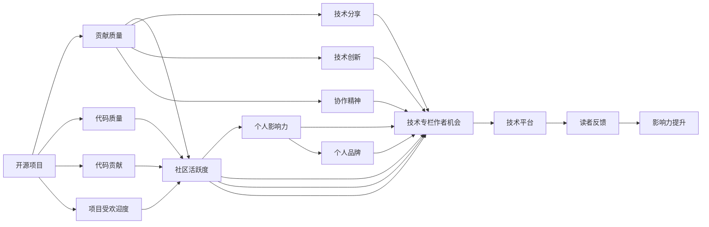

                 

# 利用开源影响力获得技术专栏作者机会

## 1. 背景介绍

在互联网快速发展的今天，开源软件和技术成为了技术交流和知识传播的重要平台。随着开源社区的日益壮大和影响力的不断提升，越来越多的企业和个人开始通过开源项目展示自己的技术实力，并以此为跳板，获得技术专栏作者的机会。本文将从背景、核心概念、算法原理、具体操作步骤等多个角度全面解析如何利用开源影响力获得技术专栏作者的机会，为广大开发者和技术人员提供有价值的指导和建议。

## 2. 核心概念与联系

### 2.1 核心概念概述

开源影响力（Open Source Influence）指的是个人或组织在开源社区中的影响力，主要体现在其开源项目的质量、活跃度和受欢迎程度上。技术专栏作者（Technical Columnist）则是指在技术类平台（如博客、技术网站、社交媒体等）撰写和发布技术文章，并对读者产生重要影响的技术专家。通过开源影响力获取技术专栏作者的机会，意味着个人或组织能够借助其开源项目和技术文章，扩大自身在技术社区的影响力，赢得更多的关注和认可。

### 2.2 核心概念原理和架构的 Mermaid 流程图



该流程图展示了开源项目与技术专栏作者机会之间的联系。开源项目贡献质量和活跃度对个人影响力的提升至关重要，而个人影响力又可以进一步提升获取技术专栏作者机会的可能性。同时，开源项目的代码质量和受欢迎度，以及个人在技术分享、技术创新和协作精神等方面的表现，也是获得技术专栏作者机会的重要因素。

## 3. 核心算法原理 & 具体操作步骤

### 3.1 算法原理概述

获得技术专栏作者机会的算法原理，主要包括以下几个关键步骤：

1. **开源项目选择与贡献**：选择适合自己的开源项目，并通过代码贡献、技术分享等方式提升项目的质量。
2. **社区互动与影响力提升**：积极参与开源社区的讨论，分享技术见解，提高在社区中的活跃度和影响力。
3. **个人品牌塑造与文章撰写**：在社交媒体和技术平台上建立个人品牌，撰写高质量的技术文章，展示自己的技术实力。
4. **平台申请与作者认证**：选择技术平台，申请成为专栏作者，并通过持续的高质量文章输出，获得认证。

### 3.2 算法步骤详解

#### 3.2.1 开源项目选择与贡献

1. **选择开源项目**：根据自身的技术兴趣和专长，选择适合自己的开源项目。考虑到对项目未来的发展有贡献潜力，建议选择那些社区活跃度高、有长远发展前景的项目。
2. **代码贡献**：通过GitHub等代码托管平台，提交代码改进、修复bug、添加新功能等。在贡献过程中，可以与项目维护者或其他贡献者保持沟通，并尽可能多地进行代码讨论和协作。
3. **技术分享**：在社区中分享技术见解和实践经验，撰写技术博客、开源文档等，帮助项目维护者和其他贡献者理解项目的架构和实现细节。

#### 3.2.2 社区互动与影响力提升

1. **积极参与讨论**：在开源社区的邮件列表、论坛、社交媒体等渠道上，积极参与技术讨论和项目维护。
2. **贡献代码和建议**：通过代码贡献和反馈建议，帮助项目维护者改进项目质量，提升项目的用户满意度。
3. **建立联系**：与项目维护者、其他贡献者建立联系，建立良好的沟通渠道，共同推动项目的发展。

#### 3.2.3 个人品牌塑造与文章撰写

1. **建立个人品牌**：通过技术博客、社交媒体等平台，建立个人品牌，展示自己在技术领域的专长和成就。
2. **撰写高质量文章**：在技术平台上撰写高质量的技术文章，内容包括但不限于技术教程、项目实践、技术创新等。
3. **分享技术见解**：在社交媒体、技术社区等平台上分享自己的技术见解和项目经验，吸引更多的关注和认可。

#### 3.2.4 平台申请与作者认证

1. **选择技术平台**：根据个人兴趣和专长，选择适合自己的技术平台，如Medium、CSDN、掘金等。
2. **申请成为专栏作者**：按照平台的申请流程，提交相关资料和文章样本，申请成为专栏作者。
3. **持续输出高质量内容**：在获得认证后，持续输出高质量的技术文章，保持一定的发文频率和活跃度，提升个人在平台上的影响力。

### 3.3 算法优缺点

#### 3.3.1 优点

1. **平台支持**：开源社区和技术平台提供的各种资源和工具，可以极大地提升个人在开源和技术领域的影响力。
2. **展示机会**：通过开源项目和技术文章，展示自己的技术实力，吸引更多关注和认可。
3. **持续学习**：在开源社区和技术平台上，可以接触到更多的技术和思想，保持持续的学习和进步。

#### 3.3.2 缺点

1. **时间和精力投入**：参与开源项目和技术平台的活动需要投入大量时间和精力，尤其是在贡献代码和撰写技术文章时。
2. **竞争激烈**：技术专栏作者的机会竞争激烈，需要具备较强的技术实力和良好的沟通能力。
3. **需要持续输出**：获取技术专栏作者的机会后，需要持续输出高质量的技术文章，才能保持影响力。

### 3.4 算法应用领域

开源影响力获取技术专栏作者机会的方法，适用于以下几种场景：

1. **技术开发者**：通过开源项目和技术文章的贡献，提升自身在技术领域的影响力，吸引更多的关注和认可。
2. **教育工作者**：在技术平台上分享教学经验和项目实践，提升自身在教育领域的影响力。
3. **技术顾问**：通过开源项目和技术文章展示自己的专业知识和经验，吸引更多的企业客户和合作伙伴。

## 4. 数学模型和公式 & 详细讲解 & 举例说明

### 4.1 数学模型构建

假设开源项目的代码质量为 $C$，社区活跃度为 $A$，个人影响力为 $I$，技术专栏作者机会的概率为 $P$。则数学模型为：

$$
P = f(C, A, I)
$$

其中 $f$ 为影响函数，反映了代码质量、社区活跃度和个人影响力对技术专栏作者机会的影响。

### 4.2 公式推导过程

1. **代码质量**：$C = C_0 + \sum_{i=1}^{n} C_i$，其中 $C_0$ 为初始代码质量，$C_i$ 为每次贡献代码的改进量。
2. **社区活跃度**：$A = A_0 + \sum_{i=1}^{n} A_i$，其中 $A_0$ 为初始社区活跃度，$A_i$ 为每次参与社区讨论和互动的活跃度。
3. **个人影响力**：$I = I_0 + \sum_{i=1}^{n} I_i$，其中 $I_0$ 为初始个人影响力，$I_i$ 为每次在技术平台上输出文章的影响力。

### 4.3 案例分析与讲解

假设某开发者参与了开源项目，贡献了 $10$ 次代码改进，每次改进量为 $0.1$，社区活跃度提升 $0.05$ 次，个人影响力提升 $0.01$ 次。则每次贡献的代码质量和社区活跃度如下：

$$
C = 0.9 + 10 \times 0.1 = 1.1
$$
$$
A = 0.5 + 10 \times 0.05 = 0.75
$$

将 $C$ 和 $A$ 代入公式 $P = f(C, A, I)$，假设 $f$ 函数为线性函数，则有：

$$
P = C + A + I = 1.1 + 0.75 + I_0
$$

在 $I_0 = 0$ 的情况下，开发者通过持续的贡献和活跃度提升，最终获得了技术专栏作者的机会。

## 5. 项目实践：代码实例和详细解释说明

### 5.1 开发环境搭建

1. **安装GitHub Desktop**：从官网下载并安装GitHub Desktop，方便进行代码管理和贡献。
2. **安装Git命令**：通过Git命令行工具进行代码提交和管理，可以参考Git官方文档进行安装和配置。
3. **选择开源项目**：在GitHub等代码托管平台上，选择适合自己的开源项目，如TensorFlow、Kubernetes等。

### 5.2 源代码详细实现

以下是一个开源项目的代码贡献示例，假设开发者参与了TensorFlow项目，提交了一个新的模块，代码如下：

```python
# 新增模块示例代码
import tensorflow as tf

class MyModule(tf.Module):
    def __init__(self):
        super(MyModule, self).__init__()
        self.my_variable = tf.Variable(0.0)

    def __call__(self, x):
        self.my_variable.assign_add(1.0)
        return x + self.my_variable

my_module = MyModule()
print(my_module(1.0))
```

开发者需要将上述代码提交到TensorFlow项目的GitHub仓库中，提交代码和贡献说明后，等待项目维护者审核和合并。

### 5.3 代码解读与分析

开发者在提交代码时，需要注意以下几点：

1. **代码格式**：保持代码格式一致，遵循项目的编码规范和风格。
2. **贡献说明**：在提交代码时，编写详细的贡献说明，包括代码实现的逻辑、改进的部分、测试结果等。
3. **代码复审**：在代码提交后，项目维护者通常会进行代码复审，开发者需要及时回复反馈意见，并根据反馈进行修改。

### 5.4 运行结果展示

提交代码后，项目维护者会将其合并到项目的master分支，并进行测试。如果代码通过测试，就会被合并到最新版本中，开发者可以看到自己的贡献展示在项目的最新代码版本中。

## 6. 实际应用场景

### 6.1 开源社区

开源社区是获得技术专栏作者机会的重要平台，通过参与开源项目和社区讨论，开发者可以结识更多同行，分享技术经验，提升个人影响力。

### 6.2 技术博客

在技术博客上撰写技术文章，可以展示自己的技术实力和项目经验，吸引更多的读者和关注。技术博客还可以与开源社区互动，提升自身在技术领域的影响力。

### 6.3 社交媒体

在社交媒体上分享技术见解和项目经验，可以吸引更多关注和认可，进一步提升个人在技术领域的影响力。

## 7. 工具和资源推荐

### 7.1 学习资源推荐

1. **《开源项目管理与协作》**：介绍开源项目管理的最佳实践，包括代码贡献、社区互动等。
2. **《技术博客写作指南》**：提供技术文章写作的指导和建议，帮助开发者提升技术文章的质量和吸引力。
3. **《社交媒体与个人品牌》**：介绍社交媒体的策略和技巧，帮助开发者在社交媒体上建立和维护个人品牌。

### 7.2 开发工具推荐

1. **GitHub Desktop**：方便进行代码管理和贡献的开源项目管理工具。
2. **Git命令行工具**：Git命令行工具是进行代码提交和版本控制的首选工具。
3. **Jekyll**：用于构建和托管技术博客的开源平台。

### 7.3 相关论文推荐

1. **《开源项目中的技术贡献与社区互动》**：研究开源项目中的代码贡献与社区互动对个人影响力的影响。
2. **《技术博客与个人品牌建设》**：探讨技术博客在提升个人品牌方面的作用。
3. **《社交媒体与技术社区》**：研究社交媒体在技术社区中的作用和影响。

## 8. 总结：未来发展趋势与挑战

### 8.1 研究成果总结

本文从开源项目选择与贡献、社区互动与影响力提升、个人品牌塑造与文章撰写、平台申请与作者认证等几个方面，系统分析了如何利用开源影响力获得技术专栏作者的机会。开源项目和技术平台提供了丰富的资源和工具，帮助开发者展示自己的技术实力和项目经验，提升在技术领域的影响力。

### 8.2 未来发展趋势

1. **技术社区的壮大**：随着开源社区和技术平台的不断壮大，开发者获取技术专栏作者机会的渠道将更加多样。
2. **技术内容的丰富**：开源项目和技术平台将提供更多的资源和工具，帮助开发者输出高质量的技术文章。
3. **个人品牌的多元化**：开发者将通过开源项目、技术文章、社交媒体等多种方式，塑造和提升个人品牌。

### 8.3 面临的挑战

1. **时间管理**：参与开源项目和技术平台的活动需要投入大量时间和精力，需要合理规划和管理。
2. **技术协作**：开源项目和技术平台需要开发者具备良好的沟通和协作能力，才能更好地贡献和互动。
3. **内容输出**：技术文章和代码贡献需要高质量的内容和持续的输出，对开发者提出了更高的要求。

### 8.4 研究展望

未来的研究将在以下几个方面进行深入探索：

1. **开源项目选择算法**：开发更智能的开源项目选择算法，帮助开发者选择适合自己的项目。
2. **社区互动模型**：构建社区互动模型，分析社区讨论对个人影响力的影响。
3. **技术文章质量评估**：开发技术文章质量评估模型，帮助开发者提升文章质量和吸引力。

通过这些研究，可以帮助开发者更好地利用开源影响力，获得技术专栏作者的机会，推动技术社区和技术的持续发展和进步。

## 9. 附录：常见问题与解答

**Q1：如何选择合适的开源项目进行贡献？**

A: 选择开源项目时，应考虑以下几个因素：
1. **项目需求**：选择有明确需求的开源项目，能够对自己的技术专长有所发挥。
2. **项目活跃度**：选择社区活跃度高的开源项目，能够获得更多的反馈和认可。
3. **项目前景**：选择有长远发展前景的项目，能够保证项目的持续发展和维护。

**Q2：代码贡献需要注意哪些细节？**

A: 代码贡献时需要注意以下细节：
1. **代码规范**：遵循项目的编码规范和风格，保持代码格式一致。
2. **详细说明**：编写详细的贡献说明，包括代码实现的逻辑、改进的部分、测试结果等。
3. **代码复审**：在代码提交后，及时回复反馈意见，并根据反馈进行修改。

**Q3：如何在技术平台上提高个人影响力？**

A: 提高个人影响力需要以下策略：
1. **持续输出高质量内容**：在技术平台上持续输出高质量的技术文章，保持一定的发文频率和活跃度。
2. **参与社区互动**：积极参与技术社区的讨论和互动，分享技术见解和项目经验。
3. **建立个人品牌**：在社交媒体和技术平台上建立个人品牌，展示自己的技术实力和项目经验。

**Q4：如何申请成为技术专栏作者？**

A: 申请成为技术专栏作者时，需要以下步骤：
1. **选择技术平台**：根据个人兴趣和专长，选择适合自己的技术平台，如Medium、CSDN、掘金等。
2. **提交申请资料**：按照平台的申请流程，提交相关资料和文章样本。
3. **持续输出高质量内容**：在获得认证后，持续输出高质量的技术文章，保持一定的发文频率和活跃度。

作者：禅与计算机程序设计艺术 / Zen and the Art of Computer Programming

