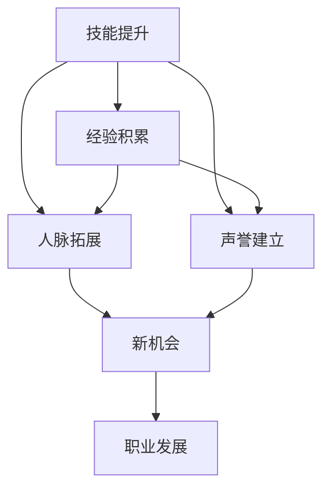

                 

## 1. 背景介绍

在信息技术迅速发展的今天，开源贡献已经成为个人提升职业发展空间的重要途径。无论是初学者还是资深专家，无论是全职开发人员还是自由职业者，开源社区都是一个展示技术、拓展人脉、建立信誉的绝佳平台。本文旨在深入探讨如何通过开源贡献实现职业发展，帮助技术从业者全面提升自身竞争力。

### 1.1 问题由来

随着技术的不断进步，开源项目的重要性日益凸显。开源社区汇聚了全球顶尖的开发者，他们的创新项目和代码实践为技术发展提供了强大动力。加入开源项目不仅可以提升个人的技术能力，还能积累经验、拓展人脉、获得认可。然而，对于许多技术从业者而言，开源贡献的门槛较高，不知道如何有效地贡献。

### 1.2 问题核心关键点

开源贡献的核心在于提升个人技能、积累项目经验、建立技术人脉和提升职业声誉。核心在于：

- 技能提升：通过解决实际问题，提升编程能力、设计思维和问题解决技巧。
- 经验积累：参与项目开发，熟悉开源工作流程和最佳实践。
- 人脉拓展：结识项目维护者和全球开发者，构建专业网络。
- 声誉建立：通过质量代码和有效贡献，赢得社区和行业认可。

本节将围绕这些核心点，详细阐述开源贡献对职业发展的深远影响。

## 2. 核心概念与联系

### 2.1 核心概念概述

为了深入理解开源贡献对职业发展的意义，我们需先明确几个关键概念：

- **开源贡献**：通过代码、文档、设计、测试等多种方式，积极参与开源项目，对项目作出实质性贡献。
- **技术栈**：个人擅长的技术领域和工具，包括编程语言、框架、平台等。
- **职业发展**：通过持续学习和实践，不断提升专业技能，拓展职业边界，获得更好的发展机会和薪资待遇。

### 2.2 核心概念原理和架构的 Mermaid 流程图



这个流程图展示了开源贡献如何通过技能提升、经验积累、人脉拓展和声誉建立，最终推动职业发展的逻辑路径。

## 3. 核心算法原理 & 具体操作步骤

### 3.1 算法原理概述

开源贡献的算法原理基于以下两个核心步骤：

1. **技术栈选择**：根据个人兴趣和技术能力，选择合适的开源项目，定位贡献点。
2. **贡献实施**：通过编写代码、提交Bug、优化设计、改进文档等形式，贡献有价值的内容。

### 3.2 算法步骤详解

开源贡献的具体操作步骤分为以下几个步骤：

1. **选择项目**：
   - **兴趣导向**：选择感兴趣的项目，关注其代码质量、活跃度和技术方向。
   - **技术匹配**：评估自己的技术栈与项目需求是否匹配，选择力所能及的贡献点。

2. **学习项目**：
   - **阅读文档**：深入理解项目文档、代码库和社区规则。
   - **参与讨论**：积极参与项目邮件列表、论坛和社区会议，了解项目动态和最佳实践。

3. **动手实践**：
   - **问题解决**：根据项目需求或已有Bug，动手编写代码，解决实际问题。
   - **代码提交**：将解决好的问题或新功能提交到项目代码库，遵循社区规范和流程。

4. **持续反馈**：
   - **社区互动**：定期检查社区反馈，及时修正代码或改进文档。
   - **代码审查**：接受社区成员的代码审查，学习改进意见，提高贡献质量。

### 3.3 算法优缺点

开源贡献的优势在于：

- **实践机会**：真实项目实战，提升编码水平和问题解决能力。
- **社区资源**：获取专家指导和同行反馈，快速提升技能。
- **曝光机会**：代码被广泛使用，个人贡献获得认可。

但同时也存在一些挑战：

- **时间和精力投入**：高质量贡献需要大量时间和精力。
- **技术栈多样性**：需要掌握多种编程语言和框架。
- **沟通和协作**：跨时区、跨文化沟通需要良好协调。

### 3.4 算法应用领域

开源贡献的应用领域广泛，包括但不限于以下几个方面：

- **技术开发**：为开源项目编写新功能、修复Bug，解决性能问题。
- **文档贡献**：编写或优化项目文档，提高项目可读性和可维护性。
- **设计改进**：参与项目架构设计，提出优化建议。
- **社区管理**：组织社区活动，参与项目治理和规则制定。

## 4. 数学模型和公式 & 详细讲解 & 举例说明

### 4.1 数学模型构建

本节将通过数学模型来描述开源贡献的技术栈选择和贡献实施过程。

设个人技能集为 $S=\{s_1, s_2, ..., s_n\}$，其中 $s_i$ 为第 $i$ 项技能，$S$ 的大小为 $n$。设项目需求集为 $D=\{d_1, d_2, ..., d_m\}$，其中 $d_j$ 为第 $j$ 项需求，$D$ 的大小为 $m$。

### 4.2 公式推导过程

假设技能 $s_i$ 与项目需求 $d_j$ 的匹配度为 $f_{ij}$，$0 \leq f_{ij} \leq 1$。匹配度的计算方法可以是技术栈重叠度、贡献历史、代码审查反馈等多种方式。

选择技能 $s_i$ 对需求 $d_j$ 的匹配度为：

$$
f_{ij} = \frac{1}{n} \sum_{k=1}^n s_k \cap d_j
$$

选择项目的期望收益为：

$$
E = \sum_{j=1}^m \max_{i=1}^n f_{ij} \cdot d_j
$$

目标是最优化期望收益 $E$，通过最大化匹配度 $f_{ij}$ 实现。

### 4.3 案例分析与讲解

以一个开源项目为例，其代码库包含多种语言和技术栈，如Python、Java、Django等。技术栈匹配度计算如下：

- Python：$f_{ij} = 1$，因为它与项目的主语言匹配。
- Java：$f_{ij} = 0.8$，因为Java被广泛使用但部分团队成员不熟悉。
- Django：$f_{ij} = 0.6$，因为它被用于部分模块。

假设个人技能集为 $S=\{Python, Java, Django, Git\}$，选择贡献的技能为Python和Django，其期望收益 $E$ 为：

$$
E = 0.6 \times d_{Django} + 1 \times d_{Python}
$$

通过最大化期望收益 $E$，选择Python和Django作为主要贡献技能。

## 5. 项目实践：代码实例和详细解释说明

### 5.1 开发环境搭建

在进行开源贡献实践前，需要搭建好开发环境。以下是使用Python进行GitHub开发的环境配置流程：

1. 安装Git：
   ```bash
   sudo apt-get install git
   ```

2. 创建GitHub账号：
   访问GitHub官网注册账号，并进行邮箱验证。

3. 安装GitHub Desktop：
   ```bash
   sudo apt-get install gitk
   ```

4. 克隆开源项目：
   在GitHub上选择一个感兴趣的项目，复制项目链接，在本地使用Git命令克隆：
   ```bash
   git clone https://github.com/username/project.git
   ```

5. 安装依赖：
   使用Python的包管理工具pip或conda，安装项目依赖库：
   ```bash
   pip install -r requirements.txt
   ```

### 5.2 源代码详细实现

以下以开源项目TensorFlow为例，展示如何进行代码贡献。

首先，了解项目文档和代码结构，找到适合贡献的模块：

```bash
cd tensorflow
```

查阅README文件和代码目录，确定贡献点。例如，选择编写模型优化代码，可以查阅tensorflow/models目录，选择合适模块。

编写代码：

```python
import tensorflow as tf

class MyOptimizer(tf.keras.optimizers.Optimizer):
    def __init__(self, learning_rate=0.001):
        super(MyOptimizer, self).__init__()
        self.learning_rate = learning_rate

    def get_config(self):
        return {'learning_rate': self.learning_rate}

    def compute_gradients(self, loss, params):
        return [tf.multiply(grad, self.learning_rate) for grad in tf.gradients(loss, params)]

    def apply_gradients(self, grads_and_vars, name=None):
        for grad, var in grads_and_vars:
            var.assign_sub(grad)
```

将代码提交到项目：

1. 创建分支：
   ```bash
   git checkout -b my_contribution
   ```

2. 提交代码：
   ```bash
   git add tensorflow/models/my_optimizer.py
   git commit -m "Add my optimizer for TensorFlow"
   ```

3. 推送代码：
   ```bash
   git push origin my_contribution
   ```

### 5.3 代码解读与分析

在代码贡献过程中，需要注意以下关键点：

1. **遵循社区规范**：确保代码风格、命名规范和文档格式符合社区要求，使用统一的代码审查工具。
2. **注释清晰**：添加详细注释，解释代码逻辑和函数作用，方便社区成员理解和使用。
3. **模块化设计**：将代码拆分为独立模块，便于维护和测试。
4. **代码测试**：编写测试用例，确保代码质量。

## 6. 实际应用场景

### 6.1 企业内部贡献

许多企业鼓励员工参与开源项目，作为技术提升和职业发展的途径。在企业内部，可以通过以下方式实现开源贡献：

1. **公司支持**：获取公司内部分配的开源贡献时间。
2. **代码托管**：利用公司账号在GitHub或其他平台托管代码。
3. **技术交流**：参加公司内部或外部的开源社区活动，分享经验和成果。

### 6.2 自由职业者

自由职业者可以通过开源贡献获得更多项目和客户，提升知名度和竞争力。自由职业者可以：

1. **平台注册**：在GitHub、GitLab、Bitbucket等开源平台注册账号，获取项目邀请。
2. **灵活时间**：根据自身时间安排，选择合适项目进行贡献。
3. **多样化项目**：选择不同领域和类型的项目，提升技能多样性。

### 6.3 学术研究

学术研究人员可以通过开源贡献验证和推广自己的研究成果，积累学术影响力。学术研究人员可以：

1. **代码发布**：将研究成果发布到开源平台，并附上详细文档和技术报告。
2. **开源竞赛**：参与开源社区举办的比赛，展示技术实力。
3. **合作研究**：与其他研究人员合作，共同推进项目。

## 7. 工具和资源推荐

### 7.1 学习资源推荐

为了帮助开发者系统掌握开源贡献的理论基础和实践技巧，这里推荐一些优质的学习资源：

1. **《开源贡献指南》**：GitHub提供的开源贡献指南，详细介绍了如何选择合适的开源项目、如何贡献代码等内容。
2. **《Open Source for Beginners》**：一个开源社区的入门指南，介绍了开源社区的基本概念和参与方式。
3. **《Pro Git》**：一本Git使用手册，详细介绍了Git的各个操作和命令。
4. **《Contributing to Open Source》**：GitHub提供的开源贡献教程，适合初学者快速上手。
5. **《Mastering GitHub》**：一本GitHub使用手册，介绍了GitHub的各个功能和最佳实践。

通过对这些资源的学习实践，相信你一定能够快速掌握开源贡献的精髓，并用于解决实际的开发问题。

### 7.2 开发工具推荐

高效的开发离不开优秀的工具支持。以下是几款用于开源贡献开发的常用工具：

1. **GitHub Desktop**：GitHub官方的桌面客户端，方便进行代码托管和协作。
2. **Visual Studio Code**：一款轻量级的编辑器，支持多种编程语言和扩展。
3. **Atom**：一款开源的文本编辑器，支持插件和配置化。
4. **Git**：一款分布式版本控制系统，支持分支管理、代码提交和协作。
5. **GitKraken**：一款优秀的Git客户端，支持图形界面和Gitflow管理。

合理利用这些工具，可以显著提升开源贡献的开发效率，加快创新迭代的步伐。

### 7.3 相关论文推荐

开源贡献的论文代表了当前的研究方向和前沿进展。以下是几篇经典的开源贡献论文，推荐阅读：

1. **《A Survey of Open Source Contribution》**：介绍了开源贡献的现状和趋势，提供了丰富的案例和研究方法。
2. **《Collaborative Model of Open Source Community Development》**：分析了开源社区的发展模型和协作机制，提供了深入的学术见解。
3. **《A Comparative Study of Open Source Contribution》**：比较了不同开源平台和社区的贡献方式和特点，提出了优化建议。
4. **《The Impact of Open Source Contributions on Career Development》**：研究了开源贡献对个人职业发展的具体影响，提供了数据和实证分析。

这些论文代表了大语言模型微调技术的发展脉络。通过学习这些前沿成果，可以帮助研究者把握学科前进方向，激发更多的创新灵感。

## 8. 总结：未来发展趋势与挑战

### 8.1 总结

本文对开源贡献对职业发展的意义进行了全面系统的介绍。首先阐述了开源贡献对技能提升、经验积累、人脉拓展和声誉建立的重要作用，明确了开源贡献在职业发展中的核心价值。其次，从原理到实践，详细讲解了开源贡献的数学模型和具体操作步骤，给出了开源贡献任务开发的完整代码实例。同时，本文还广泛探讨了开源贡献在企业内部、自由职业者和学术研究等场景的应用前景，展示了开源贡献范式的广泛应用。此外，本文精选了开源贡献的学习资源和工具，力求为读者提供全方位的技术指引。

通过本文的系统梳理，可以看到，开源贡献已经成为技术从业者提升职业发展的核心途径。它不仅提供了技术提升的实践机会，还能帮助开发者积累经验、拓展人脉、提升声誉，从而在职业生涯中取得更大突破。未来，随着开源社区的持续发展和技术的不断演进，开源贡献必将成为技术从业者的重要职业发展方向，推动技术创新和产业升级。

### 8.2 未来发展趋势

展望未来，开源贡献将呈现以下几个发展趋势：

1. **多样化平台**：除了GitHub，GitLab、Bitbucket等平台也将成为主流。开发者可以根据自己的需求选择最合适的平台。
2. **工具自动化**：自动化工具将帮助开发者更高效地进行代码审查、版本控制和项目管理。
3. **社区标准化**：开源社区将不断完善贡献标准和规范，提高贡献质量。
4. **数据驱动**：开源贡献的成效将通过数据驱动，通过指标和统计分析优化贡献策略。
5. **跨领域融合**：开源贡献将与其他技术栈如区块链、物联网、AI等融合，拓展应用边界。
6. **全球化合作**：跨国公司和跨文化团队将更多参与开源贡献，提升全球技术合作水平。

### 8.3 面临的挑战

尽管开源贡献已经取得了显著成效，但在迈向更加智能化、普适化应用的过程中，它仍面临诸多挑战：

1. **技术栈多样性**：开源项目多样，开发者需要掌握多种技术栈和工具。
2. **沟通和协作**：跨国、跨时区沟通需要良好的协调和配合。
3. **代码质量保证**：如何保证代码质量，避免代码冗余和重复。
4. **社区管理和规则**：如何规范社区行为，确保贡献有序和高效。
5. **知识产权保护**：开源贡献中涉及的知识产权问题需要明确和规范。

### 8.4 研究展望

面对开源贡献面临的挑战，未来的研究需要在以下几个方面寻求新的突破：

1. **自动化工具开发**：开发更智能、更自动化的开源贡献工具，提高贡献效率和质量。
2. **社区规范建设**：制定和推广开源社区规范，确保贡献过程标准化、规范化。
3. **跨领域合作**：推动不同技术领域间的合作，提升开源贡献的融合性。
4. **知识产权保护**：研究开源贡献中的知识产权保护机制，保障开发者权益。
5. **数据驱动优化**：利用数据分析和机器学习技术，优化开源贡献策略和路径。

这些研究方向将引领开源贡献技术迈向更高的台阶，为技术从业者提供更高效、更智能、更安全的开源贡献途径，推动技术创新和产业升级。

## 9. 附录：常见问题与解答

**Q1：开源贡献是否适合所有技术从业者？**

A: 开源贡献适合具有一定编程基础和技术能力的技术从业者。无论你是初学者还是资深专家，开源贡献都能提供丰富的实践机会和挑战。

**Q2：如何选择合适的开源项目？**

A: 选择合适的开源项目需要考虑以下因素：

1. **项目活跃度**：选择活跃且维护良好的项目，确保代码质量和社区支持。
2. **项目需求**：选择与自身技术栈和兴趣匹配的项目，避免贡献困难。
3. **贡献历史**：查看项目的贡献历史，了解以往贡献者的经验和贡献模式。
4. **社区文化**：选择社区文化友好、支持创新的项目，有助于获得更多反馈和指导。

**Q3：如何进行代码贡献？**

A: 进行代码贡献需要以下步骤：

1. **项目克隆**：使用Git等工具克隆项目代码库。
2. **环境配置**：配置本地开发环境，安装项目依赖库。
3. **问题解决**：选择合适的问题或Bug，解决实际问题。
4. **代码提交**：将解决好的问题或新功能提交到项目代码库，遵循社区规范和流程。
5. **代码审查**：接受社区成员的代码审查，学习改进意见，提高贡献质量。

**Q4：如何进行社区互动？**

A: 进行社区互动需要以下步骤：

1. **加入邮件列表**：订阅项目邮件列表，获取最新项目动态和讨论信息。
2. **参与讨论**：在项目论坛和社区会议中积极发言，分享经验和成果。
3. **提交问题**：在项目 issue 板中提交问题或改进建议，参与项目讨论。
4. **问题解决**：在讨论中解决其他贡献者的问题，提供帮助和指导。

通过本文的系统梳理，可以看到，开源贡献已经成为技术从业者提升职业发展的核心途径。它不仅提供了技术提升的实践机会，还能帮助开发者积累经验、拓展人脉、提升声誉，从而在职业生涯中取得更大突破。未来，随着开源社区的持续发展和技术的不断演进，开源贡献必将成为技术从业者的重要职业发展方向，推动技术创新和产业升级。

---

作者：禅与计算机程序设计艺术 / Zen and the Art of Computer Programming

