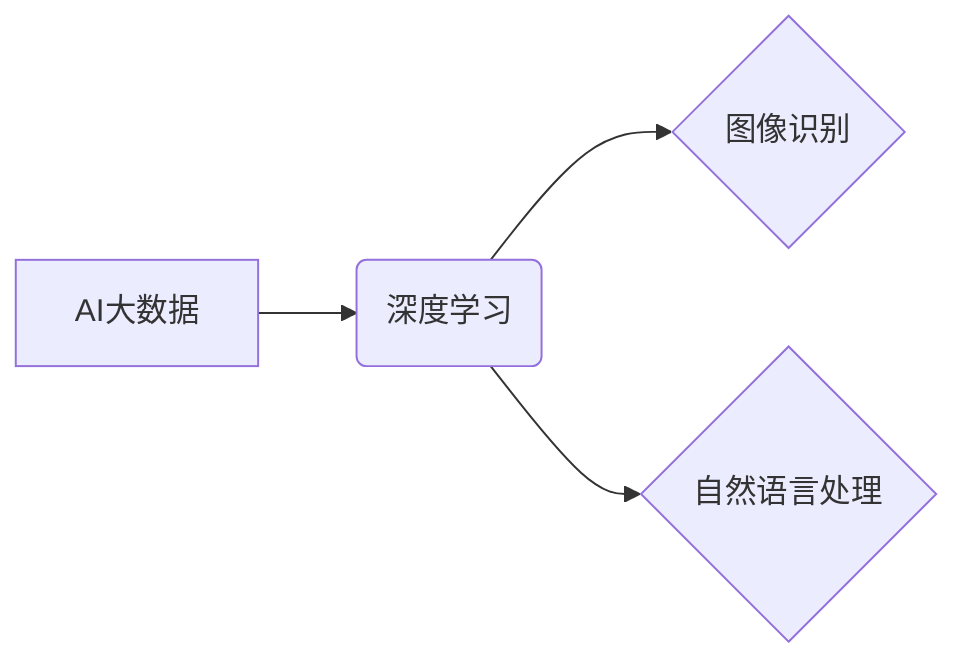

> 李飞飞, AI大数据, 深度学习, 图像识别, 自然语言处理, 计算机视觉, 人工智能, 数据科学

## 1. 背景介绍

人工智能（AI）正以惊人的速度发展，深刻地改变着我们生活的方方面面。在这个浪潮中，斯坦福大学计算机科学教授李飞飞无疑是一位领军人物。她不仅在人工智能领域取得了突破性的成就，更致力于推动AI技术的发展和应用，为构建更加智能、美好的未来贡献力量。

李飞飞的研究重点集中在计算机视觉和自然语言处理领域，她领导的团队在图像识别、物体检测、语音识别等方面取得了世界领先的成果。她的研究成果被广泛应用于自动驾驶、医疗诊断、智能家居等领域，为人们的生活带来了便利和改变。

## 2. 核心概念与联系

**2.1 AI大数据**

AI大数据是指用于训练和评估人工智能模型的海量数据。这些数据可以来自各种来源，例如图像、文本、音频、视频等。AI大数据的规模、多样性和复杂性是人工智能发展的重要驱动力。

**2.2 深度学习**

深度学习是人工智能领域的一个重要分支，它利用多层神经网络来模拟人类大脑的学习过程。深度学习算法能够从海量数据中自动提取特征，从而实现更准确、更智能的决策。

**2.3 图像识别**

图像识别是指计算机能够识别和理解图像内容的技术。它涉及到图像特征提取、分类、识别等多个环节。图像识别技术在医疗诊断、安防监控、自动驾驶等领域有着广泛的应用。

**2.4 自然语言处理**

自然语言处理是指计算机能够理解和处理人类语言的技术。它涉及到文本分析、机器翻译、语音识别等多个环节。自然语言处理技术在搜索引擎、聊天机器人、智能客服等领域有着广泛的应用。

**2.5 核心概念关系图**



## 3. 核心算法原理 & 具体操作步骤

**3.1 算法原理概述**

深度学习算法的核心是多层神经网络。神经网络由多个节点（神经元）组成，每个节点都连接着其他节点，并通过权重来传递信息。通过训练，神经网络能够学习到数据中的特征和模式，从而实现预测和分类等任务。

**3.2 算法步骤详解**

1. **数据预处理:** 将原始数据转换为深度学习算法可以理解的格式，例如将图像转换为像素矩阵，将文本转换为词向量等。
2. **网络结构设计:** 根据任务需求设计神经网络的结构，包括层数、节点数量、激活函数等。
3. **参数初始化:** 为神经网络中的权重和偏置赋予初始值。
4. **前向传播:** 将输入数据通过神经网络传递，计算输出结果。
5. **反向传播:** 计算输出结果与真实值的误差，并根据误差调整神经网络的权重和偏置。
6. **迭代训练:** 重复前向传播和反向传播的过程，直到模型的性能达到预期的水平。

**3.3 算法优缺点**

**优点:**

* 能够自动提取特征，无需人工特征工程。
* 能够处理海量数据，学习到更复杂的模式。
* 在图像识别、自然语言处理等领域取得了突破性成果。

**缺点:**

* 训练时间长，需要大量的计算资源。
* 对数据质量要求高，训练数据不足或质量差会导致模型性能下降。
* 模型解释性差，难以理解模型的决策过程。

**3.4 算法应用领域**

* **图像识别:** 人脸识别、物体检测、图像分类、医学影像分析等。
* **自然语言处理:** 机器翻译、文本摘要、情感分析、聊天机器人等。
* **语音识别:** 语音转文本、语音助手、语音搜索等。
* **自动驾驶:** 路况识别、目标检测、路径规划等。
* **医疗诊断:** 病理图像分析、疾病预测、药物研发等。

## 4. 数学模型和公式 & 详细讲解 & 举例说明

**4.1 数学模型构建**

深度学习模型通常采用多层感知机（MLP）或卷积神经网络（CNN）等结构。

**4.2 公式推导过程**

深度学习模型的训练过程基于梯度下降算法。目标函数通常是均方误差（MSE）或交叉熵损失函数（CE）。梯度下降算法通过计算目标函数的梯度，不断调整模型参数，使得目标函数值最小化。

**4.3 案例分析与讲解**

例如，在图像分类任务中，目标函数是将图像分类正确的概率最大化。通过训练，模型能够学习到图像特征和类别之间的映射关系，从而实现对新图像的分类。

**4.4 数学公式示例**

* **均方误差 (MSE):**

$$MSE = \frac{1}{n} \sum_{i=1}^{n} (y_i - \hat{y}_i)^2$$

其中，$y_i$ 是真实值，$\hat{y}_i$ 是预测值，$n$ 是样本数量。

* **交叉熵损失函数 (CE):**

$$CE = -\sum_{i=1}^{n} y_i \log(\hat{y}_i)$$

其中，$y_i$ 是真实值，$\hat{y}_i$ 是预测值。

## 5. 项目实践：代码实例和详细解释说明

**5.1 开发环境搭建**

使用Python语言和深度学习框架TensorFlow或PyTorch搭建开发环境。

**5.2 源代码详细实现**

```python
import tensorflow as tf

# 定义模型结构
model = tf.keras.models.Sequential([
    tf.keras.layers.Conv2D(32, (3, 3), activation='relu', input_shape=(28, 28, 1)),
    tf.keras.layers.MaxPooling2D((2, 2)),
    tf.keras.layers.Conv2D(64, (3, 3), activation='relu'),
    tf.keras.layers.MaxPooling2D((2, 2)),
    tf.keras.layers.Flatten(),
    tf.keras.layers.Dense(10, activation='softmax')
])

# 编译模型
model.compile(optimizer='adam',
              loss='sparse_categorical_crossentropy',
              metrics=['accuracy'])

# 训练模型
model.fit(x_train, y_train, epochs=10)

# 评估模型
loss, accuracy = model.evaluate(x_test, y_test)
print('Test loss:', loss)
print('Test accuracy:', accuracy)
```

**5.3 代码解读与分析**

这段代码定义了一个简单的卷积神经网络模型，用于手写数字识别任务。模型包含两层卷积层、两层最大池化层、一层全连接层和一层输出层。

**5.4 运行结果展示**

训练完成后，模型能够对新的手写数字图像进行识别。

## 6. 实际应用场景

**6.1 图像识别**

* **医疗诊断:** 识别病理图像中的异常区域，辅助医生诊断疾病。
* **安防监控:** 识别入侵者或可疑行为，提高安全防范水平。
* **自动驾驶:** 识别道路上的车辆、行人、交通信号灯等，辅助车辆自动驾驶。

**6.2 自然语言处理**

* **搜索引擎:** 理解用户搜索意图，提供更精准的搜索结果。
* **聊天机器人:** 与用户进行自然语言对话，提供信息服务或娱乐体验。
* **机器翻译:** 将文本从一种语言翻译成另一种语言。

**6.3 其他应用场景**

* **语音识别:** 将语音转换为文本，用于语音助手、语音搜索等应用。
* **推荐系统:** 根据用户的历史行为和偏好，推荐相关商品或内容。
* **金融风险控制:** 识别欺诈交易或异常行为，降低金融风险。

**6.4 未来应用展望**

随着AI技术的不断发展，其应用场景将更加广泛，例如：

* **个性化教育:** 根据学生的学习情况，提供个性化的学习方案。
* **智能医疗:** 利用AI技术辅助医生诊断疾病、制定治疗方案。
* **智慧城市:** 利用AI技术提高城市管理效率、提升居民生活质量。

## 7. 工具和资源推荐

**7.1 学习资源推荐**

* **斯坦福大学CS231n课程:** https://cs231n.stanford.edu/
* **DeepLearning.AI课程:** https://www.deeplearning.ai/
* **TensorFlow官方文档:** https://www.tensorflow.org/
* **PyTorch官方文档:** https://pytorch.org/

**7.2 开发工具推荐**

* **TensorFlow:** https://www.tensorflow.org/
* **PyTorch:** https://pytorch.org/
* **Keras:** https://keras.io/

**7.3 相关论文推荐**

* **AlexNet:** http://papers.nips.cc/paper/4824-imagenet-classification-with-deep-convolutional-neural-networks.pdf
* **VGGNet:** http://arxiv.org/abs/1409.1556
* **ResNet:** http://arxiv.org/abs/1512.03385

## 8. 总结：未来发展趋势与挑战

**8.1 研究成果总结**

近年来，人工智能领域取得了突破性的进展，深度学习算法在图像识别、自然语言处理等领域取得了显著成果。

**8.2 未来发展趋势**

* **模型规模和复杂度提升:** 模型参数数量和层数将继续增加，从而提高模型的表达能力和泛化能力。
* **数据驱动的AI:** 数据将成为人工智能发展的关键要素，海量数据将推动模型的训练和优化。
* **跨模态学习:** 模型将能够处理多种模态数据，例如图像、文本、音频等，从而实现更智能的交互和理解。
* **可解释性AI:** 研究如何提高模型的解释性，使得模型的决策过程更加透明和可理解。

**8.3 面临的挑战**

* **数据安全和隐私保护:** AI模型的训练和应用需要大量数据，如何保证数据安全和隐私保护是一个重要的挑战。
* **算法偏见和公平性:** AI模型可能存在算法偏见，导致不公平的结果，如何解决算法偏见和确保公平性是一个重要的研究方向。
* **伦理和社会影响:** AI技术的快速发展对社会和伦理带来挑战，需要认真思考AI技术的应用伦理和社会影响。

**8.4 研究展望**

未来，人工智能将继续朝着更智能、更安全、更可解释的方向发展。研究人员将继续探索新的算法、新的模型架构和新的应用场景，为构建更加智能、美好的未来贡献力量。

## 9. 附录：常见问题与解答

**9.1 如何选择合适的深度学习框架？**

TensorFlow和PyTorch是目前最流行的深度学习框架，选择哪个框架取决于个人喜好和项目需求。TensorFlow更适合于生产环境，PyTorch更适合于研究和开发。

**9.2 如何处理数据不平衡问题？**

数据不平衡问题是指训练数据中某些类别样本数量远少于其他类别样本的情况。可以采用数据增广、权重调整等方法来解决数据不平衡问题。

**9.3 如何评估模型性能？**

常用的模型性能评估指标包括准确率、召回率、F1-score等。选择合适的评估指标取决于具体的任务需求。


作者：禅与计算机程序设计艺术 / Zen and the Art of Computer Programming 
<end_of_turn>