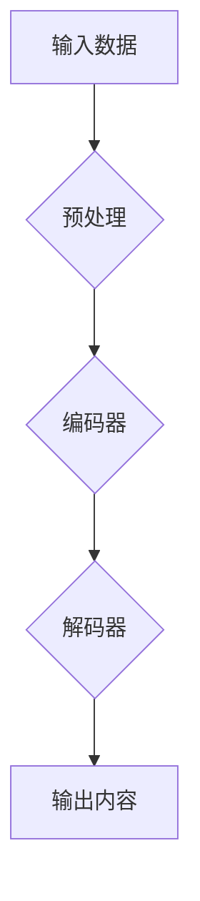

> 生成式AI，AIGC，自然语言处理，深度学习，Transformer，商业应用，未来趋势

## 1. 背景介绍

近年来，人工智能（AI）技术取得了飞速发展，特别是生成式人工智能（Generative AI）的兴起，为商业领域带来了前所未有的机遇。生成式AI是指能够根据输入数据生成新内容的AI模型，例如文本、图像、音频、视频等。与传统的AI模型相比，生成式AI更具创造性和灵活性，能够帮助企业自动化内容创作、个性化用户体验、提升运营效率等。

AIGC（AI-Generated Content）是生成式AI在内容创作领域的应用，它利用AI算法自动生成各种类型的文本内容，例如文章、博客、广告文案、产品描述、代码等。AIGC技术的发展，将深刻地改变内容创作方式，降低内容生产成本，提高内容生产效率，并为企业带来新的商业模式和增长点。

## 2. 核心概念与联系

**2.1 生成式AI的核心概念**

生成式AI的核心是学习数据中的模式和规律，并根据这些模式生成新的数据。它通常基于深度学习算法，例如Transformer模型，能够学习到复杂的文本结构和语义关系。

**2.2 AIGC与其他技术的联系**

AIGC技术与其他AI技术密切相关，例如：

* **自然语言处理（NLP）：** AIGC依赖于NLP技术来理解和生成文本内容。NLP技术包括词法分析、语法分析、语义分析等，帮助AI模型理解文本的含义和结构。
* **深度学习（Deep Learning）：** AIGC模型通常基于深度学习算法，例如Transformer模型，能够学习到复杂的文本模式和语义关系。
* **大数据（Big Data）：** AIGC模型需要大量的文本数据进行训练，大数据技术为AIGC提供了海量数据资源。

**2.3 AIGC的架构**



**2.4 AIGC的应用场景**

AIGC技术在各个领域都有广泛的应用场景，例如：

* **内容创作：** 自动生成文章、博客、广告文案、产品描述等。
* **客户服务：** 自动回复客户咨询，提供个性化服务。
* **教育培训：** 自动生成学习材料、测试题、个性化学习方案。
* **营销推广：** 自动生成营销文案、广告创意、社交媒体内容。

## 3. 核心算法原理 & 具体操作步骤

### 3.1 算法原理概述

AIGC的核心算法是基于深度学习的生成模型，其中Transformer模型是目前最先进的生成模型之一。Transformer模型利用注意力机制，能够捕捉文本中的长距离依赖关系，生成更流畅、更自然的文本内容。

### 3.2 算法步骤详解

1. **数据预处理：** 将原始文本数据进行清洗、分词、词向量化等预处理操作，以便模型训练。
2. **编码器训练：** 使用编码器将输入文本序列编码成一个固定长度的向量表示，该向量包含了文本的语义信息。
3. **解码器训练：** 使用解码器根据编码后的向量表示，生成目标文本序列。解码器通常使用自回归的方式，逐个生成文本词，并根据之前生成的词预测下一个词。
4. **模型评估：** 使用BLEU、ROUGE等指标评估模型生成的文本质量。
5. **模型调优：** 根据评估结果，调整模型参数，提高模型性能。

### 3.3 算法优缺点

**优点：**

* 生成文本质量高，能够生成流畅、自然的文本内容。
* 能够处理长文本序列，捕捉文本中的长距离依赖关系。
* 可扩展性强，可以应用于各种不同的文本生成任务。

**缺点：**

* 训练成本高，需要大量的计算资源和训练数据。
* 模型容易受到训练数据的影响，可能生成带有偏见或错误的信息。
* 缺乏对文本语义的深度理解，生成的文本可能缺乏逻辑性和连贯性。

### 3.4 算法应用领域

AIGC技术在各个领域都有广泛的应用场景，例如：

* **内容创作：** 自动生成文章、博客、广告文案、产品描述等。
* **客户服务：** 自动回复客户咨询，提供个性化服务。
* **教育培训：** 自动生成学习材料、测试题、个性化学习方案。
* **营销推广：** 自动生成营销文案、广告创意、社交媒体内容。

## 4. 数学模型和公式 & 详细讲解 & 举例说明

### 4.1 数学模型构建

AIGC模型通常基于Transformer模型，其核心是注意力机制。注意力机制允许模型关注输入序列中与当前生成词相关的部分，从而提高生成文本的质量和准确性。

### 4.2 公式推导过程

Transformer模型的注意力机制使用以下公式计算注意力权重：

$$
\text{Attention}(Q, K, V) = \text{softmax}\left(\frac{Q K^T}{\sqrt{d_k}}\right) V
$$

其中：

* $Q$：查询矩阵
* $K$：键矩阵
* $V$：值矩阵
* $d_k$：键向量的维度
* $\text{softmax}$：softmax函数，用于将注意力权重归一化

### 4.3 案例分析与讲解

假设我们想要生成一个关于“人工智能”的句子。输入序列为“人工智能是”，查询矩阵 $Q$ 为该序列的词嵌入向量，键矩阵 $K$ 和值矩阵 $V$ 为所有词的词嵌入向量。

注意力机制会计算每个词与“人工智能”之间的注意力权重，并将权重最高的词作为下一个生成词。例如，如果“人工智能”与“技术”之间的注意力权重最高，那么模型将生成“人工智能技术”。

## 5. 项目实践：代码实例和详细解释说明

### 5.1 开发环境搭建

AIGC项目开发环境通常需要以下软件：

* Python 3.x
* TensorFlow 或 PyTorch 深度学习框架
* CUDA 和 cuDNN GPU加速库
* Git 版本控制系统

### 5.2 源代码详细实现

以下是一个使用TensorFlow实现简单的AIGC模型的代码示例：

```python
import tensorflow as tf

# 定义模型结构
model = tf.keras.Sequential([
    tf.keras.layers.Embedding(input_dim=vocab_size, output_dim=embedding_dim),
    tf.keras.layers.LSTM(units=lstm_units),
    tf.keras.layers.Dense(units=vocab_size, activation='softmax')
])

# 编译模型
model.compile(optimizer='adam', loss='sparse_categorical_crossentropy', metrics=['accuracy'])

# 训练模型
model.fit(x_train, y_train, epochs=epochs)

# 生成文本
text = model.predict(input_sequence)
```

### 5.3 代码解读与分析

* **Embedding层：** 将输入词转换为词向量表示。
* **LSTM层：** 学习文本序列中的长距离依赖关系。
* **Dense层：** 将LSTM层的输出转换为每个词的概率分布。
* **softmax激活函数：** 将概率分布归一化，得到每个词的预测概率。

### 5.4 运行结果展示

训练完成后，可以使用模型生成新的文本内容。例如，输入“人工智能”，模型可能会生成“人工智能技术”。

## 6. 实际应用场景

### 6.1 内容创作

AIGC可以自动生成各种类型的文本内容，例如：

* **新闻报道：** 根据新闻数据自动生成新闻报道。
* **博客文章：** 根据特定主题自动生成博客文章。
* **广告文案：** 根据产品信息自动生成广告文案。
* **产品描述：** 根据产品参数自动生成产品描述。

### 6.2 客户服务

AIGC可以帮助企业自动化客户服务，例如：

* **自动回复客户咨询：** 根据客户问题自动生成回复。
* **提供个性化服务：** 根据客户需求生成个性化建议。
* **收集客户反馈：** 自动分析客户反馈，识别问题和改进方向。

### 6.3 教育培训

AIGC可以帮助教育机构自动化教学内容创作，例如：

* **自动生成学习材料：** 根据课程内容自动生成学习笔记、习题、测试题等。
* **提供个性化学习方案：** 根据学生的学习进度和能力自动生成个性化学习方案。
* **模拟考试场景：** 自动生成模拟考试题，帮助学生练习和评估。

### 6.4 未来应用展望

AIGC技术的发展将带来更多新的应用场景，例如：

* **虚拟助手：** 更智能、更人性化的虚拟助手，能够理解和响应用户的自然语言指令。
* **创意内容生成：** 自动生成创意内容，例如故事、诗歌、音乐等。
* **个性化推荐：** 根据用户的兴趣和偏好，自动生成个性化推荐内容。

## 7. 工具和资源推荐

### 7.1 学习资源推荐

* **书籍：**
    * 《深度学习》
    * 《自然语言处理》
    * 《Transformer模型》
* **在线课程：**
    * Coursera
    * edX
    * Udacity

### 7.2 开发工具推荐

* **TensorFlow：** 开源深度学习框架
* **PyTorch：** 开源深度学习框架
* **Hugging Face：** 提供预训练模型和工具

### 7.3 相关论文推荐

* **Attention Is All You Need：** Transformer模型的论文
* **BERT：** 预训练语言模型
* **GPT-3：** 大型语言模型

## 8. 总结：未来发展趋势与挑战

### 8.1 研究成果总结

AIGC技术取得了显著的进展，能够生成高质量的文本内容，并应用于多个领域。

### 8.2 未来发展趋势

* **模型规模和能力提升：** 未来AIGC模型将更加强大，能够处理更复杂的任务，生成更丰富的文本内容。
* **多模态生成：** AIGC将与其他模态技术融合，例如图像、音频、视频，实现多模态内容生成。
* **个性化定制：** AIGC将更加注重个性化定制，根据用户的需求生成个性化的内容。

### 8.3 面临的挑战

* **数据安全和隐私：** AIGC模型需要大量数据进行训练，如何保证数据安全和隐私是一个重要挑战。
* **模型可解释性和信任度：** AIGC模型的决策过程往往难以理解，如何提高模型的可解释性和信任度是一个关键问题。
* **伦理和社会影响：** AIGC技术可能带来一些伦理和社会问题，例如内容虚假、信息操控等，需要引起重视和探讨。

### 8.4 研究展望

未来AIGC研究将继续探索以下方向：

* **更有效的训练方法：** 降低模型训练成本，提高训练效率。
* **更强大的模型架构：** 设计更强大的模型架构，提升模型能力。
* **更安全的模型部署：** 确保模型安全可靠，防止恶意攻击和滥用。


## 9. 附录：常见问题与解答

**1. AIGC模型的训练数据有哪些？**

AIGC模型的训练数据通常包括大量的文本数据，例如书籍、文章、网站内容、对话记录等。

**2. AIGC模型的输出文本质量如何？**

AIGC模型生成的文本质量取决于模型的训练数据、模型架构和训练参数等因素。目前，AIGC模型能够生成高质量的文本内容，但仍然存在一些不足，例如缺乏逻辑性和连贯性。

**3. AIGC技术会取代人类作家吗？**

AIGC技术可以帮助人类作家提高效率，自动化一些重复性的工作，但它并不会完全取代人类作家。人类作家仍然拥有创造力和想象力，能够创作出独一无二的文本内容。

**4. AIGC技术有哪些伦理和社会问题？**

AIGC技术可能带来一些伦理和社会问题，例如内容虚假、信息操控