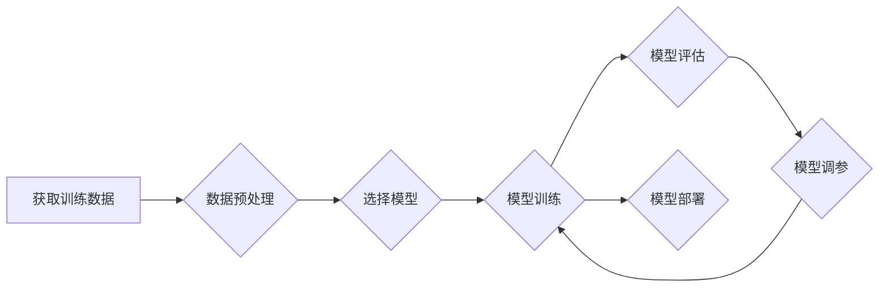

> 监督学习、机器学习、分类、回归、算法原理、代码实例、Python

## 1. 背景介绍

在当今数据爆炸的时代，机器学习作为人工智能的核心技术，在各个领域发挥着越来越重要的作用。其中，监督学习作为机器学习最基础也是应用最广泛的算法之一，在图像识别、自然语言处理、预测分析等领域取得了显著的成果。

监督学习的核心思想是通过已标记的数据集，训练模型学习数据的规律，从而能够对新的未标记数据进行预测或分类。简单来说，就是让机器“学习”从已有的数据中找出规律，并根据这些规律对新的数据进行判断。

## 2. 核心概念与联系

**2.1 监督学习的要素**

* **训练数据:** 监督学习的核心是训练数据，它包含了输入特征和对应的输出标签。例如，在图像分类任务中，训练数据包含了图像和对应的类别标签。
* **模型:** 模型是学习数据的映射关系，它通过学习训练数据中的规律，将输入特征映射到输出标签。
* **损失函数:** 损失函数用于衡量模型预测结果与真实标签之间的差异。模型训练的目标是通过调整模型参数，最小化损失函数的值。
* **优化算法:** 优化算法用于更新模型参数，使其能够最小化损失函数。常见的优化算法包括梯度下降法、Adam算法等。

**2.2 监督学习的类型**

* **分类:** 将数据分为多个类别。例如，图像识别、垃圾邮件分类等。
* **回归:** 预测连续值。例如，房价预测、股票价格预测等。

**2.3 监督学习流程**



## 3. 核心算法原理 & 具体操作步骤

### 3.1  算法原理概述

本节将介绍两种常见的监督学习算法：逻辑回归和线性回归。

**3.1.1 逻辑回归**

逻辑回归是一种用于二分类问题的算法。它将线性回归模型的输出映射到0到1之间的概率值，从而实现对数据的分类。

**3.1.2 线性回归**

线性回归是一种用于回归问题的算法。它试图找到一条直线或超平面，将输入特征与输出标签进行线性映射。

### 3.2  算法步骤详解

**3.2.1 逻辑回归步骤**

1. **数据预处理:** 对训练数据进行清洗、转换和特征工程。
2. **模型构建:** 使用逻辑回归模型，将输入特征映射到0到1之间的概率值。
3. **模型训练:** 使用梯度下降法等优化算法，调整模型参数，最小化损失函数。
4. **模型评估:** 使用测试数据评估模型的性能，例如准确率、召回率等。
5. **模型调参:** 根据评估结果，调整模型参数，例如学习率、正则化参数等，提高模型性能。

**3.2.2 线性回归步骤**

1. **数据预处理:** 对训练数据进行清洗、转换和特征工程。
2. **模型构建:** 使用线性回归模型，将输入特征与输出标签进行线性映射。
3. **模型训练:** 使用梯度下降法等优化算法，调整模型参数，最小化损失函数。
4. **模型评估:** 使用测试数据评估模型的性能，例如均方误差、R-squared等。
5. **模型调参:** 根据评估结果，调整模型参数，例如学习率、正则化参数等，提高模型性能。

### 3.3  算法优缺点

**3.3.1 逻辑回归**

* **优点:** 
    * 算法简单易懂，易于实现。
    * 训练速度快，适合处理大规模数据。
    * 可以输出概率值，方便进行概率分析。
* **缺点:** 
    * 只能处理线性可分的数据。
    * 对异常值敏感。

**3.3.2 线性回归**

* **优点:** 
    * 算法简单易懂，易于实现。
    * 训练速度快，适合处理大规模数据。
    * 可以解释模型的权重，方便进行特征分析。
* **缺点:** 
    * 只能处理线性关系的数据。
    * 对异常值敏感。

### 3.4  算法应用领域

**3.4.1 逻辑回归**

* **图像识别:** 将图像分类为不同的类别。
* **垃圾邮件分类:** 将邮件分类为垃圾邮件或正常邮件。
* **欺诈检测:** 判断交易是否为欺诈行为。

**3.4.2 线性回归**

* **房价预测:** 根据房屋特征预测房价。
* **股票价格预测:** 根据股票历史数据预测未来价格。
* **销售预测:** 根据市场数据预测未来销售额。

## 4. 数学模型和公式 & 详细讲解 & 举例说明

### 4.1  数学模型构建

**4.1.1 逻辑回归模型**

逻辑回归模型使用sigmoid函数将线性回归模型的输出映射到0到1之间的概率值。

$$
\hat{y} = \frac{1}{1 + e^{-(w^T x + b)}}
$$

其中：

* $\hat{y}$ 是预测的概率值。
* $w$ 是模型参数向量。
* $x$ 是输入特征向量。
* $b$ 是模型偏置项。
* $e$ 是自然常数。

**4.1.2 线性回归模型**

线性回归模型使用线性函数将输入特征与输出标签进行映射。

$$
\hat{y} = w^T x + b
$$

其中：

* $\hat{y}$ 是预测的输出值。
* $w$ 是模型参数向量。
* $x$ 是输入特征向量。
* $b$ 是模型偏置项。

### 4.2  公式推导过程

**4.2.1 逻辑回归损失函数**

逻辑回归常用的损失函数是交叉熵损失函数。

$$
L = -\frac{1}{n} \sum_{i=1}^{n} y_i \log(\hat{y}_i) + (1-y_i) \log(1-\hat{y}_i)
$$

其中：

* $n$ 是训练样本数量。
* $y_i$ 是第 $i$ 个样本的真实标签。
* $\hat{y}_i$ 是第 $i$ 个样本的预测概率值。

**4.2.2 线性回归损失函数**

线性回归常用的损失函数是均方误差损失函数。

$$
L = \frac{1}{n} \sum_{i=1}^{n} (y_i - \hat{y}_i)^2
$$

其中：

* $n$ 是训练样本数量。
* $y_i$ 是第 $i$ 个样本的真实标签。
* $\hat{y}_i$ 是第 $i$ 个样本的预测值。

### 4.3  案例分析与讲解

**4.3.1 逻辑回归案例**

假设我们有一个二分类问题，需要判断邮件是否为垃圾邮件。训练数据包含了邮件的特征，例如邮件主题、邮件内容、发送者等，以及邮件是否为垃圾邮件的标签。我们可以使用逻辑回归模型训练一个分类器，将新的邮件分类为垃圾邮件或正常邮件。

**4.3.2 线性回归案例**

假设我们有一个回归问题，需要预测房价。训练数据包含了房屋的特征，例如房屋面积、房屋位置、房屋朝向等，以及房屋的价格。我们可以使用线性回归模型训练一个预测器，根据房屋的特征预测房屋的价格。

## 5. 项目实践：代码实例和详细解释说明

### 5.1  开发环境搭建

本项目使用Python语言进行开发，需要安装以下软件包：

* NumPy
* Pandas
* Scikit-learn
* Matplotlib

可以使用pip命令安装这些软件包。

### 5.2  源代码详细实现

```python
import numpy as np
from sklearn.linear_model import LogisticRegression
from sklearn.model_selection import train_test_split
from sklearn.metrics import accuracy_score

# 加载数据
data = np.loadtxt('data.csv', delimiter=',')
X = data[:, :-1]
y = data[:, -1]

# 将数据分为训练集和测试集
X_train, X_test, y_train, y_test = train_test_split(X, y, test_size=0.2, random_state=42)

# 创建逻辑回归模型
model = LogisticRegression()

# 训练模型
model.fit(X_train, y_train)

# 预测测试集结果
y_pred = model.predict(X_test)

# 计算模型准确率
accuracy = accuracy_score(y_test, y_pred)
print(f'模型准确率: {accuracy}')
```

### 5.3  代码解读与分析

* **数据加载:** 使用numpy.loadtxt函数加载数据文件，并将数据转换为NumPy数组。
* **数据分割:** 使用sklearn.model_selection.train_test_split函数将数据分为训练集和测试集。
* **模型创建:** 使用sklearn.linear_model.LogisticRegression函数创建逻辑回归模型。
* **模型训练:** 使用模型的fit函数训练模型，将训练数据作为输入。
* **模型预测:** 使用模型的predict函数对测试数据进行预测。
* **模型评估:** 使用sklearn.metrics.accuracy_score函数计算模型的准确率。

### 5.4  运行结果展示

运行以上代码，将输出模型的准确率。

## 6. 实际应用场景

### 6.1  医疗诊断

* **疾病预测:** 根据患者的症状、病史、检查结果等数据，预测患者患某种疾病的概率。
* **辅助诊断:** 帮助医生分析患者的病情，提高诊断的准确性。

### 6.2  金融风险管理

* **欺诈检测:** 检测信用卡交易、银行转账等金融交易中的欺诈行为。
* **信用评分:** 根据客户的信用记录、收入、支出等数据，评估客户的信用风险。

### 6.3  电商推荐

* **商品推荐:** 根据用户的购买历史、浏览记录、兴趣爱好等数据，推荐用户可能感兴趣的商品。
* **个性化营销:** 根据用户的特征，进行个性化的营销推广。

### 6.4  未来应用展望

随着人工智能技术的不断发展，监督学习将在更多领域得到应用，例如自动驾驶、机器人、自然语言处理等。

## 7. 工具和资源推荐

### 7.1  学习资源推荐

* **书籍:**
    * 《机器学习》 - 周志华
    * 《深入理解机器学习》 - 
* **在线课程:**
    * Coursera: Machine Learning
    * edX: Artificial Intelligence

### 7.2  开发工具推荐

* **Python:** 
* **Scikit-learn:** 机器学习库
* **TensorFlow:** 深度学习框架
* **PyTorch:** 深度学习框架

### 7.3  相关论文推荐

* **《Support Vector Machines》** - Vapnik, V. N. (1995)
* **《A Probabilistic Approach to Automatic Document Understanding》** - Manning, C. D., & Schütze, H. (1999)

## 8. 总结：未来发展趋势与挑战

### 8.1  研究成果总结

监督学习在过去几十年取得了显著的成果，在各个领域都有广泛的应用。

### 8.2  未来发展趋势

* **模型复杂度提升:** 研究更复杂、更强大的监督学习模型，例如深度学习模型。
* **数据效率提升:** 研究如何利用更少的数据训练更准确的模型。
* **解释性增强:** 研究如何提高监督学习模型的解释性，使其能够更好地被理解和信任。

### 8.3  面临的挑战

* **数据质量问题:** 