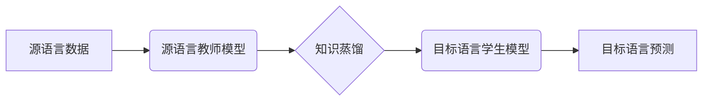

> 知识蒸馏，跨语言迁移学习，机器翻译，自然语言处理，模型压缩

## 1. 背景介绍

在当今数据爆炸的时代，深度学习模型在自然语言处理 (NLP) 领域取得了显著的成就。然而，训练高性能的深度学习模型通常需要大量的 labeled 数据和强大的计算资源，这对于许多低资源语言来说是一个巨大的挑战。跨语言迁移学习 (Cross-lingual Transfer Learning) 应运而生，旨在利用资源丰富的语言 (如英语) 上的知识，迁移到资源匮乏的语言 (如中文、西班牙语) 上，从而降低训练成本和数据需求。

知识蒸馏 (Knowledge Distillation) 作为一种模型压缩技术，通过将一个大型模型 (教师模型) 的知识“蒸馏”到一个小型模型 (学生模型) 中，从而实现模型压缩和性能提升。近年来，知识蒸馏在跨语言迁移学习中得到了广泛应用，可以有效地利用教师模型在源语言上的知识，帮助学生模型在目标语言上快速学习。

## 2. 核心概念与联系

**2.1 跨语言迁移学习**

跨语言迁移学习是指利用一种语言 (源语言) 上的知识，迁移到另一种语言 (目标语言) 上的学习过程。它可以分为以下几种类型：

* **无监督跨语言迁移学习:** 不需要任何目标语言的 labeled 数据，仅利用源语言和目标语言之间的语义相似性进行迁移。
* **半监督跨语言迁移学习:** 利用少量目标语言的 labeled 数据，结合源语言的知识进行迁移。
* **监督跨语言迁移学习:** 利用目标语言的 labeled 数据，结合源语言的知识进行迁移。

**2.2 知识蒸馏**

知识蒸馏是一种模型压缩技术，通过将一个大型模型 (教师模型) 的知识“蒸馏”到一个小型模型 (学生模型) 中，从而实现模型压缩和性能提升。

**2.3 知识蒸馏在跨语言迁移学习中的应用**

知识蒸馏可以有效地利用教师模型在源语言上的知识，帮助学生模型在目标语言上快速学习。

**2.4 知识蒸馏的优势**

* **模型压缩:** 学生模型通常比教师模型小得多，可以节省存储空间和计算资源。
* **性能提升:** 学生模型在目标语言上的性能通常与教师模型相当，甚至更好。
* **泛化能力增强:** 学生模型通常具有更好的泛化能力，可以更好地适应新的数据。

**2.5 Mermaid 流程图**



## 3. 核心算法原理 & 具体操作步骤

### 3.1 算法原理概述

知识蒸馏的核心思想是将教师模型的知识“蒸馏”到学生模型中。教师模型通常是一个大型、高性能的模型，而学生模型是一个小型、轻量级的模型。知识蒸馏通过最小化教师模型和学生模型的输出之间的差异，从而将教师模型的知识传递给学生模型。

### 3.2 算法步骤详解

1. **训练教师模型:** 使用源语言数据训练一个大型的教师模型。
2. **知识蒸馏:** 使用教师模型的输出作为监督信号，训练一个小型学生模型。
3. **评估学生模型:** 在目标语言数据上评估学生模型的性能。

### 3.3 算法优缺点

**优点:**

* 模型压缩: 学生模型通常比教师模型小得多，可以节省存储空间和计算资源。
* 性能提升: 学生模型在目标语言上的性能通常与教师模型相当，甚至更好。
* 泛化能力增强: 学生模型通常具有更好的泛化能力，可以更好地适应新的数据。

**缺点:**

* 需要一个预先训练好的教师模型。
* 知识蒸馏过程可能需要较长的训练时间。

### 3.4 算法应用领域

知识蒸馏在跨语言迁移学习中得到了广泛应用，例如:

* **机器翻译:** 利用英语教师模型的知识，训练中文机器翻译模型。
* **文本分类:** 利用英语教师模型的知识，训练中文文本分类模型。
* **情感分析:** 利用英语教师模型的知识，训练中文情感分析模型。

## 4. 数学模型和公式 & 详细讲解 & 举例说明

### 4.1 数学模型构建

知识蒸馏的目标是最小化教师模型和学生模型的输出之间的差异。可以使用交叉熵损失函数来衡量这种差异。

假设教师模型的输出为 $p_t$, 学生模型的输出为 $p_s$, 则交叉熵损失函数为:

$$
L = -\sum_{i=1}^{N} y_i \log p_{t_i} - \alpha \sum_{i=1}^{N} y_i \log p_{s_i}
$$

其中:

* $N$ 是样本数量。
* $y_i$ 是第 $i$ 个样本的真实标签。
* $p_{t_i}$ 是教师模型对第 $i$ 个样本的预测概率分布。
* $p_{s_i}$ 是学生模型对第 $i$ 个样本的预测概率分布。
* $\alpha$ 是一个超参数，用于控制教师模型和学生模型输出的权重。

### 4.2 公式推导过程

交叉熵损失函数的推导过程如下:

1. **定义交叉熵:** 交叉熵是衡量两个概率分布之间的差异的指标。
2. **应用到知识蒸馏:** 将交叉熵应用于教师模型和学生模型的输出，以衡量它们之间的差异。
3. **引入超参数:** 引入超参数 $\alpha$ 来控制教师模型和学生模型输出的权重。

### 4.3 案例分析与讲解

假设我们有一个英语教师模型和一个中文学生模型。我们希望利用英语教师模型的知识，帮助中文学生模型学习中文文本分类任务。

我们可以使用上述的交叉熵损失函数，将英语教师模型的输出作为监督信号，训练中文学生模型。

在训练过程中，我们可以调整超参数 $\alpha$ 的值，以控制教师模型和学生模型输出的权重。

## 5. 项目实践：代码实例和详细解释说明

### 5.1 开发环境搭建

* Python 3.7+
* PyTorch 1.7+
* CUDA 10.2+

### 5.2 源代码详细实现

```python
import torch
import torch.nn as nn

# 定义教师模型
class TeacherModel(nn.Module):
    # ...

# 定义学生模型
class StudentModel(nn.Module):
    # ...

# 定义知识蒸馏损失函数
def distillation_loss(teacher_output, student_output, temperature=1.0):
    # ...

# 训练学生模型
optimizer = torch.optim.Adam(student_model.parameters(), lr=0.001)
for epoch in range(num_epochs):
    for batch in dataloader:
        # ...
        student_output = student_model(input_data)
        loss = distillation_loss(teacher_output, student_output)
        optimizer.zero_grad()
        loss.backward()
        optimizer.step()

```

### 5.3 代码解读与分析

* **教师模型和学生模型:** 代码中定义了教师模型和学生模型的结构。教师模型通常是一个预先训练好的大型模型，而学生模型是一个小型模型。
* **知识蒸馏损失函数:** 代码中定义了知识蒸馏损失函数，用于衡量教师模型和学生模型的输出之间的差异。
* **训练过程:** 代码中展示了训练学生模型的过程，包括数据加载、模型前向传播、损失计算、反向传播和参数更新。

### 5.4 运行结果展示

训练完成后，可以将学生模型在目标语言数据上进行评估，并与其他模型进行比较。

## 6. 实际应用场景

### 6.1 机器翻译

知识蒸馏可以用于训练跨语言机器翻译模型。例如，可以使用英语教师模型的知识，训练中文到英语的机器翻译模型。

### 6.2 文本分类

知识蒸馏可以用于训练跨语言文本分类模型。例如，可以使用英语教师模型的知识，训练中文文本分类模型，用于识别中文文本的类别，如情感、主题、意图等。

### 6.3 情感分析

知识蒸馏可以用于训练跨语言情感分析模型。例如，可以使用英语教师模型的知识，训练中文情感分析模型，用于识别中文文本的情感倾向，如正面、负面、中性等。

### 6.4 未来应用展望

随着跨语言迁移学习和知识蒸馏技术的不断发展，未来将有更多新的应用场景出现，例如：

* **跨语言对话系统:** 利用知识蒸馏技术，训练跨语言对话系统，能够理解和生成多种语言的文本。
* **跨语言问答系统:** 利用知识蒸馏技术，训练跨语言问答系统，能够回答多种语言的问答问题。
* **跨语言文本生成:** 利用知识蒸馏技术，训练跨语言文本生成模型，能够生成多种语言的文本。

## 7. 工具和资源推荐

### 7.1 学习资源推荐

* **论文:**
    * Hinton, G., Vinyals, O., & Dean, J. (2015). Distilling the knowledge in a neural network. arXiv preprint arXiv:1503.02531.
    * Conneau, A., Kruszewski, G., Guzmán, F., Grave, E., & Boleda, G. (2018). Cross-lingual language model pretraining. arXiv preprint arXiv:1901.07291.
* **博客:**
    * https://towardsdatascience.com/knowledge-distillation-a-powerful-technique-for-model-compression-a3999619969c
    * https://blog.openai.com/language-unsupervised/

### 7.2 开发工具推荐

* **PyTorch:** https://pytorch.org/
* **TensorFlow:** https://www.tensorflow.org/

### 7.3 相关论文推荐

* **BERT:** Devlin, J., Chang, M. W., Lee, K., & Toutanova, K. (2018). BERT: Pre-training of deep bidirectional transformers for language understanding. arXiv preprint arXiv:1810.04805.
* **XLNet:** Yang, Z., Dai, Z., Yang, Y., Carbonell, J., Salakhutdinov, R., & Le, Q. V. (2019). XLNet: Generalized autoregressive pretraining for language understanding. arXiv preprint arXiv:1906.08237.
* **T5:** Raffel, C., Shazeer, N., Roberts, A., Lee, K., Narang, S., Matena, M., ... & Dean, J. (2019). Exploring the limits of transfer learning with a unified text-to-text transformer. arXiv preprint arXiv:1910.10683.

## 8. 总结：未来发展趋势与挑战

### 8.1 研究成果总结

知识蒸馏在跨语言迁移学习中取得了显著的成果，有效地利用了教师模型的知识，帮助学生模型在目标语言上快速学习。

### 8.2 未来发展趋势

* **更有效的知识蒸馏方法:** 研究更有效的知识蒸馏方法，例如利用教师模型的中间层输出，或者利用注意力机制进行知识蒸馏。
* **跨语言迁移学习的泛化能力:** 研究如何提高跨语言迁移学习的泛化能力，使其能够更好地适应新的语言和任务。
* **跨语言迁移学习的效率:** 研究如何提高跨语言迁移学习的效率，使其能够在更短的时间内完成训练。

### 8.3 面临的挑战

* **数据稀缺性:** 许多低资源语言的数据非常稀缺，这使得跨语言迁移学习的训练非常困难。
* **语言差异:** 不同语言之间存在着语法、词汇和语义上的差异，这使得跨语言迁移学习的训练更加复杂。
* **模型复杂度:** 跨语言迁移学习模型通常非常复杂，训练和部署成本很高。

###