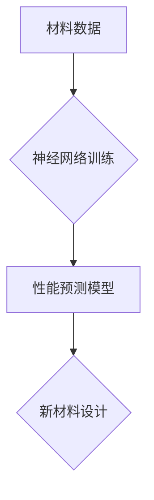

> 神经网络，材料科学，机器学习，预测，模拟，结构设计

## 1. 背景介绍

材料科学是研究物质的性质、结构、性能以及制备方法的学科。它与我们的日常生活息息相关，从我们使用的手机、电脑到建筑材料、医疗器械，都离不开材料科学的贡献。传统材料设计方法往往依赖于经验和试错，耗时费力，且难以探索新材料的可能性。近年来，随着人工智能（AI）技术的快速发展，特别是深度学习技术的突破，神经网络在材料科学中的应用逐渐受到关注，为材料设计和开发带来了新的机遇。

## 2. 核心概念与联系

**2.1  神经网络**

神经网络是一种模仿人脑神经网络结构的机器学习模型。它由多个相互连接的神经元组成，每个神经元接收输入信号，对其进行处理，并输出信号。通过训练，神经网络可以学习复杂的非线性关系，并进行预测、分类、识别等任务。

**2.2  材料科学**

材料科学研究物质的性质、结构、性能以及制备方法。材料的性能与其结构和组成密切相关。例如，金属的强度取决于其晶体结构和合金成分，而陶瓷的导电性取决于其化学键和缺陷结构。

**2.3  联系**

神经网络可以利用其强大的学习能力，从大量的材料数据中学习材料的结构-性能关系。通过训练神经网络，我们可以建立预测材料性能的模型，并根据预设的性能目标，设计新的材料结构。

**2.4  流程图**



## 3. 核心算法原理 & 具体操作步骤

**3.1  算法原理概述**

在材料科学中，常用的神经网络算法包括卷积神经网络（CNN）、循环神经网络（RNN）和多层感知机（MLP）。

* **CNN** 擅长处理图像数据，可以提取材料结构的特征，例如晶格结构、缺陷结构等。
* **RNN** 擅长处理序列数据，可以学习材料合成过程中的时间依赖关系。
* **MLP** 是一种全连接神经网络，可以用于预测材料的各种性能指标，例如硬度、强度、导电性等。

**3.2  算法步骤详解**

1. **数据收集和预处理:** 收集大量的材料数据，包括材料结构、组成、性能等信息。对数据进行清洗、标准化和转换，使其适合神经网络训练。
2. **模型选择和搭建:** 根据具体的应用场景选择合适的网络架构，例如CNN、RNN或MLP。
3. **模型训练:** 使用训练数据训练神经网络模型，调整模型参数，使其能够准确预测材料性能。
4. **模型评估:** 使用测试数据评估模型的性能，例如准确率、召回率、F1-score等。
5. **模型应用:** 将训练好的模型应用于新材料的设计和开发，预测新材料的性能，并指导材料合成实验。

**3.3  算法优缺点**

* **优点:**
    * 能够学习复杂的非线性关系，预测材料性能。
    * 可以处理大规模数据，加速材料设计流程。
    * 可以探索新材料的可能性，发现潜在的优良材料。
* **缺点:**
    * 需要大量的训练数据，数据质量对模型性能影响较大。
    * 模型解释性较差，难以理解模型的决策过程。
    * 对于一些复杂材料，模型的预测精度可能有限。

**3.4  算法应用领域**

* **新材料设计:** 预测新材料的性能，指导材料合成实验。
* **材料性能优化:** 优化现有材料的性能，例如提高强度、降低成本。
* **材料缺陷预测:** 预测材料中的缺陷，提高材料的可靠性。
* **材料失效分析:** 分析材料失效的原因，提高材料的安全性。

## 4. 数学模型和公式 & 详细讲解 & 举例说明

**4.1  数学模型构建**

神经网络的数学模型可以表示为一个多层感知机，其中每一层包含多个神经元。每个神经元接收来自上一层的输出信号，对其进行加权求和，并通过激活函数进行非线性变换，输出到下一层。

**4.2  公式推导过程**

假设一个神经网络有 L 层，每层的神经元数量分别为 N1, N2, ..., NL。第 l 层的第 i 个神经元的输出为：

```latex
h_i^l = f( \sum_{j=1}^{N_{l-1}} w_{ij}^{l} * h_j^{l-1} + b_i^l )
```

其中：

* $h_i^l$ 是第 l 层第 i 个神经元的输出。
* $w_{ij}^{l}$ 是第 l 层第 i 个神经元与第 l-1 层第 j 个神经元的连接权重。
* $h_j^{l-1}$ 是第 l-1 层第 j 个神经元的输出。
* $b_i^l$ 是第 l 层第 i 个神经元的偏置项。
* $f$ 是激活函数，例如 sigmoid 函数、ReLU 函数等。

**4.3  案例分析与讲解**

例如，在预测材料的硬度时，我们可以使用一个多层感知机，输入材料的化学成分、晶体结构等信息，输出材料的硬度值。通过训练神经网络，我们可以学习材料的结构-硬度关系，并预测新材料的硬度。

## 5. 项目实践：代码实例和详细解释说明

**5.1  开发环境搭建**

* Python 3.x
* TensorFlow 或 PyTorch 深度学习框架
* NumPy 科学计算库
* Matplotlib 数据可视化库

**5.2  源代码详细实现**

```python
import tensorflow as tf

# 定义模型结构
model = tf.keras.models.Sequential([
    tf.keras.layers.Dense(64, activation='relu', input_shape=(10,)),
    tf.keras.layers.Dense(32, activation='relu'),
    tf.keras.layers.Dense(1)
])

# 编译模型
model.compile(optimizer='adam', loss='mse')

# 训练模型
model.fit(X_train, y_train, epochs=100)

# 评估模型
loss, accuracy = model.evaluate(X_test, y_test)
print('Loss:', loss)
print('Accuracy:', accuracy)
```

**5.3  代码解读与分析**

* 代码首先定义了一个多层感知机模型，包含三个全连接层。
* 每个全连接层都使用 ReLU 激活函数，除了最后一层使用线性激活函数。
* 模型使用 Adam 优化器和均方误差损失函数进行训练。
* 训练完成后，使用测试数据评估模型的性能。

**5.4  运行结果展示**

训练完成后，可以将模型应用于预测新材料的性能。例如，可以输入新材料的化学成分和晶体结构，模型将输出该材料的硬度值。

## 6. 实际应用场景

**6.1  新材料设计**

神经网络可以帮助科学家设计新的材料，例如高强度轻质材料、高导电材料、高耐热材料等。

**6.2  材料性能优化**

神经网络可以帮助工程师优化现有材料的性能，例如提高材料的强度、降低材料的成本、提高材料的耐腐蚀性等。

**6.3  材料缺陷预测**

神经网络可以帮助工程师预测材料中的缺陷，例如晶格缺陷、空位缺陷、杂质缺陷等。

**6.4  未来应用展望**

随着人工智能技术的不断发展，神经网络在材料科学中的应用将更加广泛和深入。未来，神经网络将能够帮助我们设计出更加优良的材料，并加速材料科学的进步。

## 7. 工具和资源推荐

**7.1  学习资源推荐**

* **书籍:**
    * Deep Learning by Ian Goodfellow, Yoshua Bengio, and Aaron Courville
    * Hands-On Machine Learning with Scikit-Learn, Keras & TensorFlow by Aurélien Géron
* **在线课程:**
    * TensorFlow Tutorials: https://www.tensorflow.org/tutorials
    * PyTorch Tutorials: https://pytorch.org/tutorials/

**7.2  开发工具推荐**

* **TensorFlow:** https://www.tensorflow.org/
* **PyTorch:** https://pytorch.org/
* **Keras:** https://keras.io/

**7.3  相关论文推荐**

* **Neural Network-Based Materials Discovery: A Review**
* **Accelerating Materials Discovery with Machine Learning**
* **Deep Learning for Materials Science: A Comprehensive Review**

## 8. 总结：未来发展趋势与挑战

**8.1  研究成果总结**

神经网络在材料科学中的应用取得了显著的进展，能够有效预测材料性能，加速材料设计和开发。

**8.2  未来发展趋势**

* **模型复杂度提升:** 开发更复杂、更强大的神经网络模型，能够学习更复杂的材料结构-性能关系。
* **数据规模扩大:** 收集和构建更庞大的材料数据，提高模型的训练精度和泛化能力。
* **多模态数据融合:** 将不同类型的数据，例如结构数据、性能数据、实验数据等融合在一起，提高模型的预测精度。
* **解释性增强:** 研究如何提高神经网络模型的解释性，使模型的决策过程更加透明。

**8.3  面临的挑战**

* **数据质量:** 材料数据的质量对模型性能影响较大，需要开发更有效的材料数据采集和处理方法。
* **模型解释性:** 神经网络模型的决策过程难以解释，需要开发更有效的模型解释方法。
* **计算资源:** 训练大型神经网络模型需要大量的计算资源，需要开发更有效的训练方法和硬件平台。

**8.4  研究展望**

未来，神经网络将继续在材料科学领域发挥重要作用，推动材料科学的进步，为人类社会创造更多价值。

## 9. 附录：常见问题与解答

**9.1  Q: 神经网络在材料科学中的应用有哪些？**

**A:** 神经网络在材料科学中的应用非常广泛，包括新材料设计、材料性能优化、材料缺陷预测、材料失效分析等。

**9.2  Q: 如何选择合适的深度学习框架？**

**A:** TensorFlow 和 PyTorch 是目前最流行的深度学习框架，选择哪个框架取决于个人喜好和项目需求。

**9.3  Q: 如何评估神经网络模型的性能？**

**A:** 可以使用准确率、召回率、F1-score 等指标评估神经网络模型的性能。

**9.4  Q: 如何提高神经网络模型的性能？**

**A:** 可以通过增加训练数据、调整模型结构、优化模型参数等方法提高神经网络模型的性能。


作者：禅与计算机程序设计艺术 / Zen and the Art of Computer Programming 
<end_of_turn>