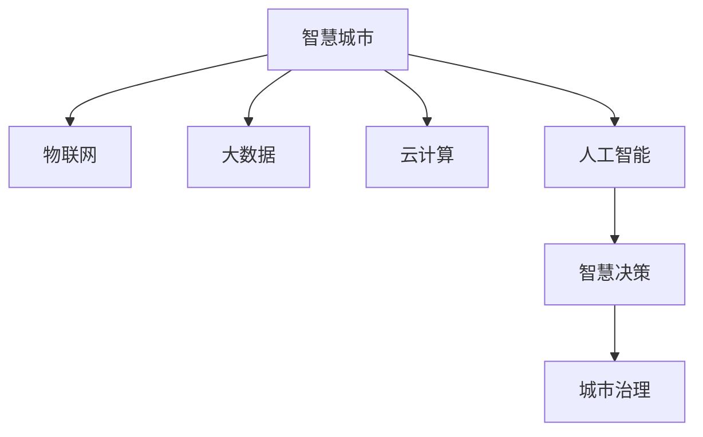

                 

# 利用技术优势进行智慧城市解决方案创新

> 关键词：智慧城市，技术创新，物联网，大数据，人工智能，智慧决策，城市治理

## 1. 背景介绍

随着全球城市化进程的不断推进，智慧城市建设已经成为各国政府和企业在提升城市生活质量、优化公共服务、应对复杂城市挑战等方面的重要战略。智慧城市构建的核心在于信息技术的应用，通过融合物联网(IoT)、大数据、云计算、人工智能(AI)等先进技术手段，实现城市运行的智能化、高效化、精细化和可预测性。

技术创新是智慧城市发展的关键驱动力，其应用不仅限于交通管理、公共安全、能源优化等具体领域，还涵盖了智慧决策、城市规划、应急响应等高层次治理模块。然而，现有的技术框架和应用范式在处理复杂多变的城市问题时仍存在诸多不足，亟需新的技术突破。

本文聚焦于利用技术优势进行智慧城市解决方案的创新，重点探讨了如何在大数据和人工智能技术的支持下，优化城市资源配置、提升公共服务效率、强化智慧治理能力，从而构建更加智能、高效、可持续发展的智慧城市。

## 2. 核心概念与联系

### 2.1 核心概念概述

- **智慧城市**：运用物联网、云计算、大数据、人工智能等技术手段，实现城市运行的高度智能化、高效化和精细化管理，提升城市居民的生活质量和城市的可持续性。

- **物联网(IoT)**：通过传感器、标签、RFID等技术，将各种物理对象连接入网络，实现城市各系统组件的信息共享和实时监控。

- **大数据**：指城市中积累的各类结构化和非结构化数据，通过数据挖掘和分析，为城市管理提供决策支持和优化建议。

- **云计算**：通过互联网提供按需资源访问，支持数据处理、存储和应用服务的弹性扩展，保障智慧城市架构的稳定性和可扩展性。

- **人工智能**：利用机器学习、深度学习等技术，实现数据的智能分析、预测和决策，辅助城市运行和管理的智能化水平。

- **智慧决策**：通过智能算法和模型，对城市运行中的数据进行分析和预测，支持城市管理者作出科学、高效的决策。

- **城市治理**：涵盖城市规划、环境保护、资源管理、应急响应等各个方面，实现城市运行的整体优化和治理能力的提升。

这些核心概念之间的逻辑关系可以通过以下Mermaid流程图来展示：



这个流程图展示了大数据和人工智能技术在智慧城市建设中的核心作用，以及它们与城市治理的紧密联系。

## 3. 核心算法原理 & 具体操作步骤

### 3.1 算法原理概述

智慧城市解决方案的创新，核心在于如何利用先进技术手段，将城市运行中的海量数据转化为有价值的决策支持信息。这其中，大数据分析和人工智能技术扮演着关键角色。

- **大数据分析**：通过ETL(Extract-Transform-Load)流程，从城市各系统中收集和整合数据，利用各种数据挖掘和分析算法，提取关键信息和模式，为智慧决策提供数据基础。

- **人工智能**：利用机器学习、深度学习等技术，对城市运行数据进行建模和预测，辅助城市管理者进行决策。常用的AI技术包括强化学习、迁移学习、增量学习等。

### 3.2 算法步骤详解

智慧城市解决方案的实现通常包括以下几个关键步骤：

**Step 1: 数据采集与预处理**

- 从城市各系统中采集数据，包括交通流量、能耗数据、公共服务使用情况、环境监测数据等。
- 对数据进行清洗和预处理，包括去除异常值、处理缺失数据、进行特征工程等，保证数据质量和一致性。

**Step 2: 数据存储与管理**

- 利用云计算平台，构建集中式或分布式的数据存储架构，支持大规模数据的存储和访问。
- 设计数据治理和数据管理策略，保障数据安全性和隐私保护。

**Step 3: 数据分析与建模**

- 对收集的数据进行深度分析，提取有价值的信息和模式，如交通流量高峰期、能耗优化方案、公共服务需求等。
- 构建数据模型，利用AI技术对城市运行进行预测和决策支持，如交通流量预测、能源需求预测、公共安全预警等。

**Step 4: 智慧决策与执行**

- 基于数据分析结果，辅助城市管理者进行决策，如调整交通信号灯配时、优化能源供应、调整公共服务资源分配等。
- 通过物联网技术实现智慧决策的执行，如自动控制交通信号、智能调节能源使用、自动化处理公共服务请求等。

**Step 5: 评估与优化**

- 对智慧决策和执行结果进行评估，如交通流量变化、能耗优化效果、公共服务满意度等。
- 根据评估结果，不断优化模型和策略，提升智慧城市的运行效率和用户体验。

### 3.3 算法优缺点

利用大数据和人工智能技术进行智慧城市解决方案创新，具有以下优点：

1. **全面性**：能够从城市运行的全局视角进行分析，揭示深层次的模式和规律，实现对城市运行的全面管理和优化。
2. **高效性**：通过自动化算法和模型，实现数据的快速处理和决策支持，缩短决策时间，提升管理效率。
3. **精准性**：通过科学的数据建模和预测算法，提高决策的精准度和可靠性。
4. **可扩展性**：依托云计算平台，智慧城市解决方案具备良好的可扩展性和弹性。

同时，该方法也存在一些局限性：

1. **数据依赖性强**：智慧城市解决方案高度依赖高质量的城市数据，数据收集和预处理成本较高。
2. **算法复杂度大**：大规模数据分析和复杂模型的构建需要较强的技术和计算资源，实施难度较大。
3. **隐私安全风险**：城市数据的敏感性要求严格的隐私保护措施，否则可能带来数据泄露和滥用风险。
4. **模型偏差问题**：AI模型可能继承输入数据的偏差，导致决策结果出现偏差，影响公平性和可信度。

尽管存在这些局限性，但总体而言，基于大数据和人工智能的智慧城市解决方案具有巨大的应用潜力，能够显著提升城市管理的智能化和高效化水平。

### 3.4 算法应用领域

智慧城市解决方案的大数据和人工智能技术，已经广泛应用于城市运行的各个方面，例如：

- **交通管理**：利用智能交通系统，优化交通信号灯配时，缓解交通拥堵，提升公共交通效率。
- **公共安全**：通过视频监控、犯罪预测等手段，提升公共安全防范能力，快速响应突发事件。
- **能源管理**：通过智能能源监测和优化，降低能耗，实现节能减排。
- **环境监测**：利用传感器网络，实时监测空气质量、水质等环境指标，提升城市环境质量。
- **公共服务**：优化公共服务资源的分配和调度，如智能垃圾处理、智能化图书馆等，提升居民生活质量。

除了上述这些经典应用外，智慧城市解决方案还在智能安防、智慧医疗、智慧农业等领域得到了广泛应用，推动了城市管理的智能化和信息化水平。

## 4. 数学模型和公式 & 详细讲解 & 举例说明

### 4.1 数学模型构建

在智慧城市解决方案中，常用的数学模型包括时间序列模型、回归模型、分类模型、聚类模型等。这里以时间序列预测为例，介绍基本的数学模型构建过程。

假设城市某区域每天的能耗数据为 $y_t$，时间为 $t$，能耗数据的时间序列模型可以表示为：

$$
y_t = \alpha + \beta y_{t-1} + \gamma \epsilon_t
$$

其中 $\alpha$ 和 $\beta$ 为模型参数，$\epsilon_t$ 为随机扰动项。该模型可以预测未来时间点的能耗数据，如每天的能耗情况。

### 4.2 公式推导过程

1. **时间序列模型的建立**：
   - 根据时间序列数据，通过最小二乘法等方法，求出模型参数 $\alpha$ 和 $\beta$，即：
   $$
   \alpha, \beta = \mathop{\arg\min}_{\alpha, \beta} \sum_{t=1}^N (y_t - \alpha - \beta y_{t-1})^2
   $$
   - 其中 $N$ 为时间序列长度。

2. **预测未来数据**：
   - 在模型参数 $\alpha$ 和 $\beta$ 求出后，可以用于预测未来时间点的能耗数据，即：
   $$
   \hat{y}_{t+1} = \alpha + \beta \hat{y}_t + \gamma \epsilon_{t+1}
   $$
   - 其中 $\hat{y}_{t+1}$ 为未来时间点的预测能耗数据。

3. **模型验证与优化**：
   - 利用历史数据和预测数据的对比，计算模型预测误差，如均方误差(MSE)，对模型进行验证和优化：
   $$
   MSE = \frac{1}{N} \sum_{t=1}^N (\hat{y}_t - y_t)^2
   $$
   - 如果 MSE 较大，则需调整模型参数或引入更复杂的模型结构。

### 4.3 案例分析与讲解

以智能交通流量预测为例，介绍如何利用时间序列模型进行智慧城市解决方案的实际应用。

**案例背景**：某城市交通管理部门希望通过智慧交通系统，预测主要路口的交通流量，以便实时调整交通信号灯配时，缓解交通拥堵。

**数据准备**：收集某时间段内该路口的交通流量数据，并对其进行清洗和预处理。

**模型构建**：利用时间序列模型对交通流量数据进行建模，建立交通流量预测模型：
$$
y_t = \alpha + \beta y_{t-1} + \gamma \epsilon_t
$$
其中 $y_t$ 为某时间点的交通流量数据。

**模型训练**：利用历史交通流量数据对模型进行训练，求出模型参数 $\alpha$ 和 $\beta$。

**流量预测**：使用训练好的模型对未来时间点的交通流量进行预测，如预测明天某一时间点的交通流量。

**模型评估**：利用实际交通流量数据与预测数据进行对比，评估模型预测效果，不断优化模型参数。

通过智能交通流量预测，可以实时调整交通信号灯配时，实现交通流量的动态优化，提升交通系统的运行效率。

## 5. 项目实践：代码实例和详细解释说明

### 5.1 开发环境搭建

要进行智慧城市解决方案的开发，需要搭建一个完整的开发环境。以下是使用Python进行智慧城市应用开发的环境配置流程：

1. 安装Anaconda：从官网下载并安装Anaconda，用于创建独立的Python环境。

2. 创建并激活虚拟环境：
```bash
conda create -n urban-dev python=3.8 
conda activate urban-dev
```

3. 安装相关依赖库：
```bash
pip install pandas numpy scikit-learn tensorflow transformers
```

4. 安装TensorFlow：
```bash
pip install tensorflow
```

5. 安装TensorBoard：
```bash
pip install tensorboard
```

6. 安装相关数据处理工具：
```bash
pip install pydeck geopandas folium
```

完成上述步骤后，即可在`urban-dev`环境中开始智慧城市应用开发。

### 5.2 源代码详细实现

这里我们以智能交通流量预测为例，给出使用TensorFlow和TensorBoard进行智慧城市应用开发的代码实现。

首先，准备交通流量数据集并进行预处理：

```python
import pandas as pd
import numpy as np

# 读取交通流量数据
data = pd.read_csv('traffic_flow.csv')

# 数据清洗与预处理
data = data.dropna().reset_index(drop=True)
data['date'] = pd.to_datetime(data['date'])
data = data.groupby('date').sum().reset_index()

# 将日期转换为时间序列
data['hour'] = data['date'].dt.hour

# 分割训练集和测试集
train_data = data[data['hour'] < 12]
test_data = data[data['hour'] >= 12]

# 特征工程
features = train_data.drop(['hour', 'flow'], axis=1)
targets = train_data['flow']
```

然后，定义模型并进行训练：

```python
import tensorflow as tf
from tensorflow.keras.models import Sequential
from tensorflow.keras.layers import Dense, LSTM, Dropout
from tensorflow.keras.optimizers import Adam

# 定义LSTM模型
model = Sequential([
    LSTM(64, return_sequences=True, input_shape=(features.shape[1], 1)),
    LSTM(64, return_sequences=False),
    Dense(1)
])

# 编译模型
model.compile(optimizer=Adam(), loss='mse')

# 训练模型
history = model.fit(features, targets, batch_size=32, epochs=50, validation_data=(test_data, test_data))
```

接着，使用TensorBoard进行模型训练的可视化：

```python
import tensorflow_addons as addons
from tensorflow.keras.callbacks import TensorBoard

# 定义TensorBoard回调
tensorboard_callback = TensorBoard(log_dir='logs', histogram_freq=1)

# 训练模型并记录TensorBoard日志
model.fit(features, targets, batch_size=32, epochs=50, callbacks=[tensorboard_callback])
```

最后，进行模型评估和预测：

```python
import matplotlib.pyplot as plt

# 绘制训练和验证损失曲线
plt.plot(history.history['loss'], label='train')
plt.plot(history.history['val_loss'], label='val')
plt.legend()
plt.show()

# 对测试集进行预测
predicted = model.predict(test_data)
test_data['predicted_flow'] = predicted

# 输出预测结果
print(test_data[['date', 'flow', 'predicted_flow']])
```

以上就是使用TensorFlow进行智能交通流量预测的完整代码实现。可以看到，借助TensorFlow和TensorBoard，我们可以方便地构建和训练模型，并通过可视化工具对训练过程进行监控和评估。

### 5.3 代码解读与分析

让我们再详细解读一下关键代码的实现细节：

**数据预处理**：
- 使用Pandas库进行数据清洗和预处理，去除缺失值，并将日期转换为时间序列。

**模型构建**：
- 利用TensorFlow的Sequential模型构建LSTM网络，用于时间序列预测。
- LSTM层包含64个神经元，通过两层LSTM层和全连接层进行预测。

**模型训练**：
- 使用Adam优化器和均方误差损失函数进行模型训练。
- 在每个epoch后，利用TensorBoard回调记录训练损失和验证损失。

**模型评估**：
- 使用Matplotlib库绘制训练和验证损失曲线，评估模型效果。
- 对测试集进行预测，并将预测结果与真实数据进行对比。

通过这些步骤，我们可以实现对智慧城市解决方案的实际应用，并进行有效的评估和优化。

## 6. 实际应用场景

### 6.1 智能交通管理

智能交通管理是智慧城市建设的重要组成部分，通过引入大数据和人工智能技术，可以实现对交通流的精准预测和优化。具体应用场景包括：

- **交通流量监测与预测**：利用物联网传感器和摄像头，实时监测交通流量数据，通过时间序列模型或深度学习模型，预测未来交通流量，辅助交通信号灯配时调整。
- **道路拥堵预警**：通过分析实时交通数据，提前预测道路拥堵情况，快速响应交通事件，避免拥堵高峰。
- **公共交通优化**：利用大数据分析，优化公交车辆调度，提升公共交通系统的效率和覆盖率。

### 6.2 公共安全管理

智慧城市解决方案在大数据和人工智能技术的支持下，能够实现对公共安全的全面监测和管理。具体应用场景包括：

- **视频监控分析**：利用深度学习算法，实时分析视频监控数据，识别异常行为和事件，如盗窃、火灾等，提高应急响应速度。
- **犯罪预测**：通过历史犯罪数据和实时监控数据，预测犯罪行为，及时采取防范措施。
- **安全事件预警**：利用数据分析模型，预测可能发生的公共安全事件，提前做好防范准备。

### 6.3 能源管理

智慧能源管理系统通过大数据和人工智能技术，实现对城市能源的智能化管理和优化。具体应用场景包括：

- **能耗监测与预测**：利用传感器网络实时监测能耗数据，通过时间序列模型进行能耗预测，优化能源分配。
- **能源消耗优化**：根据预测结果，动态调整能源使用策略，降低能耗，提升能源利用效率。
- **智能电网**：通过大数据分析，优化电力供应和需求，提高电网运行的稳定性和效率。

### 6.4 智慧城市应急响应

智慧城市解决方案在应急响应中也发挥着重要作用。具体应用场景包括：

- **灾害预测与预警**：利用气象数据和历史灾害数据，预测自然灾害，提前发布预警信息。
- **资源调配**：在灾害发生后，通过智能算法优化资源调配，如救援物资、医疗资源等，提升应急响应效率。
- **灾情监测与评估**：实时监测灾情信息，评估灾情严重程度，指导救援工作。

## 7. 工具和资源推荐

### 7.1 学习资源推荐

为了帮助开发者系统掌握智慧城市解决方案的理论基础和实践技巧，这里推荐一些优质的学习资源：

1. **《智慧城市技术手册》**：由国内外智慧城市专家编写，系统介绍了智慧城市构建的各类关键技术和应用案例。
2. **智慧城市开源项目**：如IoT平台MQTT、城市大数据平台Apache Hadoop、智能分析工具Spark等，提供丰富的技术栈资源。
3. **在线课程和认证**：如Coursera、edX等平台上的智慧城市相关课程，涵盖智慧交通、智慧能源、智慧医疗等多个领域。
4. **开源软件工具**：如TensorFlow、PyTorch、Keras等深度学习框架，提供丰富的API和模型库。
5. **技术社区和论坛**：如Stack Overflow、GitHub、Kaggle等平台，提供交流学习、共享资源的机会。

通过对这些资源的学习实践，相信你一定能够快速掌握智慧城市解决方案的精髓，并用于解决实际的智慧城市问题。

### 7.2 开发工具推荐

高效的开发离不开优秀的工具支持。以下是几款用于智慧城市解决方案开发的常用工具：

1. **Jupyter Notebook**：支持Python编程的交互式开发环境，方便进行数据处理、模型构建和结果展示。
2. **PyTorch**：基于Python的开源深度学习框架，支持动态图和静态图计算，易于快速迭代研究。
3. **TensorFlow**：由Google主导开发的深度学习框架，支持分布式计算和模型优化，适用于大规模工程应用。
4. **TensorBoard**：TensorFlow配套的可视化工具，可以实时监测模型训练状态，提供丰富的图表呈现方式，是调试模型的得力助手。
5. **Geopandas**：基于Pandas库的空间数据处理工具，支持空间数据与分析。
6. **Folium**：支持地图可视化的Python库，方便展示智慧城市解决方案中的地理数据。

合理利用这些工具，可以显著提升智慧城市解决方案的开发效率，加快创新迭代的步伐。

### 7.3 相关论文推荐

智慧城市解决方案的研究源于学界的持续研究。以下是几篇奠基性的相关论文，推荐阅读：

1. **“A Survey on Smart Cities: Challenges and Opportunities for Smart City Solutions”**：系统回顾了智慧城市的研究现状、技术框架和应用案例。
2. **“Towards a Unified Smart City Framework”**：提出了智慧城市统一框架，涵盖物联网、大数据、人工智能等关键技术。
3. **“Intelligent Transportation Systems: A Survey”**：介绍了智慧交通系统的关键技术和应用，提供了智慧交通解决方案的深入分析。
4. **“Smart City Security and Privacy: Challenges and Opportunities”**：探讨了智慧城市安全与隐私保护的难点和策略。
5. **“Artificial Intelligence in Smart Cities: Challenges and Opportunities”**：介绍了AI技术在智慧城市中的应用，分析了存在的问题和未来发展方向。

这些论文代表了大数据和人工智能技术在智慧城市建设中的应用前景，通过学习这些前沿成果，可以帮助研究者把握学科前进方向，激发更多的创新灵感。

## 8. 总结：未来发展趋势与挑战

### 8.1 研究成果总结

本文对利用大数据和人工智能技术进行智慧城市解决方案创新的方法进行了全面系统的介绍。首先阐述了智慧城市建设的背景和意义，明确了大数据和人工智能技术在智慧城市中的关键作用。其次，从原理到实践，详细讲解了智慧城市解决方案的数学模型构建、算法步骤和应用场景，给出了智慧城市应用的完整代码实现。同时，本文还广泛探讨了智慧城市解决方案在大数据和人工智能技术的支持下，能够在交通管理、公共安全、能源管理、应急响应等诸多领域发挥重要作用，展示了其巨大的应用潜力。此外，本文精选了智慧城市解决方案的学习资源、开发工具和相关论文，力求为读者提供全方位的技术指引。

通过本文的系统梳理，可以看到，利用大数据和人工智能技术进行智慧城市解决方案创新，能够显著提升城市管理的智能化和高效化水平，为智慧城市建设提供了新的技术突破。未来，随着智慧城市技术的不断演进，城市运行将更加智能化、可预测化和高效化，带来更加美好的城市生活。

### 8.2 未来发展趋势

展望未来，智慧城市解决方案的发展将呈现以下几个趋势：

1. **多源数据融合**：随着各类传感器和数据采集设备的应用，智慧城市解决方案将融合更多源数据，实现全要素的智能化管理。
2. **实时分析与决策**：通过引入实时数据分析和智能决策算法，智慧城市能够实现动态优化和快速响应，提高城市管理的效率和精准度。
3. **人机协同**：利用智慧城市解决方案，增强城市管理者与市民的互动和协同，提升城市治理的透明度和公信力。
4. **智能基础设施**：通过物联网、云计算等技术，实现城市基础设施的智能化和自动化，提升城市运行的安全性和可靠性。
5. **智慧城市治理体系**：构建完善的智慧城市治理体系，包括法规标准、数据治理、安全保障等方面，保障智慧城市解决方案的可持续性和安全性。

这些趋势凸显了智慧城市解决方案的未来发展方向，将进一步提升城市管理的智能化和高效化水平，带来更加美好的城市生活。

### 8.3 面临的挑战

尽管智慧城市解决方案已经取得了显著进展，但在迈向更加智能化、普适化应用的过程中，仍面临诸多挑战：

1. **数据隐私与安全**：智慧城市解决方案高度依赖数据，数据隐私和安全问题需要引起高度重视，防止数据泄露和滥用。
2. **技术复杂性**：智慧城市解决方案涉及多种技术手段和复杂算法，实施难度较大，需要综合协调各类技术资源。
3. **成本与资源**：智慧城市建设需要大量的资金和资源投入，如何平衡成本与效益，需要深入研究。
4. **标准与规范**：智慧城市建设需要制定统一的技术标准和规范，避免技术异构和数据孤岛问题。
5. **社会接受度**：智慧城市解决方案的推广需要公众的接受和参与，如何提升社会对新技术的认同感，还需要进一步探索。

这些挑战需要政府、企业和学界共同努力，才能推动智慧城市解决方案的广泛应用和可持续发展。

### 8.4 研究展望

面对智慧城市解决方案所面临的挑战，未来的研究需要在以下几个方面寻求新的突破：

1. **智慧城市数据安全与隐私保护**：开发更加安全、可靠的数据存储和传输机制，保护市民隐私和数据安全。
2. **智能化与可解释性**：提升智慧城市解决方案的智能化水平，同时增强模型的可解释性和透明度，保障决策的公正性和可信度。
3. **多模态数据融合**：融合语音、视频、图像等多模态数据，提升智慧城市解决方案的综合感知能力。
4. **低成本、低能耗技术**：开发更加低成本、低能耗的智慧城市技术，降低智慧城市建设的经济负担和环境影响。
5. **智慧城市治理体系**：构建完善的智慧城市治理体系，推动智慧城市技术的标准化、规范化，促进智慧城市的长远发展。

这些研究方向将引领智慧城市解决方案迈向更高的台阶，为构建更加智能、高效、可持续发展的智慧城市铺平道路。面向未来，智慧城市解决方案需要从技术、经济、社会等多个维度协同发力，才能真正实现智能城市的愿景，造福广大市民。

## 9. 附录：常见问题与解答

**Q1：智慧城市解决方案的核心技术有哪些？**

A: 智慧城市解决方案的核心技术包括大数据、人工智能、物联网、云计算等。其中，大数据用于数据采集、存储和分析；人工智能用于数据分析和决策支持；物联网用于数据采集和设备控制；云计算用于数据处理和存储。

**Q2：智慧城市解决方案如何实现数据共享和协同？**

A: 智慧城市解决方案通过物联网设备和传感器，实时采集各类数据，并通过云计算平台进行集中存储和处理。利用API接口和数据交换标准，各城市组件可以共享数据，协同工作，实现城市运行的高效化管理。

**Q3：智慧城市解决方案的数据安全问题如何解决？**

A: 智慧城市解决方案需要严格的数据安全措施，包括数据加密、访问控制、身份认证等。利用区块链技术，可以实现数据的不可篡改性和透明性，保障数据安全。

**Q4：智慧城市解决方案中，如何保障算法的透明性和可解释性？**

A: 智慧城市解决方案需要开发透明的算法和模型，利用可解释性技术（如LIME、SHAP等）对模型进行解释，确保决策的公正性和可信度。同时，引入人机协同机制，增强决策的透明度和公众参与度。

**Q5：智慧城市解决方案在实施过程中，如何优化资源利用？**

A: 智慧城市解决方案需要优化资源利用，减少不必要的计算和存储资源消耗。通过算法优化、模型压缩、分布式计算等技术手段，提升智慧城市系统的运行效率和可靠性。

通过这些回答，相信你对智慧城市解决方案的原理、技术、应用场景和未来趋势有了更加清晰的认识。智慧城市构建的核心在于技术创新，利用大数据和人工智能技术，将城市运行中的海量数据转化为有价值的决策支持信息，实现城市运行的智能化、高效化和精细化管理。未来，随着智慧城市技术的不断演进，城市运行将更加智能化、可预测化和高效化，带来更加美好的城市生活。

