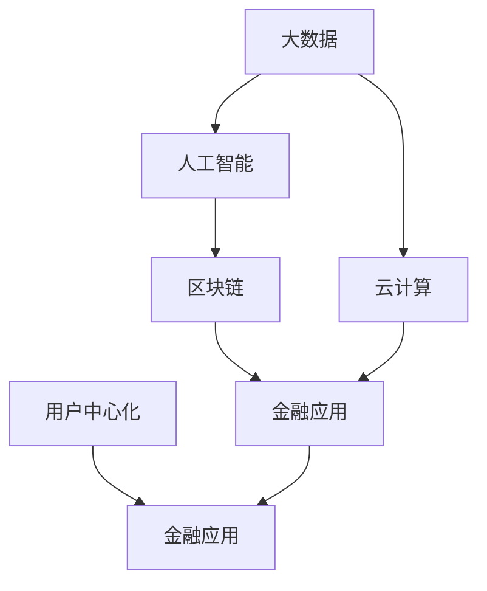

                 

# 利用技术优势进行金融科技创新

在数字化转型的浪潮中，金融科技（FinTech）已经成为推动金融行业发展的关键力量。技术创新不仅带来了新的业务模式和商业模式，更在风险管理、客户服务、产品创新等方面实现了显著的提升。然而，传统金融行业对数据驱动、自动化和智能化的需求日益增加，如何更好地将技术优势转化为金融创新的动能，成为行业共同面临的挑战。

## 1. 背景介绍

### 1.1 问题由来

随着互联网技术的普及和移动设备的广泛使用，用户行为模式发生了深刻的变化，金融行业亟需通过技术手段来提升效率和用户体验。传统金融行业依靠人工处理大量事务性工作，效率低下、错误率高，难以应对庞大的客户需求。而金融科技的崛起，通过区块链、大数据、人工智能等技术的应用，大幅提高了金融服务的效率和安全性，同时降低了成本。

然而，当前的金融科技创新面临诸多挑战，包括但不限于：数据孤岛、隐私保护、法规合规、技术互操作性等问题。如何克服这些难题，实现技术优势最大化，仍需要行业和学界的共同努力。

### 1.2 问题核心关键点

金融科技创新的核心在于通过技术手段实现业务模式的优化升级，提高金融服务的效率和质量，同时保障金融安全与合规。主要关键点包括：

- **数据集成与共享**：如何将不同业务系统、不同来源的数据进行有效整合，实现数据的统一管理和分析。
- **隐私保护与合规**：如何在数据共享和使用过程中，保障用户隐私和遵守法规要求。
- **人工智能与自动化**：如何利用机器学习、自然语言处理、智能推荐等技术，优化金融服务流程，实现智能决策和自动化。
- **区块链技术**：如何通过区块链实现去中心化、透明化、可追溯的金融交易，提升交易效率和安全性。
- **用户中心化设计**：如何通过技术手段实现用户友好的界面，提升用户体验，构建生态系统。

## 2. 核心概念与联系

### 2.1 核心概念概述

金融科技涉及的技术概念广泛，包括但不限于大数据、人工智能、区块链、云计算等。通过将这些技术应用到金融领域，可以极大地提升金融服务的效率和安全性。

- **大数据**：通过收集和分析海量数据，提升决策的科学性和精准性。
- **人工智能**：利用机器学习、深度学习等技术，实现自动化、智能化的金融服务。
- **区块链**：通过分布式账本技术，实现去中心化、透明化、可追溯的金融交易。
- **云计算**：提供弹性、可扩展的计算和存储资源，支持金融科技应用的高效运行。

这些技术在金融行业的应用，通过以下合流图展示：



从图中可以看出，大数据、人工智能、区块链、云计算是金融科技创新的四大支柱，共同构成了技术创新的生态。

## 3. 核心算法原理 & 具体操作步骤

### 3.1 算法原理概述

金融科技创新涉及的算法种类繁多，包括但不限于机器学习、深度学习、自然语言处理、强化学习等。这些算法通过不同的方式实现业务优化和智能决策，提升金融服务的效率和质量。

以机器学习为例，其核心原理是通过训练模型，从历史数据中学习规律和模式，用于预测未来行为或进行智能决策。典型的机器学习算法包括线性回归、决策树、随机森林、神经网络等。

### 3.2 算法步骤详解

以神经网络为例，金融科技创新的算法步骤可以分解为以下几步：

1. **数据预处理**：收集并清洗金融数据，包括用户行为数据、市场数据、信用数据等。
2. **模型训练**：选择合适的神经网络模型，如卷积神经网络（CNN）、循环神经网络（RNN）、长短时记忆网络（LSTM）等，训练模型参数。
3. **模型验证**：在测试集上评估模型性能，选择最优模型。
4. **模型部署**：将模型部署到生产环境中，实现实时预测和决策。

以深度学习模型为例，其训练过程可以进一步细化为以下几个步骤：

1. **数据集划分**：将数据集划分为训练集、验证集和测试集。
2. **模型搭建**：搭建神经网络模型，包括输入层、隐藏层和输出层。
3. **模型训练**：通过反向传播算法，更新模型参数。
4. **模型评估**：在验证集上评估模型性能，调整超参数。
5. **模型部署**：将模型部署到线上环境，进行实时预测。

### 3.3 算法优缺点

金融科技创新的算法具有以下优点：

- **自动化**：通过自动化算法，可以实现金融服务的智能化，减少人工干预。
- **精准性**：算法能够从海量数据中挖掘规律，提升决策的科学性和精准性。
- **可扩展性**：算法可以无缝集成到不同的金融应用中，实现功能扩展。

同时，也存在以下缺点：

- **数据依赖**：算法的性能依赖于数据的质量和数量，数据不全或数据偏差会影响模型效果。
- **模型复杂度**：神经网络等复杂算法需要较高的计算资源，训练和推理耗时较长。
- **可解释性不足**：复杂算法如深度学习模型往往难以解释其内部工作机制，不利于模型优化和调试。

### 3.4 算法应用领域

金融科技创新的算法广泛应用于金融行业多个领域，例如：

- **信用评分与风险管理**：通过机器学习模型，对客户信用进行评分，识别潜在风险。
- **投资组合管理**：利用深度学习模型，对投资组合进行优化，实现收益最大化。
- **智能投顾**：通过自然语言处理技术，实现与客户的智能交互，提供个性化金融建议。
- **智能理赔**：通过图像识别、自然语言处理等技术，自动处理理赔申请，提升理赔效率。
- **反欺诈检测**：通过异常检测算法，识别并阻止欺诈行为，保障金融安全。

## 4. 数学模型和公式 & 详细讲解 & 举例说明

### 4.1 数学模型构建

金融科技创新的数学模型可以基于不同的业务需求，构建不同的模型框架。以信用评分为例，可以构建如下的数学模型：

$$
y = w_0 + w_1x_1 + w_2x_2 + ... + w_nx_n + \epsilon
$$

其中 $y$ 为信用评分，$x_i$ 为输入特征，$w_i$ 为特征权重，$\epsilon$ 为误差项。

### 4.2 公式推导过程

以线性回归模型为例，其目标是最小化预测值与真实值之间的误差：

$$
\min_{\theta} \sum_{i=1}^N (y_i - \hat{y}_i)^2
$$

其中 $\theta$ 为模型参数，$\hat{y}_i$ 为预测值，$y_i$ 为真实值。

利用最小二乘法，可以得到模型参数的解：

$$
\theta = (\mathbf{X}^T\mathbf{X})^{-1}\mathbf{X}^T\mathbf{y}
$$

其中 $\mathbf{X}$ 为特征矩阵，$\mathbf{y}$ 为真实值向量。

### 4.3 案例分析与讲解

以反欺诈检测为例，其核心算法为异常检测算法。常用的异常检测算法包括孤立森林、局部离群因子、高斯混合模型等。

以孤立森林为例，其核心思想是通过构建随机森林，找出样本在树上的路径长度，将路径长度视为样本的特征，从而识别异常样本。

假设样本 $x_1,x_2,...,x_n$ 的路径长度分别为 $L_1,L_2,...,L_n$，则异常样本的判定标准为：

$$
L_i > \sigma \times \overline{L}
$$

其中 $\sigma$ 为阈值，$\overline{L}$ 为路径长度的平均值。

## 5. 项目实践：代码实例和详细解释说明

### 5.1 开发环境搭建

金融科技创新的项目实践需要搭建专业的开发环境，以下是一些常用的开发环境搭建步骤：

1. **选择开发语言**：常用的开发语言包括Python、Java、C++等。Python以其简单易学、生态丰富而广受青睐。
2. **安装依赖库**：安装必要的依赖库，如TensorFlow、Keras、Pandas、Numpy等。
3. **搭建开发环境**：使用虚拟环境管理工具，如Anaconda、virtualenv等，搭建独立的开发环境。
4. **部署环境搭建**：搭建在线环境，如AWS、阿里云、华为云等，部署模型并实现实时预测。

### 5.2 源代码详细实现

以信用评分为例，使用Python和TensorFlow搭建信用评分模型。代码实现如下：

```python
import tensorflow as tf
import pandas as pd

# 加载数据集
data = pd.read_csv('credit.csv')

# 数据预处理
features = data[['age', 'income', 'loan', 'married', 'education']]
target = data['default']

# 模型搭建
model = tf.keras.Sequential([
    tf.keras.layers.Dense(16, activation='relu', input_shape=[5]),
    tf.keras.layers.Dense(8, activation='relu'),
    tf.keras.layers.Dense(1, activation='sigmoid')
])

# 模型训练
model.compile(optimizer='adam', loss='binary_crossentropy', metrics=['accuracy'])
model.fit(features, target, epochs=10, batch_size=32)

# 模型评估
test_data = pd.read_csv('test.csv')
test_features = test_data[['age', 'income', 'loan', 'married', 'education']]
predictions = model.predict(test_features)
```

### 5.3 代码解读与分析

代码中主要包含以下几个步骤：

1. **数据加载**：使用Pandas库加载数据集，并进行预处理。
2. **模型搭建**：使用Keras搭建神经网络模型，包括输入层、隐藏层和输出层。
3. **模型训练**：使用Adam优化器进行模型训练，最小化损失函数。
4. **模型评估**：在测试集上进行模型评估，输出预测结果。

## 6. 实际应用场景

### 6.1 智能投顾

智能投顾是金融科技创新的一个重要方向，通过自然语言处理技术，实现与客户的智能交互，提供个性化的金融建议。

以智能投顾为例，其核心技术包括：

- **自然语言处理（NLP）**：通过NLP技术，实现与客户的智能对话，了解客户需求。
- **知识图谱**：构建金融领域的知识图谱，用于提供个性化的金融建议。
- **推荐系统**：利用推荐系统，推荐符合客户需求的金融产品。

智能投顾的实际应用场景包括：

- **客户咨询**：通过智能客服机器人，解答客户的金融问题，提供个性化建议。
- **理财规划**：根据客户的财务状况和需求，制定个性化的理财方案。
- **风险评估**：评估客户的风险承受能力，提供相应的投资建议。

### 6.2 智能理赔

智能理赔是金融科技创新的另一个重要方向，通过图像识别、自然语言处理等技术，自动处理理赔申请，提升理赔效率。

以智能理赔为例，其核心技术包括：

- **图像识别**：通过图像识别技术，自动识别理赔图片中的关键信息，如车辆损伤、事故现场等。
- **自然语言处理（NLP）**：通过NLP技术，解析理赔申请的文本信息，提取关键要素。
- **数据整合**：将理赔图片和文本信息整合，生成完整的理赔信息。

智能理赔的实际应用场景包括：

- **事故处理**：自动处理事故现场的图片和视频，提取关键信息。
- **索赔申请**：自动识别索赔申请的文本信息，自动提取关键要素。
- **赔付审核**：根据理赔信息，自动审核赔付请求，提升赔付效率。

### 6.3 反欺诈检测

反欺诈检测是金融科技创新的重要应用之一，通过异常检测算法，识别并阻止欺诈行为，保障金融安全。

以反欺诈检测为例，其核心技术包括：

- **异常检测**：通过孤立森林、局部离群因子等算法，识别异常行为。
- **数据清洗**：清洗数据，去除噪声和异常数据。
- **风险预警**：根据检测结果，及时预警并采取措施。

反欺诈检测的实际应用场景包括：

- **交易监控**：监控用户的交易行为，及时识别异常交易。
- **账户管理**：检测用户的账户活动，防止账户被盗用。
- **客户行为分析**：分析客户行为，识别潜在的欺诈风险。

## 7. 工具和资源推荐

### 7.1 学习资源推荐

为了帮助开发者系统掌握金融科技创新的技术基础和实践技巧，以下是一些优质的学习资源：

1. **《金融科技：技术、创新与实践》**：全面介绍了金融科技技术基础和实践案例，适合金融行业从业人员学习。
2. **Coursera《金融科技与创新》课程**：斯坦福大学教授主讲，涵盖金融科技的多个方面，包括区块链、大数据、人工智能等。
3. **Kaggle金融数据集**：提供丰富的金融数据集，供开发者进行模型训练和优化。
4. **金融科技开发者社区**：提供丰富的金融科技资源和技术支持，帮助开发者快速上手。
5. **《Python金融数据分析与金融工程实战》**：详细介绍了Python在金融数据分析和工程中的应用，适合金融科技从业者学习。

### 7.2 开发工具推荐

金融科技创新的项目实践离不开专业的开发工具，以下是几款常用的开发工具：

1. **Jupyter Notebook**：提供交互式编程环境，适合进行数据处理和模型训练。
2. **TensorFlow**：由Google开发的深度学习框架，支持分布式计算，适合大规模模型训练。
3. **Keras**：基于TensorFlow的高级API，适合快速搭建和训练模型。
4. **PyTorch**：由Facebook开发的深度学习框架，支持动态图和静态图，适合灵活的模型训练。
5. **AWS云平台**：提供丰富的云服务，支持模型部署和在线服务。

### 7.3 相关论文推荐

金融科技创新的技术研究涵盖了多个领域，以下是几篇具有代表性的论文，推荐阅读：

1. **《金融科技的现状与未来：一篇综述》**：总结了金融科技的现状和未来发展方向，适合技术管理人员阅读。
2. **《基于深度学习的金融信用评分研究》**：详细介绍了深度学习在金融信用评分中的应用，适合技术研究人员阅读。
3. **《区块链技术在金融领域的应用》**：介绍了区块链技术在金融领域的应用场景，适合业务人员阅读。
4. **《金融大数据应用案例研究》**：详细介绍了大数据在金融领域的应用案例，适合金融科技从业者阅读。
5. **《智能投顾的模型和算法研究》**：详细介绍了智能投顾的模型和算法，适合金融科技从业者阅读。

## 8. 总结：未来发展趋势与挑战

### 8.1 总结

本文对金融科技创新的技术优势和应用进行了全面系统的介绍。首先阐述了金融科技创新的背景和意义，明确了技术创新在金融服务中的应用价值。其次，从原理到实践，详细讲解了金融科技创新的核心算法和具体操作步骤，给出了具体的代码实例和解释分析。同时，本文还广泛探讨了金融科技创新的实际应用场景，展示了其在智能投顾、智能理赔、反欺诈检测等领域的潜力。此外，本文精选了金融科技创新的各类学习资源，力求为读者提供全方位的技术指引。

通过本文的系统梳理，可以看到，金融科技创新的技术优势在于其高效、智能、安全的特性，能够极大地提升金融服务的效率和用户体验。未来，伴随技术的持续演进和应用场景的不断拓展，金融科技创新必将在更多领域带来变革性影响。

### 8.2 未来发展趋势

展望未来，金融科技创新的技术发展呈现以下几个趋势：

1. **数据驱动与智能决策**：大数据和人工智能技术的应用将更加广泛，提升金融决策的精准性和自动化水平。
2. **区块链技术的应用**：区块链技术将更广泛地应用于金融交易、资产管理等领域，提升交易的透明性和安全性。
3. **金融科技生态系统的构建**：通过平台化的方式，构建金融科技生态系统，促进各方的合作和协同创新。
4. **隐私保护与合规**：随着数据隐私和合规要求的不断提高，金融科技创新需更加注重隐私保护和合规性。
5. **技术标准化**：金融科技创新需要制定统一的技术标准，促进各方的互操作性和兼容性。

### 8.3 面临的挑战

尽管金融科技创新已经取得了显著进展，但在迈向更加智能化、普适化应用的过程中，仍面临诸多挑战：

1. **数据隐私与安全**：如何在提供金融服务的同时，保障用户数据的隐私和安全，是金融科技创新的重要挑战。
2. **法规合规与监管**：金融科技创新的技术应用需符合相关法规和监管要求，确保金融稳定与安全。
3. **技术互操作性**：不同金融科技应用之间的互操作性问题需得到有效解决，实现数据和功能的无缝整合。
4. **用户体验与客户满意度**：如何提升用户界面和用户体验，提高客户满意度和忠诚度，是金融科技创新的关键。
5. **技术壁垒与合作**：各金融机构之间的技术壁垒和合作问题需得到有效解决，实现技术的共享和协同创新。

### 8.4 研究展望

面对金融科技创新所面临的挑战，未来的研究需要在以下几个方面寻求新的突破：

1. **数据隐私保护技术**：研究更加高效、安全的数据隐私保护技术，确保用户数据的安全和隐私。
2. **金融科技法规合规**：研究符合金融科技发展的法规和合规要求，确保金融科技创新的合法性和安全性。
3. **技术标准化与互操作性**：研究金融科技技术的标准化和互操作性问题，促进各方的合作与协同。
4. **用户中心化设计与体验优化**：研究用户中心化的设计方法和用户体验优化技术，提高客户满意度和忠诚度。
5. **技术创新与应用推广**：推动金融科技创新技术的应用和推广，实现技术优势的最大化。

## 9. 附录：常见问题与解答

**Q1：金融科技创新的核心技术有哪些？**

A: 金融科技创新的核心技术包括大数据、人工智能、区块链、云计算等。这些技术通过不同的方式实现业务优化和智能决策，提升金融服务的效率和质量。

**Q2：金融科技创新的主要应用场景有哪些？**

A: 金融科技创新的主要应用场景包括智能投顾、智能理赔、反欺诈检测等。通过技术手段优化金融服务流程，提升金融服务的效率和用户体验。

**Q3：金融科技创新面临的主要挑战有哪些？**

A: 金融科技创新面临的主要挑战包括数据隐私与安全、法规合规与监管、技术互操作性、用户体验与客户满意度、技术壁垒与合作等问题。

**Q4：如何提升金融科技创新的技术优势？**

A: 提升金融科技创新的技术优势需要不断推动技术的创新与应用，同时注重用户中心化的设计，提升用户体验。此外，需要注重数据隐私保护、合规性、技术标准化等方面的研究。

**Q5：金融科技创新未来的发展方向是什么？**

A: 金融科技创新未来的发展方向包括数据驱动与智能决策、区块链技术的应用、金融科技生态系统的构建、隐私保护与合规、技术标准化等。

---

作者：禅与计算机程序设计艺术 / Zen and the Art of Computer Programming

