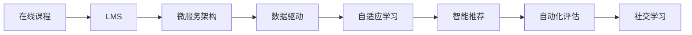

                 

# 利用技术能力创建在线课程

> 关键词：在线课程, 教育技术, 学习管理系统(LMS), 微服务架构, 数据驱动, 自适应学习, 智能推荐, 自动化评估

## 1. 背景介绍

### 1.1 问题由来
随着互联网的普及和科技的发展，在线教育已经成为一个快速增长的市场。传统面对面教育受时间、地点等限制，难以满足更多人的学习需求。在线课程以灵活的学习方式、丰富的学习资源、较低的成本等优势，逐渐成为教育的重要形式。在线课程的开发，不再局限于商业教育平台，越来越多的企业和个人也通过创建在线课程，实现了知识传播和技能分享的目标。

在线课程的开发是一个系统工程，涉及教学设计、课程制作、平台部署、内容管理和用户交互等多个方面。如何高效、低成本地构建和运营在线课程，成为了教育技术发展的关键问题。本文将介绍利用技术能力创建在线课程的详细方法，从课程设计到系统部署，涵盖各关键环节的深入分析。

## 2. 核心概念与联系

### 2.1 核心概念概述

为更好地理解在线课程的创建过程，本节将介绍几个关键概念：

- 在线课程（Online Course）：通过网络平台提供的交互式学习体验，包括视频、文档、练习等多种形式。学生可以在任何时间、任何地点进行学习，享受自主学习的乐趣。

- 教育技术（Educational Technology）：利用现代信息技术手段，如互联网、人工智能、大数据等，提升教育过程的效率和质量，实现个性化、自适应学习。

- 学习管理系统（Learning Management System, LMS）：用于支持在线教学和评估的系统，包括课程内容管理、学生管理、教学活动跟踪等功能，是构建在线课程的基础平台。

- 微服务架构（Microservice Architecture）：一种分布式系统设计模式，通过将复杂的系统拆分为多个小模块，实现服务的独立部署、扩展和维护。

- 数据驱动（Data-Driven）：利用数据分析手段，优化在线课程的设计、内容呈现和用户反馈，提高学习效果和满意度。

- 自适应学习（Adaptive Learning）：根据学习者的学习情况和行为，动态调整课程内容和难度，实现个性化的学习体验。

- 智能推荐（Recommendation System）：利用算法和模型，为用户推荐个性化学习资源，提高学习效率。

- 自动化评估（Automated Assessment）：通过自动化的工具和算法，对学生的作业和测试进行评估，减轻教师负担。

- 社交学习（Social Learning）：强调学习者之间的互动和交流，培养合作精神和社区感。

这些概念通过以下Mermaid流程图进行了概要联系：



以上流程图示意了在线课程从设计到实施的各环节：在线课程通过LMS平台部署，采用微服务架构进行系统设计和开发，利用数据驱动和自适应学习优化教学过程，利用智能推荐和自动化评估提升学习体验，并在学习过程中实现社交互动。

## 3. 核心算法原理 & 具体操作步骤
### 3.1 算法原理概述

在线课程的创建过程，本质上是一个复杂的软件工程问题。其核心在于如何有效地利用技术手段，将教育理念转化为可执行的在线教学资源。核心算法和原理包括以下几个关键方面：

- 学习内容结构化：将课程内容设计为模块化的结构，便于管理和重用。
- 自适应学习算法：根据学生学习行为和成绩，动态调整课程内容和难度。
- 推荐算法：基于用户行为和偏好，推荐个性化学习资源。
- 自动化评估算法：利用机器学习算法，对学生的作业和测试进行自动评分。

以上算法和原理通过以下步骤进行详细讲解：

### 3.2 算法步骤详解

#### 3.2.1 课程设计

课程设计是创建在线课程的基础。以下是课程设计的关键步骤：

1. **需求分析**：明确课程目标、学习内容、学习者群体等关键信息。
2. **内容规划**：将课程内容拆分为多个模块，确定每个模块的学习目标、知识点和教学方法。
3. **学习路径设计**：根据学习者能力和兴趣，设计合理的课程结构和学习顺序。
4. **教学资源准备**：准备教学视频、文档、练习等资源，确保内容的完整性和可理解性。

#### 3.2.2 课程制作

课程制作是将设计好的教学内容转化为具体的教学资源的过程。以下是课程制作的详细步骤：

1. **视频制作**：录制和编辑教学视频，确保画面清晰、讲解流畅。
2. **文档制作**：编写和整理教学文档，确保内容的准确性和可读性。
3. **练习设计**：设计有针对性的练习和测试，评估学习效果并激励学生。
4. **多媒体资源整合**：将视频、文档、练习等资源整合到统一的LMS平台，方便学生访问和学习。

#### 3.2.3 平台部署

平台部署是将课程内容部署到LMS平台的过程。以下是平台部署的关键步骤：

1. **选择LMS平台**：根据需求选择合适的LMS平台，如Coursera、EdX等。
2. **配置LMS环境**：根据课程需求配置LMS的各项参数，如课程结构、学习路径、权限设置等。
3. **部署课程内容**：将课程内容上传至LMS平台，并进行初步审核和测试。
4. **发布课程**：完成审核和测试后，正式发布课程，开放给学生访问。

#### 3.2.4 内容管理和用户交互

内容管理和用户交互是保持课程更新和优化用户体验的关键步骤。以下是内容管理和用户交互的详细步骤：

1. **内容更新**：根据学生反馈和学习效果，定期更新课程内容和资源，保持课程的活力和实用性。
2. **用户互动**：利用讨论区、论坛等工具，鼓励学生之间的互动和交流，促进共同学习。
3. **数据收集和分析**：收集学生的学习行为数据，如访问时间、练习完成情况等，用于评估课程效果和优化教学策略。

### 3.3 算法优缺点

#### 3.3.1 优点

- **灵活性**：在线课程可以根据学生的需求和学习情况进行动态调整，实现个性化的学习体验。
- **可扩展性**：微服务架构和LMS平台可以支持大规模在线课程的部署和扩展，满足不同规模和需求的学习需求。
- **数据驱动**：通过数据驱动，可以实时监控和优化课程效果，提升学习效率和满意度。
- **自动化和智能化**：利用智能推荐和自动化评估，减轻教师负担，提升教学质量。
- **互动性**：社交学习平台可以鼓励学生之间的互动和合作，增强学习动力。

#### 3.3.2 缺点

- **资源投入**：课程设计和制作需要大量的资源投入，包括人力、物力和时间成本。
- **技术门槛**：课程制作和平台部署涉及复杂的技术实现，需要具备一定的技术能力。
- **质量保证**：课程内容和质量的控制需要严格的管理和审核，避免劣质内容的发布。
- **隐私和安全**：用户数据和内容的保护需要严格的安全措施，防止数据泄露和侵权。

### 3.4 算法应用领域

在线课程技术广泛应用于各个领域，包括：

- **商业教育**：如Coursera、edX、Udacity等在线平台，提供各类商业课程和专业技能培训。
- **企业培训**：如LinkedIn Learning、SAP SuccessFactors等，为企业员工提供定制化的培训课程。
- **学术教育**：如Coursera for Business、Khan Academy等，提供高质量的学术课程和资源。
- **在线考试和认证**：如Udemy、Skillshare等，提供各种在线课程和认证考试。
- **编程和技能培训**：如FreeCodeCamp、Codecademy等，提供编程和技能培训课程。

以上领域只是在线课程应用的冰山一角，随着技术的不断进步和教育的普及，在线课程的应用场景将更加广泛和多样化。

## 4. 数学模型和公式 & 详细讲解  
### 4.1 数学模型构建

在线课程的核心是内容的科学设计和内容的智能展示。以下是一个基于学习行为数据的数学模型构建过程：

设学生学习数据集为 $D=\{(x_i,y_i)\}_{i=1}^N$，其中 $x_i$ 为学习行为向量， $y_i$ 为学生成绩。学习行为向量包括访问时长、练习完成度、互动评分等。

定义预测学生成绩的模型为 $f(x;\theta)$，其中 $\theta$ 为模型参数。模型的目标是最小化预测误差，即：

$$
\min_{\theta} \sum_{i=1}^N (f(x_i;\theta) - y_i)^2
$$

在实际应用中，为了提升模型的泛化能力，通常会引入正则化项，如L2正则：

$$
\min_{\theta} \sum_{i=1}^N (f(x_i;\theta) - y_i)^2 + \lambda ||\theta||^2
$$

其中 $\lambda$ 为正则化系数。

### 4.2 公式推导过程

通过最小化上述损失函数，可以得到模型参数 $\theta$ 的最优解。具体推导过程如下：

1. 对损失函数求导：
$$
\frac{\partial}{\partial \theta} \sum_{i=1}^N (f(x_i;\theta) - y_i)^2 + \lambda ||\theta||^2
$$

2. 令导数为零，求解 $\theta$：
$$
\frac{\partial}{\partial \theta} \sum_{i=1}^N (f(x_i;\theta) - y_i)^2 + \lambda ||\theta||^2 = 0
$$

3. 得到参数更新公式：
$$
\theta \leftarrow \theta - \alpha \frac{\partial}{\partial \theta} \sum_{i=1}^N (f(x_i;\theta) - y_i)^2 + \lambda ||\theta||^2
$$

其中 $\alpha$ 为学习率。

在实际应用中，通常使用随机梯度下降法（SGD）或其变种算法进行参数更新，如Adam、Adagrad等。

### 4.3 案例分析与讲解

假设我们有一个基于学习行为的在线课程评分模型，输入为学生行为数据 $x_i$，输出为学生成绩 $y_i$。以下是模型的构建和应用步骤：

1. **数据准备**：收集学生的访问行为数据，如视频观看时长、练习完成度等。
2. **特征工程**：对原始数据进行预处理，如归一化、特征选择等，提取有用的特征。
3. **模型训练**：使用随机梯度下降法对模型进行训练，得到最优的参数 $\theta$。
4. **预测评分**：利用训练好的模型对新学生的行为数据进行预测，得到其预期的成绩。

## 5. 项目实践：代码实例和详细解释说明
### 5.1 开发环境搭建

#### 5.1.1 编程语言和工具

在线课程的开发主要使用Python和R语言，常见的开发工具包括：

1. **Jupyter Notebook**：一个轻量级的Web交互式编程环境，支持多种编程语言和科学计算。
2. **PyTorch和TensorFlow**：两个流行的深度学习框架，用于构建和训练复杂的机器学习模型。
3. **Pandas和NumPy**：用于数据处理和分析的Python库。
4. **Scikit-learn**：用于机器学习任务的数据处理和模型构建。
5. **Django和Flask**：Python Web框架，用于搭建在线课程平台。

#### 5.1.2 环境配置

安装Python、pip、Jupyter Notebook等工具，配置好开发环境。

```bash
sudo apt-get install python3-pip python3-dev
pip install jupyter notebook
```

配置Jupyter Notebook服务器，启动服务。

```bash
jupyter notebook --NotebookApp.token=''
```

### 5.2 源代码详细实现

#### 5.2.1 课程设计和管理

以下是一个简单的课程设计和管理代码示例：

```python
import pandas as pd

# 读取课程结构数据
course_structure = pd.read_csv('course_structure.csv')

# 定义课程模块和内容
modules = {
    'Module1': {
        'content': ['Video1', 'Video2', 'Document1', 'Exercise1']
    },
    'Module2': {
        'content': ['Video3', 'Video4', 'Document2', 'Exercise2']
    }
}

# 生成课程内容列表
course_content = []
for module in modules.values():
    for content in module['content']:
        course_content.append({
            'module': module['module'],
            'content': content
        })

# 将课程内容保存为CSV文件
course_content.to_csv('course_content.csv', index=False)
```

#### 5.2.2 课程制作

以下是一个简单的视频制作和文档准备代码示例：

```python
import video2mp3

# 制作视频
video2mp3.create_video('Video1.mp4', 'Video1.mp3')

# 准备文档
with open('Document1.md', 'w') as f:
    f.write('# 模块1\n\n' +
            '## 课程内容\n\n' +
            '- 视频\n\n' +
            '  - 视频1\n' +
            '- 视频2\n\n' +
            '## 文档\n\n' +
            '- 文档1')
```

#### 5.2.3 平台部署

以下是一个简单的LMS平台部署代码示例：

```python
# 安装Django框架
pip install django

# 创建Django项目和应用
django-admin startproject myproject
cd myproject
django-admin startapp myapp

# 定义LMS模型和视图
# models.py
from django.db import models

class Course(models.Model):
    title = models.CharField(max_length=255)
    modules = models.JSONField()

# views.py
from django.shortcuts import render
from .models import Course

def course_list(request):
    courses = Course.objects.all()
    return render(request, 'course_list.html', {'courses': courses})

# urls.py
from django.urls import path
from .views import course_list

urlpatterns = [
    path('courses/', course_list, name='course_list'),
]
```

### 5.3 代码解读与分析

#### 5.3.1 课程设计

课程设计是一个结构化、模块化的过程，需要明确课程目标、学习内容和教学方法。上述代码示例展示了如何定义课程结构和内容，将课程内容拆分为多个模块，方便管理和重用。

#### 5.3.2 课程制作

课程制作是将教学内容转化为具体的教学资源，需要录制视频、编写文档、设计练习等。上述代码示例展示了如何利用视频2mp3工具将视频转换为音频，以及如何编写Markdown格式的文档，便于学生访问和学习。

#### 5.3.3 平台部署

平台部署是将课程内容部署到LMS平台的过程，需要配置数据库、定义模型和视图、设计URL等。上述代码示例展示了如何使用Django框架搭建LMS平台，并定义课程列表的视图和URL。

## 6. 实际应用场景
### 6.1 商业教育

商业教育领域在线课程的发展已经较为成熟，各大在线教育平台提供了丰富的商业课程和专业技能培训。

#### 6.1.1 应用场景

- **MOOC课程**：如Coursera、edX等平台提供的MOOC课程，涵盖计算机科学、商业管理、数据科学等多个领域。
- **职业培训**：如LinkedIn Learning、Udemy等平台提供的职业培训课程，涵盖编程、设计、营销等技能。
- **认证考试**：如Udacity、Coursera等平台提供的专业认证考试，帮助学员获得行业认可的技能证书。

#### 6.1.2 技术挑战

- **课程内容设计**：需要具备丰富的专业知识，设计合理的课程结构和内容。
- **平台部署和扩展**：需要具备较高的技术能力，确保平台的高可用性和扩展性。
- **学习体验优化**：需要持续收集用户反馈，优化课程内容和平台功能。

#### 6.1.3 解决方案

- **内容专家团队**：组建内容专家团队，确保课程内容的科学性和实用性。
- **技术团队支持**：组建技术团队，确保平台的稳定性和扩展性。
- **用户反馈机制**：建立用户反馈机制，持续收集用户意见，优化学习体验。

### 6.2 企业培训

企业培训是企业员工技能提升的重要手段，通过在线课程可以提升员工的专业技能和职业素养。

#### 6.2.1 应用场景

- **内部培训**：如企业内部培训平台，提供各类技能培训课程，如领导力、项目管理、技术技能等。
- **技能认证**：如在线技能认证课程，帮助员工提升专业技能，并获得行业认可的证书。
- **知识共享**：如知识分享平台，鼓励员工上传自己的学习资源和经验，实现知识共享。

#### 6.2.2 技术挑战

- **课程定制化**：需要根据企业需求，定制化课程内容。
- **平台集成**：需要与企业内部系统集成，确保数据互通和功能协同。
- **学习效果评估**：需要建立科学的评估机制，评估员工的学习效果和进步。

#### 6.2.3 解决方案

- **企业定制平台**：根据企业需求，定制开发企业培训平台，确保课程内容的适用性和实用性。
- **数据集成和接口开发**：开发数据集成和接口，确保平台与企业内部系统的互通和协同。
- **学习效果评估模型**：开发学习效果评估模型，科学评估员工的学习效果和进步。

### 6.3 学术教育

学术教育领域在线课程的应用越来越广泛，在线平台提供了丰富的学术资源和课程。

#### 6.3.1 应用场景

- **在线课程**：如Coursera、Khan Academy等平台提供的学术课程，涵盖数学、物理、生物等多个学科。
- **开放课程**：如MIT OpenCourseWare、Harvard Online等平台提供的开放课程，免费向全球开放。
- **在线实验室**：如Labster、PhET等平台提供的虚拟实验室，帮助学生进行实验操作。

#### 6.3.2 技术挑战

- **课程内容科学性**：需要具备深厚的学术背景，确保课程内容的科学性和准确性。
- **课程可访问性**：需要确保课程内容的可访问性和适用性，覆盖不同地区和文化背景的学生。
- **学习效果评估**：需要建立科学的学习效果评估机制，帮助学生提升学习效果。

#### 6.3.3 解决方案

- **学术专家团队**：组建学术专家团队，确保课程内容的科学性和准确性。
- **多语言支持**：开发多语言支持系统，确保课程内容的可访问性和适用性。
- **学习效果评估模型**：开发学习效果评估模型，科学评估学生的学习效果。

## 7. 工具和资源推荐
### 7.1 学习资源推荐

在线课程的开发需要具备广泛的知识和技术背景，以下是一些优秀的学习资源推荐：

1. **Coursera官方文档**：提供完整的在线课程开发指南，涵盖课程设计、课程制作、平台部署等各个环节。
2. **edX开发者文档**：提供详细的开发API和示例代码，帮助开发者构建自己的在线课程平台。
3. **Udemy开发者文档**：提供丰富的开发资源和工具，帮助开发者构建高质量的在线课程。
4. **Khan Academy开发者文档**：提供科学研究和课程开发的方法，帮助开发者设计优质的学术课程。
5. **MIT OpenCourseWare开发者文档**：提供开放课程的开发方法和工具，帮助开发者构建开放课程平台。

通过这些学习资源，可以快速掌握在线课程开发的各个环节，提升课程质量和用户体验。

### 7.2 开发工具推荐

在线课程的开发需要依赖多种工具和框架，以下是一些优秀的开发工具推荐：

1. **Jupyter Notebook**：一个轻量级的Web交互式编程环境，支持多种编程语言和科学计算。
2. **PyTorch和TensorFlow**：两个流行的深度学习框架，用于构建和训练复杂的机器学习模型。
3. **Pandas和NumPy**：用于数据处理和分析的Python库。
4. **Scikit-learn**：用于机器学习任务的数据处理和模型构建。
5. **Django和Flask**：Python Web框架，用于搭建在线课程平台。
6. ** video2mp3**：将视频转换为音频的工具，方便课程资源的生成和存储。

这些工具和框架可以快速提升在线课程开发的效率和质量，缩短开发周期。

### 7.3 相关论文推荐

在线课程的开发涉及到多种技术和方法，以下是一些相关的经典论文推荐：

1. **A Survey of Techniques for Learning Analytics in Online Education**：总结了在线教育中的学习分析技术，包括数据挖掘、自然语言处理、预测模型等。
2. **Educational Data Mining and Statistical Learning**：提供了在线课程中的数据挖掘和统计学习方法，帮助开发者构建科学的学习效果评估模型。
3. **Design and Development of Online Learning Environments**：介绍了在线学习环境的构建方法和工具，帮助开发者搭建高质量的在线课程平台。
4. **Building a Large-Scale Open Online Course Platform**：介绍了大型在线课程平台的开发方法和技术，帮助开发者设计可扩展的在线课程平台。
5. **Personalized Learning Paths for Adaptive Online Education**：介绍了自适应在线教育的方法和模型，帮助开发者构建个性化的学习路径。

这些论文代表了在线课程开发技术的最新进展，具有很高的参考价值。

## 8. 总结：未来发展趋势与挑战
### 8.1 研究成果总结

在线课程的开发涉及技术、教育、商业等多个领域的交叉，需要综合考虑多个因素。本文从课程设计、课程制作、平台部署、内容管理和用户交互等方面，系统介绍了在线课程的创建过程。通过数学模型和算法，展示了如何利用技术手段，优化在线课程的学习效果和用户体验。

### 8.2 未来发展趋势

未来在线课程的发展将呈现以下几个趋势：

1. **技术智能化**：通过人工智能和机器学习技术，提升在线课程的个性化和自适应能力，增强学习效果和用户体验。
2. **平台多样化**：未来将出现更多种类的在线课程平台，满足不同行业和领域的学习需求。
3. **内容多媒体化**：利用多媒体资源，丰富在线课程的内容形式，提升学习体验。
4. **学习效果评估智能化**：通过数据分析和机器学习技术，科学评估学习效果，帮助学生提升学习效果。
5. **平台开放化**：更多的在线课程平台将开放接口和数据，促进知识共享和协同学习。
6. **教学互动化**：通过社交网络和协作工具，增强在线课程的教学互动性，培养学生的合作精神和社区感。

### 8.3 面临的挑战

在线课程的发展仍面临诸多挑战：

1. **技术门槛高**：在线课程的开发需要较高的技术能力，需要组建专业的技术团队。
2. **内容质量控制**：课程内容和质量的控制需要严格的管理和审核，避免劣质内容的发布。
3. **用户体验优化**：在线课程的用户体验需要持续优化，提高学生的学习满意度和粘性。
4. **数据隐私和安全**：在线课程需要严格保护用户数据和隐私，防止数据泄露和侵权。
5. **学习效果评估**：科学的学习效果评估需要精确和有效的模型和方法。

### 8.4 研究展望

未来在线课程的发展方向包括：

1. **自适应学习系统**：通过智能算法，根据学生学习情况动态调整课程内容和难度，提升学习效果。
2. **多模态学习资源**：结合多媒体资源和虚拟现实技术，提供丰富的学习体验。
3. **学习效果评估模型**：利用机器学习算法，科学评估学生的学习效果和进步。
4. **智能推荐系统**：通过推荐算法，为学生推荐个性化的学习资源，提升学习效率。
5. **知识图谱应用**：利用知识图谱技术，提供知识结构和关联，帮助学生更好地理解和应用知识。

## 9. 附录：常见问题与解答

**Q1：在线课程开发需要哪些关键技术？**

A: 在线课程开发需要掌握以下关键技术：

1. **编程语言**：主要使用Python、R等脚本语言。
2. **Web框架**：主要使用Django、Flask等Web框架。
3. **数据分析**：主要使用Pandas、NumPy、Scikit-learn等库。
4. **机器学习**：主要使用PyTorch、TensorFlow等深度学习框架。
5. **多媒体处理**：主要使用video2mp3等工具。
6. **在线平台集成**：主要使用Coursera、edX等在线平台的API和接口。

**Q2：在线课程开发需要考虑哪些因素？**

A: 在线课程开发需要考虑以下因素：

1. **课程内容设计**：需要设计合理的课程结构和内容，确保课程的科学性和实用性。
2. **平台部署和扩展**：需要确保平台的稳定性和扩展性，满足大规模用户访问的需求。
3. **用户交互和反馈**：需要建立用户交互机制，收集用户反馈，持续优化课程和平台功能。
4. **学习效果评估**：需要建立科学的学习效果评估模型，帮助学生提升学习效果。
5. **数据隐私和安全**：需要严格保护用户数据和隐私，防止数据泄露和侵权。

**Q3：如何提升在线课程的学习效果？**

A: 提升在线课程的学习效果需要从以下几个方面入手：

1. **科学课程设计**：设计合理的课程结构和内容，确保课程的科学性和实用性。
2. **多媒体资源丰富**：利用多媒体资源，丰富课程的内容形式，提升学习体验。
3. **自适应学习系统**：利用智能算法，根据学生学习情况动态调整课程内容和难度，提升学习效果。
4. **学习效果评估智能化**：通过数据分析和机器学习技术，科学评估学习效果，帮助学生提升学习效果。
5. **互动性增强**：通过社交网络和协作工具，增强在线课程的教学互动性，培养学生的合作精神和社区感。

**Q4：在线课程开发中常见的技术问题有哪些？**

A: 在线课程开发中常见的技术问题包括：

1. **课程内容设计不合理**：课程结构和内容设计不合理，导致学生难以理解和应用。
2. **平台性能问题**：平台性能不足，无法满足大规模用户访问的需求。
3. **学习效果评估不准确**：学习效果评估模型不准确，无法科学评估学生的学习效果。
4. **数据隐私和安全问题**：用户数据和隐私保护不严格，导致数据泄露和侵权。

**Q5：在线课程开发中如何降低技术门槛？**

A: 在线课程开发中降低技术门槛可以从以下几个方面入手：

1. **使用现成工具和框架**：使用现成的开发工具和框架，减少开发成本和技术门槛。
2. **组建专业团队**：组建专业的技术团队，确保开发质量和进度。
3. **文档和示例**：编写详细的开发文档和示例代码，帮助开发者快速上手。
4. **培训和支持**：提供技术培训和支持，帮助开发者提升技术水平。
5. **社区和资源**：加入在线社区和资源平台，获取更多的技术支持和资源。

以上是本文对在线课程创建过程的详细解读和系统介绍。通过本文的学习，相信读者能够掌握在线课程开发的各个环节，构建高效、高质量的在线课程。在未来的学习和工作中，也能够更好地应用在线课程技术，提升教育和学习效果。

---

作者：禅与计算机程序设计艺术 / Zen and the Art of Computer Programming

