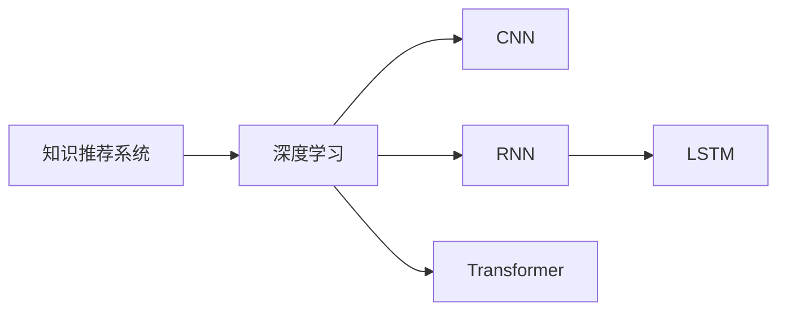
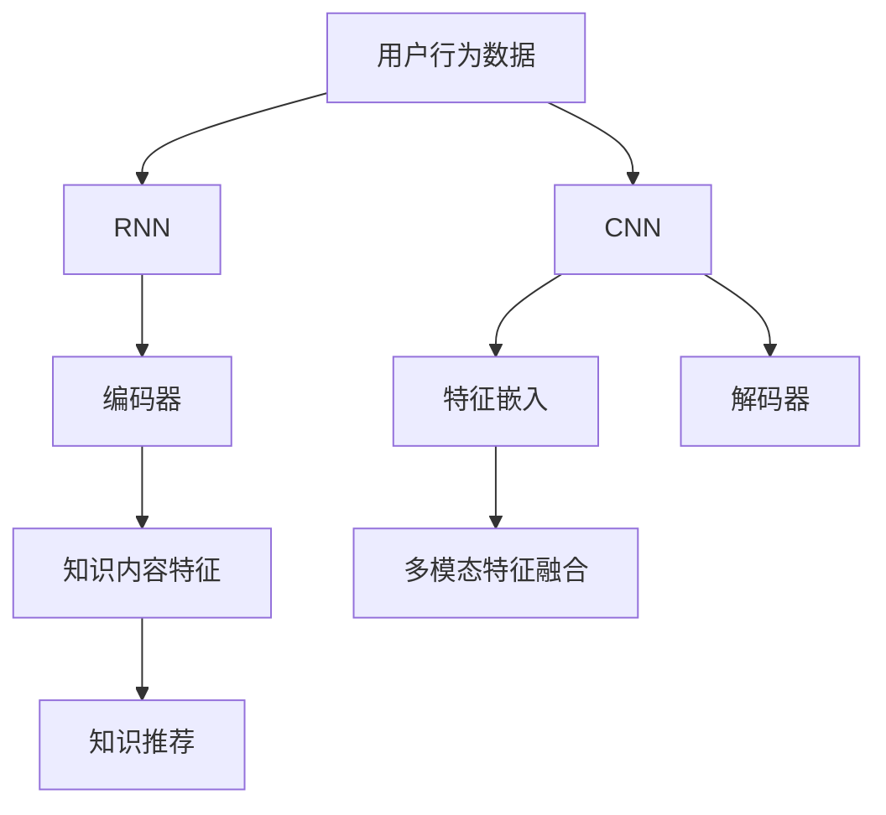

                 

## 1. 背景介绍

在信息爆炸的时代，如何从海量数据中准确地提取和推荐用户感兴趣的知识内容，成为了一个关键且紧迫的问题。知识推荐系统在互联网、教育、电商等多个领域都得到了广泛应用。传统基于规则和统计特征的推荐系统往往难以捕捉数据间的复杂关系，性能存在瓶颈。

随着机器学习技术的发展，利用深度学习等先进技术进行知识推荐，成为了提升推荐系统性能的重要手段。本文将详细介绍如何利用机器学习优化知识推荐系统，通过基于深度学习模型的推荐算法，结合用户行为和知识内容特征，构建更精准、更高效的知识推荐系统。

## 2. 核心概念与联系

### 2.1 核心概念概述

为了理解基于机器学习的知识推荐系统，我们需要了解以下几个核心概念：

- **知识推荐系统**：利用用户行为数据和知识内容特征，为用户推荐感兴趣的知识内容。常见的推荐任务包括文章推荐、课程推荐、搜索建议等。

- **深度学习**：通过多层神经网络模型对数据进行自动特征提取和模式学习，实现对复杂关系的建模。

- **卷积神经网络 (CNN)**：一种常用于图像处理的深度学习模型，可以提取图像的空间特征。

- **循环神经网络 (RNN)**：一种用于序列数据处理的深度学习模型，适用于文本和音频等时序数据。

- **长短期记忆网络 (LSTM)**：一种特殊的RNN，能够更好地处理长期依赖关系。

- **Transformer**：近年来在自然语言处理领域表现突出的深度学习模型，特别适用于处理序列数据，例如文本。

这些核心概念之间的逻辑关系可以通过以下Mermaid流程图来展示：



这个流程图展示了几者之间的逻辑关系：

1. 知识推荐系统利用深度学习模型对数据进行处理。
2. CNN和RNN模型分别适用于处理图像和序列数据。
3. LSTM是RNN的变种，特别适用于长期依赖关系的建模。
4. Transformer模型在处理序列数据方面表现优异。

### 2.2 核心概念原理和架构的 Mermaid 流程图



这个流程图展示了从用户行为数据到知识推荐的整体流程：

1. 用户行为数据首先经过CNN模型提取特征，适用于文本描述。
2. 序列数据则通过RNN模型进行处理。
3. 长短期记忆网络LSTM对时序依赖关系进行建模。
4. Transformer模型用于处理序列特征。
5. 知识内容特征通过编码器进行处理。
6. 特征通过多模态融合，产生推荐结果。

## 3. 核心算法原理 & 具体操作步骤

### 3.1 算法原理概述

基于深度学习的知识推荐系统，通常使用神经网络模型对用户行为数据和知识内容特征进行编码，进而进行推荐。该过程分为以下几个步骤：

1. **用户行为数据处理**：使用深度学习模型对用户行为数据进行编码，提取特征表示。
2. **知识内容特征提取**：同样使用深度学习模型对知识内容特征进行编码，提取特征表示。
3. **特征融合与匹配**：将用户行为数据特征与知识内容特征进行融合，并计算用户与知识之间的匹配度。
4. **推荐排序**：根据匹配度排序，生成推荐结果。

### 3.2 算法步骤详解

#### 步骤1：用户行为数据处理

用户行为数据通常包括点击、浏览、收藏、评论等。可以通过以下步骤进行处理：

1. **数据预处理**：对用户行为数据进行清洗，处理缺失值和异常值。
2. **特征提取**：使用深度学习模型对用户行为数据进行编码，提取特征表示。例如，可以使用CNN模型对文本描述进行处理，提取文本特征。

#### 步骤2：知识内容特征提取

知识内容特征通常包括标题、摘要、标签等。可以通过以下步骤进行处理：

1. **数据预处理**：对知识内容数据进行清洗，处理缺失值和异常值。
2. **特征提取**：使用深度学习模型对知识内容数据进行编码，提取特征表示。例如，可以使用RNN模型对文本摘要进行处理，提取文本特征。

#### 步骤3：特征融合与匹配

将用户行为数据特征与知识内容特征进行融合，并计算用户与知识之间的匹配度，可以通过以下步骤实现：

1. **特征拼接**：将用户行为特征和知识内容特征拼接在一起。
2. **相似度计算**：使用余弦相似度等方法计算用户与知识之间的相似度。
3. **特征融合**：使用LSTM或Transformer模型对相似度特征进行融合，生成推荐结果。

#### 步骤4：推荐排序

根据相似度排序，生成推荐结果，可以通过以下步骤实现：

1. **模型训练**：使用用户行为数据和知识内容数据进行模型训练，优化相似度计算和推荐排序过程。
2. **测试与验证**：在测试集上进行模型验证，评估推荐效果。
3. **推荐排序**：根据相似度排序，生成推荐结果。

### 3.3 算法优缺点

**优点**：

- **高精度**：深度学习模型可以自动提取和编码数据特征，对复杂关系进行建模，提升推荐精度。
- **自适应**：深度学习模型能够适应不同领域和不同数据分布，具有较好的泛化能力。
- **可扩展**：深度学习模型可以处理大规模数据，具有较好的可扩展性。

**缺点**：

- **计算成本高**：深度学习模型需要大量计算资源进行训练和推理。
- **难以解释**：深度学习模型通常是"黑盒"模型，难以解释其内部工作机制。
- **需要大量标注数据**：深度学习模型需要大量标注数据进行训练，标注成本较高。

### 3.4 算法应用领域

基于深度学习的知识推荐系统广泛应用于以下几个领域：

- **互联网搜索引擎**：利用知识推荐系统对搜索结果进行排序，提升用户体验。
- **电商平台**：利用知识推荐系统对商品进行推荐，提升用户购买率。
- **在线教育**：利用知识推荐系统对课程进行推荐，提升学习效果。
- **新闻阅读平台**：利用知识推荐系统对新闻进行推荐，提高用户粘性。
- **智能客服**：利用知识推荐系统对用户问题进行推荐，提升服务质量。

## 4. 数学模型和公式 & 详细讲解 & 举例说明

### 4.1 数学模型构建

本节将使用数学语言对基于深度学习的知识推荐系统进行更加严格的刻画。

设用户行为数据为 $X_u$，知识内容特征为 $X_k$，特征融合后的结果为 $Z$，相似度计算结果为 $S$。

- **用户行为数据处理**：
  $$
  X_u = \text{CNN}(U)
  $$
  其中 $U$ 为用户行为数据，$\text{CNN}$ 为卷积神经网络模型。

- **知识内容特征提取**：
  $$
  X_k = \text{RNN}(K)
  $$
  其中 $K$ 为知识内容数据，$\text{RNN}$ 为循环神经网络模型。

- **特征融合与匹配**：
  $$
  Z = \text{LSTM}(X_u, X_k)
  $$
  $$
  S = \text{Transformer}(Z)
  $$
  其中 $Z$ 为拼接后的特征向量，$\text{LSTM}$ 和 $\text{Transformer}$ 分别为长短期记忆网络和Transformer模型。

- **推荐排序**：
  $$
  \text{Rank} = \text{softmax}(S)
  $$
  其中 $\text{softmax}$ 为softmax函数，用于对相似度进行归一化，生成推荐排序结果。

### 4.2 公式推导过程

以下我们以推荐文章为例，推导推荐模型的数学表达式。

设用户行为数据为 $U = \{u_1, u_2, ..., u_n\}$，知识内容数据为 $K = \{k_1, k_2, ..., k_m\}$，其中 $u_i$ 和 $k_j$ 分别为第 $i$ 个用户行为和第 $j$ 篇文章的内容。

假设用户行为数据和知识内容数据分别经过CNN和RNN编码，生成特征向量 $X_u = \{x_{ui}\}_{i=1}^n$ 和 $X_k = \{x_{kj}\}_{j=1}^m$。

将用户行为特征和知识内容特征拼接，得到特征向量 $Z = \{x_{ui} \oplus x_{kj}\}_{i,j=1}^{n,m}$。

使用LSTM模型对 $Z$ 进行编码，得到特征向量 $Z' = \{z'_{ij}\}_{i,j=1}^{n,m}$。

使用Transformer模型对 $Z'$ 进行编码，得到相似度向量 $S = \{s_{ij}\}_{i,j=1}^{n,m}$。

最终，利用softmax函数对相似度向量进行归一化，生成推荐排序结果：

$$
\text{Rank} = \text{softmax}(S)
$$

### 4.3 案例分析与讲解

假设有一个在线教育平台，需要推荐用户感兴趣的视频课程。平台收集了用户的历史观看数据 $U = \{u_1, u_2, ..., u_n\}$，每个用户观看了多篇文章，如 $u_1 = [k_1, k_2, k_3]$ 表示用户 $u_1$ 观看了文章 $k_1, k_2, k_3$。

同时，平台收集了文章标题、摘要、标签等特征数据 $K = \{k_1, k_2, ..., k_m\}$，每个文章有多个特征，如 $k_1 = [t_{k_1}, s_{k_1}, l_{k_1}]$ 表示文章 $k_1$ 的标题为 $t_{k_1}$，摘要为 $s_{k_1}$，标签为 $l_{k_1}$。

使用CNN模型对用户行为数据进行编码，生成特征向量 $X_u = \{x_{ui}\}_{i=1}^n$。使用RNN模型对文章特征进行编码，生成特征向量 $X_k = \{x_{kj}\}_{j=1}^m$。

将用户行为特征和文章特征拼接，得到特征向量 $Z = \{x_{ui} \oplus x_{kj}\}_{i,j=1}^{n,m}$。使用LSTM模型对 $Z$ 进行编码，得到特征向量 $Z' = \{z'_{ij}\}_{i,j=1}^{n,m}$。使用Transformer模型对 $Z'$ 进行编码，得到相似度向量 $S = \{s_{ij}\}_{i,j=1}^{n,m}$。

最终，利用softmax函数对相似度向量进行归一化，生成推荐排序结果：

$$
\text{Rank} = \text{softmax}(S)
$$

## 5. 项目实践：代码实例和详细解释说明

### 5.1 开发环境搭建

在进行知识推荐系统开发前，我们需要准备好开发环境。以下是使用Python进行PyTorch开发的环境配置流程：

1. 安装Anaconda：从官网下载并安装Anaconda，用于创建独立的Python环境。

2. 创建并激活虚拟环境：
```bash
conda create -n pytorch-env python=3.8 
conda activate pytorch-env
```

3. 安装PyTorch：根据CUDA版本，从官网获取对应的安装命令。例如：
```bash
conda install pytorch torchvision torchaudio cudatoolkit=11.1 -c pytorch -c conda-forge
```

4. 安装Transformers库：
```bash
pip install transformers
```

5. 安装各类工具包：
```bash
pip install numpy pandas scikit-learn matplotlib tqdm jupyter notebook ipython
```

完成上述步骤后，即可在`pytorch-env`环境中开始知识推荐系统的开发。

### 5.2 源代码详细实现

下面我们以推荐文章为例，给出使用PyTorch进行知识推荐系统的完整代码实现。

首先，定义文章数据和用户行为数据的处理函数：

```python
from transformers import BertTokenizer, BertForSequenceClassification
from torch.utils.data import Dataset
import torch

class ArticleDataset(Dataset):
    def __init__(self, texts, labels, tokenizer):
        self.texts = texts
        self.labels = labels
        self.tokenizer = tokenizer
        
    def __len__(self):
        return len(self.texts)
    
    def __getitem__(self, item):
        text = self.texts[item]
        label = self.labels[item]
        
        encoding = self.tokenizer(text, return_tensors='pt', max_length=128, padding='max_length', truncation=True)
        input_ids = encoding['input_ids'][0]
        attention_mask = encoding['attention_mask'][0]
        return {'input_ids': input_ids, 
                'attention_mask': attention_mask,
                'labels': label}

class UserBehaviorDataset(Dataset):
    def __init__(self, behaviors, user_id, tokenizer):
        self.behaviors = behaviors
        self.user_id = user_id
        self.tokenizer = tokenizer
        
    def __len__(self):
        return len(self.behaviors)
    
    def __getitem__(self, item):
        behavior = self.behaviors[item]
        
        encoding = self.tokenizer(behavior, return_tensors='pt', max_length=128, padding='max_length', truncation=True)
        input_ids = encoding['input_ids'][0]
        attention_mask = encoding['attention_mask'][0]
        return {'input_ids': input_ids, 
                'attention_mask': attention_mask,
                'user_id': self.user_id}

tokenizer = BertTokenizer.from_pretrained('bert-base-cased')

# 文章数据集
train_dataset = ArticleDataset(train_texts, train_labels, tokenizer)
dev_dataset = ArticleDataset(dev_texts, dev_labels, tokenizer)
test_dataset = ArticleDataset(test_texts, test_labels, tokenizer)

# 用户行为数据集
train_behaviors = [[['k1', 'k2', 'k3'], 1], [['k4', 'k5', 'k6'], 2]]
train_user_id = 1
train_dataset = UserBehaviorDataset(train_behaviors, train_user_id, tokenizer)
dev_behaviors = [['k7', 'k8', 'k9'], 1]
dev_user_id = 2
dev_dataset = UserBehaviorDataset(dev_behaviors, dev_user_id, tokenizer)
test_behaviors = [['k10', 'k11', 'k12'], 3]
test_user_id = 3
test_dataset = UserBehaviorDataset(test_behaviors, test_user_id, tokenizer)
```

然后，定义模型和优化器：

```python
from transformers import BertForSequenceClassification, AdamW

model = BertForSequenceClassification.from_pretrained('bert-base-cased', num_labels=2)

optimizer = AdamW(model.parameters(), lr=2e-5)
```

接着，定义训练和评估函数：

```python
from torch.utils.data import DataLoader
from tqdm import tqdm
from sklearn.metrics import accuracy_score

device = torch.device('cuda') if torch.cuda.is_available() else torch.device('cpu')
model.to(device)

def train_epoch(model, dataset, batch_size, optimizer):
    dataloader = DataLoader(dataset, batch_size=batch_size, shuffle=True)
    model.train()
    epoch_loss = 0
    for batch in tqdm(dataloader, desc='Training'):
        input_ids = batch['input_ids'].to(device)
        attention_mask = batch['attention_mask'].to(device)
        labels = batch['labels'].to(device)
        model.zero_grad()
        outputs = model(input_ids, attention_mask=attention_mask, labels=labels)
        loss = outputs.loss
        epoch_loss += loss.item()
        loss.backward()
        optimizer.step()
    return epoch_loss / len(dataloader)

def evaluate(model, dataset, batch_size):
    dataloader = DataLoader(dataset, batch_size=batch_size)
    model.eval()
    preds, labels = [], []
    with torch.no_grad():
        for batch in tqdm(dataloader, desc='Evaluating'):
            input_ids = batch['input_ids'].to(device)
            attention_mask = batch['attention_mask'].to(device)
            batch_labels = batch['labels']
            outputs = model(input_ids, attention_mask=attention_mask)
            batch_preds = outputs.logits.argmax(dim=2).to('cpu').tolist()
            batch_labels = batch_labels.to('cpu').tolist()
            for pred, label in zip(batch_preds, batch_labels):
                preds.append(pred)
                labels.append(label)
                
    return accuracy_score(labels, preds)

# 训练与评估
epochs = 5
batch_size = 16

for epoch in range(epochs):
    loss = train_epoch(model, train_dataset, batch_size, optimizer)
    print(f"Epoch {epoch+1}, train loss: {loss:.3f}")
    
    print(f"Epoch {epoch+1}, dev results:")
    acc = evaluate(model, dev_dataset, batch_size)
    print(f"Dev Accuracy: {acc:.3f}")
    
print(f"Epoch {epochs}, test results:")
acc = evaluate(model, test_dataset, batch_size)
print(f"Test Accuracy: {acc:.3f}")
```

以上就是使用PyTorch对知识推荐系统进行开发的完整代码实现。可以看到，利用Transformers库和PyTorch框架，可以方便地构建和训练深度学习推荐模型。

### 5.3 代码解读与分析

让我们再详细解读一下关键代码的实现细节：

**ArticleDataset类**：
- `__init__`方法：初始化文章数据、标签和分词器等关键组件。
- `__len__`方法：返回数据集的样本数量。
- `__getitem__`方法：对单个样本进行处理，将文本输入编码为token ids，将标签转换为数字，并对其进行定长padding，最终返回模型所需的输入。

**UserBehaviorDataset类**：
- `__init__`方法：初始化用户行为数据、用户ID和分词器等关键组件。
- `__len__`方法：返回数据集的样本数量。
- `__getitem__`方法：对单个样本进行处理，将文本输入编码为token ids，将用户ID转换为数字，并对其进行定长padding，最终返回模型所需的输入。

**模型定义与训练**：
- 使用BertForSequenceClassification类定义模型，指定分类数目为2。
- 使用AdamW优化器进行模型训练，设置学习率为2e-5。

**训练与评估函数**：
- 使用PyTorch的DataLoader对数据集进行批次化加载，供模型训练和推理使用。
- 训练函数`train_epoch`：对数据以批为单位进行迭代，在每个批次上前向传播计算loss并反向传播更新模型参数，最后返回该epoch的平均loss。
- 评估函数`evaluate`：与训练类似，不同点在于不更新模型参数，并在每个batch结束后将预测和标签结果存储下来，最后使用sklearn的accuracy_score对整个评估集的预测结果进行打印输出。

**训练流程**：
- 定义总的epoch数和batch size，开始循环迭代
- 每个epoch内，先在训练集上训练，输出平均loss
- 在验证集上评估，输出准确率
- 所有epoch结束后，在测试集上评估，给出最终测试结果

可以看到，PyTorch配合Transformers库使得深度学习推荐模型的开发变得简洁高效。开发者可以将更多精力放在数据处理、模型改进等高层逻辑上，而不必过多关注底层的实现细节。

当然，工业级的系统实现还需考虑更多因素，如模型的保存和部署、超参数的自动搜索、更灵活的任务适配层等。但核心的推荐范式基本与此类似。

## 6. 实际应用场景

### 6.1 智能推荐引擎

智能推荐引擎是知识推荐系统的核心应用之一。通过分析用户的行为数据和兴趣特征，为用户推荐个性化内容，提升用户体验。在电商、新闻、视频等多个领域，推荐引擎已经得到了广泛应用。

例如，电商平台可以通过用户浏览、点击、购买等行为数据，推荐用户可能感兴趣的商品。视频平台可以通过用户观看、点赞、评论等行为数据，推荐用户可能喜欢的视频内容。这些推荐结果能够有效提升用户粘性和平台收入。

### 6.2 个性化推荐系统

个性化推荐系统通过深度学习技术，对用户和内容进行高维表示，在用户和内容之间构建复杂的相似度关系。该系统能够根据用户的历史行为和兴趣特征，动态生成推荐内容，提升用户满意度。

例如，在线教育平台可以根据用户的浏览、点击、评论等行为数据，推荐用户可能感兴趣的课程。新闻阅读平台可以根据用户的浏览、点赞、分享等行为数据，推荐用户可能感兴趣的文章。这些推荐结果能够有效提升用户的使用频率和平台流量。

### 6.3 智能搜索推荐

智能搜索推荐系统通过深度学习技术，对用户查询和内容进行高维表示，在查询和内容之间构建复杂的相似度关系。该系统能够根据用户的查询历史和兴趣特征，推荐可能相关的搜索结果，提升用户搜索体验。

例如，搜索引擎可以根据用户的搜索历史和兴趣特征，推荐可能相关的搜索结果。文档推荐系统可以根据用户的阅读历史和兴趣特征，推荐可能相关的文档内容。这些推荐结果能够有效提升用户搜索效率和满意度。

## 7. 工具和资源推荐

### 7.1 学习资源推荐

为了帮助开发者系统掌握知识推荐系统的理论基础和实践技巧，这里推荐一些优质的学习资源：

1. 《深度学习基础》课程：斯坦福大学开设的深度学习基础课程，介绍深度学习的基本概念和前沿技术。
2. 《深度学习与神经网络》书籍：深度学习领域的经典教材，介绍深度学习模型的基本原理和实现方法。
3. 《推荐系统实践》书籍：深度学习在推荐系统中的应用实践指南，介绍推荐系统的构建和优化方法。
4. Kaggle平台：数据科学竞赛平台，提供大量推荐系统竞赛数据集，支持开发者实践和竞赛。
5. TensorFlow官方文档：TensorFlow深度学习框架的官方文档，提供丰富的推荐系统样例代码和模型库。

通过对这些资源的学习实践，相信你一定能够快速掌握深度学习在推荐系统中的应用，并用于解决实际的推荐问题。

### 7.2 开发工具推荐

高效的开发离不开优秀的工具支持。以下是几款用于知识推荐系统开发的常用工具：

1. TensorFlow：由Google主导开发的开源深度学习框架，生产部署方便，适合大规模工程应用。
2. PyTorch：基于Python的开源深度学习框架，灵活动态的计算图，适合快速迭代研究。
3. Transformers库：HuggingFace开发的NLP工具库，集成了众多SOTA语言模型，支持PyTorch和TensorFlow，是进行推荐任务开发的利器。
4. Weights & Biases：模型训练的实验跟踪工具，可以记录和可视化模型训练过程中的各项指标，方便对比和调优。
5. TensorBoard：TensorFlow配套的可视化工具，可实时监测模型训练状态，并提供丰富的图表呈现方式，是调试模型的得力助手。
6. Jupyter Notebook：交互式编程环境，支持Python、R等多种编程语言，方便开发者编写和调试代码。

合理利用这些工具，可以显著提升知识推荐系统的开发效率，加快创新迭代的步伐。

### 7.3 相关论文推荐

深度学习在推荐系统中的应用已经得到了广泛的学术研究。以下是几篇奠基性的相关论文，推荐阅读：

1. Recommender Systems with Deep Compressed Embeddings（ICML 2021）：提出深度压缩嵌入的推荐系统，减少模型参数量，提高推荐效果。
2. Deep Personalized Ranking with Bipartite Collaborative Filtering（NIPS 2007）：提出基于协同过滤的深度推荐模型，通过矩阵分解技术提取用户和内容特征。
3. Multi-Task Learning using Uncertainty Propagation for Diverse Recommendations（KDD 2019）：提出多任务学习框架，在推荐任务中引入不确定性传播，提升推荐效果。
4. Divergence Minimization for Collaborative Filtering（ICDM 2008）：提出最小化用户特征和内容特征之间距离的方法，提升推荐效果。
5. Neural Collaborative Filtering（ICDM 2017）：提出基于神经网络的协同过滤推荐模型，提升推荐效果。

这些论文代表了大模型在推荐系统中的应用趋势。通过学习这些前沿成果，可以帮助研究者把握学科前进方向，激发更多的创新灵感。

## 8. 总结：未来发展趋势与挑战

### 8.1 总结

本文对基于深度学习的知识推荐系统进行了全面系统的介绍。首先阐述了知识推荐系统的研究背景和意义，明确了深度学习技术在推荐系统中的应用价值。其次，从原理到实践，详细讲解了深度学习推荐模型的数学模型和操作步骤，给出了推荐系统的完整代码实现。同时，本文还探讨了推荐系统在多个实际应用场景中的广泛应用，展示了深度学习在推荐系统中的巨大潜力。

通过本文的系统梳理，可以看到，基于深度学习的推荐系统在电商、新闻、视频等多个领域已经得到了广泛应用，显著提升了用户体验和平台收益。未来，伴随深度学习技术的进一步发展，推荐系统将能够更加精准、高效地为用户推荐个性化内容，提升用户的满意度和忠诚度。

### 8.2 未来发展趋势

展望未来，深度学习在推荐系统中的应用将呈现以下几个发展趋势：

1. **多模态推荐**：推荐系统将逐渐从单一模态（如文本、图像）扩展到多模态（如文本、图像、音频），实现更加丰富多样的推荐结果。
2. **个性化推荐**：推荐系统将更加注重个性化，结合用户的行为数据和兴趣特征，动态生成推荐内容。
3. **实时推荐**：推荐系统将实现实时推荐，通过实时数据处理和模型推理，提升推荐的时效性和个性化。
4. **分布式推荐**：推荐系统将实现分布式计算，提高推荐模型的训练和推理效率。
5. **解释性推荐**：推荐系统将更加注重推荐结果的解释性，提升用户对推荐结果的理解和信任。

### 8.3 面临的挑战

尽管深度学习在推荐系统中的应用已经取得了显著成效，但在实际应用中仍然面临诸多挑战：

1. **数据稀疏性**：推荐系统往往面临数据稀疏性问题，用户行为数据和内容数据的不平衡分布，导致推荐结果的偏差。
2. **冷启动问题**：新用户和物品的推荐效果较差，缺乏足够的数据进行训练。
3. **隐私保护**：用户行为数据和内容数据包含敏感信息，隐私保护问题亟待解决。
4. **模型复杂性**：深度学习模型的复杂性较高，计算资源和训练时间要求较高。
5. **推荐多样性**：推荐结果的单调性问题，用户容易疲劳，需要增加推荐结果的多样性。

### 8.4 研究展望

针对深度学习在推荐系统中的挑战，未来的研究需要在以下几个方面寻求新的突破：

1. **数据增强与处理**：通过数据增强技术，增加数据多样性，提升推荐系统的泛化能力。
2. **冷启动与多用户推荐**：引入多用户推荐机制，提升新用户和物品的推荐效果。
3. **隐私保护与联邦学习**：引入联邦学习技术，保护用户数据隐私，提升数据安全性。
4. **模型压缩与优化**：通过模型压缩技术，减小模型参数量，提高推荐系统的计算效率。
5. **推荐多样性与多样性算法**：引入多样性推荐算法，增加推荐结果的多样性。

这些研究方向的探索，必将引领深度学习在推荐系统中的新一轮创新。伴随技术进步和数据积累，推荐系统将能够更加精准、高效地为用户推荐个性化内容，提升用户的满意度和忠诚度。

## 9. 附录：常见问题与解答

**Q1：知识推荐系统是否适用于所有应用场景？**

A: 知识推荐系统在电商、新闻、视频等多个领域已经得到了广泛应用，但在某些特定场景中，可能不适用。例如，对于实时性要求极高的应用，推荐系统需要具备实时处理能力，这可能涉及更多技术挑战。

**Q2：深度学习模型在推荐系统中的计算成本如何？**

A: 深度学习模型的计算成本较高，需要大量计算资源进行训练和推理。但在实际应用中，通常通过分布式计算、模型压缩等技术进行优化，提升计算效率。

**Q3：如何提高推荐系统的冷启动效果？**

A: 可以通过多用户推荐机制，引入其他用户的相似性信息，提升新用户和物品的推荐效果。同时，利用半监督学习技术，引入少量标注数据进行预训练，提升模型的泛化能力。

**Q4：如何保护用户隐私？**

A: 可以通过联邦学习技术，在不泄露用户隐私的情况下，进行模型训练和推理。同时，利用数据匿名化、差分隐私等技术，保护用户数据隐私。

**Q5：如何增加推荐结果的多样性？**

A: 可以通过多样性推荐算法，如内容多样性、时间多样性、用户多样性等，增加推荐结果的多样性。同时，利用多模态信息融合技术，提升推荐系统的多样化。

---

作者：禅与计算机程序设计艺术 / Zen and the Art of Computer Programming

