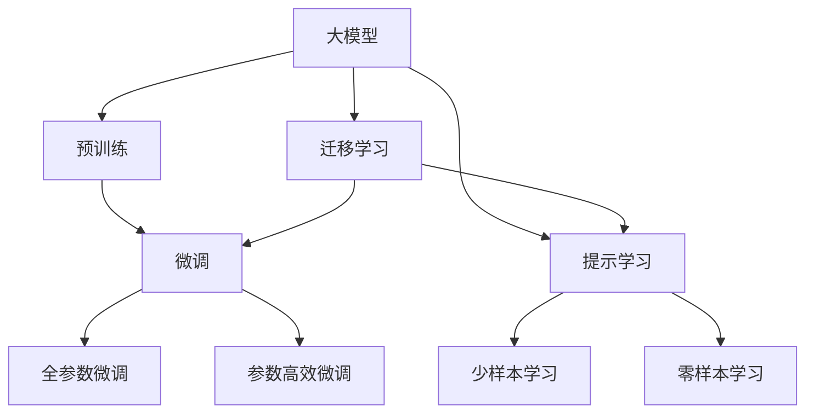

                 

# 前言：大模型的火热与微软的AI战略

## 1. 背景介绍

随着人工智能技术的迅猛发展，大模型在众多领域的应用引起了广泛关注。特别是在自然语言处理、计算机视觉、语音识别等方向，大模型以其强大的能力、灵活的适应性和广泛的应用前景，成为引领未来AI发展的重要力量。本文旨在探讨大模型的火热背后的技术原理和应用现状，并结合微软的AI战略，揭示AI技术的未来发展趋势和挑战。

### 1.1 大模型的发展历史

大模型的概念可以追溯到深度学习兴起之初。从简单的全连接神经网络，到多层感知机，再到卷积神经网络，AI研究者不断探索如何通过网络结构的优化和数据量的积累，提升模型的性能。直到2017年，OpenAI发布了Transformer模型，深度学习的研究进入了一个新的阶段。Transformer通过自注意力机制，显著提升了模型的并行计算能力，使得大规模语言模型的训练成为可能。

### 1.2 大模型的火热现象

自Transformer问世以来，大模型在多个领域取得了显著的突破。BERT、GPT、T5等模型凭借其强大的语言理解和生成能力，刷新了多项NLP任务的性能指标。这些模型不仅在学术界引发了广泛的关注，也迅速进入了工业界的应用。各大科技巨头纷纷加大对大模型的投资和研发力度，AI领域的研发资源和应用场景迅速扩张。

### 1.3 微软的AI战略

微软在AI领域的战略布局也紧跟大模型的发展步伐。微软的Azure云平台集成了众多大模型，支持自然语言处理、图像识别、语音识别等众多AI应用，成为企业AI解决方案的重要平台。微软的AI战略不仅仅是技术上的突破，更体现在如何通过AI技术推动业务创新和产业升级，构建智能生态系统，驱动经济社会的数字化转型。

## 2. 核心概念与联系

### 2.1 核心概念概述

为更好地理解大模型及其应用，本文将介绍几个关键概念：

- 大模型(Large Models)：指具有亿级参数量的深度学习模型，如BERT、GPT等。这些模型通过大规模数据训练，具备强大的表征能力和泛化能力。
- 预训练(Pre-training)：指在大规模无标签数据上，通过自监督学习任务训练通用模型的过程。预训练模型通常用于各类NLP、CV、SL等任务。
- 微调(Fine-tuning)：指在预训练模型的基础上，使用小规模标注数据进行有监督学习，优化模型在特定任务上的性能。
- 迁移学习(Transfer Learning)：指将一个领域学习到的知识，迁移到另一个相关领域，以提升模型性能。大模型通过预训练和微调，实现了知识迁移。
- 参数高效微调(Parameter-Efficient Fine-tuning)：指在微调过程中，只更新一小部分模型参数，以提高微调效率，避免过拟合。
- 提示学习(Prompt Learning)：指通过设计输入模板，引导模型输出特定结果，提高模型在少样本或零样本条件下的性能。

### 2.2 核心概念联系

这些核心概念通过以下Mermaid流程图展示其关系：



### 2.3 大模型架构

大模型通常采用Transformer架构，由多个自注意力层(Attention Layer)组成。Transformer通过多头注意力机制，捕捉输入序列中不同位置之间的关系，使得模型能够高效处理长序列。以下是Transformer的基本架构：

```plaintext
Encoder Decoder
    Attention Layer 1
        Multi-head Attention 1
    Attention Layer 2
        Multi-head Attention 2
    ...
    Attention Layer N
        Multi-head Attention N
```

每个Attention Layer包含多头自注意力子层(多头注意力、位置编码、残差连接、层归一化等)和前向网络层。Transformer架构在大模型的训练和推理中表现出色，适用于各种NLP任务。

## 3. 核心算法原理 & 具体操作步骤

### 3.1 算法原理概述

大模型的核心原理是通过预训练和微调，在特定任务上获得优异的性能。其流程通常包括以下几个步骤：

1. 预训练：在大规模无标签数据上，通过自监督学习任务训练通用模型。
2. 微调：在特定任务上，使用小规模标注数据进行有监督学习，优化模型性能。
3. 迁移学习：将预训练模型的知识迁移到新的任务上，提升模型泛化能力。

### 3.2 算法步骤详解

以下是具体的算法步骤：

**Step 1: 准备数据集**
- 收集大规模无标签数据，进行预训练。
- 收集特定任务的数据集，划分为训练集、验证集和测试集。

**Step 2: 设计任务适配层**
- 根据任务类型，设计合适的输出层和损失函数。
- 对于分类任务，通常使用softmax输出和交叉熵损失。
- 对于生成任务，通常使用语言模型解码器输出概率分布和负对数似然损失。

**Step 3: 设置超参数**
- 选择合适的优化算法及其参数，如AdamW、SGD等。
- 设置学习率、批大小、迭代轮数等。
- 设置正则化技术及强度，包括L2正则、Dropout等。

**Step 4: 执行梯度训练**
- 将训练集数据分批次输入模型，前向传播计算损失函数。
- 反向传播计算参数梯度，根据设定的优化算法和学习率更新模型参数。
- 周期性在验证集上评估模型性能，根据性能指标决定是否触发Early Stopping。
- 重复上述步骤直到满足预设的迭代轮数或Early Stopping条件。

**Step 5: 测试和部署**
- 在测试集上评估微调后模型性能，对比微调前后的精度提升。
- 使用微调后的模型对新样本进行推理预测，集成到实际应用系统中。

### 3.3 算法优缺点

大模型具有以下优点：

1. 强大的表征能力：亿级参数量的模型能够学习到丰富的语义信息，提升模型性能。
2. 灵活的适应性：可以通过微调和迁移学习，快速适应新任务和新数据。
3. 高效的推理能力：大模型通常采用高效的Transformer架构，推理速度快。

但同时也存在以下缺点：

1. 巨大的计算需求：大模型训练和推理需要高性能计算资源，成本较高。
2. 数据依赖性强：大模型需要大量标注数据进行微调，标注成本高。
3. 模型泛化能力有限：面对特定领域数据，模型性能可能不及针对该领域预训练的模型。

## 4. 数学模型和公式 & 详细讲解 & 举例说明

### 4.1 数学模型构建

我们以自然语言处理任务为例，介绍大模型的数学模型构建过程。

**输入层**：将输入文本序列$x_1, x_2, ..., x_n$转化为模型可接受的向量形式$x_1, x_2, ..., x_n$。

**编码器**：Transformer编码器由多个自注意力层和前向网络层组成，用于捕捉输入序列的语义关系。

**输出层**：根据任务类型设计输出层，如softmax输出层用于分类任务，语言模型解码器用于生成任务。

### 4.2 公式推导过程

**分类任务**：假设模型输出为$y$，损失函数为交叉熵损失：

$$
\mathcal{L}(y, \hat{y}) = -\frac{1}{N} \sum_{i=1}^N \sum_{j=1}^{n} y_j \log \hat{y}_j
$$

其中$y_j \in \{0, 1\}$为真实标签，$\hat{y}_j$为模型预测概率。

**生成任务**：假设模型输出为$y$，损失函数为负对数似然：

$$
\mathcal{L}(y, \hat{y}) = -\frac{1}{N} \sum_{i=1}^N \sum_{j=1}^{n} y_j \log \hat{y}_j
$$

其中$y_j$为真实序列，$\hat{y}_j$为模型生成序列。

### 4.3 案例分析与讲解

以BERT模型为例，其预训练任务包括掩码语言模型和下一句预测。在微调过程中，可以通过添加特定的任务适配层，实现特定任务的目标。例如，在微调BERT进行情感分析任务时，可以设计如下适配层：

```plaintext
[CLS] [BERT] --> [Softmax]
```

其中[CLS]为模型开始的特殊标记，[BERT]为预训练层，[Softmax]为输出层。通过微调，[Softmax]层能够学习到情感分类的判别能力。

## 5. 项目实践：代码实例和详细解释说明

### 5.1 开发环境搭建

以下是使用PyTorch搭建大模型微调环境的示例：

1. 安装Anaconda：
```bash
conda install anaconda
```

2. 创建虚拟环境：
```bash
conda create -n myenv python=3.8
conda activate myenv
```

3. 安装PyTorch和其他依赖：
```bash
conda install pytorch torchvision torchaudio
```

4. 安装Transformers库：
```bash
pip install transformers
```

5. 安装其他依赖：
```bash
pip install numpy pandas scikit-learn torchtext transformers
```

### 5.2 源代码详细实现

以下是BERT微调情感分析任务的代码实现：

```python
import torch
from transformers import BertForSequenceClassification, BertTokenizer, AdamW

# 定义模型和优化器
model = BertForSequenceClassification.from_pretrained('bert-base-uncased', num_labels=2)
optimizer = AdamW(model.parameters(), lr=2e-5)

# 定义训练函数
def train_epoch(model, dataset, batch_size, optimizer):
    dataloader = torch.utils.data.DataLoader(dataset, batch_size=batch_size, shuffle=True)
    model.train()
    for batch in dataloader:
        inputs, labels = batch
        labels = labels.to(device)
        outputs = model(inputs.to(device))
        loss = outputs.loss
        loss.backward()
        optimizer.step()
        optimizer.zero_grad()

# 定义测试函数
def evaluate(model, dataset, batch_size):
    dataloader = torch.utils.data.DataLoader(dataset, batch_size=batch_size)
    model.eval()
    correct, total = 0, 0
    with torch.no_grad():
        for batch in dataloader:
            inputs, labels = batch
            labels = labels.to(device)
            outputs = model(inputs.to(device))
            _, preds = torch.max(outputs, dim=1)
            correct += int((preds == labels).sum())
            total += labels.size(0)
    return correct / total

# 加载数据集
tokenizer = BertTokenizer.from_pretrained('bert-base-uncased')
train_dataset = ...
dev_dataset = ...
test_dataset = ...

# 训练和评估模型
device = torch.device('cuda') if torch.cuda.is_available() else torch.device('cpu')
model.to(device)
epochs = 5
batch_size = 16
for epoch in range(epochs):
    train_epoch(model, train_dataset, batch_size, optimizer)
    acc = evaluate(model, dev_dataset, batch_size)
    print(f'Epoch {epoch+1}, dev accuracy: {acc:.4f}')

print(f'Final dev accuracy: {evaluate(model, test_dataset, batch_size):.4f}')
```

### 5.3 代码解读与分析

1. **数据预处理**：使用BertTokenizer将输入文本转化为模型可接受的向量形式。
2. **模型定义**：使用BertForSequenceClassification定义模型，设置适当的输出层和损失函数。
3. **训练和评估**：通过DataLoader将数据分批次加载，进行训练和评估。
4. **模型保存和部署**：在测试集上评估模型后，保存模型权重，进行推理预测。

## 6. 实际应用场景

### 6.1 自然语言处理

大模型在NLP领域有广泛应用，包括文本分类、命名实体识别、关系抽取、机器翻译等。例如，使用BERT微调进行情感分析，能够快速构建情感识别系统，应用于电商评论、社交媒体情感分析等场景。

### 6.2 计算机视觉

大模型在CV领域也有重要应用，如图像分类、目标检测、语义分割等。例如，使用BERT预训练的视觉嵌入，可以用于构建高效的图像检索系统，支持大规模视觉数据的检索和匹配。

### 6.3 语音识别

大模型在语音识别领域也有显著突破，如端到端语音识别、语音情感识别等。例如，使用BERT预训练的语音嵌入，可以构建更加高效的语音识别模型，提高识别准确率和用户体验。

### 6.4 未来应用展望

未来，大模型将在更多领域得到应用，如智慧城市、医疗健康、智能制造等。例如，使用大模型进行医疗影像分析，可以提高疾病诊断的准确性和效率；使用大模型进行城市事件监测，可以提升城市治理的智能化水平。

## 7. 工具和资源推荐

### 7.1 学习资源推荐

1. 《Transformer从原理到实践》：深入浅出地介绍了Transformer原理、BERT模型、微调技术等。
2. CS224N《深度学习自然语言处理》：斯坦福大学开设的NLP明星课程，涵盖深度学习在NLP中的应用。
3. 《Natural Language Processing with Transformers》：Transformers库的作者所著，全面介绍了如何使用Transformers库进行NLP任务开发。

### 7.2 开发工具推荐

1. PyTorch：基于Python的开源深度学习框架，灵活动态的计算图，适合快速迭代研究。
2. TensorFlow：由Google主导开发的开源深度学习框架，生产部署方便。
3. Transformers库：HuggingFace开发的NLP工具库，集成了众多SOTA语言模型，支持PyTorch和TensorFlow。
4. Weights & Biases：模型训练的实验跟踪工具，可以记录和可视化模型训练过程中的各项指标。
5. TensorBoard：TensorFlow配套的可视化工具，实时监测模型训练状态。

### 7.3 相关论文推荐

1. Attention is All You Need：Transformer原论文，提出了Transformer结构。
2. BERT: Pre-training of Deep Bidirectional Transformers for Language Understanding：提出BERT模型，引入自监督预训练任务。
3. Parameter-Efficient Transfer Learning for NLP：提出Adapter等参数高效微调方法。
4. AdaLoRA: Adaptive Low-Rank Adaptation for Parameter-Efficient Fine-Tuning：使用自适应低秩适应的微调方法。
5. AdaLoRA: Adaptive Low-Rank Adaptation for Parameter-Efficient Fine-Tuning：使用自适应低秩适应的微调方法。

## 8. 总结：未来发展趋势与挑战

### 8.1 总结

本文探讨了大模型的火热现象，以及微软的AI战略，揭示了AI技术的发展方向和应用前景。通过分析大模型的架构和应用场景，展示了其强大的表征能力和灵活的适应性。同时，本文还结合实际项目实践，介绍了大模型的微调过程和代码实现，为读者提供了详细的技术指导。

### 8.2 未来发展趋势

1. 模型规模持续增大：随着算力成本的下降和数据规模的扩张，大模型的参数量还将持续增长。
2. 微调方法日趋多样：除了传统的全参数微调，未来会涌现更多参数高效的微调方法，如Prefix-Tuning、LoRA等。
3. 持续学习成为常态：大模型需要持续学习新知识以保持性能。
4. 数据依赖性降低：受提示学习等方法启发，未来的微调方法将更好地利用大模型的语言理解能力。
5. 多模态微调崛起：未来的大模型将融合视觉、语音等多模态数据，提升对现实世界的理解和建模能力。

### 8.3 面临的挑战

1. 标注成本瓶颈：大模型微调对标注数据的需求较高。
2. 模型鲁棒性不足：大模型面对域外数据时，泛化性能有限。
3. 推理效率有待提高：大模型推理速度慢，资源占用大。
4. 可解释性亟需加强：大模型决策过程缺乏可解释性。
5. 安全性有待保障：大模型可能学习到有害信息，需要加强数据和算法的安全性和鲁棒性。

### 8.4 研究展望

1. 探索无监督和半监督微调方法。
2. 研究参数高效和计算高效的微调范式。
3. 融合因果和对比学习范式。
4. 引入更多先验知识。
5. 结合因果分析和博弈论工具。

## 9. 附录：常见问题与解答

**Q1: 大模型微调是否适用于所有NLP任务？**

A: 大模型微调在大多数NLP任务上都能取得不错的效果，但对于一些特定领域的任务，如医学、法律等，仅依靠通用语料预训练的模型可能难以很好地适应。此时需要在特定领域语料上进一步预训练，再进行微调，才能获得理想效果。

**Q2: 微调过程中如何选择合适的学习率？**

A: 微调的学习率一般要比预训练时小1-2个数量级，如果使用过大的学习率，容易破坏预训练权重，导致过拟合。一般建议从1e-5开始调参，逐步减小学习率，直至收敛。也可以使用warmup策略，在开始阶段使用较小的学习率，再逐渐过渡到预设值。

**Q3: 采用大模型微调时会面临哪些资源瓶颈？**

A: 大模型需要高性能计算资源，可能遇到显存不足等问题。需要采用梯度积累、混合精度训练等技术优化资源利用率。

**Q4: 如何缓解微调过程中的过拟合问题？**

A: 数据增强、正则化、对抗训练、参数高效微调等策略可以有效缓解微调过程中的过拟合问题。

**Q5: 微调模型在落地部署时需要注意哪些问题？**

A: 模型裁剪、量化加速、服务化封装、弹性伸缩、监控告警、安全防护等都是需要考虑的因素。

---

作者：禅与计算机程序设计艺术 / Zen and the Art of Computer Programming

