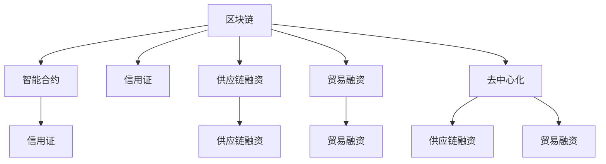

                 

# 区块链在供应链金融中的创新应用

> 关键词：区块链, 供应链金融, 智能合约, 信用证, 供应链融资, 贸易融资, 去中心化

## 1. 背景介绍

### 1.1 问题由来

供应链金融作为推动产业供应链高效运行的重要手段，近年来得到广泛关注。然而，传统供应链金融在数据共享、信任建立、风险控制等方面存在诸多问题，制约了其发展。而区块链技术的出现，为解决这些痛点提供了新的思路和方法。

### 1.2 问题核心关键点

区块链的核心优势在于其去中心化、透明性、不可篡改性等特点，能够有效解决供应链金融中的信任问题、数据孤岛问题、系统脆弱性问题等。具体来说：

- **去中心化**：区块链通过分布式账本技术，无需依赖单一中心机构，实现供应链各节点之间的直接信息共享，降低系统风险。
- **透明性**：区块链上的交易记录透明公开，所有节点均可实时查看，提高供应链的透明度。
- **不可篡改性**：区块链上的交易数据一旦记录，不可篡改，增强了数据的真实性和可靠性。

这些特性使得区块链在供应链金融中有着广阔的应用前景。通过区块链技术，供应链金融可以实现更高效、更安全、更透明的操作模式，提升整个供应链的协同效率。

### 1.3 问题研究意义

研究区块链在供应链金融中的应用，对于推动传统金融行业向数字化转型，提升供应链金融系统的效率和安全性，具有重要意义：

1. **提升供应链效率**：区块链可以快速实现数据共享和协同，提高供应链的运作效率。
2. **降低交易成本**：去中心化的交易模式可以减少中介环节，降低供应链融资和贸易融资的成本。
3. **增强金融可及性**：区块链能够为中小微企业提供更便捷、更可信的金融服务。
4. **提高风险控制能力**：通过智能合约和分布式账本，区块链可以实现实时监控和风险预警。
5. **促进数据治理**：区块链可以确保数据的真实性和完整性，推动数据治理标准化。

本文将深入探讨区块链在供应链金融中的应用场景、关键技术、以及实际应用案例，希望能够为供应链金融行业的实践者提供有益的参考。

## 2. 核心概念与联系

### 2.1 核心概念概述

为更好地理解区块链在供应链金融中的应用，本节将介绍几个关键概念：

- **区块链(Blockchain)**：一种分布式账本技术，通过去中心化的方式，记录、验证和传输数据，具有透明性、不可篡改性和高可靠性。
- **智能合约(Smart Contract)**：一种自动执行、透明、可信的合约形式，通过代码实现合同条款，无需中介介入。
- **信用证(Letter of Credit)**：金融机构出具的保证文件，为买卖双方提供信用担保。
- **供应链融资(Supply Chain Finance)**：金融机构为供应链中的企业提供融资服务，以促进供应链的协同运作。
- **贸易融资(Trade Finance)**：金融机构提供与国际贸易相关的融资服务，如开证、保理等。
- **去中心化(Decentralization)**：去除中心化机构，通过分布式网络实现信息共享和协作。

这些概念之间的逻辑关系可以通过以下Mermaid流程图来展示：



这个流程图展示了几者之间的联系：

1. 区块链通过智能合约实现信用证的功能。
2. 区块链和智能合约支持供应链融资和贸易融资。
3. 区块链和去中心化技术共同推动供应链金融的创新应用。

## 3. 核心算法原理 & 具体操作步骤
### 3.1 算法原理概述

区块链在供应链金融中的应用，主要基于区块链的去中心化、透明性和不可篡改性等特性。通过这些特性，区块链可以实现供应链各节点之间的信任建立、数据共享和协同运作，降低交易成本，提高金融服务效率和安全性。

### 3.2 算法步骤详解

基于区块链的供应链金融应用主要包括以下几个步骤：

**Step 1: 设计区块链网络架构**

- 确定供应链中的参与节点，如供应商、制造商、分销商、银行等。
- 设计区块链网络的结构，包括共识机制、区块大小、区块生成规则等。

**Step 2: 开发智能合约**

- 根据供应链的业务流程和需求，设计智能合约的逻辑和规则。
- 使用Solidity等编程语言，将智能合约代码部署到区块链上。

**Step 3: 实现数据共享和协同**

- 各节点将业务数据上传到区块链，实现数据透明共享。
- 使用智能合约自动执行合同条款，确保数据的一致性和可靠性。

**Step 4: 实现信用证功能**

- 基于区块链的信用证系统，通过智能合约自动生成、验证和管理信用证。
- 实现实时监控和风险预警，提升信用证的效率和安全性。

**Step 5: 实现供应链融资和贸易融资**

- 使用区块链和智能合约，实现供应链融资和贸易融资的自动化审批和放款。
- 提高融资的透明度和可追溯性，降低交易成本。

### 3.3 算法优缺点

区块链在供应链金融中的应用，具有以下优点：

- **提高透明度和可信度**：区块链的透明性和不可篡改性，提高了供应链金融的透明度和可信度。
- **降低交易成本**：去中心化的交易模式，减少了中介环节，降低了交易成本。
- **增强协同效率**：区块链实现的数据共享和协同，提高了供应链各节点的协同效率。

同时，也存在一些局限性：

- **技术门槛高**：区块链的开发和应用需要较高的技术门槛，一般需要具备区块链和智能合约开发能力。
- **安全性问题**：区块链的安全性依赖于共识机制和智能合约的正确实现，一旦出现漏洞，可能导致安全风险。
- **可扩展性问题**：当前区块链的网络吞吐量和扩展性还需要进一步提升，以满足大规模供应链金融的需求。

### 3.4 算法应用领域

区块链在供应链金融中的应用，主要涉及以下几个领域：

- **信用证系统**：通过区块链实现信用证的自动化生成、验证和管理，提高信用证的效率和安全性。
- **供应链融资**：基于区块链的供应链融资系统，实现自动审批和放款，降低融资成本，提高融资效率。
- **贸易融资**：利用区块链和智能合约，实现贸易融资的自动化审批和放款，提升贸易融资的透明度和可追溯性。
- **数据治理**：使用区块链记录供应链数据，确保数据的真实性和完整性，推动数据治理标准化。
- **风险控制**：通过智能合约和分布式账本，实现供应链金融的实时监控和风险预警，提升风险控制能力。

## 4. 数学模型和公式 & 详细讲解 & 举例说明
### 4.1 数学模型构建

区块链在供应链金融中的应用，涉及多个数学模型，包括智能合约的逻辑模型、信用证的验证模型等。

### 4.2 公式推导过程

以智能合约的逻辑模型为例，假设智能合约的逻辑结构如下：

```
IF condition THEN action ELSE action
```

其中，condition为合约条件，action为合约动作。设condition和action均为布尔型变量，则智能合约的逻辑公式为：

$$
\begin{cases}
0 \leq C < 1 \\
A = 0 \\
A = 1
\end{cases}
$$

其中，C为condition的真值，A为action的真值。

### 4.3 案例分析与讲解

以信用证系统为例，区块链上的信用证系统通过智能合约实现信用证的自动化生成、验证和管理。假设信用证的逻辑结构如下：

```
IF receiver on time THEN pay ELSE cancel
```

其中，receiver为接收方，on time为按时支付，pay为支付，cancel为取消。设C为receiver的真值，D为on time的真值，则信用证的逻辑公式为：

$$
\begin{cases}
0 \leq R < 1 \\
0 \leq D < 1 \\
P = 0 \\
P = 1
\end{cases}
$$

其中，R为receiver的真值，P为pay的真值。

当接收方按时支付时，P=1，表示支付成功；否则，P=0，表示支付失败。

## 5. 项目实践：代码实例和详细解释说明
### 5.1 开发环境搭建

在进行区块链项目开发前，我们需要准备好开发环境。以下是使用Python进行Hyperledger Fabric开发的环境配置流程：

1. 安装Docker：从官网下载并安装Docker，用于容器化部署区块链网络。

2. 安装Hyperledger Fabric CLI：
```bash
npm install -g fabric-cli
```

3. 创建和管理容器：
```bash
docker pull hyperledger/fabric-peer0
docker pull hyperledger/fabric-orderer0
docker pull hyperledger/fabric-ca
```

4. 启动网络节点：
```bash
fabric-ca --orderer=Orderer0
peer join --orderer=Orderer0 --caPath=ca/ -p Organization1 -n Organization1-peer0
peer join --orderer=Orderer0 --caPath=ca/ -p Organization2 -n Organization2-peer0
orderer start -p Orderer0 -n Orderer0-peer0
```

完成上述步骤后，即可在`ca`目录下生成根证书和各个节点的证书，启动网络节点，开始进行区块链项目开发。

### 5.2 源代码详细实现

下面我们以信用证系统为例，给出使用Hyperledger Fabric进行区块链开发的PyTorch代码实现。

首先，定义智能合约的逻辑：

```python
from hyperledger.fabric.core.component import Contract, ChaincodeStub, Transaction
from hyperledger.fabric.core.signature_provider import SignatureProvider

class LetterOfCredit(Contract):
    def __init__(self, stub: ChaincodeStub, sp: SignatureProvider):
        super().__init__(stub, sp)

    @staticmethod
    def create_certificate(stub: ChaincodeStub, sender: str, receiver: str, amount: int, due_date: str):
        # 创建信用证
        certificate = {"sender": sender, "receiver": receiver, "amount": amount, "due_date": due_date}
        # 将信用证记录到区块链
        stub.put_state("Certificate", json.dumps(certificate))

    @staticmethod
    def verify_certificate(stub: ChaincodeStub, certificate_id: str, due_date: str):
        # 验证信用证是否按时支付
        certificate = stub.get_state(certificate_id)
        due_date_from_chain = json.loads(certificate)["due_date"]
        return due_date_from_chain == due_date
```

然后，定义区块链网络，包括创建通道、通道成员、部署智能合约等操作：

```python
import hyperledger.fabric.core.hfapi as hfapi

# 创建通道
org1_channel = hfapi.new_channel('Organizations1Channel')

# 创建通道成员
org1_user = hfapi.new_member('User1', 'Channel1User1')
org2_user = hfapi.new_member('User2', 'Channel1User2')

# 创建通道成员组
org1_msp = hfapi.new_msp('Organizations1MSP')
org2_msp = hfapi.new_msp('Organizations2MSP')

# 创建区块链网络
org1_network = hfapi.new_fabric_network('Channel1Network')
org1_network.add_channel(org1_channel)
org1_network.add_msp(org1_msp)

# 创建区块链通道
org2_network = hfapi.new_fabric_network('Channel1Network')
org2_network.add_channel(org1_channel)
org2_network.add_msp(org2_msp)

# 部署智能合约
org1_network.deploy_contract(LetterOfCredit(), {'type': 'cc:org1:org1-cc'})
```

最后，启动区块链网络并调用智能合约：

```python
org1_network.start()
org1_network.get_client().register_user('User1', 'password')
org1_network.get_client().register_user('User2', 'password')

# 创建信用证
org1_network.get_client().execute_transaction('User1', org1_channel, 'LetterOfCredit.create_certificate', {
    'sender': 'User1',
    'receiver': 'User2',
    'amount': 1000,
    'due_date': '2023-12-31'
})

# 验证信用证是否按时支付
org1_network.get_client().execute_transaction('User2', org1_channel, 'LetterOfCredit.verify_certificate', {
    'certificate_id': 'Certificate',
    'due_date': '2023-12-31'
})
```

以上就是使用Hyperledger Fabric进行区块链项目开发的完整代码实现。可以看到，借助Hyperledger Fabric，开发者可以轻松构建和管理区块链网络，部署智能合约，实现供应链金融的自动化操作。

### 5.3 代码解读与分析

让我们再详细解读一下关键代码的实现细节：

**LetterOfCredit类**：
- 定义智能合约的逻辑，包括创建信用证和验证信用证的功能。
- 使用Hyperledger Fabric提供的API，实现区块链上的数据操作。

**通道和通道成员**：
- 使用Hyperledger Fabric提供的API，创建通道、通道成员和通道成员组。
- 通道成员代表供应链中的不同节点，通道成员组代表这些节点的身份认证信息。

**区块链网络**：
- 使用Hyperledger Fabric提供的API，创建区块链网络和区块链通道。
- 区块链网络包括通道、通道成员和通道成员组，是区块链的基本运行单位。

**智能合约部署**：
- 使用Hyperledger Fabric提供的API，在区块链网络中部署智能合约。
- 智能合约通过区块链API实现对区块链上数据的读取和写入操作。

**区块链操作**：
- 使用Hyperledger Fabric提供的API，启动区块链网络，注册用户，调用智能合约。
- 调用智能合约的API实现数据的创建、查询和验证。

通过上述代码，可以看出Hyperledger Fabric提供了丰富的API和工具，方便开发者进行区块链项目开发。开发者只需关注业务逻辑的实现，而不必过多关注区块链的底层实现细节。

当然，工业级的系统实现还需考虑更多因素，如区块链网络的扩展性、安全性、性能优化等。但核心的区块链应用流程基本与此类似。

## 6. 实际应用场景
### 6.1 智能合约系统

智能合约是区块链在供应链金融中最具代表性的应用场景之一。智能合约可以自动执行合同条款，降低交易成本，提高供应链金融的透明度和效率。

以信用证系统为例，基于区块链的智能合约系统可以实现信用证的自动化生成、验证和管理。在信用证创建时，智能合约自动记录信用证的各项信息，生成信用证的唯一标识，确保信用证的唯一性和不可篡改性。在信用证支付时，智能合约自动验证信用证的有效性，确保交易的真实性和合规性。

在实际应用中，智能合约还可以扩展到供应链融资、贸易融资、数据治理等多个场景。通过智能合约，实现供应链金融的自动化审批和放款，提升金融服务的效率和透明度。

### 6.2 供应链融资系统

供应链融资系统是区块链在供应链金融中的重要应用场景。供应链融资系统通过区块链实现数据的共享和协同，降低融资成本，提高融资效率。

以应收账款融资为例，基于区块链的供应链融资系统可以实现应收账款的不动产登记、应收账款转让、融资放款等操作。在应收账款转让时，智能合约自动记录应收账款的各项信息，生成应收账款的唯一标识，确保应收账款的唯一性和不可篡改性。在融资放款时，智能合约自动验证应收账款的有效性，确保交易的真实性和合规性。

在实际应用中，供应链融资系统可以扩展到动产融资、保理、担保等多个场景。通过区块链和智能合约，实现供应链融资的自动化审批和放款，提升供应链融资的效率和透明度。

### 6.3 贸易融资系统

贸易融资系统是区块链在供应链金融中的另一重要应用场景。贸易融资系统通过区块链实现数据的共享和协同，降低贸易融资的成本，提高融资效率。

以订单融资为例，基于区块链的贸易融资系统可以实现订单的不动产登记、订单转让、融资放款等操作。在订单转让时，智能合约自动记录订单的各项信息，生成订单的唯一标识，确保订单的唯一性和不可篡改性。在融资放款时，智能合约自动验证订单的有效性，确保交易的真实性和合规性。

在实际应用中，贸易融资系统可以扩展到信用证、保函、发票融资等多个场景。通过区块链和智能合约，实现贸易融资的自动化审批和放款，提升贸易融资的效率和透明度。

### 6.4 未来应用展望

随着区块链技术的发展，基于区块链的供应链金融应用也将不断拓展，为供应链金融行业带来更多的创新和突破。

未来，区块链在供应链金融中的应用将更加广泛和深入，包括：

- **去中心化金融(DeFi)**：通过区块链实现去中心化金融服务，降低中介环节，提高金融服务的效率和透明度。
- **供应链金融平台**：基于区块链的供应链金融平台，提供一站式的供应链金融服务，提升供应链金融的协同效率。
- **跨境支付和结算**：利用区块链的透明性和不可篡改性，实现跨境支付和结算的自动化和安全性。
- **供应链溯源**：通过区块链记录供应链各环节的信息，实现供应链的透明溯源，提升供应链的协同效率和可追溯性。

此外，区块链在供应链金融中的应用也将与其他新兴技术进行更深入的融合，如物联网、人工智能等，共同推动供应链金融的数字化转型。

## 7. 工具和资源推荐
### 7.1 学习资源推荐

为了帮助开发者系统掌握区块链在供应链金融中的应用，这里推荐一些优质的学习资源：

1. **Hyperledger Fabric官方文档**：Hyperledger Fabric提供的官方文档，包含丰富的开发指南、API文档和样例代码，是学习区块链技术的重要资源。
2. **《区块链革命》书籍**：Daniel Drescher所写，全面介绍了区块链技术的基本原理和应用场景，适合区块链技术入门和进阶学习。
3. **《智能合约：区块链技术与金融创新》书籍**：Samuel A. Rose所写，介绍了智能合约的基本概念和应用场景，适合智能合约开发学习。
4. **Blockchain Academy**：提供免费的区块链开发课程和实践项目，适合区块链技术初学者。
5. **Coursera**：提供与区块链相关的在线课程，涵盖区块链技术、智能合约、供应链金融等多个主题。

通过对这些资源的学习实践，相信你一定能够快速掌握区块链在供应链金融中的应用精髓，并用于解决实际的供应链金融问题。

### 7.2 开发工具推荐

高效的开发离不开优秀的工具支持。以下是几款用于区块链项目开发的常用工具：

1. **Hyperledger Fabric**：Hyperledger Fabric是IBM主导的开源区块链项目，提供了丰富的API和工具，方便开发者进行区块链项目开发。
2. **Web3.py**：Python编写的区块链开发框架，支持多种区块链平台，包括Hyperledger Fabric、Ethereum等，适合Python开发者使用。
3. **Truffle**：基于Solidity的智能合约开发框架，支持Ethereum智能合约的开发、测试和部署。
4. **MyEtherWallet**：支持Ethereum钱包管理和交易，方便开发者进行智能合约的测试和部署。
5. **GitHub**：全球最大的代码托管平台，适合存储和管理区块链项目的代码，方便协作开发。

合理利用这些工具，可以显著提升区块链项目开发的效率，加速技术创新的迭代。

### 7.3 相关论文推荐

区块链在供应链金融中的应用，涉及多个研究方向，以下是几篇奠基性的相关论文，推荐阅读：

1. **《Blockchain in Supply Chain Finance: A Survey》**：陈坚等著，全面介绍了区块链在供应链金融中的应用场景、技术架构和实现方法。
2. **《Smart Contracts for Supply Chain Finance: Design and Implementation》**：Pietro Tonelli等著，介绍了基于智能合约的供应链融资系统的设计和实现方法。
3. **《A Blockchain-based Solution for Cross-border Trade Finance》**：Long Wenbo等著，介绍了基于区块链的跨境贸易融资系统的设计和实现方法。
4. **《Blockchain Technology for Smart Contracts: An Overview》**：Patrick Bolingbroke等著，介绍了智能合约的基本概念和实现方法。
5. **《Blockchain and Supply Chain Finance: A Survey》**：Michael Selezi等著，全面介绍了区块链在供应链金融中的应用场景、技术架构和实现方法。

这些论文代表了大规模区块链应用的研究方向，通过学习这些前沿成果，可以帮助研究者把握学科前进方向，激发更多的创新灵感。

## 8. 总结：未来发展趋势与挑战
### 8.1 研究成果总结

本文对区块链在供应链金融中的应用进行了全面系统的介绍。首先阐述了区块链的核心优势和应用背景，明确了区块链在供应链金融中的重要价值。其次，从原理到实践，详细讲解了区块链在供应链金融中的应用场景、关键技术和实际应用案例。通过本文的系统梳理，可以看出区块链在供应链金融中的应用前景广阔，具有提升供应链协同效率、降低交易成本、提高金融服务效率和安全性等多重优势。

### 8.2 未来发展趋势

展望未来，区块链在供应链金融中的应用将呈现以下几个发展趋势：

1. **去中心化金融(DeFi)**：区块链的去中心化特性将进一步推动DeFi的发展，实现金融服务的自动化和透明化。
2. **供应链金融平台**：基于区块链的供应链金融平台将不断扩展应用场景，提供一站式的供应链金融服务。
3. **跨境支付和结算**：区块链的透明性和不可篡改性将提高跨境支付和结算的效率和安全性。
4. **供应链溯源**：通过区块链记录供应链各环节的信息，实现供应链的透明溯源，提升供应链的协同效率和可追溯性。
5. **去中介化**：区块链将进一步实现去中介化，降低交易成本，提高金融服务的效率和透明度。

这些趋势将进一步推动区块链技术在供应链金融中的应用，为供应链金融行业的创新和转型提供新的动力。

### 8.3 面临的挑战

尽管区块链在供应链金融中的应用已经取得了一定的进展，但在迈向更加智能化、普适化应用的过程中，仍然面临诸多挑战：

1. **技术复杂性**：区块链技术的实现和应用需要较高的技术门槛，开发者需要具备区块链和智能合约开发能力。
2. **安全性问题**：区块链的安全性依赖于共识机制和智能合约的正确实现，一旦出现漏洞，可能导致安全风险。
3. **可扩展性问题**：当前区块链的网络吞吐量和扩展性还需要进一步提升，以满足大规模供应链金融的需求。
4. **数据隐私保护**：区块链上的数据透明性可能带来数据隐私问题，如何保护数据隐私是区块链应用的一个重要挑战。
5. **法律和合规问题**：区块链的应用需要符合各国的法律法规，如何确保法律和合规性是区块链应用的重要挑战。

### 8.4 研究展望

面对区块链在供应链金融应用中所面临的挑战，未来的研究需要在以下几个方面寻求新的突破：

1. **简化区块链开发**：开发更易于使用的区块链开发工具和框架，降低区块链技术的应用门槛。
2. **提升区块链安全性**：研究更安全可靠的共识机制和智能合约实现方法，确保区块链的安全性。
3. **优化区块链可扩展性**：研究更高效的网络协议和共识机制，提升区块链的可扩展性。
4. **保护数据隐私**：研究数据隐私保护技术，确保区块链上的数据隐私安全。
5. **确保法律合规性**：研究区块链的法律合规性保障方法，确保区块链的应用符合各国的法律法规。

这些研究方向将推动区块链技术在供应链金融中的应用，解决现有技术难题，实现区块链技术的可持续发展。

## 9. 附录：常见问题与解答

**Q1：区块链在供应链金融中的应用与传统供应链金融有什么区别？**

A: 区块链在供应链金融中的应用与传统供应链金融有以下区别：

1. **去中心化**：区块链通过分布式账本技术，去除中心化机构，实现供应链各节点之间的直接信息共享，降低系统风险。
2. **透明性**：区块链上的交易记录透明公开，所有节点均可实时查看，提高供应链的透明度。
3. **不可篡改性**：区块链上的交易数据一旦记录，不可篡改，增强了数据的真实性和可靠性。

这些优势使得区块链在供应链金融中的应用具有更高的效率和安全性。

**Q2：区块链在供应链金融中的应用需要哪些技术支持？**

A: 区块链在供应链金融中的应用需要以下技术支持：

1. **区块链平台**：如Hyperledger Fabric、Ethereum等，提供区块链开发和部署的基础平台。
2. **智能合约**：如Solidity等编程语言，实现区块链上的自动化操作。
3. **分布式账本**：记录区块链上的交易数据，提供透明、不可篡改的数据存储。
4. **共识机制**：如PoW、PoS、DPoS等，确保区块链上的交易数据一致性和安全性。

这些技术是区块链在供应链金融应用的基础，需要开发者具备相关的技术能力。

**Q3：区块链在供应链金融中的应用有哪些实际案例？**

A: 区块链在供应链金融中的实际应用案例包括：

1. **应收账款融资**：通过区块链记录应收账款的各项信息，确保应收账款的唯一性和不可篡改性，实现应收账款融资的自动化审批和放款。
2. **信用证系统**：基于区块链的信用证系统，实现信用证的自动化生成、验证和管理。
3. **供应链融资**：利用区块链实现供应链融资的自动化审批和放款，提升供应链融资的效率和透明度。
4. **跨境支付和结算**：利用区块链的透明性和不可篡改性，实现跨境支付和结算的自动化和安全性。

这些实际应用案例展示了区块链在供应链金融中的广泛应用前景。

**Q4：区块链在供应链金融中的应用面临哪些挑战？**

A: 区块链在供应链金融中的应用面临以下挑战：

1. **技术复杂性**：区块链技术的实现和应用需要较高的技术门槛，开发者需要具备区块链和智能合约开发能力。
2. **安全性问题**：区块链的安全性依赖于共识机制和智能合约的正确实现，一旦出现漏洞，可能导致安全风险。
3. **可扩展性问题**：当前区块链的网络吞吐量和扩展性还需要进一步提升，以满足大规模供应链金融的需求。
4. **数据隐私保护**：区块链上的数据透明性可能带来数据隐私问题，如何保护数据隐私是区块链应用的一个重要挑战。
5. **法律和合规问题**：区块链的应用需要符合各国的法律法规，如何确保法律和合规性是区块链应用的重要挑战。

这些挑战需要进一步研究解决，才能推动区块链技术在供应链金融中的广泛应用。

**Q5：区块链在供应链金融中的应用前景如何？**

A: 区块链在供应链金融中的应用前景广阔，具体表现为：

1. **提升供应链协同效率**：区块链通过实现数据的共享和协同，提高供应链各节点的协同效率。
2. **降低交易成本**：区块链的透明性和不可篡改性，降低中介环节，降低交易成本。
3. **提高金融服务效率**：区块链的自动化操作，提升供应链金融的效率和透明度。
4. **保护数据隐私**：区块链提供透明、不可篡改的数据存储，保护数据隐私。

这些优势将推动区块链技术在供应链金融中的广泛应用，带来更多的创新和突破。

通过本文的系统梳理，可以看出区块链在供应链金融中的应用前景广阔，具有提升供应链协同效率、降低交易成本、提高金融服务效率和安全性等多重优势。未来，随着区块链技术的不断发展和应用，区块链在供应链金融中的作用将进一步凸显，为供应链金融行业的创新和转型提供新的动力。

