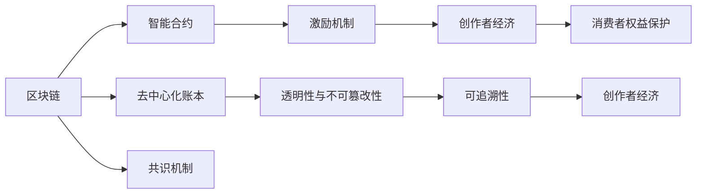

                 

# 区块链技术在注意力经济中的应用前景

## 1. 背景介绍

随着信息技术的迅猛发展，传统经济领域发生了深刻的变革，尤其是注意力经济(Anti-rent Economy)的兴起，正在重新塑造价值创造和价值分配的规则。注意力经济强调“注意力”这一稀缺资源的重要性，主张通过吸引和集中消费者的注意力，产生市场价值。区块链技术的出现，为这一新兴经济模式提供了全新的计算范式和信任机制，带来了巨大的发展潜力。本文旨在探讨区块链技术在注意力经济中的应用前景，分析其优势、挑战与未来方向。

## 2. 核心概念与联系

### 2.1 核心概念概述

区块链（Blockchain）是一种分布式账本技术，通过去中心化的方式记录交易信息，确保数据的透明、不可篡改和可追溯。其核心组件包括区块链网络、共识机制、智能合约、加密算法等。区块链技术不仅应用于金融、供应链、医疗等领域，也开始渗透到注意力经济中，助力创作者与消费者的连接和互动，实现价值创造和分配的智能化。

注意力经济（Anti-rent Economy）基于信息与服务的消费，强调“注意力”这一稀缺资源的经济价值。创作者通过提供有价值的内容，吸引和保持消费者的关注，从而获得经济回报。区块链技术通过智能合约、激励机制等手段，可以构建起信任机制，保护创作者权益，优化价值分配，推动注意力经济的健康发展。

### 2.2 核心概念原理和架构的 Mermaid 流程图



## 3. 核心算法原理 & 具体操作步骤

### 3.1 算法原理概述

区块链在注意力经济中的应用主要体现在以下几个方面：

1. **去中心化的价值生成与分配机制**：区块链通过智能合约自动执行分配规则，确保价值生成与分配的透明性和公正性。
2. **创作者权益保护**：区块链的不可篡改性和可追溯性，为创作者提供版权保护，防止作品被随意篡改或盗用。
3. **激励机制设计**：区块链的激励机制可以设计合理的奖励模型，鼓励创作者产出有价值的内容，同时吸引消费者参与和贡献。
4. **智能合约**：通过智能合约，实现自动化交易和数据记录，降低信任成本和交易成本。

### 3.2 算法步骤详解

#### 3.2.1 去中心化价值生成与分配机制

1. **创作者产出内容**：创作者在区块链平台上产出有价值的内容，如文章、音乐、视频等。
2. **内容上传与验证**：创作者将作品上传到区块链平台，智能合约自动验证内容质量，确保其符合平台标准。
3. **激励机制**：根据创作者的内容质量、用户互动和平台规则，智能合约自动分配激励（如代币、收益分成等）。

#### 3.2.2 创作者权益保护

1. **数字版权登记**：创作者将作品进行数字版权登记，区块链系统自动生成数字证书，记录作品的创作时间和原创者信息。
2. **版权保护**：任何人未经创作者授权，无法修改或盗用作品，确保作品原创性和版权。
3. **版权交易**：创作者可以将其版权进行交易、授权或转让，平台自动记录和验证交易过程。

#### 3.2.3 激励机制设计

1. **内容质量评价**：用户通过点赞、评论、分享等方式对内容进行评价，智能合约根据评价结果分配奖励。
2. **平台规则**：平台制定内容质量评价规则和激励分配规则，确保激励机制的公正性。
3. **激励发放**：智能合约自动将激励分配给创作者，确保其按时获得回报。

### 3.3 算法优缺点

#### 3.3.1 优点

1. **去中心化**：消除中间环节，提升价值分配的透明度和公平性。
2. **信任机制**：基于区块链的数字证书和智能合约，构建信任环境。
3. **自动化**：自动执行激励分配，减少人为干预，提升效率。
4. **安全可靠**：区块链的不可篡改性和透明性，保障创作者权益和作品安全。

#### 3.3.2 缺点

1. **技术复杂性**：区块链技术门槛较高，需要专业知识维护和运营。
2. **扩展性问题**：大量用户同时访问平台，可能带来性能瓶颈和交易费用。
3. **激励模型设计**：合理的激励模型设计复杂，需要多次迭代和优化。
4. **平台治理**：平台规则的制定和调整需要社区共识，可能面临治理难题。

### 3.4 算法应用领域

区块链技术在注意力经济中的应用涵盖多个领域，主要包括：

1. **内容创作平台**：如音乐、视频、文章等内容的创作与分发。
2. **创作者权益保护**：版权登记、交易、授权等。
3. **内容质量评价**：用户评价、反馈、推荐等。
4. **激励机制设计**：平台奖励、用户激励等。
5. **智能合约与自动化交易**：内容发布、版权保护、激励分配等。

## 4. 数学模型和公式 & 详细讲解 & 举例说明

### 4.1 数学模型构建

我们以一个简单的内容创作与激励分配模型为例，构建其数学模型。

设创作者在平台上发布一篇文章，文章的阅读次数为 $R$，点赞次数为 $L$，文章质量评价为 $Q$，平台规定的最小质量评价为 $Q_{min}$。设平台对每篇文章分配的初始激励为 $I_0$，每次点赞增加的激励为 $I_L$，每篇阅读增加的激励为 $I_R$。创作者获得的总激励为 $I$。

则激励分配的数学模型为：

$$
I = I_0 + I_L \times L + I_R \times R
$$

### 4.2 公式推导过程

1. **初始激励分配**：创作者发布文章后，平台根据预定的规则自动分配初始激励 $I_0$。
2. **点赞激励**：用户每次点赞文章，平台根据点赞次数 $L$，增加激励 $I_L$。
3. **阅读激励**：用户每阅读一次文章，平台增加阅读激励 $I_R$。
4. **质量评价激励**：如果文章质量评价 $Q$ 达到平台规定的最小质量评价 $Q_{min}$，平台额外增加激励 $I_{Q_{min}}$。

### 4.3 案例分析与讲解

以一个音乐平台为例，分析区块链技术如何应用于创作者激励机制。

1. **创作者发布歌曲**：创作者在平台上发布一首新歌，智能合约自动分配初始激励。
2. **用户互动评价**：用户通过听歌、评论、分享等方式对歌曲进行评价，智能合约根据评价结果，自动增加激励。
3. **平台规则**：平台规定最低质量评价和激励标准，确保激励机制的公正性。
4. **激励发放**：智能合约自动将激励分配给创作者，确保其按时获得回报。

## 5. 项目实践：代码实例和详细解释说明

### 5.1 开发环境搭建

1. **安装Node.js和npm**：
   ```bash
   curl -fsSL https://deb.nodesource.com/setup_16.x | sudo -E bash -
   sudo apt-get install -y nodejs
   ```

2. **安装以太坊客户端**：
   ```bash
   npm install -g ethers
   ```

3. **安装Web3.js**：
   ```bash
   npm install web3
   ```

### 5.2 源代码详细实现

以下是一个简单的基于以太坊的智能合约，用于激励创作者的内容创作：

```javascript
// SPDX-License-Identifier: MIT
pragma solidity ^0.8.0;

contract ContentPlatform {
    address public creator;
    uint public initialReward;
    uint public likeReward;
    uint public viewReward;
    uint public qualityReward;
    
    event LogReward(uint amount, uint type);

    constructor() {
        creator = msg.sender;
        initialReward = 100;
        likeReward = 1;
        viewReward = 1;
        qualityReward = 2;
    }

    function publishContent(uint contentID) {
        uint totalReward = initialReward;
        emit LogReward(totalReward, 0);
        creator.transfer(totalReward);
    }

    function likeContent(uint contentID) {
        uint amount = likeReward;
        emit LogReward(amount, 1);
        creator.transfer(amount);
    }

    function viewContent(uint contentID) {
        uint amount = viewReward;
        emit LogReward(amount, 2);
        creator.transfer(amount);
    }

    function qualityEvaluation(uint contentID) {
        uint amount = qualityReward;
        emit LogReward(amount, 3);
        creator.transfer(amount);
    }

    function checkQuality(uint contentID) {
        // 模拟质量评价逻辑
        // 这里需要根据具体平台规则实现
        // 如果质量评价达到平台规定的最小质量评价 Q_min
        // 自动增加质量激励 Q_reward
        // 这里只是为了演示，不进行实际质量评价
    }
}
```

### 5.3 代码解读与分析

上述智能合约实现了简单的激励分配机制，主要包括：

1. **初始激励分配**：创作者发布内容后，智能合约自动分配初始激励。
2. **点赞激励**：用户每次点赞，增加点赞激励。
3. **阅读激励**：用户每阅读一次，增加阅读激励。
4. **质量评价激励**：创作者通过调用函数进行质量评价，根据评价结果自动增加激励。

### 5.4 运行结果展示

以下是一个简单的示例，演示如何在以太坊网络上部署和调用上述智能合约：

```javascript
const { ethers } = require('ethers');

async function main() {
    const provider = new ethers.providers.InfuraProvider('mainnet', 'your-infra-api-key');
    const wallet = new ethers.Wallet('your-private-key', provider);

    const contract = new ethers.Contract('your-contract-address', ContentPlatform.abi, wallet);

    // 创作者发布内容
    await contract.publishContent(123);

    // 用户点赞
    await contract.likeContent(123);

    // 用户阅读
    await contract.viewContent(123);

    // 创作者进行质量评价
    await contract.checkQuality(123);
}

main().catch(console.error);
```

## 6. 实际应用场景

### 6.1 内容创作平台

区块链技术可以为内容创作平台提供去中心化的价值生成与分配机制。创作者可以通过智能合约获得激励，平台自动记录和验证交易，确保创作者权益和作品安全。

#### 6.1.1 内容创作平台示例

**平台一：音乐平台**
音乐创作者在平台上发布新歌，用户通过听歌、点赞、评论等方式互动，平台自动分配激励给创作者。

**平台二：视频平台**
视频创作者发布新视频，用户通过观看、点赞、评论等方式互动，平台根据互动情况自动分配激励。

**平台三：文章平台**
文章创作者发布新文章，用户通过阅读、点赞、评论等方式互动，平台根据互动情况自动分配激励。

### 6.2 创作者权益保护

区块链技术可以提供创作者权益保护机制，通过数字版权登记、版权交易等功能，保护创作者权益。

#### 6.2.1 创作者权益保护示例

**版权登记**
创作者将作品进行数字版权登记，区块链系统自动生成数字证书，记录作品的创作时间和原创者信息。

**版权交易**
创作者可以将其版权进行交易、授权或转让，平台自动记录和验证交易过程。

**版权保护**
任何人未经创作者授权，无法修改或盗用作品，确保作品原创性和版权。

### 6.3 内容质量评价

区块链技术可以提供内容质量评价机制，通过用户评价、反馈、推荐等方式，优化内容质量。

#### 6.3.1 内容质量评价示例

**用户评价**
用户通过点赞、评论、分享等方式对内容进行评价，平台根据评价结果自动分配激励。

**反馈机制**
平台提供反馈机制，创作者可以收集用户反馈，改进内容质量。

**推荐算法**
平台基于用户评价和互动数据，通过推荐算法推荐高质量内容，提升用户体验。

## 7. 工具和资源推荐

### 7.1 学习资源推荐

1. **《区块链技术与应用》**：一本系统介绍区块链技术的书籍，适合初学者和进阶者。
2. **《智能合约与区块链编程》**：一本介绍智能合约开发和区块链编程的书籍，适合开发人员学习。
3. **区块链开发社区**：如Blockchain Stack Exchange、Blockchain News、Medium等，可以获取最新的区块链技术和应用资讯。
4. **在线课程**：如Coursera、Udacity等平台上的区块链和智能合约课程。

### 7.2 开发工具推荐

1. **以太坊客户端**：如Infura、Alchemy、Etherscan等，提供以太坊节点和开发工具。
2. **智能合约编辑器**：如Remix IDE、Truffle、Hardhat等，方便智能合约开发和测试。
3. **IDE和代码编辑器**：如VS Code、WebStorm等，支持智能合约开发和调试。

### 7.3 相关论文推荐

1. **《区块链技术在内容创作与分发中的应用》**：探讨区块链技术在内容创作平台中的应用，如音乐、视频、文章等。
2. **《智能合约在创作者激励中的设计与应用》**：分析智能合约在创作者激励机制中的设计和实现。
3. **《区块链在版权保护中的应用》**：研究区块链技术在版权登记、版权交易中的应用。

## 8. 总结：未来发展趋势与挑战

### 8.1 研究成果总结

区块链技术在注意力经济中的应用前景广阔，具有去中心化、透明性、不可篡改性等特点，可以推动创作者经济的发展。目前已有多个平台和项目在探索区块链在注意力经济中的应用，但仍有诸多挑战需要克服。

### 8.2 未来发展趋势

1. **技术成熟**：随着区块链技术的不断发展和成熟，其应用场景将进一步扩大。
2. **跨链互操作**：不同区块链平台之间的互操作性将增强，形成一个统一的数字经济体系。
3. **智能合约优化**：智能合约的设计和优化将更加精细化，提升系统的稳定性和安全性。
4. **激励机制创新**：更多的激励机制将被设计，以更好地激发创作者和消费者的积极性。
5. **平台治理优化**：平台治理机制将不断优化，提升社区参与度和平台公平性。

### 8.3 面临的挑战

1. **技术门槛高**：区块链技术的门槛较高，需要专业知识维护和运营。
2. **扩展性问题**：大量用户同时访问平台，可能带来性能瓶颈和交易费用。
3. **激励模型设计**：合理的激励模型设计复杂，需要多次迭代和优化。
4. **平台治理**：平台规则的制定和调整需要社区共识，可能面临治理难题。

### 8.4 研究展望

未来，区块链技术在注意力经济中的应用将不断深入，但仍需解决一些关键问题：

1. **技术标准化**：制定区块链技术的标准化规范，提升互操作性和可用性。
2. **激励机制设计**：设计更加公平、合理的激励机制，激励创作者产出高质量内容。
3. **平台治理优化**：优化平台治理机制，提高社区参与度和平台公平性。
4. **跨链互操作**：促进不同区块链平台之间的互操作性，形成一个统一的数字经济体系。

区块链技术在注意力经济中的应用前景广阔，但需要在技术、治理、激励等方面不断优化和创新，才能发挥其最大的价值。相信随着技术的不断发展，区块链技术将为创作者经济带来更多的可能性，为消费者提供更加丰富和高质量的内容。

## 9. 附录：常见问题与解答

**Q1: 区块链技术在注意力经济中具体应用有哪些？**

A: 区块链技术在注意力经济中的应用主要包括：

1. **去中心化的价值生成与分配机制**：通过智能合约自动执行分配规则，确保价值生成与分配的透明性和公正性。
2. **创作者权益保护**：利用区块链的不可篡改性和可追溯性，为创作者提供版权保护，防止作品被随意篡改或盗用。
3. **激励机制设计**：通过合理的激励模型，鼓励创作者产出有价值的内容，同时吸引消费者参与和贡献。

**Q2: 区块链技术在注意力经济中存在哪些挑战？**

A: 区块链技术在注意力经济中存在以下挑战：

1. **技术门槛高**：区块链技术的门槛较高，需要专业知识维护和运营。
2. **扩展性问题**：大量用户同时访问平台，可能带来性能瓶颈和交易费用。
3. **激励模型设计**：合理的激励模型设计复杂，需要多次迭代和优化。
4. **平台治理**：平台规则的制定和调整需要社区共识，可能面临治理难题。

**Q3: 区块链技术在注意力经济中的应用前景如何？**

A: 区块链技术在注意力经济中的应用前景广阔，具有去中心化、透明性、不可篡改性等特点，可以推动创作者经济的发展。未来，区块链技术将不断成熟，其应用场景将进一步扩大，激励机制将更加合理，平台治理将不断优化，为创作者和消费者提供更加丰富和高质量的内容。

**Q4: 如何克服区块链技术在注意力经济中的挑战？**

A: 克服区块链技术在注意力经济中的挑战需要多方面的努力：

1. **技术标准化**：制定区块链技术的标准化规范，提升互操作性和可用性。
2. **激励机制设计**：设计更加公平、合理的激励机制，激励创作者产出高质量内容。
3. **平台治理优化**：优化平台治理机制，提高社区参与度和平台公平性。
4. **跨链互操作**：促进不同区块链平台之间的互操作性，形成一个统一的数字经济体系。

---

作者：禅与计算机程序设计艺术 / Zen and the Art of Computer Programming

