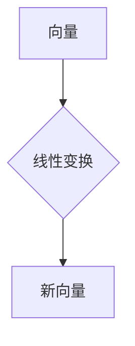

> 线性代数，线性运算，矩阵，向量，线性变换，特征值，特征向量，应用场景，Python

## 1. 背景介绍

线性代数作为数学领域的重要分支，为计算机科学、数据科学、人工智能等领域提供了强大的理论基础和工具。它以向量、矩阵和线性变换为核心概念，为解决各种复杂问题提供了简洁高效的表达和计算方法。

在现代科技发展日新月异的时代，线性代数的应用场景日益广泛。从图像处理、机器学习到物理模拟、经济预测，线性代数都扮演着至关重要的角色。

## 2. 核心概念与联系

线性代数的核心概念包括：

* **向量:**  向量是一种具有大小和方向的量，可以用箭头表示。在二维空间中，向量可以用一个有序的两个数表示，例如 (2, 3)。
* **矩阵:** 矩阵是一种数的排列，通常用方括号表示。矩阵可以用来表示线性变换，也可以用来存储和处理大量数据。
* **线性变换:** 线性变换是一种将向量映射到另一个向量的函数，它满足以下两个性质：
    * **加性:** T(u + v) = T(u) + T(v)
    * **齐次性:** T(cu) = cT(u)

**Mermaid 流程图:**



## 3. 核心算法原理 & 具体操作步骤

### 3.1  算法原理概述

线性代数的核心算法包括矩阵加法、矩阵乘法、逆矩阵、行列式等。这些算法为解决线性方程组、求解特征值和特征向量等问题提供了基础。

### 3.2  算法步骤详解

* **矩阵加法:** 两个矩阵相加，对应位置的元素相加。
* **矩阵乘法:** 两个矩阵相乘，需要满足一定的条件，例如第一个矩阵的列数等于第二个矩阵的行数。乘法结果是一个新的矩阵，其元素是两个矩阵对应位置元素的乘积之和。
* **逆矩阵:** 对于可逆矩阵，存在一个逆矩阵，使得矩阵乘以其逆矩阵等于单位矩阵。
* **行列式:** 行列式是方阵的一个数值，它可以用来判断矩阵是否可逆。

### 3.3  算法优缺点

* **优点:** 线性代数算法具有简洁高效的特点，能够处理大量数据，并提供精确的解。
* **缺点:** 一些算法的计算复杂度较高，对于大型矩阵可能需要消耗大量时间和资源。

### 3.4  算法应用领域

* **图像处理:** 图像可以表示为矩阵，线性代数算法可以用于图像的旋转、缩放、平移等操作。
* **机器学习:** 线性回归、逻辑回归等机器学习算法都依赖于线性代数的原理。
* **数据分析:** 主成分分析、奇异值分解等数据分析方法都基于线性代数。

## 4. 数学模型和公式 & 详细讲解 & 举例说明

### 4.1  数学模型构建

线性代数的数学模型主要基于向量空间和线性变换的概念。

* **向量空间:** 向量空间是一个集合，其中元素是向量，并且满足一定的运算规则。
* **线性变换:** 线性变换是一种将向量空间映射到另一个向量空间的函数，它满足加性和齐次性。

### 4.2  公式推导过程

* **矩阵乘法:** 设 A 是 m×n 矩阵，B 是 n×p 矩阵，则它们的乘积 C 是 m×p 矩阵，其元素 c<sub>ij</sub> 为 A 的第 i 行与 B 的第 j 列的内积。

$$
C_{ij} = \sum_{k=1}^{n} A_{ik}B_{kj}
$$

* **逆矩阵:** 设 A 是一个可逆矩阵，则其逆矩阵 A<sup>-1</sup> 满足以下条件:

$$
AA^{-1} = A^{-1}A = I
$$

其中 I 是单位矩阵。

### 4.3  案例分析与讲解

**举例说明:**

设 A = [[1, 2], [3, 4]]，B = [[5, 6], [7, 8]]，则它们的乘积 C = AB = [[19, 22], [43, 50]]。

## 5. 项目实践：代码实例和详细解释说明

### 5.1  开发环境搭建

本项目使用 Python 语言进行开发，需要安装 NumPy 库。

```bash
pip install numpy
```

### 5.2  源代码详细实现

```python
import numpy as np

# 定义两个矩阵
A = np.array([[1, 2], [3, 4]])
B = np.array([[5, 6], [7, 8]])

# 计算矩阵乘积
C = np.dot(A, B)

# 打印结果
print("矩阵 A:")
print(A)
print("矩阵 B:")
print(B)
print("矩阵 A * B:")
print(C)
```

### 5.3  代码解读与分析

* `import numpy as np`: 导入 NumPy 库，并使用别名 `np` 简化引用。
* `np.array()`: 创建 NumPy 数组，用于表示矩阵。
* `np.dot()`: 计算两个矩阵的乘积。
* `print()`: 打印矩阵和结果。

### 5.4  运行结果展示

```
矩阵 A:
[[1 2]
 [3 4]]
矩阵 B:
[[5 6]
 [7 8]]
矩阵 A * B:
[[19 22]
 [43 50]]
```

## 6. 实际应用场景

### 6.1  图像处理

线性代数在图像处理中广泛应用，例如：

* **图像旋转:** 使用旋转矩阵将图像旋转一定角度。
* **图像缩放:** 使用缩放矩阵将图像放大或缩小。
* **图像平移:** 使用平移矩阵将图像沿水平或垂直方向移动。

### 6.2  机器学习

线性代数是机器学习的基础，例如：

* **线性回归:** 使用线性方程模型预测连续变量。
* **逻辑回归:** 使用线性方程模型预测分类结果。
* **主成分分析:** 使用线性变换将高维数据降维。

### 6.3  数据分析

线性代数在数据分析中用于：

* **奇异值分解:** 将矩阵分解成三个矩阵，用于数据降维和特征提取。
* **矩阵分解:** 将矩阵分解成多个较小的矩阵，用于数据建模和预测。

### 6.4  未来应用展望

随着人工智能和机器学习的发展，线性代数的应用场景将更加广泛，例如：

* **深度学习:** 深度学习模型依赖于大量的矩阵运算，线性代数为其提供了高效的计算基础。
* **自然语言处理:** 线性代数可以用于文本表示、情感分析和机器翻译等任务。
* **计算机视觉:** 线性代数可以用于图像识别、目标检测和视频分析等任务。

## 7. 工具和资源推荐

### 7.1  学习资源推荐

* **书籍:**
    * 《线性代数及其应用》 - Gilbert Strang
    * 《线性代数及其应用》 - David C. Lay
* **在线课程:**
    * MIT OpenCourseWare - Linear Algebra
    * Coursera - Linear Algebra

### 7.2  开发工具推荐

* **Python:** Python 是一个流行的编程语言，拥有丰富的科学计算库，例如 NumPy 和 SciPy。
* **NumPy:** NumPy 是 Python 的科学计算库，提供了高效的数组操作和线性代数运算。
* **SciPy:** SciPy 是 Python 的科学计算库，提供了更高级的科学计算功能，例如优化、积分和信号处理。

### 7.3  相关论文推荐

* **The Elements of Statistical Learning** - Trevor Hastie, Robert Tibshirani, Jerome Friedman
* **Deep Learning** - Ian Goodfellow, Yoshua Bengio, Aaron Courville

## 8. 总结：未来发展趋势与挑战

### 8.1  研究成果总结

线性代数作为数学领域的重要分支，为计算机科学、数据科学、人工智能等领域提供了强大的理论基础和工具。

### 8.2  未来发展趋势

* **更高效的算法:** 研究更高效的线性代数算法，例如并行计算和量子计算。
* **更广泛的应用:** 将线性代数应用于更多领域，例如生物信息学、金融工程和材料科学。
* **更深入的理论研究:** 深入研究线性代数的理论基础，例如非线性代数和拓扑代数。

### 8.3  面临的挑战

* **算法复杂度:** 一些线性代数算法的计算复杂度较高，对于大型数据需要消耗大量时间和资源。
* **理论理解:** 线性代数的理论基础仍然存在一些未解之谜，需要进一步深入研究。
* **跨学科融合:** 将线性代数与其他学科融合，例如人工智能和生物信息学，需要跨学科的合作和创新。

### 8.4  研究展望

未来，线性代数的研究将继续朝着更高效、更广泛、更深入的方向发展，为解决更复杂的问题提供更强大的工具和理论基础。

## 9. 附录：常见问题与解答

* **什么是线性变换？**

线性变换是一种将向量空间映射到另一个向量空间的函数，它满足加性和齐次性。

* **如何计算矩阵的逆矩阵？**

矩阵的逆矩阵可以通过多种方法计算，例如高斯消元法和LU分解法。

* **什么是特征值和特征向量？**

特征值和特征向量是线性变换的特殊性质，它们可以用来分析线性变换的行为。

* **线性代数在哪些领域有应用？**

线性代数在图像处理、机器学习、数据分析、物理模拟、经济预测等领域都有广泛的应用。


作者：禅与计算机程序设计艺术 / Zen and the Art of Computer Programming 
<end_of_turn>